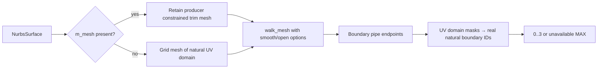

# 08 · Trimmed surfaces and periodic seams

Start from checkpoint **07** in `/tmp/viewer-course`; stop its previous Trunk process before serving this checkpoint. The complete [08.patch](reconstruction/patches/08.patch) contains every import, replacement, fixture and parity change below.

`src/` paths are relative to `/tmp/viewer-course/session_viewer`; `COURSE_REPO` is the maintained viewer directory exported in checkpoint 00.



Text equivalent: a cached producer mesh retains its real trim region; an uncached surface uses its natural domain, and only genuine nonperiodic domain boundaries acquire IDs 0–3.

**TYPE BY HAND — `src/app/walk/brep.rs` · `walk_surface` · Replace.**

```rust
pub fn walk_surface(arena: &mut ArenaRows, ink: &mut Ink, s: &NurbsSurface, cx: &WalkCx) -> Row {
    let mut sm = if let Some(mesh) = &s.m_mesh {
        mesh.clone()
    } else {
        RemeshNurbsSurfaceGrid::from_u_v_q(s.clone(), 0, 0, QUALITY.0, QUALITY.1)
    };
    if let Some(c) = s.facecolors.first() {
        sm.set_objectcolor(c.clone());
    }
    let opts = MeshOpts {
        sheet_lanes: false,
        allow_open: true,
        smooth: true,
    };
    let first_pipe = ink.seg.pipes.len();
    let row = walk_mesh(arena, ink, &sm, &MeshCx { cx, opts: &opts });
    map_surface_boundaries(ink, s, &sm, first_pipe);
    row
}
```

**TYPE BY HAND — `src/app/walk/brep.rs` · `map_surface_boundaries` · Insert immediately after walk_surface.**

```rust
fn map_surface_boundaries(ink: &mut Ink, s: &NurbsSurface, mesh: &Mesh, first_pipe: usize) {
    let mut masks = std::collections::HashMap::<[u32; 3], u8>::new();
    for vertex in mesh.vertex.values() {
        let mut mask = 0u8;
        for (direction, name) in [(0, "u"), (1, "v")] {
            if s.is_closed(direction) {
                continue;
            }
            let (Some(&parameter), Some((start, end))) =
                (vertex.attributes.get(name), s.domain(direction))
            else {
                continue;
            };
            if parameter == start {
                mask |= 1 << (direction * 2);
            }
            if parameter == end {
                mask |= 1 << (direction * 2 + 1);
            }
        }
        let position = [vertex.x as f32, vertex.y as f32, vertex.z as f32];
        *masks.entry(position.map(f32::to_bits)).or_insert(0) |= mask;
    }
    ink.seg.pipe_ids.resize(ink.seg.pipes.len(), u32::MAX);
    for index in first_pipe..ink.seg.pipes.len() {
        let pipe = &ink.seg.pipes[index];
        let a = masks.get(&pipe.p0.map(f32::to_bits)).copied().unwrap_or(0);
        let b = masks.get(&pipe.p1.map(f32::to_bits)).copied().unwrap_or(0);
        let common = a & b;
        ink.seg.pipe_ids[index] = if common.count_ones() == 1 {
            common.trailing_zeros()
        } else {
            u32::MAX
        };
    }
}
```

**COPY/PASTE — `src/app/walk/brep.rs` · kernel imports · add `Mesh` to `use session_rust::{BRep, Color, Mesh, NurbsSurface, RenderMesh};`.** The patch supplies the complete cached-trimmed surface fixture and the torus seam fixture; their loops and source objects are local source data.

A trimmed hole is not assigned an invented natural-domain ID; a periodic seam remains a repeated use of the original BRep edge. `constrained_chain` distinguishes use occurrences, and `iso_chain` wraps a closed parameter direction only to an exact existing face sample.

Expected browser: the curved cached patch retains an open hole instead of filling its four-corner domain, and the torus has no artificial cut across its periodic seam. The supplied assertions check source IDs and mesh provenance independently of pixel appearance.

**COPY/PASTE — `src/fixture.rs` · `trimmed_surface` and `build` · replace the complete local fixture.**

```rust
//! Local source geometry and its prepared GPU rows; no fetch, credentials or baked transforms.
use crate::app::walk::brep::{walk_brep, walk_surface};
use crate::app::walk::mesh_ink::Ink;
use crate::app::walk::{Row, WalkCx};
use crate::engine::gpu::Upload;
use crate::engine::gpu::objects::ObjectRow;
use session_rust::{BRep, Color, Geometry, NurbsSurface, Point, Xform};
use std::rc::Rc;

/// Retain original f64 source objects independently from their GPU row addresses.
pub struct CadFixture {
    pub upload: Upload,
    pub sources: Vec<Geometry>,
    pub identities: Vec<SourceIdentity>,
    pub pipe_source_edges: Vec<u32>,
}

/// An object row is a display address; the source GUID belongs to the retained geometry.
#[derive(serde::Serialize)]
pub struct SourceIdentity {
    pub object_row: u32,
    pub guid: String,
    pub kind: &'static str,
}

impl CadFixture {
    /// Allocate no geometry until the selected local case appends its source objects.
    fn new() -> Self {
        Self {
            upload: Upload::default(),
            sources: Vec::new(),
            identities: Vec::new(),
            pipe_source_edges: Vec::new(),
        }
    }

    /// Prepare one source object, retaining its identity and source-space geometry together.
    fn add(&mut self, geometry: Geometry, place: Xform) {
        let row = self.upload.obj.rows.len() as u32;
        let first_pipe = self.upload.seg.pipes.len();
        let context = WalkCx {
            vert_base: 0,
            cloud_px: 0.0,
            row,
        };
        let mut ink = Ink {
            seg: &mut self.upload.seg,
            glyph: &mut self.upload.glyph,
        };
        let (prepared, guid, kind) = match &geometry {
            Geometry::BRep(source) => (
                walk_brep(&mut self.upload.arena, &mut ink, source, &context),
                source.guid().to_string(),
                "BRep",
            ),
            Geometry::NurbsSurface(source) => (
                walk_surface(&mut self.upload.arena, &mut ink, source, &context),
                source.guid().to_string(),
                "NurbsSurface",
            ),
            _ => unreachable!("the CAD fixture only constructs BRep and surface source objects"),
        };
        self.pipe_source_edges
            .extend_from_slice(&self.upload.seg.pipe_ids[first_pipe..]);
        self.push_row(prepared, place);
        self.identities.push(SourceIdentity {
            object_row: row,
            guid,
            kind,
        });
        self.sources.push(geometry);
    }

    /// Keep object-local bounds separate from the instance placement used for camera fitting.
    fn push_row(&mut self, prepared: Row, place: Xform) {
        let mut object = ObjectRow::new(place.m, prepared.flags);
        object.bounds = prepared.bounds;
        object.spacing = prepared.spacing;
        object.faces = prepared.faces;
        object.thickness = prepared.thickness;
        self.upload.bounds.union(&prepared.bounds.placed(&place.m));
        self.upload.obj.rows.push(object);
    }
}

/// A curved source patch carrying the producer's constrained hole mesh in its supported cache.
fn trimmed_surface() -> NurbsSurface {
    use session_rust::{NurbsSurfaceTrimmed, TrimLoops};
    let points = [
        Point::new(-200.0, -150.0, 0.0),
        Point::new(-200.0, 150.0, 0.0),
        Point::new(0.0, -150.0, 160.0),
        Point::new(0.0, 150.0, 160.0),
        Point::new(200.0, -150.0, 0.0),
        Point::new(200.0, 150.0, 0.0),
    ];
    let surface = NurbsSurface::create(false, false, 2, 1, 3, 2, &points).unwrap();
    let mut trimmed = NurbsSurfaceTrimmed::new();
    trimmed.m_surface = surface;
    let mut loops = TrimLoops::default();
    let mut outer = Vec::new();
    for edge in 0..4 {
        for sample in 0..24 {
            let t = sample as f64 / 24.0;
            let (u, v) = match edge {
                0 => (t, 0.0),
                1 => (1.0, t),
                2 => (1.0 - t, 1.0),
                _ => (0.0, 1.0 - t),
            };
            outer.push(Point::new(u, v, 0.0));
        }
    }
    let mut hole = Vec::new();
    for sample in 0..48 {
        let angle = sample as f64 / 48.0 * std::f64::consts::TAU;
        hole.push(Point::new(
            0.5 + 0.2 * angle.cos(),
            0.5 + 0.2 * angle.sin(),
            0.0,
        ));
    }
    loops.uv = vec![outer, hole];
    for ring in &loops.uv {
        let mut positions = Vec::with_capacity(ring.len());
        for uv in ring {
            positions.push(
                trimmed
                    .m_surface
                    .point_at(uv[0], uv[1])
                    .expect("fixture UV lies in the source domain"),
            );
        }
        loops.xyz.push(positions);
    }
    let mesh = trimmed.mesh_loops(&loops, 20.0, 0.005);
    assert!(
        !mesh.face.is_empty(),
        "the local constrained hole must triangulate"
    );
    let mut surface = trimmed.m_surface;
    surface.m_mesh = Some(mesh);
    surface.facecolors = vec![Color::grey()];
    surface.name = "cached curved trim with circular hole".into();
    surface
}

/// The cached trim and periodic torus use the same source-aware producer contract.
pub fn build() -> CadFixture {
    let mut scene = CadFixture::new();
    scene.add(
        Geometry::NurbsSurface(Rc::new(trimmed_surface())),
        Xform::translation(-290.0, 0.0, 0.0),
    );
    let mut torus = BRep::create_torus(120.0, 35.0);
    torus.surfacecolor = Color::grey();
    scene.add(
        Geometry::BRep(Rc::new(torus)),
        Xform::translation(290.0, 0.0, 0.0),
    );
    scene
}
```

**COPY/PASTE — checkpoint labels.** In `src/lib.rs`, `Tutorial::render`, change the inspection field `"stage":7` to `"stage":8`; in `index.html`, change its three checkpoint 07 labels to 08.

**COPY/PASTE — complete edit alternative.** Apply [08.patch](reconstruction/patches/08.patch) from the workspace parent; use this alternative or type the replacements, once.

```sh
cd /tmp/viewer-course
git apply "$COURSE_REPO/docs/reconstruction/patches/08.patch"
cd "$COURSE_REPO"
python3 "$COURSE_REPO/docs/reconstruction/replay.py" --output /tmp/viewer-course --adopt --through 08 --verify --target-dir "$COURSE_REPO/target"
```

**COPY/PASTE — verify and open this complete checkpoint.**

```sh
python3 "$COURSE_REPO/docs/reconstruction/replay.py" --output /tmp/viewer-course --advance --through 08 --verify --target-dir "$COURSE_REPO/target"
cd /tmp/viewer-course/session_viewer
REGEN_PROTO=0 NO_COLOR=true trunk serve --port 8770
```

