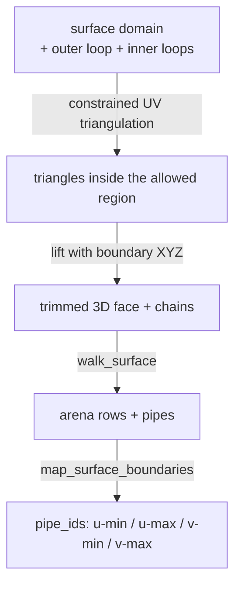
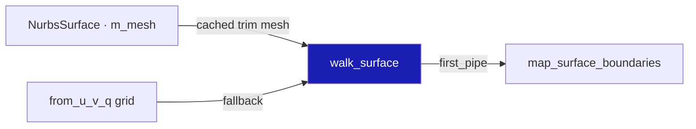
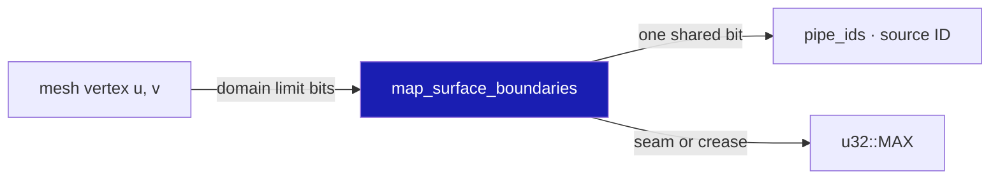
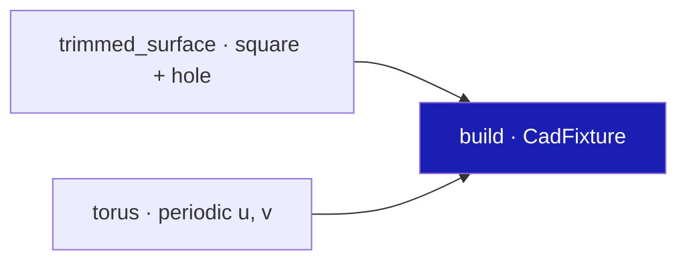

# 08 · Trims, holes and periodic seams

## You are building

## Starting point

- Checkpoint 07: BRep faces share one canonical boundary polygon; every pipe of a BRep edge carries its source edge ID.
- A standalone NURBS surface still tessellates its whole natural UV rectangle and its pipes have no source IDs.
- This lesson changes only the viewer consumer. The constrained mesher and `TrimLoops` already exist in the kernel.

## Step 1 · Prefer the producer's cached trim mesh

- Triangulating the full rectangle and drawing a hole curve on top does not make a hole. The fill must exclude the region, so the constrained mesh cached on the surface wins over a fresh grid.
- `first_pipe` remembers where this surface's pipes start so only those get boundary IDs.

<!-- file: 08 session_viewer/src/app/walk/brep.rs type hunks=1 -->

## Step 2 · Name natural boundaries from UV, not from triangle order

- A natural boundary is a domain limit: `u == start`, `u == end`, `v == start`, `v == end`. A closed direction has no physical edge there, so a periodic seam never gets a boundary ID.
- Two vertices of one pipe share exactly one boundary bit → that bit is the source ID. Interior creases and seams stay `u32::MAX`: unavailable, never invented from a triangulation index.
- Keys are exact position bits; no weld tolerance enters.
- Everything from `#[cfg(test)]` down is the module's unit tests: COPY.

<!-- file: 08 session_viewer/src/app/walk/brep.rs type hunks=2 -->

<!-- check: 08 -->

## Step 3 · Fixture: a curved trimmed patch and a torus

- The patch is a degree-2 surface with a square outer loop and a circular inner loop, meshed once by the constrained mesher and cached in `m_mesh`.
- The torus is periodic in both directions: same XYZ curve, two face uses, different UV.

<!-- file: 08 session_viewer/src/fixture.rs copy -->

## Step 4 · Stage bump

<!-- file: 08 session_viewer/src/lib.rs type -->

<!-- file: 08 session_viewer/index.html copy -->

## Check

<!-- checkpoint: 08 -->

Expected:

- The patch shows a real hole in the fill, not a drawn circle over a filled surface.
- Orbit: boundary ink stays attached to the patch and to the torus.
- The torus seam is visible as ink on a geometrically smooth surface; the surface has no lighting break there.
- Status shows **2 objects**.

If a periodic boundary crosses the wrong part of the surface, inspect the UV branch and the oriented use mapping before touching stroke depth.

## What changed

<!-- tree: 08 session_viewer/src/app -->

- Data flow: cached `m_mesh` → `walk_mesh` → pipes → `map_surface_boundaries` → `pipe_ids`.
- A seam and a shading crease are different things: a seam is repeated parameter coordinates, a crease is a lighting discontinuity. Lesson 09 handles the second.

**Production equivalent:** `src/app/walk/brep.rs` (`walk_surface`, `map_surface_boundaries`), kernel `session_rust/src/nurbssurface_trimmed.rs`.

## Try

- Append `?top=1` and look through the hole: the fill is absent there, not merely covered by a curve.
- Orbit around the torus seam with `?thickness=3`: the seam stays one line, drawn from one face use, although two parameter uses share it.
- Append `?distance=0.5` near a natural boundary of the trimmed patch: the rim is still ink from the mesh nodes, so it cannot detach when you zoom.

## Next

[09 · Normals and shading](09-normals.md): analytic normals, singular fallbacks, C0 splits and the affine normal transform.
