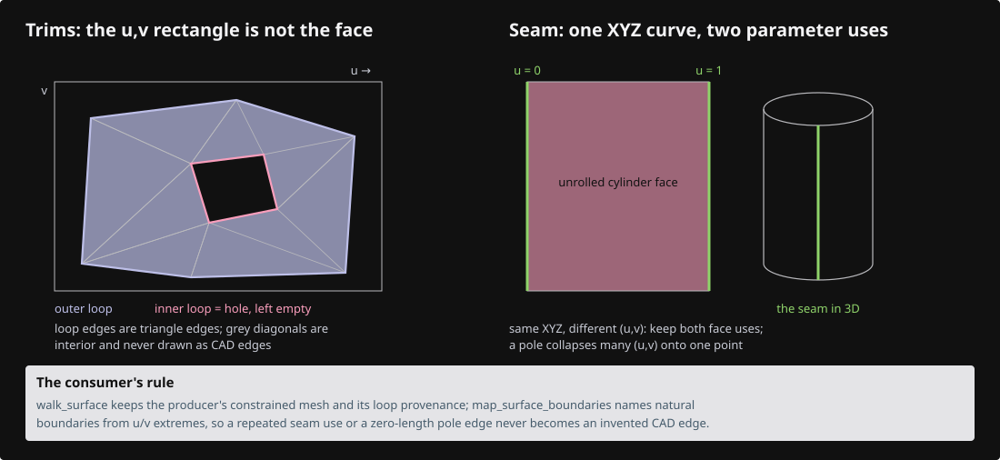

# 08 · Trims, holes and periodic seams

**Estimated study time: about 1–3 hours.** Includes reading, typing, tracing, testing and experiments. [How to use this estimate](map.md#time-estimates).

**This section:** Trace trims and holes from surface coordinates to displayed faces.

**In the whole viewer:** The source model describes which part of a curved surface exists. Display generation must respect that domain before drawing.

**Follow the data:** Surface coordinates → directed trim loops → kept domain → face triangles.

**Start with these files:** [`src/app/walk/brep.rs`](06-cad-contract.md#code-06-005), [`src/app/walk/brep_edges.rs`](06-cad-contract.md#code-06-006).

**Aim to explain:** Why do we need an edge’s use on a face as well as the three-dimensional edge itself?

[Whole-viewer map and course milestones](map.md)

A curved surface has its own two-dimensional coordinates, usually called u and v. A trim curve in that space says which part of the surface remains. Two faces can use the same three-dimensional edge in opposite directions, so an edge use stores both the face and the direction.



Start from the working result of [step 07](07-boundaries.md).

This is a review step. Keep your existing code and use the experiment below to check your understanding.

## Check the completed chapter

From `session_viewer`, compare everything you have typed:

```sh
npm --prefix ../session_tests run course -- reference-check 08
```

From `workspace/handwritten`:

```sh
cargo build --lib --locked -j4
cargo xtest --lib --locked -j4
```

Run the native trim and boundary tests. Follow one missing-curve case and one valid straight-curve case through the listing.

If a boundary is reversed or missing, check the edge-use orientation and its face-specific parameter curve. Do not assume one edge has the same parameter coordinates on both faces.

**Before moving on:** explain what changed, check the expected result above, and fix any build or test failure.

<details>
<summary>Check your explanation of the opening question</summary>

Each face has its own surface coordinates and traversal direction. The same spatial edge can bound two faces in opposite directions.

</details>

[Next step: 09](09-normals.md)
