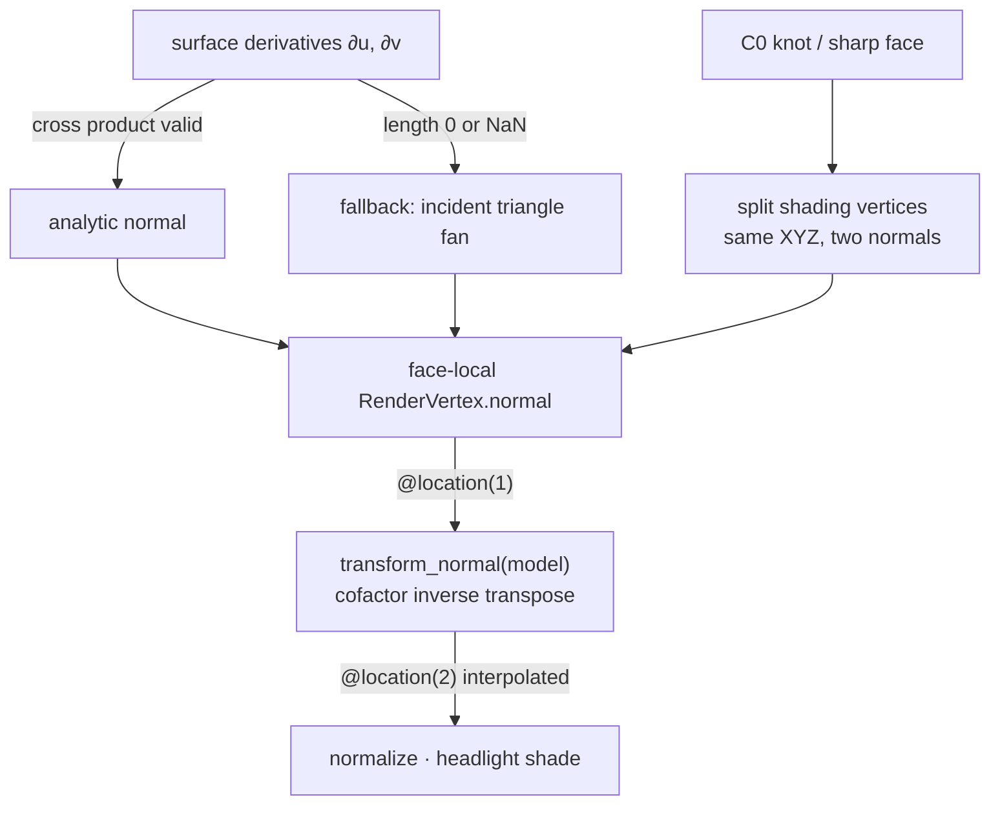
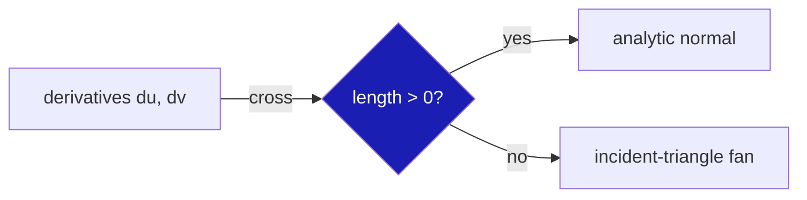
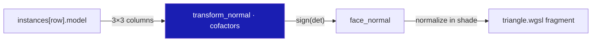
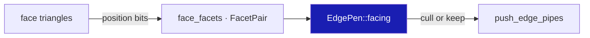
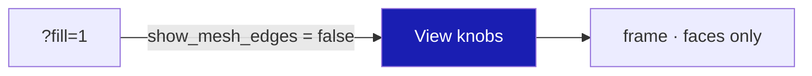
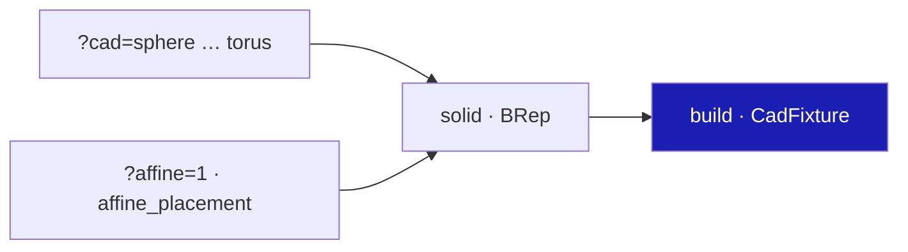

# 09 · Normals and shading

## You are building




## Starting point

- Checkpoint 08: trimmed faces and seams are correct; every face mesh carries its own vertices and normals.
- The vertex stage still passes a zero normal and the fragment stage shades flat from screen derivatives.
- A planar polyhedron looks curved if normals average across faces. Nothing in this lesson welds across a BRep face.

## Step 1 · Kernel: only a valid derivative cross is a normal

- `normal_at` returns `+Z` at a pole. Finite, but not this face's normal; it must not bypass the fan fallback.
- Read the derivatives directly: a zero-length cross means "singular here", so the incident-triangle fan decides.



<!-- file: 09 session_rust/src/nurbssurface_trimmed.rs type -->

Same rule for the grid remesher (U poles of spheres and cones):

<!-- file: 09 session_rust/src/remesh_nurbssurface_grid.rs type -->

Kernel unit tests, the C++/Python parity ports and the teapot asset are supplied:

<!-- supplied: 09 -->

<!-- check: 09 -->

## Step 2 · WGSL: transform a normal with the cofactor matrix

Positions use `model`; normals need its inverse transpose, or a nonuniformly scaled instance tilts its normals off the surface.

```text
Rust                                    WGSL
Instance.model: [f32; 16]        ↔     @group(2) @binding(0) instances[row].model
mat3x3(model[0..3].xyz)          →     x, y, z columns
cofactors (y×z, z×x, x×y)        =     inverse transpose · det
sign(det)                        →     mirrored instances keep outward normals
```

- A singular matrix has no unique normal: return the zero sentinel and let the fragment stage fall back to flat shading.
- Normalize after the transform. The cofactor form never divides by a small determinant.



<!-- file: 09 session_viewer/src/shaders/normals.wgsl type -->

Vertex attributes ↔ shader locations, from `RenderVertex::ATTRIBS`:

```text
position [f32;3] @0    ↔  @location(0) position
normal   [f32;3] @12   ↔  @location(1) normal
color    [f32;4] @24   ↔  @location(2) color
inst_id  u32 (2nd buffer) ↔ @location(3) inst_id
```

The vertex stage now transforms the baked normal; `shade` already normalizes `in.normal` because interpolation does not preserve unit length.

<!-- file: 09 session_viewer/src/shaders/triangle.wgsl type -->

## Step 3 · Edge facing from physical facets, not shading normals

- A cone apex has a smooth `+Z` fan; averaging it into the seam's cull normal tilted the seam upward and hid it.
- Index every triangle's geometric normal by its exact edge (position bits, winding-free). A seam of one periodic face keeps both incident facets.
- Missing or ambiguous incidence disables the cull instead of guessing.



<!-- file: 09 session_viewer/src/app/walk/brep_edges.rs type hunks=1-4 -->

Module unit tests: COPY.

<!-- file: 09 session_viewer/src/app/walk/brep_edges.rs copy hunks=5-8 -->

The BRep walk builds the incidence once per upload:

<!-- file: 09 session_viewer/src/app/walk/brep.rs type hunks=1 -->

<!-- file: 09 session_viewer/src/app/walk/brep.rs copy hunks=2 -->

<!-- check: 09 -->

## Step 4 · A fill-only view for inspecting lighting

Mesh edges and markers become toggles so shading can be judged without boundary ink.



<!-- file: 09 session_viewer/src/engine/gpu/mod.rs type -->

<!-- file: 09 session_viewer/src/lib.rs type -->

## Step 5 · Fixture: one solid per URL, optionally under an affine placement

- The placement has a negative determinant and three distinct scales: the sign and cofactor paths are exercised.
- The crease surface is degree one in U with a shared knot: two shading normals at identical XYZ.



<!-- file: 09 session_viewer/src/fixture.rs copy -->

<!-- file: 09 session_viewer/index.html copy -->

## Check

<!-- checkpoint: 09 -->

Open these views (the `cad` query selects the fixture, `affine=1` applies the placement, `fill=1` hides edges and markers, `perspective=1` switches projection):

- `?cad=sphere` — smooth interior shading, no facet pattern.
- `?cad=cylinder` — smooth side; each cap is one flat tone with no bleed across the rim.
- `?cad=crease` — one-sided shading on each side of the fold.
- `?cad=cylinder&affine=1` — the mirrored, nonuniformly scaled copy shades like the original.
- `?cad=cylinder&fill=1` — lighting only.
- `?cad=hole`, `?cad=trimmed`, `?cad=torus` — the earlier fixtures under the new normals.

A subtle crease under one light is not proof that normals are separate; identical XYZ with two normals is.


## What changed

<!-- tree: 09 session_viewer/src -->

- Data flow: derivatives → `RenderVertex.normal` → `@location(1)` → `transform_normal(model)` → interpolated `@location(2)` → `normalize` → headlight.
- Edge culling reads physical facet normals; shading normals never enter visibility.

**Production equivalent:** `src/shaders/normals.wgsl`, `src/shaders/triangle.wgsl`, `src/app/walk/brep_edges.rs`, kernel `session_rust/src/remesh_nurbssurface_grid.rs` and `nurbssurface_trimmed.rs`.

## Try

- Open `?cad=sphere` and then `?cad=sphere&nolit=1`: the shading is the only difference, the mesh is the same; a normal bug shows in the first view only.
- Open `?cad=crease` and orbit until the light grazes the fold: one side goes dark while the other stays lit, because the two sides own different normals at the same positions.
- Open `?cad=cylinder&affine=1`: the stretched copy shades like the original. Replace `transform_normal` in `normals.wgsl` with a plain `mat3x3(model) * n` and reload: the stretched copy's lighting tilts.

## Next

[10 · Text shaping](10-text-layout.md): fonts, glyph advances and clusters before any pixel is drawn.
