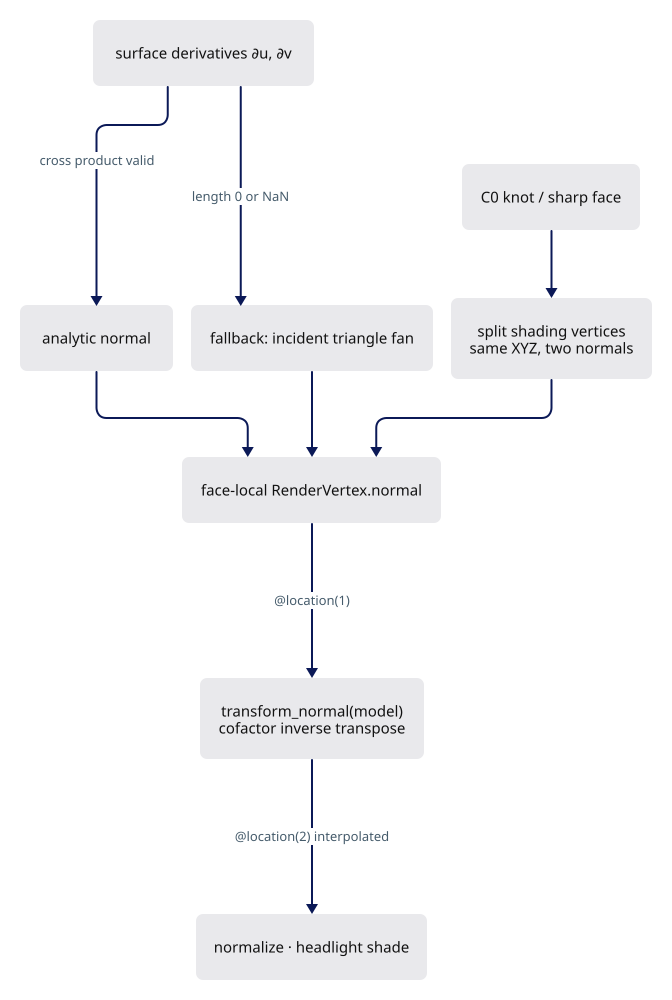
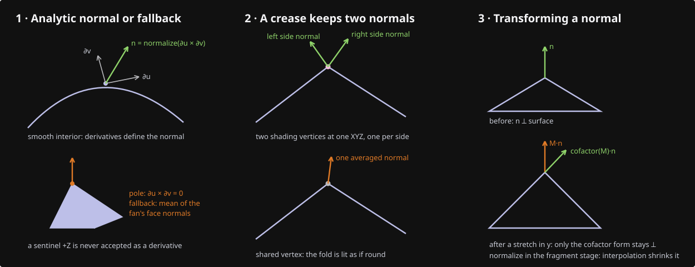
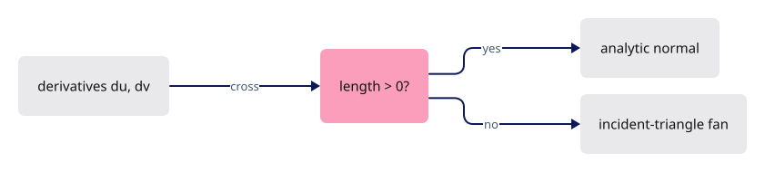
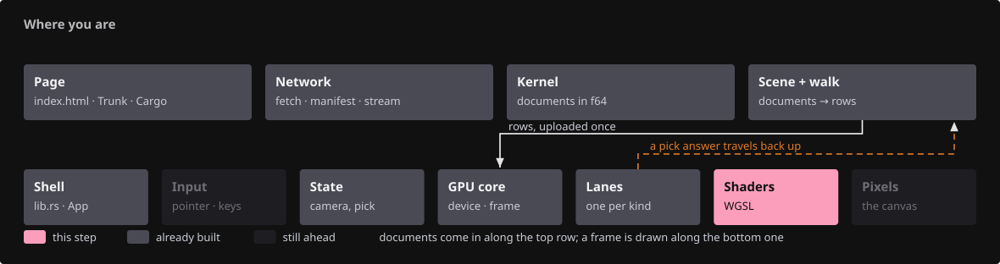
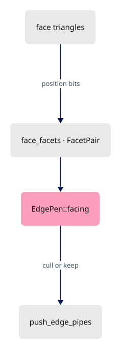
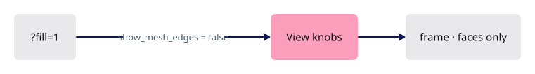
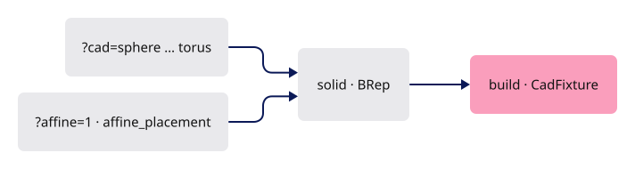
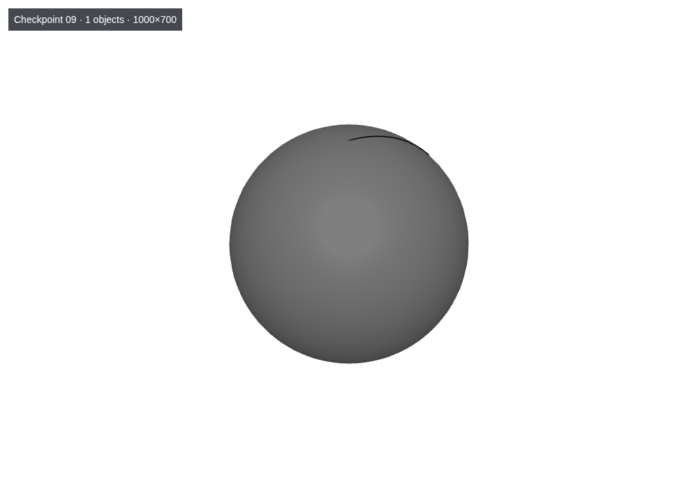

# 09 · Normals and shading

## You are building





## Starting point

- Checkpoint 08: trimmed faces and seams are correct; every face mesh carries its own vertices and normals.
- The vertex stage still passes a zero normal and the fragment stage shades flat from screen derivatives.
- A planar polyhedron looks curved if normals average across faces. Nothing in this lesson welds across a BRep face.

<!-- step-status: start -->

**Does it compile yet?** Yes — `cargo check` was run at the end of every step of this lesson.

<!-- step-status: end -->

## Step 1 · Kernel: only a valid derivative cross is a normal

{ .locator data-strip="illustrations/strip-9186989aed.svg" }

- `normal_at` returns `+Z` at a pole. Finite, but not this face's normal; it must not bypass the fan fallback.
- Read the derivatives directly: a zero-length cross means "singular here", so the incident-triangle fan decides.



<span class="zone-mark" data-strip="illustrations/strip-9186989aed.svg" data-zone="Kernel"></span>

<!-- file: 09 session_rust/src/nurbssurface_trimmed.rs type -->

Same rule for the grid remesher (U poles of spheres and cones):

<span class="zone-mark" data-strip="illustrations/strip-9186989aed.svg" data-zone="Kernel"></span>

<!-- file: 09 session_rust/src/remesh_nurbssurface_grid.rs type -->

Kernel unit tests, the C++/Python parity ports and the teapot asset are supplied:

<!-- supplied: 09 -->

<!-- check: 09 -->

## Step 2 · WGSL: transform a normal with the cofactor matrix

{ .locator data-strip="illustrations/strip-62db6ccc73.svg" }

Positions use `model`; normals need its inverse transpose, or a nonuniformly scaled instance tilts its normals off the surface.

```text
Rust                                    WGSL
Instance.model: [f32; 16]        ↔     @group(2) @binding(0) instances[row].model
mat3x3(model[0..3].xyz)          →     x, y, z columns
cofactors (y×z, z×x, x×y)        =     inverse transpose · det
sign(det)                        →     mirrored instances keep outward normals
```

- A singular matrix has no unique normal: return the zero sentinel and let the fragment stage fall back to flat shading.
- Normalize after the transform. The cofactor form never divides by a small determinant.

![Diagram: instances[row].model · transform_normal · cofactors · face_normal · triangle.wgsl fragment](illustrations/09-03.svg)

<span class="zone-mark" data-strip="illustrations/strip-62db6ccc73.svg" data-zone="Shaders"></span>

<!-- file: 09 session_viewer/src/shaders/normals.wgsl type -->

Vertex attributes ↔ shader locations, from `RenderVertex::ATTRIBS`:

```text
position [f32;3] @0    ↔  @location(0) position
normal   [f32;3] @12   ↔  @location(1) normal
color    [f32;4] @24   ↔  @location(2) color
inst_id  u32 (2nd buffer) ↔ @location(3) inst_id
```

The vertex stage transforms the baked normal; `shade` normalizes `in.normal` because interpolation does not preserve unit length.

<span class="zone-mark" data-strip="illustrations/strip-62db6ccc73.svg" data-zone="Shaders"></span>

<!-- file: 09 session_viewer/src/shaders/triangle.wgsl type -->

## Step 3 · Edge facing from physical facets, not shading normals

{ .locator data-strip="illustrations/strip-bb17a255a3.svg" }

- A cone apex has a smooth `+Z` fan; averaging it into the seam's cull normal tilted the seam upward and hid it.
- Index every triangle's geometric normal by its exact edge (position bits, winding-free). A seam of one periodic face keeps both incident facets.
- Missing or ambiguous incidence disables the cull instead of guessing.



<span class="zone-mark" data-strip="illustrations/strip-bb17a255a3.svg" data-zone="Scene + walk"></span>

<!-- file: 09 session_viewer/src/app/walk/brep_edges.rs type hunks=1-4 -->

Module unit tests: COPY.

<span class="zone-mark" data-strip="illustrations/strip-bb17a255a3.svg" data-zone="Scene + walk"></span>

<!-- file: 09 session_viewer/src/app/walk/brep_edges.rs copy hunks=5-8 -->

The BRep walk builds the incidence once per upload:

<span class="zone-mark" data-strip="illustrations/strip-bb17a255a3.svg" data-zone="Scene + walk"></span>

<!-- file: 09 session_viewer/src/app/walk/brep.rs type hunks=1-1 -->

<span class="zone-mark" data-strip="illustrations/strip-bb17a255a3.svg" data-zone="Scene + walk"></span>

<!-- file: 09 session_viewer/src/app/walk/brep.rs copy hunks=2-2 -->

<!-- check: 09 -->

## Step 4 · A fill-only view for inspecting lighting

{ .locator data-strip="illustrations/strip-3889827b9f.svg" }

Mesh edges and markers become toggles so shading can be judged without boundary ink.



<span class="zone-mark" data-strip="illustrations/strip-54e1511b20.svg" data-zone="GPU core"></span>

<!-- file: 09 session_viewer/src/engine/gpu/mod.rs type -->

<span class="zone-mark" data-strip="illustrations/strip-3bd0a898de.svg" data-zone="Shell"></span>

<!-- file: 09 session_viewer/src/lib.rs type -->

- Viewing choices live in the shell, so the lane code stays free of them.

## Step 5 · Fixture: one solid per URL, optionally under an affine placement

{ .locator data-strip="illustrations/strip-460ff53e99.svg" }

- The placement has a negative determinant and three distinct scales: the sign and cofactor paths are exercised.
- The crease surface is degree one in U with a shared knot: two shading normals at identical XYZ.



<span class="zone-mark" data-strip="illustrations/strip-3bd0a898de.svg" data-zone="Shell"></span>

<!-- file: 09 session_viewer/src/fixture.rs copy -->

<span class="zone-mark" data-strip="illustrations/strip-63a57b9919.svg" data-zone="Page"></span>

<!-- file: 09 session_viewer/index.html copy -->

## Check

<!-- checkpoint: 09 -->

Open these views (the `cad` query selects the fixture, `affine=1` applies the placement, `fill=1` hides edges and markers, `perspective=1` switches projection):

- `?cad=sphere` — smooth interior shading, no facet pattern.
- `?cad=cylinder` — smooth side; each cap is one flat tone with no bleed across the rim.
- `?cad=crease` — one-sided shading on each side of the fold.
- `?cad=cylinder&affine=1` — the mirrored, nonuniformly scaled copy shades like the original.
- `?cad=cylinder&fill=1` — lighting only.
- `?cad=hole`, `?cad=trimmed`, `?cad=torus` — the hole, trimmed patch and torus fixtures under these normals.

A subtle crease under one light is not proof that normals are separate; identical XYZ with two normals is.



## What changed

<!-- tree: 09 session_viewer/src -->

- Data flow: derivatives → `RenderVertex.normal` → `@location(1)` → `transform_normal(model)` → interpolated `@location(2)` → `normalize` → headlight.
- Edge culling reads physical facet normals; shading normals never enter visibility.

**Production equivalent:** Production keeps this in `src/shaders/normals.wgsl`, `src/shaders/triangle.wgsl`, `src/app/walk/brep_edges.rs` and the kernel's `session_rust/src/remesh_nurbssurface_grid.rs` and `nurbssurface_trimmed.rs`.

## Try

- Open `?cad=sphere&lit=1` and then `?cad=sphere`: the shading is the only difference, the mesh is the same; a normal bug shows in the first view only.
- Open `?cad=crease` and orbit until the light grazes the fold: one side goes dark while the other stays lit, because the two sides own different normals at the same positions.
- Open `?cad=cylinder&affine=1`: the stretched copy shades like the original. Replace `transform_normal` in `normals.wgsl` with a plain `mat3x3(model) * n` and reload: the stretched copy's lighting tilts.

## Questions and answers

**Positions use `model`. Why can normals not?**

*How to work it out.* Scale a sphere twice as wide in x. Every surface point moves by `model`; a normal on the flank, moved the same way, no longer stands perpendicular, because a nonuniform scale does not preserve perpendicularity. The matrix that does is the inverse transpose.

*The answer.* Normals need `model`'s inverse transpose, built here as cofactors — the same matrix up to a positive scale, and it never divides by a small determinant as a literal inverse would.

**`normal_at` returns `+Z` at a pole. Why is that dangerous, and what saves it?**

*How to work it out.* `+Z` is finite, unit length and passes every sanity test, so no caller can tell it from a real normal. The genuine signal of a pole is that the derivatives are parallel: their cross product has zero length.

*The answer.* A plausible fallback is worse than an obvious sentinel because nothing downstream can detect it — a sphere's pole would shade as flat and facing up. The zero-length cross is the real signal, and it hands the decision to the incident-triangle fan.

**Edge culling reads geometric facet normals, never shading normals. What broke when it did not?**

*How to work it out.* A shading normal exists to make a tessellated surface look smooth: an average, deliberately different from the facet it sits on. Deciding whether an edge faces away with it asks a question about geometry with a number smoothed on purpose.

*The answer.* A cone's apex has a smooth `+Z` fan; averaging it into the seam's cull normal tilted the seam upward until it was culled and vanished. Appearance choices must not delete geometry, so the cull indexes each triangle's real normal by its exact edge.

**A singular matrix yields the zero normal sentinel instead of an error. Who handles it and how?**

*How to work it out.* A singular model matrix means the instance is flattened to a plane or a line: there is genuinely no unique normal. Refuse to draw, invent one, or shade without one.

*The answer.* The fragment stage falls back to flat shading from screen derivatives — the honest answer, rather than a crash or a fiction.

**What you should be able to do now**

Name the three cases where an analytic derivative gives no normal: a pole (zero-length cross → the incident-triangle fan decides), a C0 crease (two valid normals at one position → the vertex is split, same position and `u`/`v`, different normal), a singular instance matrix (no unique direction → the zero sentinel, flat shading). Then say why `?cad=crease` beats a smooth sphere as a test: identical XYZ carrying two different normals is proof the split happened; a subtle shading difference under one light is not.

## Next

[10 · Text shaping](10-text-layout.md): fonts, glyph advances and clusters before any pixel is drawn.
