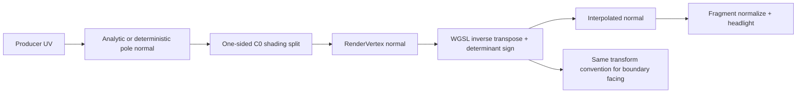

# 09 · Smooth shading, creases and instance transforms

Start from checkpoint **08** in `/tmp/viewer-course`; stop its previous Trunk process before serving this checkpoint. The complete [09.patch](reconstruction/patches/09.patch) contains every import, replacement, fixture and parity change below.

`src/` paths are relative to `/tmp/viewer-course/session_viewer`; `COURSE_REPO` is the maintained viewer directory exported in checkpoint 00.



Text equivalent: source normals are split at genuine continuity breaks, transformed with the inverse transpose, interpolated and normalized per fragment; boundary facing uses the same transform convention.

**TYPE BY HAND — `src/shaders/normals.wgsl` · `transform_normal and face_normal` · Replace the complete file.**

```wgsl
// Cofactor inverse transpose, normalized without dividing by a small determinant.
// A singular transform has no unique surface normal and returns the explicit zero sentinel.
fn transform_normal(model: mat3x3<f32>, normal: vec3<f32>) -> vec3<f32> {
    let x = model[0];
    let y = model[1];
    let z = model[2];
    let det = dot(x, cross(y, z));
    let scale = length(x) * length(y) * length(z);
    if (scale == 0.0 || abs(det) <= scale * 1e-12 || dot(normal, normal) == 0.0) {
        return vec3<f32>(0.0);
    }
    let transformed = mat3x3<f32>(cross(y, z), cross(z, x), cross(x, y)) * normal * sign(det);
    if (dot(transformed, transformed) == 0.0) {
        return vec3<f32>(0.0);
    }
    return normalize(transformed);
}

// Ink normals use the same coordinate convention as triangle and point-cloud normals.
fn face_normal(model: mat4x4<f32>, normal: vec3<f32>) -> vec3<f32> {
    return transform_normal(mat3x3<f32>(model[0].xyz, model[1].xyz, model[2].xyz), normal);
}
```

**TYPE BY HAND — `src/shaders/triangle.wgsl` · `VsOut, vs_main, shade and fragments` · Replace the complete file.**

```wgsl
// Mesh faces: lit triangles from the arena. Group 0 camera, 1 line/pen block, 2 instances.

@group(0) @binding(0) var<uniform> mvp: mat4x4<f32>;
@group(1) @binding(0) var<uniform> line: LineUniform;

struct Instance {
    model: mat4x4<f32>,
    color: vec4<f32>,
    flags: u32,
    thickness: f32,
    spacing: f32,
}
@group(2) @binding(0) var<storage, read> instances: array<Instance>;
@group(2) @binding(1) var<storage, read> translations: array<vec4<f32>>;

struct LineUniform {
    thickness: f32,
    proj_y: f32,
    ortho_h: f32,
    vp_h: f32,
    vp_w: f32,
    eye_x: f32,
    eye_y: f32,
    eye_z: f32,
    anchor: vec3<f32>,
    feather: f32,
    lit: f32,
    backface: f32,
};

const FLAG_SELECTED: u32 = 1u;
const FLAG_HIDDEN: u32 = 2u;
const FLAG_PRINT: u32 = 8u;
const MM_TO_M: f32 = 0.001;
const SELECT_COLOR: vec3<f32> = vec3<f32>(1.0, 1.0, 0.0);
const BACKFACE_COLOR: vec3<f32> = vec3<f32>(0.80, 0.05, 0.05);

// A point of object `i` in the anchored frame: rotation/scale from the row, translation
// from the 16 B table a re-anchor rewrites.
fn place(i: u32, p: vec3<f32>) -> vec3<f32> {
    return (instances[i].model * vec4<f32>(p, 1.0)).xyz + translations[i].xyz;
}

struct VsIn {
    @location(0) position: vec3<f32>,
    @location(1) normal: vec3<f32>,
    @location(2) color: vec3<f32>,
    @location(3) inst_id: u32,
}

struct VsOut {
    @builtin(position) pos: vec4<f32>,
    @location(0) color: vec3<f32>,
    @location(1) world_pos: vec3<f32>,
    @location(2) normal: vec3<f32>,
    @location(3) print: f32,
    @location(4) @interpolate(flat) inst_id: u32,
    @location(5) @interpolate(flat) mirrored: u32,
    @location(6) @interpolate(flat) selected: u32,
}

// A hidden row's triangle, parked outside the clip volume: the ID pass shares this vertex
// stage, so a hidden object stops being pickable as well as drawn.
fn dead_vertex() -> VsOut {
    var dead: VsOut;
    dead.pos = vec4<f32>(3.0, 3.0, 0.5, 1.0);
    dead.color = vec3<f32>(0.0);
    dead.world_pos = vec3<f32>(0.0);
    dead.normal = vec3<f32>(0.0);
    dead.print = 0.0;
    dead.inst_id = 0u;
    dead.mirrored = 0u;
    dead.selected = 0u;
    return dead;
}

@vertex
fn vs_main(in: VsIn) -> VsOut {
    let inst = instances[in.inst_id];
    if ((inst.flags & FLAG_HIDDEN) != 0u) {
        return dead_vertex();
    }
    let world = place(in.inst_id, in.position);
    let clip = mvp * vec4<f32>(world, 1.0);
    var o: VsOut;
    o.pos = clip;
    var color = in.color.rgb * inst.color.rgb;
    if ((inst.flags & FLAG_SELECTED) != 0u) {
        color = SELECT_COLOR;
    }
    o.color = color;
    o.world_pos = world;
    o.normal = face_normal(inst.model, in.normal);
    o.mirrored = select(0u, 1u, dot(inst.model[0].xyz, cross(inst.model[1].xyz, inst.model[2].xyz)) < 0.0);
    o.print = select(0.0, 1.0, (inst.flags & FLAG_PRINT) != 0u);
    o.inst_id = in.inst_id;
    o.selected = inst.flags & FLAG_SELECTED;
    return o;
}

// The direction a fragment sees the camera in: a ray from the point under perspective,
// one fixed direction under orthographic, where every ray is parallel (as `ink_visibility.wgsl`
// reads it out of the same matrix row).
fn view_dir(world_pos: vec3<f32>) -> vec3<f32> {
    if (line.ortho_h > 0.0) {
        return normalize(vec3<f32>(mvp[0].z, mvp[1].z, mvp[2].z));
    }
    return normalize(vec3<f32>(line.eye_x, line.eye_y, line.eye_z) - world_pos);
}

fn shade(in: VsOut, raster_front: bool) -> vec4<f32> {
    let front = raster_front != (in.mirrored != 0u);
    // Flat normal from screen-space derivatives when the mesh baked none (y is down).
    let flat_n = cross(dpdy(in.world_pos), dpdx(in.world_pos));
    var n = vec3<f32>(0.0, 0.0, 1.0);
    if (dot(in.normal, in.normal) > 1e-12) {
        n = normalize(in.normal);
        if (!front) { n = -n; }
    } else if (dot(flat_n, flat_n) > 1e-24) {
        n = normalize(flat_n);
        if (!raster_front) { n = -n; }
    }

    // A headlight, as every CAD viewport shades: the lamp rides the camera, tilted a little
    // above it so a horizontal face still reads brighter than a vertical one. A world-fixed key
    // left every underside near black and made a colour unreadable from half the orbit.
    //
    // The diffuse is wrapped - the lit hemisphere is stretched over the whole sphere - so the
    // terminator is a gradient across a curved surface rather than a hard edge, and the darkest
    // a visible face can get is its silhouette, not black. Blinn-Phong on top puts a soft bloom
    // where the normal splits the lamp and the eye; the gain leaves it room to show.
    //
    // Measured on the mixed-solids scene (1400x900, Intel iGPU, 2026-09-08), as the ratio of the
    // lit frame to the same frame under `VIEWER_NO_LIT`, both linearised: a face square to the
    // camera holds 1.00 of its colour, the sphere's silhouette - its normal square to the view -
    // reads 0.59..0.62, and the darkest face pixel in either frame, iso or from below, is 0.47.
    let v = view_dir(in.world_pos);
    let l = normalize(v + vec3<f32>(0.0, 0.0, 0.35));
    let h = normalize(l + v);
    let wrap = clamp((dot(n, l) + 0.5) / 1.5, 0.0, 1.0);
    let spec = pow(max(dot(n, h), 0.0), 32.0) * 0.15;
    let lit = min(0.40 + 0.55 * wrap + spec, 1.0);

    // A back face is a flipped normal or the inside of an open solid: shown red. Print is
    // paper, read from both sides, lit flat.
    let backface = !front && in.print <= 0.5 && line.backface > 0.5;
    let base = select(in.color, BACKFACE_COLOR, backface);
    let shaded = select(1.0, lit, line.lit > 0.5 && in.print <= 0.5);
    return vec4<f32>(base * shaded, 1.0);
}

// The id pass: (object row + 1, 0).
@fragment
fn fs_id(in: VsOut) -> PhysicalId {
    return PhysicalId(vec2<u32>(in.inst_id + 1u, 0u), physical_gradient(in.pos.z));
}

@fragment
fn fs_selection_mask(in: VsOut) -> @location(0) vec4<f32> {
    if (in.selected == 0u) { discard; }
    return vec4<f32>(1.0);
}

@fragment
fn fs_main(in: VsOut, @builtin(front_facing) front: bool) -> PhysicalColor {
    return PhysicalColor(shade(in, front), physical_gradient(in.pos.z));
}
```

**COPY/PASTE — `09.patch` · local affine fixture and diagnostics.** The fixture uses a rotated instance with scale `[-1.4, 0.65, 1.15]`; positions stay in source space, and the instance keeps its actual original controls and edge IDs.

A singular transform has no unique normal, so the shared WGSL helper returns the zero sentinel and the fragment path uses its explicit derivative fallback. The corrected determinant sign preserves authored front/back meaning under mirroring; the C0 producer split from 06 prevents interpolation across a sharp knot.

Expected browser: sphere and cylinder interiors shade smoothly; the folded patch retains its sharp crease; mirrored nonuniform instances keep outward facing and attached boundary strokes. Compare lit/fill-only/unlit fixtures and source-edge assertions rather than judging tessellation by a screenshot alone.

**COPY/PASTE — `src/fixture.rs` · `build`, `affine_placement` and source cases · replace the complete local fixture.**

```rust
//! Local source geometry and its prepared GPU rows; no fetch, credentials or baked transforms.
use crate::app::walk::brep::{walk_brep, walk_surface};
use crate::app::walk::mesh_ink::Ink;
use crate::app::walk::{Row, WalkCx};
use crate::engine::gpu::Upload;
use crate::engine::gpu::objects::ObjectRow;
use session_rust::{BRep, Color, Geometry, NurbsSurface, Point, Xform};
use std::rc::Rc;

/// Retain original f64 source objects independently from their GPU row addresses.
pub struct CadFixture {
    pub upload: Upload,
    pub sources: Vec<Geometry>,
    pub identities: Vec<SourceIdentity>,
    pub pipe_source_edges: Vec<u32>,
}

/// An object row is a display address; the source GUID belongs to the retained geometry.
#[derive(serde::Serialize)]
pub struct SourceIdentity {
    pub object_row: u32,
    pub guid: String,
    pub kind: &'static str,
}

impl CadFixture {
    /// Allocate no geometry until the selected local case appends its source objects.
    fn new() -> Self {
        Self {
            upload: Upload::default(),
            sources: Vec::new(),
            identities: Vec::new(),
            pipe_source_edges: Vec::new(),
        }
    }

    /// Prepare one source object, retaining its identity and source-space geometry together.
    fn add(&mut self, geometry: Geometry, place: Xform) {
        let row = self.upload.obj.rows.len() as u32;
        let first_pipe = self.upload.seg.pipes.len();
        let context = WalkCx {
            vert_base: 0,
            cloud_px: 0.0,
            row,
        };
        let mut ink = Ink {
            seg: &mut self.upload.seg,
            glyph: &mut self.upload.glyph,
        };
        let (prepared, guid, kind) = match &geometry {
            Geometry::BRep(source) => (
                walk_brep(&mut self.upload.arena, &mut ink, source, &context),
                source.guid().to_string(),
                "BRep",
            ),
            Geometry::NurbsSurface(source) => (
                walk_surface(&mut self.upload.arena, &mut ink, source, &context),
                source.guid().to_string(),
                "NurbsSurface",
            ),
            _ => unreachable!("the CAD fixture only constructs BRep and surface source objects"),
        };
        self.pipe_source_edges
            .extend_from_slice(&self.upload.seg.pipe_ids[first_pipe..]);
        self.push_row(prepared, place);
        self.identities.push(SourceIdentity {
            object_row: row,
            guid,
            kind,
        });
        self.sources.push(geometry);
    }

    /// Keep object-local bounds separate from the instance placement used for camera fitting.
    fn push_row(&mut self, prepared: Row, place: Xform) {
        let mut object = ObjectRow::new(place.m, prepared.flags);
        object.bounds = prepared.bounds;
        object.spacing = prepared.spacing;
        object.faces = prepared.faces;
        object.thickness = prepared.thickness;
        self.upload.bounds.union(&prepared.bounds.placed(&place.m));
        self.upload.obj.rows.push(object);
    }
}

/// Place an instance using a negative determinant and three distinct scale factors.
fn affine_placement() -> Xform {
    let scale = Xform::from_matrix([
        -1.4, 0.0, 0.0, 0.0, 0.0, 0.65, 0.0, 0.0, 0.0, 0.0, 1.15, 0.0, 0.0, 0.0, 0.0, 1.0,
    ]);
    Xform::rotation_z(23.0, true) * Xform::rotation_x(17.0, true) * scale
}

/// A degree-one folded surface whose shared knot must retain two shading normals.
fn crease_surface() -> NurbsSurface {
    let points = [
        Point::new(-200.0, -100.0, 0.0),
        Point::new(-200.0, 100.0, 0.0),
        Point::new(0.0, -100.0, 0.0),
        Point::new(0.0, 100.0, 0.0),
        Point::new(200.0, -100.0, 160.0),
        Point::new(200.0, 100.0, 160.0),
    ];
    let mut surface = NurbsSurface::create(false, false, 1, 1, 3, 2, &points).unwrap();
    surface.facecolors = vec![Color::grey()];
    surface.name = "CAD C0 crease".into();
    surface
}

/// Use the same topology as the shared-kernel boundary tests, including the hole's inner wire.
fn solid(kind: &str) -> BRep {
    let mut brep = match kind {
        "cylinder" => BRep::create_cylinder(120.0, 240.0),
        "sphere" => BRep::create_sphere(160.0),
        "torus" => BRep::create_torus(120.0, 35.0),
        "hole" => BRep::create_block_with_hole(400.0, 300.0, 120.0, 70.0),
        _ => panic!("unknown CAD fixture"),
    };
    brep.name = format!("CAD {kind}");
    brep.surfacecolor = Color::grey();
    brep
}

/// A curved source patch carrying the producer's constrained hole mesh in its supported cache.
fn trimmed_surface() -> NurbsSurface {
    use session_rust::{NurbsSurfaceTrimmed, TrimLoops};
    let points = [
        Point::new(-200.0, -150.0, 0.0),
        Point::new(-200.0, 150.0, 0.0),
        Point::new(0.0, -150.0, 160.0),
        Point::new(0.0, 150.0, 160.0),
        Point::new(200.0, -150.0, 0.0),
        Point::new(200.0, 150.0, 0.0),
    ];
    let surface = NurbsSurface::create(false, false, 2, 1, 3, 2, &points).unwrap();
    let mut trimmed = NurbsSurfaceTrimmed::new();
    trimmed.m_surface = surface;
    let mut loops = TrimLoops::default();
    let mut outer = Vec::new();
    for edge in 0..4 {
        for sample in 0..24 {
            let t = sample as f64 / 24.0;
            let (u, v) = match edge {
                0 => (t, 0.0),
                1 => (1.0, t),
                2 => (1.0 - t, 1.0),
                _ => (0.0, 1.0 - t),
            };
            outer.push(Point::new(u, v, 0.0));
        }
    }
    let mut hole = Vec::new();
    for sample in 0..48 {
        let angle = sample as f64 / 48.0 * std::f64::consts::TAU;
        hole.push(Point::new(
            0.5 + 0.2 * angle.cos(),
            0.5 + 0.2 * angle.sin(),
            0.0,
        ));
    }
    loops.uv = vec![outer, hole];
    for ring in &loops.uv {
        let mut positions = Vec::with_capacity(ring.len());
        for uv in ring {
            positions.push(
                trimmed
                    .m_surface
                    .point_at(uv[0], uv[1])
                    .expect("fixture UV lies in the source domain"),
            );
        }
        loops.xyz.push(positions);
    }
    let mesh = trimmed.mesh_loops(&loops, 20.0, 0.005);
    assert!(
        !mesh.face.is_empty(),
        "the local constrained hole must triangulate"
    );
    let mut surface = trimmed.m_surface;
    surface.m_mesh = Some(mesh);
    surface.facecolors = vec![Color::grey()];
    surface.name = "cached curved trim with circular hole".into();
    surface
}

/// A bounded local URL switch selects one diagnostic without introducing a loader.
fn query(name: &str) -> Option<String> {
    #[cfg(target_arch = "wasm32")]
    {
        let search = web_sys::window()?.location().search().ok()?;
        let prefix = format!("{name}=");
        for part in search.trim_start_matches('?').split('&') {
            if let Some(value) = part.strip_prefix(&prefix) {
                return Some(value.to_string());
            }
        }
        None
    }
    #[cfg(not(target_arch = "wasm32"))]
    {
        let _ = name;
        None
    }
}

/// `?cad=sphere|cylinder|hole|crease&affine=1` selects a retained local source instance.
pub fn build() -> CadFixture {
    let mut scene = CadFixture::new();
    let kind = query("cad").unwrap_or("sphere".into());
    let geometry = match kind.as_str() {
        "crease" => Geometry::NurbsSurface(Rc::new(crease_surface())),
        "trimmed" => Geometry::NurbsSurface(Rc::new(trimmed_surface())),
        "torus" => Geometry::BRep(Rc::new(solid("torus"))),
        "cylinder" | "sphere" | "hole" => Geometry::BRep(Rc::new(solid(&kind))),
        _ => Geometry::BRep(Rc::new(solid("sphere"))),
    };
    let place = if query("affine").as_deref() == Some("1") {
        affine_placement()
    } else {
        Xform::identity()
    };
    scene.add(geometry, place);
    scene
}
```

**TYPE BY HAND — `src/lib.rs` · `Tutorial::create` · Replace.**

```rust
    pub async fn create(canvas: web_sys::HtmlCanvasElement) -> Result<Tutorial, JsValue> {
        console_error_panic_hook::set_once();
        let mut gpu = Gpu::new(canvas.clone()).await.map_err(js_error)?;
        let mut fixture = fixture::build();
        gpu.set_scene(&fixture.upload);
        fixture.upload.drop_uploaded();
        let mut camera = camera::Camera::new();
        camera.unit = camera::Unit::Millimeters;
        camera.set_view(camera::View::Iso);
        camera.fit(&gpu.bounds, 1.5);
        if app::route::query("top").is_some() {
            camera.set_view(camera::View::Top);
        }
        camera.perspective = app::route::query("perspective").is_some();
        if let Some(distance) = app::route::query("distance").and_then(parse_distance) {
            camera.distance *= distance;
            camera.update_position();
        }
        gpu.view.show_grid = false;
        gpu.view.show_mesh_edges = app::route::query("fill").is_none();
        gpu.view.markers = false;
        Ok(Self {
            canvas,
            gpu,
            camera,
            scale: 1.0,
            fixture,
        })
    }
```

**TYPE BY HAND — `src/engine/gpu/mod.rs` · `Gpu::render` · Replace.**

```rust
    pub fn render(&mut self, input: &FrameInput) -> anyhow::Result<()> {
        self.write_frame_uniforms(input);
        let output = match self.surface.get_current_texture() {
            wgpu::CurrentSurfaceTexture::Success(output)
            | wgpu::CurrentSurfaceTexture::Suboptimal(output) => output,
            error => anyhow::bail!("surface unavailable: {error:?}"),
        };
        let target = output.texture.create_view(&Default::default());
        let mut encoder = self.ctx.device.create_command_encoder(&Default::default());
        self.splat.prelude(
            &self.ctx,
            &self.layouts,
            &mut encoder,
            &splat::RecordCx {
                mvp: &self.frame.mvp_f32,
                ortho_h: self.frame.ortho_h,
                eye: self.frame.eye,
                size: (self.config.width, self.config.height),
                cloud_size: self.view.cloud_size * self.config.width as f32
                    / self.logical_size[0] as f32,
                lod_px: self.view.lod_px,
                objects: &self.objects,
                clouds: &self.cloud.clouds,
                nodes: &self.cloud.nodes,
            },
            &self.frame.cloud_group,
        );
        let basic = frame::Binds {
            mvp: &self.frame.mvp_group,
            line: &self.frame.line_group,
            instances: &self.objects.group,
        };
        {
            let mut pass = self.targets.begin_faces(&mut encoder, &target, input.clear);
            self.backdrop.draw_background(&mut pass);
            if self.view.show_grid {
                self.backdrop.draw_grid(&mut pass, &basic);
            }
            self.arena.draw_faces(&mut pass, &basic);
            self.splat.draw_resolve(&mut pass, &self.frame.cloud_group);
        }
        {
            let mut pass = self.targets.begin_ink(&mut encoder, &target);
            let ink = frame::Binds {
                mvp: &self.frame.mvp_group,
                line: &self.frame.line_group,
                instances: &self.objects.ink_group,
            };
            self.arena.draw_print(&mut pass, &basic);
            if self.view.show_mesh_edges {
                self.segments.draw_pipes(&mut pass, &ink);
                if self.view.markers {
                    self.glyphs.draw_spheres(&mut pass, &ink);
                }
            }
            self.segments.draw_ribbons(&mut pass, &ink);
            self.glyphs.draw_dots(&mut pass, &ink);
            self.arena.draw_text(&mut pass, &basic);
        }
        self.ctx.queue.submit([encoder.finish()]);
        output.present();
        Ok(())
    }
```

Open `http://127.0.0.1:8770/?cad=sphere&fill=1`, then add `&nolit=1` for uniform source color; use `?cad=crease&affine=1` for the transformed C0 case and `?cad=trimmed&affine=1` for the cached curved hole; `?cad=torus` revisits the periodic surface with smooth normals. `sourceObjects` and `sourceEdgeIds` in the canvas snapshot remain tied to retained source geometry.

**COPY/PASTE — checkpoint labels.** In `src/lib.rs`, `Tutorial::render`, change the inspection field `"stage":8` to `"stage":9`; in `index.html`, change its three checkpoint 08 labels to 09.

**COPY/PASTE — binary inputs for the manual route.** After the source edits, run this before `--adopt`; it copies only the hash-checked font/PB inputs that cannot be typed or represented in the plain-text patch. Automatic `--advance` already performs this step.

```sh
python3 "$COURSE_REPO/docs/reconstruction/replay.py" --output /tmp/viewer-course --through 09 --copy-assets
```

**COPY/PASTE — complete edit alternative.** Apply [09.patch](reconstruction/patches/09.patch) from the workspace parent; use this alternative or type the replacements, once.

```sh
cd /tmp/viewer-course
git apply "$COURSE_REPO/docs/reconstruction/patches/09.patch"
cd "$COURSE_REPO"
python3 "$COURSE_REPO/docs/reconstruction/replay.py" --output /tmp/viewer-course --adopt --through 09 --verify --target-dir "$COURSE_REPO/target"
```

**COPY/PASTE — verify and open this complete checkpoint.**

```sh
python3 "$COURSE_REPO/docs/reconstruction/replay.py" --output /tmp/viewer-course --advance --through 09 --verify --target-dir "$COURSE_REPO/target"
cd /tmp/viewer-course/session_viewer
REGEN_PROTO=0 NO_COLOR=true trunk serve --port 8770
```

The source study follows OCCT 8.0.1's [StdPrs_ShadedShape](https://github.com/Open-Cascade-SAS/OCCT/blob/V8_0_1/src/Visualization/TKV3d/StdPrs/StdPrs_ShadedShape.cxx) and [BRepLib_ToolTriangulatedShape](https://github.com/Open-Cascade-SAS/OCCT/blob/V8_0_1/src/ModelingAlgorithms/TKTopAlgo/BRepLib/BRepLib_ToolTriangulatedShape.cxx); Session independently produces the meshes and does not embed an OCCT runtime.

| Reference responsibility | Actual Session/viewer implementation |
| --- | --- |
| Triangulation and boundary presentation | `BRep::face_meshes_q`, `TrimLoops`, `brep_edges::constrained_chain`, `push_edge_pipes` |
| Surface-normal availability and presentation | `RemeshNurbsSurfaceGrid::from_u_v_q`, `split_crease_normals`, `NurbsSurfaceTrimmed::triangulate` |
| Located face presentation | `brep_orient::face_signs`, `triangle.wgsl`, `normals.wgsl` |


The raw derivative cross-product must be checked before calling a normal helper that substitutes a default direction at a singular pole. Checkpoint 09 supplies this correction and pole regressions in all three kernels. Smooth normals belong to one BRep face; planar-face shading and adjacent BRep faces never share interpolated normals.

Boundary visibility uses the actual incident triangle facets, including both uses of a periodic seam. A cone apex has no unique analytic normal, but its incident triangles still provide valid facing tests. The edge chain, mesh positions and source edge identity remain the same.

**COPY/PASTE — the complete `FacetEdge`, `FacetPair`, `EdgePen` records, `EdgePen::new/facing`, `scaled_normal`, updated `push_edge_pipes`, and registration changes from 09.patch.** Replace `src/app/walk/brep_edges.rs` and apply the `brep.rs` caller changes together; the patch also includes the pinned teapot PB fixture.

**TYPE BY HAND — `src/app/walk/brep_edges.rs`: insert/replace the complete `position_bits` function at its matching patch location.**

```rust
fn position_bits(position: [f64; 3]) -> [u64; 3] {
    let mut bits = [0; 3];
    for axis in 0..3 {
        bits[axis] = if position[axis] == 0.0 {
            0
        } else {
            position[axis].to_bits()
        };
    }
    bits
}
```

**TYPE BY HAND — `src/app/walk/brep_edges.rs`: insert/replace the complete `facet_edge` function at its matching patch location.**

```rust
fn facet_edge(a: [f64; 3], b: [f64; 3]) -> FacetEdge {
    let a = position_bits(a);
    let b = position_bits(b);
    if a <= b { [a, b] } else { [b, a] }
}
```

**TYPE BY HAND — `src/app/walk/brep_edges.rs`: insert/replace the complete `face_facets` function at its matching patch location.**

```rust
fn face_facets(mesh: &Mesh) -> std::collections::HashMap<FacetEdge, FacetPair> {
    let mut result = std::collections::HashMap::<FacetEdge, FacetPair>::new();
    let mut faces: Vec<_> = mesh.face.keys().copied().collect();
    faces.sort_unstable();
    for key in faces {
        let vertices = &mesh.face[&key];
        if vertices.len() != 3 {
            continue;
        }
        let mut p = [[0.0; 3]; 3];
        for corner in 0..3 {
            let v = &mesh.vertex[&vertices[corner]];
            p[corner] = [v.x, v.y, v.z];
        }
        let mut a = [0.0; 3];
        let mut b = [0.0; 3];
        for axis in 0..3 {
            a[axis] = p[1][axis] - p[0][axis];
            b[axis] = p[2][axis] - p[0][axis];
        }
        let mut normal = [
            a[1] * b[2] - a[2] * b[1],
            a[2] * b[0] - a[0] * b[2],
            a[0] * b[1] - a[1] * b[0],
        ];
        let length = (normal[0] * normal[0] + normal[1] * normal[1] + normal[2] * normal[2]).sqrt();
        if !length.is_finite() || length <= 0.0 {
            continue;
        }
        for component in &mut normal {
            *component /= length;
        }
        for edge in 0..3 {
            let pair = result
                .entry(facet_edge(p[edge], p[(edge + 1) % 3]))
                .or_default();
            if pair.count < 2 {
                pair.normals[pair.count] = Some(normal);
            }
            pair.count += 1;
        }
    }
    result
}
```

**TYPE BY HAND — preserve this independent regression in the module's existing tests.** It tests a source-visible teapot meridian against every triangle, so a pixel oracle cannot mistakenly excuse a missing curve as valid self-occlusion. It fails on the coarse-boundary producer and passes after the chapter 07 correction.

```rust
    fn teapot_front_meridian_is_not_self_occluded() {
        use session_rust::{Line, Point, Session};
        let scene = Session::pb_load(concat!(
            env!("CARGO_MANIFEST_DIR"),
            "/assets/pb/view_mixed_teapot.pb"
        ));
        let brep = &scene.objects.breps[0];
        let meshes = brep.face_meshes_q(Some(QUALITY));
        let chains = edge_chains(brep, &meshes);
        let chain = chains[14].as_ref().expect("authored front meridian");
        let owner = &meshes[chain.face];
        let mut triangles = Vec::new();
        for mesh in &meshes {
            assert!(!mesh.face.is_empty(), "every authored patch remains meshed");
            for keys in mesh.face.values() {
                triangles.push(
                    keys.iter()
                        .map(|key| mesh.vertex[key].position())
                        .collect::<Vec<_>>(),
                );
            }
        }
        let eye = Point::new(-222.278644, -422.587076, 439.224717);
        let mut checked = 0;
        for pair in chain.keys.windows(2) {
            let a = owner.vertex[&pair[0]].position();
            let b = owner.vertex[&pair[1]].position();
            let at = Point::new(
                (a[0] + b[0]) * 0.5,
                (a[1] + b[1]) * 0.5,
                (a[2] + b[2]) * 0.5,
            );
            assert!(at[0].abs() < 1e-9 && at[1] < -140.0 && at[2] >= 90.0 && at[2] <= 240.0);
            let ray = Line::new(eye[0], eye[1], eye[2], at[0], at[1], at[2]);
            let distance = eye.distance(&at, None);
            for triangle in &triangles {
                if let Some(hit) = session_rust::intersection::ray_triangle(
                    &ray,
                    &triangle[0],
                    &triangle[1],
                    &triangle[2],
                    1e-12,
                ) {
                    assert!(
                        eye.distance(&hit, None) >= distance - 1e-6,
                        "front meridian at {:?} buried by {:?}",
                        at,
                        triangle
                    );
                }
            }
            checked += 1;
        }
        assert!(checked >= 8);
    }
```

The source study also checked [COMPAS OCC's exact polygon-on-triangulation extraction](https://github.com/compas-dev/compas_occ/blob/8dc35a32e447bb053b236f0836c2a92d8900f784/src/compas_occ/brep/brep.py#L1232). Reusing face nodes solves edge/mesh disagreement; the teapot regression additionally catches self-occlusion caused by insufficient boundary refinement.
