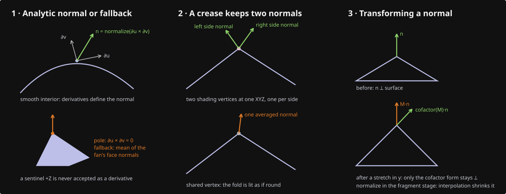

# 09 · Normals and shading

**Estimated study time: about 1–3 hours.** Includes reading, typing, tracing, testing and experiments. [How to use this estimate](map.md#time-estimates).

**This section:** Check face winding and the normals used for shading.

**In the whole viewer:** This connects source topology and display orientation to the lighting decisions made in shaders.

**Follow the data:** Shared-edge traversal → consistent face orientation → normals → light response.

**Start with these files:** [`src/app/walk/brep_orient.rs`](06-cad-contract.md#code-06-007).

**Aim to explain:** How can inconsistent face orientation become a visible shading problem?

[Whole-viewer map and course milestones](map.md)

A normal points away from a face and controls how it responds to light. Two neighbouring faces with consistent orientation traverse their shared edge in opposite directions. We compare that traversal to decide whether their winding agrees, even when they use different local vertex numbers.



Start from the working result of [step 08](08-trimming.md).

This is a review step. Keep your existing code and use the experiment below to check your understanding.

## Check the completed chapter

From `session_viewer`, compare everything you have typed:

```sh
npm --prefix ../session_tests run course -- reference-check 09
```

From `workspace/handwritten`:

```sh
cargo build --lib --locked -j4
cargo xtest --lib --locked -j4
```

Run the native orientation tests. Explain why matching the two faces’ raw vertex indices would be unreliable.

If shading flips between neighbouring faces, compare the common positions and edge directions. Negating every normal may merely move the error to another face.

**Before moving on:** explain what changed, check the expected result above, and fix any build or test failure.

<details>
<summary>Check your explanation of the opening question</summary>

A reversed face can produce a normal pointing the wrong way. Its light response or back-face treatment can then disagree with its neighbours.

</details>

[Next step: 10](10-text-layout.md)
