# 10 · Text shaping

## You are building

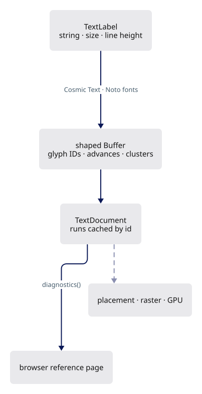

## Starting point

- Checkpoint 09: the CAD fixture shades correctly; no text anywhere.
- This lesson shapes text and measures it against the browser. Nothing is drawn on the canvas.

<!-- step-status: start -->

**Does it compile yet?** Yes — `cargo check` was run at the end of every step of this lesson.

<!-- step-status: end -->

## Step 1 · Bundled fonts

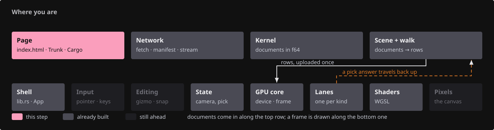{ .locator data-strip="illustrations/strip-4c179dfae1.svg" }

- Fonts are compiled into the WASM with `include_bytes!`: no system-font scan, so every machine shapes identically.
- Install the three font files now; the shaping module cannot compile without them.

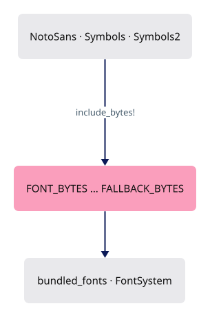

<!-- supplied: 10 -->

The fonts' licence and provenance travel with them.

<!-- file: 10 session_viewer/assets/text/OFL.txt copy -->

<!-- file: 10 session_viewer/assets/text/README.md copy -->

## Step 2 · A clock

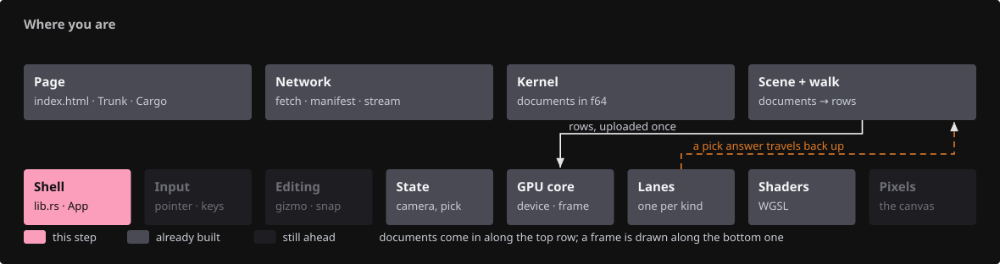{ .locator data-strip="illustrations/strip-45c5341909.svg" }

Shaping and every frame are timed, both from `now_ms`; native builds read the system clock, so the same module compiles for tests.

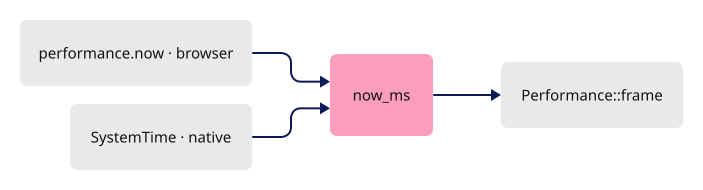

- `Performance::frame` also watches frame spacing while `interacting` is set: thirty drag frames in a row slower than 40 ms raise a one-shot verdict.
- Nothing reads it until lesson 17's `reduce_for_slow_frames` lowers the device scale: measuring first and acting later keeps the number testable alone.

<!-- file: 10 session_viewer/src/engine/performance.rs type -->

## Step 3 · Where a label lives: `TextPlacement`

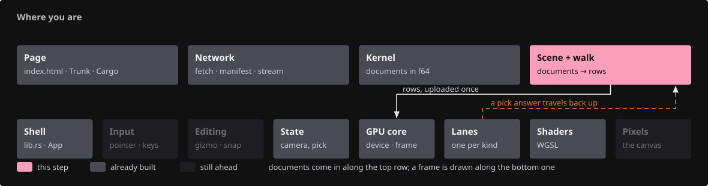{ .locator data-strip="illustrations/strip-cbd4724b14.svg" }

- Placement is intent, not pixels: a camera move changes where text lands, never its string or its glyphs.
- `Screen` is CSS pixels; `Anchor`/`Nameplate` follow a world point with screen-sized glyphs; `WorldBillboard` and `WorldPlane` have a world em height.

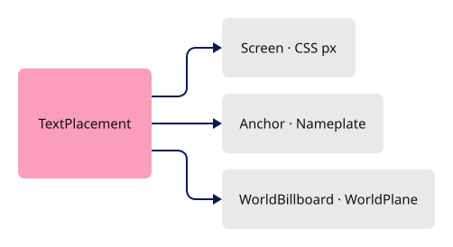

<!-- file: 10 session_viewer/src/engine/text.rs type lines=1-47 -->

## Step 4 · Label, run, document

{ .locator data-strip="illustrations/strip-cbd4724b14.svg" }

- A `TextRun` keeps the source label beside its shaped `Buffer`: editing and selection map glyphs back to characters.
- `TextDocument` owns the `FontSystem`; the GPU side borrows it and owns nothing here.

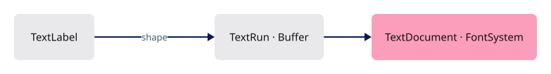

<!-- file: 10 session_viewer/src/engine/text.rs type lines=48-77 -->

## Step 5 · Replace labels without reshaping unchanged ones

{ .locator data-strip="illustrations/strip-cbd4724b14.svg" }

- Validate the whole replacement before touching the current runs; a bad label leaves the old document intact.
- Only `text`, `font_size` and `line_height` participate in shaping; a colour or placement edit reuses the buffer by id.

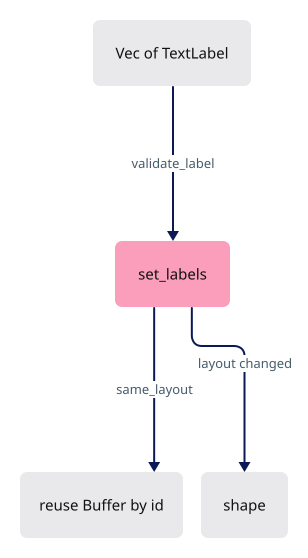

<!-- file: 10 session_viewer/src/engine/text.rs type lines=78-133 -->

## Step 6 · Font replacement, clearing and diagnostics

{ .locator data-strip="illustrations/strip-cbd4724b14.svg" }

- Diagnostics export the shaper's decisions: glyph id, source byte cluster, advance, offset, baseline; the reference page compares them with the browser.
- A cluster is a byte range into the source string: `ffi` may be one glyph, `e` + combining accent one cluster.

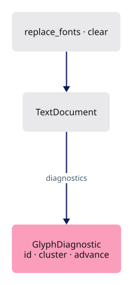

<!-- file: 10 session_viewer/src/engine/text.rs type lines=134-194 -->

- The document owns the `FontSystem`: nothing else in the crate knows where fonts come from.

<!-- file: 10 session_viewer/src/engine/text.rs type lines=195-226 -->

## Step 7 · Validation and the shaping call

{ .locator data-strip="illustrations/strip-cbd4724b14.svg" }

- Non-finite sizes and non-orthonormal plane axes are rejected here, before any raster or integer clip conversion.
- `Shaping::Advanced` does kerning, ligatures and font fallback once, at shape time.

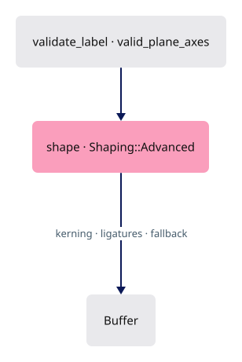

<!-- file: 10 session_viewer/src/engine/text.rs type lines=227-287 -->

<!-- file: 10 session_viewer/src/engine/text.rs type lines=288-324 -->

Unit checks for the shaper live in the same file.

<!-- file: 10 session_viewer/src/engine/text.rs copy lines=325-437 -->

## Step 8 · Declare the modules

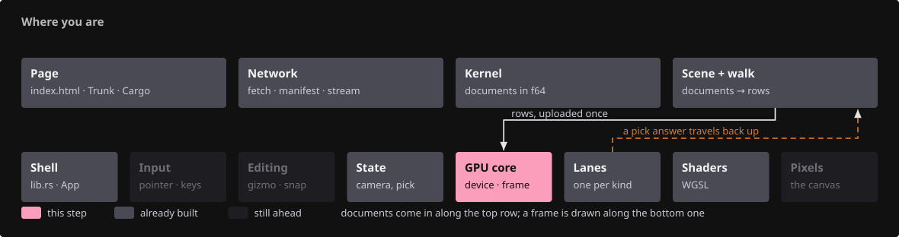{ .locator data-strip="illustrations/strip-24a2b7f974.svg" }

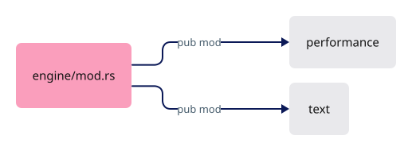

<!-- file: 10 session_viewer/src/engine/mod.rs type -->

<!-- check: 10 -->

## Step 9 · The same-font reference page

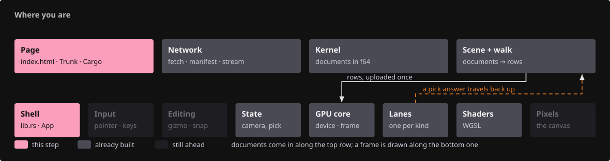{ .locator data-strip="illustrations/strip-eab6f676f4.svg" }

- The page loads the identical font bytes with `@font-face`, sets the same kerning and ligature options, and compares line widths with the shaper's `line_width`.
- The WASM export shapes five sizes, then changes only colour and placement and asserts the shape count held.

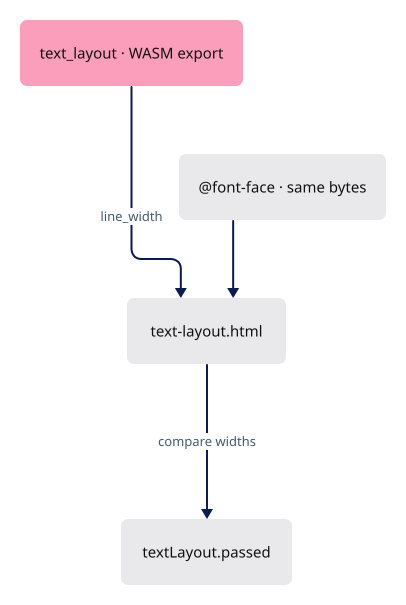

<!-- file: 10 session_viewer/src/text_layout.rs copy -->

<!-- file: 10 session_viewer/src/lib.rs type -->

- A module line and the shaping export; nothing in this lesson draws, so nothing else in the shell changes.

<!-- file: 10 session_viewer/assets/text-layout.html copy -->

<!-- file: 10 session_viewer/index.html copy -->

## Check

<!-- checkpoint: 10 -->

Expected:

- The canvas shows the CAD fixture unchanged, plus an **Inspect shaped text** link at the top right.
- <http://localhost:8780/text-layout.html> shows five white-on-black specimen lines and a status beginning **PASS**.
- The details block lists glyph ids, clusters, advances and baselines for every line.

If the status shows a width difference, compare font bytes, size and the kerning/ligature settings on both sides before adjusting any spacing.

## What changed

<!-- tree: 10 session_viewer/src/engine -->

- `engine/text.rs` owns fonts, labels and shaped runs and touches nothing GPU-side.
- Data flow: `TextLabel` → `shape()` → `Buffer` → `diagnostics()` → browser comparison.

**Production equivalent:** `src/engine/text.rs`, `src/engine/performance.rs`.

## Try

- Open `text-layout.html`, expand the glyph report and find the `AV` of `AVATAR`: the first advance is smaller than a lone `A`, because the kern lands on the first glyph of the pair.
- Count the glyphs shaped for `ffi`: one glyph, three bytes in its cluster; the browser row has the same width, so the ligature is not a viewer invention.
- Compare `é` with the decomposed `e` + combining accent that follows it: both shape to the same single glyph with the same advance, because the shaper composes the base and the mark before it chooses glyphs.
- Change the sample string in `src/text_layout.rs` to `AVATAR AV AT ffi`: the width of `AV` alone shows the kerning without the rest of the line. Keep the `ffi` — the page refuses a line in which no glyph's cluster spans more than one byte.

## Questions and answers

**Nothing is drawn in this lesson. Why is that the right place to stop?**

*How to work it out.* Text comes out wrong on screen: shaping (which glyphs, what advances), rasterization (coverage at this size) or placement (where on screen) could all be to blame, and you cannot tell which. Only shaping has an independent oracle — the browser answers the same question with the same font.

*The answer.* Shaping is verified numerically before pixels exist. Once "these glyphs at these advances" is trusted, a later disagreement must be raster or placement.

**Fonts are compiled into the WASM instead of loaded from the system. What does that buy, and what does it cost?**

*How to work it out.* A system font varies in version, hinting, availability and fallback — each makes a layout bug unreproducible.

*The answer.* Bundling buys identical shaping on every machine — a bug reproducible from a screenshot — and makes the comparison page meaningful: both sides load the same bytes. It costs binary size, so only the faces the viewer uses are bundled.

**A colour change does not reshape; a font-size change does. Which properties participate in shaping, and why those?**

*How to work it out.* Which inputs change *which glyph appears where*? Kerning and ligatures depend on the characters and the size; line breaking depends on the line height. Colour and position only repaint the same glyphs.

*The answer.* `text`, `font_size` and `line_height`. Everything else reuses the shaped buffer by id — so a label follows the camera every frame with no shaper in the loop.

**What is a cluster, and why does the code carry it around?**

*How to work it out.* To map a click on a glyph back to a character: `ffi` can be one glyph from three bytes, `e` plus a combining accent two glyphs for one grapheme. A glyph index alone cannot answer it.

*The answer.* A cluster is the byte range in the source string a glyph came from. Without clusters there is no editing and no text selection — structure carried early because it cannot be retrofitted.

**What you should be able to do now**

Say why replacement validates the whole new document before touching the current runs, and name another place with the same stance. Correct: a partly-applied replacement leaves the document neither old nor new, with no way back — so validate everything, then swap. Lesson 07's empty mesh and lesson 14's staged scene swap take the same all-or-nothing position.

## Next

[11 · Text rendering](11-text-rendering.md): placement, raster scale, coverage atlas and the black plates.
