# 10 · Text shaping

## You are building

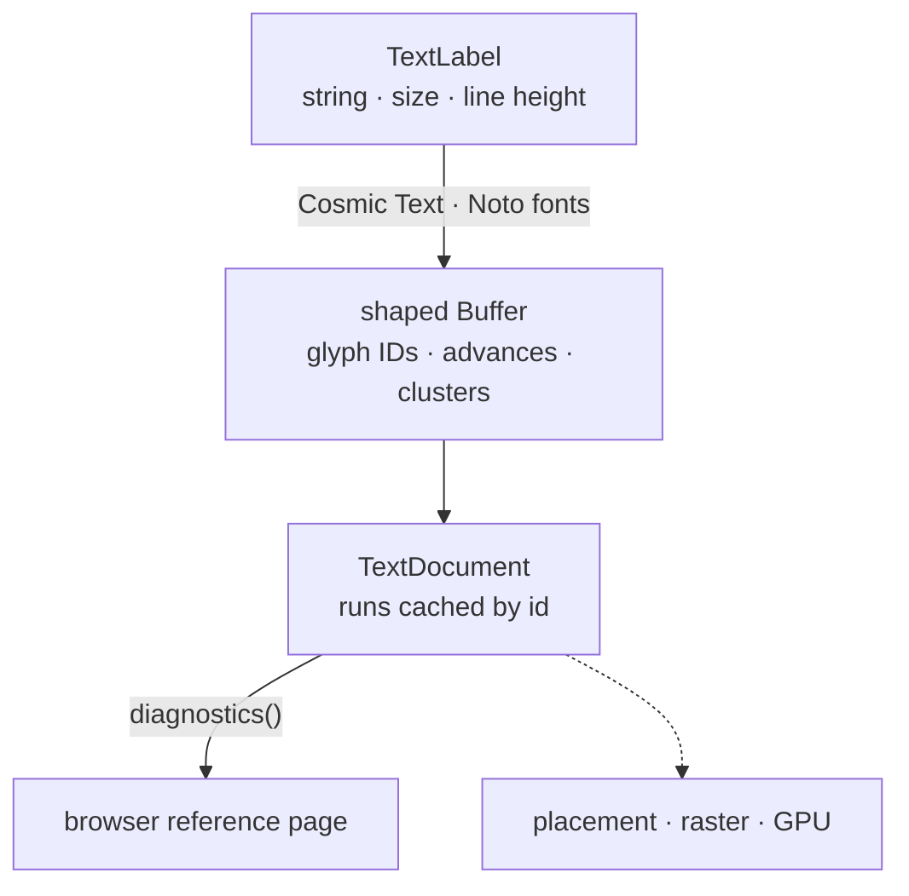

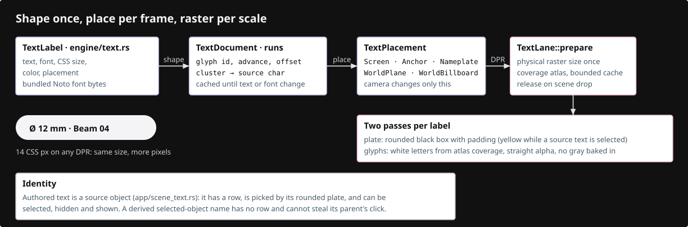

## Starting point

- Checkpoint 09: the CAD fixture shades correctly; no text anywhere.
- This lesson shapes text and measures it against the browser. Nothing is drawn on the canvas.

<!-- step-status: start -->

**Does it compile yet?** Yes, after every step of this lesson — `cargo check` was run at the end of each one to make sure. A step that writes a file Rust has not been told about yet compiles without checking any of it, so keep going to the checkpoint: that build is the real test.

<!-- step-status: end -->

## Step 1 · Bundled fonts

- Fonts are compiled into the WASM with `include_bytes!`; the browser never scans system fonts, so every machine shapes identically.
- Install the three font files now; the shaping module cannot compile without them.

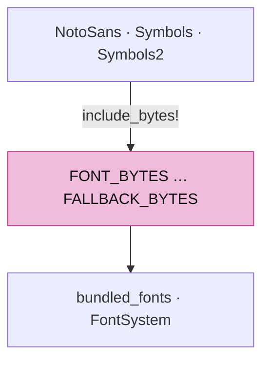

<!-- supplied: 10 -->

The fonts' licence and provenance travel with them.

<!-- file: 10 session_viewer/assets/text/OFL.txt copy -->

<!-- file: 10 session_viewer/assets/text/README.md copy -->

## Step 2 · A clock

Shaping is timed and every frame is timed; both read the same `now_ms`. Native builds read the system clock so the same module compiles for tests.

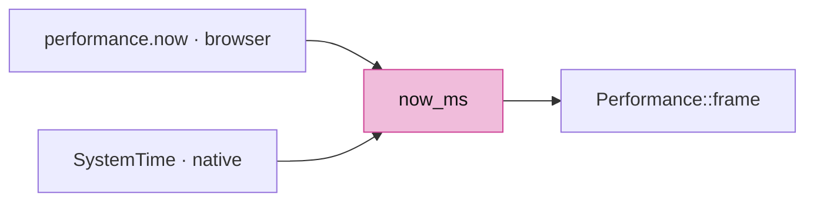

- `Performance::frame` also watches frame spacing while `interacting` is set: thirty drag frames in a row slower than 40 ms raise a one-shot verdict. Nothing reads it yet — lesson 17 adds `reduce_for_slow_frames`, which is what turns the verdict into a lower device scale. Measuring first and acting later is deliberate: the number is easy to test on its own.

<!-- file: 10 session_viewer/src/engine/performance.rs type -->

## Step 3 · Where a label lives: `TextPlacement`

- The placement is intent, not pixels: a camera move changes where the text lands, never its string or its glyphs.
- `Screen` is CSS pixels; `Anchor`/`Nameplate` follow a world point with screen-sized glyphs; `WorldBillboard` and `WorldPlane` have a world em height.

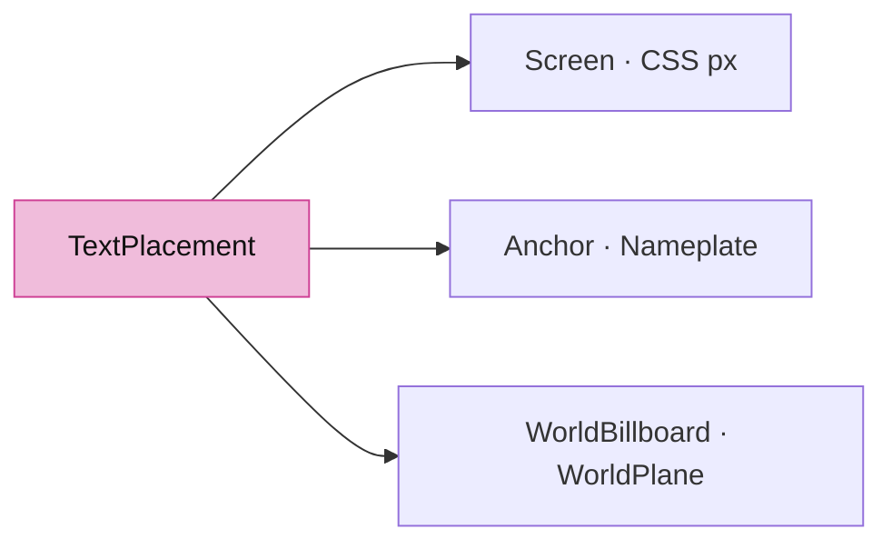

<!-- file: 10 session_viewer/src/engine/text.rs type lines=1-47 -->

## Step 4 · Label, run, document

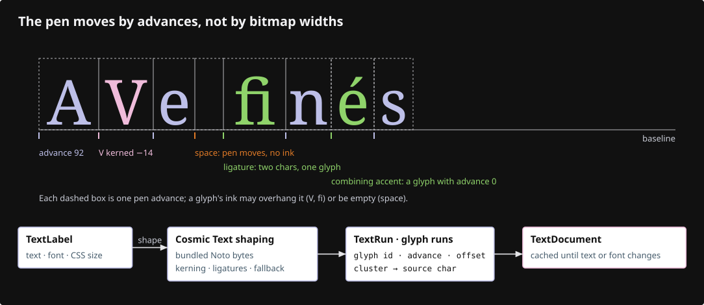

- A `TextRun` keeps the source label next to its shaped `Buffer`, so editing and selection can map glyphs back to characters.
- `TextDocument` owns the `FontSystem`; the GPU side borrows it and owns nothing here.

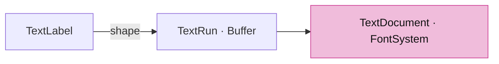

<!-- file: 10 session_viewer/src/engine/text.rs type lines=48-77 -->

## Step 5 · Replace labels without reshaping unchanged ones

- Validate the whole replacement before touching the current runs; a bad label leaves the old document intact.
- Only `text`, `font_size` and `line_height` participate in shaping; a colour or placement edit reuses the buffer by id.

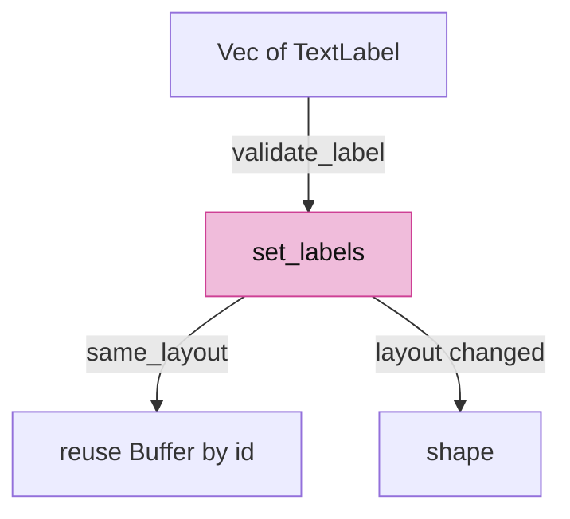

<!-- file: 10 session_viewer/src/engine/text.rs type lines=78-133 -->

## Step 6 · Font replacement, clearing and diagnostics

- Diagnostics export what the shaper decided: glyph id, source byte cluster, advance, offset, baseline. The reference page compares these to the browser.
- A cluster is a byte range into the source string: `ffi` may be one glyph, `e` + combining accent one cluster.

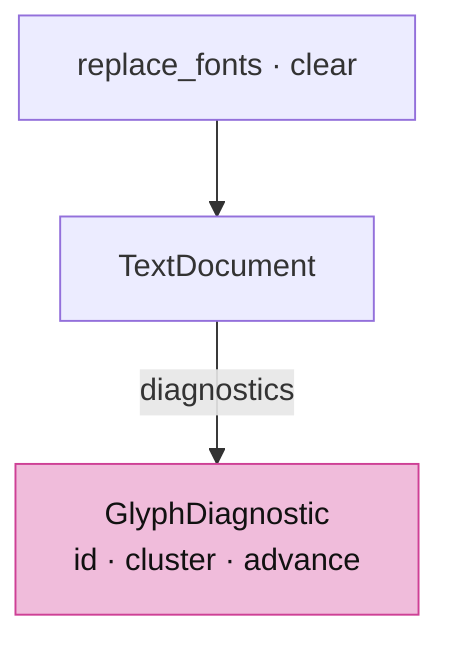

<!-- file: 10 session_viewer/src/engine/text.rs type lines=134-194 -->

- The document owns the `FontSystem`, so a default one can be constructed with the bundled faces already loaded and nothing else in the crate has to know where fonts come from.

<!-- file: 10 session_viewer/src/engine/text.rs type lines=195-226 -->

## Step 7 · Validation and the shaping call

- Non-finite sizes and non-orthonormal plane axes are rejected here, before any raster or integer clip conversion sees them.
- `Shaping::Advanced` is what makes kerning, ligatures and font fallback happen once, at shape time.

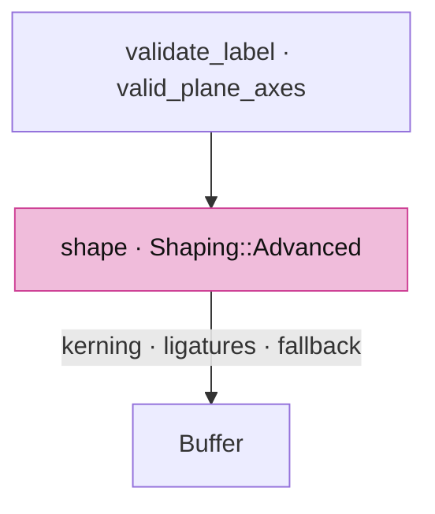

<!-- file: 10 session_viewer/src/engine/text.rs type lines=227-287 -->

- Validation is its own small layer: non-finite sizes and non-orthonormal plane axes are rejected here, before any raster or integer clip conversion can turn them into a silent misplacement.

<!-- file: 10 session_viewer/src/engine/text.rs type lines=288-324 -->

Unit checks for the shaper live in the same file.

<!-- file: 10 session_viewer/src/engine/text.rs copy lines=325-437 -->

## Step 8 · Declare the modules

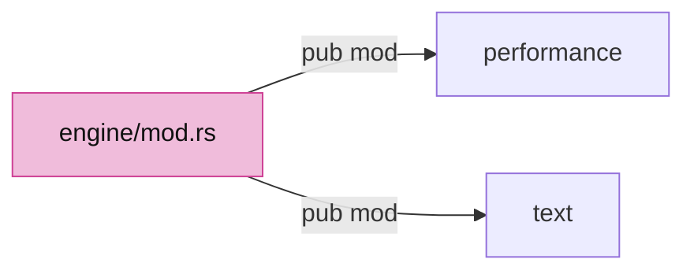

<!-- file: 10 session_viewer/src/engine/mod.rs type -->

<!-- check: 10 -->

## Step 9 · The same-font reference page

- The page loads the identical font bytes with `@font-face`, sets the same kerning and ligature options, and compares line widths with the shaper's `line_width`.
- The WASM export shapes five sizes, then changes only colour and placement and asserts the shape count did not move.

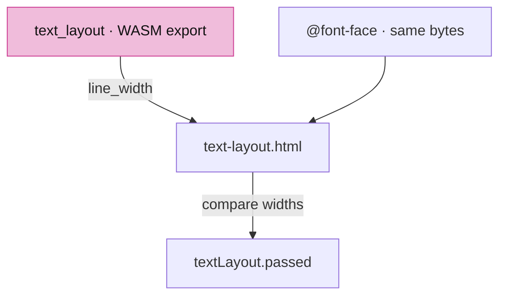

<!-- file: 10 session_viewer/src/text_layout.rs copy -->

<!-- file: 10 session_viewer/src/lib.rs type -->

<!-- file: 10 session_viewer/assets/text-layout.html copy -->

<!-- file: 10 session_viewer/index.html copy -->

## Check

<!-- checkpoint: 10 -->

Expected:

- The canvas shows the CAD fixture unchanged, plus an **Inspect shaped text** link at the top right.
- <http://localhost:8780/text-layout.html> shows five white-on-black specimen lines and a status beginning **PASS**.
- The details block lists glyph ids, clusters, advances and baselines for every line.

If the status shows a width difference, compare font bytes, size and the kerning/ligature settings on both sides before adjusting any spacing.

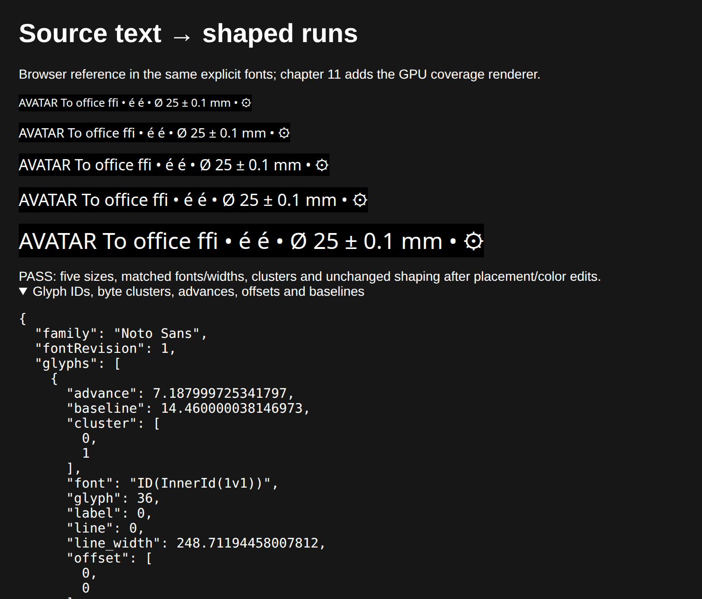

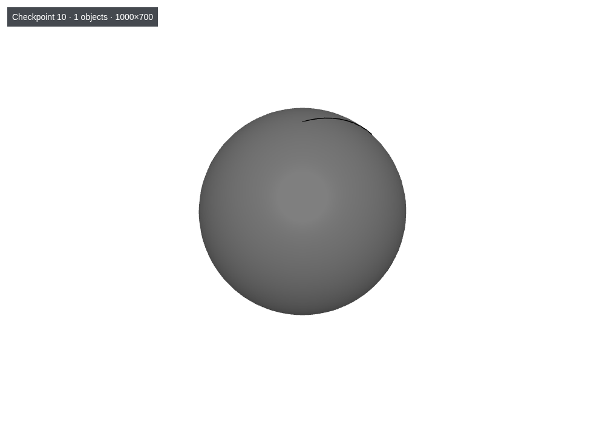

## What changed

<!-- tree: 10 session_viewer/src/engine -->

- `engine/text.rs` owns fonts, labels and shaped runs and touches nothing GPU-side.
- Data flow: `TextLabel` → `shape()` → `Buffer` → `diagnostics()` → browser comparison.

**Production equivalent:** `src/engine/text.rs`, `src/engine/performance.rs`.

## Try

- Open `text-layout.html`, expand the glyph report and find the `AV` of `AVATAR`: the second advance is smaller than a lone `V`, because the pair is kerned.
- Count the glyphs shaped for `ffi`: one glyph, three bytes in its cluster; the browser row has the same width, so the ligature is not a viewer invention.
- Compare `é` with the decomposed `e` + combining accent that follows it: the first is one glyph, the second is two, and the accent glyph carries advance 0.
- Change the sample string in `src/text_layout.rs` to `AVATAR AV AT`: the width of `AV` alone shows the kerning without the rest of the line.

## Questions and answers

**Nothing is drawn in this lesson. Why is that the right place to stop?**

*How to work it out.* Suppose text came out wrong on screen. List the stages that could be to blame: shaping (which glyphs, what advances), rasterization (coverage at this size), placement (where on screen). With all three in play you cannot tell which failed. Now ask whether any stage can be tested on its own — shaping can, because the browser will answer the same question with the same font.

*The answer.* Shaping is the one stage with an independent oracle, so it is verified numerically before pixels exist. Once you can trust "these glyphs at these advances", a later disagreement must be raster or placement.

**Fonts are compiled into the WASM instead of loaded from the system. What does that buy, and what does it cost?**

*How to work it out.* Ask what varies if the font comes from the system: version, hinting, availability, fallback. Every one of those makes a layout bug unreproducible.

*The answer.* It buys identical shaping on every machine — a bug can be reproduced from a screenshot — and makes the comparison page meaningful, since both sides load the same bytes. It costs binary size, which is why only the faces the viewer actually uses are bundled and why unreferenced fonts were worth deleting.

**A colour change does not reshape; a font-size change does. Which properties participate in shaping, and why those?**

*How to work it out.* Ask which inputs could change *which glyph appears where*. Kerning and ligatures depend on the characters and the size; line breaking depends on the line height. Colour and position change how the same glyphs are painted.

*The answer.* `text`, `font_size` and `line_height`. Everything else reuses the shaped buffer by id — which is what lets a label follow the camera every frame without a shaper in the loop.

**What is a cluster, and why does the code carry it around?**

*How to work it out.* Ask how you would map a click on a glyph back to a character. `ffi` can be one glyph from three bytes; `e` plus a combining accent is two glyphs for one grapheme. A glyph index alone cannot answer it.

*The answer.* A cluster is the byte range in the source string that a glyph came from. Without clusters there is no editing and no text selection — the data structure exists for a feature that arrives lessons later, which is worth noticing: some structure is built early because removing it later would be impossible.

**What you should be able to do now**

Say why replacement validates the whole new document before touching the current runs, and name another place with the same stance. Correct: a partly-applied replacement leaves the document in a state that is neither the old one nor the new one, and there is no way back — so validate everything, then swap. Lesson 07's empty mesh and lesson 14's staged scene swap take the same all-or-nothing position.

## Next

[11 · Text rendering](11-text-rendering.md): placement, raster scale, coverage atlas and the black plates.
