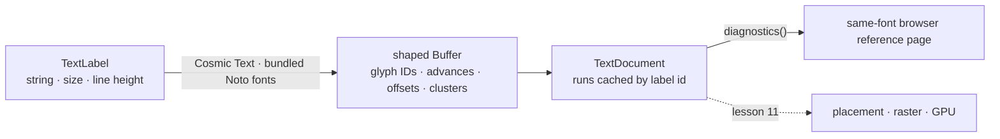

# 10 · Text shaping

## You are building

## Starting point

- Checkpoint 09: the CAD fixture shades correctly; no text anywhere.
- This lesson shapes text and measures it against the browser. Nothing is drawn on the canvas yet.

## Step 1 · Bundled fonts

- Fonts are compiled into the WASM with `include_bytes!`; the browser never scans system fonts, so every machine shapes identically.
- Install the three font files now; the shaping module cannot compile without them.

<!-- supplied: 10 -->

The fonts' licence and provenance travel with them.

<!-- file: 10 session_viewer/assets/text/OFL.txt copy -->

<!-- file: 10 session_viewer/assets/text/README.md copy -->

## Step 2 · A clock

Shaping is timed and later frames are timed; both read the same `now_ms`. Native builds read the system clock so the same module compiles for tests.

<!-- file: 10 session_viewer/src/engine/performance.rs type -->

## Step 3 · Where a label lives: `TextPlacement`

- The placement is intent, not pixels: a camera move changes where the text lands, never its string or its glyphs.
- `Screen` is CSS pixels; `Anchor`/`Nameplate` follow a world point with screen-sized glyphs; `WorldBillboard` and `WorldPlane` have a world em height.

<!-- file: 10 session_viewer/src/engine/text.rs type lines=1-47 -->

## Step 4 · Label, run, document

- A `TextRun` keeps the source label next to its shaped `Buffer`, so editing and selection can map glyphs back to characters.
- `TextDocument` owns the `FontSystem`; the GPU lane in lesson 11 borrows it and owns nothing here.

<!-- file: 10 session_viewer/src/engine/text.rs type lines=48-77 -->

## Step 5 · Replace labels without reshaping unchanged ones

- Validate the whole replacement before touching the current runs; a bad label leaves the old document intact.
- Only `text`, `font_size` and `line_height` participate in shaping; a colour or placement edit reuses the buffer by id.

<!-- file: 10 session_viewer/src/engine/text.rs type lines=78-133 -->

## Step 6 · Font replacement, clearing and diagnostics

- Diagnostics export what the shaper decided: glyph id, source byte cluster, advance, offset, baseline. The reference page compares these to the browser.
- A cluster is a byte range into the source string: `ffi` may be one glyph, `e` + combining accent one cluster.

<!-- file: 10 session_viewer/src/engine/text.rs type lines=134-226 -->

## Step 7 · Validation and the shaping call

- Non-finite sizes and non-orthonormal plane axes are rejected here, before any raster or integer clip conversion sees them.
- `Shaping::Advanced` is what makes kerning, ligatures and font fallback happen once, at shape time.

<!-- file: 10 session_viewer/src/engine/text.rs type lines=227-324 -->

Unit checks for the shaper live in the same file.

<!-- file: 10 session_viewer/src/engine/text.rs copy lines=325-437 -->

## Step 8 · Declare the modules

<!-- file: 10 session_viewer/src/engine/mod.rs type -->

<!-- check: 10 -->

## Step 9 · The same-font reference page

- The page loads the identical font bytes with `@font-face`, sets the same kerning and ligature options, and compares line widths with the shaper's `line_width`.
- The WASM export shapes five sizes, then changes only colour and placement and asserts the shape count did not move.

<!-- file: 10 session_viewer/src/text_layout.rs copy -->

<!-- file: 10 session_viewer/src/lib.rs type -->

<!-- file: 10 session_viewer/assets/text-layout.html copy -->

<!-- file: 10 session_viewer/index.html copy -->

## Check

<!-- checkpoint: 10 -->

Expected:

- The canvas shows the same CAD fixture as checkpoint 09, plus an **Inspect shaped text** link at the top right.
- <http://localhost:8780/text-layout.html> shows five white-on-black specimen lines and a status beginning **PASS**.
- The details block lists glyph ids, clusters, advances and baselines for every line.

If the status shows a width difference, compare font bytes, size and the kerning/ligature settings on both sides before adjusting any spacing.

## What changed

<!-- tree: 10 session_viewer/src/engine -->

- `engine/text.rs` owns fonts, labels and shaped runs; nothing GPU-side yet.
- Data flow: `TextLabel` → `shape()` → `Buffer` → `diagnostics()` → browser comparison.

**Production equivalent:** `src/engine/text.rs`, `src/engine/performance.rs` (lesson 17 adds selection colours to the label).

## Next

[11 · Text rendering](11-text-rendering.md): placement, raster scale, coverage atlas and the black plates.
