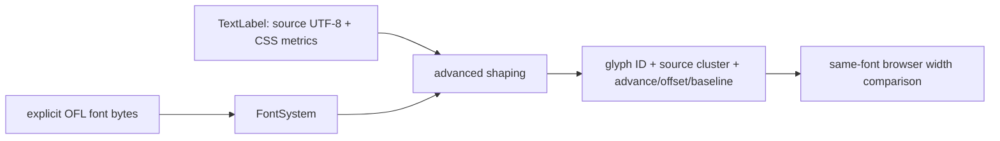

# 10 — Font resources and shaped source text

Starting checkpoint: 09. Keep the CAD scene running while adding the final CPU text owner and an independent same-font layout inspection page.



Text alternative: explicit font bytes and source labels enter advanced shaping, producing positioned glyphs whose metrics are compared with the same-font browser run.

1. Load fonts, shape source runs and inspect their coordinates before GPU rasterization.

**COPY/PASTE — binary inputs for the manual route.** After the source edits, run this before `--adopt`; it copies only the hash-checked font/PB inputs that cannot be typed or represented in the plain-text patch. Automatic `--advance` already performs this step.

```sh
python3 "$COURSE_REPO/docs/reconstruction/replay.py" --output /tmp/viewer-course --through 10 --copy-assets
```

**COPY/PASTE — complete additions and a verified checkpoint.** Starting at 09, [the complete patch](reconstruction/patches/10.patch) supplies every listed file/import, WGSL registration and HTML asset link; binary font files come from the hash-checked font store listed by the replay driver.

```sh
python3 "$COURSE_REPO/docs/reconstruction/replay.py" --output /tmp/viewer-course --through 10 --advance --verify --target-dir "$COURSE_REPO/target"
```

For manual reconstruction, apply each complete patch change while substituting the **TYPE BY HAND** blocks below for their corresponding additions; finish with `--adopt --verify` instead of `--advance --verify` to verify the exact source tree.

**COPY/PASTE — exact font and shaper integration.** Add complete `src/engine/text.rs`, `src/engine/performance.rs`, `src/text_layout.rs`, module registrations, `assets/text-layout.html` and its Trunk links from 10.patch; the three TTF files and `OFL.txt` are the same [bundled font resources](../assets/text/README.md) as production.

Glyphon 0.11.0 exposes the pinned cosmic-text/Swash stack compatible with wgpu 29.0.4; `bundled_fonts` creates a database from these bytes only, with explicit symbol fallback.

**TYPE BY HAND — in `src/engine/text.rs`, add the complete `TextLabel` and `GlyphDiagnostic` records with their derives.** Label dimensions are CSS pixels; diagnostic clusters are UTF-8 byte ranges, so glyph count is not character count.

```rust
#[derive(Clone, Debug, PartialEq)]
pub struct TextLabel {
    pub id: u32,
    pub text: String,
    pub font_size: f32,
    pub line_height: f32,
    pub color: [u8; 4],
    pub placement: TextPlacement,
    /// Left, top, right, bottom in canvas CSS coordinates; never inferred from glyph bounds.
    pub clip: Option<[f32; 4]>,
}
```
```rust
#[derive(Clone, Debug, Serialize)]
pub struct GlyphDiagnostic {
    pub label: u32,
    pub line: usize,
    pub cluster: [usize; 2],
    pub glyph: u16,
    pub font: String,
    pub origin: [f32; 2],
    pub advance: f32,
    pub offset: [f32; 2],
    pub baseline: f32,
    pub line_width: f32,
}
```

**TYPE BY HAND — replace the complete `shape` helper in `src/engine/text.rs`.** The library chooses glyphs, kerning, ligatures and fallback; the viewer never spaces individual Unicode characters itself.

```rust
fn shape(fonts: &mut FontSystem, label: &TextLabel) -> Buffer {
    let mut buffer = Buffer::new(fonts, Metrics::new(label.font_size, label.line_height));
    buffer.set_size(fonts, None, None);
    buffer.set_wrap(fonts, Wrap::None);
    buffer.set_text(
        fonts,
        &label.text,
        &Attrs::new()
            .family(Family::Name(FONT_FAMILY))
            .metadata(label.id as usize),
        Shaping::Advanced,
        None,
    );
    buffer.shape_until_scroll(fonts, false);
    buffer
}
```

**TYPE BY HAND — replace the complete `same_layout` helper and `TextDocument::set_labels` method.** Source/metrics affect shaping; placement/color affect document revision while reusing the shaped buffer.

```rust
fn same_layout(a: &TextLabel, b: &TextLabel) -> bool {
    a.text == b.text && a.font_size == b.font_size && a.line_height == b.line_height
}
```
```rust
pub fn set_labels(&mut self, labels: Vec<TextLabel>) -> anyhow::Result<()> {
        let mut bytes = 0usize;
        let mut ids = std::collections::HashSet::new();
        for label in &labels {
            bytes = bytes.saturating_add(label.text.len());
            anyhow::ensure!(bytes <= MAX_TEXT_BYTES, "text document exceeds 256 KiB");
            anyhow::ensure!(ids.insert(label.id), "duplicate text label ID {}", label.id);
            validate_label(label)?;
        }
        if self.runs.len() == labels.len() {
            let mut unchanged = true;
            for (run, label) in self.runs.iter().zip(&labels) {
                unchanged &= run.label == *label;
            }
            if unchanged {
                return Ok(());
            }
        }
        let previous = std::mem::take(&mut self.runs);
        let mut previous_by_id = std::collections::HashMap::new();
        for run in previous {
            previous_by_id.insert(run.label.id, run);
        }
        for label in labels {
            let old = previous_by_id.remove(&label.id);
            let buffer = match old {
                Some(run) if same_layout(&run.label, &label) => run.buffer,
                _ => {
                    self.shape_count += 1;
                    let started = crate::engine::performance::now_ms();
                    let buffer = shape(&mut self.fonts, &label);
                    self.shaping_ms += crate::engine::performance::now_ms() - started;
                    buffer
                }
            };
            self.runs.push(TextRun { label, buffer });
        }
        self.revision = self.revision.wrapping_add(1);
        Ok(())
    }
```

**COPY/PASTE — inspect and assert the positioned result.** The full `TextDocument::diagnostics` implementation records `glyph.x/y`, `glyph.w`, normalized bearing offsets multiplied by font size, and `line.line_y`; `src/text_layout.rs` changes only placement/color and asserts the shape count stays five.

| Field | Meaning |
| --- | --- |
| `cluster` | Original source byte interval; ligatures/combining text may share a glyph. |
| `origin`, `advance` | Logical glyph origin and horizontal advance, before framebuffer scale. |
| `offset` | Shaper offsets multiplied by font size; these are not arbitrary inter-letter gaps. |
| `baseline`, `line_width` | Line coordinates used by the matching browser reference. |
| `font`, `glyph` | Actual fallback face and glyph ID; zero remains an explicit missing glyph. |

**TYPE BY HAND — in `assets/text-layout.html`, find the `start` function and replace this complete metric assertion statement after `const difference = Math.abs(browser-width);`.** The tolerance covers browser floating-point font metrics, not subjective raster similarity.

```javascript
if (difference > 0.2) throw Error(`Same-font width differs at ${row.size}px: ${difference}`);
```

**COPY/PASTE — run both the scene and the layout page.**

```sh
cd /tmp/viewer-course/session_viewer
REGEN_PROTO=0 NO_COLOR=true trunk serve
```

Open <http://127.0.0.1:8770/> and its **Inspect shaped text** link. `/text-layout.html` must report five matched sizes (12/14/16/18/24), nonmissing glyph IDs and unchanged shaping after placement/color edits; open the diagnostic disclosure to compare `ffi`, accents, CAD symbols and fallback face IDs.

The page exposes read-only `window.textLayout.passed` and all measured widths for browser verification. It deliberately uses DOM reference text here; chapter 11 replaces this temporary fixture with the maintained GPU/browser comparison.
