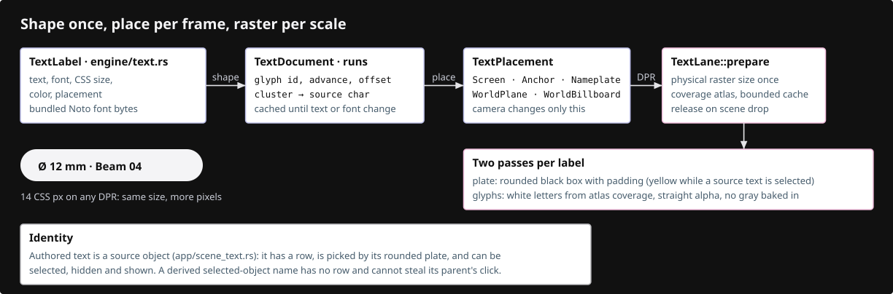

# 10 · Text shaping

**Estimated study time: about 5–15 hours.** Includes reading, typing, tracing, testing and experiments. [How to use this estimate](map.md#time-estimates).

**This section:** Turn text into shaped glyph runs and measured positions.

**In the whole viewer:** Text layout sits before drawing. It decides which glyphs and placements the text renderer receives.

**Follow the data:** String and font → shaping → glyph sequence and advances → measured text.

**Start with these files:** [`src/engine/text.rs`](10-text-layout.md#code-10-002).

**Aim to explain:** Why can character count not determine the width of a label?

[Whole-viewer map and course milestones](map.md)

Text is more than one picture per character. The font can combine letters into ligatures, change their spacing, and select different glyphs for different scripts. Shaping turns the text into positioned glyphs. We do that only when the layout inputs change.



Start from the working result of [step 09](09-normals.md).

**One buildable step:** type the additions below in `workspace/handwritten`, then build and test. This step adds 570 lines across 2 files and may take several sittings. Individual listings are parts of this step, not separate build checkpoints.

<span id="code-10-001"></span>

## `src/engine/mod.rs`

Append **after line 4** of your current file.

Blank lines before: **1**; after: **0**. End with a newline.

```rust
--8<-- "typing/code/10-001.rs"
```

<span id="code-10-002"></span>

## `src/engine/text.rs`

A string is not a row of equally sized boxes. Shaping chooses glyphs, advances and placement; fallback fonts provide missing characters. Layout works in text coordinates before the renderer places the result in the world.

Create this file. Type the complete listing, including comments and blank lines.

```rust
--8<-- "typing/code/10-002.rs"
```

## Check the completed chapter

From `session_viewer`, compare everything you have typed:

```sh
npm --prefix ../session_tests run course -- reference-check 10
```

From `workspace/handwritten`:

```sh
cargo build --lib --locked -j4
cargo xtest --lib --locked -j4
```

Run the native text-layout tests. Identify which changes invalidate layout and which can reuse it.

If glyphs are missing, first check that the bundled font covers the text. If spacing is wrong, inspect the shaping inputs before changing the GPU positions.

**Before moving on:** explain what changed, check the expected result above, and fix any build or test failure.

<details>
<summary>Check your explanation of the opening question</summary>

Glyph widths differ, and shaping can combine or reposition characters. The shaped glyph advances determine the layout.

</details>

[Next step: 11](11-text-rendering.md)
