# 11 · Text rendering

## You are building

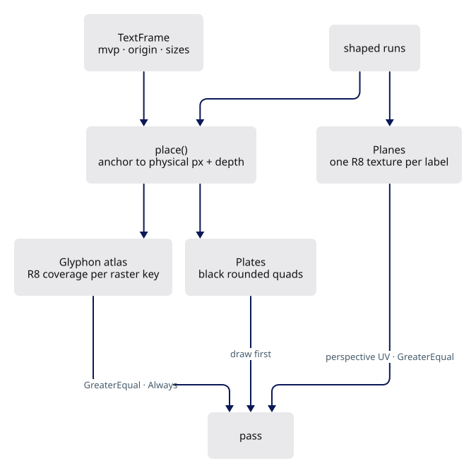

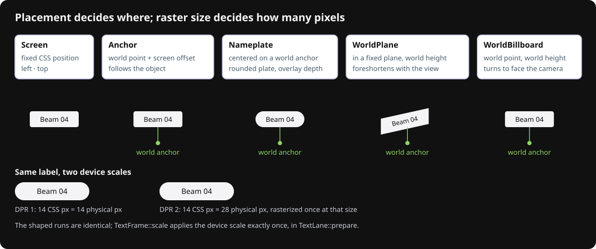

## Starting point

- Checkpoint 10: labels are shaped and measured, nothing drawn.
- Three GPU owners appear: plates (black backing), planes (fixed world text), and the lane driving Glyphon and both.

<!-- step-status: start -->

**Does it compile yet?** Yes — `cargo check` was run at the end of every step of this lesson.

<!-- step-status: end -->

## Step 1 · Supplied comparison page

Install the supplied same-font comparison page and its WASM export first; `lib.rs` declares the module in the last step.

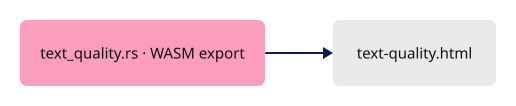

<!-- supplied: 11 -->

## Step 2 · Black plates

{ .locator data-strip="illustrations/strip-5c9e80c7f0.svg" }

- A plate is six clip-space vertices plus the local offset, half size and corner radius the fragment shader needs for a rounded edge.
- Depth compare `Always`, no depth write: a plate is an overlay and never occludes geometry.

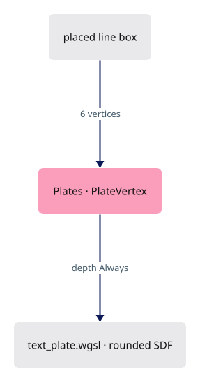

<span class="zone-mark" data-strip="illustrations/strip-a34e542105.svg" data-zone="Lanes"></span>

<!-- file: 11 session_viewer/src/engine/gpu/text_plate.rs type lines=1-73 -->


<span class="zone-mark" data-strip="illustrations/strip-a34e542105.svg" data-zone="Lanes"></span>

<!-- file: 11 session_viewer/src/engine/gpu/text_plate.rs type lines=74-100 -->

Vertex layout ↔ shader locations:

```text
Rust vertex_attr_array (stride 28)          WGSL vs_main
0 => Float32x2  clip position          ↔  @location(0) position: vec2<f32>
1 => Float32x2  local offset           ↔  @location(1) local: vec2<f32>
2 => Float32x2  half size              ↔  @location(2) half_size: vec2<f32>
3 => Float32    radius                 ↔  @location(3) radius: f32
```

<span class="zone-mark" data-strip="illustrations/strip-a34e542105.svg" data-zone="Lanes"></span>

<!-- file: 11 session_viewer/src/engine/gpu/text_plate.rs type lines=101-148 -->

The signed distance to a rounded rectangle gives one physical pixel of edge coverage; the colour is always black.

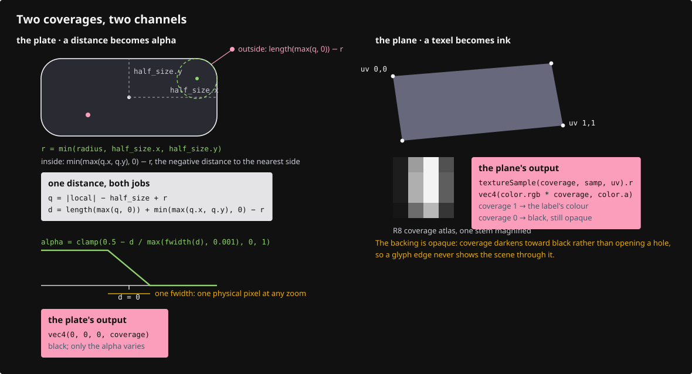

<span class="zone-mark" data-strip="illustrations/strip-62db6ccc73.svg" data-zone="Shaders"></span>

<!-- file: 11 session_viewer/src/shaders/text_plate.wgsl type -->

## Step 3 · Fixed world planes: records and resources

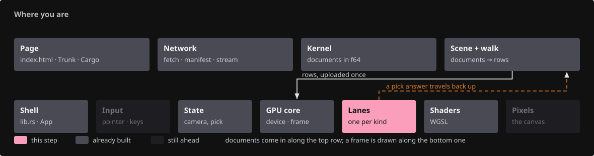{ .locator data-strip="illustrations/strip-a34e542105.svg" }

- A `WorldPlane` label keeps one coverage texture; a camera move rewrites only six vertices.
- The texture budget is a hard cap independent of the adapter: one huge label cannot take the scene's memory.

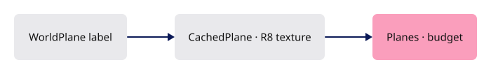

<span class="zone-mark" data-strip="illustrations/strip-a34e542105.svg" data-zone="Lanes"></span>

<!-- file: 11 session_viewer/src/engine/gpu/text_plane.rs type lines=1-33 -->

- The lane borrows the viewer's device and target and owns only its coverage textures: the budget lives in one place.

<span class="zone-mark" data-strip="illustrations/strip-a34e542105.svg" data-zone="Lanes"></span>

<!-- file: 11 session_viewer/src/engine/gpu/text_plane.rs type lines=34-83 -->

## Step 4 · Planes: prepare

{ .locator data-strip="illustrations/strip-a34e542105.svg" }

- Placement and colour changes keep the texture; text, font or a larger projected em rebuilds it.
- Resolution grows in power-of-two em buckets, so small camera motion never re-rasterizes.

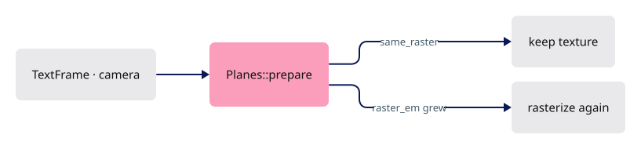

<span class="zone-mark" data-strip="illustrations/strip-a34e542105.svg" data-zone="Lanes"></span>

<!-- file: 11 session_viewer/src/engine/gpu/text_plane.rs type lines=84-142 -->

<span class="zone-mark" data-strip="illustrations/strip-a34e542105.svg" data-zone="Lanes"></span>

<!-- file: 11 session_viewer/src/engine/gpu/text_plane.rs type lines=143-219 -->


<span class="zone-mark" data-strip="illustrations/strip-a34e542105.svg" data-zone="Lanes"></span>

<!-- file: 11 session_viewer/src/engine/gpu/text_plane.rs type lines=220-258 -->

## Step 5 · Planes: projection, raster and the quad

{ .locator data-strip="illustrations/strip-5c9e80c7f0.svg" }

- `project` keeps clip `w`; the shader divides, so UVs stay perspective-correct across the plane.
- `rasterize` composites Swash glyph images into one R8 texture at the chosen em size, bearings and baseline included.
- `append_quad` walks the label's right/up axes in world units; every vertex carries full clip coordinates and the CSS clip in physical pixels.

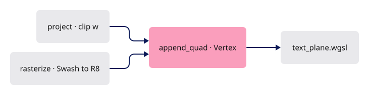

<span class="zone-mark" data-strip="illustrations/strip-a34e542105.svg" data-zone="Lanes"></span>

<!-- file: 11 session_viewer/src/engine/gpu/text_plane.rs type lines=259-322 -->

<span class="zone-mark" data-strip="illustrations/strip-a34e542105.svg" data-zone="Lanes"></span>

<!-- file: 11 session_viewer/src/engine/gpu/text_plane.rs type lines=323-402 -->

- Screen-space text takes the other path, through Glyphon's shared atlas.

<span class="zone-mark" data-strip="illustrations/strip-a34e542105.svg" data-zone="Lanes"></span>

<!-- file: 11 session_viewer/src/engine/gpu/text_plane.rs type lines=403-467 -->

Bindings and vertex layout ↔ shader:

```text
Rust bind group layout (group 0)             WGSL
binding 0  Texture 2D float             ↔  @group(0) @binding(0) var coverage_texture: texture_2d<f32>
binding 1  Sampler filtering            ↔  @group(0) @binding(1) var coverage_sampler: sampler

vertex_attr_array (stride 56)
0 => Float32x4  clip position           ↔  @location(0) position: vec4<f32>
1 => Float32x2  uv                      ↔  @location(1) uv: vec2<f32>
2 => Float32x4  colour                  ↔  @location(2) color: vec4<f32>
3 => Float32x4  clip rectangle          ↔  @location(3) clip: vec4<f32>
```

<span class="zone-mark" data-strip="illustrations/strip-a34e542105.svg" data-zone="Lanes"></span>

<!-- file: 11 session_viewer/src/engine/gpu/text_plane.rs type lines=468-492 -->

<span class="zone-mark" data-strip="illustrations/strip-62db6ccc73.svg" data-zone="Shaders"></span>

<!-- file: 11 session_viewer/src/shaders/text_plane.wgsl type -->

A native GPU check for the plane path ends the file.

<span class="zone-mark" data-strip="illustrations/strip-a34e542105.svg" data-zone="Lanes"></span>

<!-- file: 11 session_viewer/src/engine/gpu/text_plane.rs copy lines=493-588 -->

## Step 6 · The text lane: frame input and counters

{ .locator data-strip="illustrations/strip-a34e542105.svg" }

- `TextFrame` is what placement needs from the frame: rebased camera, anchor origin, physical and logical sizes.
- `logical` comes from the canvas CSS box, not `devicePixelRatio`; that makes browser zoom and DPR both work.

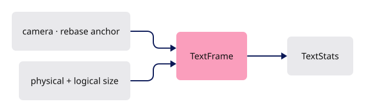

<span class="zone-mark" data-strip="illustrations/strip-a34e542105.svg" data-zone="Lanes"></span>

<!-- file: 11 session_viewer/src/engine/gpu/text.rs type lines=1-61 -->

## Step 7 · The lane owns Glyphon

{ .locator data-strip="illustrations/strip-a34e542105.svg" }

- Two renderers share one atlas: `anchored` compares depth `GreaterEqual` (reversed Z, occluded by solids), `overlay` is `Always`.
- `retarget` follows the scene's sample count without reshaping or dropping the atlas.

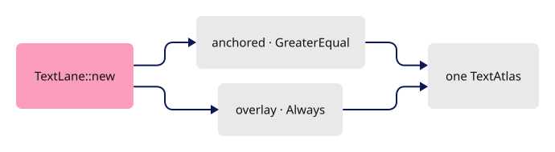

<span class="zone-mark" data-strip="illustrations/strip-a34e542105.svg" data-zone="Lanes"></span>

<!-- file: 11 session_viewer/src/engine/gpu/text.rs type lines=62-121 -->

- Replacement is all-or-nothing: an invalid submission leaves the previous document standing, so a bad label cannot empty the screen.

<span class="zone-mark" data-strip="illustrations/strip-a34e542105.svg" data-zone="Lanes"></span>

<!-- file: 11 session_viewer/src/engine/gpu/text.rs type lines=122-144 -->

## Step 8 · Prepare: place, rasterize, build both draw lists

{ .locator data-strip="illustrations/strip-a34e542105.svg" }

- The key `(document revision, font revision, frame)` skips the whole preparation when nothing moved.
- Raster keys are bounded: past the budget the atlas and Swash cache rebuild together, so no prepared vertex points at an evicted glyph.

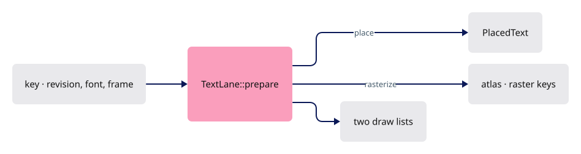

<span class="zone-mark" data-strip="illustrations/strip-a34e542105.svg" data-zone="Lanes"></span>

<!-- file: 11 session_viewer/src/engine/gpu/text.rs type lines=145-218 -->

<span class="zone-mark" data-strip="illustrations/strip-a34e542105.svg" data-zone="Lanes"></span>

<!-- file: 11 session_viewer/src/engine/gpu/text.rs type lines=219-273 -->

- Glyphon needs a callback mapping each shaped run to its label's clip depth: the atlas knows glyphs, not scenes, so depth comes from this side.

## Step 9 · Draw order, reset, release

{ .locator data-strip="illustrations/strip-a34e542105.svg" }

Planes first (they are in the scene), then anchored glyphs, then plates, then overlay glyphs on top of their plates.

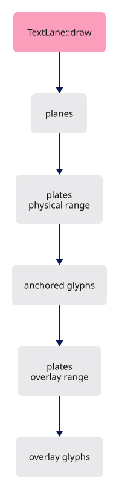

<span class="zone-mark" data-strip="illustrations/strip-a34e542105.svg" data-zone="Lanes"></span>

<!-- file: 11 session_viewer/src/engine/gpu/text.rs type lines=274-340 -->

## Step 10 · CSS to physical, once

{ .locator data-strip="illustrations/strip-a34e542105.svg" }

- `scale()` derives one isotropic raster scale from framebuffer ÷ CSS box and rejects a stretched canvas.
- `place()` projects only the anchor; behind-camera and out-of-range anchors are culled, never drawn inverted.
- A `Nameplate` is centred on the shaped line box and gets no depth: the annotation overlays the solid it names.

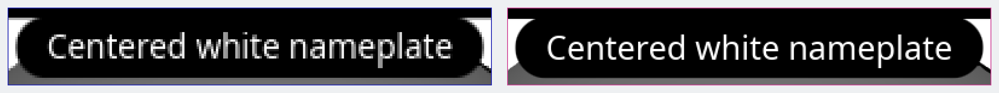

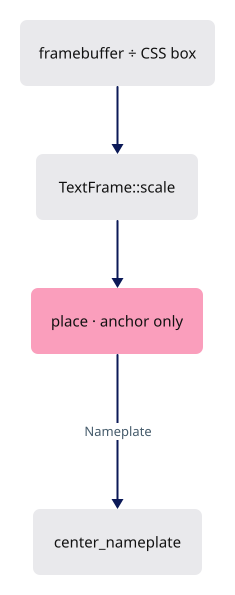

<span class="zone-mark" data-strip="illustrations/strip-a34e542105.svg" data-zone="Lanes"></span>

<!-- file: 11 session_viewer/src/engine/gpu/text.rs type lines=341-374 -->

- Only the anchor is projected: following a world point needs one clip position, then screen-space layout.

<span class="zone-mark" data-strip="illustrations/strip-a34e542105.svg" data-zone="Lanes"></span>

<!-- file: 11 session_viewer/src/engine/gpu/text.rs type lines=375-431 -->

<span class="zone-mark" data-strip="illustrations/strip-a34e542105.svg" data-zone="Lanes"></span>

<!-- file: 11 session_viewer/src/engine/gpu/text.rs type lines=432-498 -->

- Glyphon owns its own shaders; the lane only hands it a depth state.

<span class="zone-mark" data-strip="illustrations/strip-a34e542105.svg" data-zone="Lanes"></span>

<!-- file: 11 session_viewer/src/engine/gpu/text.rs type lines=499-548 -->

Native checks for scale, depth, nameplates and cache eviction live in the same file.

<span class="zone-mark" data-strip="illustrations/strip-a34e542105.svg" data-zone="Lanes"></span>

<!-- file: 11 session_viewer/src/engine/gpu/text.rs copy lines=549-949 -->

<!-- check: 11 -->

## Step 11 · Wire the lane into the frame

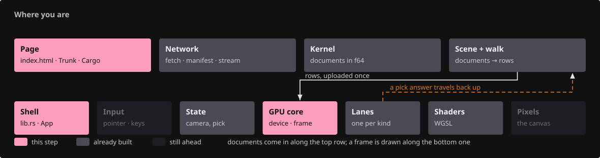{ .locator data-strip="illustrations/strip-5ae6140b12.svg" }

- `write_frame_uniforms` also prepares text and can fail (a stretched canvas), so it returns a `Result`.
- Text draws after mesh ink in the same pass, against the same read-only depth.

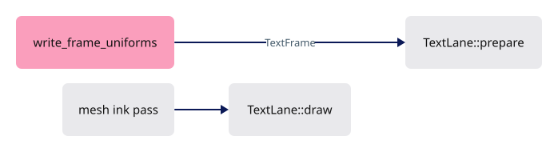

<span class="zone-mark" data-strip="illustrations/strip-54e1511b20.svg" data-zone="GPU core"></span>

<!-- file: 11 session_viewer/src/engine/gpu/mod.rs type -->

Three fixture labels: a nameplate above the model, a rounded centred nameplate, and one fixed world plane.

<span class="zone-mark" data-strip="illustrations/strip-3bd0a898de.svg" data-zone="Shell"></span>

<!-- file: 11 session_viewer/src/lib.rs type -->

The supplied comparison page replaces the shaping reference page and its export.

<span class="zone-mark" data-strip="illustrations/strip-3bd0a898de.svg" data-zone="Shell"></span>

<!-- file: 11 session_viewer/src/text_layout.rs -->

<span class="zone-mark" data-strip="illustrations/strip-63a57b9919.svg" data-zone="Page"></span>

<!-- file: 11 session_viewer/assets/text-layout.html -->

<span class="zone-mark" data-strip="illustrations/strip-63a57b9919.svg" data-zone="Page"></span>

<!-- file: 11 session_viewer/assets/text-quality.html copy -->

<span class="zone-mark" data-strip="illustrations/strip-63a57b9919.svg" data-zone="Page"></span>

<!-- file: 11 session_viewer/index.html copy -->

## Check

<!-- checkpoint: 11 -->

Expected:

- White text on black plates above the model; one rounded plate centred on the scene.
- Orbit: the fixed-plane label foreshortens and is hidden by solids; the nameplates stay upright and screen-sized.
- Resize or change browser zoom: glyphs keep their shape and spacing, the plate keeps its padding.
- The **Compare GPU text** link opens the supplied page with the same fonts side by side.

If letters look blurred at one zoom level, check `TextFrame::scale`; if a plate clips its last glyph, check the padding in `center_nameplate`.

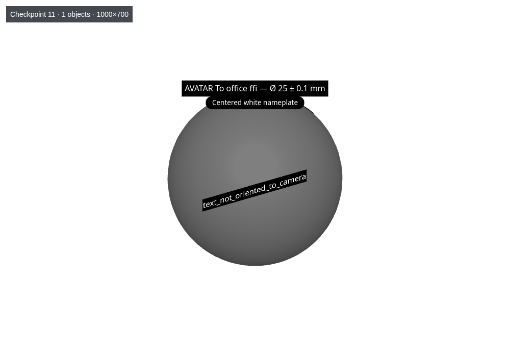

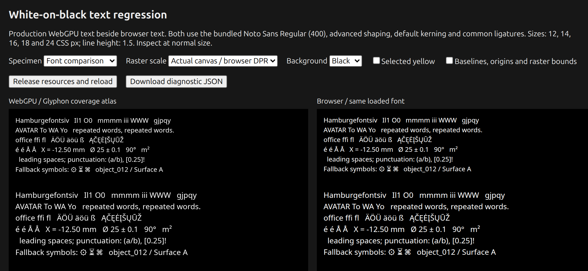

## What changed

<!-- tree: 11 session_viewer/src/engine/gpu -->

- `TextLane` owns Glyphon's atlas, two renderers, plates and planes.
- Data flow: shaped run → `place()` → physical position + depth → atlas / R8 texture → three draws in the scene pass.

**Production equivalent:** `src/engine/gpu/text.rs`, `text_plate.rs`, `text_plane.rs`, `src/shaders/text_plate.wgsl`, `text_plane.wgsl`.

## Try

- Add `?perspective` to the URL: the fixed-plane label converges with the view while the nameplates keep their screen size.
- Change `padding: [6.0, 4.0]` of the first nameplate in `src/lib.rs` to `[20.0, 4.0]`: the plate grows around the same glyphs.
- Set the browser zoom to 200 percent: the raster key changes, glyphs stay sharp, and no plate clips its last letter.
- On the comparison page, tick **Baselines, origins and raster bounds** and switch the raster scale: the raster box scales, the CSS box does not.

## Questions and answers

**`logical` comes from the canvas CSS box, not from `devicePixelRatio`. Why does that distinction matter here of all places?**

*How to work it out.* Two things change the ratio between CSS pixels and physical pixels: the display's device pixel ratio *and* browser zoom. `devicePixelRatio` moves with zoom on some browsers and not others; the canvas's own measured box always reflects both.

*The answer.* Deriving the raster scale from `devicePixelRatio` alone gives text crisp at 100% zoom and blurry at 125%. The lane derives one isotropic scale from framebuffer ÷ CSS box, and rejects a stretched canvas outright rather than rendering text at the wrong aspect.

**Raster resolution grows in power-of-two em buckets. What would continuous resolution cost?**

*How to work it out.* Zoom smoothly with a continuous scale: the projected em changes every frame, so "is my raster the right size?" fails every frame, and re-rasterizing means Swash plus an atlas upload.

*The answer.* A re-raster on nearly every frame. Buckets make small camera motion free and charge only for a real change in size — the same instinct as `MaskKey` (lesson 18) and the splat prelude key (04d): make expensive work depend on a quantised key, never a continuous one.

**Two Glyphon renderers share one atlas, with different depth rules. Why two, and why one atlas?**

*How to work it out.* A label in the scene and a label over it differ only in the depth rule; their glyph bytes are identical. A pipeline's depth state is fixed at creation, so the second rule needs a second renderer; identical bytes need no second atlas.

*The answer.* Two renderers because anchored text must be occluded by solids (`GreaterEqual` under reversed Z) and overlay text must not (`Always`). One atlas because a second would double texture memory and eviction bookkeeping for nothing.

**Raster keys are bounded, and passing the budget rebuilds the atlas and the Swash cache *together*. Why together?**

*How to work it out.* A prepared vertex contains atlas coordinates. Evict from the atlas alone and the vertex still points at that rectangle, which now holds a different glyph.

*The answer.* Text renders as garbage with no error anywhere. Rebuilding both keeps the invariant "no prepared vertex points at anything evicted".

**What you should be able to do now**

Name the five placements and what each keeps constant: `Screen` (a fixed CSS position), `Anchor` and `Nameplate` (follow a world point, glyphs stay screen-sized), `WorldBillboard` (a world em height, always facing you), `WorldPlane` (a world em height in a fixed plane). Then say which a solid can hide: the ones the anchored renderer draws with a depth test, and the fixed plane, which genuinely lives in the scene — a nameplate is an annotation and gets no depth. Occlusion is a property of the placement, not of the text.

## Next

[12 · Production shell and picking](12-picking.md): the winit application, `State`, and GPU picking with an integer ID pass.
