# 11 · Text rendering

## You are building

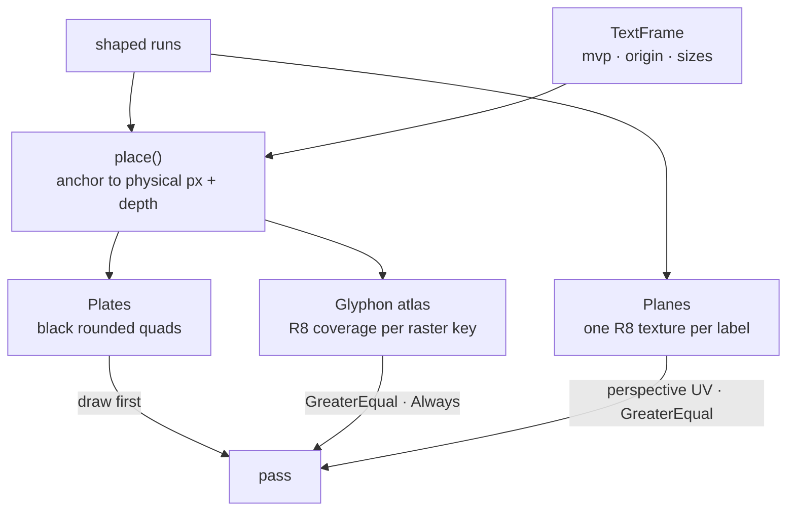


## Starting point

- Checkpoint 10: labels are shaped and measured, nothing drawn.
- Three GPU owners appear: plates (black backing), planes (fixed world text), and the lane that drives Glyphon and both of them.

## Step 1 · Supplied comparison page

The same-font white-on-black comparison page and its WASM export are supplied. Install them first; `lib.rs` declares the module in the last step.

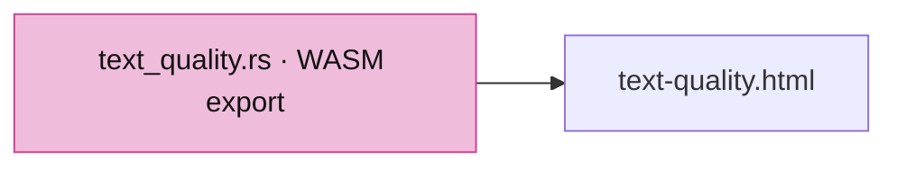

<!-- supplied: 11 -->

## Step 2 · Black plates

- A plate is six vertices in clip space plus the local offset, half size and corner radius the fragment shader needs for a rounded edge.
- Depth compare `Always`, no depth write: a plate is an overlay and never occludes geometry.

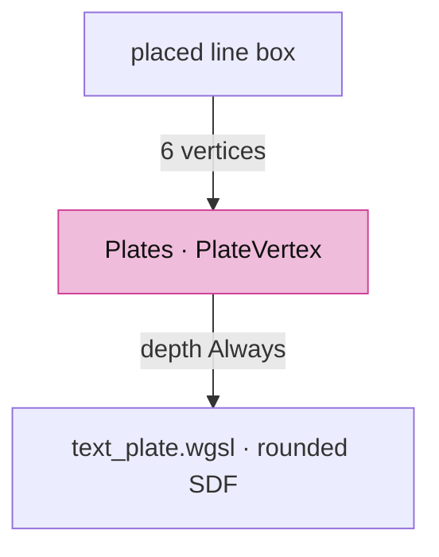

<!-- file: 11 session_viewer/src/engine/gpu/text_plate.rs type lines=1-100 -->

Vertex layout ↔ shader locations:

```text
Rust vertex_attr_array (stride 28)          WGSL vs_main
0 => Float32x2  clip position          ↔  @location(0) position: vec2<f32>
1 => Float32x2  local offset           ↔  @location(1) local: vec2<f32>
2 => Float32x2  half size              ↔  @location(2) half_size: vec2<f32>
3 => Float32    radius                 ↔  @location(3) radius: f32
```

<!-- file: 11 session_viewer/src/engine/gpu/text_plate.rs type lines=101-148 -->

The signed distance to a rounded rectangle gives one physical pixel of edge coverage; the colour is always black.

<!-- file: 11 session_viewer/src/shaders/text_plate.wgsl type -->

## Step 3 · Fixed world planes: records and resources

- A `WorldPlane` label keeps one coverage texture per label; the camera only rewrites six vertices.
- The texture budget is a hard cap independent of the adapter, so one huge label cannot take the scene's memory.

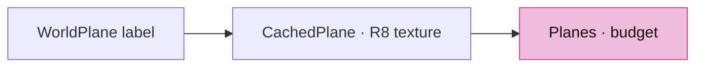

<!-- file: 11 session_viewer/src/engine/gpu/text_plane.rs type lines=1-83 -->

## Step 4 · Planes: prepare

- Placement and colour changes keep the texture; text, font or a larger projected em rebuilds it.
- Resolution grows in power-of-two em buckets, so small camera motion never re-rasterizes.

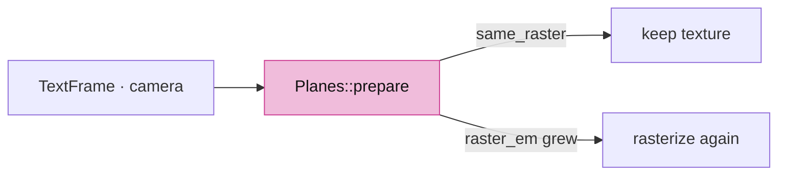

<!-- file: 11 session_viewer/src/engine/gpu/text_plane.rs type lines=84-142 -->

<!-- file: 11 session_viewer/src/engine/gpu/text_plane.rs type lines=143-258 -->

## Step 5 · Planes: projection, raster and the quad

- `project` keeps clip `w`; the shader divides, so UVs stay perspective-correct across the plane.
- `rasterize` composites Swash glyph images into one R8 texture at the chosen em size, bearings and baseline included.
- `append_quad` walks the label's right/up axes in world units; every vertex carries full clip coordinates and the CSS clip in physical pixels.

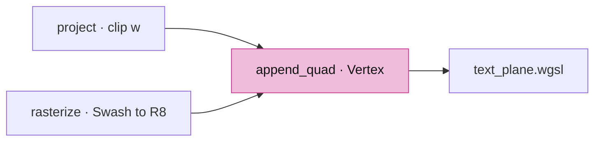

<!-- file: 11 session_viewer/src/engine/gpu/text_plane.rs type lines=259-322 -->

<!-- file: 11 session_viewer/src/engine/gpu/text_plane.rs type lines=323-402 -->

<!-- file: 11 session_viewer/src/engine/gpu/text_plane.rs type lines=403-467 -->

Bindings and vertex layout ↔ shader:

```text
Rust bind group layout (group 0)             WGSL
binding 0  Texture 2D float             ↔  @group(0) @binding(0) var coverage_texture: texture_2d<f32>
binding 1  Sampler filtering            ↔  @group(0) @binding(1) var coverage_sampler: sampler

vertex_attr_array (stride 56)
0 => Float32x4  clip position           ↔  @location(0) position: vec4<f32>
1 => Float32x2  uv                      ↔  @location(1) uv: vec2<f32>
2 => Float32x4  colour                  ↔  @location(2) color: vec4<f32>
3 => Float32x4  clip rectangle          ↔  @location(3) clip: vec4<f32>
```

<!-- file: 11 session_viewer/src/engine/gpu/text_plane.rs type lines=468-492 -->

<!-- file: 11 session_viewer/src/shaders/text_plane.wgsl type -->

A native GPU check for the plane path sits at the end of the file.

<!-- file: 11 session_viewer/src/engine/gpu/text_plane.rs copy lines=493-588 -->

## Step 6 · The text lane: frame input and counters

- `TextFrame` is everything placement needs from the frame: the rebased camera, the anchor origin, physical and logical sizes.
- `logical` comes from the canvas CSS box, not `devicePixelRatio`; that is what makes browser zoom and DPR both work.

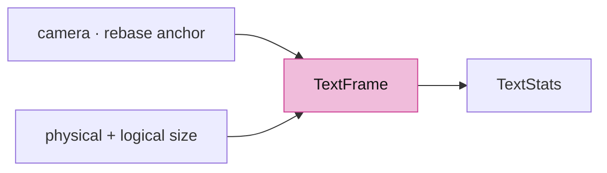

<!-- file: 11 session_viewer/src/engine/gpu/text.rs type lines=1-61 -->

## Step 7 · The lane owns Glyphon

- Two renderers share one atlas: `anchored` compares depth `GreaterEqual` (reversed Z, occluded by solids), `overlay` is `Always`.
- `retarget` follows the scene's sample count without reshaping or dropping the atlas.

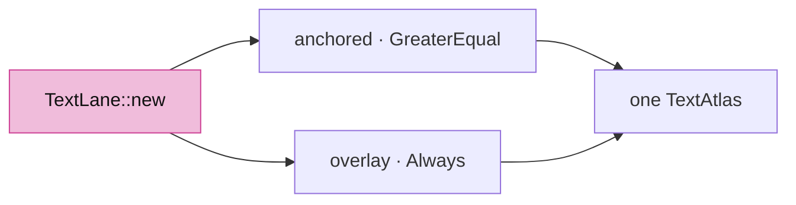

<!-- file: 11 session_viewer/src/engine/gpu/text.rs type lines=62-142 -->

## Step 8 · Prepare: place, rasterize, build both draw lists

- The key `(document revision, font revision, frame)` skips the whole preparation when nothing moved.
- Raster keys are bounded: past the budget the atlas and Swash cache are rebuilt together, so no prepared vertex can point at an evicted glyph.

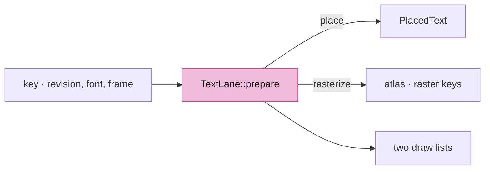

<!-- file: 11 session_viewer/src/engine/gpu/text.rs type lines=143-216 -->

<!-- file: 11 session_viewer/src/engine/gpu/text.rs type lines=217-271 -->

## Step 9 · Draw order, reset, release

Planes first (they are in the scene), then anchored glyphs, then plates, then overlay glyphs on top of their plates.

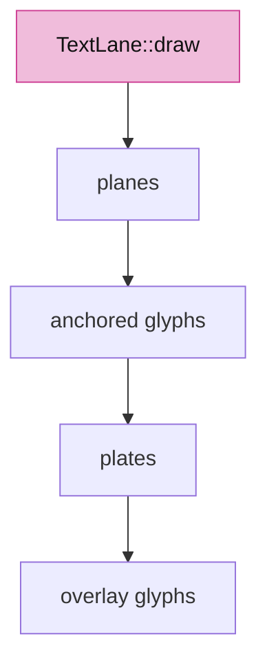

<!-- file: 11 session_viewer/src/engine/gpu/text.rs type lines=272-338 -->

## Step 10 · CSS to physical, once

- `scale()` derives one isotropic raster scale from framebuffer ÷ CSS box and rejects a stretched canvas.
- `place()` projects only the anchor; behind-camera and out-of-range anchors are culled instead of producing inverted text.
- A `Nameplate` is centred on the shaped line box and gets no depth: the annotation overlays the solid it names.


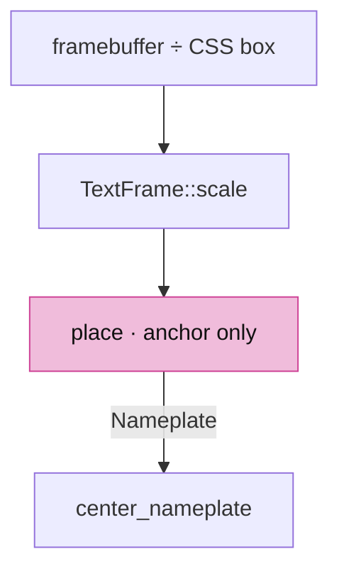

<!-- file: 11 session_viewer/src/engine/gpu/text.rs type lines=339-429 -->

<!-- file: 11 session_viewer/src/engine/gpu/text.rs type lines=430-546 -->

Native checks for scale, depth, nameplates and cache eviction live in the same file.

<!-- file: 11 session_viewer/src/engine/gpu/text.rs copy lines=547-947 -->

<!-- check: 11 -->

## Step 11 · Wire the lane into the frame

- `write_frame_uniforms` also prepares text and can fail (a stretched canvas), so it returns a `Result`.
- Text draws after mesh ink in the same pass, against the same read-only depth.

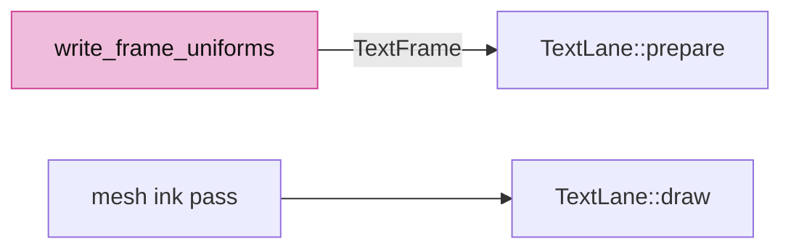

<!-- file: 11 session_viewer/src/engine/gpu/mod.rs type -->

Three fixture labels: a nameplate above the model, a rounded centred nameplate, and one fixed world plane.

<!-- file: 11 session_viewer/src/lib.rs type -->

The supplied comparison page takes the place of the shaping reference page and its export.

<!-- file: 11 session_viewer/src/text_layout.rs -->

<!-- file: 11 session_viewer/assets/text-layout.html -->

<!-- file: 11 session_viewer/assets/text-quality.html copy -->

<!-- file: 11 session_viewer/index.html copy -->

## Check

<!-- checkpoint: 11 -->

Expected:

- White text on black plates above the model; one rounded plate centred on the scene.
- Orbit: the fixed-plane label foreshortens and is hidden by solids; the nameplates stay upright and screen-sized.
- Resize or change browser zoom: glyphs keep their shape and spacing, the plate keeps its padding.
- The **Compare GPU text** link opens the supplied page with the same fonts side by side.

If letters look blurred at one zoom level, check `TextFrame::scale`; if a plate clips its last glyph, check the padding in `center_nameplate`.


## What changed

<!-- tree: 11 session_viewer/src/engine/gpu -->

- `TextLane` owns Glyphon's atlas, two renderers, plates and planes.
- Data flow: shaped run → `place()` → physical position + depth → atlas / R8 texture → three draws in the scene pass.

**Production equivalent:** `src/engine/gpu/text.rs`, `text_plate.rs`, `text_plane.rs`, `src/shaders/text_plate.wgsl`, `text_plane.wgsl`.

## Try

- Add `?perspective` to the URL: the fixed-plane label converges with the view while the nameplates keep their screen size.
- Change `padding: [6.0, 4.0]` of the first nameplate in `src/lib.rs` to `[20.0, 4.0]`: the plate grows around the same glyphs.
- Set the browser zoom to 200 percent: the raster key changes, glyphs stay sharp, and no plate clips its last letter.
- On the comparison page, tick **Baselines, origins and raster bounds** and switch the raster scale: the raster box scales, the CSS box does not.


## Recall

??? question "`logical` comes from the canvas CSS box, not from `devicePixelRatio`. Why does that distinction matter here of all places?"
    Because browser zoom and device pixel ratio both change the physical-to-CSS relationship, and only the CSS box reflects both. Derive the raster scale from `devicePixelRatio` alone and text is crisp at 100% zoom and blurry at 125%. The lane derives one isotropic scale from framebuffer ÷ CSS box and rejects a stretched canvas outright rather than rendering text at the wrong aspect.

??? question "Raster resolution grows in power-of-two em buckets. What would continuous resolution cost?"
    A re-rasterization on almost every frame while you zoom, because the projected em would change by a fraction constantly. Buckets mean small camera motion is free and only a real change in size pays. This is the same instinct as the mask `MaskKey` in lesson 17 and the prelude key in 04d: make the expensive work depend on a *quantised* key, not a continuous one.

??? question "Two Glyphon renderers share one atlas, with different depth rules. Why two, and why one atlas?"
    Two because anchored text lives in the scene and must be occluded by solids (`GreaterEqual` under reversed Z), while overlay text must never be (`Always`). One atlas because the glyphs are the same bytes either way, and a second atlas would double the texture memory and the eviction bookkeeping for no benefit.

??? question "Raster keys are bounded, and passing the budget rebuilds the atlas and the Swash cache *together*. Why together?"
    Because a prepared vertex points into the atlas. Evict from one and not the other and some already-built quad now samples an evicted glyph — text that renders as garbage with no error anywhere. Rebuilding both keeps the invariant "no prepared vertex points at anything that was evicted", which is the kind of rule worth writing in a comment.

**Rebuild from memory:** name the five placements and say, for each, what stays constant as the camera moves — the size on screen, the size in the world, or the position. Then predict which of the five can be hidden by a solid, and why that is a property of the placement rather than of the text.

## Next

[12 · Production shell and picking](12-picking.md): the winit application, `State`, and GPU picking with an integer ID pass.
