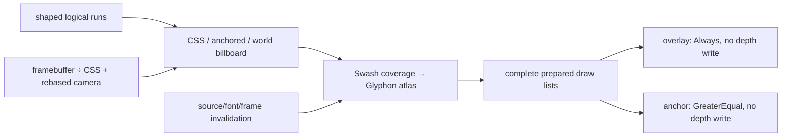
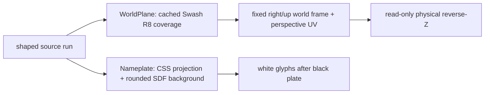

# 11 — Coverage text, DPI, anchoring and lifetime

Starting checkpoint: 10. Add the retained GPU text lane to the same device/pass schedule and replace the temporary layout page with the maintained white-on-black comparison.



Text alternative: logical runs are placed using actual framebuffer scale and the rebased camera, then coverage resources feed separate overlay and depth-tested draw lists; revisions control reuse and disposal.

1. Prepare and draw the final text resources, then reproduce the normal-size regression.

**COPY/PASTE — complete additions and a verified checkpoint.** Starting at 10, [the complete patch](reconstruction/patches/11.patch) supplies every listed file/import, WGSL registration and HTML asset link; binary font files come from the hash-checked font store listed by the replay driver.

```sh
python3 "$COURSE_REPO/docs/reconstruction/replay.py" --output /tmp/viewer-course --through 11 --advance --verify --target-dir "$COURSE_REPO/target"
```

For manual reconstruction, apply each complete patch change while substituting the **TYPE BY HAND** blocks below for their corresponding additions; finish with `--adopt --verify` instead of `--advance --verify` to verify the exact source tree.

**COPY/PASTE — complete resource integration.** 11.patch adds `src/engine/gpu/text.rs`, `src/text_quality.rs`, `assets/text-quality.html` and their registrations/links; it removes `src/text_layout.rs` and `assets/text-layout.html` because the maintained fixture now covers both layout and GPU rendering.

The teaching `Gpu` gains `text`, initialization, sample-count retargeting, `prepare` in `write_frame_uniforms` and `draw` after geometric ink; its preparation errors return to `Tutorial::render`, and no second device is created for scene labels.

**TYPE BY HAND — in `src/engine/gpu/text.rs`, add the complete `TextFrame` and `PlacedText` records and replace `TextFrame::scale`.** Divide actual framebuffer dimensions by the actual canvas CSS box once; never multiply a pre-scaled glyph origin by DPR again.

```rust
#[derive(Clone, Debug, PartialEq)]
pub struct TextFrame {
    pub mvp: [f32; 16],
    pub origin: [f64; 3],
    pub framebuffer: [u32; 2],
    pub logical: [f64; 2],
    pub ortho_half_height: f32,
}
```
```rust
struct PlacedText {
    left: f32,
    top: f32,
    scale: f32,
    depth: Option<f32>,
}
```
```rust
pub fn scale(&self) -> anyhow::Result<f32> {
        anyhow::ensure!(
            self.framebuffer[0] > 0 && self.framebuffer[1] > 0,
            "empty text framebuffer"
        );
        anyhow::ensure!(
            self.logical[0].is_finite()
                && self.logical[1].is_finite()
                && self.logical[0] > 0.0
                && self.logical[1] > 0.0,
            "empty text CSS box"
        );
        let x = self.framebuffer[0] as f64 / self.logical[0];
        let y = self.framebuffer[1] as f64 / self.logical[1];
        let tolerance = 1.0 / self.logical[0] + 1.0 / self.logical[1];
        anyhow::ensure!(
            (x - y).abs() <= tolerance,
            "text canvas is stretched non-uniformly"
        );
        Ok(y as f32)
    }
```

**TYPE BY HAND — replace the complete `place` and `clip_bounds` functions.** Subtract the same f64 origin used by geometry before the f32 camera projection; reject anchors behind the eye/outside depth range instead of generating inverted glyphs.

```rust
fn place(label: &TextLabel, frame: &TextFrame, scale: f32) -> Option<PlacedText> {
    let (world, offset, world_height) = match label.placement {
        TextPlacement::WorldPlane { .. } => return None,
        TextPlacement::Screen { left, top } => {
            return Some(PlacedText {
                left: left * scale,
                top: top * scale,
                scale,
                depth: None,
            });
        }
        TextPlacement::Anchor { world, offset } => (world, offset, None),
        TextPlacement::Nameplate { world, .. } => (world, [0.0; 2], None),
        TextPlacement::WorldBillboard {
            world,
            world_height,
        } => (world, [0.0; 2], Some(world_height)),
    };
    let p = [
        (world[0] - frame.origin[0]) as f32,
        (world[1] - frame.origin[1]) as f32,
        (world[2] - frame.origin[2]) as f32,
    ];
    let m = &frame.mvp;
    let w = m[3] * p[0] + m[7] * p[1] + m[11] * p[2] + m[15];
    if !w.is_finite() || w <= 0.0 {
        return None;
    }
    let z = (m[2] * p[0] + m[6] * p[1] + m[10] * p[2] + m[14]) / w;
    if !(0.0..=1.0).contains(&z) {
        return None;
    }
    let x = (m[0] * p[0] + m[4] * p[1] + m[8] * p[2] + m[12]) / w;
    let y = (m[1] * p[0] + m[5] * p[1] + m[9] * p[2] + m[13]) / w;
    let raster_scale = match world_height {
        Some(height) => {
            let projection = (m[1] * m[1] + m[5] * m[5] + m[9] * m[9]).sqrt();
            height as f32 * projection * frame.framebuffer[1] as f32 / (2.0 * w * label.font_size)
        }
        None => scale,
    };
    if !raster_scale.is_finite() || raster_scale <= 0.0 {
        return None;
    }
    Some(PlacedText {
        left: (x + 1.0) * 0.5 * frame.framebuffer[0] as f32 + offset[0] * scale,
        top: (1.0 - y) * 0.5 * frame.framebuffer[1] as f32 + offset[1] * scale,
        scale: raster_scale,
        depth: match label.placement {
            TextPlacement::Nameplate { .. } => None,
            _ => Some(z),
        },
    })
}
```
```rust
fn clip_bounds(label: &TextLabel, frame: &TextFrame, scale: f32) -> TextBounds {
    match label.clip {
        Some(c) => TextBounds {
            left: (c[0] * scale).floor() as i32,
            top: (c[1] * scale).floor() as i32,
            right: (c[2] * scale).ceil() as i32,
            bottom: (c[3] * scale).ceil() as i32,
        },
        None => TextBounds {
            left: 0,
            top: 0,
            right: frame.framebuffer[0] as i32,
            bottom: frame.framebuffer[1] as i32,
        },
    }
}
```

**TYPE BY HAND — replace the complete `renderer` and `make_atlas` helpers.** Overlay and anchored renderers share an atlas while their depth tests differ; both preserve the physical scene depth.

```rust
fn renderer(
    ctx: &GpuCtx,
    atlas: &mut TextAtlas,
    target: Target,
    compare: wgpu::CompareFunction,
) -> TextRenderer {
    TextRenderer::new(
        atlas,
        &ctx.device,
        wgpu::MultisampleState {
            count: target.samples,
            ..Default::default()
        },
        Some(wgpu::DepthStencilState {
            format: wgpu::TextureFormat::Depth32Float,
            depth_write_enabled: Some(false),
            depth_compare: Some(compare),
            stencil: Default::default(),
            bias: Default::default(),
        }),
    )
}
```
```rust
fn make_atlas(ctx: &GpuCtx, cache: &Cache, format: wgpu::TextureFormat) -> TextAtlas {
    let mode = if format.is_srgb() {
        ColorMode::Accurate
    } else {
        ColorMode::Web
    };
    TextAtlas::with_color_mode(&ctx.device, &ctx.queue, cache, format, mode)
}
```

The maintained dedicated shader is [glyphon 0.11.0 `src/shader.wgsl`](https://docs.rs/crate/glyphon/0.11.0/source/src/shader.wgsl): the mask branch outputs label RGB and `label_alpha × sampled_coverage`; its renderer uses straight-alpha `ALPHA_BLENDING`. Coverage stays linear, sRGB targets select `ColorMode::Accurate`, and non-sRGB browser targets select `ColorMode::Web`.

**TYPE BY HAND — replace the complete `TextLane::prepare` method.** An unchanged `(document revision, font revision, TextFrame)` skips preparation; eviction happens only between complete preparations so neither draw list retains stale atlas coordinates.

```rust
pub fn prepare(&mut self, ctx: &GpuCtx, frame: &TextFrame) -> anyhow::Result<()> {
        let key = (
            self.document.revision,
            self.document.font_revision,
            frame.clone(),
        );
        if self.prepared.as_ref() == Some(&key) {
            self.stats.skipped_preparations += 1;
            return Ok(());
        }
        self.overlay_count = 0;
        self.anchored_count = 0;
        self.plates.reset();
        let scale = frame.scale()?;
        let start = now_ms();
        let fonts_changed = self.atlas_font_revision != self.document.font_revision;
        if fonts_changed || self.raster_keys.len() > 4096 {
            self.rebuild_resources(ctx);
        }
        let raster_images_before = self.raster.image_cache.values().flatten().count();
        self.planes
            .prepare(ctx, &mut self.document, &mut self.raster, frame)?;
        self.atlas.trim();
        self.viewport.update(
            &ctx.queue,
            Resolution {
                width: frame.framebuffer[0],
                height: frame.framebuffer[1],
            },
        );
        let mut overlays = Vec::new();
        let mut anchors = Vec::new();
        let mut depths = HashMap::new();
        let mut plates = Vec::new();
        self.stats.new_raster_keys = 0;
        self.stats.requested_glyphs = 0;
        self.stats.missing_glyphs = 0;
        for run in &self.document.runs {
            let Some(mut placed) = place(&run.label, frame, scale) else {
                continue;
            };
            if let Some(rectangle) = center_nameplate(run, &mut placed, frame, scale) {
                plates.push(rectangle);
            }
            let area = TextArea {
                buffer: &run.buffer,
                left: placed.left,
                top: placed.top,
                scale: placed.scale,
                bounds: clip_bounds(&run.label, frame, scale),
                default_color: Color::rgba(
                    run.label.color[0],
                    run.label.color[1],
                    run.label.color[2],
                    run.label.color[3],
                ),
                custom_glyphs: &[],
            };
            for line in run.buffer.layout_runs() {
                for glyph in line.glyphs {
                    self.stats.requested_glyphs += 1;
                    self.stats.missing_glyphs += usize::from(glyph.glyph_id == 0);
                    let physical = glyph.physical((placed.left, placed.top), placed.scale);
                    self.stats.new_raster_keys +=
                        usize::from(self.raster_keys.insert(physical.cache_key));
                }
            }
            if let Some(depth) = placed.depth {
                depths.insert(run.label.id as usize, depth);
                anchors.push(area);
            } else {
                overlays.push(area);
            }
        }
        self.overlay.prepare(
            &ctx.device,
            &ctx.queue,
            &mut self.document.fonts,
            &mut self.atlas,
            &self.viewport,
            overlays,
            &mut self.raster,
        )?;
        // Glyphon requires a callback to map shaped-run metadata to per-label clip depth.
        self.anchored.prepare_with_depth(
            &ctx.device,
            &ctx.queue,
            &mut self.document.fonts,
            &mut self.atlas,
            &self.viewport,
            anchors,
            &mut self.raster,
            |id| depth_for(&depths, id),
        )?;
        self.plates.prepare(ctx, &plates, frame.framebuffer);
        for run in &self.document.runs {
            if place(&run.label, frame, scale).is_some() && !run.label.text.is_empty() {
                match run.label.placement {
                    TextPlacement::Screen { .. } | TextPlacement::Nameplate { .. } => {
                        self.overlay_count = 1
                    }
                    _ => self.anchored_count = 1,
                }
            }
        }
        self.stats.raster_images = 0;
        self.stats.raster_image_capacity_bytes = 0;
        for image in self.raster.image_cache.values().flatten() {
            self.stats.raster_images += 1;
            self.stats.raster_image_capacity_bytes += image.data.capacity();
        }
        self.stats.new_raster_images = self
            .stats
            .raster_images
            .saturating_sub(raster_images_before);
        self.stats.preparations += 1;
        self.stats.shape_count = self.document.shape_count;
        self.stats.shaping_ms = self.document.shaping_ms;
        self.stats.distinct_raster_keys = self.raster_keys.len();
        self.stats.active_instance_bytes = self.stats.requested_glyphs * 28;
        self.stats.nameplate_capacity_bytes = self.plates.allocated_bytes();
        self.stats.world_plane_buffer_bytes = self.planes.buffer_bytes();
        self.stats.world_plane_texture_bytes = self.planes.texture_bytes();
        self.stats.world_plane_rasterizations = self.planes.rasterizations;
        self.stats.preparation_ms = now_ms() - start;
        self.prepared = Some(key);
        Ok(())
    }
```

**COPY/PASTE — remaining lifecycle and counters.** The complete patch supplies `retarget`, `reset`, `release`, `rebuild_resources`, `draw`, `depth_for` and `TextStats`; resource reset at more than 4096 distinct raster keys releases both prepared renderers and the raster cache without changing logical shaping.

| Change | Required work |
| --- | --- |
| Source text/size/line height | Reshape that label, then prepare. |
| Color or source placement | Reuse shaping, prepare new positioned/color instances. |
| Camera/DPI/clip/frame size | Reuse shaping, update placement/raster keys and clip bounds. |
| Font replacement | Reshape affected runs and rebuild GPU/raster resources. |
| Target sample count | Recreate compatible renderers, preserve font/layout data. |
| Scene replacement/disposal | Clear source runs and release/rebuild owned resources explicitly. |

`TextStats` measures shape counts, CPU raster image counts/payload capacity, candidate cache keys and combined preparation time. Glyphon's private GPU atlas/instance capacity, upload bytes and isolated rasterization time remain unmeasured; active instance bytes are not allocated capacity.

**COPY/PASTE — preserve imported PDF text.** The geometric outline lane introduced in 04 retains each imported font's exact vertices and positions; 05's budgeted sheet MSAA supplies coverage, while Glyphon handles actual source strings without substituting fonts for old PDF meshes.

**COPY/PASTE — run the maintained browser regression against this checkpoint.** The Playwright/Chrome environment is the same pinned environment used by the reconstruction driver.

```sh
cd /tmp/viewer-course/session_viewer
REGEN_PROTO=0 NO_COLOR=true trunk serve
```

In another terminal:

```sh
VIEWER_URL=http://127.0.0.1:8770/ node "$COURSE_REPO/tests/text-quality.cjs"
VIEWER_URL=http://127.0.0.1:8770/ node "$COURSE_REPO/tests/text-zoom.cjs"
```

Open <http://127.0.0.1:8770/text-quality.html>: white GPU text and the same loaded browser font at 12/14/16/18/24 CSS pixels, with glyph/baseline diagnostics, gray/white backgrounds, selected yellow, clipping and release/reload controls. In the scene, the title and pill keep CSS size while following their source anchors; the native depth/motion/cache regressions run when the final native harness arrives in 16.

The browser fixture asserts matched advances within 0.2 CSS pixels, visible normal-size white glyph coverage, no missing tested glyphs, unchanged shaping under DPR/zoom changes and successful resource regeneration. Browser zoom is tested through Chrome's actual page-zoom control, separately from emulated DPR or a forced raster scale.

The scene fixture now shows three annotations: a white-on-black source title, a centered white-on-black pill, and `text_not_oriented_to_camera` in a fixed world plane. Orbit the scene: the pill faces the camera while the fixed plane changes orientation and is occluded by nearer geometry.



Text equivalent: the nameplate remains a CSS-sized overlay; the fixed plane uses a world-space quad and physical depth.

**COPY/PASTE — complete plane and pill owners from 11.patch.** Add `src/engine/gpu/{text_plane,text_plate}.rs` and `src/shaders/{text_plane,text_plate}.wgsl`; `text.rs` registers both private modules, prepares and draws them, and includes them in reset/release/accounting. The rounded plate uses a signed-distance rectangle; selection padding reserves the full rounded cap at each end.

The world-plane origin is its top-left; `right` advances the line and `-up` advances downward. Frames must contain finite unit orthogonal axes within 1e-6. Coverage uses grow-only 32–256 em buckets, a 4096-pixel side limit and a 32 MiB lane cache bound; camera changes reuse or grow coverage, while source/font revisions invalidate it. Texture and vertex-buffer capacities are accounted separately from Glyphon's private allocations.

**TYPE BY HAND — `src/engine/gpu/text_plane.rs`: insert/replace the complete `raster_em` function at its matching patch location.**

```rust
fn raster_em(label: &TextLabel, frame: &TextFrame) -> u32 {
    let TextPlacement::WorldPlane {
        world,
        right,
        up,
        world_height,
        ..
    } = label.placement
    else {
        return 32;
    };
    let a = project(world, frame);
    if a[3] <= 0.0 {
        return 32;
    }
    let mut projected_em = 0.0f32;
    for direction in [right, up] {
        let mut end = world;
        for axis in 0..3 {
            end[axis] += direction[axis] * world_height;
        }
        let b = project(end, frame);
        if b[3] <= 0.0 {
            continue;
        }
        let x = (a[0] / a[3] - b[0] / b[3]) * frame.framebuffer[0] as f32 * 0.5;
        let y = (a[1] / a[3] - b[1] / b[3]) * frame.framebuffer[1] as f32 * 0.5;
        projected_em = projected_em.max(x.hypot(y));
    }
    let needed = (projected_em * 2.0).clamp(32.0, 256.0);
    let mut bucket = 32;
    while (bucket as f32) < needed {
        bucket *= 2;
    }
    bucket
}
```

**TYPE BY HAND — `src/engine/gpu/text_plane.rs`: insert/replace the complete `rasterize` function at its matching patch location.**

```rust
fn rasterize(
    run: &TextRun,
    fonts: &mut FontSystem,
    raster: &mut SwashCache,
    em_pixels: u32,
) -> anyhow::Result<(Vec<u8>, [u32; 2], [f32; 4])> {
    let scale = em_pixels as f32 / run.label.font_size;
    let mut glyphs = Vec::new();
    let mut bounds = [0i32; 4];
    for line in run.buffer.layout_runs() {
        bounds[2] = bounds[2].max((line.line_w * scale).ceil() as i32);
        bounds[3] = bounds[3].max(((line.line_top + line.line_height) * scale).ceil() as i32);
        anyhow::ensure!(
            bounds[2] <= 4092 && bounds[3] <= 4092,
            "world text layout exceeds 4096px extent"
        );
        for glyph in line.glyphs {
            let physical = glyph.physical((0.0, 0.0), scale);
            let Some(image) = raster.get_image(fonts, physical.cache_key) else {
                continue;
            };
            let x = physical.x + image.placement.left;
            let y = (line.line_y * scale).round() as i32 + physical.y - image.placement.top;
            bounds[0] = bounds[0].min(x);
            bounds[1] = bounds[1].min(y);
            bounds[2] = bounds[2].max(x + image.placement.width as i32);
            bounds[3] = bounds[3].max(y + image.placement.height as i32);
            glyphs.push((physical.cache_key, x, y));
        }
    }
    bounds[0] -= 2;
    bounds[1] -= 2;
    bounds[2] += 2;
    bounds[3] += 2;
    let size = [
        (bounds[2] - bounds[0]) as u32,
        (bounds[3] - bounds[1]) as u32,
    ];
    anyhow::ensure!(
        size[0] <= 4096 && size[1] <= 4096,
        "world text texture exceeds 4096px extent"
    );
    let mut pixels = vec![0u8; (size[0] * size[1]) as usize];
    for (key, x, y) in glyphs {
        let Some(image) = raster.get_image(fonts, key) else {
            continue;
        };
        for row in 0..image.placement.height {
            for column in 0..image.placement.width {
                let source = (row * image.placement.width + column) as usize;
                let coverage = match image.content {
                    SwashContent::Mask => image.data[source],
                    SwashContent::Color => image.data[source * 4 + 3],
                    SwashContent::SubpixelMask => {
                        ((u16::from(image.data[source * 4])
                            + u16::from(image.data[source * 4 + 1])
                            + u16::from(image.data[source * 4 + 2]))
                            / 3) as u8
                    }
                };
                let target = ((y - bounds[1] + row as i32) as u32 * size[0]
                    + (x - bounds[0] + column as i32) as u32) as usize;
                let previous = u16::from(pixels[target]);
                pixels[target] = (previous + u16::from(coverage) * (255 - previous) / 255) as u8;
            }
        }
    }
    Ok((
        pixels,
        size,
        [
            bounds[0] as f32 / scale,
            bounds[1] as f32 / scale,
            bounds[2] as f32 / scale,
            bounds[3] as f32 / scale,
        ],
    ))
}
```

**TYPE BY HAND — `src/engine/gpu/text_plane.rs`: insert/replace the complete `append_quad` function at its matching patch location.**

```rust
fn append_quad(
    vertices: &mut Vec<[f32; 14]>,
    label: &TextLabel,
    extent: [f32; 4],
    frame: &TextFrame,
    srgb: bool,
) {
    let TextPlacement::WorldPlane {
        world,
        right,
        up,
        world_height,
    } = label.placement
    else {
        return;
    };
    let unit = world_height / f64::from(label.font_size);
    let mut color = [0.0; 4];
    for (index, component) in color.iter_mut().enumerate() {
        let value = f32::from(label.color[index]) / 255.0;
        *component = if srgb && index < 3 {
            if value <= 0.04045 {
                value / 12.92
            } else {
                ((value + 0.055) / 1.055).powf(2.4)
            }
        } else {
            value
        };
    }
    let scale = frame.framebuffer[0] as f32 / frame.logical[0] as f32;
    let mut bounds = [
        0.0,
        0.0,
        frame.framebuffer[0] as f32,
        frame.framebuffer[1] as f32,
    ];
    if let Some(clip) = label.clip {
        for (index, value) in bounds.iter_mut().enumerate() {
            *value = clip[index] * scale;
        }
    }
    for [u, v] in [
        [0.0, 0.0],
        [0.0, 1.0],
        [1.0, 1.0],
        [0.0, 0.0],
        [1.0, 1.0],
        [1.0, 0.0],
    ] {
        let x = f64::from(extent[0] + (extent[2] - extent[0]) * u) * unit;
        let y = f64::from(extent[1] + (extent[3] - extent[1]) * v) * unit;
        let mut point = world;
        for axis in 0..3 {
            point[axis] += right[axis] * x - up[axis] * y;
        }
        let clip = project(point, frame);
        vertices.push([
            clip[0], clip[1], clip[2], clip[3], u, v, color[0], color[1], color[2], color[3],
            bounds[0], bounds[1], bounds[2], bounds[3],
        ]);
    }
}
```

