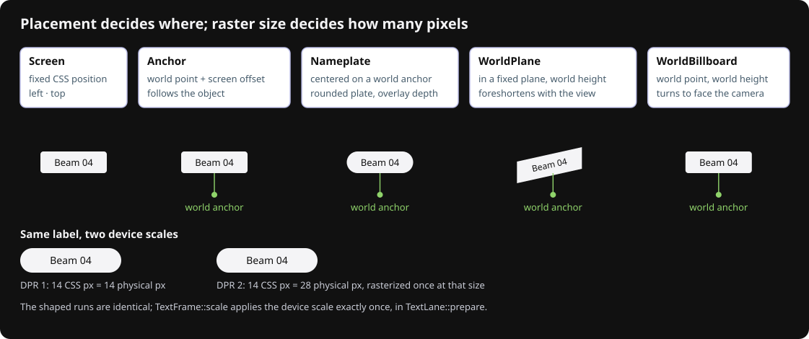

# 11 · Text rendering

**Estimated study time: about 35–65 hours.** Includes reading, typing, tracing, testing and experiments. [How to use this estimate](map.md#time-estimates).

**This section:** Render shaped text, its coverage and its placement in the scene.

**In the whole viewer:** This joins text layout to the GPU while keeping world placement, screen size and source identity distinct.

**Follow the data:** Shaped run → placement and raster size → glyph atlas → text and plate passes.

**Start with these files:** [`src/engine/gpu/text.rs`](11-text-rendering.md#code-11-012), [`src/engine/gpu/text_plane.rs`](11-text-rendering.md#code-11-013).

**Aim to explain:** Which part must run again when the text changes, and which work can a placement-only change reuse?

[Whole-viewer map and course milestones](map.md)

A label needs contrast against the scene. Its background is a rectangle with rounded corners. Rather than storing a detailed outline mesh, the fragment shader measures distance to the intended boundary and turns that distance into smooth coverage.



Start from the working result of [step 10](10-text-layout.md).

**One buildable step:** type the additions below in `workspace/handwritten`, then build and test. This step adds 2,842 lines across 12 files and may take several sittings. Individual listings are parts of this step, not separate build checkpoints.

<span id="code-11-001"></span>

## `index.html`

Insert **after line 206** of your current file.

Keep these preceding lines:

```html
    <input id="command-agent" type="text" autocomplete="off" autocapitalize="off" autocorrect="off" spellcheck="false" enterkeyhint="go" tabindex="-1" aria-hidden="true" style="position: fixed; bottom: 0; left: 0; width: 1px; height: 1px; opacity: 0; border: 0; padding: 0; font-size: 16px; pointer-events: none;">
    <a id="viewer-docs" href="docs/" target="_blank" rel="noopener" title="Open the documentation" aria-label="Open the documentation"></a>
    <div id="viewer-status" role="status" aria-live="polite" style="position: fixed; bottom: 12px; left: 12px; color: #fff; background: #222b; font: 14px system-ui; padding: 4px 8px; pointer-events: none;"></div>
    <link data-trunk rel="copy-dir" href="assets/text" data-target-path="text"/>
```

Keep these following lines:

```html
    <!-- The built course site (docs/build_site.sh keeps it current before each build). -->
    <link data-trunk rel="copy-dir" href="target/docs/site" data-target-path="docs"/>
    <!-- Message telling that Webgpu is not available. -->
    <script>
```

Type these new lines:

```html
--8<-- "typing/code/11-001.html"
```

<span id="code-11-002"></span>

## `src/lib.rs`

Append **after line 31** of your current file.

Blank lines before: **1**; after: **0**. End with a newline.

```rust
--8<-- "typing/code/11-002.rs"
```

<span id="code-11-003"></span>

## `assets/text-quality.html`

This page gives a repeatable environment for observing text rendering. HTML establishes the controls and output area; JavaScript connects them to the specimen. Browser layout and GPU text layout are distinct systems.

Create this file. Type the complete listing, including comments and blank lines.

```html
--8<-- "typing/code/11-003.html"
```

<span id="code-11-004"></span>

## `src/engine/gpu/mod.rs`

Insert **after line 24** of your current file.

Keep these preceding lines:

```rust
pub mod render; // register:render
pub mod segments; // register:segments
pub mod splat; // register:splat
pub mod targets; // register:targets
```

Keep these following lines:

```rust
pub mod text_outline; // register:text_outline
mod triangle_tiles; // register:triangle_tiles
pub mod upload; // register:upload
pub mod vectors; // register:vectors
```

Type these new lines:

```rust
--8<-- "typing/code/11-004.rs"
```

<span id="code-11-005"></span>

## `src/engine/gpu/mod.rs`

Insert **after line 73** of your current file.

Keep these preceding lines:

```rust
    pub backdrop: BackdropLane,                  // background and grid
    pub arena: ArenaLane,                        // meshes; register:meshes
    pub segments: SegmentLane,                   // lines; register:strokes
    pub glyphs: GlyphLane,                       // markers and dots; register:markers
```

Keep these following lines:

```rust
    pub selection_revision: u64,                 // bumps on every selection change
    pub logical_size: [f64; 2],                  // canvas size in CSS pixels
    pub cloud: CloudLane,                        // point cloud buffers; register:clouds
    registered: Vec<Box<dyn RowLane>>,           // lanes from lane::REGISTRY
```

Type these new lines:

```rust
--8<-- "typing/code/11-005.rs"
```

<span id="code-11-006"></span>

## `src/engine/gpu/mod.rs`

Insert **after line 99** of your current file.

Keep these preceding lines:

```rust
            backdrop,          // register:backdrop
            arena,             // register:meshes
            segments,          // register:strokes
            glyphs,            // register:markers
```

Keep these following lines:

```rust
            cloud,             // register:clouds
            splat,             // register:clouds
        )
    };
```

Type these new lines:

```rust
--8<-- "typing/code/11-006.rs"
```

<span id="code-11-007"></span>

## `src/engine/gpu/mod.rs`

Insert **after line 186** of your current file.

Keep these preceding lines:

```rust
        let objects = InstanceTable::new(&ctx, &layouts);
        let backdrop = BackdropLane::new(&ctx, &layouts, target);
        let segments = SegmentLane::new(&ctx, &layouts, target); // register:strokes
        let glyphs = GlyphLane::new(&ctx, &layouts, target); // register:markers
```

Keep these following lines:

```rust
        let cloud = CloudLane::new(&ctx); // register:clouds
        let splat = Splat::new(&ctx, &layouts, target, cloud.buffers()); // register:clouds
        // each registered lane builds itself through its `make` function
        let registered = lane::REGISTRY
```

Type these new lines:

```rust
--8<-- "typing/code/11-007.rs"
```

<span id="code-11-008"></span>

## `src/engine/gpu/mod.rs`

Insert **after line 216** of your current file.

Keep these preceding lines:

```rust
            backdrop,
            arena,       // register:meshes
            segments,    // register:strokes
            glyphs,      // register:markers
```

Keep these following lines:

```rust
            selection_revision: 0,
            logical_size: [size.0 as f64, size.1 as f64],
            cloud, // register:clouds
            registered,
```

Type these new lines:

```rust
--8<-- "typing/code/11-008.rs"
```

<span id="code-11-009"></span>

## `src/engine/gpu/present.rs`

Insert **after line 20** of your current file.

Keep these preceding lines:

```rust
        self.frame.write(&self.ctx, input, &cx);
        self.each_pass(|pass, g| pass.write_frame(g, input));
        self.objects
            .update_inside(&self.ctx, self.frame.eye, &self.bounds);
```

Keep these following lines:

```rust
    }

    /// Keep a requested Arctic view awake until its idle-compiled pipelines are ready.
    pub fn ambient_pending(&self) -> bool {
```

Type these new lines:

```rust
--8<-- "typing/code/11-009.rs"
```

<span id="code-11-010"></span>

## `src/engine/gpu/present.rs`

Append **after line 158** of your current file.

Blank lines before: **1**; after: **0**. End with a newline.

```rust
--8<-- "typing/code/11-010.rs"
```

<span id="code-11-011"></span>

## `src/engine/gpu/render.rs`

Insert **after line 120** of your current file.

Keep these preceding lines:

```rust

        draws += self.sphere_draws(pass, &b); // register:markers
        draws += self.arena.draw_text(pass, &basic);
        draws += self.dot_draws(pass, &b); // register:markers
```

Keep these following lines:

```rust
        draws
    }
}
```

Type these new lines:

```rust
--8<-- "typing/code/11-011.rs"
```

<span id="code-11-012"></span>

## `src/engine/gpu/text.rs`

Create this file. Type the complete listing, including comments and blank lines.

```rust
--8<-- "typing/code/11-012.rs"
```

<span id="code-11-013"></span>

## `src/engine/gpu/text_plane.rs`

Create this file. Type the complete listing, including comments and blank lines.

```rust
--8<-- "typing/code/11-013.rs"
```

<span id="code-11-014"></span>

## `src/engine/gpu/text_plate.rs`

Create this file. Type the complete listing, including comments and blank lines.

```rust
--8<-- "typing/code/11-014.rs"
```

<span id="code-11-015"></span>

## `src/shaders/text_plane.wgsl`

Create this file. Type the complete listing, including comments and blank lines.

```wgsl
--8<-- "typing/code/11-015.wgsl"
```

<span id="code-11-016"></span>

## `src/shaders/text_plate.wgsl`

Create this file. Type the complete listing, including comments and blank lines.

```wgsl
--8<-- "typing/code/11-016.wgsl"
```

<span id="code-11-017"></span>

## `src/text_quality.rs`

A controlled text specimen reveals missing glyphs, spacing and clipping. Known input is valuable because a random scene may never exercise a troublesome character or size. Separate layout defects from rendering defects.

Create this file. Type the complete listing, including comments and blank lines.

```rust
--8<-- "typing/code/11-017.rs"
```

## Check the completed chapter

From `session_viewer`, compare everything you have typed:

```sh
npm --prefix ../session_tests run course -- reference-check 11
```

From `workspace/handwritten`:

```sh
cargo build --lib --locked -j4
cargo xtest --lib --locked -j4
```

Run the native text tests. Inspect the text-quality page you typed once you reach the browser shell, and compare the same font at more than one pixel ratio.

If the label looks fuzzy at every size, check the coverage scale and device pixel ratio. Enlarging a previously rasterized label is different from drawing it at the correct scale.

**Before moving on:** explain what changed, check the expected result above, and fix any build or test failure.

<details>
<summary>Check your explanation of the opening question</summary>

Changed text needs shaping and layout. Moving unchanged text can reuse its shaped run; rasterization or placement work depends on the display scale and mode.

</details>

[Next step: 12](12-picking.md)
