# 12 · Production shell and picking

## You are building

Part A replaces the teaching shell with the production application: winit owns the canvas and events, `App` routes them, `State` coordinates camera, scene and GPU.

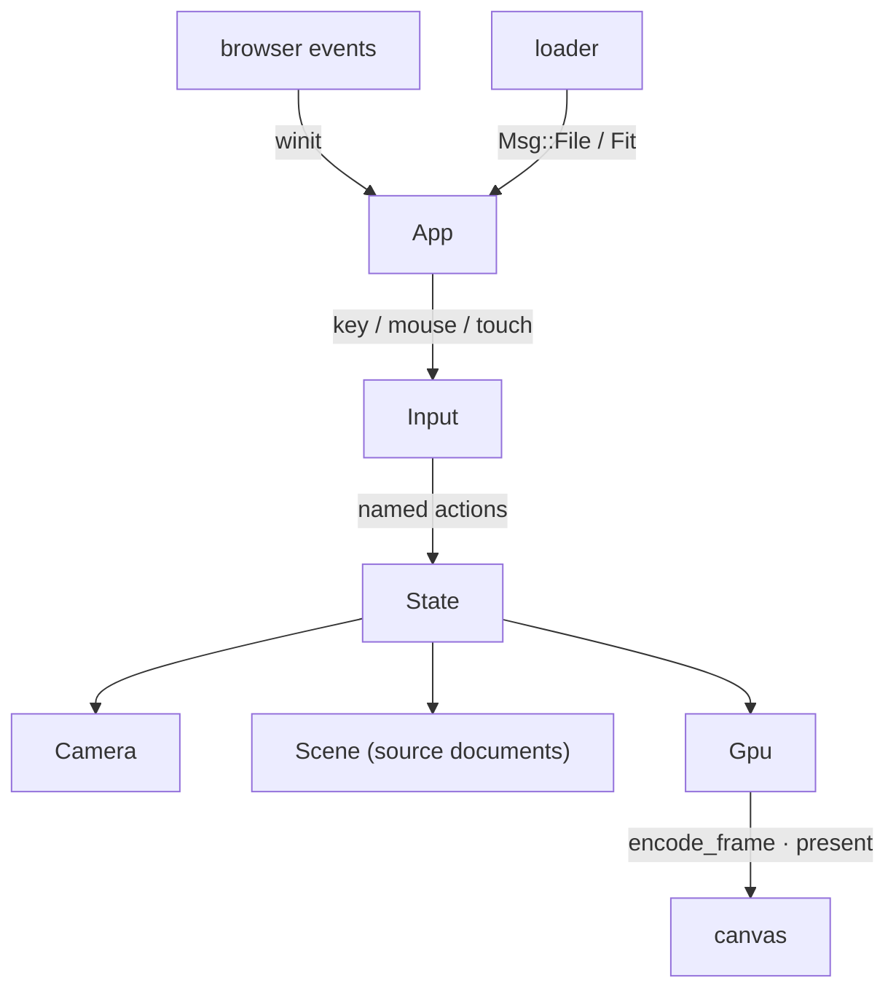

Part B adds picking: an integer ID pass, a bounded readback window, and a generation check so a late answer never selects against a newer camera.

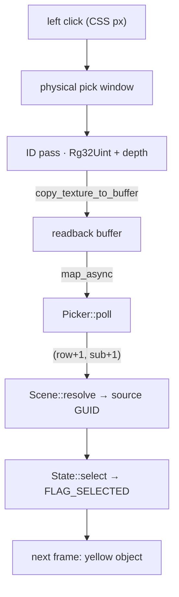

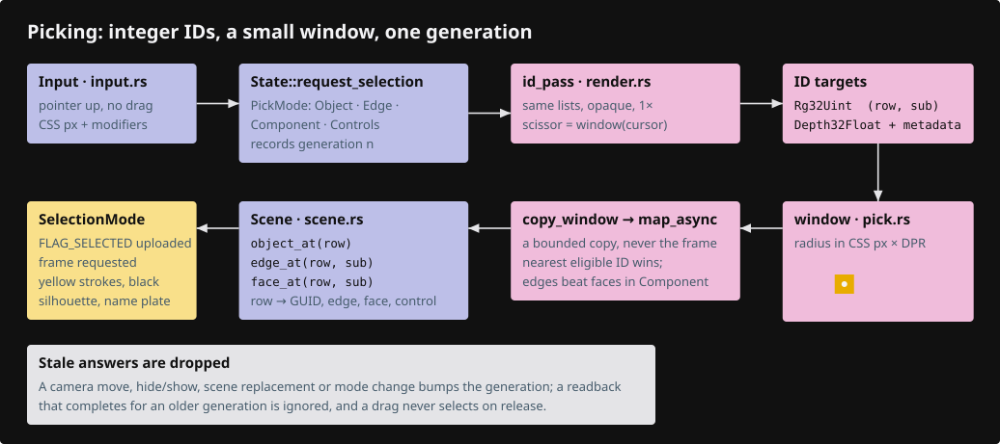

## Starting point

- Checkpoint 11: the `Tutorial` facade in `lib.rs` drives every lane through a JavaScript page; text renders.
- After this lesson `Tutorial` and `src/fixture.rs` are gone. The production `App`, `State`, `Scene`, `Input` and `Picker` take their place.

Install the binary interaction fixture and the supplied native harness file first:

<!-- supplied: 12 -->

## Part A · Production shell

### Step 1 · Device negotiation

- Browser builds use `BROWSER_WEBGPU` only; native test builds use the primary backends. Both go through one function.
- A storage-binding limit is requested explicitly, so a large cloud fails with a GPU error instead of a silent driver fallback.
- Uncaptured errors and device loss are remembered in `failure`; `State::render` reads it and shows the reload panel instead of drawing garbage.

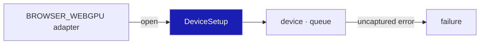

<!-- file: 12 session_viewer/src/engine/gpu/device.rs type lines=1-145 -->

Native-only adapter naming and the error callbacks:

<!-- file: 12 session_viewer/src/engine/gpu/device.rs copy lines=146-220 -->

### Step 2 · Presenting a frame

- `write_frame_uniforms` runs once per frame: camera matrices, then the inside-flag refresh that reads the eye just solved, then text placement.
- `present` returns `None` when the surface had no texture; the caller asks for another frame instead of panicking.
- `pick_frame` is the ID pass alone, against the depth the last presented frame left: a pick on a still scene costs no colour frame.

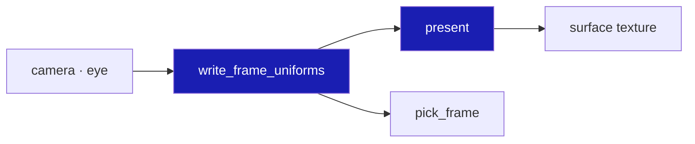

<!-- file: 12 session_viewer/src/engine/gpu/present.rs type lines=1-68 -->

<!-- file: 12 session_viewer/src/engine/gpu/present.rs type lines=69-85 -->

The offscreen and benchmark paths used by native tools:

<!-- file: 12 session_viewer/src/engine/gpu/present.rs copy lines=86-214 -->

### Step 3 · The frame list

- Pass order is the whole contract: physical surfaces write depth, the selection mask reads it, ink reads it, the ID pass repeats the same toggles.
- `encode_frame` knows nothing about a surface, so the same list renders headless.

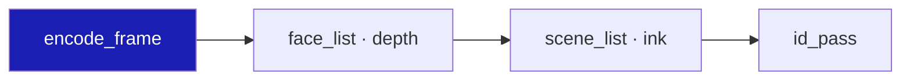

<!-- file: 12 session_viewer/src/engine/gpu/render.rs type lines=1-54 -->

<!-- file: 12 session_viewer/src/engine/gpu/render.rs type lines=55-123 -->

### Step 4 · Input bindings

Every handler returns whether the frame must be redrawn; a click returns `false` because nothing changes until the GPU answers.

| Input | Action |
|---|---|
| Right drag | orbit |
| Middle drag, Ctrl + right drag | pan |
| Wheel | zoom toward the cursor |
| Left click | select / toggle the object |
| Ctrl + left click | select an original edge |
| 1–7 | named views · Space projection · C reset · F fit |
| Q / W / E / D / B | points, lines, mesh edges, lighting, back faces |
| H / S | hide the selection / show all |
| T | toggle selected names |
| Escape | leave edge mode, then clear |

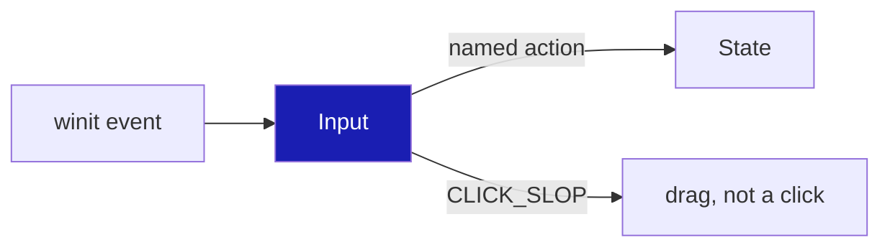

<!-- file: 12 session_viewer/src/app/input.rs type lines=1-47 -->

<!-- file: 12 session_viewer/src/app/input.rs type lines=48-80 -->

<!-- file: 12 session_viewer/src/app/input.rs type lines=81-163 -->

- A press that moved more than `CLICK_SLOP` before release is a drag, so a camera gesture never selects on release.

<!-- file: 12 session_viewer/src/app/input.rs type lines=164-191 -->

- The owned `pointercancel` listener detaches on drop; a forgotten closure would outlive the canvas.

<!-- file: 12 session_viewer/src/app/input.rs copy lines=192-251 -->

### Step 5 · Touch

- winit routes `pointerType == "touch"` to `WindowEvent::Touch` only, so fingers never reach the mouse arms.
- Finger travel is divided by the device pixel ratio; otherwise one centimetre of glass orbits three times faster on a DPR 3 phone.

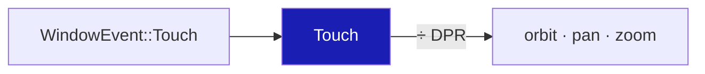

<!-- file: 12 session_viewer/src/app/touch.rs copy lines=1-68 -->

<!-- file: 12 session_viewer/src/app/touch.rs type lines=69-136 -->

<!-- file: 12 session_viewer/src/app/touch.rs copy lines=137-227 -->

### Step 6 · Scene: source documents and row bookkeeping

- `Scene` owns every kernel `Session` plus its placement; the GPU only holds rows. A pick returns a row, `Scene::resolve` returns the document and GUID.
- `order` maps row → GUID and `guid_to_row` maps back; both survive an upload because the rows are forgotten only after `upload_to`.

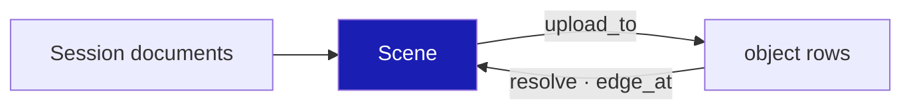

<!-- file: 12 session_viewer/src/app/scene.rs type lines=1-86 -->

<!-- file: 12 session_viewer/src/app/scene.rs type lines=87-203 -->

- One object row per GUID in the kernel's canonical order; the row a GUID gets is the row it keeps within a revision.

<!-- file: 12 session_viewer/src/app/scene.rs type lines=204-294 -->

- Streamed clouds have no kernel object; their slot records the absolute row point 0 landed on.

<!-- file: 12 session_viewer/src/app/scene.rs type lines=295-374 -->

- Row → identity in both directions; `edge_at` reads the segment sub-ID tag bit set by the ribbon shader.

<!-- file: 12 session_viewer/src/app/scene.rs type lines=375-494 -->

### Step 7 · Selection mode

Exactly one parent owns a specialized selection; `escape` returns that parent so it stays highlighted.

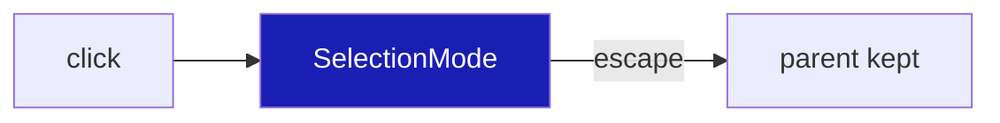

<!-- file: 12 session_viewer/src/app/selection.rs type -->

### Step 8 · Producers for clouds, frames and points

The walk gains three producers so every kernel geometry type has a lane.

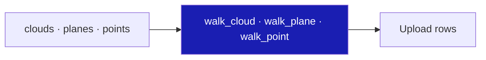

<!-- file: 12 session_viewer/src/app/walk/cloud.rs type lines=1-131 -->

<!-- file: 12 session_viewer/src/app/walk/cloud.rs type lines=132-222 -->

<!-- file: 12 session_viewer/src/app/walk/frames.rs type -->

<!-- file: 12 session_viewer/src/app/walk/points.rs type -->

### Step 9 · Stream records, feedback, inspection and the fixture loader

- `stream.rs` holds only the wire-layout records at this checkpoint; ranged reads arrive in lesson 13.
- `feedback` writes `textContent`, never HTML.
- `inspection` publishes a read-only JSON snapshot on `?inspect=1`; it is how the checkpoint is observed.
- `loader` decodes the bundled fixture and posts `Msg::File` then `Msg::Fit`; lesson 14 replaces it with routing.

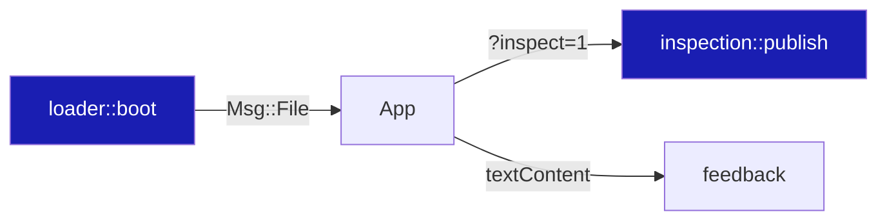

<!-- file: 12 session_viewer/src/app/stream.rs type -->

<!-- file: 12 session_viewer/src/app/feedback.rs type -->

<!-- file: 12 session_viewer/src/app/inspection.rs copy -->

<!-- file: 12 session_viewer/src/app/loader.rs type -->

<!-- check: 12 -->

The new modules are not declared yet, so the crate still builds as checkpoint 11.

## Part B · Picking

### Step 10 · The ID target and the readback window

```text
Rust                                                    WGSL (already in the lanes)
IdTargets.id : Rg32Uint                            ↔   fs_id(...) -> vec2<u32>
   .x = object row + 1, .y = sub-object id + 1         triangle: (inst_id + 1, 0)
   0 = background                                       ribbon:   (inst_id + 1, segment + 1 | 0x80000000)
IdTargets.depth : Depth32Float, cleared to 0       ↔   reversed depth, compare Greater
copy_texture_to_buffer(window)  →  readback buffer  →  map_async  →  poll
```

- The pass is scissored to a small window about the cursor and only that window is copied out; the vertex work stays, the fill does not.
- `ROW_BYTES` is the copy pitch rounded to the required alignment.

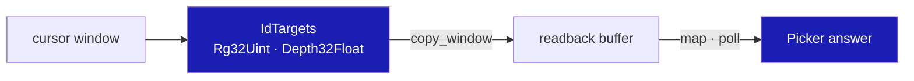

<!-- file: 12 session_viewer/src/engine/gpu/pick.rs type lines=1-82 -->

- `generation` counts requests; `submitted` records which generation the in-flight copy belongs to. A camera move bumps `generation`, so the answer is discarded when it lands.

<!-- file: 12 session_viewer/src/engine/gpu/pick.rs type lines=83-144 -->

<!-- file: 12 session_viewer/src/engine/gpu/pick.rs type lines=145-222 -->

- The ID targets are made on the first pick and kept until the canvas resizes. The gradient attachment gives ink the same visibility rule as the colour frame.

<!-- file: 12 session_viewer/src/engine/gpu/pick.rs type lines=223-350 -->

<!-- file: 12 session_viewer/src/engine/gpu/pick.rs type lines=351-439 -->

- `map` must run after the submit and only once per copy; `poll` reads the mapped bytes on a later frame.
- Ink beats a face anywhere in the window; among equals the nearest to the cursor wins, so a curve lying across a face is still selectable.

<!-- file: 12 session_viewer/src/engine/gpu/pick.rs type lines=440-488 -->

<!-- file: 12 session_viewer/src/engine/gpu/pick.rs type lines=489-552 -->

<!-- file: 12 session_viewer/src/engine/gpu/pick.rs copy lines=553-632 -->

### Step 11 · The ID pass in the frame list

- Same toggles, same order as the colour list: what a lane hides it cannot pick.
- Edge mode draws only source-edge IDs; object mode draws faces, then ink with ink-first precedence.

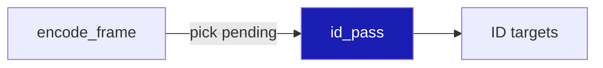

<!-- file: 12 session_viewer/src/engine/gpu/render.rs type lines=124-196 -->

### Step 12 · Selected-surface silhouette

- A visible selected surface writes an R8 coverage mask against the frame's depth; a fullscreen pass darkens the ring just outside it.
- Coverage is allocated only while a selection exists and released the moment it clears.
- Lesson 17 replaces this owner with `surface_outline.rs`, which also draws the ordinary union outline.

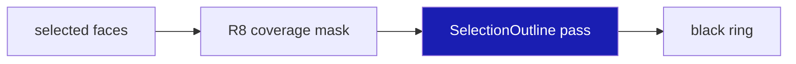

<!-- file: 12 session_viewer/src/engine/gpu/selection_outline.rs type lines=1-98 -->

<!-- file: 12 session_viewer/src/engine/gpu/selection_outline.rs type lines=99-165 -->

<!-- file: 12 session_viewer/src/engine/gpu/selection_outline.rs type lines=166-244 -->

<!-- file: 12 session_viewer/src/engine/gpu/selection_outline.rs copy lines=245-341 -->

```text
Rust bind group 0                          WGSL
binding 0: mask texture view (R8Unorm)  ↔  @group(0) @binding(0) var mask: texture_2d<f32>
binding 1: uniform [radius, 0, 0, 0]    ↔  @group(0) @binding(1) var<uniform> radius: vec4<f32>
```

<!-- file: 12 session_viewer/src/shaders/selection_outline.wgsl type -->

<!-- check: 12 -->

Still undeclared modules; the check passes for the same reason as before.

## Part C · Wiring

### Step 13 · State

- `needs_frame` is the demand for a redraw; `dirty` says the picture changed. A pending pick sets the first without the second.
- `touch` cancels any pick in flight: the camera or scene it was asked against no longer exists.

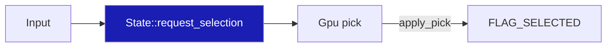

<!-- file: 12 session_viewer/src/state.rs type lines=1-45 -->

<!-- file: 12 session_viewer/src/state.rs type lines=46-174 -->

- `select` clears controls and edge highlight before moving the flag, so no lane keeps a stale parent.

<!-- file: 12 session_viewer/src/state.rs type lines=175-229 -->

- `apply_pick`: an edge answer needs `Scene::edge_at`; an object answer toggles the row.

<!-- file: 12 session_viewer/src/state.rs type lines=230-283 -->

- `render` applies a returned pick first, so the same frame presents its highlight; a pick on a still scene runs alone through `pick_frame`.

<!-- file: 12 session_viewer/src/state.rs type lines=284-347 -->

- `request_selection` configures the tolerance in CSS pixels times the actual logical-to-physical scale, then records the request.

<!-- file: 12 session_viewer/src/state.rs type lines=348-397 -->

Document titles and the selected name are derived labels; they have no source row and cannot intercept a click.

<!-- file: 12 session_viewer/src/state.rs type lines=398-472 -->

<!-- file: 12 session_viewer/src/state.rs copy lines=473-506 -->

### Step 14 · Gpu owns device, presentation and picking

- The surface becomes optional so the same `Gpu` renders headless.
- `controls` and `control_net` are second glyph/segment lanes reserved for lesson 13.
- `set_selected` and `set_hidden` flip one row's flag; hiding also invalidates the cloud records.

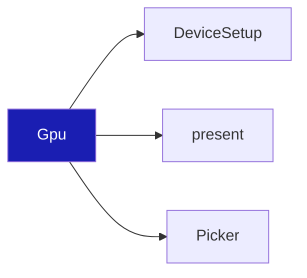

<!-- file: 12 session_viewer/src/engine/gpu/mod.rs type -->

### Step 15 · Declare the modules

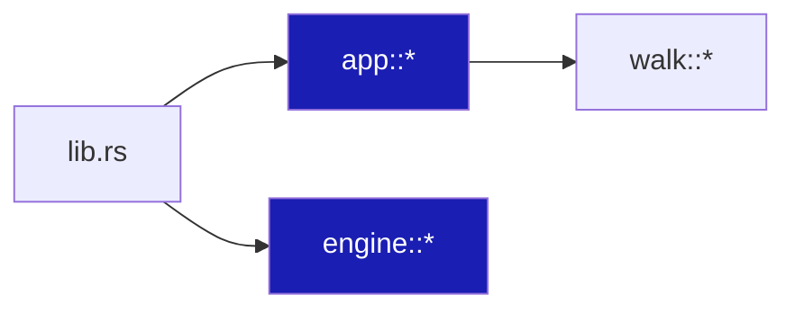

<!-- file: 12 session_viewer/src/engine/mod.rs type -->

<!-- file: 12 session_viewer/src/app/mod.rs type -->

- Append the dispatcher at the end of the walk module first, then replace its header with the lane-table borrow and the new declarations.

<!-- file: 12 session_viewer/src/app/walk/mod.rs type hunks=2 -->

<!-- file: 12 session_viewer/src/app/walk/mod.rs type hunks=1 -->

<!-- file: 12 session_viewer/src/app/route.rs type -->

### Step 16 · The application shell

- `Msg` is every asynchronous message the loader can post; `Ready` carries the `State` built around an empty scene.
- `request_if_needed` is the one place a frame is asked for.

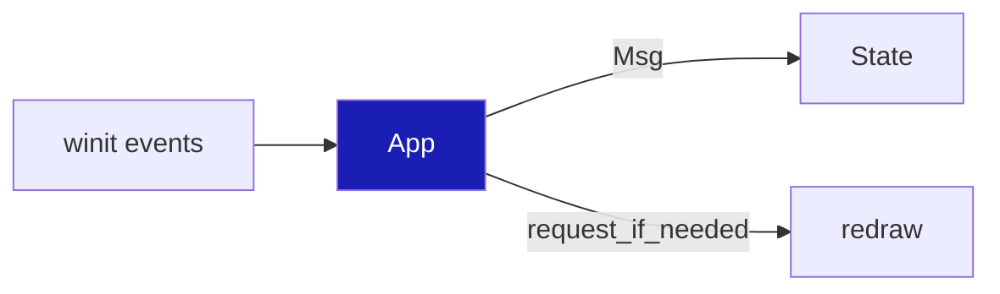

<!-- file: 12 session_viewer/src/lib.rs type whole lines=1-35 -->

<!-- file: 12 session_viewer/src/lib.rs type whole lines=36-92 -->

- `resumed` binds the `#canvas` element and spawns the loader; `user_event` and `window_event` end by asking for a frame only when something changed.

<!-- file: 12 session_viewer/src/lib.rs type whole lines=93-194 -->

<!-- file: 12 session_viewer/src/lib.rs copy whole lines=195-258 -->

### Step 17 · Page, manifest and the removed teaching fixture

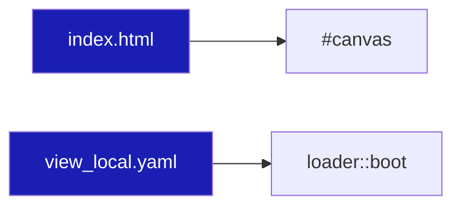

<!-- file: 12 session_viewer/index.html copy -->

<!-- file: 12 session_viewer/assets/view_local.yaml copy -->

<!-- file: 12 session_viewer/src/fixture.rs -->

## Check

<!-- checkpoint: 12 -->

Expected:

- The seven-object fixture loads: mesh, line, polyline, curve, surface, BRep and cloud.
- Click each one: it turns yellow; click again: it clears.
- Ctrl + click a mesh or BRep edge: that source edge highlights.
- Right-drag to orbit, then release without moving and click: only a still click selects. A drag never selects on release.
- Orbit while a click is pending: the late answer is discarded, nothing wrong gets selected.

If an object highlights but the status names another GUID, the row → identity map is wrong; fix `Scene`, not the shader colour.

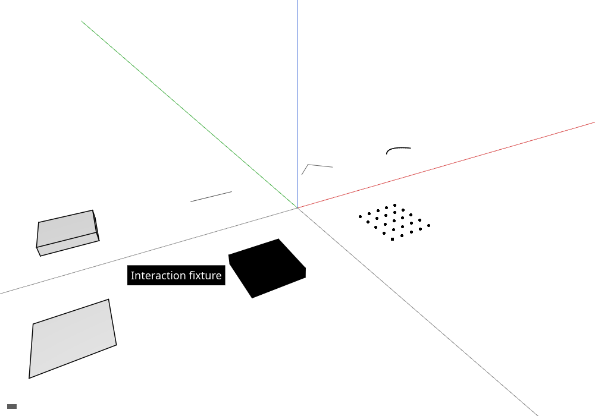

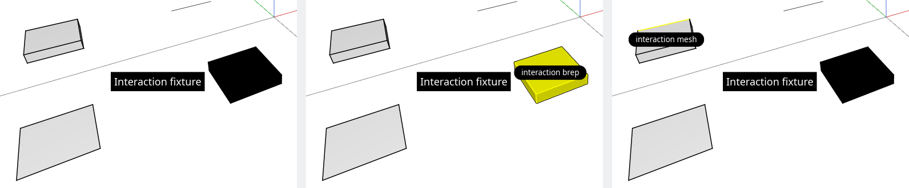

## What changed

<!-- tree: 12 session_viewer/src -->

- The teaching `Tutorial` is gone; `App` → `Input` → `State` → `Gpu` is the production ownership chain.
- Data flow for a click: CSS pixel → physical window → ID pass → readback → `Pick { row, sub }` → `Scene::resolve` → `State::select` → `FLAG_SELECTED` → yellow.

**Production equivalent:** every file in this lesson is a production file: `src/lib.rs`, `src/state.rs`, `src/app/{input,touch,scene,selection}.rs`, `src/engine/gpu/{device,present,render,pick}.rs`. Only `selection_outline.rs` is superseded, in lesson 17.

## Try

- Click the empty background: the selection clears, because the ID pass wrote 0 there.
- Press the right button on the BRep, drag one pixel and release: nothing is selected, so a small drag never counts as a click.
- Raise `PICK_RADIUS` in `pick.rs` and click just beside the curve: the nearest ID inside the window wins, so the curve is selected from further away.
- Make `Picker::poll` skip its `submitted != generation` comparison and orbit while a click is pending: a late answer selects against the new camera, which is the bug the check prevents.

## Next

[13 · Source controls](13-controls.md): F10 shows original vertices and control points, and streamed clouds answer from every source page.
