# 12 · Production shell and picking

## You are building

Part A builds the production application: winit owns the canvas and events, `App` routes them, `State` coordinates camera, scene and GPU.

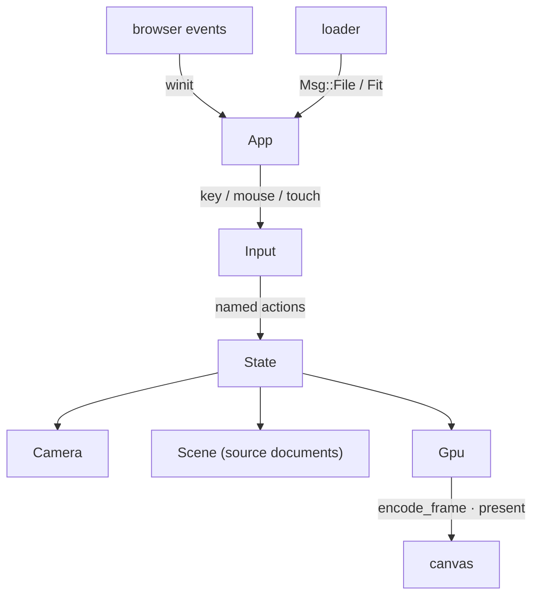

Part B adds picking: an integer ID pass, a bounded readback window, and a generation check so a late answer never selects against a newer camera.

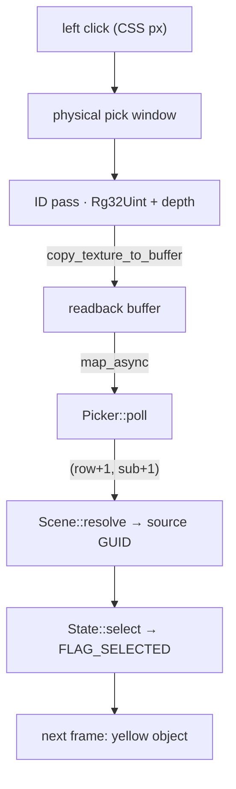


## Starting point

- Checkpoint 11: the `Tutorial` facade in `lib.rs` drives every lane through a JavaScript page; text renders.
- After this lesson `Tutorial` and `src/fixture.rs` are gone. The production `App`, `State`, `Scene`, `Input` and `Picker` take their place.

Install the binary interaction fixture and the supplied native harness file first:

<!-- supplied: 12 -->

<!-- step-status: start -->

**Does it compile yet?** `cargo check` passes after steps 1–13, 16 and 17, and fails after 14 and 15: a file is written across several steps, and a check can only pass once its last piece is in. Concretely, steps 14 and 15 build again at step 16. This is measured at the end of every step rather than guessed. And where a check passes while your new files are not yet named by a `mod` line, it is telling you only that you have not broken the previous checkpoint — the checkpoint build at the end of the lesson is the real test.

<!-- step-status: end -->

## Part A · Production shell

### Step 1 · Device negotiation

{ .locator data-strip="illustrations/strip-7e0ebebd95.svg" }

- Browser builds use `BROWSER_WEBGPU` only; native test builds use the primary backends. Both go through one function.
- A storage-binding limit is requested explicitly, so a large cloud fails with a GPU error instead of a silent driver fallback.
- Uncaptured errors and device loss are remembered in `failure`; `State::render` reads it and shows the reload panel instead of drawing garbage.

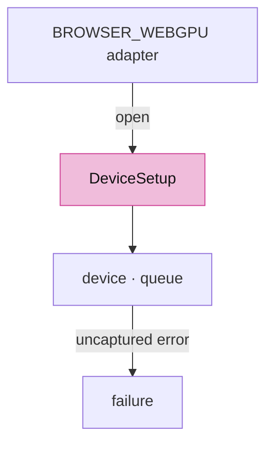

- The browser picks the presentation-compatible adapter; `?gpu=high` asks for the high-performance one on a hybrid machine and falls back to the browser's choice when that adapter is refused.

<!-- file: 12 session_viewer/src/engine/gpu/device.rs type lines=1-83 -->

- That is the chain as far as a chosen adapter. The next part asks it for a device, and the only unusual thing it asks for is a storage-binding limit.

<!-- file: 12 session_viewer/src/engine/gpu/device.rs type lines=84-116 -->

- 256 MiB of storage binding where available, rather than the adapter maximum: the measured point-cloud scene needs 158 MB in one table. A device limited to the standard 128 MiB still starts, and an oversized scene then reports a GPU error instead of a silent driver fallback.
- `failure` is where an uncaptured error or a device loss is remembered, because both arrive on a callback rather than at the call that caused them. `State::render` reads it and shows the reload panel instead of drawing garbage.

<!-- file: 12 session_viewer/src/engine/gpu/device.rs type lines=117-162 -->

- The surface's own capabilities decide the format: the first sRGB one if there is one, so colours are written in the space the browser will display.

Native-only adapter naming and the error callbacks:

<!-- file: 12 session_viewer/src/engine/gpu/device.rs copy lines=163-231 -->

### Step 2 · Presenting a frame

{ .locator data-strip="illustrations/strip-7e0ebebd95.svg" }

- `write_frame_uniforms` runs once per frame: camera matrices, then the inside-flag refresh that reads the eye just solved, then text placement.
- `present` returns `None` when the surface had no texture; the caller asks for another frame instead of panicking.
- `pick_frame` is the ID pass alone, against the depth the last presented frame left: a pick on a still scene costs no colour frame.

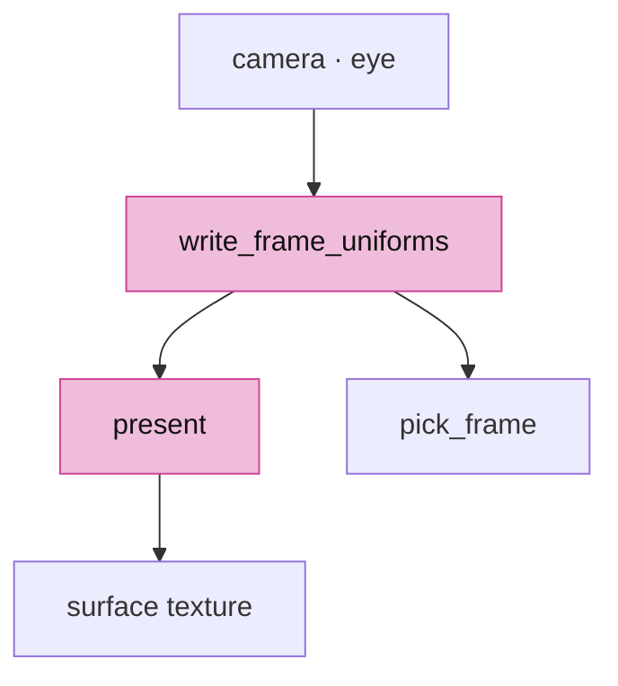

<!-- file: 12 session_viewer/src/engine/gpu/present.rs type lines=1-68 -->

<!-- file: 12 session_viewer/src/engine/gpu/present.rs type lines=69-85 -->

The offscreen and benchmark paths used by native tools:

<!-- file: 12 session_viewer/src/engine/gpu/present.rs copy lines=86-183 -->

### Step 3 · The frame list

{ .locator data-strip="illustrations/strip-7e0ebebd95.svg" }

- Pass order is the whole contract: physical surfaces write depth, the selection mask reads it, ink reads it, the ID pass repeats the same toggles.
- `encode_frame` knows nothing about a surface, so the same list renders headless.

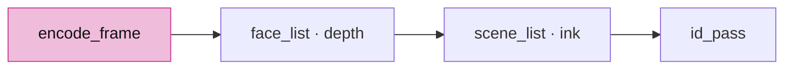

<!-- file: 12 session_viewer/src/engine/gpu/render.rs type lines=1-54 -->

<!-- file: 12 session_viewer/src/engine/gpu/render.rs type lines=55-123 -->

- The frame list, in order. Read it as the contract it is: physical surfaces write the depth, everything after them reads it, and the same order is repeated by the ID pass so a pick cannot disagree with the picture.

### Step 4 · Input bindings

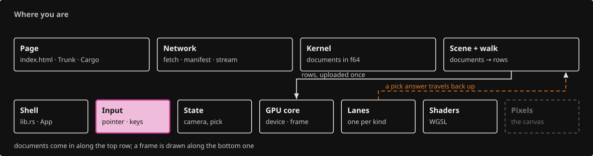{ .locator data-strip="illustrations/strip-fbd409c950.svg" }

Every handler returns whether the frame must be redrawn; a click returns `false` because nothing changes until the GPU answers.

| Input | Action |
|---|---|
| Right drag | orbit |
| Middle drag, Ctrl + right drag | pan |
| Wheel | zoom toward the cursor |
| Left click | select / toggle the object |
| Ctrl + left click | select an original edge |
| 1–7 | named views · Space projection · C reset · F fit |
| Q / W / E / D / B | points, lines, mesh edges, lighting, back faces |
| H / S | hide the selection / show all |
| T | toggle selected names |
| Escape | leave edge mode, then clear |

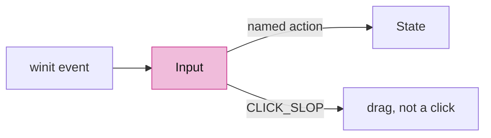

<!-- file: 12 session_viewer/src/app/input.rs type lines=1-47 -->

<!-- file: 12 session_viewer/src/app/input.rs type lines=48-81 -->

- Two view keys sit beside selection. `D` flips the headlight (`view.lit`, off by default: a face shows its flat row colour until you ask for shading). `P` flips x-ray through `toggle_xray`; from lesson 18 on, a zero opacity turns every multi-face solid into its edges and vertices.

<!-- file: 12 session_viewer/src/app/input.rs type lines=82-168 -->

- A press that moved more than `CLICK_SLOP` before release is a drag, so a camera gesture never selects on release.

<!-- file: 12 session_viewer/src/app/input.rs type lines=169-196 -->

- The owned `pointercancel` listener detaches on drop; a forgotten closure would outlive the canvas.

<!-- file: 12 session_viewer/src/app/input.rs copy lines=197-256 -->

### Step 5 · Touch

{ .locator data-strip="illustrations/strip-fbd409c950.svg" }

- winit routes `pointerType == "touch"` to `WindowEvent::Touch` only, so fingers never reach the mouse arms.
- Finger travel is divided by the device pixel ratio; otherwise one centimetre of glass orbits three times faster on a DPR 3 phone.
- A finger that lifts within 12 px and 300 ms of where it landed is a tap: `Act::Tap` carries the point and the input layer requests a selection there, the same pick a click makes. A second tap within 320 ms and 40 px is `Act::Fit`, which needs the scene bounds a layer up.

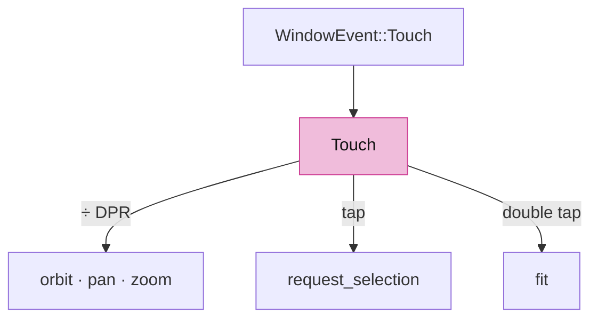

<!-- file: 12 session_viewer/src/app/touch.rs copy lines=1-68 -->

<!-- file: 12 session_viewer/src/app/touch.rs type lines=69-138 -->

- A finger's whole life, in physical pixels. `Act` is what the gesture asked for rather than what was done, because `Fit` needs the scene bounds and this file is allowed to know only the camera.

<!-- file: 12 session_viewer/src/app/touch.rs copy lines=139-229 -->

### Step 6 · Scene: source documents and row bookkeeping

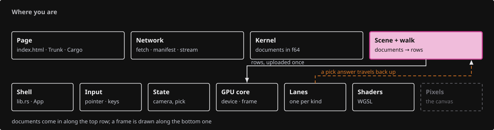{ .locator data-strip="illustrations/strip-06adfb6f59.svg" }

- `Scene` owns every kernel `Session` plus its placement; the GPU only holds rows. A pick returns a row, `Scene::resolve` returns the document and GUID.
- `order` maps row → GUID and `guid_to_row` maps back; both survive an upload because the rows are forgotten only after `upload_to`.

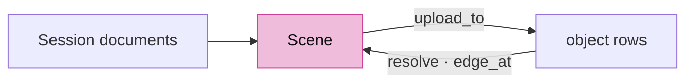

<!-- file: 12 session_viewer/src/app/scene.rs type lines=1-59 -->

<!-- file: 12 session_viewer/src/app/scene.rs type lines=60-117 -->

- Clearing keeps the scene usable rather than replacing it: a reload must not invalidate the `Scene` the whole application is holding, so the tables are emptied in place and the row bookkeeping starts again from zero.

<!-- file: 12 session_viewer/src/app/scene.rs type lines=118-176 -->

- One object row per GUID in the kernel's canonical order; the row a GUID gets is the row it keeps within a revision.

<!-- file: 12 session_viewer/src/app/scene.rs type lines=177-199 -->

- The walk is where a kernel document becomes rows: one object row per guid, in the kernel's canonical order, so the row a guid gets is the row it keeps for as long as that revision is loaded.

<!-- file: 12 session_viewer/src/app/scene.rs type lines=200-264 -->

- Streamed clouds have no kernel object; their slot records the absolute row point 0 landed on.

<!-- file: 12 session_viewer/src/app/scene.rs type lines=265-326 -->

- A streamed cloud grows: each slice appends to the same row range and uploads only the new points, so the scene never rebuilds what is already on the GPU.

<!-- file: 12 session_viewer/src/app/scene.rs type lines=327-341 -->

- Row → identity in both directions; `edge_at` reads the segment sub-ID tag bit set by the ribbon shader.

<!-- file: 12 session_viewer/src/app/scene.rs type lines=342-405 -->

- Resolving a pick is where a row becomes something a user can be told about: an edge answer goes back through the retained producer records, and an answer that cannot be named is refused rather than guessed.

<!-- file: 12 session_viewer/src/app/scene.rs type lines=406-483 -->

### Step 7 · Selection mode

{ .locator data-strip="illustrations/strip-06adfb6f59.svg" }

Exactly one parent owns a specialized selection; `escape` returns that parent so it stays highlighted.

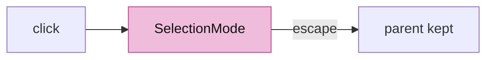

<!-- file: 12 session_viewer/src/app/selection.rs type -->

### Step 8 · Producers for clouds, frames and points

{ .locator data-strip="illustrations/strip-06adfb6f59.svg" }

The walk gains three producers so every kernel geometry type has a lane.

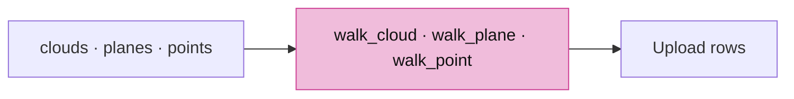

<!-- file: 12 session_viewer/src/app/walk/cloud.rs type lines=1-48 -->

- Positions, colours and normals come out of the kernel's flat arrays; normals only when every point has one, because a partly-normalled cloud would shade inconsistently and there is no per-point flag to say which.

<!-- file: 12 session_viewer/src/app/walk/cloud.rs type lines=49-81 -->

- The octree the file carries is rewritten into this cloud's own row and node numbering, so one lane can hold many clouds without their node indices colliding.

<!-- file: 12 session_viewer/src/app/walk/cloud.rs type lines=82-128 -->

<!-- file: 12 session_viewer/src/app/walk/cloud.rs type lines=129-183 -->

- A streamed cloud is only partly present, so its spacing is measured over the nodes that are actually complete within the points received. Sizing discs from a node that is still arriving would make them flicker as it fills.

<!-- file: 12 session_viewer/src/app/walk/cloud.rs type lines=184-221 -->

<!-- file: 12 session_viewer/src/app/walk/frames.rs type -->

- A plane becomes a one-metre square and a box its twelve edges, both in the flat ribbon lane: a construction plane is drawn, not shaded.

<!-- file: 12 session_viewer/src/app/walk/points.rs type -->

- The smallest producer in the viewer: one dot, no topology, no facing cull. Worth reading as the shape every producer has.

### Step 9 · Stream records, feedback, inspection and the fixture loader

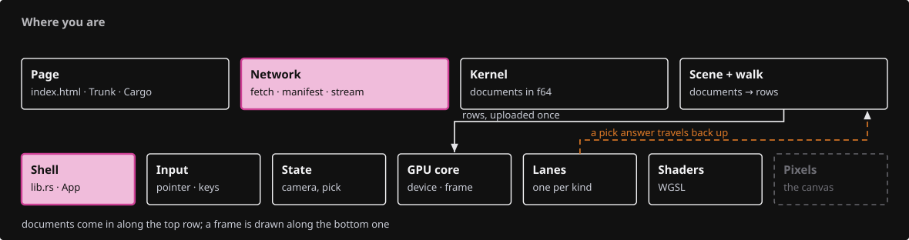{ .locator data-strip="illustrations/strip-d717b2c025.svg" }

- `stream.rs` holds the wire-layout records of a streamed cloud.
- `feedback` writes `textContent`, never HTML.
- `inspection` publishes a read-only JSON snapshot on `?inspect=1`; it is how the checkpoint is observed.
- `loader` decodes the bundled fixture and posts `Msg::File` then `Msg::Fit`.

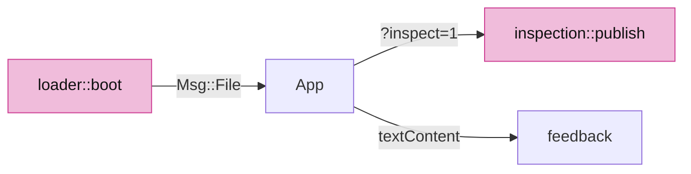

<!-- file: 12 session_viewer/src/app/stream.rs type -->

<!-- file: 12 session_viewer/src/app/feedback.rs type -->

- Status messages go through `textContent`, never HTML: the text can come from a document or a server, and neither is allowed to write markup into the page.

<!-- file: 12 session_viewer/src/app/inspection.rs copy -->

<!-- file: 12 session_viewer/src/app/loader.rs type -->

- A local fixture loader, one file wide, so the shell has something to load. Lesson 14 replaces it with manifests, routing and staged replacement.

<!-- check: 12 -->

The new modules are not declared yet, so the crate still builds unchanged.

## Part B · Picking

### Step 10 · The ID target and the readback window

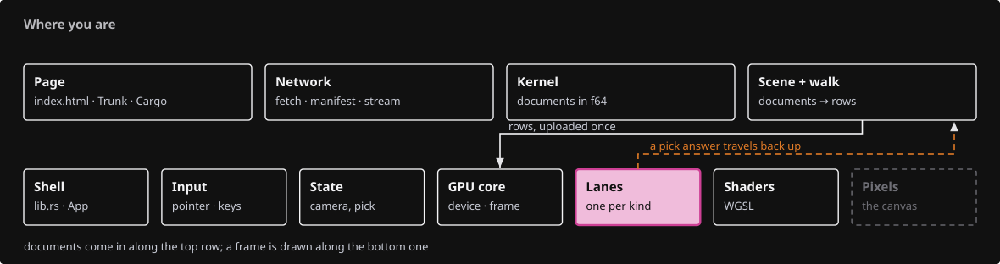{ .locator data-strip="illustrations/strip-a17ca1f455.svg" }

```text
Rust                                                    WGSL (already in the lanes)
IdTargets.id : Rg32Uint                            ↔   fs_id(...) -> vec2<u32>
   .x = object row + 1, .y = sub-object id + 1         triangle: (inst_id + 1, 0)
   0 = background                                       ribbon:   (inst_id + 1, segment + 1 | 0x80000000)
IdTargets.depth : Depth32Float, cleared to 0       ↔   reversed depth, compare Greater
copy_texture_to_buffer(window)  →  readback buffer  →  map_async  →  poll
```

- The pass is scissored to a small window about the cursor and only that window is copied out; the vertex work stays, the fill does not.
- `ROW_BYTES` is the copy pitch rounded to the required alignment.

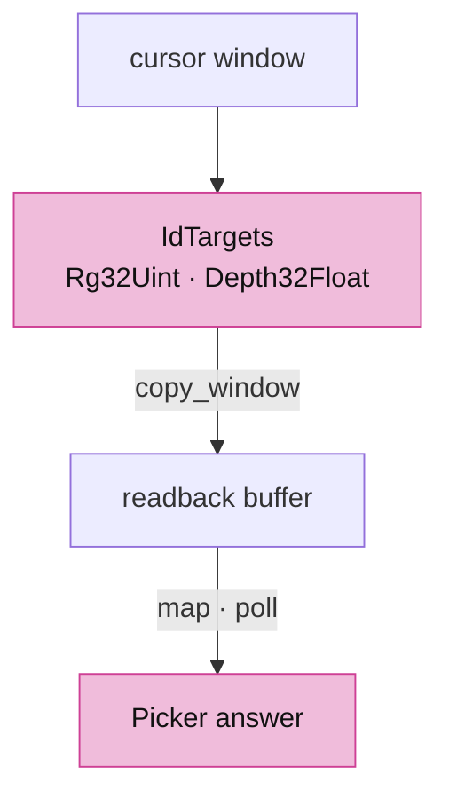

<!-- file: 12 session_viewer/src/engine/gpu/pick.rs type lines=1-59 -->

- The tolerance is a circle in framebuffer pixels, at least one pixel wide: the click is a point, but the user's intent is a small neighbourhood, and that neighbourhood has to be the same physical size on every display.

<!-- file: 12 session_viewer/src/engine/gpu/pick.rs type lines=60-82 -->

- `generation` counts requests; `submitted` records which generation the in-flight copy belongs to. A camera move bumps `generation`, so the answer is discarded when it lands.

<!-- file: 12 session_viewer/src/engine/gpu/pick.rs type lines=83-144 -->

<!-- file: 12 session_viewer/src/engine/gpu/pick.rs type lines=145-203 -->

- One function computes the window's bounds and both the scissor and the copy use it. Two computations that must agree are one computation used twice.

<!-- file: 12 session_viewer/src/engine/gpu/pick.rs type lines=204-222 -->

- The ID targets are made on the first pick and kept until the canvas resizes. The gradient attachment gives ink the same visibility rule as the colour frame.

<!-- file: 12 session_viewer/src/engine/gpu/pick.rs type lines=223-309 -->

- The ID pass gets the same gradient attachment the colour frame has, because ink decides its own visibility from it — without it, a stroke would be pickable exactly where it is invisible.

<!-- file: 12 session_viewer/src/engine/gpu/pick.rs type lines=310-350 -->

<!-- file: 12 session_viewer/src/engine/gpu/pick.rs type lines=351-395 -->

- The native census captures the unchanged ID pass, which is how the hidden-line tests judge visibility against exact object numbers rather than against pixels.

<!-- file: 12 session_viewer/src/engine/gpu/pick.rs type lines=396-439 -->

- `map` must run after the submit and only once per copy; `poll` reads the mapped bytes on a later frame.
- Ink beats a face anywhere in the window; among equals the nearest to the cursor wins, so a curve lying across a face is still selectable.

<!-- file: 12 session_viewer/src/engine/gpu/pick.rs type lines=440-488 -->

<!-- file: 12 session_viewer/src/engine/gpu/pick.rs type lines=489-552 -->

- `nearest_hit` is the rule that makes a hairline clickable: ink beats a face anywhere in the window, and among equals the nearest texel to the cursor wins.

<!-- file: 12 session_viewer/src/engine/gpu/pick.rs copy lines=553-632 -->

### Step 11 · The ID pass in the frame list

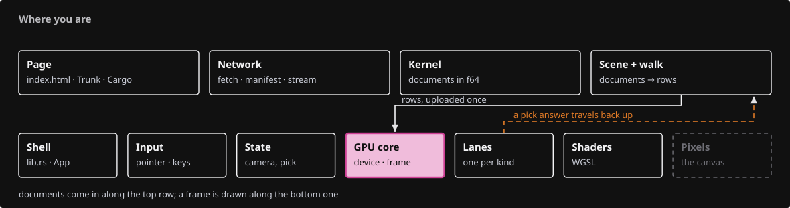{ .locator data-strip="illustrations/strip-79f1ca6f22.svg" }

- Same toggles, same order as the colour list: what a lane hides it cannot pick.
- Edge mode draws only source-edge IDs; object mode draws faces, then ink with ink-first precedence.

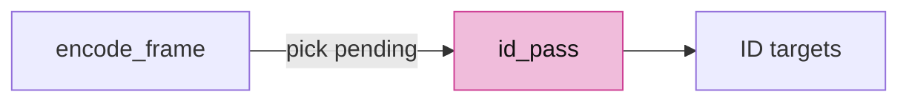

<!-- file: 12 session_viewer/src/engine/gpu/render.rs type lines=124-196 -->

### Step 12 · Selected-surface silhouette

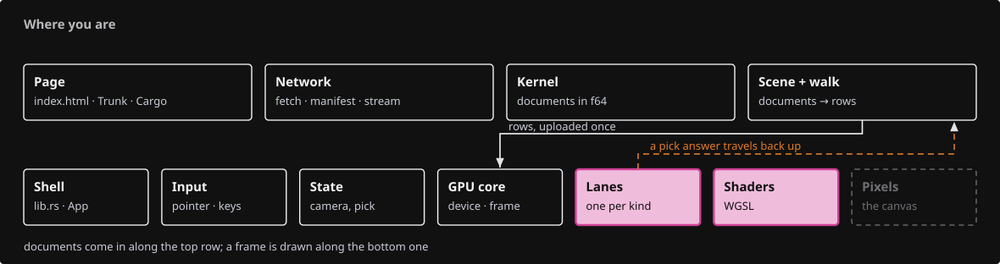{ .locator data-strip="illustrations/strip-e35aa0ee6c.svg" }

- A visible selected surface writes an R8 coverage mask against the frame's depth; a fullscreen pass darkens the ring just outside it.
- Coverage is allocated only while a selection exists and released the moment it clears.

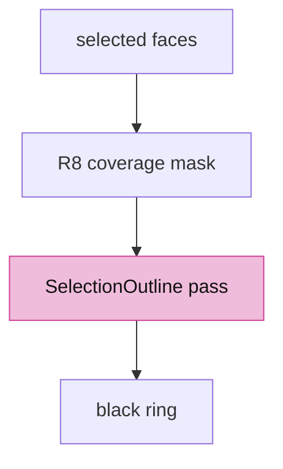

<!-- file: 12 session_viewer/src/engine/gpu/selection_outline.rs type lines=1-74 -->

- Coverage is allocated with the first selected row and released with the last, so an unselected scene pays nothing for a feature it is not using.

<!-- file: 12 session_viewer/src/engine/gpu/selection_outline.rs type lines=75-98 -->

<!-- file: 12 session_viewer/src/engine/gpu/selection_outline.rs type lines=99-165 -->

- `prepare` allocates the coverage texture only while something is selected, and answers whether there is anything to draw at all - the cheapest version of this feature is the one that is switched off.

<!-- file: 12 session_viewer/src/engine/gpu/selection_outline.rs type lines=166-229 -->

- The compositing pipeline is built for the pass's own colour format and sample count, which is why it has to be rebuilt when the sample count flips rather than chosen once at start-up.

<!-- file: 12 session_viewer/src/engine/gpu/selection_outline.rs type lines=230-244 -->

<!-- file: 12 session_viewer/src/engine/gpu/selection_outline.rs copy lines=245-341 -->

```text
Rust bind group 0                          WGSL
binding 0: mask texture view (R8Unorm)  ↔  @group(0) @binding(0) var mask: texture_2d<f32>
binding 1: uniform [radius, 0, 0, 0]    ↔  @group(0) @binding(1) var<uniform> radius: vec4<f32>
```

<!-- file: 12 session_viewer/src/shaders/selection_outline.wgsl type -->

<!-- check: 12 -->

Still undeclared modules; the check passes for the same reason as before.

## Part C · Wiring

### Step 13 · State

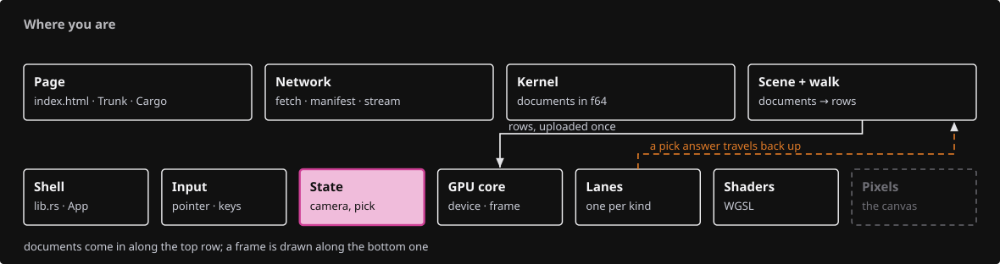{ .locator data-strip="illustrations/strip-600cbe96cd.svg" }

- `needs_frame` is the demand for a redraw; `dirty` says the picture changed. A pending pick sets the first without the second.
- `touch` cancels any pick in flight: the camera or scene it was asked against no longer exists.

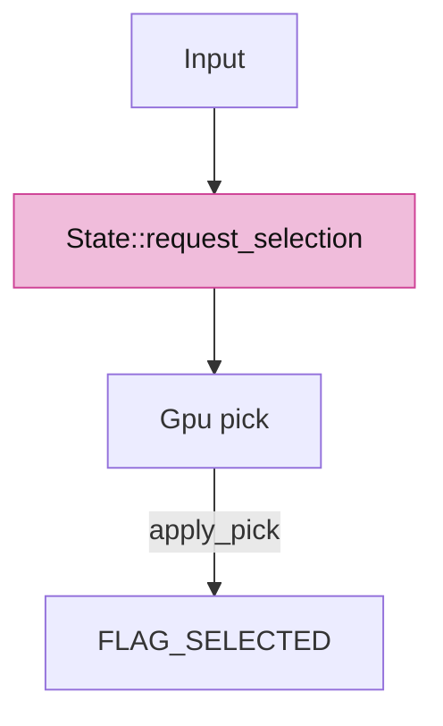

<!-- file: 12 session_viewer/src/state.rs type lines=1-45 -->

<!-- file: 12 session_viewer/src/state.rs type lines=46-106 -->

- Streamed clouds and sheets arrive in slices, so each has an add and an extend: the first makes the row, the rest only append. `State` is the only place that knows a slice belongs to a scene object already on screen.

<!-- file: 12 session_viewer/src/state.rs type lines=107-161 -->

- A resize is forwarded rather than handled: the camera needs the new aspect, the GPU needs new attachments, and doing both from one place is what keeps them from disagreeing for a frame.

<!-- file: 12 session_viewer/src/state.rs type lines=162-188 -->

- Everything above changes what is in the scene: append a document, replace the manifest texts, start or extend a streamed cloud or sheet, clear. Each one ends by telling the GPU and asking for a frame — `State` is the only place that knows both sides.

<!-- file: 12 session_viewer/src/state.rs type lines=189-207 -->

- `toggle_xray` is a view change, not a scene change: `view.opacity` goes between `1.0` and `0.0` and `touch` schedules a frame; the shaders read the zero, no row is rewritten.
- `select` clears controls and edge highlight before moving the flag, so no lane keeps a stale parent.

<!-- file: 12 session_viewer/src/state.rs type lines=208-262 -->

- `apply_pick`: an edge answer needs `Scene::edge_at`; an object answer toggles the row.

<!-- file: 12 session_viewer/src/state.rs type lines=263-316 -->

- `render` applies a returned pick first, so the same frame presents its highlight; a pick on a still scene runs alone through `pick_frame`.

<!-- file: 12 session_viewer/src/state.rs type lines=317-380 -->

- `request_selection` configures the tolerance in CSS pixels times the actual logical-to-physical scale, then records the request.

<!-- file: 12 session_viewer/src/state.rs type lines=381-430 -->

Document titles and the selected name are derived labels; they have no source row and cannot intercept a click.

<!-- file: 12 session_viewer/src/state.rs type lines=431-484 -->

<!-- file: 12 session_viewer/src/state.rs copy lines=485-510 -->

### Step 14 · Gpu owns device, presentation and picking

{ .locator data-strip="illustrations/strip-79f1ca6f22.svg" }

- The surface becomes optional so the same `Gpu` renders headless.
- `controls` and `control_net` are second glyph and segment lanes for source control markers.
- `set_selected` and `set_hidden` flip one row's flag; hiding also invalidates the cloud records.

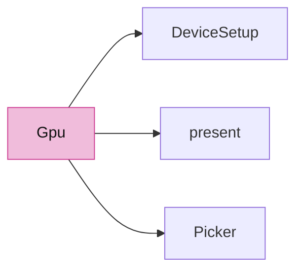

<!-- file: 12 session_viewer/src/engine/gpu/mod.rs type -->

### Step 15 · Declare the modules

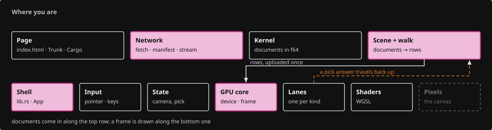{ .locator data-strip="illustrations/strip-896d73a966.svg" }

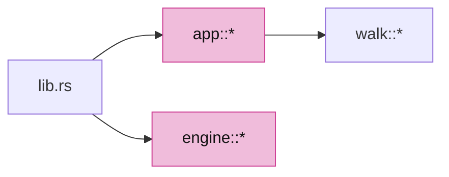

<!-- file: 12 session_viewer/src/engine/mod.rs type -->

<!-- file: 12 session_viewer/src/app/mod.rs type -->

- Append the dispatcher at the end of the walk module first, then replace its header with the lane-table borrow and the new declarations.

<!-- file: 12 session_viewer/src/app/walk/mod.rs type hunks=2-2 -->

<!-- file: 12 session_viewer/src/app/walk/mod.rs type hunks=1-1 -->

- The dispatcher: one arm per kernel geometry type, each handed only the lane tables it writes. Nothing here knows what a file is.

<!-- file: 12 session_viewer/src/app/route.rs type -->

- The query reader is edited, not replaced: the production shell owns it now, and the routing policy is still two lessons away.

### Step 16 · The application shell

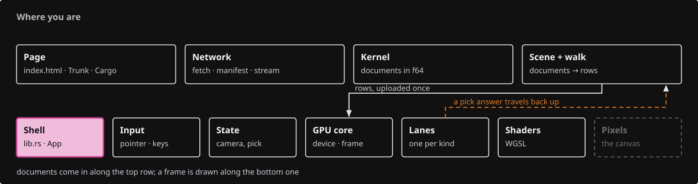{ .locator data-strip="illustrations/strip-fb5fa99de5.svg" }

- `Msg` is every asynchronous message the loader can post; `Ready` carries the `State` built around an empty scene.
- `request_if_needed` is the one place a frame is asked for.

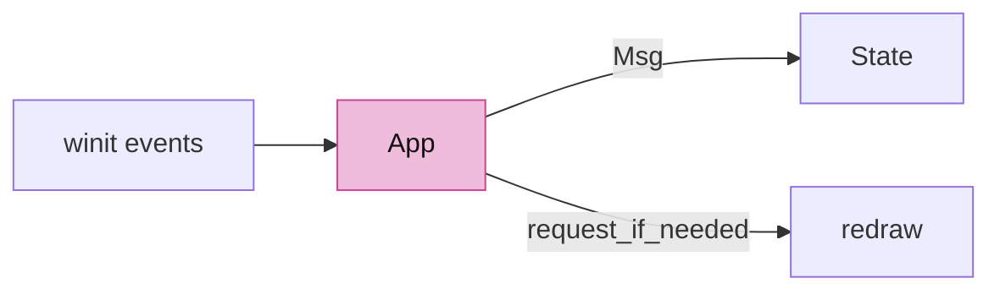

<!-- file: 12 session_viewer/src/lib.rs type whole lines=1-35 -->

<!-- file: 12 session_viewer/src/lib.rs type whole lines=36-92 -->

- `resumed` binds the `#canvas` element and spawns the loader; `user_event` and `window_event` end by asking for a frame only when something changed.

<!-- file: 12 session_viewer/src/lib.rs type whole lines=93-157 -->

- The window handler keeps only redraw and resize. Keys and the mouse are handed to `Input`, which answers whether a frame is needed — so the shell never decides what a gesture means.

<!-- file: 12 session_viewer/src/lib.rs type whole lines=158-194 -->

<!-- file: 12 session_viewer/src/lib.rs copy whole lines=195-258 -->

### Step 17 · Page, manifest and the removed teaching fixture

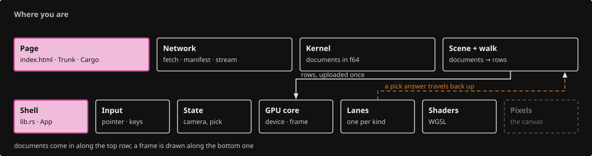{ .locator data-strip="illustrations/strip-4b8a702944.svg" }

- The page is one canvas, a status line and a hidden error panel; `touch-action: none` on the canvas hands every gesture to winit before the browser can claim it as a scroll.
- `#viewer-docs` is the documentation corner: a fixed 40 px black folded-corner triangle at the top right, drawn from the borders of a zero-size anchor, that opens `docs/` in a new tab. Hover or keyboard focus grows it to 52 px through a 250 ms eased transition, so it reads as a page corner lifting; it sits above the canvas and covers nothing but its own triangle.
- The `copy-dir` link publishes `target/docs/site` as `dist/docs`, so the corner's link resolves in a served build. Nothing builds that site yet — lesson 14 adds the pre-build hook that does — and Trunk refuses a `copy-dir` whose source is missing, so create the directory once before you serve:

```sh
mkdir -p "$COURSE_WORK/session_viewer/target/docs/site"
```

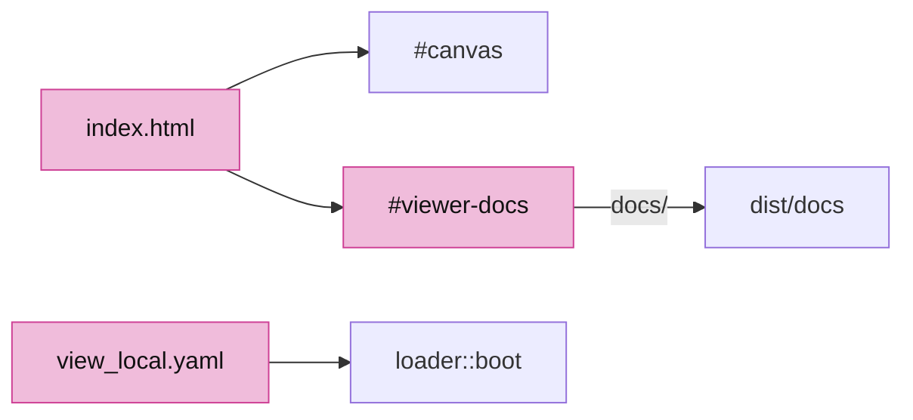

<!-- file: 12 session_viewer/index.html copy -->

<!-- file: 12 session_viewer/assets/view_local.yaml copy -->

<!-- file: 12 session_viewer/src/fixture.rs -->

- The whole production shell is in the build now. The two checks inside Parts A and B passed while the new modules were still undeclared, so this is the first one that compiles them; the teaching fixture and `Tutorial` are gone and `App` has taken their place.

<!-- check: 12 -->

## Check

<!-- checkpoint: 12 -->

Expected:

- The seven-object fixture loads: mesh, line, polyline, curve, surface, BRep and cloud.
- Click each one: it turns yellow; click again: it clears.
- Ctrl + click a mesh or BRep edge: that source edge highlights.
- Right-drag to orbit, then release without moving and click: only a still click selects. A drag never selects on release.
- Orbit while a click is pending: the late answer is discarded, nothing wrong gets selected.

If an object highlights but the status names another GUID, the row → identity map is wrong; fix `Scene`, not the shader colour.


## What changed

<!-- tree: 12 session_viewer/src -->

- `Tutorial` and `src/fixture.rs` are removed; `App` → `Input` → `State` → `Gpu` is the production ownership chain.
- Data flow for a click: CSS pixel → physical window → ID pass → readback → `Pick { row, sub }` → `Scene::resolve` → `State::select` → `FLAG_SELECTED` → yellow.

**Production equivalent:** `src/lib.rs`, `src/state.rs`, `src/app/{input,touch,scene,selection}.rs`, `src/engine/gpu/{device,present,render,pick}.rs`; production draws the selection ring from `src/engine/gpu/surface_outline.rs`.

## Try

- Click the empty background: the selection clears, because the ID pass wrote 0 there.
- Press the right button on the BRep, drag one pixel and release: nothing is selected, so a small drag never counts as a click.
- Raise `PICK_RADIUS` in `pick.rs` and click just beside the curve: the nearest ID inside the window wins, so the curve is selected from further away.
- Hover the black corner at the top right: it grows; click it and the course opens in a new tab from `dist/docs`.
- Make `Picker::poll` skip its `submitted != generation` comparison and orbit while a click is pending: a late answer selects against the new camera, which is the bug the check prevents.

## Questions and answers

Halfway. From here the questions assume you can read the code and ask instead whether you would have *designed* it this way.

**Picking renders the scene again into an integer target instead of intersecting a ray with the geometry on the CPU. Argue for that choice.**

*How to work it out.* Write down everything that decides whether a pixel shows an object: the depth test, the ink visibility rule, hidden flags, x-ray discards, the finite-triangle test, text placement, the LOD the cloud chose this frame. Now ask a CPU ray-caster to reproduce all of it. Every rule you forget is a place where the click disagrees with the picture.

*The answer.* The GPU already knows what is on screen, so ask it. Rendering the same draws with `fs_id` instead of `fs_main` means the picture and the pick cannot drift apart by construction. The cost is a GPU round-trip, which is why the pass is scissored to a small window around the cursor and read back asynchronously.

**What is `generation` for, and what breaks without it?**

*How to work it out.* The answer to a pick arrives some frames after the request. Ask what can happen in between: the camera can move, the scene can be replaced. Then ask what the answer means once it does — it describes a picture that no longer exists.

*The answer.* `generation` counts requests and `submitted` records which generation the in-flight copy belongs to; a camera move bumps the counter, so a late answer is discarded. Without it, a click selects whatever was under that pixel before you orbited away. Every asynchronous answer in this viewer carries a generation for the same reason.

**`needs_frame` and `dirty` sound like the same flag. Why are they two?**

*How to work it out.* Find a case where one is true and the other is not. A pick is in flight: you must render again to poll the readback, but nothing about the picture has changed. Now the converse: the scene changed but you are already going to draw.

*The answer.* `needs_frame` means "ask for another frame"; `dirty` means "the picture changed". Conflating them gives you either a pick that never completes, or a canvas that redraws forever.

**In the pick window, ink beats a face anywhere; among equals the nearest to the cursor wins. Why not simply take the nearest ID?**

*How to work it out.* Count pixels. A curve lying on a face covers a few pixels in the window; the face covers nearly all of them. Nearest-wins therefore returns the face almost every time, and edges become nearly unclickable — which is not what the user meant by clicking on a line.

*The answer.* The rule encodes intent rather than pixel counts, and it is the tolerance a CAD user expects. The window's size is expressed in CSS pixels and scaled, so the feel is the same on any display.

**What you should be able to do now**

List the frame's passes in order with what each reads and writes: backdrop and faces write colour, depth and gradient; the selection mask reads depth and writes coverage; ink reads depth and gradient and writes colour; the ID pass repeats the same draws and toggles into an integer target. Then say why the ID pass must repeat the same toggles — because what a lane hides it must also not pick, or the user can select something they cannot see. Lessons 13 to 20 add to this list; they do not change it.

## Next

[13 · Source controls](13-controls.md): F10 shows original vertices and control points, and streamed clouds answer from every source page.
