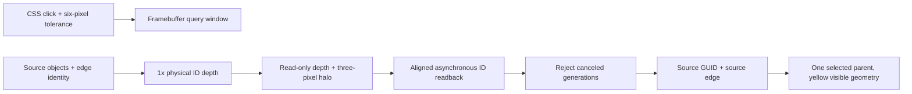
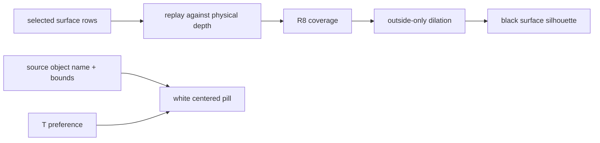

# 12 · Object and original-edge picking

Start at checkpoint **11** in `/tmp/viewer-course`. Replace the direct-canvas teaching shell with the production winit event loop, State, Scene and input owner; a bundled local Session keeps loading deterministic.



Text equivalent: the display and ID passes share visibility; a small asynchronous query maps GPU rows back to source GUIDs and source edges only after its generation remains valid.

1. Apply the complete implementation below, then build and exercise the local fixture.

**COPY/PASTE — manual binary inputs before adopting the source edits.** Automatic replay already copies these hash-checked PB/font inputs.

```sh
python3 "$COURSE_REPO/docs/reconstruction/replay.py" --output /tmp/viewer-course --through 12 --copy-assets
```

**COPY/PASTE — complete mechanical integration.** [12.patch](reconstruction/patches/12.patch) supplies every file addition, deletion, import, descriptor, field and test listed below; substitute the literal **TYPE BY HAND** blocks for their corresponding changes.

| File | Action / unique anchor |
|---|---|
| `assets/pb/interaction.pb` | create; complete file from the patch |
| `assets/pb/interaction.pb.json` | create; complete file from the patch |
| `assets/view_local.yaml` | create; complete file from the patch |
| `index.html` | replace; complete file from the patch |
| `src/app/feedback.rs` | create; complete file from the patch |
| `src/app/input.rs` | create; `Input::left` |
| `src/app/inspection.rs` | create; complete file from the patch |
| `src/app/loader.rs` | create; complete file from the patch |
| `src/app/mod.rs` | replace; complete file from the patch |
| `src/app/route.rs` | replace; complete file from the patch |
| `src/app/scene.rs` | create; `Scene::edge_at`, `Scene::identity_of` |
| `src/app/selection.rs` | create; `complete module` |
| `src/app/stream.rs` | create; complete file from the patch |
| `src/app/touch.rs` | create; complete file from the patch |
| `src/app/walk/cloud.rs` | create; complete file from the patch |
| `src/app/walk/frames.rs` | create; complete file from the patch |
| `src/app/walk/mod.rs` | replace; complete file from the patch |
| `src/app/walk/points.rs` | create; complete file from the patch |
| `src/engine/gpu/device.rs` | create; complete file from the patch |
| `src/engine/gpu/mod.rs` | replace; complete file from the patch |
| `src/engine/gpu/pick.rs` | create; `complete module` |
| `src/engine/gpu/present.rs` | create; complete file from the patch |
| `src/engine/gpu/render.rs` | create; `Gpu::id_pass` |
| `src/engine/gpu/selection_outline.rs` | create; complete file from the patch |
| `src/engine/mod.rs` | replace; complete file from the patch |
| `src/fixture.rs` | delete; complete file from the patch |
| `src/lib.rs` | replace; complete file from the patch |
| `src/selftest/lifecycle.rs` | create; complete file from the patch |
| `src/shaders/selection_outline.wgsl` | create; complete file from the patch |
| `src/state.rs` | create; `State::touch`, `State::select`, `State::request_selection`, `State::apply_pick`, `State::render` |

**COPY/PASTE — shell and local fixture boundary.** Replace `src/lib.rs`, `src/state.rs` fields/constructor and `src/app/scene.rs` ownership records from the patch; remove the old `Tutorial` façade and `src/fixture.rs`, and register the production producers through `src/app/walk/mod.rs`.

The local loader decodes `assets/pb/interaction.pb` and sends `Ready`, `File`, then `Fit`; route/manifest/live loading arrives in chapter 14, and the empty control lanes gain behavior in chapter 13.

**TYPE BY HAND — `src/app/selection.rs`: create/replace the complete file.** The enum retains one parent and returns that parent when Escape clears the specialized mode.

```rust
//! Original edge identity and single-parent selection; source controls arrive in chapter13.

/// Exactly one parent owns the specialized edge selection.
#[derive(Clone, Debug, Default, PartialEq, Eq, serde::Serialize)]
pub enum SelectionMode {
    #[default]
    Object,
    Edge {
        parent: u32,
        edge: u32,
    },
}

impl SelectionMode {
    /// The parent retained when Escape returns to ordinary selection.
    pub fn parent(&self) -> Option<u32> {
        match self {
            Self::Object => None,
            Self::Edge { parent, .. } => Some(*parent),
        }
    }
    /// Replace old-parent edge selection atomically.
    pub fn select_edge(&mut self, parent: u32, edge: u32) {
        *self = Self::Edge { parent, edge };
    }
    /// Leave edge selection while retaining its parent for ordinary highlighting.
    pub fn escape(&mut self) -> Option<u32> {
        let parent = self.parent();
        *self = Self::Object;
        parent
    }
}
```

**TYPE BY HAND — `src/engine/gpu/pick.rs`: create/replace the complete file.** Keep the complete aligned-copy and generation logic: canceling never reuses a mapped result, and the ID target is independent of display MSAA.

```rust
//! Picking by id pass: on request the lanes redraw ONCE at 1x into an `Rg32Uint` target -
//! (object row + 1, sub-object id + 1) per pixel - scissored to a small window about the
//! cursor, which is copied out and mapped asynchronously. `poll` answers with the nearest
//! ink hit in the window (a hairline or a dot is hard to land on exactly), else the nearest
//! face. No CPU ray cast, and it works for streamed clouds that never existed on the CPU.

use super::buffers::GpuCtx;
use super::targets::{TextureSpec, texture, texture_view};
use std::sync::Arc;
use std::sync::atomic::{AtomicU8, Ordering};

/// What a pixel answered: the object row and the sub-object id (point row for clouds, 0 else).
#[derive(Clone, Copy, Debug, PartialEq, Eq)]
pub struct Pick {
    pub row: u32,
    pub sub: u32,
}

/// The id pass's attachments, made on the first pick and kept until the canvas resizes.
struct IdTargets {
    id: wgpu::Texture,
    id_view: wgpu::TextureView,
    depth: wgpu::TextureView,
    gradient: wgpu::TextureView,
    size: (u32, u32),
}

/// Default selection tolerance in CSS pixels, independent of display stroke width.
pub const PICK_RADIUS: u32 = 6;
/// Bounds readback allocations even at unusual browser zoom factors.
const MAX_RADIUS: u32 = 128;

/// The specialized pass renders only eligible targets against the complete scene depth.
#[derive(Clone, Copy, Debug, Default, PartialEq, Eq)]
pub enum PickMode {
    #[default]
    Object,
    Edge,
}

/// The readback window: a `PICK_RADIUS` square about the cursor, clamped into the target.
#[derive(Clone, Copy, Debug, PartialEq, Eq)]
pub struct Window {
    pub x: u32,
    pub y: u32,
    pub w: u32,
    pub h: u32,
    /// The cursor's place inside the window.
    pub cx: u32,
    pub cy: u32,
    pub radius: u32,
}

impl Window {
    /// The window about `at` inside a target of `size` (both at least 1 px).
    pub fn about(at: (u32, u32), size: (u32, u32)) -> Self {
        Self::with_radius(at, size, PICK_RADIUS)
    }

    /// A bounded circular tolerance in framebuffer pixels; size is at least one pixel.
    pub fn with_radius(at: (u32, u32), size: (u32, u32), radius: u32) -> Self {
        let radius = radius.min(MAX_RADIUS);
        let size = (size.0.max(1), size.1.max(1));
        let (w, h) = ((2 * radius + 1).min(size.0), (2 * radius + 1).min(size.1));
        let x = at.0.saturating_sub(radius).min(size.0 - w);
        let y = at.1.saturating_sub(radius).min(size.1 - h);
        Self {
            x,
            y,
            w,
            h,
            cx: at.0.min(size.0 - 1) - x,
            cy: at.1.min(size.1 - 1) - y,
            radius,
        }
    }
}

/// The row pitch of the window copy: `2 * PICK_RADIUS + 1` texels of 8 B, rounded up to
/// wgpu's 256 B copy alignment.
const ROW_BYTES: u32 = ((2 * MAX_RADIUS + 1) * 8).div_ceil(256) * 256;

/// The pending request, the targets, the readback buffer and its completion flag.
pub struct Picker {
    pending: Option<(u32, u32)>,
    inflight: bool,
    /// The window the in-flight copy covers.
    window: Window,
    /// A copy was encoded this frame and its buffer must be mapped once the submit is in.
    copied: bool,
    ready: Arc<AtomicU8>,
    generation: u64,
    submitted: u64,
    pub mode: PickMode,
    radius: u32,
    readback: Option<wgpu::Buffer>,
    targets: Option<IdTargets>,
}

/// A native full-frame ID capture awaiting queue submission and readback.
#[cfg(not(target_arch = "wasm32"))]
pub(super) struct IdReadback {
    buffer: wgpu::Buffer,
    size: (u32, u32),
    row_bytes: u32,
}

#[cfg(not(target_arch = "wasm32"))]
impl IdReadback {
    /// Drain the submitted copy and retain each pixel's object ID, rejecting map failures.
    pub(super) fn read(self, ctx: &GpuCtx) -> Vec<[u32; 2]> {
        let (send, receive) = std::sync::mpsc::sync_channel(1);
        self.buffer
            .slice(..)
            .map_async(wgpu::MapMode::Read, move |result| {
                send_id_map(&send, result)
            });
        ctx.device
            .poll(wgpu::PollType::Wait {
                submission_index: None,
                timeout: None,
            })
            .expect("ID GPU poll");
        receive
            .recv()
            .expect("ID map callback")
            .expect("ID buffer map");
        let bytes = self.buffer.slice(..).get_mapped_range();
        let mut ids = Vec::with_capacity((self.size.0 * self.size.1) as usize);
        for y in 0..self.size.1 {
            let start = (y * self.row_bytes) as usize;
            for pixel in bytes[start..start + (self.size.0 * 8) as usize].chunks_exact(8) {
                ids.push([
                    u32::from_le_bytes(pixel[..4].try_into().expect("object ID bytes")),
                    u32::from_le_bytes(pixel[4..8].try_into().expect("sub-object ID bytes")),
                ]);
            }
        }
        drop(bytes);
        self.buffer.unmap();
        ids
    }
}

impl Picker {
    /// Pick staging capacity and integer-color/depth texture estimate, excluding driver overhead.
    pub fn allocated_bytes(&self) -> (u64, u64) {
        let buffer = match &self.readback {
            Some(buffer) => buffer.size(),
            None => 0,
        };
        let pixels = match &self.targets {
            Some(target) => u64::from(target.size.0) * u64::from(target.size.1),
            None => 0,
        };
        (buffer, pixels * 16)
    }

    /// Nothing requested, nothing allocated.
    pub fn new() -> Self {
        Self {
            pending: None,
            inflight: false,
            window: Window {
                x: 0,
                y: 0,
                w: 1,
                h: 1,
                cx: 0,
                cy: 0,
                radius: PICK_RADIUS,
            },
            copied: false,
            ready: Arc::new(AtomicU8::new(0)),
            generation: 0,
            submitted: 0,
            mode: PickMode::Object,
            radius: PICK_RADIUS,
            readback: None,
            targets: None,
        }
    }

    /// Supersede an earlier request while retaining its buffer until mapping has completed.
    pub fn request(&mut self, x: u32, y: u32) {
        self.generation = self.generation.wrapping_add(1);
        self.pending = Some((x, y));
    }

    /// Set interaction mode and CSS tolerance using the actual logical-to-framebuffer scale.
    pub fn configure(&mut self, mode: PickMode, radius_css: f64, scale: f64) {
        self.mode = mode;
        self.radius = (radius_css * scale)
            .ceil()
            .clamp(1.0, f64::from(MAX_RADIUS)) as u32;
    }

    /// Invalidate pending and mapped results on camera, viewport, scene or mode changes.
    pub fn cancel(&mut self) {
        self.generation = self.generation.wrapping_add(1);
        self.pending = None;
    }

    /// The same bounds must be used for both scissoring and copying.
    pub fn window(&self, at: (u32, u32), size: (u32, u32)) -> Window {
        Window::with_radius(at, size, self.radius)
    }

    /// Whether a pick is waiting for its answer (the shell keeps frames coming until it lands).
    pub fn busy(&self) -> bool {
        self.inflight || self.pending.is_some()
    }

    /// The request to serve this frame, if any.
    pub fn take_pending(&mut self) -> Option<(u32, u32)> {
        if self.inflight {
            None
        } else {
            self.pending.take()
        }
    }

    /// Open the id pass over targets of `size`, cleared to 0 (= nothing) and reverse-Z far.
    pub fn begin_pass<'a>(
        &'a mut self,
        ctx: &GpuCtx,
        encoder: &'a mut wgpu::CommandEncoder,
        size: (u32, u32),
    ) -> wgpu::RenderPass<'a> {
        if !matches!(&self.targets, Some(targets) if targets.size == size) {
            let usage = wgpu::TextureUsages::RENDER_ATTACHMENT | wgpu::TextureUsages::COPY_SRC;
            let id = texture(
                ctx,
                "pick.id",
                &TextureSpec {
                    size,
                    format: wgpu::TextureFormat::Rg32Uint,
                    samples: 1,
                    usage,
                },
            );
            let id_view = id.create_view(&wgpu::TextureViewDescriptor::default());
            let depth = texture_view(
                ctx,
                "pick.depth",
                &TextureSpec {
                    size,
                    format: wgpu::TextureFormat::Depth32Float,
                    samples: 1,
                    usage: wgpu::TextureUsages::RENDER_ATTACHMENT
                        | wgpu::TextureUsages::TEXTURE_BINDING,
                },
            );
            let gradient = texture_view(
                ctx,
                "pick.gradient",
                &TextureSpec {
                    size,
                    format: wgpu::TextureFormat::Rg16Float,
                    samples: 1,
                    usage: wgpu::TextureUsages::RENDER_ATTACHMENT
                        | wgpu::TextureUsages::TEXTURE_BINDING,
                },
            );
            self.targets = Some(IdTargets {
                id,
                id_view,
                depth,
                gradient,
                size,
            });
        }
        let t = self.targets.as_ref().unwrap();
        encoder.begin_render_pass(&wgpu::RenderPassDescriptor {
            label: Some("pick pass"),
            color_attachments: &[
                Some(wgpu::RenderPassColorAttachment {
                    view: &t.id_view,
                    resolve_target: None,
                    depth_slice: None,
                    ops: wgpu::Operations {
                        load: wgpu::LoadOp::Clear(wgpu::Color::TRANSPARENT),
                        store: wgpu::StoreOp::Store,
                    },
                }),
                Some(wgpu::RenderPassColorAttachment {
                    view: &t.gradient,
                    resolve_target: None,
                    depth_slice: None,
                    ops: wgpu::Operations {
                        load: wgpu::LoadOp::Clear(wgpu::Color::TRANSPARENT),
                        store: wgpu::StoreOp::Store,
                    },
                }),
            ],
            depth_stencil_attachment: Some(wgpu::RenderPassDepthStencilAttachment {
                view: &t.depth,
                depth_ops: Some(wgpu::Operations {
                    load: wgpu::LoadOp::Clear(0.0),
                    store: wgpu::StoreOp::Store,
                }),
                stencil_ops: None,
            }),
            timestamp_writes: None,
            occlusion_query_set: None,
            multiview_mask: None,
        })
    }

    /// The same physical primitive gradient used by visible ink in the one-sample ID pass.
    pub fn gradient(&self) -> &wgpu::TextureView {
        &self.targets.as_ref().expect("physical ID targets").gradient
    }

    /// The ID pass's single-sample depth, read only after the physical pass has ended.
    pub fn depth(&self) -> Option<&wgpu::TextureView> {
        match &self.targets {
            Some(targets) => Some(&targets.depth),
            None => None,
        }
    }

    /// Append ink IDs using pixel-center visibility from this same single-sample target.
    pub fn begin_ink<'a>(&'a self, encoder: &'a mut wgpu::CommandEncoder) -> wgpu::RenderPass<'a> {
        let targets = self
            .targets
            .as_ref()
            .expect("physical ID pass initializes targets");
        encoder.begin_render_pass(&wgpu::RenderPassDescriptor {
            label: Some("pick ink"),
            color_attachments: &[Some(wgpu::RenderPassColorAttachment {
                view: &targets.id_view,
                resolve_target: None,
                depth_slice: None,
                ops: wgpu::Operations {
                    load: wgpu::LoadOp::Load,
                    store: wgpu::StoreOp::Store,
                },
            })],
            depth_stencil_attachment: Some(wgpu::RenderPassDepthStencilAttachment {
                view: &targets.depth,
                depth_ops: None,
                stencil_ops: None,
            }),
            timestamp_writes: None,
            occlusion_query_set: None,
            multiview_mask: None,
        })
    }

    /// Copy the window about `at` into the readback buffer; `map` starts the mapping after
    /// the submit.
    pub fn copy_window(
        &mut self,
        ctx: &GpuCtx,
        encoder: &mut wgpu::CommandEncoder,
        at: (u32, u32),
    ) {
        let Some(t) = &self.targets else { return };
        let win = self.window(at, t.size);
        if self.readback.is_none() {
            self.readback = Some(readback_buffer(ctx));
        }
        let buf = self.readback.as_ref().expect("readback initialized above");
        encoder.copy_texture_to_buffer(
            wgpu::TexelCopyTextureInfo {
                texture: &t.id,
                mip_level: 0,
                origin: wgpu::Origin3d {
                    x: win.x,
                    y: win.y,
                    z: 0,
                },
                aspect: wgpu::TextureAspect::All,
            },
            wgpu::TexelCopyBufferInfo {
                buffer: buf,
                layout: wgpu::TexelCopyBufferLayout {
                    offset: 0,
                    bytes_per_row: Some(ROW_BYTES),
                    rows_per_image: Some(win.h),
                },
            },
            wgpu::Extent3d {
                width: win.w,
                height: win.h,
                depth_or_array_layers: 1,
            },
        );
        self.window = win;
        self.submitted = self.generation;
        self.inflight = true;
        self.copied = true;
    }

    /// Capture the unchanged ID pass for a native census with exact object attribution.
    #[cfg(not(target_arch = "wasm32"))]
    pub(super) fn copy_frame(
        &self,
        ctx: &GpuCtx,
        encoder: &mut wgpu::CommandEncoder,
    ) -> IdReadback {
        let target = self.targets.as_ref().expect("ID pass must precede capture");
        let row_bytes = (target.size.0 * 8).div_ceil(256) * 256;
        let buffer = ctx.device.create_buffer(&wgpu::BufferDescriptor {
            label: Some("pick.frame.readback"),
            size: u64::from(row_bytes) * u64::from(target.size.1),
            usage: wgpu::BufferUsages::COPY_DST | wgpu::BufferUsages::MAP_READ,
            mapped_at_creation: false,
        });
        encoder.copy_texture_to_buffer(
            wgpu::TexelCopyTextureInfo {
                texture: &target.id,
                mip_level: 0,
                origin: wgpu::Origin3d::ZERO,
                aspect: wgpu::TextureAspect::All,
            },
            wgpu::TexelCopyBufferInfo {
                buffer: &buffer,
                layout: wgpu::TexelCopyBufferLayout {
                    offset: 0,
                    bytes_per_row: Some(row_bytes),
                    rows_per_image: Some(target.size.1),
                },
            },
            wgpu::Extent3d {
                width: target.size.0,
                height: target.size.1,
                depth_or_array_layers: 1,
            },
        );
        IdReadback {
            buffer,
            size: target.size,
            row_bytes,
        }
    }

    /// After the copy was submitted: map the buffer ONCE; `ready` flips when the map completes.
    /// A second `map_async` on a buffer still mapped is a wgpu panic, so this is a no-op until
    /// the next copy.
    pub fn map(&mut self) {
        if !self.copied {
            return;
        }
        self.copied = false;
        let Some(buf) = &self.readback else { return };
        let flag = self.ready.clone();
        buf.slice(..)
            .map_async(wgpu::MapMode::Read, move |result| finish_map(&flag, result));
    }

    /// Collect a pick asked for earlier: `None` while in flight, `Some(None)` for background.
    /// Ink (a stroke, a marker, a cloud point) beats a face anywhere in the window; among
    /// equals the nearest to the cursor wins, so a click on a curve lying across a face still
    /// picks the curve.
    pub fn poll(&mut self) -> Option<Option<Pick>> {
        let status = self.ready.load(Ordering::Acquire);
        if !self.inflight || status == 0 {
            return None;
        }
        if status == 2 {
            self.ready.store(0, Ordering::Release);
            self.inflight = false;
            log::warn!("selection readback failed; click again to retry");
            return None;
        }
        let buf = self.readback.as_ref()?;
        let win = self.window;
        let best = {
            let bytes = buf.slice(..).get_mapped_range();
            nearest_hit(&bytes, win)
        };
        buf.unmap();
        self.ready.store(0, Ordering::Release);
        self.inflight = false;
        if self.submitted != self.generation {
            return None;
        }
        Some(best.map(decode_pick))
    }

    /// Drop the targets (the canvas resized); they are remade on the next pick.
    pub fn resize(&mut self) {
        self.cancel();
        self.targets = None;
    }
}

/// The (object, sub) texel of `win` to answer with: ink first, then the nearest to the cursor.
fn nearest_hit(bytes: &[u8], win: Window) -> Option<(u32, u32)> {
    let mut best: Option<(bool, u64, u32, u32)> = None;
    for y in 0..win.h {
        for x in 0..win.w {
            let at = (y * ROW_BYTES + x * 8) as usize;
            let object = u32::from_le_bytes(bytes[at..at + 4].try_into().unwrap());
            if object == 0 {
                continue;
            }
            let sub = u32::from_le_bytes(bytes[at + 4..at + 8].try_into().unwrap());
            let (dx, dy) = (x as i64 - win.cx as i64, y as i64 - win.cy as i64);
            let distance = (dx * dx + dy * dy) as u64;
            if distance > u64::from(win.radius).pow(2) {
                continue;
            }
            let key = (sub == 0, distance, object, sub);
            match best {
                Some(previous) if key >= previous => {}
                _ => best = Some(key),
            }
        }
    }
    best.map(hit_ids)
}

/// The readback buffer: one aligned row per window line.
fn readback_buffer(ctx: &GpuCtx) -> wgpu::Buffer {
    ctx.device.create_buffer(&wgpu::BufferDescriptor {
        label: Some("pick.readback"),
        size: u64::from(ROW_BYTES) * u64::from(2 * MAX_RADIUS + 1),
        usage: wgpu::BufferUsages::COPY_DST | wgpu::BufferUsages::MAP_READ,
        mapped_at_creation: false,
    })
}

/// Publish mapping success or failure to the next frame without touching picker ownership.
fn finish_map(flag: &AtomicU8, result: Result<(), wgpu::BufferAsyncError>) {
    flag.store(if result.is_ok() { 1 } else { 2 }, Ordering::Release);
}

/// Forward native ID mapping completion to the waiting capture caller.
#[cfg(not(target_arch = "wasm32"))]
fn send_id_map(
    send: &std::sync::mpsc::SyncSender<Result<(), wgpu::BufferAsyncError>>,
    result: Result<(), wgpu::BufferAsyncError>,
) {
    send.send(result).expect("ID map receiver");
}

/// Convert one-based texture identities to the viewer's zero-based object and source IDs.
fn decode_pick((object, sub): (u32, u32)) -> Pick {
    Pick {
        row: object - 1,
        sub: sub.saturating_sub(1),
    }
}

/// Discard the ranking fields after the nearest eligible ID texel has been chosen.
fn hit_ids((_, _, object, sub): (bool, u64, u32, u32)) -> (u32, u32) {
    (object, sub)
}

#[cfg(test)]
mod tests {
    use super::*;

    /// Pack synthetic ID texels with the production readback stride.
    fn texels(win: Window, hits: &[(u32, u32, u32, u32)]) -> Vec<u8> {
        let mut bytes = vec![0u8; (ROW_BYTES * win.h) as usize];
        for &(x, y, object, sub) in hits {
            let at = (y * ROW_BYTES + x * 8) as usize;
            bytes[at..at + 4].copy_from_slice(&object.to_le_bytes());
            bytes[at + 4..at + 8].copy_from_slice(&sub.to_le_bytes());
        }
        bytes
    }

    /// The window hugs the target's edges and remembers where the cursor sits in it.
    #[test]
    fn window_clamps() {
        let r = PICK_RADIUS;
        assert_eq!(
            Window::about((100, 100), (400, 300)),
            Window {
                x: 100 - r,
                y: 100 - r,
                w: 2 * r + 1,
                h: 2 * r + 1,
                cx: r,
                cy: r,
                radius: r
            }
        );
        assert_eq!(
            Window::about((0, 299), (400, 300)),
            Window {
                x: 0,
                y: 300 - (2 * r + 1),
                w: 2 * r + 1,
                h: 2 * r + 1,
                cx: 0,
                cy: 2 * r,
                radius: r
            }
        );
        assert_eq!(
            Window::about((5, 5), (4, 4)),
            Window {
                x: 0,
                y: 0,
                w: 4,
                h: 4,
                cx: 3,
                cy: 3,
                radius: r
            }
        );
    }

    /// Ink beats a face under the cursor; nearer ink beats farther ink; a face alone is found.
    #[test]
    fn ink_first_then_nearest() {
        let win = Window::about((50, 50), (200, 200));
        let (c, seg) = (PICK_RADIUS, 0x8000_0000 | 3);
        assert_eq!(
            nearest_hit(&texels(win, &[(c, c, 7, 0), (c + 5, c, 9, seg)]), win),
            Some((9, seg))
        );
        assert_eq!(
            nearest_hit(
                &texels(win, &[(c + 5, c, 9, seg), (c - 2, c + 1, 4, 12)]),
                win
            ),
            Some((4, 12))
        );
        assert_eq!(
            nearest_hit(&texels(win, &[(c + 3, c, 7, 0), (c - 1, c, 2, 0)]), win),
            Some((2, 0))
        );
        assert_eq!(nearest_hit(&texels(win, &[]), win), None);
    }
}
```

**TYPE BY HAND — `src/engine/gpu/render.rs`: replace `id_pass` completely inside their existing implementation blocks.** The physical pass includes a three-pixel halo because the shared planar test reads neighboring depth texels; ink then reads this immutable 1x depth.

```rust
    pub(super) fn id_pass(&mut self, encoder: &mut wgpu::CommandEncoder, at: Option<(u32, u32)>) {
        let size = (self.config.width, self.config.height);
        let mode = self.pick.mode;
        let window = match at {
            Some(position) => Some(self.pick.window(position, size)),
            None => None,
        };
        let basic = Binds {
            mvp: &self.frame.mvp_group,
            line: &self.frame.line_group,
            instances: &self.objects.group,
        };
        {
            let mut pass = self.pick.begin_pass(&self.ctx, encoder, size);
            // Plane reconstruction also reads neighboring texels: render a small halo around
            // the readback window instead of leaving these occlusion samples cleared.
            if let Some(window) = window {
                let left = window.x.saturating_sub(3);
                let top = window.y.saturating_sub(3);
                let right = (window.x + window.w + 3).min(size.0);
                let bottom = (window.y + window.h + 3).min(size.1);
                pass.set_scissor_rect(left, top, right - left, bottom - top);
            }
            self.arena.draw_face_ids(&mut pass, &basic);
            self.splat.draw_ids(&mut pass, &self.frame.cloud_group);
        }
        let depth = self.pick.depth().expect("physical ID pass creates depth");
        let group = self.objects.pick_group(
            &self.ctx,
            &self.layouts,
            [depth, &self.targets.depth_msaa],
            [self.pick.gradient(), &self.targets.gradient_msaa],
        );
        let ink = Binds {
            mvp: &self.frame.mvp_group,
            line: &self.frame.line_group,
            instances: &group,
        };
        {
            let mut pass = self.pick.begin_ink(encoder);
            if let Some(window) = window {
                pass.set_scissor_rect(window.x, window.y, window.w, window.h);
            }
            match mode {
                PickMode::Edge => {
                    if self.view.show_mesh_edges {
                        self.segments.draw_edge_ids(&mut pass, &ink);
                    }
                }
                PickMode::Object => {
                    if self.view.show_mesh_edges {
                        self.segments.draw_pipe_ids(&mut pass, &ink);
                    }
                    if self.view.show_lines {
                        self.segments.draw_ribbon_ids(&mut pass, &ink);
                    }
                    if self.view.show_mesh_edges && self.view.markers {
                        self.glyphs.draw_sphere_ids(&mut pass, &ink);
                    }
                    self.arena.draw_text_ids(&mut pass, &basic);
                    if self.view.show_points {
                        self.glyphs.draw_dot_ids(&mut pass, &ink);
                    }
                }
            }
        }
        if let Some(at) = at {
            self.pick.copy_window(&self.ctx, encoder, at);
        }
    }
```

**TYPE BY HAND — `src/app/scene.rs`: replace `edge_at`, replace `identity_of` completely inside their existing implementation blocks.** An edge token must name the original topology edge; display tessellation rows and GPU object rows are not persistent source identifiers.

```rust
    pub fn edge_at(&self, pick: Pick) -> Option<u32> {
        if pick.sub & 0x8000_0000 == 0 {
            return None;
        }
        let &(parent, edge) = self.edge_sources.get((pick.sub & 0x7fff_ffff) as usize)?;
        (parent == pick.row && edge != u32::MAX).then_some(edge)
    }
```

```rust
    pub fn identity_of(&self, row: u32) -> Option<(usize, Rc<str>)> {
        Some((
            *self.owners.get(row as usize)?,
            Rc::clone(self.order.get(row as usize)?),
        ))
    }
```

**TYPE BY HAND — `src/app/input.rs`: replace `left` completely inside their existing implementation blocks.** Use the canvas CSS box for drag slop, and pass physical cursor coordinates to State only on a completed click.

```rust
    fn left(&mut self, state: &mut State, btn: ElementState) -> bool {
        match btn {
            ElementState::Pressed => {
                self.left_down = Some(self.last_cursor);
                false
            }
            ElementState::Released => {
                let Some(down) = self.left_down.take() else {
                    return false;
                };
                let moved = (self.last_cursor.0 - down.0)
                    .abs()
                    .max((self.last_cursor.1 - down.1).abs());
                if moved > CLICK_SLOP * device_pixel_ratio() {
                    return false;
                }
                state.request_selection(
                    self.last_cursor.0 as u32,
                    self.last_cursor.1 as u32,
                    self.ctrl,
                );
                false
            }
        }
    }
```

**TYPE BY HAND — `src/state.rs`: replace `touch`, replace `select`, replace `request_selection`, replace `apply_pick`, replace `render` completely inside their existing implementation blocks.** View changes invalidate outstanding results, and the event loop applies completed picks before submitting the frame containing their yellow highlight.

```rust
    pub fn touch(&mut self) {
        self.gpu.pick.cancel();
        self.dirty = true;
        self.needs_frame = true;
    }
```

```rust
    pub fn select(&mut self, row: Option<u32>) {
        self.selection = SelectionMode::Object;
        self.gpu.controls.reset();
        self.gpu.control_net.reset();
        self.gpu.segments.set_edge(&self.gpu.ctx, None);
        self.gpu.splat.set_controls(None);
        if let Some(old) = self.scene.selected.take() {
            self.gpu.set_selected(old, false);
        }
        if let Some(r) = row {
            self.gpu.set_selected(r, true);
        }
        self.scene.selected = row;
        self.update_label();
        self.touch();
    }
```

```rust
    pub fn request_selection(&mut self, x: u32, y: u32, edge: bool) {
        self.gpu.pick.cancel();
        let mode = if edge {
            PickMode::Edge
        } else {
            PickMode::Object
        };
        self.requested = mode;
        let logical = self.logical_size();
        let scale = f64::from(self.gpu.config.width) / logical[0];
        self.gpu
            .pick
            .configure(mode, self.selection_radius_css, scale);
        self.gpu.pick.request(x, y);
        self.needs_frame = true;
    }
```

```rust
    fn apply_pick(&mut self, pick: Option<Pick>) {
        match self.requested {
            PickMode::Edge => {
                if let Some(pick) = pick
                    && let Some(edge) = self.scene.edge_at(pick)
                {
                    self.select(Some(pick.row));
                    self.gpu.set_selected(pick.row, false);
                    self.selection.select_edge(pick.row, edge);
                    self.gpu
                        .segments
                        .set_edge(&self.gpu.ctx, Some((pick.row, edge)));
                    self.status(&format!("Edge {edge} selected"));
                }
                return;
            }
            PickMode::Object => {}
        }
        let Some(p) = pick else {
            log::info!("pick: nothing");
            self.select(None);
            return;
        };
        match self.scene.resolve(p, &self.gpu) {
            Some(hit) => {
                match &hit.point {
                    Some(pt) => log::info!(
                        "pick: '{}' {} row {} point {} id {} at ({:.1}, {:.1}, {:.1})",
                        hit.doc,
                        hit.guid,
                        hit.row,
                        pt.local,
                        pt.id,
                        pt.position[0],
                        pt.position[1],
                        pt.position[2]
                    ),
                    None => log::info!("pick: '{}' {} row {}", hit.doc, hit.guid, hit.row),
                }
                let toggle = if self.scene.selected == Some(hit.row) {
                    None
                } else {
                    Some(hit.row)
                };
                self.select(toggle);
            }
            None => log::info!("pick: row {} sub {} (no document)", p.row, p.sub),
        }
    }
```

```rust
    pub fn render(&mut self) {
        let logical = self.logical_size();
        if logical != self.gpu.logical_size {
            self.gpu.logical_size = logical;
            self.touch();
        }
        let failure = match self.gpu.failure.lock() {
            Ok(failure) => failure.clone(),
            Err(_) => None,
        };
        if let Some(message) = failure {
            crate::app::feedback::error(&message);
            self.gpu.pick.cancel();
            self.needs_frame = false;
            return;
        }
        if let Some(pick) = self.gpu.pick.poll() {
            self.apply_pick(pick);
        }
        self.needs_frame = false;
        if self.gpu.view.spin {
            self.camera.orbit(SPIN_STEP, 0.0);
        }
        let now_ms = now_ms();
        self.camera.grow_extent(&self.gpu.bounds);
        let origin = self.camera.origin();
        let rebase = self
            .gpu
            .rebase_anchor(&origin, self.camera.distance_world(), now_ms);
        let view_proj = self
            .camera
            .view_proj_anchored(self.aspect(), &rebase.anchor);
        let input = FrameInput {
            view_proj,
            clear: CLEAR,
            now_ms,
        };
        self.dirty |= rebase.moved || self.gpu.view.perf || self.gpu.view.spin;

        let mut dropped = false;
        if self.dirty {
            let gap = now_ms - self.last_frame_ms;
            self.last_frame_ms = now_ms;
            let drawn = self.gpu.present(&input);
            dropped = drawn.is_none() && self.gpu.surface.is_some();
            self.dirty = dropped;
            if let (true, Some(encode_ms)) = (self.gpu.view.perf, drawn) {
                self.perf_line(gap, encode_ms);
            }
        }
        if !dropped && let Some(at) = self.gpu.pick.take_pending() {
            self.gpu.pick_frame(&input, at);
        }
        self.needs_frame |= dropped
            || rebase.pending
            || self.gpu.pick.busy()
            || self.gpu.view.perf
            || self.gpu.view.spin;
        #[cfg(target_arch = "wasm32")]
        crate::app::inspection::publish(self);
    }
```

**COPY/PASTE — validate the complete checkpoint.** After manual changes, verify the exact tree; alternatively replace `--adopt` with `--advance` to apply the supplied complete patch automatically.

```sh
python3 "$COURSE_REPO/docs/reconstruction/replay.py" --output /tmp/viewer-course --through 12 --adopt --verify --target-dir "$COURSE_REPO/target"
cd /tmp/viewer-course/session_viewer
REGEN_PROTO=0 trunk serve --release
```

**COPY/PASTE — browser regression in another terminal.** Use the course's installed Playwright and Chrome environment; these commands run actual canvas gestures and inspect rendered yellow pixels.

```sh
VIEWER_URL=http://127.0.0.1:8770/ \
VIEWER_INTERACTION_FIXTURE=/tmp/viewer-course/session_viewer/assets/pb/interaction.pb \
node "$COURSE_REPO/docs/reconstruction/picking.cjs"
```

Open `http://127.0.0.1:8770/?inspect=1`, press **5**, click each object, then **Ctrl+click** a mesh, surface or BRep edge; **Escape** retains its parent and clears the edge highlight. The supplied hash-checked wrapper tests object/edge behavior at DPR 1 and 2, stable GUIDs, yellow pixels, parent replacement and CSS tolerance; it deliberately removes the F10 phase until chapter 13.

Selected source names use white letters on an opaque black rounded plate centered in the object's world bounds. `T` toggles these labels, defaults on, and preserves its preference across selections and scene replacements. Source-document titles have their own IDs and remain independent of that preference.

**COPY/PASTE — complete selection presentation from 12.patch.** Add `src/engine/gpu/selection_outline.rs` and its WGSL shader, plus `Gpu` ownership, retarget/reset and selected-row calls. Replay selected surface faces into an R8 coverage mask against the existing physical depth, then dilate outside coverage by 1.5 CSS pixels before drawing text. Fully occluded faces contribute no outline, and IDs are unchanged. The mask is allocated only while a surface is selected and released on deselection. Its payload is 1 byte/pixel at 1× or 5 bytes/pixel at 4× including resolve.



Text equivalent: selected visible surfaces produce a black outside silhouette; source names are a separate centered text overlay.

**TYPE BY HAND — `src/state.rs`: insert/replace the complete `toggle_selected_names` function at its matching patch location.**

```rust
    pub fn toggle_selected_names(&mut self) {
        self.show_selected_names = !self.show_selected_names;
        self.update_label();
        self.touch();
    }
```

**TYPE BY HAND — `src/state.rs`: insert/replace the complete `update_label` function at its matching patch location.**

```rust
    fn update_label(&mut self) {
        let mut labels = self.scene_labels.clone();
        if self.show_selected_names
            && let Some(row) = self.scene.selected
            && let Some(bounds) = self.gpu.objects.row_bounds(row)
        {
            // Text ID 0 belongs to selection; document IDs start at 1, independent of rows.
            labels.push(nameplate(
                0,
                self.scene.object_name(row).to_string(),
                label_center(&bounds),
            ));
        }
        if let Err(error) = self.gpu.text.set_labels(labels) {
            self.status(&format!("Text: {error}"));
        }
    }
```

**TYPE BY HAND — `src/state.rs`: insert/replace the complete `label_center` function at its matching patch location.**

```rust
fn label_center(bounds: &crate::math::Aabb) -> [f64; 3] {
    let mut center = [0.0; 3];
    for (axis, coordinate) in center.iter_mut().enumerate() {
        *coordinate = (f64::from(bounds.min[axis]) + f64::from(bounds.max[axis])) * 0.5;
    }
    center
}
```

**TYPE BY HAND — `src/state.rs`: insert/replace the complete `nameplate` function at its matching patch location.**

```rust
fn nameplate(id: u32, text: String, world: [f64; 3]) -> TextLabel {
    let scale = if id == 0 { 0.75 } else { 1.0 };
    let line_height = 26.0 * scale;
    let vertical_padding = 4.0 * scale;
    // A full cap radius at each end keeps the entire text line inside the straight section.
    let horizontal_padding = if id == 0 {
        line_height * 0.5 + vertical_padding
    } else {
        6.0 * scale
    };
    TextLabel {
        id,
        text,
        font_size: 18.0 * scale,
        line_height,
        color: [255; 4],
        placement: TextPlacement::Nameplate {
            world,
            padding: [horizontal_padding, vertical_padding],
            rounded: id == 0,
        },
        clip: None,
    }
}
```

**COPY/PASTE — matching picking attachments.** The 1× ID pass writes its own `Rg16Float` physical gradient alongside IDs; ink picking reads that target. Reusing a color MSAA sample's derivative would violate the physical sample contract. PDF outline IDs preserve the underlying gradient with an empty write mask.

The chapter 12 test wrapper removes F10 while preserving the production Escape policy: Escape retains the parent when leaving edge mode, and clears an ordinary object selection. Chapter 13 adds the analogous control-mode parent retention.
