# 12 · Production shell and picking

## You are building

Part A builds the production application: winit owns the canvas and events, `App` routes them, `State` coordinates camera, scene and GPU.

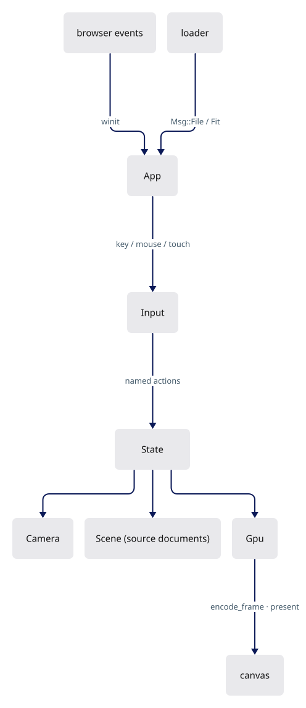

Part B adds picking: an integer ID pass, a bounded readback window, and a generation check so a late answer never selects against a newer camera.

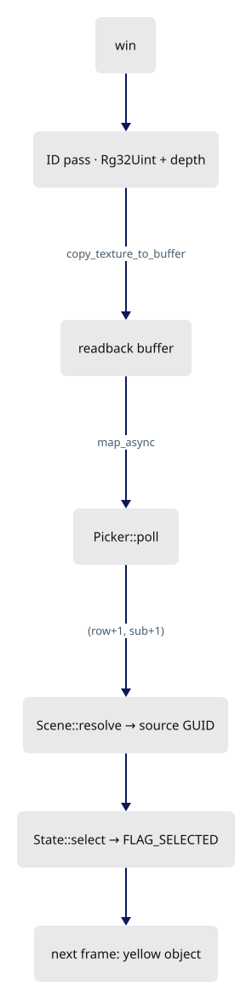


## Starting point

- Checkpoint 11: the `Tutorial` facade in `lib.rs` drives every lane through a JavaScript page; text renders.
- After this lesson `Tutorial` and `src/fixture.rs` are gone. The production `App`, `State`, `Scene`, `Input` and `Picker` take their place.

Install the binary interaction fixture and the supplied native harness file first:

<!-- supplied: 12 -->

<!-- step-status: start -->

**Does it compile yet?** `cargo check` passes after steps 1–13, 16 and 17; steps 14 and 15 fail and build again at step 16.

<!-- step-status: end -->

## Part A · Production shell

### Step 1 · Device negotiation

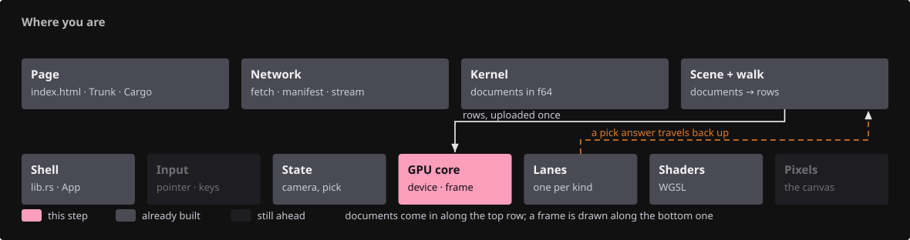{ .locator data-strip="illustrations/strip-54e1511b20.svg" }

- Browser builds use `BROWSER_WEBGPU` only, native test builds the primary backends; one function serves both.

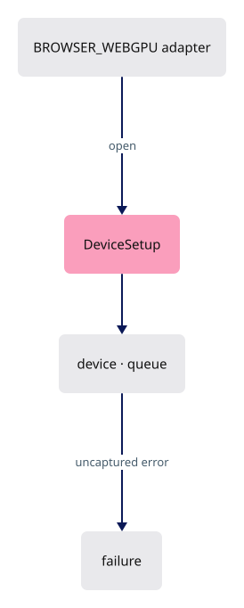

- The browser picks the presentation-compatible adapter; `?gpu=high` asks a hybrid machine for the high-performance one, falling back to the browser's choice if that adapter is refused.

<span class="zone-mark" data-strip="illustrations/strip-54e1511b20.svg" data-zone="GPU core"></span>

<!-- file: 12 session_viewer/src/engine/gpu/device.rs type lines=1-83 -->


<span class="zone-mark" data-strip="illustrations/strip-54e1511b20.svg" data-zone="GPU core"></span>

<!-- file: 12 session_viewer/src/engine/gpu/device.rs type lines=84-116 -->

- Ask for 256 MiB of storage binding where available, not the adapter maximum: the measured point-cloud scene needs 158 MB in one table.
- A 128 MiB device still starts.
- An oversized scene then reports a GPU error, not a silent driver fallback.
- `failure` remembers an uncaptured error or a device loss: both arrive on a callback, not at the call that caused them.
- `State::render` reads it and shows the reload panel instead of drawing garbage.

<span class="zone-mark" data-strip="illustrations/strip-54e1511b20.svg" data-zone="GPU core"></span>

<!-- file: 12 session_viewer/src/engine/gpu/device.rs type lines=117-162 -->

- The surface's capabilities decide the format: the first sRGB one if there is one, so colours are written in the space the browser displays.

Native-only adapter naming and the error callbacks:

<span class="zone-mark" data-strip="illustrations/strip-54e1511b20.svg" data-zone="GPU core"></span>

<!-- file: 12 session_viewer/src/engine/gpu/device.rs copy lines=163-231 -->

### Step 2 · Presenting a frame

{ .locator data-strip="illustrations/strip-54e1511b20.svg" }

- `write_frame_uniforms` runs once per frame: camera matrices, the inside-flag refresh reading the eye just solved, then text placement.
- `present` returns `None` when the surface had no texture; the caller asks for another frame instead of panicking.
- `pick_frame` is the cloud prelude and the ID pass, against the last presented frame's depth: a pick on a still scene costs no colour frame.

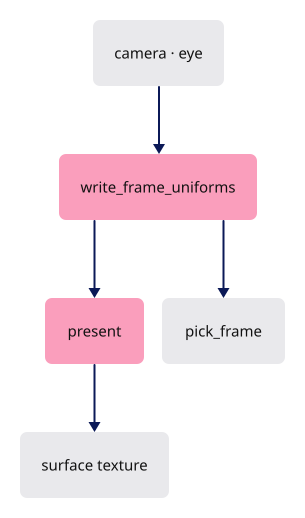

<span class="zone-mark" data-strip="illustrations/strip-54e1511b20.svg" data-zone="GPU core"></span>

<!-- file: 12 session_viewer/src/engine/gpu/present.rs type lines=1-68 -->

<span class="zone-mark" data-strip="illustrations/strip-54e1511b20.svg" data-zone="GPU core"></span>

<!-- file: 12 session_viewer/src/engine/gpu/present.rs type lines=69-85 -->

Offscreen and benchmark paths for native tools:

<span class="zone-mark" data-strip="illustrations/strip-54e1511b20.svg" data-zone="GPU core"></span>

<!-- file: 12 session_viewer/src/engine/gpu/present.rs copy lines=86-183 -->

### Step 3 · The frame list

{ .locator data-strip="illustrations/strip-54e1511b20.svg" }

- Pass order is the contract: physical surfaces write depth; the selection mask and ink read it; the ID pass repeats the same toggles.
- `encode_frame` knows nothing about a surface, so the same list renders headless.

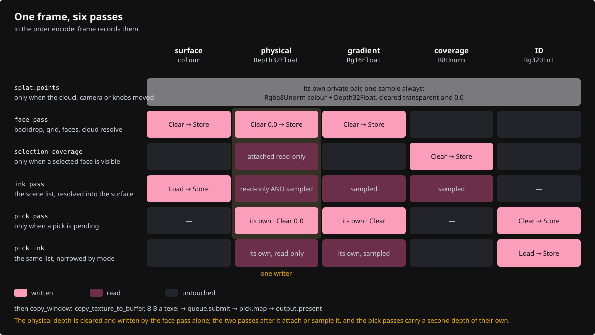

<span class="zone-mark" data-strip="illustrations/strip-54e1511b20.svg" data-zone="GPU core"></span>

<!-- file: 12 session_viewer/src/engine/gpu/render.rs type lines=1-54 -->

<span class="zone-mark" data-strip="illustrations/strip-54e1511b20.svg" data-zone="GPU core"></span>

<!-- file: 12 session_viewer/src/engine/gpu/render.rs type lines=55-123 -->


### Step 4 · Input bindings

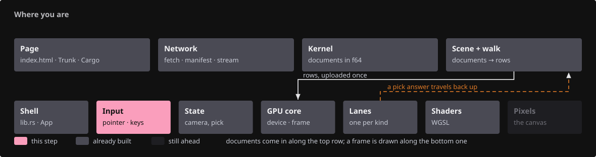{ .locator data-strip="illustrations/strip-25545ebdc0.svg" }

Every handler returns whether a redraw is needed; a click returns `false` — nothing changes until the GPU answers.

| Input | Action |
|---|---|
| Right drag | orbit |
| Middle drag, Ctrl + right drag | pan |
| Wheel | zoom toward the cursor |
| Left click | select / toggle the object |
| Ctrl + left click | select an original edge |
| 1–7 | named views · Space projection · C reset · F fit |
| Q / W / E / D / B | points, lines, mesh edges, lighting, back faces |
| P | x-ray |
| [ / ] | cloud point size |
| H / S | hide the selection / show all |
| T | toggle selected names |
| Escape | leave edge mode, then clear |

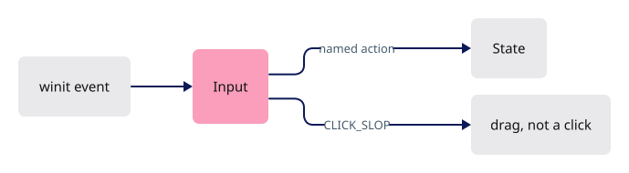

<span class="zone-mark" data-strip="illustrations/strip-25545ebdc0.svg" data-zone="Input"></span>

<!-- file: 12 session_viewer/src/app/input.rs type lines=1-48 -->

<span class="zone-mark" data-strip="illustrations/strip-25545ebdc0.svg" data-zone="Input"></span>

<!-- file: 12 session_viewer/src/app/input.rs type lines=49-82 -->

- `D` flips the headlight (`view.lit`), off by default: a face shows its flat row colour until you ask for shading.
- `P` flips x-ray; from lesson 18 on, zero opacity turns every multi-face solid into edges and vertices.

<span class="zone-mark" data-strip="illustrations/strip-25545ebdc0.svg" data-zone="Input"></span>

<!-- file: 12 session_viewer/src/app/input.rs type lines=83-169 -->

- A press that moved more than `CLICK_SLOP` before release is a drag: a camera gesture never selects on release.

<span class="zone-mark" data-strip="illustrations/strip-25545ebdc0.svg" data-zone="Input"></span>

<!-- file: 12 session_viewer/src/app/input.rs type lines=170-197 -->

- The owned `pointercancel` listener detaches on drop; a forgotten closure would outlive the canvas.

<span class="zone-mark" data-strip="illustrations/strip-25545ebdc0.svg" data-zone="Input"></span>

<!-- file: 12 session_viewer/src/app/input.rs copy lines=198-257 -->

### Step 5 · Touch

{ .locator data-strip="illustrations/strip-25545ebdc0.svg" }

- winit routes `pointerType == "touch"` to `WindowEvent::Touch` only, so fingers never reach the mouse arms.
- Finger travel is divided by the device pixel ratio; otherwise one centimetre of glass orbits three times faster on a DPR 3 phone.
- A lift within 12 px and 300 ms of the landing is a tap: it asks for the same pick a click makes.
- A second tap within 320 ms and 40 px asks for a fit, which needs the scene bounds a layer up.

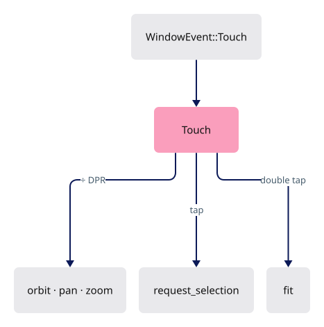

<span class="zone-mark" data-strip="illustrations/strip-25545ebdc0.svg" data-zone="Input"></span>

<!-- file: 12 session_viewer/src/app/touch.rs copy lines=1-68 -->

<span class="zone-mark" data-strip="illustrations/strip-25545ebdc0.svg" data-zone="Input"></span>

<!-- file: 12 session_viewer/src/app/touch.rs type lines=69-138 -->

- `Act` is what the gesture asked for, not what was done: `Fit` needs the scene bounds, and this file may know only the camera.

<span class="zone-mark" data-strip="illustrations/strip-25545ebdc0.svg" data-zone="Input"></span>

<!-- file: 12 session_viewer/src/app/touch.rs copy lines=139-229 -->

### Step 6 · Scene: source documents and row bookkeeping

{ .locator data-strip="illustrations/strip-6f8f40e8fe.svg" }

- `Scene` owns every kernel `Session` plus its placement; the GPU only holds rows.
- A pick returns a row; `Scene::resolve` returns the document and GUID.
- `order` maps row → GUID, `guid_to_row` back; both survive an upload, since rows are forgotten only after `upload_to`.

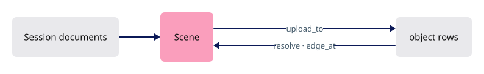

<span class="zone-mark" data-strip="illustrations/strip-6f8f40e8fe.svg" data-zone="Scene + walk"></span>

<!-- file: 12 session_viewer/src/app/scene.rs type lines=1-63 -->

<span class="zone-mark" data-strip="illustrations/strip-6f8f40e8fe.svg" data-zone="Scene + walk"></span>

<!-- file: 12 session_viewer/src/app/scene.rs type lines=64-121 -->

- A reload must not invalidate the `Scene` the application holds: the tables empty in place and row bookkeeping restarts at zero.

<span class="zone-mark" data-strip="illustrations/strip-6f8f40e8fe.svg" data-zone="Scene + walk"></span>

<!-- file: 12 session_viewer/src/app/scene.rs type lines=122-180 -->

- One object row per GUID, in the kernel's canonical order; a GUID keeps its row for a whole revision.

<span class="zone-mark" data-strip="illustrations/strip-6f8f40e8fe.svg" data-zone="Scene + walk"></span>

<!-- file: 12 session_viewer/src/app/scene.rs type lines=181-203 -->


<span class="zone-mark" data-strip="illustrations/strip-6f8f40e8fe.svg" data-zone="Scene + walk"></span>

<!-- file: 12 session_viewer/src/app/scene.rs type lines=204-268 -->

- Streamed clouds have no kernel object; their slot records the absolute row point 0 landed on.

<span class="zone-mark" data-strip="illustrations/strip-6f8f40e8fe.svg" data-zone="Scene + walk"></span>

<!-- file: 12 session_viewer/src/app/scene.rs type lines=269-330 -->

- A streamed cloud grows: each slice appends to the same row range and uploads only its new points, never rebuilding what is on the GPU.

<span class="zone-mark" data-strip="illustrations/strip-6f8f40e8fe.svg" data-zone="Scene + walk"></span>

<!-- file: 12 session_viewer/src/app/scene.rs type lines=331-345 -->

- Row → identity in both directions; `edge_at` reads the segment sub-ID tag bit set by the ribbon shader.

<span class="zone-mark" data-strip="illustrations/strip-6f8f40e8fe.svg" data-zone="Scene + walk"></span>

<!-- file: 12 session_viewer/src/app/scene.rs type lines=346-409 -->

- An edge answer goes back through the retained producer records; one that cannot be named is refused, not guessed.

<span class="zone-mark" data-strip="illustrations/strip-6f8f40e8fe.svg" data-zone="Scene + walk"></span>

<!-- file: 12 session_viewer/src/app/scene.rs type lines=410-487 -->

### Step 7 · Selection mode

{ .locator data-strip="illustrations/strip-6f8f40e8fe.svg" }

Exactly one parent owns a specialized selection; `escape` returns that parent so it stays highlighted.

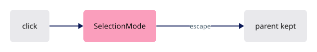

<span class="zone-mark" data-strip="illustrations/strip-6f8f40e8fe.svg" data-zone="Scene + walk"></span>

<!-- file: 12 session_viewer/src/app/selection.rs type -->

### Step 8 · Producers for clouds, frames and points

{ .locator data-strip="illustrations/strip-6f8f40e8fe.svg" }

The walk gains three producers so every kernel geometry type has a lane.

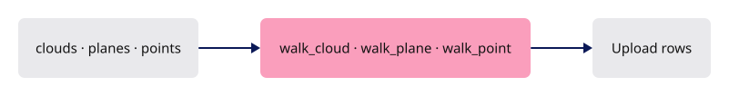

<span class="zone-mark" data-strip="illustrations/strip-6f8f40e8fe.svg" data-zone="Scene + walk"></span>

<!-- file: 12 session_viewer/src/app/walk/cloud.rs type lines=1-48 -->

- Normals are read only when every point has one: a partly-normalled cloud would shade inconsistently, and no per-point flag says which.

<span class="zone-mark" data-strip="illustrations/strip-6f8f40e8fe.svg" data-zone="Scene + walk"></span>

<!-- file: 12 session_viewer/src/app/walk/cloud.rs type lines=49-81 -->

- The file's octree is rewritten into this cloud's own row and node numbering, so one lane holds many clouds without colliding node indices.

<span class="zone-mark" data-strip="illustrations/strip-6f8f40e8fe.svg" data-zone="Scene + walk"></span>

<!-- file: 12 session_viewer/src/app/walk/cloud.rs type lines=82-128 -->

<span class="zone-mark" data-strip="illustrations/strip-6f8f40e8fe.svg" data-zone="Scene + walk"></span>

<!-- file: 12 session_viewer/src/app/walk/cloud.rs type lines=129-183 -->

- A streamed cloud is only partly present: spacing is measured over the nodes complete within the points received.
- Discs sized from a node still arriving would flicker as it fills.

<span class="zone-mark" data-strip="illustrations/strip-6f8f40e8fe.svg" data-zone="Scene + walk"></span>

<!-- file: 12 session_viewer/src/app/walk/cloud.rs type lines=184-221 -->

<span class="zone-mark" data-strip="illustrations/strip-6f8f40e8fe.svg" data-zone="Scene + walk"></span>

<!-- file: 12 session_viewer/src/app/walk/frames.rs type -->

- A plane becomes a one-metre square, a box its twelve edges, both in the flat ribbon lane: a construction plane is drawn, not shaded.

<span class="zone-mark" data-strip="illustrations/strip-6f8f40e8fe.svg" data-zone="Scene + walk"></span>

<!-- file: 12 session_viewer/src/app/walk/points.rs type -->

- The smallest producer in the viewer: one dot, no topology, no facing cull — the shape every producer has.

### Step 9 · Stream records, feedback, inspection and the fixture loader

{ .locator data-strip="illustrations/strip-1f4315efb0.svg" }

- `stream.rs` holds the wire-layout records of a streamed cloud.
- `feedback` writes `textContent`, never HTML.
- `inspection` publishes a read-only JSON snapshot on `?inspect=1`; it is how the checkpoint is observed.
- `loader` decodes the bundled fixture and posts `Msg::File` then `Msg::Fit`.

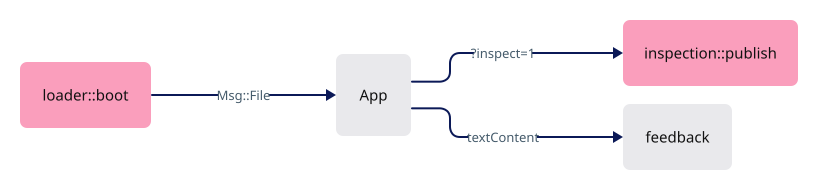

<span class="zone-mark" data-strip="illustrations/strip-2c1e2b3b5e.svg" data-zone="Network"></span>

<!-- file: 12 session_viewer/src/app/stream.rs type -->

<span class="zone-mark" data-strip="illustrations/strip-56723afb3a.svg" data-zone="Shell"></span>

<!-- file: 12 session_viewer/src/app/feedback.rs type -->

- Text can come from a document or a server; neither may write markup into the page.

<span class="zone-mark" data-strip="illustrations/strip-56723afb3a.svg" data-zone="Shell"></span>

<!-- file: 12 session_viewer/src/app/inspection.rs copy -->

<span class="zone-mark" data-strip="illustrations/strip-2c1e2b3b5e.svg" data-zone="Network"></span>

<!-- file: 12 session_viewer/src/app/loader.rs type -->

- A one-file fixture loader, so the shell has something to load; lesson 14 replaces it.

<!-- check: 12 -->

The new modules are not declared yet, so the crate still builds unchanged.

## Part B · Picking

### Step 10 · The ID target and the readback window

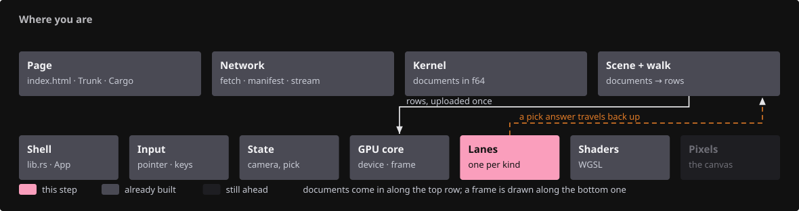{ .locator data-strip="illustrations/strip-ccdfd9e2ff.svg" }

```text
Rust                                                    WGSL (already in the lanes)
IdTargets.id : Rg32Uint                            ↔   fs_id(...) -> vec2<u32>
   .x = object row + 1, .y = sub-object id + 1         triangle: (inst_id + 1, 0)
   0 = background                                       ribbon:   (inst_id + 1, segment + 1 | 0x80000000)
IdTargets.depth : Depth32Float, cleared to 0       ↔   reversed depth, compare Greater
copy_texture_to_buffer(window)  →  readback buffer  →  map_async  →  poll
```

- The pass is scissored to a window about the cursor; only that window is copied out.
- The vertex work stays, the fill does not.
- `ROW_BYTES` is the copy pitch rounded to the required alignment.

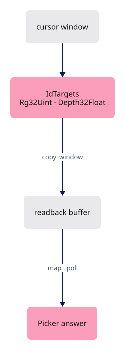

<span class="zone-mark" data-strip="illustrations/strip-ccdfd9e2ff.svg" data-zone="Lanes"></span>

<!-- file: 12 session_viewer/src/engine/gpu/pick.rs type lines=1-62 -->

- The tolerance is a circle in framebuffer pixels, at least one pixel wide: a click is a point, the intent a neighbourhood — the same physical size on every display.

<span class="zone-mark" data-strip="illustrations/strip-ccdfd9e2ff.svg" data-zone="Lanes"></span>

<!-- file: 12 session_viewer/src/engine/gpu/pick.rs type lines=63-85 -->

- `generation` counts requests; `submitted` records which generation the in-flight copy belongs to. A camera move bumps `generation`, so the answer is discarded when it lands.

<span class="zone-mark" data-strip="illustrations/strip-ccdfd9e2ff.svg" data-zone="Lanes"></span>

<!-- file: 12 session_viewer/src/engine/gpu/pick.rs type lines=86-147 -->

<span class="zone-mark" data-strip="illustrations/strip-ccdfd9e2ff.svg" data-zone="Lanes"></span>

<!-- file: 12 session_viewer/src/engine/gpu/pick.rs type lines=148-206 -->

- One function computes the window's bounds, used by both the scissor and the copy: two computations that must agree are one computation used twice.

<span class="zone-mark" data-strip="illustrations/strip-ccdfd9e2ff.svg" data-zone="Lanes"></span>

<!-- file: 12 session_viewer/src/engine/gpu/pick.rs type lines=207-225 -->

- The ID targets are made on the first pick and kept until the canvas resizes.

<span class="zone-mark" data-strip="illustrations/strip-ccdfd9e2ff.svg" data-zone="Lanes"></span>

<!-- file: 12 session_viewer/src/engine/gpu/pick.rs type lines=226-312 -->

- The ID pass gets the colour frame's gradient attachment — the third target the figure above labels *metadata* — so ink decides its own visibility from it.
- Without it, a stroke would be pickable exactly where it is invisible.

<span class="zone-mark" data-strip="illustrations/strip-ccdfd9e2ff.svg" data-zone="Lanes"></span>

<!-- file: 12 session_viewer/src/engine/gpu/pick.rs type lines=313-353 -->

<span class="zone-mark" data-strip="illustrations/strip-ccdfd9e2ff.svg" data-zone="Lanes"></span>

<!-- file: 12 session_viewer/src/engine/gpu/pick.rs type lines=354-398 -->

- The native census captures the unchanged ID pass: the hidden-line tests judge visibility against exact object numbers, not pixels.

<span class="zone-mark" data-strip="illustrations/strip-ccdfd9e2ff.svg" data-zone="Lanes"></span>

<!-- file: 12 session_viewer/src/engine/gpu/pick.rs type lines=399-442 -->

- `map` must run after the submit and only once per copy; `poll` reads the mapped bytes on a later frame.
- Ink beats a face anywhere in the window; among equals the nearest to the cursor wins, so a curve across a face stays selectable.

<span class="zone-mark" data-strip="illustrations/strip-ccdfd9e2ff.svg" data-zone="Lanes"></span>

<!-- file: 12 session_viewer/src/engine/gpu/pick.rs type lines=443-491 -->

<span class="zone-mark" data-strip="illustrations/strip-ccdfd9e2ff.svg" data-zone="Lanes"></span>

<!-- file: 12 session_viewer/src/engine/gpu/pick.rs type lines=492-555 -->


<span class="zone-mark" data-strip="illustrations/strip-ccdfd9e2ff.svg" data-zone="Lanes"></span>

<!-- file: 12 session_viewer/src/engine/gpu/pick.rs copy lines=556-635 -->

### Step 11 · The ID pass in the frame list

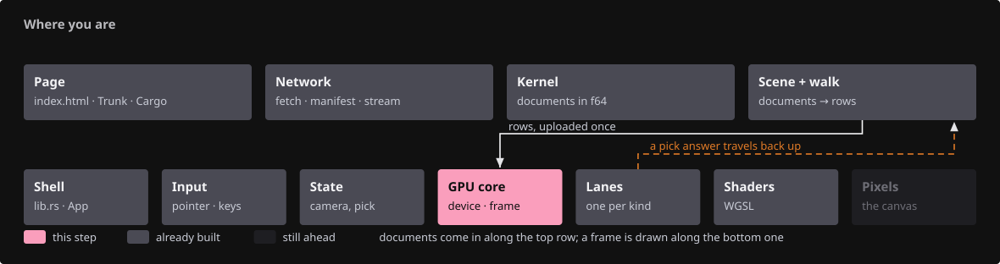{ .locator data-strip="illustrations/strip-68dea8ec67.svg" }

- Same toggles, same order as the colour list: what a lane hides it cannot pick.
- Edge mode draws only source-edge IDs; object mode draws faces, then ink with ink-first precedence.

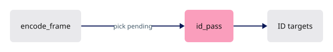

<span class="zone-mark" data-strip="illustrations/strip-68dea8ec67.svg" data-zone="GPU core"></span>

<!-- file: 12 session_viewer/src/engine/gpu/render.rs type lines=124-196 -->

### Step 12 · Selected-surface silhouette

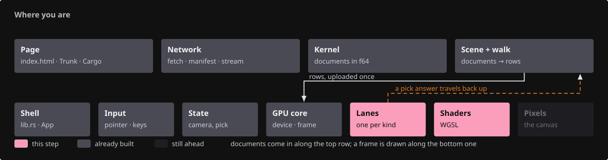{ .locator data-strip="illustrations/strip-aff484c5a8.svg" }

- A visible selected surface writes an R8 coverage mask against the frame's depth; a fullscreen pass darkens the ring just outside it.

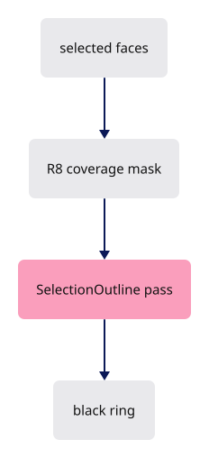

<span class="zone-mark" data-strip="illustrations/strip-ccdfd9e2ff.svg" data-zone="Lanes"></span>

<!-- file: 12 session_viewer/src/engine/gpu/selection_outline.rs type lines=1-74 -->

- Coverage is allocated with the first selected row and released with the last: an unselected scene pays nothing.

<span class="zone-mark" data-strip="illustrations/strip-ccdfd9e2ff.svg" data-zone="Lanes"></span>

<!-- file: 12 session_viewer/src/engine/gpu/selection_outline.rs type lines=75-98 -->

<span class="zone-mark" data-strip="illustrations/strip-ccdfd9e2ff.svg" data-zone="Lanes"></span>

<!-- file: 12 session_viewer/src/engine/gpu/selection_outline.rs type lines=99-165 -->

- `prepare` also answers whether there is anything to draw: the cheapest version of this feature is the one switched off.

<span class="zone-mark" data-strip="illustrations/strip-ccdfd9e2ff.svg" data-zone="Lanes"></span>

<!-- file: 12 session_viewer/src/engine/gpu/selection_outline.rs type lines=166-229 -->

- The compositing pipeline is built for the pass's own colour format and sample count, so a sample-count flip rebuilds it; it cannot be chosen once at start-up.

<span class="zone-mark" data-strip="illustrations/strip-ccdfd9e2ff.svg" data-zone="Lanes"></span>

<!-- file: 12 session_viewer/src/engine/gpu/selection_outline.rs type lines=230-244 -->

<span class="zone-mark" data-strip="illustrations/strip-ccdfd9e2ff.svg" data-zone="Lanes"></span>

<!-- file: 12 session_viewer/src/engine/gpu/selection_outline.rs copy lines=245-341 -->

```text
Rust bind group 0                          WGSL
binding 0: mask texture view (R8Unorm)  ↔  @group(0) @binding(0) var mask: texture_2d<f32>
binding 1: uniform [radius, 0, 0, 0]    ↔  @group(0) @binding(1) var<uniform> radius: vec4<f32>
```

<span class="zone-mark" data-strip="illustrations/strip-093d035257.svg" data-zone="Shaders"></span>

<!-- file: 12 session_viewer/src/shaders/selection_outline.wgsl type -->

<!-- check: 12 -->


## Part C · Wiring

### Step 13 · State

{ .locator data-strip="illustrations/strip-0fc6abc083.svg" }

- `needs_frame` demands another frame; `dirty` says the picture changed.
- A pending pick sets the first without the second.
- `touch` cancels any pick in flight: the camera or scene it was asked against no longer exists.

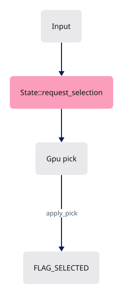

<span class="zone-mark" data-strip="illustrations/strip-0fc6abc083.svg" data-zone="State"></span>

<!-- file: 12 session_viewer/src/state.rs type lines=1-45 -->

<span class="zone-mark" data-strip="illustrations/strip-0fc6abc083.svg" data-zone="State"></span>

<!-- file: 12 session_viewer/src/state.rs type lines=46-106 -->

- Streamed clouds and sheets arrive in slices: an add makes the row, an extend appends.
- `State` is the only place that knows a slice belongs to an object already on screen.

<span class="zone-mark" data-strip="illustrations/strip-0fc6abc083.svg" data-zone="State"></span>

<!-- file: 12 session_viewer/src/state.rs type lines=107-161 -->

- A resize is forwarded, not handled: the camera needs the new aspect, the GPU new attachments.
- Driving both from one place keeps them from disagreeing for a frame.

<span class="zone-mark" data-strip="illustrations/strip-0fc6abc083.svg" data-zone="State"></span>

<!-- file: 12 session_viewer/src/state.rs type lines=162-188 -->

- Each ends by telling the GPU and asking for a frame: `State` is the only place that knows both sides.

<span class="zone-mark" data-strip="illustrations/strip-0fc6abc083.svg" data-zone="State"></span>

<!-- file: 12 session_viewer/src/state.rs type lines=189-207 -->

- `toggle_xray` is a view change, not a scene change: `view.opacity` goes between `1.0` and `0.0`, and `touch` schedules a frame.
- The shaders read the zero; no row is rewritten.
- `select` clears controls and edge highlight before moving the flag, so no lane keeps a stale parent.

<span class="zone-mark" data-strip="illustrations/strip-0fc6abc083.svg" data-zone="State"></span>

<!-- file: 12 session_viewer/src/state.rs type lines=208-262 -->

- `apply_pick`: an edge answer needs `Scene::edge_at`; an object answer toggles the row.

<span class="zone-mark" data-strip="illustrations/strip-0fc6abc083.svg" data-zone="State"></span>

<!-- file: 12 session_viewer/src/state.rs type lines=263-316 -->

- `render` applies a returned pick first, so the same frame presents its highlight; a pick on a still scene runs alone through `pick_frame`.

<span class="zone-mark" data-strip="illustrations/strip-0fc6abc083.svg" data-zone="State"></span>

<!-- file: 12 session_viewer/src/state.rs type lines=317-380 -->

- `request_selection` configures the tolerance in CSS pixels times the actual logical-to-physical scale, then records the request.

<span class="zone-mark" data-strip="illustrations/strip-0fc6abc083.svg" data-zone="State"></span>

<!-- file: 12 session_viewer/src/state.rs type lines=381-430 -->

Document titles and the selected name are derived labels; they have no source row and cannot intercept a click.

<span class="zone-mark" data-strip="illustrations/strip-0fc6abc083.svg" data-zone="State"></span>

<!-- file: 12 session_viewer/src/state.rs type lines=431-484 -->

<span class="zone-mark" data-strip="illustrations/strip-0fc6abc083.svg" data-zone="State"></span>

<!-- file: 12 session_viewer/src/state.rs copy lines=485-510 -->

### Step 14 · Gpu owns device, presentation and picking

{ .locator data-strip="illustrations/strip-68dea8ec67.svg" }

- The surface becomes optional so the same `Gpu` renders headless.
- `controls` and `control_net` are second glyph and segment lanes for source control markers.
- `set_selected` and `set_hidden` flip one row's flag; hiding also invalidates the cloud records.
- The lane list is the drawing architecture: each lane owns its buffers, pipelines and draws, nothing outside it touches them, and `Gpu` only holds them and calls them in order. A new kind of thing on screen is a new field here, not a new path through the frame.

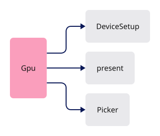

<span class="zone-mark" data-strip="illustrations/strip-68dea8ec67.svg" data-zone="GPU core"></span>

<!-- file: 12 session_viewer/src/engine/gpu/mod.rs type -->

### Step 15 · Declare the modules

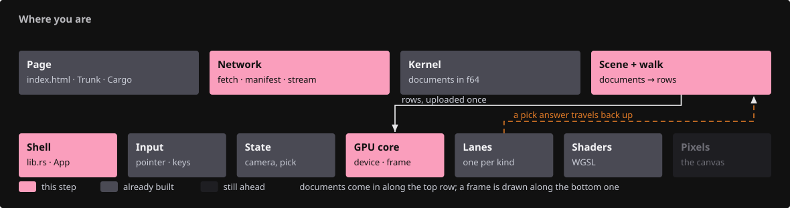{ .locator data-strip="illustrations/strip-67b44a8375.svg" }

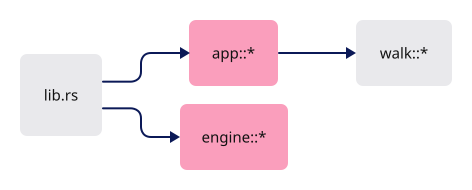

<span class="zone-mark" data-strip="illustrations/strip-68dea8ec67.svg" data-zone="GPU core"></span>

<!-- file: 12 session_viewer/src/engine/mod.rs type -->

<span class="zone-mark" data-strip="illustrations/strip-56723afb3a.svg" data-zone="Shell"></span>

<!-- file: 12 session_viewer/src/app/mod.rs type -->

- Append the dispatcher at the end of the walk module, then replace its header with the lane-table borrow and the new declarations.

<span class="zone-mark" data-strip="illustrations/strip-6f8f40e8fe.svg" data-zone="Scene + walk"></span>

<!-- file: 12 session_viewer/src/app/walk/mod.rs type hunks=2-2 -->

<span class="zone-mark" data-strip="illustrations/strip-6f8f40e8fe.svg" data-zone="Scene + walk"></span>

<!-- file: 12 session_viewer/src/app/walk/mod.rs type hunks=1-1 -->

- The dispatcher: one arm per kernel geometry type, each handed only the lane tables it writes. Nothing here knows what a file is.

<span class="zone-mark" data-strip="illustrations/strip-2c1e2b3b5e.svg" data-zone="Network"></span>

<!-- file: 12 session_viewer/src/app/route.rs type -->

- The routing policy is still two lessons away.

### Step 16 · The application shell

{ .locator data-strip="illustrations/strip-56723afb3a.svg" }

- `Msg` is every asynchronous message the loader can post; `Ready` carries the `State` built around an empty scene.
- `request_if_needed` is the one place a frame is asked for.
- `run_web` is the wasm entry: the panic hook, then the app, unless the page is the text-quality fixture, which owns its own canvas.
- `viewer_focused` gates keys on the canvas holding browser focus, so typing in a page control never orbits the camera.
- `page_hidden` stops asking for frames in a background tab, and winit resumes when it is visible again.
- `desired_canvas_size` is the CSS size times the device pixel ratio: the framebuffer follows the display, not the layout.

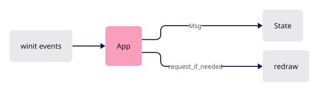

<span class="zone-mark" data-strip="illustrations/strip-56723afb3a.svg" data-zone="Shell"></span>

<!-- file: 12 session_viewer/src/lib.rs type whole lines=1-35 -->

<span class="zone-mark" data-strip="illustrations/strip-56723afb3a.svg" data-zone="Shell"></span>

<!-- file: 12 session_viewer/src/lib.rs type whole lines=36-92 -->


<span class="zone-mark" data-strip="illustrations/strip-56723afb3a.svg" data-zone="Shell"></span>

<!-- file: 12 session_viewer/src/lib.rs type whole lines=93-157 -->

- The window handler keeps only redraw and resize.
- Keys and the mouse go to `Input`; the shell never decides what a gesture means.

<span class="zone-mark" data-strip="illustrations/strip-56723afb3a.svg" data-zone="Shell"></span>

<!-- file: 12 session_viewer/src/lib.rs type whole lines=158-194 -->

<span class="zone-mark" data-strip="illustrations/strip-56723afb3a.svg" data-zone="Shell"></span>

<!-- file: 12 session_viewer/src/lib.rs copy whole lines=195-258 -->

### Step 17 · Page, manifest and the removed teaching fixture

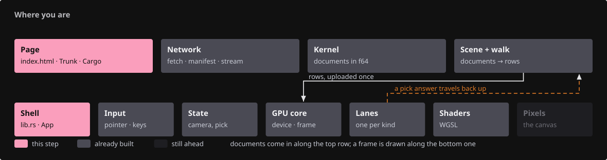{ .locator data-strip="illustrations/strip-7794a17bda.svg" }

- The page is one canvas, a status line and a hidden error panel.
- `touch-action: none` on the canvas hands every gesture to winit before the browser claims it as a scroll.
- `#viewer-docs` is the documentation corner: a black folded triangle, top right, drawn from the borders of a zero-size anchor; it opens `docs/` in a new tab.
- Hover or keyboard focus grows it, a page corner lifting; it covers nothing but itself.
- It opens `docs/`, which is empty until lesson 14 publishes the built course into the bundle.

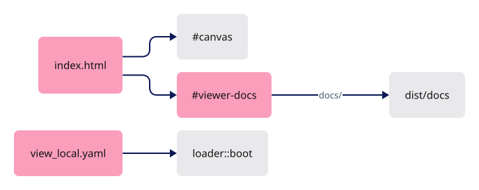

<span class="zone-mark" data-strip="illustrations/strip-e6f4fee67c.svg" data-zone="Page"></span>

<!-- file: 12 session_viewer/index.html copy -->

<span class="zone-mark" data-strip="illustrations/strip-e6f4fee67c.svg" data-zone="Page"></span>

<!-- file: 12 session_viewer/assets/view_local.yaml copy -->

<span class="zone-mark" data-strip="illustrations/strip-56723afb3a.svg" data-zone="Shell"></span>

<!-- file: 12 session_viewer/src/fixture.rs -->

- The first check that compiles the new modules: the two inside Parts A and B ran while they were still undeclared.
- `Tutorial` and the teaching fixture are gone.

<!-- check: 12 -->

## Check

<!-- checkpoint: 12 -->

Expected:

- The seven-object fixture loads: mesh, line, polyline, curve, surface, BRep and cloud.
- Click each one: it turns yellow; click again: it clears.
- Ctrl + click a mesh or BRep edge: that source edge highlights.
- Right-drag to orbit, then release without moving and click: only a still click selects.
- Orbit while a click is pending: the late answer is discarded, nothing wrong gets selected.

If an object highlights but the status names another GUID, the row → identity map is wrong; fix `Scene`, not the shader colour.


## What changed

<!-- tree: 12 session_viewer/src -->

- `Tutorial` and `src/fixture.rs` are removed; `App` → `Input` → `State` → `Gpu` is the production ownership chain.
- Data flow for a click: CSS pixel → physical window → ID pass → readback → `Pick { row, sub }` → `Scene::resolve` → `State::select` → `FLAG_SELECTED` → yellow.

**Production equivalent:** `src/lib.rs`, `src/state.rs`, `src/app/{input,touch,scene,selection}.rs`, `src/engine/gpu/{device,present,render,pick}.rs`; production draws the selection ring from `src/engine/gpu/surface_outline.rs`.

## Try

- Click the empty background: the selection clears, because the ID pass wrote 0 there.
- Press the left button on the BRep, drag more than `CLICK_SLOP` (4 logical pixels) and release: nothing is selected, because a release outside the slop is a drag, not a click.
- Raise `PICK_RADIUS` in `pick.rs` and click just beside the curve: the nearest ID inside the window wins, so the curve is selected from further away.
- Hover the black corner at the top right: it grows. It opens `dist/docs`, which is empty until lesson 14 builds the course into it.
- Make `Picker::poll` skip its `submitted != generation` comparison and orbit while a click is pending: a late answer selects against the new camera — the bug the check prevents.

## Questions and answers


**Picking renders the scene again into an integer target instead of intersecting a ray with the geometry on the CPU. Argue for that choice.**

*How to work it out.* Write down everything that decides whether a pixel shows an object: the depth test, the ink visibility rule, hidden flags, x-ray discards, the finite-triangle test, text placement, the LOD the cloud chose this frame. Now ask a CPU ray-caster to reproduce all of it. Every rule you forget is a place where the click disagrees with the picture.

*The answer.* The GPU already knows what is on screen, so ask it. Rendering the same draws with `fs_id` instead of `fs_main` keeps picture and pick from drifting apart by construction. The cost is a GPU round-trip, so the pass is scissored to a small window around the cursor and read back asynchronously.

**What is `generation` for, and what breaks without it?**

*How to work it out.* A pick's answer arrives some frames after the request. In between the camera can move or the scene can be replaced, and the answer then describes a picture that no longer exists.

*The answer.* `generation` counts requests and `submitted` records which generation the in-flight copy belongs to; a camera move bumps the counter, so a late answer is discarded. Without it, a click selects whatever was under that pixel before you orbited away. Every asynchronous answer in this viewer carries a generation for the same reason.

**`needs_frame` and `dirty` sound like the same flag. Why are they two?**

*How to work it out.* Find a case where one is true and the other is not. A pick is in flight: you must render again to poll the readback, but nothing about the picture has changed. Now the converse: the scene changed but you are already going to draw.

*The answer.* `needs_frame` means "ask for another frame"; `dirty` means "the picture changed". Conflating them gives you either a pick that never completes, or a canvas that redraws forever.

**In the pick window, ink beats a face anywhere; among equals the nearest to the cursor wins. Why not simply take the nearest ID?**

*How to work it out.* Count pixels. A curve lying on a face covers a few pixels in the window; the face covers nearly all of them. Nearest-wins returns the face almost every time, and edges become nearly unclickable — not what the user meant by clicking on a line.

*The answer.* The rule encodes intent rather than pixel counts — the tolerance a CAD user expects. The window is sized in CSS pixels and scaled, so the feel is the same on any display.

**What you should be able to do now**

List the frame's passes in order with what each reads and writes: backdrop and faces write colour, depth and gradient; the selection mask reads depth and writes coverage; ink reads depth and gradient and writes colour; the ID pass repeats the same draws and toggles into an integer target. Then say why the ID pass must repeat the same toggles: what a lane hides it must also not pick, or the user can select something they cannot see. Lessons 13 to 20 add to this list; they do not change it.

## Next

[13 · Source controls](13-controls.md): F10 shows original vertices and control points, and streamed clouds answer from every source page.
