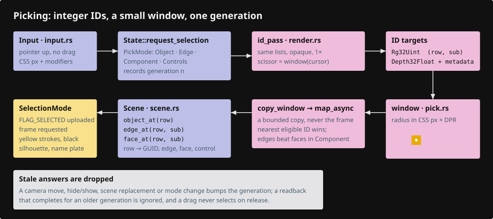

# 12 · The viewer shell and picking

**Estimated study time: about 55–110 hours.** Includes reading, typing, tracing, testing and experiments. [How to use this estimate](map.md#time-estimates).

**This section:** Connect browser events, redraw requests and asynchronous picking.

**In the whole viewer:** The shell now links the user to application state and the renderer. Scene startup is connected in step 14.

**Follow the data:** Pointer event → state request → GPU ID pass → source lookup → selection and redraw.

**Start with these files:** [`src/lib.rs`](12-picking.md#code-12-002), [`src/state.rs`](12-picking.md#code-12-037), [`src/engine/gpu/pick.rs`](12-picking.md#code-12-028).

**Aim to explain:** Why must an old pick result be rejected after the camera or scene changes?

[Whole-viewer map and course milestones](map.md)

To pick an object, we draw identifiers into a hidden image. A mouse position selects one of its pixels. The CPU cannot read GPU memory immediately: it requests a mapping, waits for completion, copies the useful bytes, then unmaps the buffer.



Start from the working result of [step 11](11-text-rendering.md).

**One buildable step:** type the additions below in `workspace/handwritten`, then build and test. This step adds 5,255 lines across 23 files and may take several sittings. Individual listings are parts of this step, not separate build checkpoints.

<span id="code-12-001"></span>

## `index.html`

Insert **after line 196** of your current file.

Keep these preceding lines:

```html
    app/route.rs; their manifests and geometry are fetched from the configured data host. -->
    <link data-trunk rel="copy-dir" href="assets/pb" data-target-path="pb"/>
    <!-- The ONE local manifest. Every other scene is opened from the R2 bucket with
    ?scene=scenes/view_<name>.yaml and is never copied into dist. -->
```

Keep these following lines:

```html
    <div id="viewer-error" role="alert" hidden>
      <p id="viewer-error-message"></p>
      <button type="button" onclick="location.reload()">Reload viewer</button>
    </div>
```

Type these new lines:

```html
--8<-- "typing/code/12-001.html"
```

<span id="code-12-002"></span>

## `src/lib.rs`

Insert **after line 12** of your current file.

Keep these preceding lines:

```rust
pub fn run_web() -> Result<(), wasm_bindgen::JsValue> {
    // a panic then prints its message to the browser console instead of a bare `unreachable`
    console_error_panic_hook::set_once();
    engine::performance::mark("wasm entry"); // a named point on the browser's performance timeline; register:frame
```

Keep these following lines:

```rust
    Ok(())
}

// `macro_rules!` makes a macro, code that writes code; it must come before the `mod` lines that use it.
```

Type these new lines:

```rust
--8<-- "typing/code/12-002.rs"
```

<span id="code-12-003"></span>

## `src/lib.rs`

Append **after line 35** of your current file.

Blank lines before: **1**; after: **0**. End with a newline.

```rust
--8<-- "typing/code/12-003.rs"
```

<span id="code-12-004"></span>

## `assets/view_local.yaml`

This short YAML file points to a small box scene. The model bytes are a data asset, while this manifest is configuration you type. The loader resolves the listed file and publishes its objects.

Create this file. Type the complete listing, including comments and blank lines.

```yaml
--8<-- "typing/code/12-004.yaml"
```

<span id="code-12-005"></span>

## `src/app/feedback.rs`

Create this file. Type the complete listing, including comments and blank lines.

```rust
--8<-- "typing/code/12-005.rs"
```

<span id="code-12-006"></span>

## `src/app/gesture/mod.rs`

A pointer movement means different things after clicking a handle, a control point or an object. A gesture records what began and keeps that interpretation until commit or cancel. Switching interpretation midway can move the wrong thing.

Create this file. Type the complete listing, including comments and blank lines.

Blank lines before: **1**; after: **0**. End with a newline.

```rust
--8<-- "typing/code/12-006.rs"
```

<span id="code-12-007"></span>

## `src/app/input.rs`

Raw pointer and keyboard events arrive before we know their meaning. Input routing considers focus, active tools, modifiers and panels. One physical event should not accidentally trigger both UI and scene editing.

Create this file. Type the complete listing, including comments and blank lines.

```rust
--8<-- "typing/code/12-007.rs"
```

<span id="code-12-008"></span>

## `src/app/inspection.rs`

Create this file. Type the complete listing, including comments and blank lines.

```rust
--8<-- "typing/code/12-008.rs"
```

<span id="code-12-009"></span>

## `src/app/keys.rs`

Create this file. Type the complete listing, including comments and blank lines.

```rust
--8<-- "typing/code/12-009.rs"
```

<span id="code-12-010"></span>

## `src/app/mod.rs`

Insert **after line 2** of your current file.

Keep these preceding lines:

```rust
// `pub mod x;` makes src/app/x.rs part of the crate; each lesson adds the one line of the module it teaches.
// `#[cfg(target_arch = "wasm32")]` above a line compiles that module for the browser only.
```

Keep these following lines:

```rust
pub mod knobs; // register:knobs
pub mod walk; // register:walk
```

Type these new lines:

```rust
--8<-- "typing/code/12-010.rs"
```

<span id="code-12-011"></span>

## `src/app/mod.rs`

Insert **after line 9** of your current file.

Keep these preceding lines:

```rust
#[cfg(any(target_arch = "wasm32", test))] // register:inspection
pub mod inspection; // register:inspection
pub mod keys; // register:keys
pub mod knobs; // register:knobs
```

Keep these following lines:

```rust
pub mod walk; // register:walk
```

Type these new lines:

```rust
--8<-- "typing/code/12-011.rs"
```

<span id="code-12-012"></span>

## `src/app/route.rs`

Create this file. Type the complete listing, including comments and blank lines.

```rust
--8<-- "typing/code/12-012.rs"
```

<span id="code-12-013"></span>

## `src/app/scene.rs`

The scene connects source objects, display rows and resource ownership. These are related but not interchangeable. One source object may create several rows, and a row is not a durable document identifier.

Create this file. Type the complete listing, including comments and blank lines.

```rust
--8<-- "typing/code/12-013.rs"
```

<span id="code-12-014"></span>

## `src/app/scene_rows.rs`

Create this file. Type the complete listing, including comments and blank lines.

```rust
--8<-- "typing/code/12-014.rs"
```

<span id="code-12-015"></span>

## `src/app/selection.rs`

Selection is a set of identities, not a colour painted onto the model. Highlighting is a consequence of that set. Add, replace and clear operations have different meanings, especially with modifier keys.

Create this file. Type the complete listing, including comments and blank lines.

```rust
--8<-- "typing/code/12-015.rs"
```

<span id="code-12-016"></span>

## `src/app/touch.rs`

Touch input has identities and can involve several contacts at once. A one-finger action and a two-finger camera gesture need distinct state. Browser scrolling must not steal a gesture after the viewer has started handling it.

Create this file. Type the complete listing, including comments and blank lines.

```rust
--8<-- "typing/code/12-016.rs"
```

<span id="code-12-017"></span>

## `src/engine/gpu/mod.rs`

Insert **after line 19** of your current file.

Keep these preceding lines:

```rust

pub mod lane; // register:lane
pub mod pass; // register:pass
pub(crate) mod patch; // register:patch
```

Keep these following lines:

```rust
pub mod present; // register:present
pub mod render; // register:render
pub mod segments; // register:segments
pub mod splat; // register:splat
```

Type these new lines:

```rust
--8<-- "typing/code/12-017.rs"
```

<span id="code-12-018"></span>

## `src/engine/gpu/mod.rs`

Insert **after line 47** of your current file.

Keep these preceding lines:

```rust
use lane::{Lane, RowLane};
use objects::InkScene; // register:ink
use objects::InstanceTable;
use pass::Pass;
```

Keep these following lines:

```rust
use segments::SegmentLane; // register:strokes
use splat::Splat; // register:clouds
use targets::Targets;
```

Type these new lines:

```rust
--8<-- "typing/code/12-018.rs"
```

<span id="code-12-019"></span>

## `src/engine/gpu/mod.rs`

Insert **after line 57** of your current file.

Keep these preceding lines:

```rust
pub use frame::FrameInput;
pub use glyphs::GlyphPoint; // register:markers
pub use instance::Instance;
pub use objects::{ObjectRow, Rebase};
```

Keep these following lines:

```rust
pub use segments::CylinderSegment; // register:strokes
pub use upload::Upload;
pub use view::View;
```

Type these new lines:

```rust
--8<-- "typing/code/12-019.rs"
```

<span id="code-12-020"></span>

## `src/engine/gpu/mod.rs`

Insert **after line 76** of your current file.

Keep these preceding lines:

```rust
    pub backdrop: BackdropLane,                  // background and grid
    pub arena: ArenaLane,                        // meshes; register:meshes
    pub segments: SegmentLane,                   // lines; register:strokes
    pub glyphs: GlyphLane,                       // markers and dots; register:markers
```

Keep these following lines:

```rust
    pub text: text::TextLane,                    // labels; register:text
    pub selection_revision: u64,                 // bumps on every selection change
    pub logical_size: [f64; 2],                  // canvas size in CSS pixels
    pub cloud: CloudLane,                        // point cloud buffers; register:clouds
```

Type these new lines:

```rust
--8<-- "typing/code/12-020.rs"
```

<span id="code-12-021"></span>

## `src/engine/gpu/mod.rs`

Insert **after line 87** of your current file.

Keep these preceding lines:

```rust
    passes: Vec<Box<dyn Pass>>,                  // passes from pass::PASSES, in frame order
    dead: patch::Counts, // editable rows retired and not yet reclaimed; register:patch
    dead_points: u32,    // cloud points retired and not yet reclaimed; register:clouds
    pub splat: Splat,    // point cloud drawing; register:clouds
```

Keep these following lines:

```rust
    pub performance: Performance, // frame timing
    pub bounds: AABB,                     // world box of everything uploaded
    device_type: wgpu::DeviceType,        // discrete, integrated or CPU
    pub failure: std::sync::Arc<std::sync::Mutex<Option<String>>>, // first GPU error
```

Type these new lines:

```rust
--8<-- "typing/code/12-021.rs"
```

<span id="code-12-022"></span>

## `src/engine/gpu/mod.rs`

Insert **after line 105** of your current file.

Keep these preceding lines:

```rust
            backdrop,          // register:backdrop
            arena,             // register:meshes
            segments,          // register:strokes
            glyphs,            // register:markers
```

Keep these following lines:

```rust
            text,              // register:text
            cloud,             // register:clouds
            splat,             // register:clouds
        )
```

Type these new lines:

```rust
--8<-- "typing/code/12-022.rs"
```

<span id="code-12-023"></span>

## `src/engine/gpu/mod.rs`

Insert **after line 110** of your current file.

Keep these preceding lines:

```rust
            control_net,       // register:shell
            text,              // register:text
            cloud,             // register:clouds
            splat,             // register:clouds
```

Keep these following lines:

```rust
        )
    };
}
```

Type these new lines:

```rust
--8<-- "typing/code/12-023.rs"
```

<span id="code-12-024"></span>

## `src/engine/gpu/mod.rs`

Insert **after line 195** of your current file.

Keep these preceding lines:

```rust
        let objects = InstanceTable::new(&ctx, &layouts);
        let backdrop = BackdropLane::new(&ctx, &layouts, target);
        let segments = SegmentLane::new(&ctx, &layouts, target); // register:strokes
        let glyphs = GlyphLane::new(&ctx, &layouts, target); // register:markers
```

Keep these following lines:

```rust
        let text = text::TextLane::new(&ctx, target); // register:text
        let cloud = CloudLane::new(&ctx); // register:clouds
        let splat = Splat::new(&ctx, &layouts, target, cloud.buffers()); // register:clouds
        // each registered lane builds itself through its `make` function
```

Type these new lines:

```rust
--8<-- "typing/code/12-024.rs"
```

<span id="code-12-025"></span>

## `src/engine/gpu/mod.rs`

Insert **after line 227** of your current file.

Keep these preceding lines:

```rust
            backdrop,
            arena,       // register:meshes
            segments,    // register:strokes
            glyphs,      // register:markers
```

Keep these following lines:

```rust
            text,        // register:text
            selection_revision: 0,
            logical_size: [size.0 as f64, size.1 as f64],
            cloud, // register:clouds
```

Type these new lines:

```rust
--8<-- "typing/code/12-025.rs"
```

<span id="code-12-026"></span>

## `src/engine/gpu/mod.rs`

Insert **after line 238** of your current file.

Keep these preceding lines:

```rust
            passes,
            dead: patch::Counts::default(), // register:patch
            dead_points: 0,                 // register:clouds
            splat,                          // register:clouds
```

Keep these following lines:

```rust
            performance: Performance::new(),
            bounds: AABB::empty(),
            device_type,
            failure,
```

Type these new lines:

```rust
--8<-- "typing/code/12-026.rs"
```

<span id="code-12-027"></span>

## `src/engine/gpu/mod.rs`

Insert **after line 352** of your current file.

Keep these preceding lines:

```rust
        }

        self.retarget(true);
        self.splat.resize(); // register:clouds
```

Keep these following lines:

```rust
    }

    /// Forget every row; keep the buffers.
    pub fn reset(&mut self) {
```

Type these new lines:

```rust
--8<-- "typing/code/12-027.rs"
```

<span id="code-12-028"></span>

## `src/engine/gpu/pick.rs`

A pick render writes object identifiers instead of display colours. Readback returns the identifier under the pointer. This must use the same camera and visibility rules as drawing, or it can select something the user cannot see.

Create this file. Type the complete listing, including comments and blank lines.

```rust
--8<-- "typing/code/12-028.rs"
```

<span id="code-12-029"></span>

## `src/engine/gpu/present.rs`

Insert **after line 57** of your current file.

Keep these preceding lines:

```rust
        let encode_ms = crate::engine::performance::now_ms() - t0;
        // submit: the GPU starts on the recorded commands while the CPU moves on
        self.ctx.queue.submit([encoder.finish()]);
        // start reading back any pick copied this frame
```

Keep these following lines:

```rust
        output.present();

        // startup marks; the GPU-side one also times the pipelines the first frames compiled
        let mut geometry = false;
```

Type these new lines:

```rust
--8<-- "typing/code/12-029.rs"
```

<span id="code-12-030"></span>

## `src/engine/gpu/present.rs`

Insert **after line 135** of your current file.

Keep these preceding lines:

```rust
            },
        );

        self.ctx.queue.submit([encoder.finish()]);
```

Keep these following lines:

```rust
        log::info!("headless frame: {draws} draws, {objects} objects, {w}x{h}");

        let slice = readback.slice(..);
        // wait for the copy to land on the CPU
```

Type these new lines:

```rust
--8<-- "typing/code/12-030.rs"
```

<span id="code-12-031"></span>

## `src/engine/gpu/present.rs`

Append **after line 178** of your current file.

Blank lines before: **1**; after: **0**. End with a newline.

```rust
--8<-- "typing/code/12-031.rs"
```

<span id="code-12-032"></span>

## `src/engine/gpu/render.rs`

Insert **after line 32** of your current file.

Keep these preceding lines:

```rust
        let mut draws = self.face_passes(encoder, &frame);
        // pass 2: ambient occlusion and the outline masks, each pass in turn
        self.each_pass(|pass, g| draws += pass.after_faces(g, encoder, &frame));
        draws += self.ink_pass(encoder, view); // pass 3: lines, markers, outlines and text; register:ink
```

Keep these following lines:

```rust
        (draws, self.objects.len())
    }

    /// The first pass: each pass's own face passes, then the one the faces draw in.
```

Type these new lines:

```rust
--8<-- "typing/code/12-032.rs"
```

<span id="code-12-033"></span>

## `src/engine/gpu/render.rs`

Insert **after line 121** of your current file.

Keep these preceding lines:

```rust

        draws += self.sphere_draws(pass, &b); // register:markers
        draws += self.arena.draw_text(pass, &basic);
        draws += self.dot_draws(pass, &b); // register:markers
```

Keep these following lines:

```rust
        draws += self.text.draw(pass); // register:text
        draws
    }
}
```

Type these new lines:

```rust
--8<-- "typing/code/12-033.rs"
```

<span id="code-12-034"></span>

## `src/engine/gpu/render.rs`

Append **after line 177** of your current file.

Blank lines before: **1**; after: **0**. End with a newline.

```rust
--8<-- "typing/code/12-034.rs"
```

<span id="code-12-035"></span>

## `src/engine/gpu/text_outline.rs`

Append **after line 131** of your current file.

Blank lines before: **1**; after: **0**. End with a newline.

```rust
--8<-- "typing/code/12-035.rs"
```

<span id="code-12-036"></span>

## `src/engine/gpu/vectors.rs`

Append **after line 868** of your current file.

Blank lines before: **1**; after: **0**. End with a newline.

```rust
--8<-- "typing/code/12-036.rs"
```

<span id="code-12-037"></span>

## `src/state.rs`

The state layer joins document operations, active interaction and renderer updates. It should coordinate the work rather than duplicate the geometry algorithms. Pay attention to which operation requests a redraw and which commits a history change.

Create this file. Type the complete listing, including comments and blank lines.

```rust
--8<-- "typing/code/12-037.rs"
```

<span id="code-12-038"></span>

## `src/state/features.rs`

Create this file. Type the complete listing, including comments and blank lines.

```rust
--8<-- "typing/code/12-038.rs"
```

<span id="code-12-039"></span>

## `tests/selection.cjs`

A test sets up a known state, performs an action and checks an observable result. Browser tests must wait for actual application readiness rather than assuming a fixed delay is enough. Keep fixtures and external dataset requirements explicit.

Create this file. Type the complete listing, including comments and blank lines.

```javascript
--8<-- "typing/code/12-039.cjs"
```

## Check the completed chapter

From `session_viewer`, compare everything you have typed:

```sh
npm --prefix ../session_tests run course -- reference-check 12
```

From `workspace/handwritten`:

```sh
cargo build --lib --locked -j4
cargo xtest --lib --locked -j4
```

Run the native picking tests. In the readback test you typed, identify the pixel whose stored row ID becomes the selected object. The browser window exists at this checkpoint, but its asynchronous GPU startup is connected in lesson 14. Save the visible click experiment for that lesson.

If picks drift horizontally, check pixel coordinates and row stride. If mapping hangs, check that the device is polled in the native readback path.

**Before moving on:** explain what changed, check the expected result above, and fix any build or test failure.

<details>
<summary>Check your explanation of the opening question</summary>

Its pixel and object mapping describe an earlier state. Applying it to the current state could select the wrong source object.

</details>

[Next step: 13](13-controls.md)
