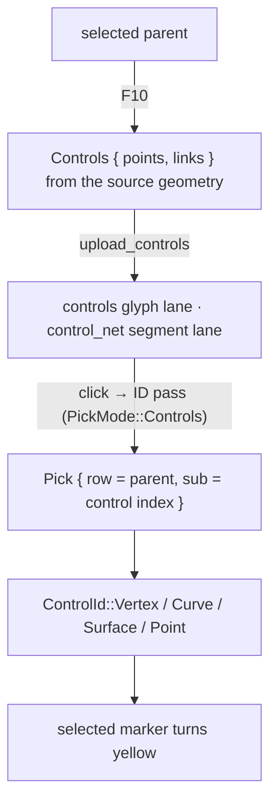
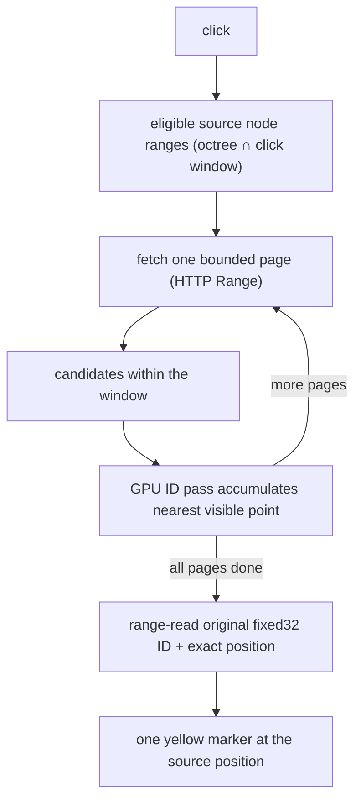
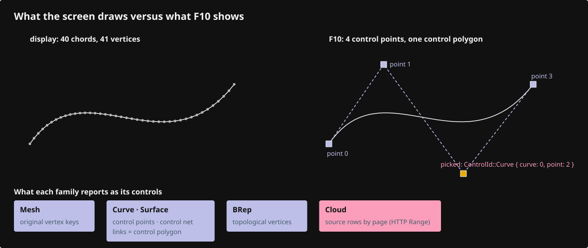
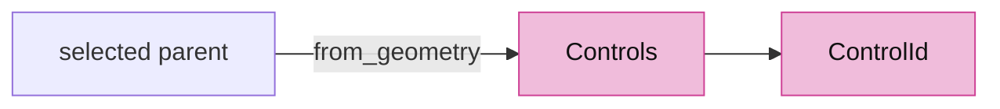
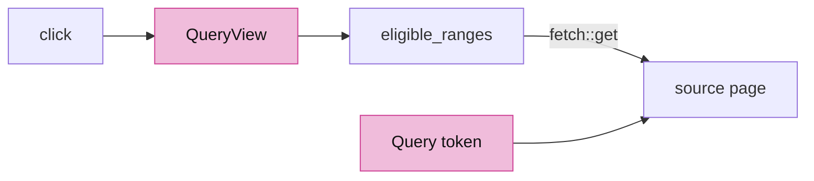
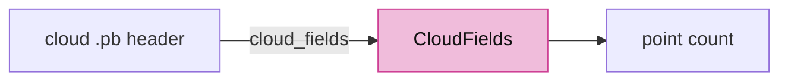
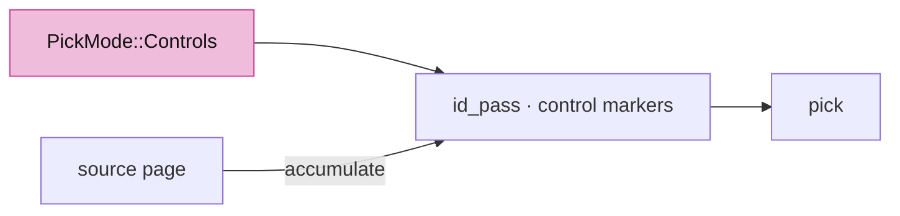
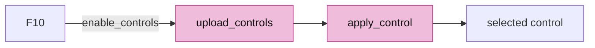
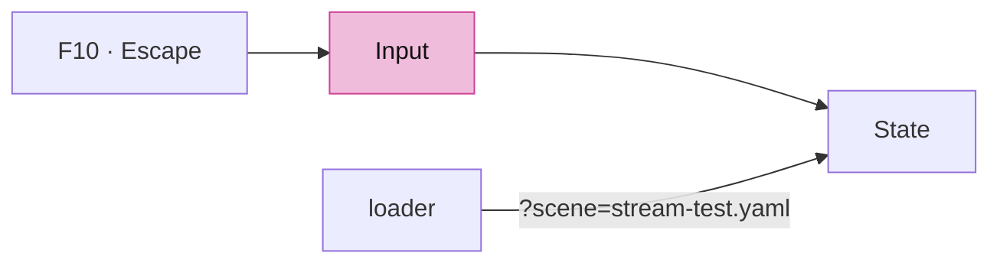

# 13 · Source controls

## You are building

Streamed clouds display a bounded prefix, so a click must ask the source, not the screen:

## Starting point

- Checkpoint 12: clicks select objects and edges. `Gpu` already owns empty `controls` and `control_net` lanes.
- A display vertex is not a control: a curve draws hundreds of chords from a few control points. F10 must show the original ones.

## Step 1 · Control identities

- `ControlId` names a control within its parent's source geometry; the GPU slot it was uploaded to is temporary.
- `enable_controls` is idempotent: pressing F10 on the same parent does nothing, so markers are never duplicated.

<!-- file: 13 session_viewer/src/app/selection.rs type hunks=1 -->

- `Controls::from_geometry` reads real source data: mesh vertex keys, BRep vertices, curve and surface control nets with their links. Tessellation vertices are never substituted.

<!-- file: 13 session_viewer/src/app/selection.rs type hunks=2 -->

## Step 2 · Fetching and source-query records

These two modules are new and undeclared, so the crate still builds after them.

- `fetch::get` refuses a `200` answer to a `Range` request: that would be the whole file.
- Every request owns a deadline; dropping it clears the timer.

<!-- file: 13 session_viewer/src/app/fetch.rs type lines=1-121 -->

<!-- file: 13 session_viewer/src/app/fetch.rs copy lines=122-158 -->

<!-- file: 13 session_viewer/src/app/fetch.rs copy lines=159-214 -->

- `QueryView` freezes the click's projection; every page is tested against the same matrix and pixel window.
- A cube crossing the eye plane cannot be excluded, so `intersects` returns true for it.

<!-- file: 13 session_viewer/src/app/cloud_query.rs type lines=1-124 -->

- `eligible_ranges` walks every octree node, resident or not, and falls back to a full bounded scan when the node table does not cover all rows.

<!-- file: 13 session_viewer/src/app/cloud_query.rs type lines=125-195 -->

- `Query` owns the cancellation token; superseding input drops the query and every callback in flight checks the token before posting.

<!-- file: 13 session_viewer/src/app/cloud_query.rs type lines=196-270 -->

<!-- file: 13 session_viewer/src/app/cloud_query.rs copy lines=271-455 -->

<!-- file: 13 session_viewer/src/app/cloud_query.rs copy lines=456-585 -->

<!-- check: 13 -->

## Step 3 · Wire parsing for streamed clouds

The protobuf headers sit in the first few kilobytes and `coords` is packed, so the point count is known before a byte of payload is read. Mechanical, so copy it.

<!-- file: 13 session_viewer/src/app/stream.rs copy -->

## Step 4 · Picking controls

- `PickMode::Controls` restricts the ID pass to the temporary control markers of one parent.
- A source query keeps the physical depth and accumulates point IDs across pages: the first page clears the IDs, later pages load them.

<!-- file: 13 session_viewer/src/engine/gpu/pick.rs type -->

- Control markers draw after the silhouette; a source-query page draws only source-point IDs and returns before the ordinary ink IDs.

<!-- file: 13 session_viewer/src/engine/gpu/render.rs type -->

## Step 5 · State transitions

- `controls` are the current parent's source controls; `cloud_query` is the in-flight page loop.

<!-- file: 13 session_viewer/src/state.rs type hunks=1-3 -->

- Clearing, resizing, touching and selecting all reset controls; the marker size depends on the logical-to-physical scale, so a resize re-uploads them.

<!-- file: 13 session_viewer/src/state.rs type hunks=4-8 -->

- A control answer is accepted only when its row is still the active parent.

<!-- file: 13 session_viewer/src/state.rs type hunks=9-10 -->

- While a source-query page owns the GPU readback, no colour frame is presented: the candidate page is an ID target, not a picture.

<!-- file: 13 session_viewer/src/state.rs type hunks=11-13 -->

- A click in control mode picks controls; a click on a streamed cloud's controls starts the page loop instead.

<!-- file: 13 session_viewer/src/state.rs type hunks=14 -->

- `enable_controls` reads the source geometry once; a display-only object without source reports that instead of inventing controls.

<!-- file: 13 session_viewer/src/state.rs type hunks=15 -->

- `upload_controls` resets both lanes before appending, which is what makes repeated F10 idempotent.
- `apply_control` decodes the marker's sub-ID tag; a cloud control resolves through the cloud lane's row map.
- The page loop: `start_cloud_query` → `advance_cloud_query` → `cloud_query_batch` (upload candidates as ID targets, request a pick) → `apply_cloud_query_pick` (fold the winner) → next page → `cloud_query_resolved`.

<!-- file: 13 session_viewer/src/state.rs type hunks=16 -->

- The selected name is hidden while controls are shown; the inspection snapshot lists the controls.

<!-- file: 13 session_viewer/src/state.rs type hunks=17-19 -->

## Step 6 · Key, message and loader wiring

<!-- file: 13 session_viewer/src/app/input.rs type -->

<!-- file: 13 session_viewer/src/lib.rs type -->

<!-- file: 13 session_viewer/src/app/mod.rs type -->

<!-- file: 13 session_viewer/src/app/inspection.rs copy -->

- The streamed fixture is opt-in (`?scene=stream-test.yaml`) and reads a bounded display prefix while keeping every source row reachable.

<!-- file: 13 session_viewer/src/app/loader.rs type -->

<!-- file: 13 session_viewer/src/app/scene.rs copy -->

## Check

<!-- checkpoint: 13 -->

Expected:

- Select the curve, press F10: its control points appear as blue markers joined by the control polygon.
- Click a marker: it turns yellow and the status names its `ControlId`.
- Press F10 again: nothing is added.
- Escape: markers disappear, the parent stays selected. Escape again: nothing selected.
- Select the surface and press F10: a control net, not the tessellation grid.

## What changed

<!-- tree: 13 session_viewer/src -->

- `SelectionMode::Controls` joins `Object` and `Edge`; all three keep exactly one parent.
- Data flow: source geometry → `Controls` → temporary marker rows → ID pass → `ControlId`.
- Streamed clouds: click → eligible source ranges → bounded pages → GPU visibility per page → original fixed32 ID.

**Production equivalent:** `src/app/selection.rs`, `src/app/cloud_query.rs`, `src/app/fetch.rs`, `src/app/stream.rs`; the page-loop methods move from `state.rs` into `src/state/cloud_query.rs` in lesson 18.

## Try

- Select the polyline and press F10: every vertex is a control, so the markers sit on the display corners; select the line: two markers.
- With controls shown, drag the window edge to resize: the markers are re-uploaded at the new logical-to-physical scale and keep their size.
- Serve a directory holding a large `cloud.pb` locally and open `?scene=stream-test.yaml&data=http://127.0.0.1:PORT`; select the cloud, press F10 and click a point: the status names an original fixed32 ID that the display prefix never loaded.
- Clear the selection while a page loop is running (Escape twice): the query token is dropped and no late page selects anything.

## Next

[14 · Loading scenes](14-loading.md): manifests, protobuf documents, validation and safe replacement through the real loader.
