# 13 · Source controls

## You are building

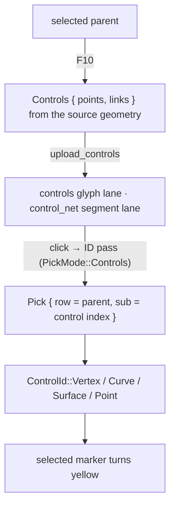

Streamed clouds display a bounded prefix, so a click must ask the source, not the screen:

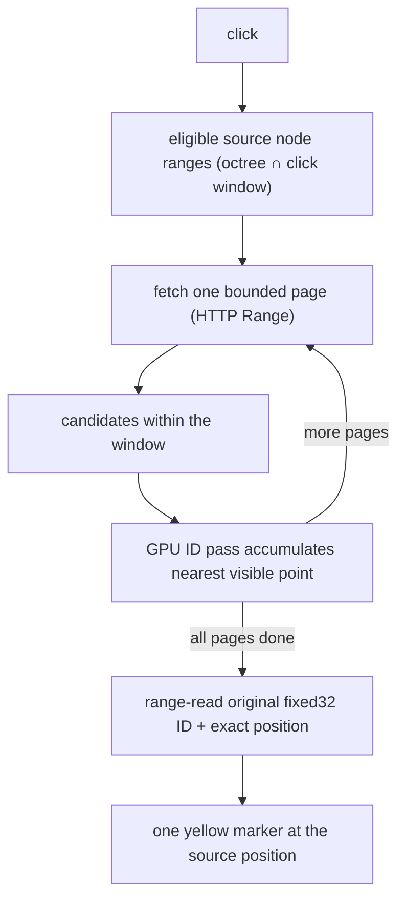

## Starting point

- Checkpoint 12: clicks select objects and edges. `Gpu` already owns empty `controls` and `control_net` lanes.
- A display vertex is not a control: a curve draws hundreds of chords from a few control points. F10 must show the original ones.

<!-- step-status: start -->

**Does it compile yet?** `cargo check` passes after steps 1, 2 and 6, and fails after 3–5: a file is written across several steps, and a check can only pass once its last piece is in. Concretely, steps 3–5 build again at step 6. This is measured at the end of every step rather than guessed. And where a check passes while your new files are not yet named by a `mod` line, it is telling you only that you have not broken the previous checkpoint — the checkpoint build at the end of the lesson is the real test.

<!-- step-status: end -->

## Step 1 · Control identities

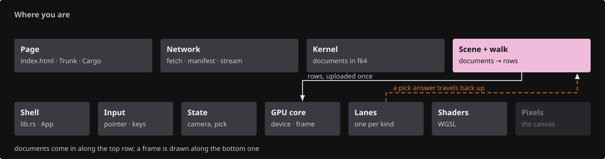{ .locator data-strip="illustrations/strip-90f35de946.svg" }

- `ControlId` names a control within its parent's source geometry; the GPU slot it was uploaded to is temporary.
- `enable_controls` is idempotent: pressing F10 on the same parent does nothing, so markers are never duplicated.

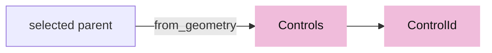

<!-- file: 13 session_viewer/src/app/selection.rs type hunks=1 -->

- `Controls::from_geometry` reads real source data: mesh vertex keys, BRep vertices, curve and surface control nets with their links. Tessellation vertices are never substituted.

<!-- file: 13 session_viewer/src/app/selection.rs type hunks=2 -->

## Step 2 · Fetching and source-query records

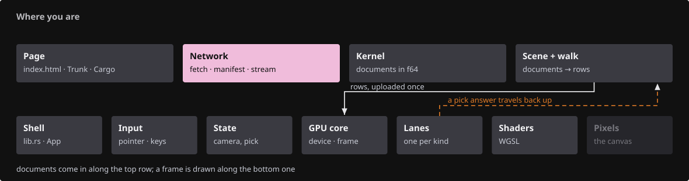{ .locator data-strip="illustrations/strip-5220abe4db.svg" }

These two modules are new and undeclared, so the crate still builds after them.

- `fetch::get` refuses a `200` answer to a `Range` request: that would be the whole file.
- Every request owns a deadline; dropping it clears the timer.

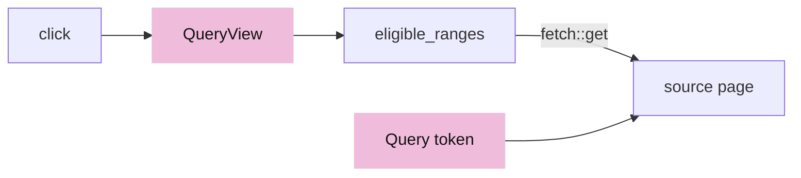

<!-- file: 13 session_viewer/src/app/fetch.rs type lines=1-38 -->

- `get` treats any HTTP status as success and only a network failure as an error, so a 304 or a 404 is something the caller decides about. That is what lets the live source use the same function for a conditional read as the loader uses for a download.

<!-- file: 13 session_viewer/src/app/fetch.rs type lines=39-121 -->

- `content_length` is a HEAD request: the size a whole file would download, before a byte of it is fetched, so a scene can refuse what the device cannot hold.

<!-- file: 13 session_viewer/src/app/fetch.rs copy lines=122-228 -->

<!-- file: 13 session_viewer/src/app/fetch.rs copy lines=229-248 -->

- `QueryView` freezes the click's projection; every page is tested against the same matrix and pixel window.
- A cube crossing the eye plane cannot be excluded, so `intersects` returns true for it.

<!-- file: 13 session_viewer/src/app/cloud_query.rs type lines=1-52 -->

- The cube test is deliberately conservative: a cube crossing the eye plane cannot be excluded by a projected comparison, so it is kept. A source query may look at more nodes than it needed; it must never skip one that held the answer.

<!-- file: 13 session_viewer/src/app/cloud_query.rs type lines=53-92 -->

- A cube whose projection is not finite cannot be excluded safely - the arithmetic that would reject it is the arithmetic that failed - so it is kept and tested the slow way.

<!-- file: 13 session_viewer/src/app/cloud_query.rs type lines=93-124 -->

- `eligible_ranges` walks every octree node, resident or not, and falls back to a full bounded scan when the node table does not cover all rows.

<!-- file: 13 session_viewer/src/app/cloud_query.rs type lines=125-195 -->

- `Query` owns the cancellation token; superseding input drops the query and every callback in flight checks the token before posting.

<!-- file: 13 session_viewer/src/app/cloud_query.rs type lines=196-251 -->

- `Drop` cancels: dropping the query flips its token, and every callback still in flight checks the token before posting. Cancellation is an ownership property rather than a flag someone must remember to set.

<!-- file: 13 session_viewer/src/app/cloud_query.rs type lines=252-270 -->

<!-- file: 13 session_viewer/src/app/cloud_query.rs copy lines=271-368 -->

<!-- file: 13 session_viewer/src/app/cloud_query.rs copy lines=369-556 -->

<!-- check: 13 -->

## Step 3 · Wire parsing for streamed clouds

{ .locator data-strip="illustrations/strip-5220abe4db.svg" }

The protobuf headers sit in the first few kilobytes and `coords` is packed, so the point count is known before a byte of payload is read. Mechanical, so copy it.

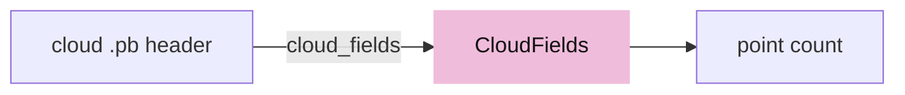

<!-- file: 13 session_viewer/src/app/stream.rs copy -->

## Step 4 · Picking controls

{ .locator data-strip="illustrations/strip-1bf2a655a8.svg" }

- `PickMode::Controls` restricts the ID pass to the temporary control markers of one parent.
- A source query keeps the physical depth and accumulates point IDs across pages: the first page clears the IDs, later pages load them.

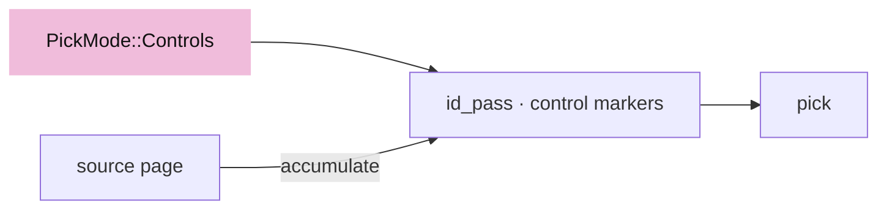

<!-- file: 13 session_viewer/src/engine/gpu/pick.rs type -->

- Control markers draw after the silhouette; a source-query page draws only source-point IDs and returns before the ordinary ink IDs.

<!-- file: 13 session_viewer/src/engine/gpu/render.rs type -->

## Step 5 · State transitions

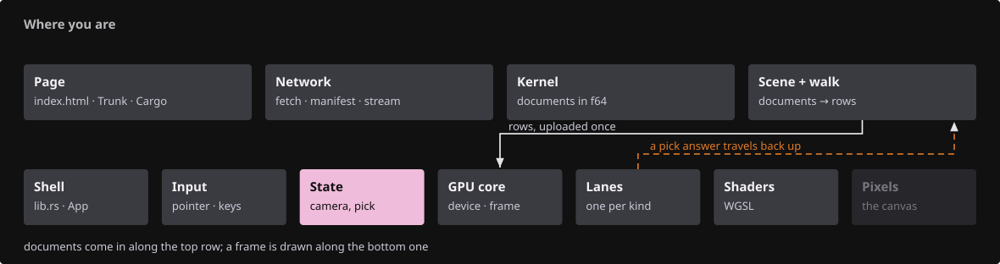{ .locator data-strip="illustrations/strip-61a540a7f7.svg" }

- `controls` are the current parent's source controls; `cloud_query` is the in-flight page loop.

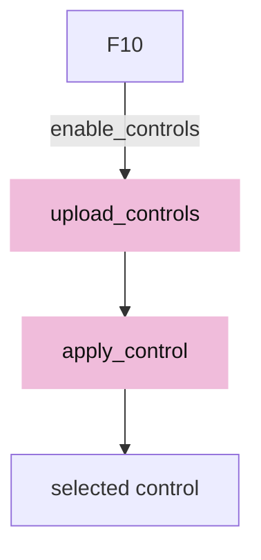

<!-- file: 13 session_viewer/src/state.rs type hunks=1-3 -->

- Clearing, resizing, touching and selecting all reset controls; the marker size depends on the logical-to-physical scale, so a resize re-uploads them.

<!-- file: 13 session_viewer/src/state.rs type hunks=4-8 -->

- A control answer is accepted only when its row is still the active parent.

<!-- file: 13 session_viewer/src/state.rs type hunks=9-10 -->

- While a source-query page owns the GPU readback, no colour frame is presented: the candidate page is an ID target, not a picture.

<!-- file: 13 session_viewer/src/state.rs type hunks=11-13 -->

- A click in control mode picks controls; a click on a streamed cloud's controls starts the page loop instead.

<!-- file: 13 session_viewer/src/state.rs type hunks=14-14 -->

- `enable_controls` reads the source geometry once; a display-only object without source reports that instead of inventing controls.

<!-- file: 13 session_viewer/src/state.rs type hunks=15-15 -->

- `upload_controls` resets both lanes before appending, which is what makes repeated F10 idempotent.
- `apply_control` decodes the marker's sub-ID tag; a cloud control resolves through the cloud lane's row map.
- The page loop: `start_cloud_query` → `advance_cloud_query` → `cloud_query_batch` (upload candidates as ID targets, request a pick) → `apply_cloud_query_pick` (fold the winner) → next page → `cloud_query_resolved`.

<!-- file: 13 session_viewer/src/state.rs type hunks=16-16 -->

- The selected name is hidden while controls are shown; the inspection snapshot lists the controls.

<!-- file: 13 session_viewer/src/state.rs type hunks=17-19 -->

## Step 6 · Key, message and loader wiring

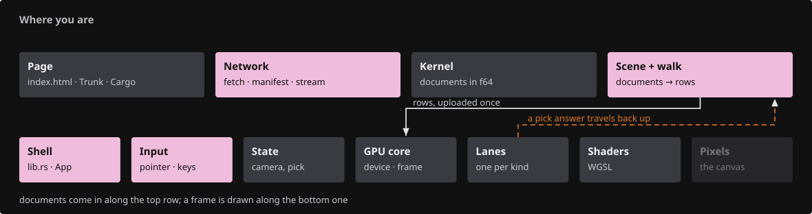{ .locator data-strip="illustrations/strip-98fb0cca6f.svg" }

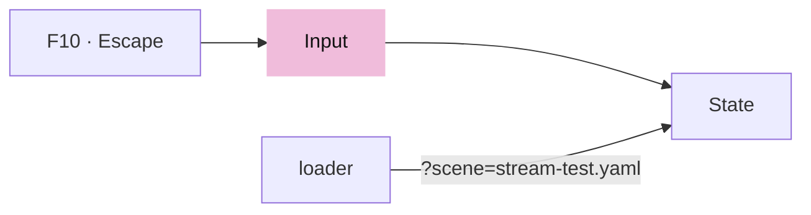

<!-- file: 13 session_viewer/src/app/input.rs type -->

<!-- file: 13 session_viewer/src/lib.rs type -->

- Two additions, both `Msg`: one more asynchronous answer the event loop has to route. Adding a feature that talks to the network is exactly this shape.

<!-- file: 13 session_viewer/src/app/mod.rs type -->

- Two modules: `cloud_query`, the page loop, and `fetch`, the first code in the viewer that talks to a server. The comment is honest about the boundary - loading is still local until lesson 14.

<!-- file: 13 session_viewer/src/app/inspection.rs copy -->

- The streamed fixture is opt-in (`?scene=stream-test.yaml`) and reads a bounded display prefix while keeping every source row reachable.

<!-- file: 13 session_viewer/src/app/loader.rs type -->

<!-- file: 13 session_viewer/src/app/scene.rs copy -->

## Check

<!-- checkpoint: 13 -->

Expected:

- Select the curve, press F10: its control points appear as blue markers joined by the control polygon.
- Click a marker: it turns yellow and the status names its `ControlId`.
- Press F10 again: nothing is added.
- Escape: markers disappear, the parent stays selected. Escape again: nothing selected.
- Select the surface and press F10: a control net, not the tessellation grid.

## What changed

<!-- tree: 13 session_viewer/src -->

- `SelectionMode::Controls` joins `Object` and `Edge`; all three keep exactly one parent.
- Data flow: source geometry → `Controls` → temporary marker rows → ID pass → `ControlId`.
- Streamed clouds: click → eligible source ranges → bounded pages → GPU visibility per page → original fixed32 ID.

**Production equivalent:** `src/app/selection.rs`, `src/app/cloud_query.rs`, `src/app/fetch.rs`, `src/app/stream.rs`; production keeps the page-loop methods in `src/state/cloud_query.rs`.

## Try

- Select the polyline and press F10: every vertex is a control, so the markers sit on the display corners; select the line: two markers.
- With controls shown, drag the window edge to resize: the markers are re-uploaded at the new logical-to-physical scale and keep their size.
- Select a NURBS curve and press F10, then compare the marker count with the number of chords you can see: the markers are the control net the document carries, not the samples the tessellator chose.
- Press F10 on an object with no source geometry (a document title plate): the status says so instead of inventing controls.
- The streamed path needs a point cloud served over HTTP, which this checkpoint has no fixture for — `?scene=stream-test.yaml` requires a `?data=` base URL holding a large `cloud.pb`, and the course never supplies one. Lesson 15 publishes real scenes; come back to the page loop there if you want to watch it in the network panel.
- Clear the selection while a page loop is running (Escape twice): the query token is dropped and no late page selects anything.

## Questions and answers

**A curve is drawn as hundreds of chords. Why can F10 not just show the vertices that were drawn?**

*How to work it out.* Ask what a display vertex is: a sample chosen by the tessellator at this tolerance. Change the tolerance and there is a different set. Now ask what the user would do with a marker on one — drag it? It corresponds to nothing in the document.

*The answer.* Display vertices are an approximation artefact with no identity and no meaning under editing. `Controls::from_geometry` reads the real control net from the source — a handful of points with links. Same rule as the tessellation seam in lesson 06: never let the display invent an identity.

**`fetch::get` refuses a `200` answer to a `Range` request. Why is that worth a check rather than a trusting read?**

*How to work it out.* Ask what each status code means for the bytes you get back. `206` is the slice you asked for. `200` means the server ignored the range and is sending the whole file — possibly gigabytes to a device that asked for 64 KB. Nothing about that response is an error, so no other layer will object.

*The answer.* The failure is silent until memory runs out, and the check is one comparison. When you ask for less than everything, verify that you got less than everything.

**A streamed cloud displays a bounded prefix, so a click cannot be answered from the screen. What does the viewer do instead?**

*How to work it out.* The points you want may never have been downloaded, so the answer has to come from the source. That means paging, which takes time, during which the camera may move. Ask which camera each page should be tested against.

*The answer.* The click's projection is frozen into a `QueryView`, and every octree node — resident or not — is tested against that same matrix and pixel window while ids accumulate across pages. Freezing matters: with the live camera, later pages would be answering a different question than the first.

**`enable_controls` is idempotent. Name the bug that makes that worth stating explicitly.**

*How to work it out.* Ask what pressing F10 twice would do without it: run the upload again, adding a second set of markers on top of the first. Identical positions, so the screen looks almost the same.

*The answer.* Doubled ink, doubled pick answers and a marker count that grows until you select something else — a failure that is nearly invisible. Idempotence is cheap here and the failure is silent, which is exactly when to write the invariant down.

**What you should be able to do now**

Describe the cancellation story and contrast it with lesson 12's generation counter. Correct: `Query` owns a cancellation token, superseding input drops the query, and every callback checks the token before posting — so a page that arrives after you clicked elsewhere is discarded at the callback. A generation *labels* answers so a stale one can be recognised; a token *cancels* work that is still in flight. You need both: generations cannot stop a fetch, and a token cannot label an answer already on its way back.

## Next

[14 · Loading scenes](14-loading.md): manifests, protobuf documents, validation and safe replacement through the real loader.
