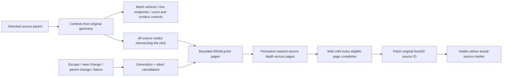

# 13 · F10 controls, complete source queries and cancellation

Start at checkpoint **12** in `/tmp/viewer-course`. Add source control identities and a single-parent F10 mode, including points outside the displayed cloud prefix.



Text equivalent: ordinary source controls are derived from original geometry; streamed clouds search every eligible source range in bounded pages, accumulate physical visibility across pages, and resolve the original ID only after completion. Display residency remains bounded independently.

1. Apply the complete implementation below, then build and exercise the local fixture.

**COPY/PASTE — complete mechanical integration.** [13.patch](reconstruction/patches/13.patch) supplies every file addition, deletion, import, descriptor, field and test listed below; substitute the literal **TYPE BY HAND** blocks for their corresponding changes.

| File | Action / unique anchor |
|---|---|
| `src/app/cloud_query.rs` | create; `complete module` |
| `src/app/fetch.rs` | create; complete file from the patch |
| `src/app/input.rs` | replace; complete file from the patch |
| `src/app/inspection.rs` | replace; complete file from the patch |
| `src/app/loader.rs` | replace; complete file from the patch |
| `src/app/mod.rs` | replace; complete file from the patch |
| `src/app/scene.rs` | replace; complete file from the patch |
| `src/app/selection.rs` | replace; `complete module` |
| `src/app/stream.rs` | replace; `CloudLod::set_field`, `CloudLod::valid`, `CloudLod::valid_node`, `CloudLod::valid_children`, `checked_positions`, `cloud_lod` |
| `src/engine/gpu/pick.rs` | replace; `SourcePhase`, `Picker::start_source_query`, `Picker::begin_source` |
| `src/engine/gpu/render.rs` | replace; `Gpu::id_pass` |
| `src/lib.rs` | replace; complete file from the patch |
| `src/state.rs` | replace; `State::enable_controls`, `State::upload_controls`, `State::apply_control`, `State::start_cloud_query`, `State::advance_cloud_query`, `State::cloud_query_batch`, `State::apply_cloud_query_pick`, `State::cloud_query_resolved`, `State::cancel_cloud_query` |

**COPY/PASTE — message and resource integration.** Apply the complete `src/lib.rs` message/handler additions, `State` fields, `Input::key` F10 arm, `Scene` tests, inspection controls and GPU control-lane calls from the patch; `src/app/loader.rs` retains the event-loop proxy used by asynchronous query delivery.

The local `?scene=stream-test.yaml&data=http://127.0.0.1:PORT/` fixture displays 250,000 points while retaining metadata for all 6,065,539 source rows; its HTTP server synthesizes exact requested ranges without storing a second full cloud.

**TYPE BY HAND — `src/app/selection.rs`: create/replace the complete file.** Mesh controls retain original vertex IDs, standalone curves use their original controls, and BRep controls follow source curve/surface ownership.

```rust
//! Source identities and single-parent selection transitions. GPU rows are only pick addresses.

use session_rust::element::ElementGeometry;
use session_rust::{Geometry, NurbsCurve, NurbsSurface, Point};

/// One original control, identified within its parent's geometry revision.
#[derive(Clone, Copy, Debug, PartialEq, Eq, serde::Serialize)]
pub enum ControlId {
    Vertex(usize),
    Curve { curve: usize, point: usize },
    Surface { surface: usize, u: usize, v: usize },
    Point(u32),
}

/// Exactly one parent owns every specialized selection.
#[derive(Clone, Debug, Default, PartialEq, Eq, serde::Serialize)]
pub enum SelectionMode {
    #[default]
    Object,
    Edge {
        parent: u32,
        edge: u32,
    },
    Controls {
        parent: u32,
        selected: Option<ControlId>,
        cloud: bool,
    },
}

impl SelectionMode {
    /// The specialized parent retained when Escape returns to ordinary selection.
    pub fn parent(&self) -> Option<u32> {
        match self {
            Self::Object => None,
            Self::Edge { parent, .. } | Self::Controls { parent, .. } => Some(*parent),
        }
    }

    /// Replacing the enum clears all old-parent sub-selection atomically.
    pub fn select_edge(&mut self, parent: u32, edge: u32) {
        *self = Self::Edge { parent, edge };
    }

    /// F10 is idempotent. No selected parent leaves the mode unchanged.
    pub fn enable_controls(&mut self, parent: Option<u32>, cloud: bool) -> bool {
        let Some(parent) = parent else { return false };
        if matches!(self, Self::Controls { parent: active, .. } if *active == parent) {
            return false;
        }
        *self = Self::Controls {
            parent,
            selected: None,
            cloud,
        };
        true
    }

    /// Leave the specialized mode and return the parent for ordinary highlighting.
    pub fn escape(&mut self) -> Option<u32> {
        let parent = self.parent();
        *self = Self::Object;
        parent
    }
}

/// Source point positions remain f64 until the control visualization uploads them.
#[derive(Clone, Debug)]
pub struct Control {
    pub id: ControlId,
    pub position: [f64; 3],
}

/// One active parent's controls and control polygon/net; cloud positions stay in their GPU lane.
#[derive(Default)]
pub struct Controls {
    pub points: Vec<Control>,
    pub links: Vec<[usize; 2]>,
    pub cloud: bool,
}

impl Controls {
    /// Keep source IDs even when invalid coordinates make an individual control unavailable.
    fn push(&mut self, id: ControlId, point: &Point) -> Option<usize> {
        let position = [point[0], point[1], point[2]];
        if !position.into_iter().all(f64::is_finite) {
            return None;
        }
        let index = self.points.len();
        self.points.push(Control { id, position });
        Some(index)
    }

    /// Read actual source controls; never replace a control net with tessellation vertices.
    pub fn from_geometry(geometry: &Geometry) -> Self {
        let mut controls = Self::default();
        controls.append_geometry(geometry);
        controls
    }

    /// Dispatch only source data extraction; display and picking policy stay in State.
    fn append_geometry(&mut self, geometry: &Geometry) {
        match geometry {
            Geometry::Mesh(mesh) => self.mesh(mesh),
            Geometry::Line(line) => {
                self.push(ControlId::Vertex(0), &line.start());
                self.push(ControlId::Vertex(1), &line.end());
                if self.points.len() == 2 {
                    self.links.push([0, 1]);
                }
            }
            Geometry::Polyline(polyline) => {
                let mut previous = None;
                for (index, coords) in polyline.coords.chunks_exact(3).enumerate() {
                    let current = self.push(
                        ControlId::Vertex(index),
                        &Point::new(coords[0], coords[1], coords[2]),
                    );
                    if let (Some(start), Some(end)) = (previous, current) {
                        self.links.push([start, end]);
                    }
                    previous = current;
                }
            }
            Geometry::NurbsCurve(curve) => self.curve(curve, 0),
            Geometry::NurbsSurface(surface) => self.surface(surface, 0),
            Geometry::BRep(brep) => self.brep(brep),
            Geometry::PointCloud(_) => self.cloud = true,
            Geometry::Point(point) => {
                self.push(ControlId::Vertex(0), point);
            }
            Geometry::Element(element) => match element.geometry() {
                ElementGeometry::Mesh(mesh) => self.mesh(mesh),
                ElementGeometry::BRep(brep) => self.brep(brep),
                ElementGeometry::None => {}
            },
            Geometry::Plane(_) | Geometry::OBB(_) => {}
        }
    }

    /// Original mesh vertex keys survive GPU vertex splitting and sparse key spaces.
    fn mesh(&mut self, mesh: &session_rust::Mesh) {
        for key in mesh.vertices() {
            if let Some(vertex) = mesh.vertex.get(&key) {
                self.push(
                    ControlId::Vertex(key),
                    &Point::new(vertex.x, vertex.y, vertex.z),
                );
            }
        }
    }

    /// Topological vertices and represented 3D curve/surface nets have distinct ID namespaces.
    fn brep(&mut self, brep: &session_rust::BRep) {
        for (index, vertex) in brep.m_vertices.iter().enumerate() {
            self.push(ControlId::Vertex(index), &vertex.point);
        }
        for (index, curve) in brep.m_curves_3d.iter().enumerate() {
            self.curve(curve, index);
        }
        for (index, surface) in brep.m_surfaces.iter().enumerate() {
            self.surface(surface, index);
        }
    }

    /// Rational curve accessors return Euclidean source control positions.
    fn curve(&mut self, curve: &NurbsCurve, index: usize) {
        let mut previous = None;
        for point in 0..curve.cv_count() {
            let current = match curve.get_cv(point) {
                Some(position) => self.push(
                    ControlId::Curve {
                        curve: index,
                        point,
                    },
                    &position,
                ),
                None => None,
            };
            if let (Some(start), Some(end)) = (previous, current) {
                self.links.push([start, end]);
            }
            previous = current;
        }
    }

    /// Link only actual adjacent controls, preserving their two-dimensional source indices.
    fn surface(&mut self, surface: &NurbsSurface, index: usize) {
        let [width, height] = surface.m_cv_count;
        let mut previous = vec![None; height];
        for u in 0..width {
            let mut last = None;
            for (v, above) in previous.iter_mut().enumerate() {
                let current = match surface.get_cv(u, v) {
                    Some(position) => self.push(
                        ControlId::Surface {
                            surface: index,
                            u,
                            v,
                        },
                        &position,
                    ),
                    None => None,
                };
                if let (Some(start), Some(end)) = (*above, current) {
                    self.links.push([start, end]);
                }
                if let (Some(start), Some(end)) = (last, current) {
                    self.links.push([start, end]);
                }
                *above = current;
                last = current;
            }
        }
    }
}

#[cfg(test)]
mod tests {
    use super::*;

    #[test]
    fn switching_parent_replaces_specialized_selection_and_escape_retains_parent() {
        let mut mode = SelectionMode::default();
        mode.select_edge(4, 17);
        assert!(mode.enable_controls(Some(4), false));
        assert!(!mode.enable_controls(Some(4), false));
        mode.select_edge(9, 3);
        assert_eq!(mode, SelectionMode::Edge { parent: 9, edge: 3 });
        assert_eq!(mode.escape(), Some(9));
        assert_eq!(mode, SelectionMode::Object);
        assert!(!mode.enable_controls(None, false));
    }

    #[test]
    fn line_controls_use_original_endpoints() {
        let geometry = Geometry::Line(session_rust::Line::new(1.0, 2.0, 3.0, 4.0, 5.0, 6.0).into());
        let controls = Controls::from_geometry(&geometry);
        assert_eq!(controls.points.len(), 2);
        assert_eq!(controls.points[1].position, [4.0, 5.0, 6.0]);
        assert_eq!(controls.points[1].id, ControlId::Vertex(1));
        assert_eq!(controls.links, [[0, 1]]);
    }
}
```

**TYPE BY HAND — `src/app/cloud_query.rs`: create/replace the complete file.** This complete query implementation includes conservative node eligibility, uncovered-row fallback, bounded paging, cancellation, revision checks and original fixed32 identity decoding.

```rust
//! Exhaustive source-cloud selection with bounded range reads. The display retains its LOD
//! residency budget; a click examines every intersecting source node, including nonresident
//! nodes. Only one page of candidates exists at a time and visibility stays in the GPU picker.

use super::stream::{CloudFields, CloudLod};
use crate::math::Mat4;
use std::cell::Cell;
use std::ops::Range;
use std::rc::Rc;

/// Coordinates fetched per page (1.5 MiB of wire doubles), independent of cloud size.
pub const PAGE_POINTS: u32 = 65_536;
/// Original point IDs are packed fixed32 (schema field 15), deliberately range-addressable.
pub fn original_id(raw: &[u8]) -> Result<u32, String> {
    let Ok(bytes): Result<[u8; 4], _> = raw.try_into() else {
        return Err("Original point ID range must contain exactly four bytes".to_string());
    };
    Ok(u32::from_le_bytes(bytes))
}

/// The click's immutable projection in source coordinates and physical pixels.
#[derive(Clone)]
pub struct QueryView {
    pub matrix: Mat4,
    pub size: [f64; 2],
    pub at: [u32; 2],
    pub radius: f64,
}
impl QueryView {
    /// Homogeneous source-to-clip projection; division waits until the eye plane is checked.
    fn clip(&self, point: [f64; 3]) -> [f64; 4] {
        let mut clip = [0.0; 4];
        for (row, value) in clip.iter_mut().enumerate() {
            *value = self.matrix[row] * point[0]
                + self.matrix[4 + row] * point[1]
                + self.matrix[8 + row] * point[2]
                + self.matrix[12 + row];
        }
        clip
    }
    /// Pixel center and reversed depth; candidates behind the eye or clip planes are absent.
    pub fn project(&self, point: [f64; 3]) -> Option<[f64; 3]> {
        let p = self.clip(point);
        if invalid_clip(&p) || p[3] <= 0.0 || p[2] < 0.0 || p[2] > p[3] {
            return None;
        }
        Some([
            (p[0] / p[3] + 1.0) * self.size[0] * 0.5,
            (1.0 - p[1] / p[3]) * self.size[1] * 0.5,
            p[2] / p[3],
        ])
    }
    /// A conservative projected cube test. A cube crossing the eye plane must be examined.
    fn intersects(&self, min: [f64; 3], size: f64) -> bool {
        if !size.is_finite() || size < 0.0 || !min.into_iter().all(f64::is_finite) {
            return true;
        }
        let mut corners = [[0.0; 4]; 8];
        for (corner, clip) in corners.iter_mut().enumerate() {
            *clip = self.clip(cube_corner(min, size, corner));
        }
        if corners.iter().any(invalid_clip) {
            return true;
        }
        if corners.iter().all(behind_eye) {
            return false;
        }
        if corners.iter().any(behind_eye) {
            return true;
        }
        if corners.iter().all(beyond_far) || corners.iter().all(beyond_near) {
            return false;
        }
        let mut lo = [f64::INFINITY; 2];
        let mut hi = [f64::NEG_INFINITY; 2];
        for p in corners {
            let xy = [
                (p[0] / p[3] + 1.0) * self.size[0] * 0.5,
                (1.0 - p[1] / p[3]) * self.size[1] * 0.5,
            ];
            grow_pixel_bounds(&mut lo, &mut hi, xy);
        }
        for axis in 0..2 {
            let center = self.at[axis] as f64 + 0.5;
            if lo[axis] > center + self.radius || hi[axis] < center - self.radius {
                return false;
            }
        }
        true
    }
}

/// Nonfinite homogeneous coordinates cannot safely exclude a source cube.
fn invalid_clip(point: &[f64; 4]) -> bool {
    !point.iter().copied().all(f64::is_finite)
}
/// The perspective eye plane separates forward and backward homogeneous coordinates.
fn behind_eye(point: &[f64; 4]) -> bool {
    point[3] <= 0.0
}
/// Reversed-Z far clipping remains at clip z=0.
fn beyond_far(point: &[f64; 4]) -> bool {
    point[2] < 0.0
}
/// Reversed-Z near clipping remains at clip z=w.
fn beyond_near(point: &[f64; 4]) -> bool {
    point[2] > point[3]
}
/// Enumerate a source cube corner without constructing a separate geometry object.
fn cube_corner(min: [f64; 3], size: f64, corner: usize) -> [f64; 3] {
    [
        min[0] + if corner & 1 == 0 { 0.0 } else { size },
        min[1] + if corner & 2 == 0 { 0.0 } else { size },
        min[2] + if corner & 4 == 0 { 0.0 } else { size },
    ]
}
/// Expand both pixel axes; keeping this loop named avoids nesting it in the corner walk.
fn grow_pixel_bounds(lo: &mut [f64; 2], hi: &mut [f64; 2], point: [f64; 2]) {
    for axis in 0..2 {
        lo[axis] = lo[axis].min(point[axis]);
        hi[axis] = hi[axis].max(point[axis]);
    }
}

/// One exact source point; no sampled/local display ID is substituted for `local`.
#[derive(Clone, Debug)]
pub struct Candidate {
    pub local: u32,
    pub position: [f64; 3],
}

/// Source pages advance in file order, independent of octree traversal order.
fn source_range_order(left: &Range<u32>, right: &Range<u32>) -> std::cmp::Ordering {
    left.start.cmp(&right.start)
}

/// Merge overlapping source ranges, preserving every row exactly once.
fn merge(mut ranges: Vec<Range<u32>>) -> Vec<Range<u32>> {
    ranges.sort_unstable_by(source_range_order);
    let mut out: Vec<Range<u32>> = Vec::new();
    for range in ranges {
        if range.is_empty() {
            continue;
        }
        if let Some(last) = out.last_mut()
            && range.start <= last.end
        {
            last.end = last.end.max(range.end);
        } else {
            out.push(range);
        }
    }
    out
}

/// A fallback scan still streams one bounded page at a time instead of allocating all rows.
fn all_rows(total: u32) -> Vec<Range<u32>> {
    std::iter::once(0..total).collect()
}

/// Select all intersecting source nodes, with no resident-prefix or LOD-level cutoff.
/// Missing/malformed coverage falls back to a bounded scan of the complete source array.
pub fn eligible_ranges(lod: &CloudLod, total: u32, view: &QueryView) -> Vec<Range<u32>> {
    let n = lod.len();
    if n == 0 || lod.first.len() < n || lod.count.len() < n || lod.min.len() < n * 3 {
        return all_rows(total);
    }
    let mut coverage = Vec::new();
    let mut eligible = Vec::new();
    for node in 0..n {
        let (Ok(first), Ok(count)) = (
            u32::try_from(lod.first[node]),
            u32::try_from(lod.count[node]),
        ) else {
            return all_rows(total);
        };
        let Some(end) = first.checked_add(count) else {
            return all_rows(total);
        };
        if end > total {
            return all_rows(total);
        }
        coverage.push(first..end);
        let at = node * 3;
        let min = [lod.min[at], lod.min[at + 1], lod.min[at + 2]];
        if view.intersects(min, lod.size[node]) {
            eligible.push(first..end);
        }
    }
    if merge(coverage) != all_rows(total) {
        return all_rows(total);
    }
    merge(eligible)
}

/// Sequential query state. Superseding input cancels the token even while HTTP awaits.
pub struct Query {
    pub id: u64,
    pub parent: u32,
    pub url: String,
    pub fields: CloudFields,
    pub view: QueryView,
    pub cancelled: Rc<Cell<bool>>,
    pub revision: Option<String>,
    pub candidates: Vec<Candidate>,
    pub best: Option<u32>,
    pub checked: u32,
    pub total: u32,
    ranges: Vec<Range<u32>>,
    next: usize,
    pub awaiting_gpu: bool,
}
impl Query {
    /// Freeze the source descriptor and all eligible ranges for this camera generation.
    pub fn new(id: u64, cloud: &super::scene::StreamedCloud, view: QueryView) -> Self {
        let ranges = eligible_ranges(&cloud.lod, cloud.total, &view);
        let mut total = 0;
        for range in &ranges {
            total += range.end - range.start;
        }
        Self {
            id,
            parent: cloud.row,
            url: cloud.url.clone(),
            fields: cloud.fields.clone(),
            view,
            cancelled: Rc::new(Cell::new(false)),
            revision: cloud.fields.revision.clone(),
            candidates: Vec::new(),
            best: None,
            checked: 0,
            total,
            ranges,
            next: 0,
            awaiting_gpu: false,
        }
    }
    /// Advance one bounded page; only called after the previous GPU answer was collected.
    pub fn next_page(&mut self) -> Option<Range<u32>> {
        if self.cancelled.get() {
            return None;
        }
        let range = self.ranges.get_mut(self.next)?;
        let page = range.start..range.end.min(range.start.saturating_add(PAGE_POINTS));
        range.start = page.end;
        if range.start >= range.end {
            self.next += 1;
        }
        Some(page)
    }
}
impl Drop for Query {
    /// Retire callbacks when the query completes, fails, or is replaced by new input.
    fn drop(&mut self) {
        self.cancelled.set(true);
    }
}

/// One bounded range callback, including failures, scoped to its query generation.
pub struct Batch {
    pub query: u64,
    pub count: u32,
    pub result: Result<(Vec<Candidate>, Option<String>), String>,
}
/// Final original identity and exact source position; never a provisional page winner.
pub struct Resolved {
    pub query: u64,
    pub result: Result<(u32, [f64; 3]), String>,
}

#[cfg(target_arch = "wasm32")]
mod web {
    use super::*;
    use crate::app::{
        fetch::{GetOpts, get},
        loader::post,
    };

    /// Validate the exact ranged body and any exposed revision; never consume a whole-file 200.
    async fn range(
        url: &str,
        at: u64,
        len: u64,
        revision: &Option<String>,
    ) -> Result<(Vec<u8>, Option<String>), String> {
        let reply = get(
            url,
            &GetOpts {
                range: Some((at, len)),
                revalidate: true,
                ..Default::default()
            },
        )
        .await?;
        if reply.status != 206 || reply.bytes.len() as u64 != len {
            return Err(format!(
                "Source range failed (HTTP {}, {} of {len} bytes)",
                reply.status,
                reply.bytes.len()
            ));
        }
        if revision.is_some() && revision != &reply.etag {
            return Err("Source changed during point selection; reload the cloud".to_string());
        }
        Ok((reply.bytes, reply.etag))
    }

    /// Owned request data outlives the event-loop borrow, with one shared cancellation token.
    struct SourceRequest {
        query: u64,
        url: String,
        fields: CloudFields,
        cancelled: Rc<Cell<bool>>,
        revision: Option<String>,
    }

    /// Capture only the source identity and lifetime needed by one asynchronous range read.
    fn source_request(query: &Query) -> SourceRequest {
        SourceRequest {
            query: query.id,
            url: query.url.clone(),
            fields: query.fields.clone(),
            cancelled: query.cancelled.clone(),
            revision: query.revision.clone(),
        }
    }

    /// Schedule a bounded page; the named task posts its completion to the event loop.
    pub fn fetch_page(query: &Query, page: Range<u32>) {
        wasm_bindgen_futures::spawn_local(post_page(
            source_request(query),
            query.view.clone(),
            page,
        ));
    }

    /// Complete or fail exactly one page, unless superseding input retired its generation.
    async fn post_page(source: SourceRequest, view: QueryView, page: Range<u32>) {
        let count = page.end - page.start;
        let result = read_page(&source, &view, page).await;
        if !source.cancelled.get() {
            post(crate::Msg::CloudQueryBatch(Batch {
                query: source.query,
                count,
                result,
            }));
        }
    }

    /// Fetch source doubles, then retain only points whose marker can reach the click window.
    async fn read_page(
        source: &SourceRequest,
        view: &QueryView,
        page: Range<u32>,
    ) -> Result<(Vec<Candidate>, Option<String>), String> {
        let at = source.fields.coords_at + u64::from(page.start) * 24;
        let length = u64::from(page.end - page.start) * 24;
        let (raw, revision) = range(&source.url, at, length, &source.revision).await?;
        if source.cancelled.get() {
            return Err("Point query cancelled".to_string());
        }
        Ok((page_candidates(&raw, page.start, view)?, revision))
    }

    /// An exact finite source triple in world-file units, representable by the GPU row.
    fn source_position(raw: &[u8]) -> Result<[f64; 3], String> {
        if raw.len() != 24 {
            return Err("Source coordinate range must contain exactly 24 bytes".to_string());
        }
        let mut position = [0.0; 3];
        for (axis, value) in position.iter_mut().enumerate() {
            let bytes: [u8; 8] = raw[axis * 8..axis * 8 + 8]
                .try_into()
                .expect("exact triple checked above");
            *value = f64::from_le_bytes(bytes);
            if !value.is_finite() || !(*value as f32).is_finite() {
                return Err(
                    "Source coordinates are nonfinite or outside the GPU coordinate range"
                        .to_string(),
                );
            }
        }
        Ok(position)
    }

    /// One bounded page's candidates; visibility and cross-page ranking remain on the GPU.
    fn page_candidates(raw: &[u8], first: u32, view: &QueryView) -> Result<Vec<Candidate>, String> {
        let mut candidates = Vec::new();
        for (offset, xyz) in raw.chunks_exact(24).enumerate() {
            let position = source_position(xyz)?;
            if let Some(point) = view.project(position) {
                let distance = (point[0] - view.at[0] as f64 - 0.5).powi(2)
                    + (point[1] - view.at[1] as f64 - 0.5).powi(2);
                if distance <= view.radius.powi(2) {
                    candidates.push(Candidate {
                        local: first + offset as u32,
                        position,
                    });
                }
            }
        }
        Ok(candidates)
    }

    /// Resolve only the final accumulated winner, with two tiny revision-checked ranges.
    pub fn resolve_id(query: &Query, local: u32) {
        wasm_bindgen_futures::spawn_local(post_source(source_request(query), local));
    }

    /// Post the original identity and exact position only while this query remains current.
    async fn post_source(source: SourceRequest, local: u32) {
        let result = read_source(&source, local).await;
        if !source.cancelled.get() {
            post(crate::Msg::CloudQueryResolved(Resolved {
                query: source.query,
                result,
            }));
        }
    }

    /// Re-read the chosen source position and its packed fixed32 ID under one source revision.
    async fn read_source(source: &SourceRequest, local: u32) -> Result<(u32, [f64; 3]), String> {
        let fields = &source.fields;
        let (coords, _) = range(
            &source.url,
            fields.coords_at + u64::from(local) * 24,
            24,
            &source.revision,
        )
        .await?;
        if source.cancelled.get() {
            return Err("Point query cancelled".to_string());
        }
        let position = source_position(&coords)?;
        let original = if fields.ids_len == 0 {
            local
        } else {
            if fields.ids_len != u64::from(fields.count) * 4 {
                return Err("Original point ID count differs from source coordinates".to_string());
            }
            let (raw, _) = range(
                &source.url,
                fields.ids_at + u64::from(local) * 4,
                4,
                &source.revision,
            )
            .await?;
            original_id(&raw)?
        };
        Ok((original, position))
    }
}
#[cfg(target_arch = "wasm32")]
pub use web::{fetch_page, resolve_id};

#[cfg(test)]
mod tests {
    use super::*;
    fn view() -> QueryView {
        QueryView {
            matrix: session_rust::Xform::identity().m,
            size: [100.0; 2],
            at: [50; 2],
            radius: 6.0,
        }
    }
    #[test]
    fn original_fixed32_ids_preserve_all_bits_and_reject_partial_ranges() {
        for value in [0, 127, 128, 65535, u32::MAX, 42] {
            assert_eq!(original_id(&value.to_le_bytes()).unwrap(), value);
        }
        assert!(original_id(&[1, 2, 3]).is_err());
        assert!(original_id(&[1, 2, 3, 4, 5]).is_err());
    }
    #[test]
    fn nodes_after_six_million_remain_eligible_and_uncovered_rows_are_scanned() {
        let lod = CloudLod {
            min: vec![10.0, 10.0, 0.0, -0.01, -0.01, 0.4],
            size: vec![1.0, 0.02],
            first: vec![0, 6_000_000],
            count: vec![6_000_000, 100],
            ..Default::default()
        };
        assert_eq!(
            eligible_ranges(&lod, 6_000_100, &view()),
            std::iter::once(6_000_000..6_000_100).collect::<Vec<_>>()
        );
        assert_eq!(
            eligible_ranges(&lod, 6_000_101, &view()),
            std::iter::once(0..6_000_101).collect::<Vec<_>>()
        );
    }
    #[test]
    fn cube_eligibility_uses_the_same_pixel_center_as_candidate_projection() {
        let v = view();
        // x=56.4 lies inside radius6 around pixel center50.5, beyond integer cursor50+6.
        assert!(v.intersects([0.128, 0.0, 0.5], 0.0));
        assert!(!v.intersects([0.132, 0.0, 0.5], 0.0));
    }

    #[test]
    fn near_plane_crossing_cube_is_conservative() {
        let mut v = view();
        v.matrix[3] = 1.0;
        v.matrix[15] = 0.0;
        assert!(v.intersects([-1.0, 0.0, 0.0], 2.0));
    }
    #[test]
    fn bounded_pages_visit_the_entire_range_and_cancellation_stops_advancement() {
        let mut query = Query {
            id: 1,
            parent: 0,
            url: String::new(),
            fields: CloudFields {
                end: 0,
                coords_at: 0,
                coords_len: 0,
                colors_at: 0,
                colors_len: 0,
                count: 1,
                ids_at: 0,
                ids_len: 0,
                revision: None,
            },
            view: view(),
            cancelled: Rc::new(Cell::new(false)),
            revision: None,
            candidates: Vec::new(),
            best: None,
            checked: 0,
            total: PAGE_POINTS * 2 + 7,
            ranges: std::iter::once(6_000_000..6_000_000 + PAGE_POINTS * 2 + 7).collect(),
            next: 0,
            awaiting_gpu: false,
        };
        assert_eq!(query.next_page(), Some(6_000_000..6_000_000 + PAGE_POINTS));
        assert_eq!(
            query.next_page(),
            Some(6_000_000 + PAGE_POINTS..6_000_000 + PAGE_POINTS * 2)
        );
        assert_eq!(
            query.next_page(),
            Some(6_000_000 + PAGE_POINTS * 2..6_000_000 + PAGE_POINTS * 2 + 7)
        );
        assert_eq!(query.next_page(), None);
        query.next = 0;
        query.ranges = std::iter::once(0..100).collect();
        query.cancelled.set(true);
        assert_eq!(query.next_page(), None);
        assert_eq!(query.ranges[0], 0..100);
    }

    #[test]
    fn cancellation_token_invalidates_inflight_work_on_drop() {
        let token = Rc::new(Cell::new(false));
        let query = Query {
            id: 1,
            parent: 0,
            url: String::new(),
            fields: CloudFields {
                end: 0,
                coords_at: 0,
                coords_len: 0,
                colors_at: 0,
                colors_len: 0,
                count: 1,
                ids_at: 0,
                ids_len: 0,
                revision: None,
            },
            view: view(),
            cancelled: token.clone(),
            revision: None,
            candidates: Vec::new(),
            best: None,
            checked: 0,
            total: 1,
            ranges: std::iter::once(0..1).collect(),
            next: 0,
            awaiting_gpu: false,
        };
        drop(query);
        assert!(token.get());
    }
}
```

**TYPE BY HAND — `src/app/stream.rs`: replace `set_field`, replace `valid`, replace `valid_node`, replace `valid_children`, replace `checked_positions`, replace `cloud_lod` completely inside their existing implementation blocks.** Validate parallel arrays, finite source positions, row ranges, child graphs, checked offsets and captured ETags before indexing or uploading; this chapter uses correct serial metadata reads, and chapter 15 adds the bounded read window.

```rust
    pub fn set_field(&mut self, field: usize, raw: &[u8]) -> bool {
        if (8..=10).contains(&field) && !raw.len().is_multiple_of(8) {
            return false;
        }
        if (11..=14).contains(&field) {
            let mut at = 0;
            while at < raw.len() {
                let Some((_, bytes)) = varint(raw, at) else {
                    return false;
                };
                at += bytes;
            }
        }
        match field {
            8 => self.min = packed_f64(raw),
            9 => self.size = packed_f64(raw),
            10 => self.spacing = packed_f64(raw),
            11 => self.level = packed_i32(raw),
            12 => self.first = packed_i32(raw),
            13 => self.count = packed_i32(raw),
            14 => self.children = packed_i32(raw),
            _ => return false,
        }
        true
    }
```

```rust
    pub fn valid(&self, total: u32) -> bool {
        let n = self.len();
        let Some(triples) = n.checked_mul(3) else {
            return false;
        };
        let Some(children) = n.checked_mul(8) else {
            return false;
        };
        if n == 0
            || self.min.len() != triples
            || self.spacing.len() != n
            || self.level.len() != n
            || self.first.len() != n
            || self.count.len() != n
            || self.children.len() != children
            || self.level[0] != 0
        {
            return false;
        }
        let mut parents = vec![false; n];
        for node in 0..n {
            if !self.valid_node(node, total) || !self.valid_children(node, &mut parents) {
                return false;
            }
        }
        !parents[1..].contains(&false)
    }
```

```rust
    fn valid_node(&self, node: usize, total: u32) -> bool {
        let size = self.size[node];
        let spacing = self.spacing[node];
        if !finite_float(size)
            || size < 0.0
            || !finite_float(spacing)
            || spacing < 0.0
            || self.level[node] < 0
        {
            return false;
        }
        for &min in &self.min[node * 3..node * 3 + 3] {
            if !finite_float(min) || !finite_float(min + size) {
                return false;
            }
        }
        let (Ok(first), Ok(count)) = (
            u32::try_from(self.first[node]),
            u32::try_from(self.count[node]),
        ) else {
            return false;
        };
        let Some(end) = first.checked_add(count) else {
            return false;
        };
        end <= total
    }
```

```rust
    fn valid_children(&self, node: usize, parents: &mut [bool]) -> bool {
        for &child in &self.children[node * 8..node * 8 + 8] {
            if child == -1 {
                continue;
            }
            let Ok(child) = usize::try_from(child) else {
                return false;
            };
            if child == 0
                || child >= parents.len()
                || parents[child]
                || self.level[node].checked_add(1) != Some(self.level[child])
            {
                return false;
            }
            parents[child] = true;
        }
        true
    }
```

```rust
fn checked_positions(raw: &[u8], count: u32) -> Option<Vec<f32>> {
    if raw.len() as u64 != u64::from(count).checked_mul(24)? {
        return None;
    }
    let mut out = Vec::with_capacity(raw.len() / 8);
    for bytes in raw.chunks_exact(8) {
        let value = f64::from_le_bytes(bytes.try_into().ok()?);
        if !finite_float(value) {
            return None;
        }
        out.push(value as f32);
    }
    Some(out)
}
```

```rust
    pub async fn cloud_lod(url: &str, fields: &mut CloudFields) -> Option<CloudLod> {
        let mut at = body_end(fields.colors_at, fields.colors_len, fields.end)?;
        let mut lod = CloudLod::default();
        let mut seen = [false; 7];
        let mut table_bytes = 0u64;
        let mut ids = None;
        while at < fields.end {
            let header = source_range(url, at, 64.min(fields.end - at), &fields.revision).await?;
            let (tag, used) = varint(&header, 0)?;
            let (field, wire) = (usize::try_from(tag >> 3).ok()?, (tag & 7) as u32);
            if field == 0 {
                return None;
            }
            if wire != 2 {
                if (8..=15).contains(&field) {
                    return None;
                }
                let skip = skip_scalar(&header, used, wire)?;
                at = body_end(at, (used + skip) as u64, fields.end)?;
                continue;
            }
            let (length, extra) = varint(&header, used)?;
            let body = body_end(at, (used + extra) as u64, fields.end)?;
            let next = body_end(body, length, fields.end)?;
            if (8..=14).contains(&field) {
                if seen[field - 8] {
                    return None;
                }
                table_bytes = table_bytes.checked_add(length)?;
                if table_bytes > MAX_TABLE_BYTES {
                    return None;
                }
                let raw = source_range(url, body, length, &fields.revision).await?;
                if !lod.set_field(field, &raw) {
                    return None;
                }
                seen[field - 8] = true;
            }
            if field == 15 {
                if length != u64::from(fields.count) * 4 || ids.is_some() {
                    return None;
                }
                ids = Some((body, length));
            }
            at = next;
        }
        if seen.contains(&false) || !lod.valid(fields.count) {
            return None;
        }
        (fields.ids_at, fields.ids_len) = ids.unwrap_or((0, 0));
        Some(lod)
    }
```

**TYPE BY HAND — `src/engine/gpu/pick.rs`: insert `SourcePhase` before `Window`, add `source_phase: SourcePhase` to `Picker`, and apply the `new`/`cancel` initializations from the complete patch.** Later source pages must load both accumulated attachments, preserving a nearer point found in any earlier page.

```rust
#[derive(Clone, Copy, PartialEq, Eq)]
enum SourcePhase {
    Inactive,
    FirstPage,
    MorePages,
}
```

**TYPE BY HAND — `src/engine/gpu/pick.rs`: replace `start_source_query`, replace `source_query`, replace `source_initialized`, replace `begin_source` completely inside their existing implementation blocks.** The first page clears only candidate IDs after resident physical depth exists; later pages load IDs and depth, so submission order cannot expose a farther overlapping source point.

```rust
    pub fn start_source_query(&mut self) {
        self.cancel();
        self.source_phase = SourcePhase::FirstPage;
    }
```

```rust
    pub fn source_query(&self) -> bool {
        self.source_phase != SourcePhase::Inactive
    }
```

```rust
    pub fn source_initialized(&self) -> bool {
        self.source_phase == SourcePhase::MorePages
    }
```

```rust
    pub fn begin_source<'a>(
        &'a mut self,
        encoder: &'a mut wgpu::CommandEncoder,
    ) -> wgpu::RenderPass<'a> {
        let first = self.source_phase == SourcePhase::FirstPage;
        self.source_phase = SourcePhase::MorePages;
        let target = self
            .targets
            .as_ref()
            .expect("physical query pass initializes targets");
        encoder.begin_render_pass(&wgpu::RenderPassDescriptor {
            label: Some("source points"),
            color_attachments: &[Some(wgpu::RenderPassColorAttachment {
                view: &target.id_view,
                resolve_target: None,
                depth_slice: None,
                ops: wgpu::Operations {
                    load: if first {
                        wgpu::LoadOp::Clear(wgpu::Color::TRANSPARENT)
                    } else {
                        wgpu::LoadOp::Load
                    },
                    store: wgpu::StoreOp::Store,
                },
            })],
            depth_stencil_attachment: Some(wgpu::RenderPassDepthStencilAttachment {
                view: &target.depth,
                depth_ops: Some(wgpu::Operations {
                    load: wgpu::LoadOp::Load,
                    store: wgpu::StoreOp::Store,
                }),
                stencil_ops: None,
            }),
            timestamp_writes: None,
            occlusion_query_set: None,
            multiview_mask: None,
        })
    }
```

**TYPE BY HAND — `src/engine/gpu/render.rs`: replace `id_pass` completely inside their existing implementation blocks.** Source controls use an opaque physical-depth pass across every page; ordinary object, edge and resident-control queries keep the shared ink visibility path.

```rust
    pub(super) fn id_pass(&mut self, encoder: &mut wgpu::CommandEncoder, at: Option<(u32, u32)>) {
        let size = (self.config.width, self.config.height);
        let mode = self.pick.mode;
        let window = match at {
            Some(position) => Some(self.pick.window(position, size)),
            None => None,
        };
        let basic = Binds {
            mvp: &self.frame.mvp_group,
            line: &self.frame.line_group,
            instances: &self.objects.group,
        };
        if self.pick.source_query() {
            if !self.pick.source_initialized() {
                let mut pass = self.pick.begin_pass(&self.ctx, encoder, size);
                if let Some(window) = window {
                    pass.set_scissor_rect(window.x, window.y, window.w, window.h);
                }
                self.arena.draw_face_ids(&mut pass, &basic);
                self.splat.draw_ids(&mut pass, &self.frame.cloud_group);
            }
            {
                let mut pass = self.pick.begin_source(encoder);
                if let Some(window) = window {
                    pass.set_scissor_rect(window.x, window.y, window.w, window.h);
                }
                let source = Binds {
                    mvp: &self.frame.mvp_group,
                    line: &self.frame.line_group,
                    instances: &self.objects.ink_group,
                };
                self.controls.draw_source_ids(&mut pass, &source);
            }
            if let Some(at) = at {
                self.pick.copy_window(&self.ctx, encoder, at);
            }
            return;
        }
        {
            let mut pass = self.pick.begin_pass(&self.ctx, encoder, size);
            // Plane reconstruction also reads neighboring texels: render a small halo around
            // the readback window instead of leaving these occlusion samples cleared.
            if let Some(window) = window {
                let left = window.x.saturating_sub(3);
                let top = window.y.saturating_sub(3);
                let right = (window.x + window.w + 3).min(size.0);
                let bottom = (window.y + window.h + 3).min(size.1);
                pass.set_scissor_rect(left, top, right - left, bottom - top);
            }
            self.arena.draw_face_ids(&mut pass, &basic);
            self.splat.draw_ids(&mut pass, &self.frame.cloud_group);
        }
        let depth = self.pick.depth().expect("physical ID pass creates depth");
        let group = self.objects.pick_group(
            &self.ctx,
            &self.layouts,
            [depth, &self.targets.depth_msaa],
            [self.pick.gradient(), &self.targets.gradient_msaa],
        );
        let ink = Binds {
            mvp: &self.frame.mvp_group,
            line: &self.frame.line_group,
            instances: &group,
        };
        {
            let mut pass = self.pick.begin_ink(encoder);
            if let Some(window) = window {
                pass.set_scissor_rect(window.x, window.y, window.w, window.h);
            }
            match mode {
                PickMode::Edge => {
                    if self.view.show_mesh_edges {
                        self.segments.draw_edge_ids(&mut pass, &ink);
                    }
                }
                PickMode::Controls { cloud: false, .. } => {
                    self.controls.draw_dot_ids(&mut pass, &ink);
                }
                PickMode::Controls { cloud: true, .. } => {}
                PickMode::Object => {
                    if self.view.show_mesh_edges {
                        self.segments.draw_pipe_ids(&mut pass, &ink);
                    }
                    if self.view.show_lines {
                        self.segments.draw_ribbon_ids(&mut pass, &ink);
                    }
                    if self.view.show_mesh_edges && self.view.markers {
                        self.glyphs.draw_sphere_ids(&mut pass, &ink);
                    }
                    self.arena.draw_text_ids(&mut pass, &basic);
                    if self.view.show_points {
                        self.glyphs.draw_dot_ids(&mut pass, &ink);
                    }
                }
            }
        }
        if let Some(at) = at {
            self.pick.copy_window(&self.ctx, encoder, at);
        }
    }
```

**TYPE BY HAND — `src/state.rs`: replace `touch`, replace `request_selection`, replace `enable_controls`, replace `escape_selection`, replace `upload_controls`, replace `apply_control`, replace `cloud_query_awaiting_gpu`, replace `streamed_slot`, replace `cancel_cloud_query`, replace `start_cloud_query`, replace `advance_cloud_query`, replace `cloud_query_batch`, replace `apply_cloud_query_pick`, replace `cloud_query_resolved`, replace `render` completely inside their existing implementation blocks.** A query owns its generation, parent, source revision and temporary candidate targets; completion or cancellation releases that state, and the selected actual-source point remains visible even when absent from display residency.

```rust
    pub fn touch(&mut self) {
        self.cancel_cloud_query();
        self.gpu.pick.cancel();
        self.dirty = true;
        self.needs_frame = true;
    }
```

```rust
    pub fn request_selection(&mut self, x: u32, y: u32, edge: bool) {
        self.cancel_cloud_query();
        self.gpu.pick.cancel();
        #[cfg(target_arch = "wasm32")]
        if !edge && self.start_cloud_query(x, y) {
            return;
        }
        let mode = if edge {
            PickMode::Edge
        } else {
            match self.selection {
                SelectionMode::Controls { parent, cloud, .. } => {
                    PickMode::Controls { parent, cloud }
                }
                _ => PickMode::Object,
            }
        };
        self.requested = mode;
        let logical = self.logical_size();
        let scale = f64::from(self.gpu.config.width) / logical[0];
        self.gpu
            .pick
            .configure(mode, self.selection_radius_css, scale);
        self.gpu.pick.request(x, y);
        self.needs_frame = true;
    }
```

```rust
    pub fn enable_controls(&mut self) {
        let Some(parent) = self.scene.selected else {
            self.status("Select one object before pressing F10");
            return;
        };
        if matches!(self.selection, SelectionMode::Controls { parent: active, .. } if active == parent)
        {
            return;
        }
        let controls = match self.scene.geometry(parent) {
            Some(geometry) => Controls::from_geometry(geometry),
            None if self.streamed_slot(parent).is_some() => Controls {
                cloud: true,
                ..Controls::default()
            },
            None => {
                self.status("Source controls are unavailable for this display-only object");
                return;
            }
        };
        if !controls.cloud && controls.points.is_empty() {
            self.status("This object has no selectable source controls");
            return;
        }
        self.selection.enable_controls(Some(parent), controls.cloud);
        self.gpu.segments.set_edge(&self.gpu.ctx, None);
        self.gpu.set_selected(parent, false);
        self.gpu
            .splat
            .set_controls(controls.cloud.then_some(parent));
        self.controls = controls;
        self.upload_controls();
        self.update_label();
        self.status("Control points: click to select; Esc to leave");
        self.touch();
    }
```

```rust
    pub fn escape_selection(&mut self) {
        let parent = self.selection.escape();
        self.select(parent);
        self.status("");
    }
```

```rust
    fn upload_controls(&mut self) {
        self.gpu.controls.reset();
        self.gpu.control_net.reset();
        let SelectionMode::Controls {
            parent, selected, ..
        } = self.selection
        else {
            return;
        };
        let scale = f64::from(self.gpu.config.width) / self.logical_size()[0];
        let mut glyphs = GlyphRows::default();
        for control in &self.controls.points {
            let color = if Some(control.id) == selected {
                [1.0, 1.0, 0.0, 1.0]
            } else {
                [0.15, 0.35, 0.9, 1.0]
            };
            glyphs.dots.push(GlyphPoint {
                center: render_position(control.position),
                radius: -3.5 * scale as f32,
                color,
                instance_id: parent,
                facing: FACING_UNKNOWN,
                facing_ext: [FACING_UNKNOWN; 2],
            });
        }
        let mut segments = SegRows::default();
        for &[start, end] in &self.controls.links {
            segments.ribbons.push(CylinderSegment {
                p0: render_position(self.controls.points[start].position),
                p1: render_position(self.controls.points[end].position),
                radius: 0.0,
                color: 0xffcc8866,
                instance_id: parent,
                facing: FACING_UNKNOWN,
            });
        }
        self.gpu
            .controls
            .append(&self.gpu.ctx, &self.gpu.layouts, &glyphs);
        self.gpu
            .control_net
            .append(&self.gpu.ctx, &self.gpu.layouts, &segments);
    }
```

```rust
    fn apply_control(&mut self, pick: Pick, cloud: bool) {
        let SelectionMode::Controls { parent, .. } = self.selection else {
            return;
        };
        if pick.row != parent {
            return;
        }
        let id = if cloud {
            let Some((owner, local)) = self.gpu.cloud.row_of(pick.sub) else {
                return;
            };
            if owner != parent {
                return;
            }
            self.gpu.splat.set_point(Some(pick.sub));
            let Some(source) = self.scene.point_at(parent, local) else {
                self.status("Source point ID unavailable; no local display ID was substituted");
                return;
            };
            ControlId::Point(source.id)
        } else {
            if pick.sub & 0xc000_0000 != 0x4000_0000 {
                return;
            }
            let Some(control) = self.controls.points.get((pick.sub & 0x3fff_ffff) as usize) else {
                return;
            };
            control.id
        };
        self.selection = SelectionMode::Controls {
            parent,
            selected: Some(id),
            cloud,
        };
        self.upload_controls();
        self.status(&format!("Selected {id:?}"));
        self.touch();
    }
```

```rust
    fn cloud_query_awaiting_gpu(&self) -> bool {
        match &self.cloud_query {
            Some(query) => query.awaiting_gpu,
            None => false,
        }
    }
```

```rust
    fn streamed_slot(&self, parent: u32) -> Option<usize> {
        for (slot, cloud) in self.scene.streamed.iter().enumerate() {
            if cloud.row == parent {
                return Some(slot);
            }
        }
        None
    }
```

```rust
    fn cancel_cloud_query(&mut self) {
        if self.cloud_query.take().is_some() {
            self.gpu.pick.cancel();
            self.upload_controls();
            self.status("Point query cancelled because the view or selection changed");
        }
    }
```

```rust
    fn start_cloud_query(&mut self, x: u32, y: u32) -> bool {
        use crate::app::cloud_query::{Query, QueryView};
        let SelectionMode::Controls {
            parent,
            cloud: true,
            ..
        } = self.selection
        else {
            return false;
        };
        let Some(slot) = self.streamed_slot(parent) else {
            return false;
        };
        self.gpu.pick.cancel();
        self.query_generation = self.query_generation.wrapping_add(1);
        let cloud = &self.scene.streamed[slot];
        let projection = self
            .camera
            .view_proj_anchored(self.aspect(), &session_rust::Point::new(0.0, 0.0, 0.0));
        let scale = f64::from(self.gpu.config.width) / self.logical_size()[0];
        let view = QueryView {
            matrix: crate::math::mat_mul(&projection.m, &cloud.place),
            size: [
                f64::from(self.gpu.config.width),
                f64::from(self.gpu.config.height),
            ],
            at: [x, y],
            radius: (self.selection_radius_css * scale).ceil().clamp(1.0, 128.0) + 3.5 * scale,
        };
        self.cloud_query = Some(Query::new(self.query_generation, cloud, view));
        self.gpu.pick.start_source_query();
        self.advance_cloud_query();
        true
    }
```

```rust
    fn advance_cloud_query(&mut self) {
        let Some(query) = self.cloud_query.as_mut() else {
            return;
        };
        query.awaiting_gpu = false;
        query.candidates.clear();
        if let Some(page) = query.next_page() {
            let progress = format!(
                "Checking source points: {} / {} (display LOD remains bounded)",
                query.checked, query.total
            );
            crate::app::cloud_query::fetch_page(query, page);
            self.status(&progress);
        } else if let Some(best) = query.best {
            crate::app::cloud_query::resolve_id(query, best);
            self.status("All eligible source points checked; resolving original point ID…");
        } else {
            self.cloud_query = None;
            self.gpu.pick.cancel();
            self.status("No visible source point in the selection window");
        }
        self.upload_controls();
    }
```

```rust
    pub fn cloud_query_batch(&mut self, batch: crate::app::cloud_query::Batch) {
        let Some(query) = self.cloud_query.as_mut() else {
            return;
        };
        if query.id != batch.query || query.cancelled.get() {
            return;
        }
        let (candidates, revision) = match batch.result {
            Ok(result) => result,
            Err(error) => {
                self.cloud_query = None;
                self.gpu.pick.cancel();
                self.upload_controls();
                self.status(&format!("Point query failed: {error}"));
                return;
            }
        };
        query.checked += batch.count;
        query.revision = revision;
        if candidates.is_empty() {
            self.advance_cloud_query();
            return;
        }
        query.candidates = candidates;
        query.awaiting_gpu = true;
        let parent = query.parent;
        let at = query.view.at;
        let scale = f64::from(self.gpu.config.width) / self.logical_size()[0];
        let query = self.cloud_query.as_ref().unwrap();
        let mut glyphs = GlyphRows::default();
        for candidate in &query.candidates {
            glyphs.dots.push(GlyphPoint {
                center: render_position(candidate.position),
                radius: -3.5 * scale as f32,
                color: [0.15, 0.35, 0.9, 1.0],
                instance_id: parent,
                facing: FACING_UNKNOWN,
                facing_ext: [candidate.local, FACING_UNKNOWN],
            });
        }
        self.gpu.controls.reset();
        self.gpu
            .controls
            .append(&self.gpu.ctx, &self.gpu.layouts, &glyphs);
        // These candidates are ID targets only. The normal frame never presents this page.
        self.requested = PickMode::Controls {
            parent,
            cloud: false,
        };
        self.gpu
            .pick
            .configure(self.requested, self.selection_radius_css, scale);
        self.gpu.pick.request(at[0], at[1]);
        self.needs_frame = true;
    }
```

```rust
    fn apply_cloud_query_pick(&mut self, pick: Option<Pick>) {
        let Some(query) = self.cloud_query.as_mut() else {
            return;
        };
        // This is the winner of the accumulated physical source-point depth, including
        // previous pages. Its exact source position is range-read after the final page.
        query.best = match pick {
            Some(pick) if pick.row == query.parent && pick.sub < query.fields.count => {
                Some(pick.sub)
            }
            _ => None,
        };
        self.advance_cloud_query();
    }
```

```rust
    pub fn cloud_query_resolved(&mut self, resolved: crate::app::cloud_query::Resolved) {
        let Some(query) = self.cloud_query.as_ref() else {
            return;
        };
        if query.id != resolved.query || query.cancelled.get() {
            return;
        }
        let query = self.cloud_query.take().unwrap();
        let (source, position) = match resolved.result {
            Ok(result) => result,
            Err(error) => {
                self.gpu.pick.cancel();
                self.upload_controls();
                self.status(&format!("Point query failed: {error}"));
                return;
            }
        };
        let Some(best) = query.best else { return };
        let id = ControlId::Point(source);
        self.selection = SelectionMode::Controls {
            parent: query.parent,
            selected: Some(id),
            cloud: true,
        };
        self.controls.points = vec![crate::app::selection::Control { id, position }];
        self.gpu.splat.set_point(None);
        self.upload_controls();
        self.status(&format!(
            "Selected source point {source} (row {}); all {} eligible points checked",
            best, query.total
        ));
        self.touch();
    }
```

```rust
    pub fn render(&mut self) {
        let logical = self.logical_size();
        if logical != self.gpu.logical_size {
            self.gpu.logical_size = logical;
            self.upload_controls();
            self.touch();
        }
        let failure = match self.gpu.failure.lock() {
            Ok(failure) => failure.clone(),
            Err(_) => None,
        };
        if let Some(message) = failure {
            crate::app::feedback::error(&message);
            self.cancel_cloud_query();
            self.gpu.pick.cancel();
            self.needs_frame = false;
            return;
        }
        if let Some(pick) = self.gpu.pick.poll() {
            self.apply_pick(pick);
        } else if self.cloud_query_awaiting_gpu() && !self.gpu.pick.busy() {
            self.cloud_query = None;
            self.gpu.pick.cancel();
            self.upload_controls();
            self.status("Point query failed during GPU readback; click to retry");
        }
        self.needs_frame = false;
        if self.gpu.view.spin {
            self.cancel_cloud_query();
            self.camera.orbit(SPIN_STEP, 0.0);
        }
        let now_ms = now_ms();
        self.camera.grow_extent(&self.gpu.bounds);
        let origin = self.camera.origin();
        let rebase = self
            .gpu
            .rebase_anchor(&origin, self.camera.distance_world(), now_ms);
        let view_proj = self
            .camera
            .view_proj_anchored(self.aspect(), &rebase.anchor);
        let input = FrameInput {
            view_proj,
            clear: CLEAR,
            now_ms,
        };
        self.dirty |= rebase.moved || self.gpu.view.perf || self.gpu.view.spin;

        let mut dropped = false;
        if self.dirty && !self.cloud_query_awaiting_gpu() {
            let gap = now_ms - self.last_frame_ms;
            self.last_frame_ms = now_ms;
            let drawn = self.gpu.present(&input);
            dropped = drawn.is_none() && self.gpu.surface.is_some();
            self.dirty = dropped;
            if let (true, Some(encode_ms)) = (self.gpu.view.perf, drawn) {
                self.perf_line(gap, encode_ms);
            }
        }
        if !dropped && let Some(at) = self.gpu.pick.take_pending() {
            self.gpu.pick_frame(&input, at);
        }
        self.needs_frame |= dropped
            || rebase.pending
            || self.gpu.pick.busy()
            || self.gpu.view.perf
            || self.gpu.view.spin;
        #[cfg(target_arch = "wasm32")]
        crate::app::inspection::publish(self);
    }
```

**COPY/PASTE — validate the complete checkpoint.** After manual changes, verify the exact tree; alternatively replace `--adopt` with `--advance` to apply the supplied complete patch automatically.

```sh
python3 "$COURSE_REPO/docs/reconstruction/replay.py" --output /tmp/viewer-course --through 13 --adopt --verify --target-dir "$COURSE_REPO/target"
cd /tmp/viewer-course/session_viewer
REGEN_PROTO=0 trunk serve --release
```

**COPY/PASTE — browser regression in another terminal.** Use the course's installed Playwright and Chrome environment; these commands run actual canvas gestures and inspect rendered yellow pixels.

```sh
VIEWER_URL=http://127.0.0.1:8770/ \
VIEWER_INTERACTION_FIXTURE=/tmp/viewer-course/session_viewer/assets/pb/interaction.pb \
node "$COURSE_REPO/docs/reconstruction/fixtures/interaction.cjs"
VIEWER_URL=http://127.0.0.1:8770/ VIEWER_DPR=1 \
node "$COURSE_REPO/docs/reconstruction/controls.cjs"
VIEWER_URL=http://127.0.0.1:8770/ VIEWER_DPR=2 \
node "$COURSE_REPO/docs/reconstruction/controls.cjs"
```

Click an object, press **F10**, and click an original control; repeated **F10** must retain the same controls, **Ctrl+click** another source edge replaces the parent, and **Escape** clears controls while retaining the parent. The streamed fixture holds the final page to prove completion waits, checks cross-page foreground occlusion and original ID `0xfedcba98` beyond six million rows, requires actual yellow pixels, then cancels a delayed read.

The hash-checked local wrapper changes only the metadata-performance expectations to the chapter 13 serial reader: 16 small reads instead of chapter 15’s two reads; every identity, visibility, exhaustive-query, bounded-page and cancellation assertion is unchanged. No query cutoff or sampled source subset is accepted, and no second full-color cloud cache is introduced.

Control mode also suppresses the selected object's nameplate. Escape restores it only when the `T` preference is on; `upload_controls` refreshes labels when mode ownership changes. Chapter 13's complete state replacement includes those transitions while preserving independent document titles and the black surface silhouette.
