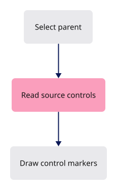

# 13 · Source controls and cloud picks

**Estimated study time: about 2–5 hours.** Includes reading, typing, tracing, testing and experiments. [How to use this estimate](map.md#time-estimates).

**This section:** Connect control selection and cloud picks to original source identities.

**In the whole viewer:** This extends picking beyond a display row so editing can address the actual source control or point.

**Follow the data:** Selected object → eligible controls or source query → original ID → selected control.

**Start with these files:** [`src/app/keys.rs`](13-controls.md#code-13-001), [`src/state.rs`](13-controls.md#code-13-002).

**Aim to explain:** Why should a control pick return an original identity instead of a marker-buffer index?

[Whole-viewer map and course milestones](map.md)

A displayed triangle is often only an approximation of an editable shape. Control points belong to the original curve, surface or mesh. We first establish a selected parent, then ask that parent for controls. This keeps a control selection connected to the object it can change.



Start from the working result of [step 12](12-picking.md).

**One buildable step:** type the additions below in `workspace/handwritten`, then build and test. This step adds 157 lines across 2 files and may take several sittings. Individual listings are parts of this step, not separate build checkpoints.

<span id="code-13-001"></span>

## `src/app/keys.rs`

Insert **after line 69** of your current file.

Keep these preceding lines:

```rust
        s.camera.toggle_projection_framed(&s.gpu.bounds, s.aspect())
    }),
    // the first Esc cancels the command and keeps the selection, the next one clears it
    named(NamedKey::Escape, |s| s.escape()),
```

Keep these following lines:

```rust
    // register:view-front
    plain(&["1"], |s| s.camera.set_view(View::Front)),
    // register:view-back
    plain(&["2"], |s| s.camera.set_view(View::Back)),
```

Type these new lines:

```rust
--8<-- "typing/code/13-001.rs"
```

<span id="code-13-002"></span>

## `src/state.rs`

Insert **after line 196** of your current file.

Keep these preceding lines:

```rust

        self.last_resize_ms = now;
        self.gpu.resize(width, height);
        self.gpu.logical_size = self.logical_size();
```

Keep these following lines:

```rust
        self.touch();
        true
    }
```

Type these new lines:

```rust
--8<-- "typing/code/13-002.rs"
```

<span id="code-13-003"></span>

## `src/state.rs`

Insert **after line 397** of your current file.

Keep these preceding lines:

```rust
            PickMode::Controls { parent, cloud } => {
                if let Some(pick) = pick
                    && pick.row == parent
                {
```

Keep these following lines:

```rust
                }

                return;
            }
```

Type these new lines:

```rust
--8<-- "typing/code/13-003.rs"
```

<span id="code-13-004"></span>

## `src/state.rs`

Insert **after line 454** of your current file.

Keep these preceding lines:

```rust

        // the CSS size changed: control dots keep their pixel size
        if logical != self.gpu.logical_size {
            self.gpu.logical_size = logical;
```

Keep these following lines:

```rust
            self.touch();
        }

        // a GPU error from the last frame
```

Type these new lines:

```rust
--8<-- "typing/code/13-004.rs"
```

<span id="code-13-005"></span>

## `src/state.rs`

Append **after line 710** of your current file.

Blank lines before: **1**; after: **0**. End with a newline.

```rust
--8<-- "typing/code/13-005.rs"
```

## Check the completed chapter

From `session_viewer`, compare everything you have typed:

```sh
npm --prefix ../session_tests run course -- reference-check 13
```

From `workspace/handwritten`:

```sh
cargo build --lib --locked -j4
cargo xtest --lib --locked -j4
```

Run the native tests and trace the missing-parent and valid-parent branches. The browser startup is connected in lesson 14. After completing that lesson, select a supported object, press F10, then Escape; controls should disappear while the parent remains selected.

If controls belong to the wrong object, inspect the parent row before looking at the marker renderer.

**Before moving on:** explain what changed, check the expected result above, and fix any build or test failure.

<details>
<summary>Check your explanation of the opening question</summary>

Marker storage can change when controls are rebuilt. The editing operation needs the stable source identity that the marker represents.

</details>

[Next step: 14](14-loading.md)
