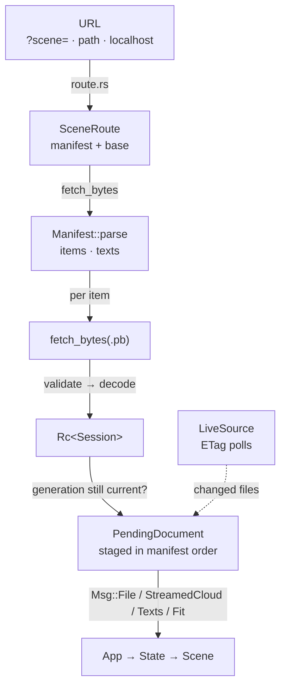
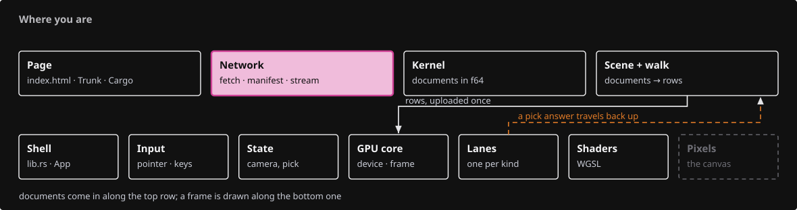
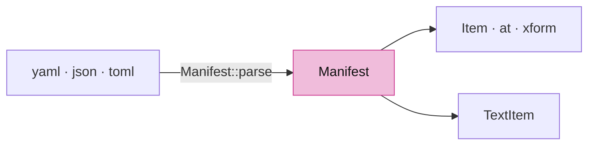
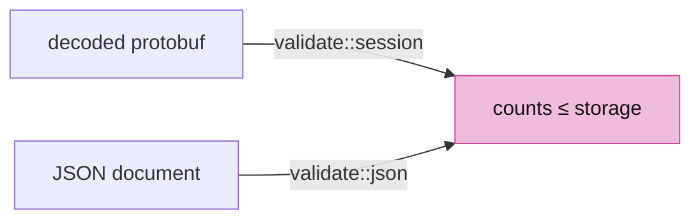
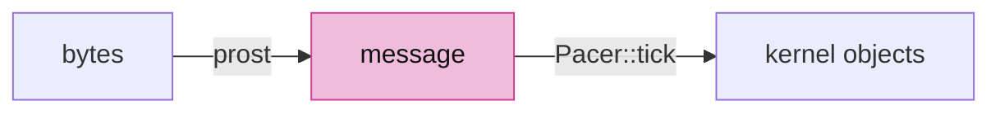
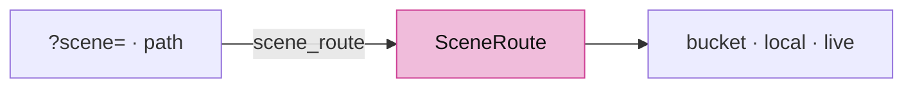
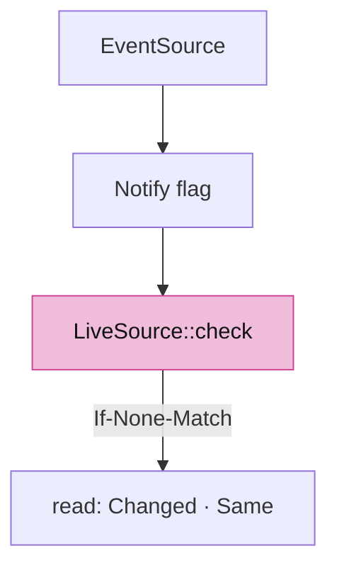
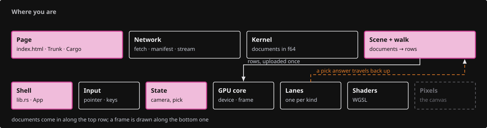
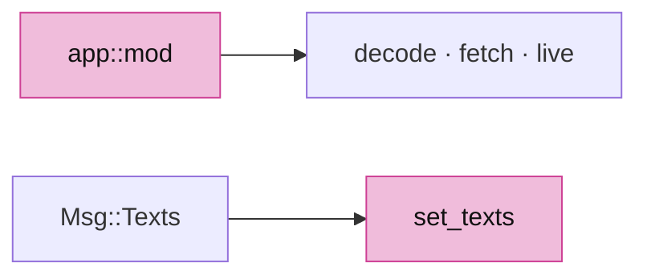
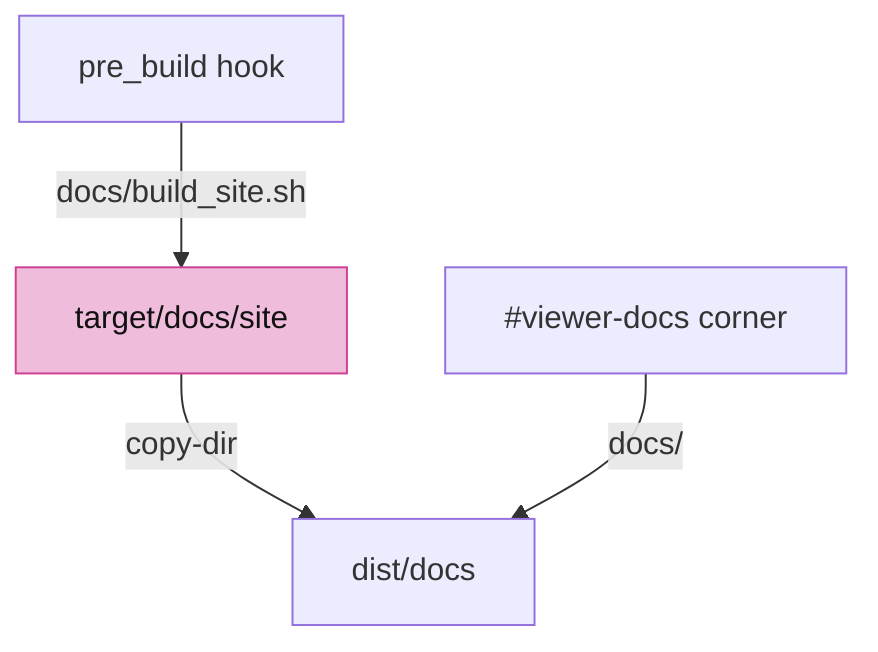

# 14 · Loading scenes

## You are building

## Starting point

- Checkpoint 13: the shell loads one bundled fixture from `loader.rs`; there is no manifest, no network and no replacement.
- This lesson installs the production path: route → manifest → validate → decode → staged replacement, plus the live source that watches a published manifest.

<!-- step-status: start -->

**Does it compile yet?** `cargo check` passes after steps 1–5 and 7, and fails after 6: a file is written across several steps, and a check can only pass once its last piece is in. Concretely, step 6 build again at step 7. This is measured at the end of every step rather than guessed. And where a check passes while your new files are not yet named by a `mod` line, it is telling you only that you have not broken the previous checkpoint — the checkpoint build at the end of the lesson is the real test.

<!-- step-status: end -->

## Step 1 · The manifest is placement, not geometry

- A manifest lists files and where each sits (`at`, `xform`, or the auto-grid); the geometry stays in `.pb` files, so a placement edit never re-uploads geometry.
- `parse` accepts YAML, JSON and TOML with one set of semantics and rejects non-finite or non-affine transforms before anything is fetched.
- `TextItem` is a fixed world-plane label authored in the manifest; its frame must be unit and orthogonal, checked here rather than in a renderer.

<!-- file: 14 session_viewer/src/app/manifest.rs type lines=1-57 -->

<!-- file: 14 session_viewer/src/app/manifest.rs type lines=58-127 -->

- Placement has a fallback: an item with no transform of its own takes its slot in the auto grid, so a manifest can list files and nothing else and still produce a readable scene.

<!-- file: 14 session_viewer/src/app/manifest.rs type lines=128-146 -->

<!-- file: 14 session_viewer/src/app/manifest.rs type lines=147-217 -->

Parser unit tests, part of the file:

<!-- file: 14 session_viewer/src/app/manifest.rs copy lines=218-347 -->

## Step 2 · Validate serialized counts before the kernel allocates

- A hostile `cv_count` would make a kernel constructor allocate from a declared number; every count is checked against the actual storage length first.
- `session` walks a decoded protobuf; `retained` covers the JSON path, which has no protobuf constructors; `json` checks declared NURBS counts before serde builds objects.

<!-- file: 14 session_viewer/src/app/validate.rs copy lines=1-147 -->

<!-- file: 14 session_viewer/src/app/validate.rs type lines=148-232 -->

- Every declared count is checked against the storage that must hold it, before a kernel constructor can allocate from a number an attacker chose.

<!-- file: 14 session_viewer/src/app/validate.rs copy lines=233-473 -->

## Step 3 · Decode without freezing the page

- prost decodes the whole message in one call; converting objects into kernel types is the slow part, so `Pacer` yields to the browser every `CHUNK` objects through `next_tick`.
- The bytes are taken by value and dropped right after prost is done, before the conversion loop starts.

<!-- file: 14 session_viewer/src/app/decode.rs type lines=1-60 -->

<!-- file: 14 session_viewer/src/app/decode.rs type lines=61-149 -->

- Decoding is `pb_loads` unrolled with awaits, so the browser gets a turn between chunks. A page that freezes for two seconds while a scene loads is a bug you cannot profile after the fact.

## Step 4 · The URL decides the route

- Three routes: a named scene (`?scene=` or the last path segment) from the bucket, the local manifest on a dev server, and no route at all on a deployed page, which hands over to the live source.
- `?data=` overrides where `.pb` files come from; `query_scene` refuses `..`, absolute paths and schemes so a manifest name stays inside one tree.

<!-- file: 14 session_viewer/src/app/route.rs type -->

## Step 5 · A live source polls with ETags

- An idle poll must stay cheap: every file is re-read with `If-None-Match`, so an unchanged file answers `304` and is never downloaded or decoded again.
- A relay message (`EventSource`) only raises a flag that says "look now"; the conditional reads still decide what changed.
- `Notify` owns its closure handle and detaches it in `Drop`; nothing is leaked with `forget()`.

<!-- file: 14 session_viewer/src/app/live.rs type lines=1-68 -->

- The relay only raises a flag, consumed on the next look. It says *when* to check, never *what* changed — the conditional reads still decide that, so a lost or duplicated notification cannot corrupt the scene.

<!-- file: 14 session_viewer/src/app/live.rs type lines=69-90 -->

- `from_query` turns the page off, on, or onto a custom manifest; a named scene or a local dev page never watches the bucket.

<!-- file: 14 session_viewer/src/app/live.rs type lines=91-116 -->

- The live source is constructed from the route and the query, so a named scene or a local dev page simply has none: watching the bucket is a property of how the page was reached, not a mode someone sets.

<!-- file: 14 session_viewer/src/app/live.rs type lines=117-174 -->

- The status line is deduplicated by message, so a poll that keeps failing says so once instead of filling the page with the same sentence.

<!-- file: 14 session_viewer/src/app/live.rs type lines=175-190 -->

- `read` returns `Changed`, `Same` or `Failed`; a server without ETags falls back to hashing the body.
- A manifest inside the bucket names its files from the bucket root; any other manifest names them from its own folder.

<!-- file: 14 session_viewer/src/app/live.rs type lines=191-256 -->

- `check` is one tick: nothing happens unless the relay flagged or the poll interval is due; a replacement with any unreadable file returns `None` and the last valid scene stays.

<!-- file: 14 session_viewer/src/app/live.rs type lines=257-333 -->

- An empty file is forgotten rather than treated as an empty scene: a publisher writing a file in place is briefly zero bytes, and that moment must not clear what the viewer is showing.

<!-- file: 14 session_viewer/src/app/live.rs type lines=334-354 -->

<!-- file: 14 session_viewer/src/app/live.rs type lines=355-411 -->

- Where a manifest's file names are resolved from depends on where the manifest itself lives: inside the bucket they are named from its root, anywhere else from the manifest's own folder.

<!-- file: 14 session_viewer/src/app/live.rs type lines=412-441 -->

<!-- check: 14 -->

## Step 6 · Stage a replacement, then swap it in whole

- A slow old response arriving last must not replace a newer scene, so every load carries a generation and `stale_load` is checked after each await.
- Network responses finish in any order; `PendingDocument` keeps manifest order, and `clear_scene` runs only after every item succeeded.
- Streaming clouds keep their budget: `stream_prefix` opens a large file by range and `stream_rest` continues a slice at a time until its scene is cleared.
- Whole files have a budget too: `scene_budget_bytes` is `?budget=<MB>` or 16 MB per GB of `navigator.deviceMemory`, 64 MB when the browser says nothing, because a decoded file costs the wasm heap about five times its size. Each file's size is asked by HEAD first; one that would put the scene over the budget is skipped, and the status line names it and the knob instead of the page dying without a word.

<!-- file: 14 session_viewer/src/app/loader.rs type -->

## Step 7 · Wire the modules and the text message

- `decode`, `fetch` and `live` are browser-only; `manifest` and `validate` compile natively too.
- Manifest text reaches State through one `Msg::Texts`; `set_texts` builds fixed-plane labels and grows the fit bounds by the shaped text extents.

<!-- file: 14 session_viewer/src/app/mod.rs type -->

<!-- file: 14 session_viewer/src/app/scene.rs type -->

- One field: the manifest's authored text. It is kept beside the documents because a scene replacement has to forget both together, which is why `clear` gains a line too.

<!-- file: 14 session_viewer/src/lib.rs type -->

- A module line and a `Msg` arm: the shell declares what now exists and routes one more asynchronous answer.

<!-- file: 14 session_viewer/src/state.rs type -->

- Trunk watches the kernel next door and serves the index uncached, so a rebuilt bundle is never hidden behind a stale page.
- A `pre_build` hook runs `docs/build_site.sh` before every bundle: it builds the documentation site into `target/docs/site`, which the page's `copy-dir` link publishes as `dist/docs`, so the black corner opens the course from the same `dist/` the viewer is served from.
- The hook rebuilds only when a documentation source is newer than the built `index.html`; a checkout without the course sources or without `uvx` gets a placeholder page instead of a failed build.

<!-- file: 14 session_viewer/Trunk.toml copy -->

<!-- file: 14 session_viewer/docs/build_site.sh copy -->

<!-- supplied: 14 -->

## Check

<!-- checkpoint: 14 -->

Expected:

- The local fixture loads through the manifest and protobuf path.
- Click an object: selection still highlights; F10 still shows controls.
- The status line clears once the last item is posted.

If nothing loads, read the status text: it names the failing stage (manifest fetch, manifest parse, file fetch, decode).

![Left: a manifest that lists the same file twice, the second with `at: [0, 12, 0]`, plus a fixed-plane text item; one download, two placements. Right: a manifest naming a missing file, and the status names the stage that failed.](screenshots/14-manifest.png)

## What changed

<!-- tree: 14 session_viewer/src/app -->

- `SceneRoute` → `Manifest` → validated `Session` → staged `PendingDocument` → `Msg::File`/`Msg::StreamedCloud`/`Msg::Texts`/`Msg::Fit`.
- A `LiveSource` re-reads a published manifest with ETags and replaces the scene only when every file is readable.
- `docs/build_site.sh` runs as Trunk's pre-build hook and keeps `dist/docs` current, so the page's documentation corner works in a served build.

**Production equivalent:** `src/app/manifest.rs`, `validate.rs`, `decode.rs`, `route.rs`, `live.rs`, `loader.rs` are the production files.

## Try

- Write `dist/scenes/two.yaml` listing `pb/interaction.pb` twice, the second entry with `at: [0, 12, 0]`, and open `?scene=two.yaml&data=off`: the file is fetched once and placed twice.
- Add a `texts` entry with `at`, `right`, `up` and `height`: the label sits in that world plane and foreshortens with the view.
- Point an item at a file that does not exist: the status reads which stage failed and the previous scene stays on screen.
- Give an item a non-orthogonal `xform`: `Manifest::parse` rejects it before any file is fetched.
- Touch a file under `docs/` and run `trunk serve` again: the hook rebuilds the site, and the black corner opens the fresh page from `dist/docs`.

## Questions and answers

**The manifest holds placement and the `.pb` files hold geometry. What does that separation buy?**

*How to work it out.* Ask which edit a user makes most often. Moving an object, adding a second copy, changing a scene's layout — all placement. Then ask what each edit would cost if placement lived inside the geometry file: rewriting and re-uploading megabytes to change sixteen numbers.

*The answer.* A placement edit re-reads a few kilobytes of YAML and rewrites one matrix; geometry is never touched. It also lets the same geometry file appear twice at two placements, and lets a manifest be written by hand. When you meet a format split, ask what the cheap edit is — that is usually what the split protects.

**A hostile `cv_count` is checked against the actual storage length before a kernel constructor sees it. What class of bug is that, and why is the viewer the right place to catch it?**

*How to work it out.* Ask what a constructor does with a declared count: allocates from it, or indexes with it. Both are attacker-controlled if the number came off the network. Then ask where the trust boundary is — which code first touches bytes it did not produce.

*The answer.* It is the declared-length-versus-actual-length class. The viewer is the first code to see untrusted bytes, while the kernel constructors are shared with tools whose input is trusted. Validate where untrusted data enters, not where it is eventually used.

**Every load carries a generation and `stale_load` is checked after each await. Predict the bug this prevents, concretely.**

*How to work it out.* Walk two overlapping loads. You ask for scene A; it is slow. You ask for B; B arrives and is shown. Then A's response lands and continues its code path, which ends in "replace the scene". Nothing errors.

*The answer.* The user sees the scene they did not ask for. The check has to be after *each* await rather than only at the end, because every await is a point where the world can change — and the later stages of the old load would otherwise keep running against a scene that has moved on.

**Files are skipped when they would exceed the scene budget, and the status line names the file and the knob. Why is naming the knob part of the design?**

*How to work it out.* Consider the alternatives from the user's seat. Silently showing less: they do not know anything is missing. Running out of memory: the tab dies with no explanation. Saying "scene too large": true, but they still cannot act.

*The answer.* Naming the file and the query parameter that raises the limit turns a dead end into a decision the user can make. An error message that does not say what to do next is only half written.

**What you should be able to do now**

Sketch the staged replacement and argue the opposite design. Correct: documents are fetched and decoded into a pending list in manifest order; only when every item has succeeded is the old scene cleared and the new one swapped in whole. The alternative — swapping each document in as it arrives — shows the user a scene that is half old and half new for several seconds, and if one file fails they are left with a mixture that matches no manifest. Being able to argue both sides is how you know you understand the trade.

## Next

[15 · Publication and streamed reads](15-publication.md): bounded metadata windows for streamed clouds, and the publication helpers.
