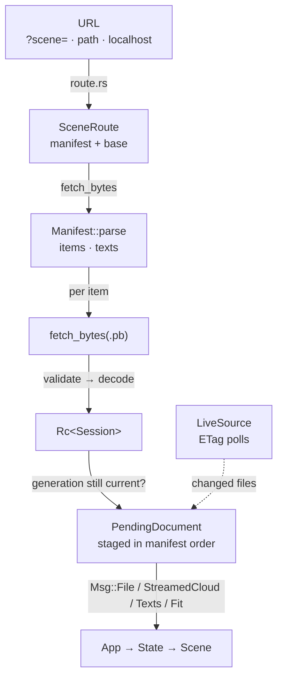

# 14 · Loading scenes

## You are building

## Starting point

- Checkpoint 13: the shell loads one bundled fixture from `loader.rs`; there is no manifest, no network and no replacement.
- This lesson installs the production path: route → manifest → validate → decode → staged replacement, plus the live source that watches a published manifest.

## Step 1 · The manifest is placement, not geometry

- A manifest lists files and where each sits (`at`, `xform`, or the auto-grid); the geometry stays in `.pb` files, so a placement edit never re-uploads geometry.
- `parse` accepts YAML, JSON and TOML with one set of semantics and rejects non-finite or non-affine transforms before anything is fetched.
- `TextItem` is a fixed world-plane label authored in the manifest; its frame must be unit and orthogonal, checked here rather than in a renderer.

<!-- file: 14 session_viewer/src/app/manifest.rs type lines=1-57 -->

<!-- file: 14 session_viewer/src/app/manifest.rs type lines=58-146 -->

<!-- file: 14 session_viewer/src/app/manifest.rs type lines=147-217 -->

Parser unit tests, part of the file:

<!-- file: 14 session_viewer/src/app/manifest.rs copy lines=218-347 -->

## Step 2 · Validate serialized counts before the kernel allocates

- A hostile `cv_count` would make a kernel constructor allocate from a declared number; every count is checked against the actual storage length first.
- `session` walks a decoded protobuf; `retained` covers the JSON path, which has no protobuf constructors; `json` checks declared NURBS counts before serde builds objects.

<!-- file: 14 session_viewer/src/app/validate.rs copy lines=1-147 -->

<!-- file: 14 session_viewer/src/app/validate.rs type lines=148-232 -->

<!-- file: 14 session_viewer/src/app/validate.rs copy lines=233-473 -->

## Step 3 · Decode without freezing the page

- prost decodes the whole message in one call; converting objects into kernel types is the slow part, so `Pacer` yields to the browser every `CHUNK` objects through `next_tick`.
- The bytes are taken by value and dropped right after prost is done, before the conversion loop starts.

<!-- file: 14 session_viewer/src/app/decode.rs type lines=1-60 -->

<!-- file: 14 session_viewer/src/app/decode.rs type lines=61-149 -->

## Step 4 · The URL decides the route

- Three routes: a named scene (`?scene=` or the last path segment) from the bucket, the local manifest on a dev server, and no route at all on a deployed page, which hands over to the live source.
- `?data=` overrides where `.pb` files come from; `query_scene` refuses `..`, absolute paths and schemes so a manifest name stays inside one tree.

<!-- file: 14 session_viewer/src/app/route.rs type -->

## Step 5 · A live source polls with ETags

- An idle poll must stay cheap: every file is re-read with `If-None-Match`, so an unchanged file answers `304` and is never downloaded or decoded again.
- A relay message (`EventSource`) only raises a flag that says "look now"; the conditional reads still decide what changed.
- `Notify` owns its closure handle and detaches it in `Drop`; nothing is leaked with `forget()`.

<!-- file: 14 session_viewer/src/app/live.rs type lines=1-90 -->

- `from_query` turns the page off, on, or onto a custom manifest; a named scene or a local dev page never watches the bucket.

<!-- file: 14 session_viewer/src/app/live.rs type lines=91-185 -->

- `read` returns `Changed`, `Same` or `Failed`; a server without ETags falls back to hashing the body.
- A manifest inside the bucket names its files from the bucket root; any other manifest names them from its own folder.

<!-- file: 14 session_viewer/src/app/live.rs type lines=186-251 -->

- `check` is one tick: nothing happens unless the relay flagged or the poll interval is due; a replacement with any unreadable file returns `None` and the last valid scene stays.

<!-- file: 14 session_viewer/src/app/live.rs type lines=252-349 -->

<!-- file: 14 session_viewer/src/app/live.rs type lines=350-436 -->

<!-- check: 14 -->

## Step 6 · Stage a replacement, then swap it in whole

- A slow old response arriving last must not replace a newer scene, so every load carries a generation and `stale_load` is checked after each await.
- Network responses finish in any order; `PendingDocument` keeps manifest order, and `clear_scene` runs only after every item succeeded.
- Streaming clouds keep their budget: `stream_prefix` opens a large file by range and `stream_rest` continues a slice at a time until its scene is cleared.

<!-- file: 14 session_viewer/src/app/loader.rs type hunks=1 -->

<!-- file: 14 session_viewer/src/app/loader.rs type hunks=2 -->

<!-- file: 14 session_viewer/src/app/loader.rs type hunks=3 -->

## Step 7 · Wire the modules and the text message

- `decode`, `fetch` and `live` are browser-only; `manifest` and `validate` compile natively too.
- Manifest text reaches State through one `Msg::Texts`; `set_texts` builds fixed-plane labels and grows the fit bounds by the shaped text extents.

<!-- file: 14 session_viewer/src/app/mod.rs type -->

<!-- file: 14 session_viewer/src/app/scene.rs type -->

<!-- file: 14 session_viewer/src/lib.rs type -->

<!-- file: 14 session_viewer/src/state.rs type -->

Trunk now watches the kernel next door and serves the index uncached, so a rebuilt bundle is never hidden behind a stale page.

<!-- file: 14 session_viewer/Trunk.toml copy -->

<!-- supplied: 14 -->

## Check

<!-- checkpoint: 14 -->

Expected:

- The local fixture loads through the manifest and protobuf path instead of a bundled byte array.
- Click an object: selection still highlights; F10 still shows controls.
- The status line clears once the last item is posted.

If nothing loads, read the status text: it names the failing stage (manifest fetch, manifest parse, file fetch, decode).

## What changed

<!-- tree: 14 session_viewer/src/app -->

- `SceneRoute` → `Manifest` → validated `Session` → staged `PendingDocument` → `Msg::File`/`Msg::StreamedCloud`/`Msg::Texts`/`Msg::Fit`.
- A `LiveSource` re-reads a published manifest with ETags and replaces the scene only when every file is readable.

**Production equivalent:** `src/app/manifest.rs`, `validate.rs`, `decode.rs`, `route.rs`, `live.rs`, `loader.rs` are the production files.

## Next

[15 · Publication and streamed reads](15-publication.md): bounded metadata windows for streamed clouds, and the publication helpers.
