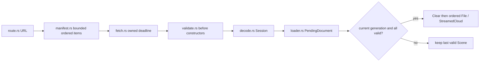

# 14 — Load and replace complete scene revisions

A replacement becomes visible only after all its documents are ready and its request generation is still current. Whole documents and streamed descriptors share one ordered staging list.



Text: resolve, validate and stage in order; only the current complete revision replaces the scene.

## Implement checkpoint 14

- Start in the reconstructed workspace from the previous checkpoint; `COURSE_REPO` is the absolute production viewer directory recorded in [setup](README.md).
- The complete patch is the exact edit ledger: every import, module registration, helper, shader and configuration change is present. For manual reconstruction, type the marked blocks and copy the remaining patch hunks; apply each change once.
- Automatic reconstruction applies the same complete patch. `--adopt` checks a manually completed tree against exactly the same file hashes.

- Starting checkpoint: **13**.
- **COPY/PASTE:** [complete 14.patch](reconstruction/patches/14.patch).

| Exact path beneath the reconstruction workspace | Action and unique owner | Purpose |
|---|---|---|
| `session_viewer/src/app/loader.rs` | Replace the fixture adapter with `boot`, `load_route`, `post_live`, `reload_scene` and `StreamCursor` | Ordered documents, bounded display prefixes and superseded work. |
| `session_viewer/src/app/route.rs` | Create/replace the complete route module | Local default; explicit data host for named scenes; TOML aliases fall back only after 404. |
| `session_viewer/src/app/manifest.rs` | Create `Item`, `Manifest` and complete parsing/placement helpers | TOML/YAML/JSON; finite affine transforms; 4 MiB and 100,000-item bounds. |
| `session_viewer/src/app/validate.rs` | Create the complete validation module | Check protobuf/JSON storage before constructors; retain format and original identities. |
| `session_viewer/src/app/decode.rs` | Create `session_from_bytes`, `Pacer`, conversion macro and tree conversion | Whole-file cap and yielding object conversion; recoverable errors. |
| `session_viewer/src/app/live.rs` | Create `LiveSource` and owned `Notify` | Revalidate mutable metadata, reuse immutable geometry, retry failed revisions. |
| `session_viewer/src/app/fetch.rs` | Replace the complete fetch module | Checked 206 ranges, byte limits, request cancellation and callback ownership. |
| `session_viewer/src/app/mod.rs`, `session_viewer/src/lib.rs` | Apply all registration and browser-message hunks | Actual production application shell. |
| `session_viewer/index.html`, `session_viewer/Trunk.toml` | Replace with the complete page/build configuration | Focus, explicit errors/reload, local assets, release build, port 8770. |
| `session_viewer/tests/loading.cjs`, `session_viewer/tests/lifecycle.cjs` | Create complete browser fixtures | Last-valid-scene, race, repeated replacement, focus, pointer cancellation and DPR. |

**TYPE BY HAND — `session_viewer/src/app/loader.rs`:** insert the complete `PendingDocument` declaration immediately before `struct Placement` and the complete `stale_load` function before `fetch_manifest`; use the imports included in the patch.

```rust
/// Replacement staging preserves manifest order across whole files and streamed clouds.
enum PendingDocument {
    Whole(FileDoc),
    Streamed(Box<StreamedInit>),
}
```

```rust
/// Newer route requests win even if older network or decode operations finish later.
fn stale_load(generation: u64) -> bool {
    LOAD_GENERATION.get() != generation
}
```

**TYPE BY HAND — `session_viewer/src/app/loader.rs`, `load_route`:** replace the final application block after the last `stale_load(generation)` return and before `post(Msg::Fit)` with this complete block.

```rust
    if replacement.is_some() {
        if failed {
            super::feedback::status(
                "Scene replacement failed; the last valid scene is still visible",
            );
            return;
        }
        clear_scene();
        budget_spend(staged_points);
        for document in pending {
            match document {
                PendingDocument::Whole(doc) => {
                    post(Msg::File(doc));
                }
                PendingDocument::Streamed(stream) => {
                    post(Msg::StreamedCloud(stream));
                }
            }
        }
    }
    post(Msg::Texts(manifest.texts));
```

**TYPE BY HAND — `session_viewer/src/app/fetch.rs`:** create the complete `Deadline`, its constructor/drop implementation, and `abort_request` at module scope after `next_tick`; copy the `Closure`, `JsCast` and `JsFuture` imports from the patch.

```rust
/// Own a bounded fetch deadline and its callback; every return path releases the timer.
struct Deadline {
    controller: web_sys::AbortController,
    timer: i32,
    _callback: Closure<dyn FnMut()>,
}
impl Deadline {
    /// Permit slow scene transfers for ninety seconds, then surface a recoverable network error.
    fn new() -> Result<Self, String> {
        let window = web_sys::window().ok_or("no window")?;
        let controller = web_sys::AbortController::new().map_err(describe)?;
        let owned = controller.clone();
        let callback = Closure::<dyn FnMut()>::new(move || abort_request(&owned));
        let timer = window
            .set_timeout_with_callback_and_timeout_and_arguments_0(
                callback.as_ref().unchecked_ref(),
                90_000,
            )
            .map_err(describe)?;
        Ok(Self {
            controller,
            timer,
            _callback: callback,
        })
    }
}
impl Drop for Deadline {
    /// Remove the JavaScript timer before dropping its Rust callback handle.
    fn drop(&mut self) {
        if let Some(window) = web_sys::window() {
            window.clear_timeout_with_handle(self.timer);
        }
    }
}
/// The browser callback adapter forwards cancellation to the request's controller.
fn abort_request(controller: &web_sys::AbortController) {
    controller.abort();
}
```

**COPY/PASTE — remaining hunks:** finish every addition/replacement in [14.patch](reconstruction/patches/14.patch), including validation before `from_proto`/JSON construction and the named browser callback adapters. The 25,000-object conversion yield does not make the initial protobuf decode or geometry preparation asynchronous; the measured long tasks remain in [the results](../ARCHITECTURE.md#measured-browser-results--8-september-2026).

**COPY/PASTE — verify the complete manual checkpoint:**

```sh
python3 "$COURSE_REPO/docs/reconstruction/replay.py" --output /tmp/viewer-course --through 14 --adopt --verify --target-dir "$COURSE_REPO/target"
cd /tmp/viewer-course/session_viewer
REGEN_PROTO=0 NO_COLOR=true trunk serve
```

- Open `http://localhost:8770/?data=off&inspect=1`: the bundled source fixture draws through the real manifest/PB loader.
- With that server running, run `VIEWER_URL=http://localhost:8770/ node tests/loading.cjs` and `VIEWER_URL=http://localhost:8770/ node tests/lifecycle.cjs` using the browser environment from setup.
- Expected: malformed replacement keeps the old scene; a delayed older response never replaces the newer route; six replacements retain equal GPU capacities for equal workloads; focused inputs, pointer cancellation and DPR changes pass.
- Automatic alternative from unchanged 13: replace `--adopt` with `--advance` in the replay command.

**COPY/PASTE — authored fixed-plane text from 14.patch.** `Manifest::texts` contains bounded `TextItem` records (`text`, `at`, `right`, `up`, `height`). Parsing validates finite unit orthogonal axes, positive height, at most 1024 labels and at most 256 KiB of UTF-8 text. `Msg::Texts` applies the records with their scene revision, and `State::set_texts/include_text_bounds` includes shaped plane corners when fitting. A malformed replacement preserves the last valid scene and its labels.

For a local scene, add this complete YAML entry alongside `items` (it uses world units):

```yaml
texts:
  - text: text_not_oriented_to_camera
    at: [0, -20, 40]
    right: [1, 0, 0]
    up: [0, 1, 0]
    height: 8
```

TOML uses `[[texts]]` with the same fields; JSON uses a `texts` array. These are source annotations and remain visible when `T` hides selected-object names. Chapter 15's publication parity test preserves these records across TOML and YAML.

[Previous: controls](13-controls.md) · [Next: publication and bounded reads](15-publication.md)
