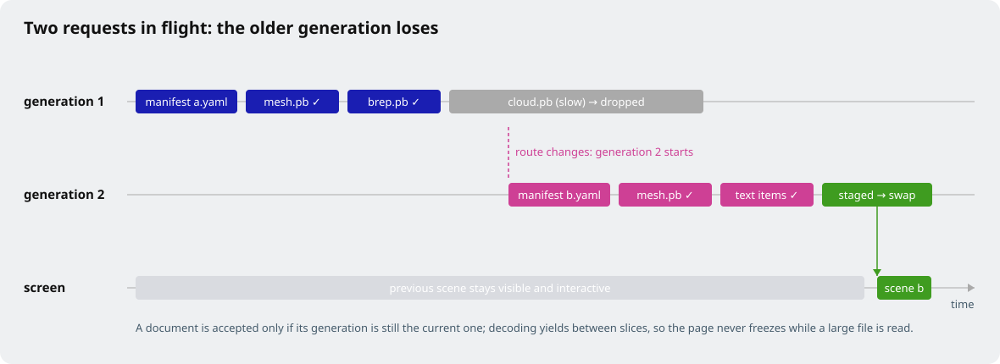

# 14 · Loading scenes

**Estimated study time: about 45–90 hours.** Includes reading, typing, tracing, testing and experiments. [How to use this estimate](map.md#time-estimates).

**This section:** Load a scene description and publish its geometry to the viewer.

**In the whole viewer:** This completes the route from external files to the browser renderer. You can now inspect the course scene interactively.

**Follow the data:** Manifest → fetch and validation → source document → display upload → browser frame.

**Start with these files:** [`src/app/loader.rs`](14-loading.md#code-14-009), [`src/app/scene.rs`](12-picking.md#code-12-013).

**Aim to explain:** If a replacement scene is malformed, what should happen to the scene already on screen?

[Whole-viewer map and course milestones](map.md)

A manifest is a small description of a scene. It tells the viewer which files to request and how to place them. Keeping that description separate from the heavy geometry lets the page decide what to load before it downloads every object.



Start from the working result of [step 13](13-controls.md).

**One buildable step:** type the additions below in `workspace/handwritten`, then build and test. This step adds 4,105 lines across 13 files and may take several sittings. Individual listings are parts of this step, not separate build checkpoints.

<span id="code-14-001"></span>

## `src/lib.rs`

Insert **after line 48** of your current file.

Keep these preceding lines:

```rust
    File(FileDoc, Option<String>), // one loaded file; a display-only one names its file
    Clear,                         // empty the scene
    Fit,                           // frame the camera on everything
    CancelPointer,                 // the browser lost the pointer
```

Keep these following lines:

```rust
}

#[cfg(target_arch = "wasm32")]
use {
```

Type these new lines:

```rust
--8<-- "typing/code/14-001.rs"
```

<span id="code-14-002"></span>

## `src/lib.rs`

Insert **after line 143** of your current file.

Keep these preceding lines:

```rust
                Err(error) => log::warn!("Cannot register pointer cancellation: {error:?}"),
            }

            // async: GPU setup, then Msg::Ready
```

Keep these following lines:

```rust
        }
    }

    /// Apply one loader message to the scene.
```

Type these new lines:

```rust
--8<-- "typing/code/14-002.rs"
```

<span id="code-14-003"></span>

## `src/lib.rs`

Insert **after line 161** of your current file.

Keep these preceding lines:

```rust
            Msg::Ready(_) => {}
            Msg::Clear => state.clear(),
            Msg::Fit => state.fit_loaded(),
            Msg::File(doc, source) => state.append(doc, source),
```

Keep these following lines:

```rust
            Msg::CancelPointer => {
                self.input.cancel();
                state.touch();
            }
```

Type these new lines:

```rust
--8<-- "typing/code/14-003.rs"
```

<span id="code-14-004"></span>

## `src/lib.rs`

Append **after line 290** of your current file.

Blank lines before: **1**; after: **0**. End with a newline.

```rust
--8<-- "typing/code/14-004.rs"
```

<span id="code-14-005"></span>

## `src/app/decode.rs`

Bytes arriving from disk or the network are not yet usable objects. Decoding checks their format and constructs records. Keep malformed input separate from an empty but valid scene so errors remain understandable.

Create this file. Type the complete listing, including comments and blank lines.

```rust
--8<-- "typing/code/14-005.rs"
```

<span id="code-14-006"></span>

## `src/app/fetch.rs`

A network request may finish later or fail. The browser must remain responsive while it waits. The caller needs a way to distinguish a valid response, an error and a result that became irrelevant after the user changed scenes.

Create this file. Type the complete listing, including comments and blank lines.

```rust
--8<-- "typing/code/14-006.rs"
```

<span id="code-14-007"></span>

## `src/app/fonts.rs`

Font bytes are assets. The program chooses and loads them, while the shaping library interprets them. A fallback font extends character coverage but must be available before missing characters can be shaped correctly.

Create this file. Type the complete listing, including comments and blank lines.

```rust
--8<-- "typing/code/14-007.rs"
```

<span id="code-14-008"></span>

## `src/app/live.rs`

Create this file. Type the complete listing, including comments and blank lines.

```rust
--8<-- "typing/code/14-008.rs"
```

<span id="code-14-009"></span>

## `src/app/loader.rs`

Loading combines requests, decoding and publication into the scene. These steps can complete at different times. Keep the active load identity with the work so an older completion cannot overwrite the current document.

Create this file. Type the complete listing, including comments and blank lines.

```rust
--8<-- "typing/code/14-009.rs"
```

<span id="code-14-010"></span>

## `src/app/manifest.rs`

A manifest is a small description of scene inputs and their properties. It separates the choice of files from the code that loads them. Relative file paths are resolved from a known location, not from whichever page happened to request them.

Create this file. Type the complete listing, including comments and blank lines.

```rust
--8<-- "typing/code/14-010.rs"
```

<span id="code-14-011"></span>

## `src/app/mod.rs`

Insert **after line 2** of your current file.

Keep these preceding lines:

```rust
// `pub mod x;` makes src/app/x.rs part of the crate; each lesson adds the one line of the module it teaches.
// `#[cfg(target_arch = "wasm32")]` above a line compiles that module for the browser only.
```

Keep these following lines:

```rust
pub mod feedback; // register:feedback
pub mod gesture; // register:gesture
pub mod input; // register:input
#[cfg(any(target_arch = "wasm32", test))] // register:inspection
```

Type these new lines:

```rust
--8<-- "typing/code/14-011.rs"
```

<span id="code-14-012"></span>

## `src/app/mod.rs`

Insert **after line 5** of your current file.

Keep these preceding lines:

```rust
// `#[cfg(target_arch = "wasm32")]` above a line compiles that module for the browser only.
#[cfg(any(target_arch = "wasm32", test))] // register:decode
pub mod decode; // register:decode
pub mod feedback; // register:feedback
```

Keep these following lines:

```rust
pub mod gesture; // register:gesture
pub mod input; // register:input
#[cfg(any(target_arch = "wasm32", test))] // register:inspection
pub mod inspection; // register:inspection
```

Type these new lines:

```rust
--8<-- "typing/code/14-012.rs"
```

<span id="code-14-013"></span>

## `src/app/mod.rs`

Insert **after line 14** of your current file.

Keep these preceding lines:

```rust
#[cfg(any(target_arch = "wasm32", test))] // register:inspection
pub mod inspection; // register:inspection
pub mod keys; // register:keys
pub mod knobs; // register:knobs
```

Keep these following lines:

```rust
#[cfg(target_arch = "wasm32")] // register:route
pub mod route; // register:route
pub mod scene; // register:scene
pub mod selection; // register:selection
```

Type these new lines:

```rust
--8<-- "typing/code/14-013.rs"
```

<span id="code-14-014"></span>

## `src/app/mod.rs`

Insert **after line 26** of your current file.

Keep these preceding lines:

```rust
pub mod route; // register:route
pub mod scene; // register:scene
pub mod selection; // register:selection
pub mod touch; // register:touch
```

Keep these following lines:

```rust
pub mod walk; // register:walk
```

Type these new lines:

```rust
--8<-- "typing/code/14-014.rs"
```

<span id="code-14-015"></span>

## `src/app/range_gate.rs`

A streamed reader may request only a byte range. The response must actually represent that range before it can be used. A server returning a whole file or a mismatched range needs different handling.

Create this file. Type the complete listing, including comments and blank lines.

```rust
--8<-- "typing/code/14-015.rs"
```

<span id="code-14-016"></span>

## `src/app/validate.rs`

Create this file. Type the complete listing, including comments and blank lines.

```rust
--8<-- "typing/code/14-016.rs"
```

<span id="code-14-017"></span>

## `src/state.rs`

Insert **after line 101** of your current file.

Keep these preceding lines:

```rust
    pub fn append(&mut self, doc: FileDoc, source: Option<String>) {
        let t0 = now_ms();
        let first_row = self.scene.row_count(); // rows before this document
        let index = self.scene.docs.len();
```

Keep these following lines:

```rust
        self.scene.add_file(doc);
        let t1 = now_ms();
        // only the new rows go to the GPU
        self.scene.upload_to(&mut self.gpu);
```

Type these new lines:

```rust
--8<-- "typing/code/14-017.rs"
```

<span id="code-14-018"></span>

## `tests/lifecycle.cjs`

Create this file. Type the complete listing, including comments and blank lines.

```javascript
--8<-- "typing/code/14-018.cjs"
```

<span id="code-14-019"></span>

## `tests/loading.cjs`

Create this file. Type the complete listing, including comments and blank lines.

```javascript
--8<-- "typing/code/14-019.cjs"
```

## Check the completed chapter

From `session_viewer`, compare everything you have typed:

```sh
npm --prefix ../session_tests run course -- reference-check 14
```

From `workspace/handwritten`:

```sh
cargo build --lib --locked -j4
cargo xtest --lib --locked -j4
```

Run the native manifest tests. Open `assets/view_local.yaml` and trace `course-boxes.pb` to its geometry asset. Run `trunk serve --port 8780`, then open http://localhost:8780/?data=off. You should see the supplied boxes, a polyline and a point. Click a box to select it; press F10 to inspect its controls, then Escape.

If loading stops, read the first manifest or network error. Check the resolved file URL before changing the decoder.


**Before moving on:** explain what changed, check the expected result above, and fix any build or test failure.

<details>
<summary>Check your explanation of the opening question</summary>

Keep the previous valid scene. Validate and stage a replacement before publishing it, and discard results belonging to an obsolete load request.

</details>

[Next step: 15](15-publication.md)
