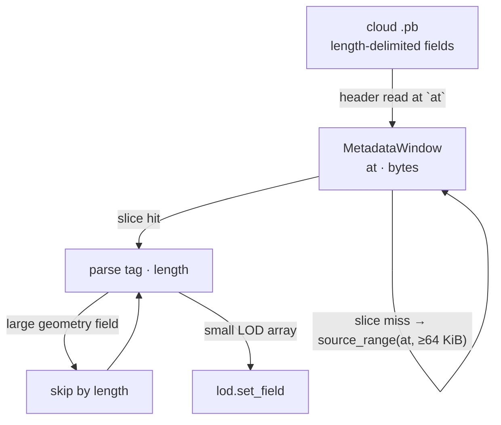

# 15 · Publication and streamed reads

## You are building

## Starting point

- Checkpoint 14: a streamed cloud locates its arrays with one small range request per protobuf header and one per array body.
- This lesson keeps the same parse and adds a bounded read-ahead window, so adjacent small fields share one request while large arrays are still skipped by length.

## Step 1 · A bounded window over the metadata

- Skipped geometry fields never decide the window's size: `read_length` reads at least 64 KiB inside the file, larger only for an array that is itself larger, and never past `end`.
- `slice` borrows an exact cached range, including a valid empty range at the window's end.

<!-- file: 15 session_viewer/src/app/stream.rs type hunks=1,2 -->

## Step 2 · Refill only on a jump

- `read` reuses the window when the requested range is inside it and replaces it under the same exposed revision otherwise; a changed ETag fails the read instead of mixing two revisions.

<!-- file: 15 session_viewer/src/app/stream.rs type hunks=3 -->

## Step 3 · Route the LOD walk through the window

The loop is unchanged: headers, skips and array bodies now borrow from `window` instead of issuing their own requests.

<!-- file: 15 session_viewer/src/app/stream.rs type hunks=4,5,6 -->

A unit test of the range rules, part of the file:

<!-- file: 15 session_viewer/src/app/stream.rs copy hunks=7 -->

## Step 4 · Publication helpers

- Publishing writes the immutable geometry revision first, verifies it, then updates the alias and the mutable manifest, so a manifest never points at missing bytes.
- Credentials stay in the local shell helpers; nothing in the browser bundle can write to the bucket.

<!-- supplied: 15 -->

## Check

<!-- checkpoint: 15 -->

Expected:

- The local scene loads exactly as at checkpoint 14.
- A streamed cloud (`?scene=stream-test.yaml` with a local `?data=` server) still shows its display prefix and F10 still reaches source points beyond it.

## What changed

<!-- tree: 15 session_viewer/src/app -->

- `MetadataWindow` sits between `cloud_lod` and `source_range`; header and small-array reads share one cached range.
- Publication scripts under `bash/` write geometry, verify, alias, then manifest.

**Production equivalent:** `src/app/stream.rs`; `bash/view_put.sh`, `bash/view_live.sh`, `bash/lib/`.

## Next

[16 · Resource accounting](16-accounting.md): what the viewer can and cannot measure about its own memory.
