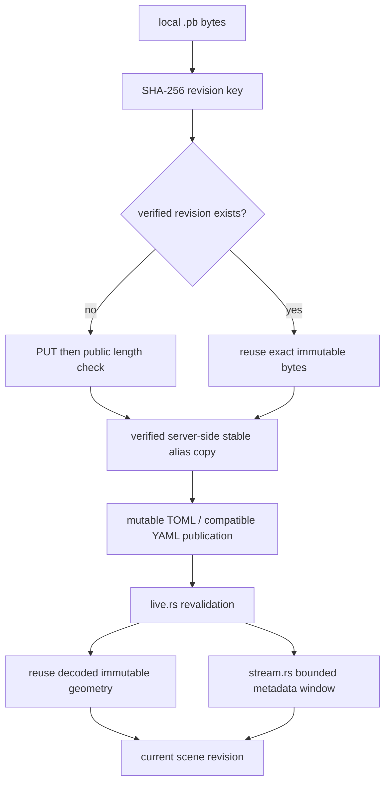

# 15 — Publish verified revisions and combine metadata reads

One immutable geometry key can serve many placements and reloads. A bounded 64 KiB read window removes adjacent metadata round trips while every requested slice keeps its source revision and byte bounds.



Text: verify immutable geometry, publish its pointer, then revalidate the pointer; adjacent range reads share bounded cached bytes.

## Implement checkpoint 15

- Start in the reconstructed workspace from the previous checkpoint; `COURSE_REPO` is the absolute production viewer directory recorded in [setup](README.md).
- The complete patch is the exact edit ledger: every import, module registration, helper, shader and configuration change is present. For manual reconstruction, type the marked blocks and copy the remaining patch hunks; apply each change once.
- Automatic reconstruction applies the same complete patch. `--adopt` checks a manually completed tree against exactly the same file hashes.

- Starting checkpoint: **14**.
- **COPY/PASTE:** [complete 15.patch](reconstruction/patches/15.patch).

| Exact workspace path | Action / unique symbol | Contract |
|---|---|---|
| `session_viewer/src/app/stream.rs` | Replace serial metadata reads with `MetadataWindow` and its `read` calls | 64 KiB read-ahead; existing 64 MiB individual and 128 MiB metadata bounds remain. |
| `bash/lib/view.sh` | Create all publication helpers | Local SigV4 signing, owned mode-0600 credentials file, bounded HTTP calls, explicit stage errors. |
| `bash/lib/view_manifest.py` | Create `read`, `write`, `value`, `main` | Preserve every placement/style/other file while changing the matching payload reference. |
| `bash/view_live.sh` | Create complete publication command | Preserve existing no-argument/directory mode and `scene.toml scan.pb`; verified geometry before manifest. |
| `bash/view_put.sh` | Create complete single-file command | Preserve `view_` naming and authored existing scenes. |
| `session_viewer/tests/publication.py`, `session_viewer/tests/streamed-controls.cjs` | Create complete local test harnesses | Failure injection, reuse, bounded source reads and original IDs beyond six million. |

**TYPE BY HAND — `session_viewer/src/app/stream.rs`:** insert these complete definitions after `body_end` and before `packed_i32`.

```rust
/// One bounded metadata window; skipped geometry fields never determine its allocation.
#[cfg(any(target_arch = "wasm32", test))]
#[derive(Default)]
struct MetadataWindow {
    at: u64,
    bytes: Vec<u8>,
}

#[cfg(any(target_arch = "wasm32", test))]
impl MetadataWindow {
    /// Borrow an exact cached range, including a valid empty range at the window's end.
    fn slice(&self, at: u64, length: u64) -> Option<&[u8]> {
        let start = usize::try_from(at.checked_sub(self.at)?).ok()?;
        let length = usize::try_from(length).ok()?;
        self.bytes.get(start..start.checked_add(length)?)
    }

    /// Read ahead 64 KiB inside the cloud; larger packed arrays retain the existing cap.
    fn read_length(at: u64, length: u64, end: u64) -> Option<u64> {
        if !bounded_range(at, length) {
            return None;
        }
        body_end(at, length, end)?;
        Some(length.max(64 * 1024).min(end - at))
    }
}
```

**TYPE BY HAND — `session_viewer/src/app/stream.rs`, WASM module:** insert this complete implementation after `MAX_TABLE_BYTES`; `source_range` validates the exact body and exposed ETag before the bytes enter this cache.

```rust
    impl MetadataWindow {
        /// Reuse adjacent headers/arrays under the same ETag; replace the window on a jump.
        async fn read(
            &mut self,
            url: &str,
            at: u64,
            length: u64,
            fields: &CloudFields,
        ) -> Option<&[u8]> {
            body_end(at, length, fields.end)?;
            if self.slice(at, length).is_none() {
                let read_length = Self::read_length(at, length, fields.end)?;
                self.bytes = source_range(url, at, read_length, &fields.revision).await?;
                self.at = at;
            }
            self.slice(at, length)
        }
    }
```

**TYPE BY HAND — `bash/lib/view.sh`:** create `r2_revision` immediately after `r2_upload`; the complete helper definitions it calls are supplied in the patch.

```bash
# A content-addressed key is immutable: reuse verified bytes instead of uploading them again.
r2_revision() {
    local src="$1" key="$2" code size
    case "$key" in pb/revisions/*.pb) ;; *) echo 'ERROR: expected a content-addressed revision key' >&2; return 1 ;; esac
    size=$(stat -c%s "$src" 2>/dev/null || stat -f%z "$src")
    code=$(r2_head_status "$key") || return 1
    case "$code" in
        200) r2_verify "$key" "$size" ;;
        404) r2_upload "$src" "$key" ;;
        *) echo "ERROR: revision lookup ${key} answered HTTP ${code}" >&2; return 1 ;;
    esac
}
```

**TYPE BY HAND — `bash/view_live.sh`:** insert this complete publication sequence after the referenced-file verification loop; copy argument handling, temporary-file cleanup and manifest materialization from the patch.

```bash
started=$(r2_now_ms)
r2_revision "$geometry" "$revision"
# Existing consumers can still read the stable payload; the new manifest uses immutable bytes.
r2_alias "$revision" "pb/view_live.pb" "$(stat -c%s "$geometry")"
r2_upload "$prepared" "scenes/view_live.${suffix}"
# Default deployed consumers poll YAML. The optional TOML alias has identical semantics.
if [ "$suffix" = toml ]; then
    python3 "${SCRIPT_DIR}/lib/view_manifest.py" "$prepared" "$geometry" "$revision" "${scratch}/view_live.yaml"
    r2_upload "${scratch}/view_live.yaml" "scenes/view_live.yaml"
fi
published=$(r2_now_ms)
printf 'publication verified: %s ms; open ?scene=view_live.%s\n' "$((published-started))" "$suffix"
r2_notify "view_live.pb"
```

**COPY/PASTE — remaining hunks:** apply every remaining change in [15.patch](reconstruction/patches/15.patch), including cache bounds tests, exact ETag checks, XML CopyObject result validation and immutable/mutable cache headers.

**COPY/PASTE — complete checkpoint and local publication checks:**

```sh
python3 "$COURSE_REPO/docs/reconstruction/replay.py" --output /tmp/viewer-course --through 15 --adopt --verify --target-dir "$COURSE_REPO/target"
cd /tmp/viewer-course/session_viewer
python3 tests/publication.py
bash -n ../bash/view_live.sh ../bash/view_put.sh ../bash/lib/view.sh
REGEN_PROTO=0 cargo xtest --locked app::stream
```

- Expected: four local publication tests pass; no credentials, remote writes or notifications are needed for these tests.
- Serve the checkpoint and run `VIEWER_URL=http://localhost:8770/ node tests/streamed-controls.cjs`, then repeat with `VIEWER_DPR=2`.
- Expected: metadata tail reads collapse to one 16-byte header plus one 64 KiB window, all eligible source pages finish before selection, original ID `0xfedcba98` becomes yellow, and Escape cancels a held range.
- Automatic alternative from unchanged 14: use `--advance` instead of `--adopt`.

## Existing authorized publication workflow

The following commands write to the configured account and preserve its existing naming contract; run them only for an intended publication with your local R2 profile. The reconstruction and all local checks above work without this optional deployment step.

**COPY/PASTE — from the reconstructed workspace parent, after configuring your own account/data host and `[r2]` profile:**

```sh
./bash/view_put.sh out/scan.pb
./bash/view_live.sh scene.toml scan.pb
```

- `view_put` writes `pb/view_scan.pb` and creates `scenes/view_scan.yaml` only when absent.
- `view_live` writes immutable revision data, retains `pb/view_live.pb`, then publishes `scenes/view_live.toml` and a semantically equal YAML manifest for existing consumers.
- A supplied scan/scene must contain real Session PB data and matching manifest references; the tutorial's publication test creates its own isolated fixture automatically.
- Credentials remain local; the data host/account defaults in the supplied scripts describe this project's existing deployment, not a requirement to access its bucket.

At equal displayed point density, the measured cloud load fell 21.132 → 16.732 seconds cold and 20.771 → 15.740 warm; source requests fell 118 → 51. The small R2 placement-only probe reused geometry without another PUT or browser PB request; exact scope, latency proxies and memory costs are recorded in [the maintained results](../ARCHITECTURE.md#publication-replacement-and-verification-scope).

[Previous: loading](14-loading.md) · [Next: production convergence](16-verification.md)
