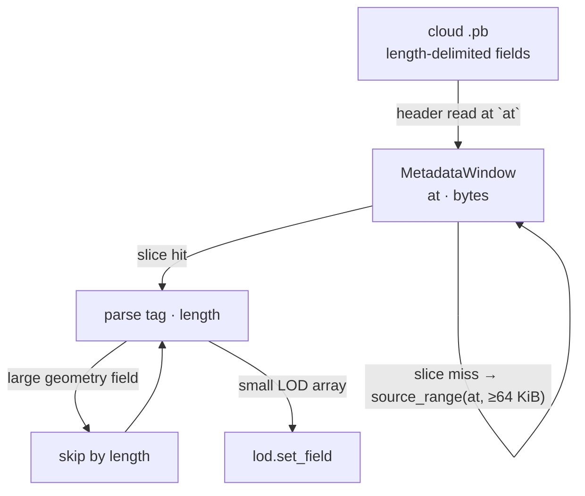
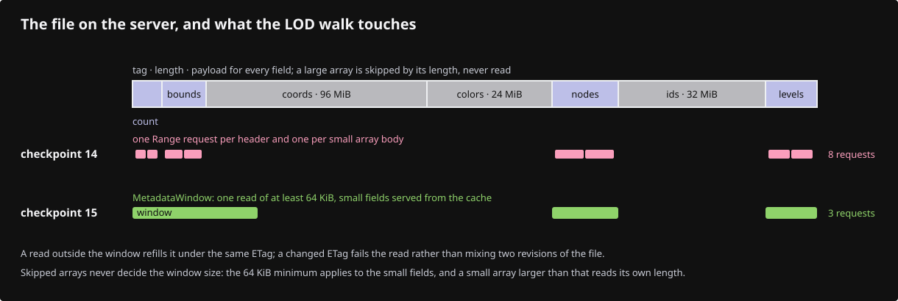
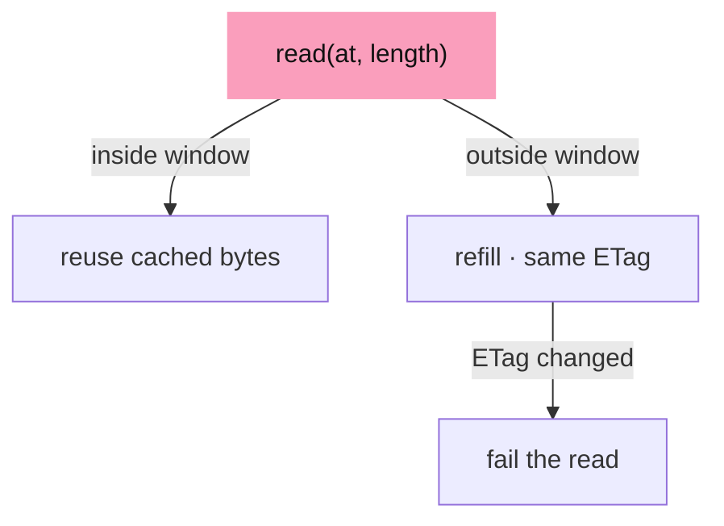
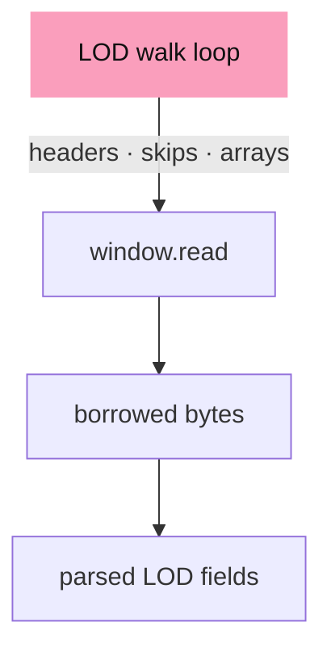
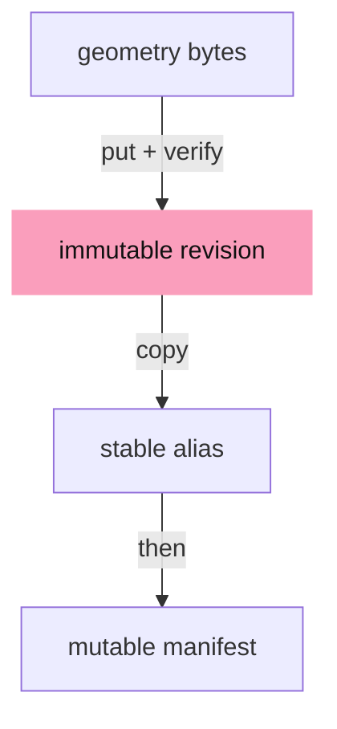

# 15 · Publication and streamed reads

## You are building

## Starting point

- Checkpoint 14: a streamed cloud locates its arrays with one small range request per protobuf header and one per array body.
- This lesson keeps the same parse and adds a bounded read-ahead window, so adjacent small fields share one request while large arrays are still skipped by length.

<!-- step-status: start -->

**Does it compile yet?** Yes, after every step of this lesson — `cargo check` was run at the end of each one to make sure. A step that writes a file Rust has not been told about yet compiles without checking any of it, so keep going to the checkpoint: that build is the real test.

<!-- step-status: end -->

## Step 1 · A bounded window over the metadata

{ .locator data-strip="illustrations/strip-2c1e2b3b5e.svg" }

- Skipped geometry fields never decide the window's size: `read_length` reads at least 64 KiB inside the file, larger only for an array that is itself larger, and never past `end`.
- `slice` borrows an exact cached range, including a valid empty range at the window's end.

<!-- file: 15 session_viewer/src/app/stream.rs type hunks=1-2 -->

## Step 2 · Refill only on a jump

{ .locator data-strip="illustrations/strip-2c1e2b3b5e.svg" }

- `read` reuses the window when the requested range is inside it and replaces it under the same exposed revision otherwise; a changed ETag fails the read instead of mixing two revisions.

<!-- file: 15 session_viewer/src/app/stream.rs type hunks=3-3 -->

## Step 3 · Route the LOD walk through the window

{ .locator data-strip="illustrations/strip-2c1e2b3b5e.svg" }

The loop is unchanged: headers, skips and array bodies now borrow from `window` instead of issuing their own requests.

<!-- file: 15 session_viewer/src/app/stream.rs type hunks=4-6 -->

A unit test of the range rules, part of the file:

<!-- file: 15 session_viewer/src/app/stream.rs copy hunks=7-7 -->

## Step 4 · Publication helpers

- Publishing writes the immutable geometry revision first, verifies it, then updates the alias and the mutable manifest, so a manifest never points at missing bytes.
- Credentials stay in the local shell helpers; nothing in the browser bundle can write to the bucket.

<!-- supplied: 15 -->

## Check

<!-- checkpoint: 15 -->

Expected:

- The local scene loads unchanged.
- A streamed cloud (`?scene=stream-test.yaml` with a local `?data=` server) still shows its display prefix and F10 still reaches source points beyond it.

## What changed

<!-- tree: 15 session_viewer/src/app -->

- `MetadataWindow` sits between `cloud_lod` and `source_range`; header and small-array reads share one cached range.
- Publication scripts under `bash/` write geometry, verify, alias, then manifest.

**Production equivalent:** `src/app/stream.rs`; `bash/view_put.sh`, `bash/view_live.sh`, `bash/lib/`.

## Try

- Open the browser's network panel while a streamed cloud loads and count the `Range` requests with and without the window: the header and node-table reads collapse into one window read.
- Lower the 64 KiB minimum in `read_length` to 1 KiB: the walk still succeeds, but every small field past the first kilobyte refills the window and the request count climbs back.
- Change the served file while the viewer is open so its ETag changes: the next read outside the window fails instead of mixing two revisions, and the status says so.

## Questions and answers

**The read window has a 64 KiB minimum, yet a large array is still skipped by its length. Why both rules?**

*How to work it out.* Picture the file: small metadata fields separated by huge geometry arrays. Ask what each rule is for. Reading only what you asked for costs one round-trip per field — dozens of them. Reading generously costs nothing extra for small fields but would swallow a geometry array whole.

*The answer.* The minimum makes adjacent small fields share one request; skipping by length keeps the window from ever pulling an array it does not need. Lower the minimum and the request count climbs back, as the lesson's own experiment shows; drop the skip and you download the file you were trying to avoid.

**A changed ETag fails the read instead of refilling the window. Defend that.**

*How to work it out.* Ask what you would be holding after a silent refill: offsets computed from revision 1 indexing bytes from revision 2. The result parses, because both are valid files — it is simply wrong geometry.

*The answer.* Failing is recoverable: reload and get a consistent revision. Mixing is not detectable after the fact, and a plausible wrong scene is the expensive failure. Same instinct as the empty mesh in lesson 07.

**Publication writes the immutable geometry revision first, verifies it, then updates the alias and the manifest. What invariant does that ordering protect?**

*How to work it out.* Ask what a reader arriving in the middle sees under each ordering. Manifest first: it names a file that is still uploading — a 404 or a truncated read. Geometry first: it names the old file, which is complete.

*The answer.* A manifest never points at bytes that do not exist. Every reader sees either the old complete scene or the new complete scene. Write the thing that is pointed *at* before the pointer — the same discipline as any atomic swap.

**Credentials live in the local shell helpers, never in the browser bundle. What follows from that?**

*How to work it out.* Ask what is public in a web app: the bundle, its constants, its query parameters, its network calls. Anything shipped can be read.

*The answer.* Publication is a local operation with local credentials, and the deployed viewer can only read. Worth stating because the temptation to add "just one" write endpoint is constant and its cost is not visible at the time.

**What you should be able to do now**

Say what the network panel shows with and without the window, and which number a user notices. Correct: without it, one range request per protobuf header and per small array — dozens of small requests; with it, the headers and node table collapse into a single window read, with the large arrays still fetched separately. The user never notices the count; they notice the *latency*, because dozens of sequential round-trips on a slow link is seconds of blank scene. For a local file the same optimisation is nearly worthless: a file read has no round-trip to amortise.

## Next

[16 · Resource accounting](16-accounting.md): what the viewer can and cannot measure about its own memory.
