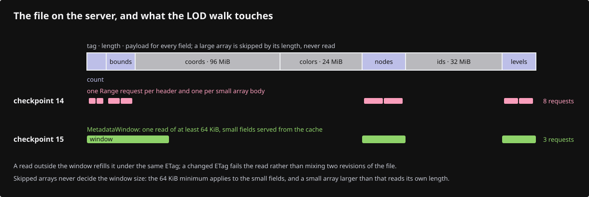

# 15 · Publication and streamed reads

**Estimated study time: about 35–65 hours.** Includes reading, typing, tracing, testing and experiments. [How to use this estimate](map.md#time-estimates).

**This section:** Read large published files through metadata and selected byte ranges.

**In the whole viewer:** Streaming supplies the scene loader and large-data drawing paths without requiring every byte up front.

**Follow the data:** Published metadata → array offsets → ranged reads → staged data → display.

**Start with these files:** [`src/app/stream.rs`](15-publication.md#code-15-022), [`src/app/fetch.rs`](14-loading.md#code-14-006).

**Aim to explain:** Why must metadata and later byte ranges refer to the same published file version?

[Whole-viewer map and course milestones](map.md)

A streamed file can be useful before the entire download finishes. First we read enough metadata to locate its arrays; then we request selected byte ranges. The offsets must refer to the exact same published file throughout the load.



Start from the working result of [step 14](14-loading.md).

**One buildable step:** type the additions below in `workspace/handwritten`, then build and test. This step adds 2,869 lines across 12 files and may take several sittings. Individual listings are parts of this step, not separate build checkpoints.

<span id="code-15-001"></span>

## `src/lib.rs`

Insert **after line 47** of your current file.

Keep these preceding lines:

```rust
    Ready(Box<State>),                              // GPU is up, here is the state
    File(FileDoc, Option<String>), // one loaded file; a display-only one names its file
    Clear,                         // empty the scene
    Fit,                           // frame the camera on everything
```

Keep these following lines:

```rust
    CancelPointer,                 // the browser lost the pointer
    Fonts(Vec<Vec<u8>>),           // the whole label fonts, main font first; register:loading
}
```

Type these new lines:

```rust
--8<-- "typing/code/15-001.rs"
```

<span id="code-15-002"></span>

## `src/lib.rs`

Insert **after line 166** of your current file.

Keep these preceding lines:

```rust
            Msg::Clear => state.clear(),
            Msg::Fit => state.fit_loaded(),
            Msg::File(doc, source) => state.append(doc, source),
            Msg::Fonts(faces) => self.use_fonts(faces),   // register:loading
```

Keep these following lines:

```rust
            Msg::CancelPointer => {
                self.input.cancel();
                state.touch();
            }
```

Type these new lines:

```rust
--8<-- "typing/code/15-002.rs"
```

<span id="code-15-003"></span>

## `src/lib.rs`

Append **after line 314** of your current file.

Blank lines before: **1**; after: **0**. End with a newline.

```rust
--8<-- "typing/code/15-003.rs"
```

<span id="code-15-004"></span>

## `src/app/cloud_query.rs`

A cloud query asks for samples near a region or view rather than reading every point. The result has an identity and a lifetime. A later query may make an earlier result obsolete before it arrives.

Create this file. Type the complete listing, including comments and blank lines.

```rust
--8<-- "typing/code/15-004.rs"
```

<span id="code-15-005"></span>

## `src/app/loader.rs`

Insert **after line 92** of your current file.

Keep these preceding lines:

```rust

/// Clear the scene and stop every stream.
fn clear_scene() {
    GENERATION.set(GENERATION.get().wrapping_add(1));
```

Keep these following lines:

```rust
    RESIDENT.set(0);
    SHEET_RESIDENT.set(0);
    post(Msg::Clear);
}
```

Type these new lines:

```rust
--8<-- "typing/code/15-005.rs"
```

<span id="code-15-006"></span>

## `src/app/loader.rs`

Insert **after line 319** of your current file.

Keep these preceding lines:

```rust
        // the first 8 KB, read once: the cloud and sheet checks and the size come from it;
        // an encoded file is never range-read
        let (head, body) = match ahead.take() {
            Some(read) => read.wait().await,
```

Keep these following lines:

```rust
            None => (None, None),
        };

        if let Some(next) = manifest.items.get(i + 1)
```

Type these new lines:

```rust
--8<-- "typing/code/15-006.rs"
```

<span id="code-15-007"></span>

## `src/app/loader.rs`

Insert **after line 465** of your current file.

Keep these preceding lines:

```rust

        for document in pending {
            match document {
                PendingDocument::Whole(doc, source) => _ = post(Msg::File(doc, source)),
```

Keep these following lines:

```rust
            }
        }
    }
```

Type these new lines:

```rust
--8<-- "typing/code/15-007.rs"
```

<span id="code-15-008"></span>

## `src/app/loader.rs`

Insert **after line 503** of your current file.

Keep these preceding lines:

```rust
        let read = Rc::new(RefCell::new((None, None)));
        let (slot, target) = (read.clone(), url.clone());
        let probed = wasm_bindgen_futures::future_to_promise(async move {
            if encoded.is_none() {
```

Keep these following lines:

```rust
            }

            Ok(JsValue::UNDEFINED)
        });
```

Type these new lines:

```rust
--8<-- "typing/code/15-008.rs"
```

<span id="code-15-009"></span>

## `src/app/loader.rs`

Insert **after line 528** of your current file.

Keep these preceding lines:

```rust
            let whole = match encoded {
                Some(size) => size <= room,
                None => slot.borrow().0.as_ref().is_some_and(|head| {
                    head.status == 206
```

Keep these following lines:

```rust
                        && head
                            .total
                            .is_some_and(|total| total > head.bytes.len() as u64 && total <= room)
                }),
```

Type these new lines:

```rust
--8<-- "typing/code/15-009.rs"
```

<span id="code-15-010"></span>

## `src/app/loader.rs`

Insert **after line 557** of your current file.

Keep these preceding lines:

```rust

/// One staged item of a reload.
enum PendingDocument {
    Whole(FileDoc, Option<String>), // a decoded file and, when display-only, its file
```

Keep these following lines:

```rust
}

/// True when a body starts with the gzip magic.
fn packed(body: &Body) -> bool {
```

Type these new lines:

```rust
--8<-- "typing/code/15-010.rs"
```

<span id="code-15-011"></span>

## `src/app/loader.rs`

Insert **after line 600** of your current file.

Keep these preceding lines:

```rust

/// A probed file that streams: its first slice is posted, or staged for a reload; `Err` tells the
/// manifest loop what comes next, `Ok` loads the file whole.
async fn stream_item(cx: &mut ItemCx<'_>, head: &Reply, slot: &Placement) -> Result<(), Step> {
```

Keep these following lines:

```rust
    Ok(())
}

/// Name and placement of a streamed document.
```

Type these new lines:

```rust
--8<-- "typing/code/15-011.rs"
```

<span id="code-15-012"></span>

## `src/app/loader.rs`

Append **after line 639** of your current file.

Blank lines before: **1**; after: **0**. End with a newline.

```rust
--8<-- "typing/code/15-012.rs"
```

<span id="code-15-013"></span>

## `src/app/mod.rs`

Insert **after line 2** of your current file.

Keep these preceding lines:

```rust
// `pub mod x;` makes src/app/x.rs part of the crate; each lesson adds the one line of the module it teaches.
// `#[cfg(target_arch = "wasm32")]` above a line compiles that module for the browser only.
```

Keep these following lines:

```rust
#[cfg(any(target_arch = "wasm32", test))] // register:decode
pub mod decode; // register:decode
pub mod feedback; // register:feedback
#[cfg(target_arch = "wasm32")] // register:fetch
```

Type these new lines:

```rust
--8<-- "typing/code/15-013.rs"
```

<span id="code-15-014"></span>

## `src/app/mod.rs`

Insert **after line 26** of your current file.

Keep these preceding lines:

```rust
#[cfg(target_arch = "wasm32")] // register:route
pub mod route; // register:route
pub mod scene; // register:scene
pub mod selection; // register:selection
```

Keep these following lines:

```rust
pub mod touch; // register:touch
pub mod validate; // register:validate
pub mod walk; // register:walk
```

Type these new lines:

```rust
--8<-- "typing/code/15-014.rs"
```

<span id="code-15-015"></span>

## `src/app/scene.rs`

Insert **after line 54** of your current file.

Keep these preceding lines:

```rust
/// The open documents and their object rows; a row id stays with its object for the object's life.
pub struct Scene {
    pub docs: Vec<FileDoc>,                              // loaded files
    pub tables: Upload,                                  // rows walked but not yet uploaded
```

Keep these following lines:

```rust
    pub hidden: HashSet<(usize, Rc<str>)>,               // (document, guid) hidden
    pub locked: HashSet<(usize, Rc<str>)>,               // (document, guid) not selectable
    pub colors: HashMap<(usize, Rc<str>), [u8; 3]>,      // face colour overrides
    pub edge_colors: HashMap<(usize, Rc<str>), [u8; 3]>, // edge colour overrides
```

Type these new lines:

```rust
--8<-- "typing/code/15-015.rs"
```

<span id="code-15-016"></span>

## `src/app/scene.rs`

Insert **after line 92** of your current file.

Keep these preceding lines:

```rust
    pub(crate) current_layer: Option<(usize, String)>, // (document, tree node) new objects go to
    pub(crate) layer_steps: u64,                      // layer steps made, for unique labels
    pub(crate) groups: HashSet<(usize, Rc<str>)>, // (document, tree node guid) of each group
    pub(crate) text_rows: Vec<u32>, // text rows an undo, redo or delete showed or hid, for the GPU
```

Keep these following lines:

```rust
    #[cfg(test)]
    pub(crate) ledger: HashMap<u32, ObjectRow>, // object rows as the GPU would hold them
    #[cfg(test)]
    pub(crate) searches: usize,   // tree walks the syncs needed
```

Type these new lines:

```rust
--8<-- "typing/code/15-016.rs"
```

<span id="code-15-017"></span>

## `src/app/scene.rs`

Insert **after line 118** of your current file.

Keep these preceding lines:

```rust
    pub fn new() -> Self {
        Self {
            docs: Vec::new(),
            tables: Upload::default(),
```

Keep these following lines:

```rust
            hidden: HashSet::new(),
            locked: HashSet::new(),
            colors: HashMap::new(),
            edge_colors: HashMap::new(),
```

Type these new lines:

```rust
--8<-- "typing/code/15-017.rs"
```

<span id="code-15-018"></span>

## `src/app/scene.rs`

Insert **after line 156** of your current file.

Keep these preceding lines:

```rust
            current_layer: None,
            layer_steps: 0,
            groups: HashSet::new(),
            text_rows: Vec::new(),
```

Keep these following lines:

```rust
            #[cfg(test)]
            ledger: HashMap::new(),
            #[cfg(test)]
            searches: 0,
```

Type these new lines:

```rust
--8<-- "typing/code/15-018.rs"
```

<span id="code-15-019"></span>

## `src/app/scene.rs`

Insert **after line 186** of your current file.

Keep these preceding lines:

```rust
    /// Forget every row.
    fn reset_rows(&mut self) {
        self.row_revision = self.row_revision.wrapping_add(1);
        self.tables = Upload::default();
```

Keep these following lines:

```rust
        self.order.clear();
        self.owners.clear();
        self.feet.clear();
        self.nodes.clear();
```

Type these new lines:

```rust
--8<-- "typing/code/15-019.rs"
```

<span id="code-15-020"></span>

## `src/app/scene.rs`

Insert **after line 282** of your current file.

Keep these preceding lines:

```rust

            if incoming > 0 && self.dead_points > 0 && !gpu.cloud.fits(&gpu.ctx, incoming) {
            }
```

Keep these following lines:

```rust
            gpu.set_scene(&self.tables);

            // a loaded document re-centres the origin at the camera, as it always did; an edit keeps it
            if std::mem::take(&mut self.loaded) {
```

Type these new lines:

```rust
--8<-- "typing/code/15-020.rs"
```

<span id="code-15-021"></span>

## `src/app/scene.rs`

Append **after line 828** of your current file.

Blank lines before: **1**; after: **0**. End with a newline.

```rust
--8<-- "typing/code/15-021.rs"
```

<span id="code-15-022"></span>

## `src/app/stream.rs`

Streaming lets a large scene become useful before every byte is loaded. Publication must preserve ownership and order, and cancelled work must stop affecting the live scene. Progress is separate from correctness: partial data still needs valid mappings.

Create this file. Type the complete listing, including comments and blank lines.

```rust
--8<-- "typing/code/15-022.rs"
```

<span id="code-15-023"></span>

## `src/app/walk/cloud.rs`

Append **after line 141** of your current file.

Blank lines before: **1**; after: **1**. End with a newline.

```rust
--8<-- "typing/code/15-023.rs"
```

<span id="code-15-024"></span>

## `src/state.rs`

Insert **after line 11** of your current file.

Keep these preceding lines:

```rust
use crate::engine::gpu::{CylinderSegment, GlyphPoint};
use crate::engine::gpu::{FrameInput, Gpu, Pick};
use crate::engine::performance::{heap_mb, now_ms};
// Each `mod` line below carries a `register` tag naming its feature; the course adds the line in that feature's lesson.
```

Keep these following lines:

```rust
mod features; // register:features
use features::Features;
use std::sync::Arc;
use winit::window::Window;
```

Type these new lines:

```rust
--8<-- "typing/code/15-024.rs"
```

<span id="code-15-025"></span>

## `src/state.rs`

Insert **after line 233** of your current file.

Keep these preceding lines:

```rust
    }

    /// Something changed: drop pending picks, draw again.
    pub fn touch(&mut self) {
```

Keep these following lines:

```rust
        self.gpu.pick.cancel();
        self.dirty = true;
        self.needs_frame = true;
    }
```

Type these new lines:

```rust
--8<-- "typing/code/15-025.rs"
```

<span id="code-15-026"></span>

## `src/state.rs`

Insert **after line 476** of your current file.

Keep these preceding lines:

```rust
                return;
            }

            crate::app::feedback::error(&message);
```

Keep these following lines:

```rust
            self.gpu.pick.cancel();
            self.needs_frame = false;
            return;
        }
```

Type these new lines:

```rust
--8<-- "typing/code/15-026.rs"
```

<span id="code-15-027"></span>

## `src/state.rs`

Insert **after line 486** of your current file.

Keep these preceding lines:

```rust
        // apply a pick answer first, so this frame shows it
        if let Some(pick) = self.gpu.pick.poll() {
            self.apply_pick(pick);
        } else {
```

Keep these following lines:

```rust
        }

        self.needs_frame = false;
```

Type these new lines:

```rust
--8<-- "typing/code/15-027.rs"
```

<span id="code-15-028"></span>

## `src/state.rs`

Insert **after line 496** of your current file.

Keep these preceding lines:

```rust
            hook(self);
        }

        if self.gpu.view.spin {
```

Keep these following lines:

```rust
            self.camera.orbit(SPIN_STEP, 0.0);
        }

        let now_ms = now_ms();
```

Type these new lines:

```rust
--8<-- "typing/code/15-028.rs"
```

<span id="code-15-029"></span>

## `src/state.rs`

Insert **after line 524** of your current file.

Keep these preceding lines:

```rust

        let mut dropped = false;
        // starts false; a later feature ORs in its own reason on a line of its own, so this line never changes
        let mut waiting = false;
```

Keep these following lines:

```rust

        if self.dirty && !waiting {
            let gap = now_ms - self.last_frame_ms; // time since the last frame
            self.last_frame_ms = now_ms;
```

Type these new lines:

```rust
--8<-- "typing/code/15-029.rs"
```

<span id="code-15-030"></span>

## `src/state.rs`

Insert **after line 598** of your current file.

Keep these preceding lines:

```rust
        let face = !splitting
            && (face || self.selection_tool == crate::app::selection::SelectionTool::Face);
        let edge = !splitting
            && (edge || self.selection_tool == crate::app::selection::SelectionTool::Edge);
```

Keep these following lines:

```rust
        self.gpu.pick.cancel();

        // a point cloud answers by its own query
        let mut queried = false;
```

Type these new lines:

```rust
--8<-- "typing/code/15-030.rs"
```

<span id="code-15-031"></span>

## `src/state.rs`

Insert **after line 603** of your current file.

Keep these preceding lines:

```rust
        self.gpu.pick.cancel();

        // a point cloud answers by its own query
        let mut queried = false;
```

Keep these following lines:

```rust

        if queried {
            return;
        }
```

Type these new lines:

```rust
--8<-- "typing/code/15-031.rs"
```

<span id="code-15-032"></span>

## `src/state.rs`

Insert **after line 746** of your current file.

Keep these preceding lines:

```rust

        // the points come from the source geometry
        let controls = match self.scene.geometry(parent) {
            Some(geometry) => Controls::from_geometry(geometry),
```

Keep these following lines:

```rust
            None => {
                self.status("Source controls are unavailable for this display-only object");
                return;
            }
```

Type these new lines:

```rust
--8<-- "typing/code/15-032.rs"
```

<span id="code-15-033"></span>

## `src/state.rs`

Append **after line 873** of your current file.

Blank lines before: **1**; after: **0**. End with a newline.

```rust
--8<-- "typing/code/15-033.rs"
```

<span id="code-15-034"></span>

## `src/state/cloud_query.rs`

Create this file. Type the complete listing, including comments and blank lines.

```rust
--8<-- "typing/code/15-034.rs"
```

<span id="code-15-035"></span>

## `src/state/features.rs`

Insert **after line 6** of your current file.

Keep these preceding lines:

```rust
/// What each feature keeps between frames; a feature adds its own file and one line here.
// Every field starts from its Default, so `State::new` never names one.
#[derive(Default)]
pub(crate) struct Features {
```

Keep these following lines:

```rust
}

// Each list starts empty; a later lesson adds one line per hook.
// `fn(&mut State)` is a function pointer; a method such as `State::purge_idle` is one, with `self` as its first argument.
```

Type these new lines:

```rust
--8<-- "typing/code/15-035.rs"
```

<span id="code-15-036"></span>

## `src/state/features.rs`

Insert **after line 23** of your current file.

Keep these preceding lines:

```rust
];

/// Features that take a pick answer before the selection does, in this order.
pub(super) const TAKE_PICK: &[fn(&mut State, Option<crate::engine::gpu::Pick>) -> bool] = &[
```

Keep these following lines:

```rust
];

/// Features that widen what a viewport click on a row selects, e.g. to its whole group.
pub(super) const CLICK_ROWS: &[fn(&State, u32) -> Option<Vec<u32>>] = &[
```

Type these new lines:

```rust
--8<-- "typing/code/15-036.rs"
```

<span id="code-15-037"></span>

## `tests/publication.py`

Create this file. Type the complete listing, including comments and blank lines.

```python
--8<-- "typing/code/15-037.py"
```

<span id="code-15-038"></span>

## `tests/streamed-controls.cjs`

Create this file. Type the complete listing, including comments and blank lines.

```javascript
--8<-- "typing/code/15-038.cjs"
```

## Check the completed chapter

From `session_viewer`, compare everything you have typed:

```sh
npm --prefix ../session_tests run course -- reference-check 15
```

From `workspace/handwritten`:

```sh
cargo build --lib --locked -j4
cargo xtest --lib --locked -j4
```

Run the native streaming tests. Read one range calculation you typed and label its units: bytes, points or rows. Publishing to a remote service is not required for this lesson.

If decoded values look random, check the requested range, the server’s range response and the element size. Never mix offsets from one file revision with bytes from another.

**Before moving on:** explain what changed, check the expected result above, and fix any build or test failure.

<details>
<summary>Check your explanation of the opening question</summary>

The metadata describes the offsets and layout of that version. Mixing versions can interpret unrelated bytes as valid geometry.

</details>

[Next step: 16](16-accounting.md)
