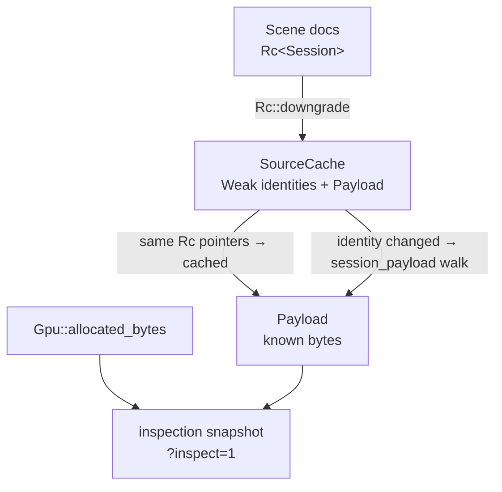
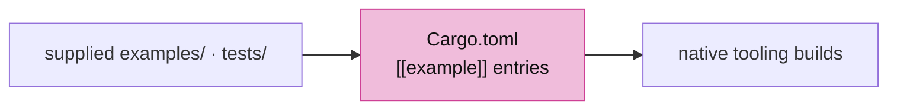
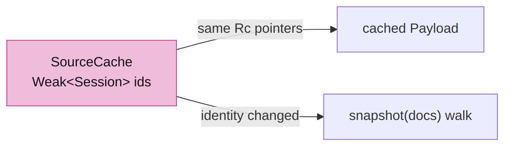
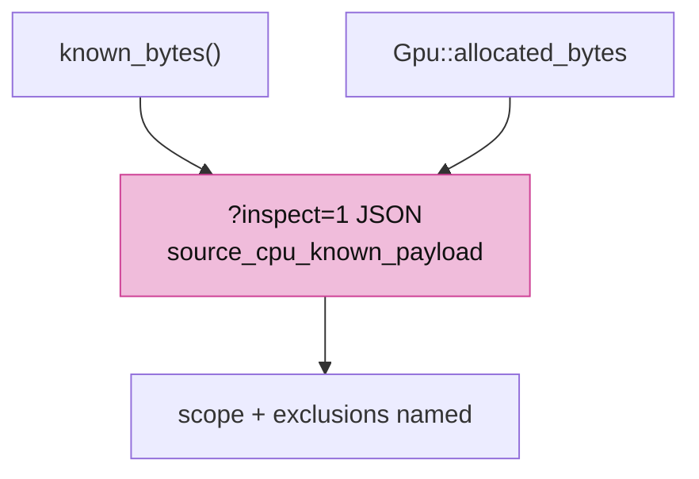

# 16 · Resource accounting

## You are building



## Starting point

- Checkpoint 15: the inspection snapshot reports owned GPU buffer and texture bytes.
- This lesson adds a known-payload figure for retained source documents, kept in a cache that cannot extend their lifetime, and declares the native tooling the production crate ships with.

## Step 1 · Native tooling the crate declares

`Cargo.toml` will name native examples; their sources and the offscreen harness are supplied, not taught. Install them now so the manifest can refer to them.



<!-- supplied: 16 -->

<!-- file: 16 session_viewer/Cargo.toml copy -->

## Step 2 · Count what is knowable, name what is not


- The number is a lower bound: exact `Vec`/`String` capacities, occupied map entries and exposed slice lengths, never allocator overhead or RSS.
- Shared values are counted once: each `Rc` object is recorded by pointer in a `seen` set, so a document listed twice or a geometry in both a typed list and the lookup adds nothing twice.


<!-- file: 16 session_viewer/src/app/inspection/source_memory.rs type lines=1-52 -->

- A `Weak<Session>` recognizes a document without keeping it alive; if every `Rc` pointer matches the last snapshot, the cached payload is returned without a walk.
- In-place editing of a document would make this cache stale; replacement and append change identity, which is what the cache keys on.



<!-- file: 16 session_viewer/src/app/inspection/source_memory.rs type lines=53-95 -->

<!-- file: 16 session_viewer/src/app/inspection/source_memory.rs type lines=96-200 -->

Per-type payload walks, one function per geometry kind:

<!-- file: 16 session_viewer/src/app/inspection/source_memory.rs copy lines=201-432 -->

Unit tests, part of the file:

<!-- file: 16 session_viewer/src/app/inspection/source_memory.rs copy lines=433-510 -->

<!-- check: 16 -->

## Step 3 · Report it beside the GPU figures

- The snapshot names its scope and exclusions in the JSON itself, so a reader of `?inspect=1` cannot mistake the payload for total heap.



<!-- file: 16 session_viewer/src/app/inspection.rs type -->

## Check

<!-- checkpoint: 16 -->

Expected:

- The local scene renders as before.
- The canvas `data-viewer-inspection` attribute now carries `source_cpu_known_payload_bytes`, `source_cpu_known_payload`, `source_cpu_scope` and `source_cpu_exclusions`.
- Reload the same scene: `scans` in the payload stays at one per document identity change, not one per frame.

The accounting part of the snapshot for the local fixture, read from the canvas attribute in the browser console:

```js
JSON.parse(document.querySelector("#canvas").dataset.viewerInspection)
```

```json
{
  "gpu_buffer_capacity_bytes": 661992,
  "gpu_texture_estimate_bytes": 39200008,
  "source_cpu_known_payload_bytes": 26940,
  "source_cpu_known_payload": {
    "exposed_slice_bytes": 2240,
    "occupied_map_entry_bytes": 996,
    "scans": 1,
    "shared_value_bytes": 3120,
    "string_capacity_bytes": 1424,
    "unique_geometry_values": 7,
    "unique_sessions": 1,
    "vector_capacity_bytes": 19160
  },
  "source_cpu_scope": "retained Session arrays/strings/values; Rc objects deduplicated; not RSS or total heap",
  "source_cpu_exclusions": "allocator/Rc/map overhead and spare map slots, \u2026"
}
```


## What changed

<!-- tree: 16 session_viewer/src/app -->

- `SourceCache` (weak identities) → `Payload` (known bytes) → inspection snapshot.
- Four separate measurements now sit side by side and mean different things: retained source payload, owned GPU buffers, estimated texture bytes, and whatever the browser reports for WASM memory.

**Production equivalent:** `src/app/inspection.rs`, `src/app/inspection/source_memory.rs`, `Cargo.toml`.

## Try

- Read the snapshot twice a few seconds apart: `scans` stays at 1, because the document identities did not change.
- Load a different manifest with `?scene=` and read it again: `unique_sessions` follows the document count and `scans` grew by exactly the number of new documents.
- Compare `source_cpu_known_payload_bytes` with `gpu_buffer_capacity_bytes`: the GPU side is larger, because display data adds tessellation and instance rows to the retained source arrays.
- Hold a second `Rc` to a document somewhere in `State` and replace the scene: the payload figure keeps counting it, which is the leak the Weak identities are there to expose.

## Next

[17 · Faces, text objects and silhouettes](17-source-presentation.md): source-face selection, selectable authored text and one black outline.
