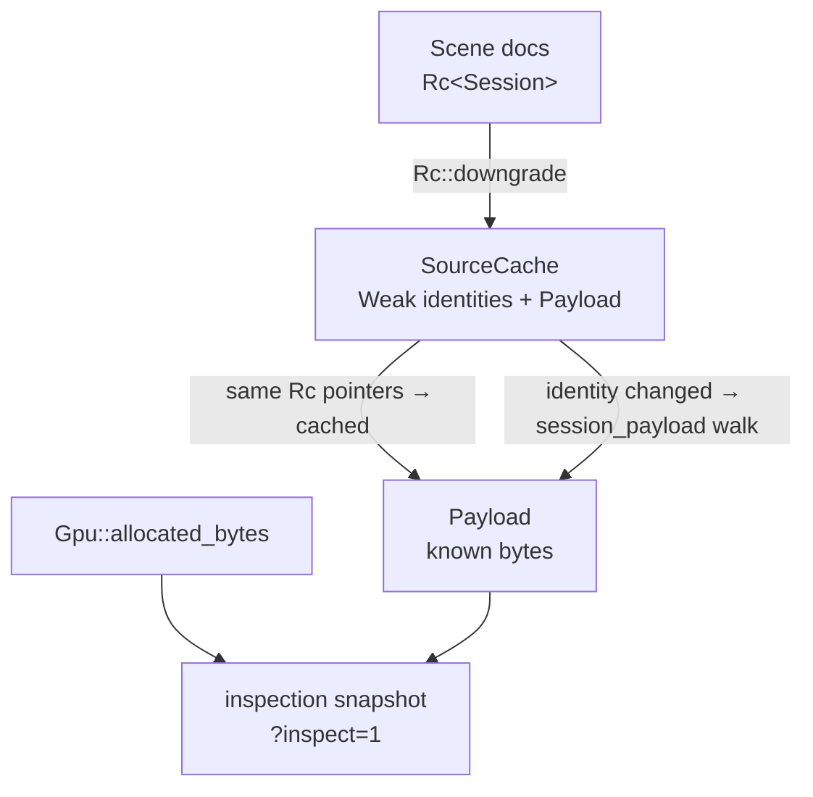
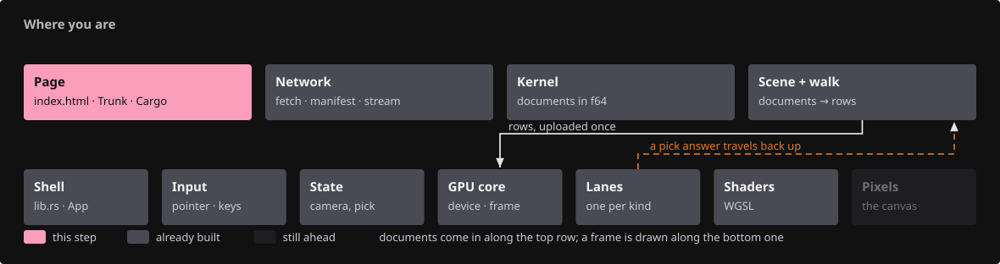
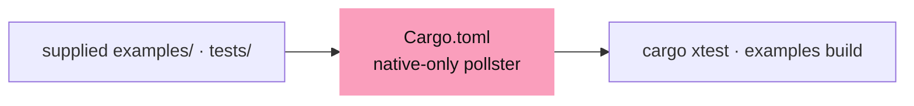
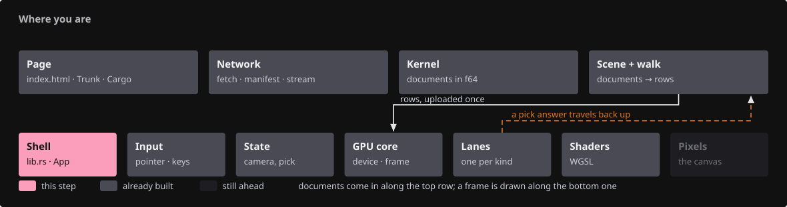
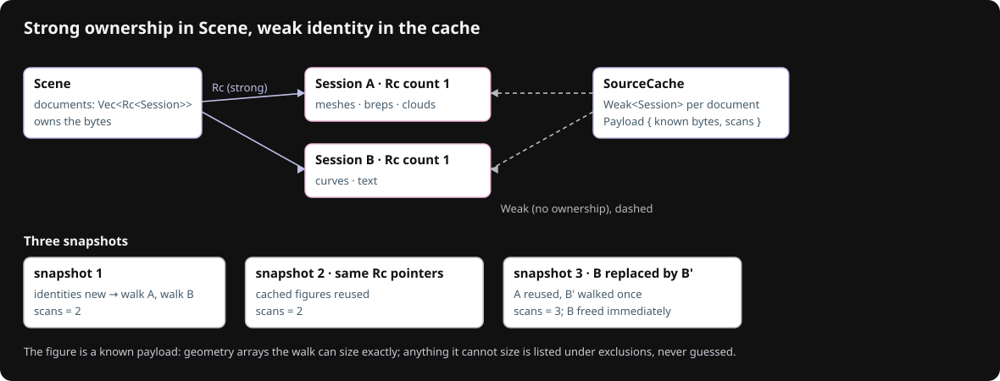
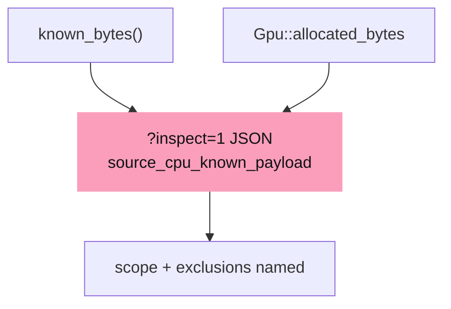
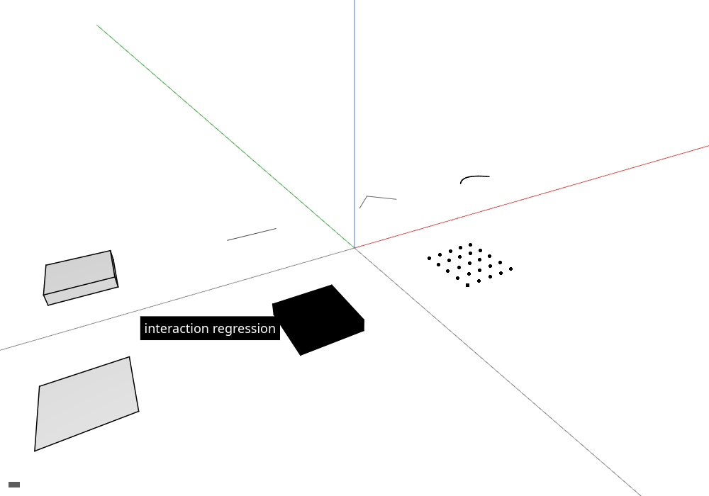

# 16 · Resource accounting

## You are building



## Starting point

- Checkpoint 15: the inspection snapshot reports owned GPU buffer and texture bytes.
- This lesson adds a known-payload figure for retained source documents, kept in a cache that cannot extend their lifetime, and declares the native tooling the production crate ships with.

<!-- step-status: start -->

**Does it compile yet?** Yes, after every step of this lesson — `cargo check` was run at the end of each one to make sure. A step that writes a file Rust has not been told about yet compiles without checking any of it, so keep going to the checkpoint: that build is the real test.

<!-- step-status: end -->

## Step 1 · Native tooling the crate declares

{ .locator data-strip="illustrations/strip-e6f4fee67c.svg" }

Cargo discovers every file under `examples/` as a native example; their sources and the offscreen harness are supplied, not taught. Install them now, and give the manifest its native-only dependency.



<!-- supplied: 16 -->

<span class="zone-mark" data-strip="illustrations/strip-e6f4fee67c.svg" data-zone="Page"></span>

<!-- file: 16 session_viewer/Cargo.toml copy -->

## Step 2 · Count what is knowable, name what is not

{ .locator data-strip="illustrations/strip-56723afb3a.svg" }



- The number is a lower bound: exact `Vec`/`String` capacities, occupied map entries and exposed slice lengths, never allocator overhead or RSS.
- Shared values are counted once: each `Rc` object is recorded by pointer in a `seen` set, so a document listed twice or a geometry in both a typed list and the lookup adds nothing twice.

<span class="zone-mark" data-strip="illustrations/strip-56723afb3a.svg" data-zone="Shell"></span>

<!-- file: 16 session_viewer/src/app/inspection/source_memory.rs type lines=1-52 -->

- A `Weak<Session>` recognizes a document without keeping it alive; if every `Rc` pointer matches the last snapshot, the cached payload is returned without a walk.
- In-place editing of a document would make this cache stale; replacement and append change identity, which is what the cache keys on.

<span class="zone-mark" data-strip="illustrations/strip-56723afb3a.svg" data-zone="Shell"></span>

<!-- file: 16 session_viewer/src/app/inspection/source_memory.rs type lines=53-95 -->

<span class="zone-mark" data-strip="illustrations/strip-56723afb3a.svg" data-zone="Shell"></span>

<!-- file: 16 session_viewer/src/app/inspection/source_memory.rs type lines=96-140 -->

Per-type payload walks, one function per geometry kind:

<span class="zone-mark" data-strip="illustrations/strip-56723afb3a.svg" data-zone="Shell"></span>

<!-- file: 16 session_viewer/src/app/inspection/source_memory.rs copy lines=141-363 -->

Unit tests, part of the file:

<span class="zone-mark" data-strip="illustrations/strip-56723afb3a.svg" data-zone="Shell"></span>

<!-- file: 16 session_viewer/src/app/inspection/source_memory.rs copy lines=364-487 -->

<!-- check: 16 -->

## Step 3 · Report it beside the GPU figures

{ .locator data-strip="illustrations/strip-56723afb3a.svg" }

- The snapshot names its scope and exclusions in the JSON itself, so a reader of `?inspect=1` cannot mistake the payload for total heap.



<span class="zone-mark" data-strip="illustrations/strip-56723afb3a.svg" data-zone="Shell"></span>

<!-- file: 16 session_viewer/src/app/inspection.rs type -->

## Check

<!-- checkpoint: 16 -->

Expected:

- The local scene renders as before.
- The canvas `data-viewer-inspection` attribute now carries `source_cpu_known_payload_bytes`, `source_cpu_known_payload`, `source_cpu_scope` and `source_cpu_exclusions`.
- Reload the same scene: `scans` in the payload stays at one per document identity change, not one per frame.

The accounting part of the snapshot for the local fixture, read from the canvas attribute in the browser console:

```js
JSON.parse(document.querySelector("#canvas").dataset.viewerInspection)
```

```json
{
  "gpu_buffer_capacity_bytes": 661992,
  "gpu_texture_estimate_bytes": 39200008,
  "source_cpu_known_payload_bytes": 26940,
  "source_cpu_known_payload": {
    "exposed_slice_bytes": 2240,
    "occupied_map_entry_bytes": 996,
    "scans": 1,
    "shared_value_bytes": 3120,
    "string_capacity_bytes": 1424,
    "unique_geometry_values": 7,
    "unique_sessions": 1,
    "vector_capacity_bytes": 19160
  },
  "source_cpu_scope": "retained Session arrays/strings/values; Rc objects deduplicated; not RSS or total heap",
  "source_cpu_exclusions": "allocator/Rc/map overhead and spare map slots, \u2026"
}
```



## What changed

<!-- tree: 16 session_viewer/src/app -->

- `SourceCache` (weak identities) → `Payload` (known bytes) → inspection snapshot.
- Four separate measurements now sit side by side and mean different things: retained source payload, owned GPU buffers, estimated texture bytes, and whatever the browser reports for WASM memory.

**Production equivalent:** `src/app/inspection.rs`, `src/app/inspection/source_memory.rs`, `Cargo.toml`.

## Try

- Read the snapshot twice a few seconds apart: `scans` stays at 1, because the document identities did not change.
- Load a different manifest with `?scene=` and read it again: `unique_sessions` follows the document count and `scans` grew by exactly the number of new documents.
- Compare `source_cpu_known_payload_bytes` with `gpu_buffer_capacity_bytes`: the GPU side is larger, because display data adds tessellation and instance rows to the retained source arrays.
- Hold a second `Rc` to a document somewhere in `State` and replace the scene: the payload figure keeps counting it, which is the leak the Weak identities are there to expose.

## Questions and answers

**The figure is called a *known payload*, not memory use. Why is the honesty in the name worth the words?**

*How to work it out.* List what the walk can actually count: `Vec` and `String` capacities, occupied map entries, slice lengths. Then list what it cannot: allocator overhead, `Rc` headers, spare map slots, GPU-side memory, anything the browser holds outside the wasm heap. A name like "memory use" claims the second list too.

*The answer.* The number is a lower bound over a defined set, so it is named after that set — and the snapshot carries its own scope and exclusions as JSON fields, so a reader cannot mistake one for the other. A measurement you cannot defend is worse than no measurement, because people quote it.

**The cache holds `Weak<Session>`, not `Rc<Session>`. What breaks with `Rc`?**

*How to work it out.* Ask what the cache is for: recognising documents it has already measured. Then ask what holding an `Rc` does: keeps them alive. A cache that never forgets, holding strong references, is a leak.

*The answer.* Nothing would ever drop, the figure would grow forever, and the instrument would be causing the leak it is meant to measure. `Weak` recognises a document without extending its life, and when every pointer still matches the last snapshot the cached payload is returned with no walk at all.

**The cache keys on identity, so in-place editing would make it stale. Why is that acceptable here?**

*How to work it out.* Ask how documents actually change in this system. They are replaced or appended to — both change the `Rc` identity, which is what the cache watches. Mutating through `lookup` is possible in principle and is not done.

*The answer.* The invariant is real but unenforced by the type system, so it is written down. Recognising "this is only safe because of a convention elsewhere" and saying so is what separates a comment worth reading from noise.

**Four numbers now sit side by side. Why not add them up?**

*How to work it out.* Ask what each measures and how. Retained source payload: counted, CPU, exact over a defined set. GPU buffer bytes: counted, GPU, capacity not use. Texture bytes: estimated from formats and sizes. Wasm memory: reported by the browser, includes everything. Different places, different methods, different exactness.

*The answer.* A sum would be a number with no meaning that people would nonetheless quote — and it would double-count, since the GPU buffers were built from the source arrays. Keeping them apart forces the reader to ask which question they are actually asking.

**What you should be able to do now**

Name something the viewer cannot measure about itself and say how you would find out anyway. Correct: it cannot measure its own resident set — allocator overhead, fragmentation and the browser's own structures are invisible from inside the wasm heap, and `WebAssembly.Memory` reports pages reserved, not bytes live. You find out with a different tool: the browser's memory profiler, or `performance.measureUserAgentSpecificMemory()`. Some questions are not answerable from inside the program, and recognising those saves you from writing code that pretends otherwise.

## Next

[17 · Faces, text objects and silhouettes](17-source-presentation.md): source-face selection, selectable authored text and one black outline.
