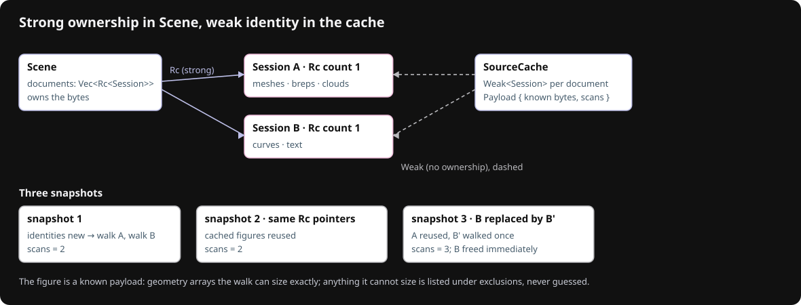

# 16 · Resource accounting and release

**Estimated study time: about 75–150 hours.** Includes reading, typing, tracing, testing and experiments. [How to use this estimate](map.md#time-estimates).

**This section:** Track shared CPU/GPU allocations and release resources at the right time.

**In the whole viewer:** This controls the lifetime and cost of the viewer’s representations as scenes change, grow and disappear.

**Follow the data:** Scene ownership → shared allocations → accounting → reset or release.

**Start with these files:** [`src/app/inspection/source_memory.rs`](16-accounting.md#code-16-020), [`src/app/scene_release.rs`](16-accounting.md#code-16-027).

**Aim to explain:** Why can dropping a CPU reference fail to return the corresponding GPU allocation immediately?

[Whole-viewer map and course milestones](map.md)

Two objects can refer to the same allocation. Adding its size for every reference would exaggerate memory use. Resource accounting therefore tracks which shared allocations it has already seen. Releasing an unused GPU resource is a separate operation from merely forgetting a CPU reference.



Start from the working result of [step 15](15-publication.md).

**One buildable step:** type the additions below in `workspace/handwritten`, then build and test. This step adds 7,153 lines across 39 files and may take several sittings. Individual listings are parts of this step, not separate build checkpoints.

<span id="code-16-001"></span>

## `assets/pb/.gitkeep`

Git records files rather than empty directories. This empty placeholder preserves a directory expected by the build. There is deliberately no code to type into it.

Create this file. Type the complete listing, including comments and blank lines.

Leave this file empty.

<span id="code-16-002"></span>

## `examples/add_lod.rs`

Create this file. Type the complete listing, including comments and blank lines.

```rust
--8<-- "typing/code/16-002.rs"
```

<span id="code-16-003"></span>

## `examples/cad_boundary_audit.rs`

Create this file. Type the complete listing, including comments and blank lines.

```rust
--8<-- "typing/code/16-003.rs"
```

<span id="code-16-004"></span>

## `examples/cad_fixture.rs`

Create this file. Type the complete listing, including comments and blank lines.

```rust
--8<-- "typing/code/16-004.rs"
```

<span id="code-16-005"></span>

## `examples/census_plates.rs`

Create this file. Type the complete listing, including comments and blank lines.

```rust
--8<-- "typing/code/16-005.rs"
```

<span id="code-16-006"></span>

## `examples/check_determinism.rs`

Create this file. Type the complete listing, including comments and blank lines.

```rust
--8<-- "typing/code/16-006.rs"
```

<span id="code-16-007"></span>

## `examples/interaction_fixture.rs`

Create this file. Type the complete listing, including comments and blank lines.

```rust
--8<-- "typing/code/16-007.rs"
```

<span id="code-16-008"></span>

## `examples/mk_brep_probe.rs`

Create this file. Type the complete listing, including comments and blank lines.

```rust
--8<-- "typing/code/16-008.rs"
```

<span id="code-16-009"></span>

## `examples/mk_cylinder_hidden_probe.rs`

Create this file. Type the complete listing, including comments and blank lines.

```rust
--8<-- "typing/code/16-009.rs"
```

<span id="code-16-010"></span>

## `examples/mk_hidden_line_probe.rs`

Create this file. Type the complete listing, including comments and blank lines.

```rust
--8<-- "typing/code/16-010.rs"
```

<span id="code-16-011"></span>

## `examples/mk_joint_probe.rs`

Create this file. Type the complete listing, including comments and blank lines.

```rust
--8<-- "typing/code/16-011.rs"
```

<span id="code-16-012"></span>

## `examples/mk_mixed_solids.rs`

Create this file. Type the complete listing, including comments and blank lines.

```rust
--8<-- "typing/code/16-012.rs"
```

<span id="code-16-013"></span>

## `examples/mk_plate_outline.rs`

Create this file. Type the complete listing, including comments and blank lines.

```rust
--8<-- "typing/code/16-013.rs"
```

<span id="code-16-014"></span>

## `examples/mk_shade_probe.rs`

Create this file. Type the complete listing, including comments and blank lines.

```rust
--8<-- "typing/code/16-014.rs"
```

<span id="code-16-015"></span>

## `examples/mk_teapot.rs`

Create this file. Type the complete listing, including comments and blank lines.

```rust
--8<-- "typing/code/16-015.rs"
```

<span id="code-16-016"></span>

## `src/app/inspection.rs`

Insert **after line 3** of your current file.

Keep these preceding lines:

```rust
// Inspection = a JSON snapshot of the viewer written onto the canvas, so browser tests read counters without a debugger.
#[cfg(target_arch = "wasm32")]
use crate::State;
```

Keep these following lines:

```rust

/// Write the viewer state onto the canvas for browser tests.
#[cfg(target_arch = "wasm32")]
pub fn publish(state: &State) {
```

Type these new lines:

```rust
--8<-- "typing/code/16-016.rs"
```

<span id="code-16-017"></span>

## `src/app/inspection.rs`

Insert **after line 22** of your current file.

Keep these preceding lines:

```rust
    let Some(canvas) = document.get_element_by_id("canvas") else {
        return;
    };
    let (buffers, textures) = state.gpu.allocated_bytes();
```

Keep these following lines:

```rust
    let parent = state.scene.selected;
    let model = match parent {
        Some(row) => state.gpu.objects.anchored_model(row),
        None => None,
```

Type these new lines:

```rust
--8<-- "typing/code/16-017.rs"
```

<span id="code-16-018"></span>

## `src/app/inspection.rs`

Insert **after line 54** of your current file.

Keep these preceding lines:

```rust
        "canvas": [state.gpu.config.width, state.gpu.config.height],
        "logical_canvas": state.gpu.logical_size,
        "samples": state.gpu.targets.samples,
        "outlines": state.gpu.view.show_outlines,
```

Keep these following lines:

```rust
        "text_cpu_raster_image_capacity_bytes": state.gpu.text.stats.raster_image_capacity_bytes,
        "text_cpu_scope": "Swash image byte-vector capacity only; font/shaper/layout/hash metadata excluded",
        "gpu_buffer_capacity_bytes": buffers,
        "gpu_texture_estimate_bytes": textures,
```

Type these new lines:

```rust
--8<-- "typing/code/16-018.rs"
```

<span id="code-16-019"></span>

## `src/app/inspection.rs`

Append **after line 187** of your current file.

Blank lines before: **1**; after: **0**. End with a newline.

```rust
--8<-- "typing/code/16-019.rs"
```

<span id="code-16-020"></span>

## `src/app/inspection/source_memory.rs`

Create this file. Type the complete listing, including comments and blank lines.

```rust
--8<-- "typing/code/16-020.rs"
```

<span id="code-16-021"></span>

## `src/app/scene.rs`

Insert **before the first line** of your current file.

Keep these following lines:

```rust
#[path = "scene_rows.rs"]
pub(crate) mod rows;

use crate::app::walk::bounds::{Baselines, file_extent, mark_sheet, planar_band};
```

Type these new lines:

```rust
--8<-- "typing/code/16-021.rs"
```

<span id="code-16-022"></span>

## `src/app/scene.rs`

Insert **after line 50** of your current file.

Keep these preceding lines:

```rust

/// Names a row has before its geometry's own: a text's, a sheet entity's, an instance's, a released row's.
// `for<'a>`: each function takes any borrow of the scene and returns a name that lives as long as that borrow.
const NAMERS: &[for<'a> fn(&'a Scene, u32) -> Option<&'a str>] = &[
```

Keep these following lines:

```rust
];

/// The open documents and their object rows; a row id stays with its object for the object's life.
pub struct Scene {
```

Type these new lines:

```rust
--8<-- "typing/code/16-022.rs"
```

<span id="code-16-023"></span>

## `src/app/scene.rs`

Insert **after line 95** of your current file.

Keep these preceding lines:

```rust
    pub(crate) current_layer: Option<(usize, String)>, // (document, tree node) new objects go to
    pub(crate) layer_steps: u64,                      // layer steps made, for unique labels
    pub(crate) groups: HashSet<(usize, Rc<str>)>, // (document, tree node guid) of each group
    pub(crate) text_rows: Vec<u32>, // text rows an undo, redo or delete showed or hid, for the GPU
```

Keep these following lines:

```rust
    stream_ceiling: u32,        // most streamed points on the page; register:stream
    #[cfg(test)]
    pub(crate) ledger: HashMap<u32, ObjectRow>, // object rows as the GPU would hold them
    #[cfg(test)]
```

Type these new lines:

```rust
--8<-- "typing/code/16-023.rs"
```

<span id="code-16-024"></span>

## `src/app/scene.rs`

Insert **after line 161** of your current file.

Keep these preceding lines:

```rust
            current_layer: None,
            layer_steps: 0,
            groups: HashSet::new(),
            text_rows: Vec::new(),
```

Keep these following lines:

```rust
            stream_ceiling: 0,               // register:stream
            #[cfg(test)]
            ledger: HashMap::new(),
            #[cfg(test)]
```

Type these new lines:

```rust
--8<-- "typing/code/16-024.rs"
```

<span id="code-16-025"></span>

## `src/app/scene.rs`

Insert **after line 178** of your current file.

Keep these preceding lines:

```rust
        self.undo_steps.clear();
        self.redo_steps.clear();
        self.current_layer = None;
        self.groups.clear();
```

Keep these following lines:

```rust
        self.docs.clear();
        self.doc_state.clear();
        self.text_rows.clear();
        self.hidden.clear();
```

Type these new lines:

```rust
--8<-- "typing/code/16-025.rs"
```

<span id="code-16-026"></span>

## `src/app/scene.rs`

Append **after line 1042** of your current file.

Blank lines before: **1**; after: **1**. End with a newline.

```rust
--8<-- "typing/code/16-026.rs"
```

<span id="code-16-027"></span>

## `src/app/scene_release.rs`

Create this file. Type the complete listing, including comments and blank lines.

```rust
--8<-- "typing/code/16-027.rs"
```

<span id="code-16-028"></span>

## `src/state.rs`

Insert **after line 108** of your current file.

Keep these preceding lines:

```rust
        let t1 = now_ms();
        // only the new rows go to the GPU
        self.scene.upload_to(&mut self.gpu);
        self.camera.grow_extent(&self.gpu.bounds);
```

Keep these following lines:

```rust

        // the layer panel lists the new rows
        log::info!(
            "appended: walk {:.0} ms, upload {:.0} ms | {} docs | memory observation {:.0} MiB",
```

Type these new lines:

```rust
--8<-- "typing/code/16-028.rs"
```

<span id="code-16-029"></span>

## `src/state.rs`

Append **after line 899** of your current file.

Blank lines before: **1**; after: **0**. End with a newline.

```rust
--8<-- "typing/code/16-029.rs"
```

<span id="code-16-030"></span>

## `tests/README.md`

Create this file. Type the complete listing, including comments and blank lines.

````markdown
--8<-- "typing/code/16-030.md"
````

<span id="code-16-031"></span>

## `tests/cad-boundary-plot.py`

Create this file. Type the complete listing, including comments and blank lines.

```python
--8<-- "typing/code/16-031.py"
```

<span id="code-16-032"></span>

## `tests/cad-quality.py`

Create this file. Type the complete listing, including comments and blank lines.

```python
--8<-- "typing/code/16-032.py"
```

<span id="code-16-033"></span>

## `tests/depth/_closeup_box.py`

Create this file. Type the complete listing, including comments and blank lines.

```python
--8<-- "typing/code/16-033.py"
```

<span id="code-16-034"></span>

## `tests/depth/_count_colors.py`

Create this file. Type the complete listing, including comments and blank lines.

```python
--8<-- "typing/code/16-034.py"
```

<span id="code-16-035"></span>

## `tests/depth/_gate.sh`

Create this file. Type the complete listing, including comments and blank lines.

```sh
--8<-- "typing/code/16-035.sh"
```

<span id="code-16-036"></span>

## `tests/depth/_hidden_line_matrix.py`

Create this file. Type the complete listing, including comments and blank lines.

```python
--8<-- "typing/code/16-036.py"
```

<span id="code-16-037"></span>

## `tests/depth/_ink_suite.sh`

Create this file. Type the complete listing, including comments and blank lines.

```sh
--8<-- "typing/code/16-037.sh"
```

<span id="code-16-038"></span>

## `tests/depth/_orbit_check.py`

Create this file. Type the complete listing, including comments and blank lines.

```python
--8<-- "typing/code/16-038.py"
```

<span id="code-16-039"></span>

## `tests/depth/_probe_matrix.py`

Create this file. Type the complete listing, including comments and blank lines.

```python
--8<-- "typing/code/16-039.py"
```

<span id="code-16-040"></span>

## `tests/depth/_shade_scanline.py`

Create this file. Type the complete listing, including comments and blank lines.

```python
--8<-- "typing/code/16-040.py"
```

<span id="code-16-041"></span>

## `tests/depth/_stroke_weight.py`

Create this file. Type the complete listing, including comments and blank lines.

```python
--8<-- "typing/code/16-041.py"
```

<span id="code-16-042"></span>

## `tests/format.py`

Create this file. Type the complete listing, including comments and blank lines.

```python
--8<-- "typing/code/16-042.py"
```

<span id="code-16-043"></span>

## `tests/interaction.cjs`

Create this file. Type the complete listing, including comments and blank lines.

```javascript
--8<-- "typing/code/16-043.cjs"
```

<span id="code-16-044"></span>

## `tests/nameplate-scene.cjs`

Create this file. Type the complete listing, including comments and blank lines.

```javascript
--8<-- "typing/code/16-044.cjs"
```

<span id="code-16-045"></span>

## `tests/nameplate.cjs`

Create this file. Type the complete listing, including comments and blank lines.

```javascript
--8<-- "typing/code/16-045.cjs"
```

<span id="code-16-046"></span>

## `tests/teapot.cjs`

Create this file. Type the complete listing, including comments and blank lines.

```javascript
--8<-- "typing/code/16-046.cjs"
```

<span id="code-16-047"></span>

## `tests/text-quality.cjs`

Create this file. Type the complete listing, including comments and blank lines.

```javascript
--8<-- "typing/code/16-047.cjs"
```

<span id="code-16-048"></span>

## `tests/world-text.cjs`

Create this file. Type the complete listing, including comments and blank lines.

```javascript
--8<-- "typing/code/16-048.cjs"
```

## Check the completed chapter

From `session_viewer`, compare everything you have typed:

```sh
npm --prefix ../session_tests run course -- reference-check 16
```

From `workspace/handwritten`:

```sh
cargo build --lib --locked -j4
cargo xtest --lib --locked -j4
```

Run the native accounting and lifecycle tests. Identify one shared allocation and one resource that must be destroyed when the scene releases it.

If reported memory is too high, inspect shared ownership before shrinking buffers. If browser memory stays high after release, check the explicit GPU destruction path.

**Before moving on:** explain what changed, check the expected result above, and fix any build or test failure.

<details>
<summary>Check your explanation of the opening question</summary>

CPU ownership and GPU resource lifetime are distinct. The renderer must follow its explicit destruction and release rules rather than assume a dropped wrapper has freed storage.

</details>

[Next step: 17](17-source-presentation.md)
