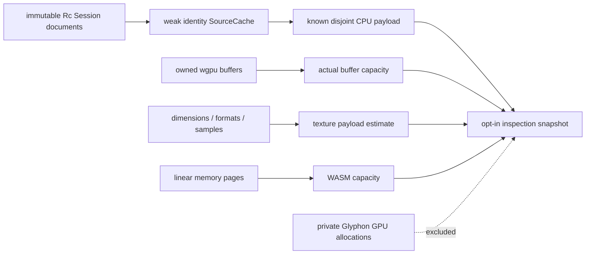

# 16 — Converge on production and verify ownership

The final checkpoint uses the frozen production modules and preserves a small local teaching scene as its packaging choice. Resource observations distinguish known CPU payload, WASM capacity, owned GPU buffers and estimated texture payload.



Text: report each resource domain separately; weak source identities avoid retaining a replaced document and prevent a geometry walk on every inspected frame.

## Implement checkpoint 16

- Starting checkpoint: **15**.
- **COPY/PASTE:** [complete 16.patch](reconstruction/patches/16.patch), including the full source accounting module, final inspection wiring, native harness/examples and maintained regression tools.
- For manual edits, type the exact cache implementation below and copy the remaining patch hunks once; `--adopt` verifies the same complete bytes as automatic replay.

| Exact workspace path | Action / unique owner | Purpose |
|---|---|---|
| `session_viewer/src/app/inspection/source_memory.rs` | Create `Payload`, `SourceCache` and every per-family accounting helper/test | Sum disjoint exposed payload; deduplicate shared source geometry. |
| `session_viewer/src/app/inspection.rs` | Replace `publish` with the complete frozen implementation | Add clearly scoped memory fields to the existing read-only snapshot. |
| `session_viewer/src/engine/performance.rs` | Apply final clock/counter hunks, if any | Retain measured submitted draw count and correctly named memory observations. |
| `session_viewer/src/selftest.rs`, `session_viewer/src/selftest/` | Create the complete existing offscreen verification harness | Same production renderer in tests; no native viewer product. |
| `session_viewer/examples/` | Apply every complete fixture/checker addition in the patch | Local depth/CAD/interaction/parity fixtures and measurement commands. |
| `session_viewer/tests/` | Apply every complete maintained test addition | Browser, shared parity, publication, source format and modularity checks. |
| Paths deleted by `16.patch` | Delete exactly the listed teaching-only files | Final renderer/application source has one production implementation. |

**TYPE BY HAND — `session_viewer/src/app/inspection/source_memory.rs`:** insert the complete weak-identity cache immediately after `impl Payload` and before `shared`; copy the module imports and the complete `session_payload` traversal from the patch.

```rust
/// Weak identities keep the inspection cache from retaining source objects after replacement.
#[derive(Default)]
pub(super) struct SourceCache {
    documents: Vec<Weak<Session>>,
    payload: Payload,
}

impl SourceCache {
    /// Current viewer sources are immutable Rc sessions: replacement/append changes identity.
    /// Future in-place source editing must invalidate this cache or replace the Rc session.
    pub fn snapshot(&mut self, docs: &[Doc]) -> Payload {
        let mut matches = docs.len() == self.documents.len();
        if matches {
            for (old, doc) in self.documents.iter().zip(docs) {
                if old.as_ptr() != Rc::as_ptr(&doc.session) {
                    matches = false;
                    break;
                }
            }
        }
        if matches {
            return self.payload;
        }
        let mut payload = Payload {
            scans: self.payload.scans + 1,
            ..Payload::default()
        };
        let mut seen_sessions = HashSet::new();
        let mut seen_geometry = HashSet::new();
        self.documents.clear();
        for doc in docs {
            self.documents.push(Rc::downgrade(&doc.session));
            if seen_sessions.insert(Rc::as_ptr(&doc.session) as usize) {
                payload.unique_sessions += 1;
                payload.shared_value_bytes += size_of::<Session>();
                session_payload(&doc.session, &mut payload, &mut seen_geometry);
            }
        }
        self.payload = payload;
        payload
    }
}
```

- `Weak<Session>` never extends the geometry lifetime; unchanged document identities reuse the last payload count.
- Source documents are currently immutable; future editing must replace their `Rc` or explicitly invalidate this cache.
- Do not add WASM capacity to its owned source payload, or report Glyphon's unexposed private atlas/instance capacities as measured VRAM.

**COPY/PASTE — verify the manually completed checkpoint:**

```sh
python3 "$COURSE_REPO/docs/reconstruction/replay.py" --output /tmp/viewer-course --through 16 --adopt --verify --target-dir "$COURSE_REPO/target"
```

Automatic alternative from unchanged 15: replace `--adopt` with `--advance`.

## Reconstruct every checkpoint from a clean directory

**COPY/PASTE — from any directory after setup:**

```sh
python3 "$COURSE_REPO/docs/reconstruction/replay.py" --output /tmp/viewer-course-clean --through 16 --verify-clean --target-dir "$COURSE_REPO/target"
```

- The output path must be new; each checkpoint gets its own original shared source extraction and applies its complete patch prefix from scratch.
- Every checkpoint gets a locked WASM check, optimized Trunk build and actual browser verification; 00 checks Rust initialization and 01–16 check submitted scene pixels at DPR 1 and 2.
- Screenshots, browser errors, build logs and patch checks remain under that output's checkpoint `evidence/` directories.
- `--adopt` and automatic replay compare all required file hashes, including the exact shared producer source; an edited or missing required file fails the gate.

## Production validation commands

**COPY/PASTE — from the final reconstructed `session_viewer` directory:**

```sh
python3 tests/format.py
REGEN_PROTO=0 cargo clippy --locked --lib --target wasm32-unknown-unknown -- -D warnings
REGEN_PROTO=0 cargo clippy --locked --lib --tests --examples --target x86_64-unknown-linux-gnu -- -D warnings
REGEN_PROTO=0 cargo xtest --locked --lib
REGEN_PROTO=0 cargo xtest --locked --lib -- --ignored --test-threads=1
REGEN_PROTO=0 NO_COLOR=true trunk build --release
python3 tests/publication.py
uv sync --project ../session_py --frozen --no-dev --python 3.13
../session_py/.venv/bin/python tests/parity.py --output /tmp/viewer-course-parity
```

| Check | Expected result and actual limit |
|---|---|
| Viewer formatting / native and WASM Clippy | Pass without reformatting unrelated shared packages. |
| Native unit tests | 77 pass; the eight GPU tests are counted separately. |
| Explicit native GPU tests | Eight pass on a supported adapter, including expected invalid-shader failure, glyph/outline visibility, eviction, release and canceled readback. |
| Shared parity | 53 Rust / 61 C++ / 53 independent Python; C++ has eight additional preexisting trimmed-surface cases. Fresh CMake dependency acquisition requires network/tooling described in `tests/README.md`. |
| Publication | Four local tests; geometry-before-manifest, failure retention, placement preservation and immutable revision reuse. |
| Modularity | `python3 tests/modularity.py --target-dir "$COURSE_REPO/target"`: remove standalone point producer; seven other families compile, render and select at DPR 1/2. |
| Browser interaction | `node tests/interaction.cjs`: all seven families, original edge/control IDs, yellow, Escape and parent replacement. Generate the fixture using the command in `tests/README.md`. |
| Streamed controls | `node tests/streamed-controls.cjs`, then DPR 2: exhaustive source pages with bounded residency and original ID beyond six million. |
| Loading / lifecycle | `node tests/loading.cjs` and `node tests/lifecycle.cjs`: later revision wins, last valid scene, stable repeated resource capacity, input focus, cancellation, DPR and hidden canvas. |
| Text | `node tests/text-quality.cjs`, `node tests/text-zoom.cjs`: matched font metrics, normal-size pixels, scaling and cache lifecycle. Inspect normal-size images as described in `tests/README.md`. |
| CAD / depth | `python3 tests/cad-quality.py` and maintained `tests/depth` commands: source/affine geometry, coherent boundary IDs, normal/crease fixtures and zero hidden-floor leakage. |
| Real PDF / public scenes | `node tests/pdf-text-quality.cjs` and `node tests/scenes.cjs` use the separately identified real assets/sources; missing assets are unverified, not a passing local substitute. |

## Convergence and packaging

- The final numbered patch supplies the complete runtime Rust/WGSL source, pinned Cargo configuration, browser page, font assets and publication helpers from the production checkpoint.
- The tutorial keeps its small local generated scene and fixture bytes instead of requiring the user's 105 MiB working asset cache or personal R2 bucket. This changes input packaging, not geometry/selection/rendering behavior.
- Original kernel source archives are single shared prerequisites, not duplicated build outputs; chapters 06, 07 and 09 apply the complete Rust/C++/Python changes.
- The pinned `session_proto` archive supplies the real sibling schemas required by CMake, avoiding its missing-directory fetch. The fresh Python check used uv 0.9.8, Python 3.13.9, NumPy 2.3.5 and protobuf 6.33.6; all 53 parity cases passed.
- Imported-document font artifacts remain in the user's production assets. The tutorial's PDF geometry already contains its vector outlines; the required Noto source-text fonts and license are included verbatim.
- The earlier teaching canvas/GPU facades are removed as the production shell and coordinator take over; the final tree contains no second renderer.
- All 17 clean checkpoint reconstructions pass their locked WASM checks, optimized builds and browser gates. Checkpoint 10 also checks the real browser layout reference. The [checkpoint record](reconstruction/verification.json) includes the 12 detailed chapter gates and 28 additional CAD views. Every final runtime file matches production.

**COPY/PASTE — verify the final runtime against the frozen production inventory:**

```sh
python3 "$COURSE_REPO/docs/reconstruction/converge.py" --workspace /tmp/viewer-course
```

The checker requires all 82 runtime Rust/WGSL files and rejects extra source implementations. The [complete convergence inventory](reconstruction/convergence.json) contains 283 identical frozen files; only the listed local-input packaging differs.

## Final repository cleanup

Cleanup is complete. The unused empty npm lockfile and three generated Python cache files were removed; stale run/ignore guidance and chapter comments were corrected. Source, required fonts/licenses and regression fixtures remain. The obsolete `docs_archive` directory was subsequently removed at the user’s request. The user’s 105 MiB local scene cache and imported-document font assets are retained. The ignored Cargo cache and current Trunk output remain in use by the running viewer. No commits or unrelated cleanup were made.

After cleanup, formatting, strict native/WASM Clippy, 77 unit tests, eight GPU tests, 53/61/53 shared parity tests, four publication tests and module removal passed. Browser checks passed for all seven public scenes cold and warm (14 runs, no errors or idle redraws), object/edge/control selection, streamed source controls at DPR 1/2, labels and T, fixed-plane text, the teapot, loading/replacement, lifecycle, normal-size text at DPR 1/1.25/2, actual page zoom and the pinned PDF outlines.

The boundary verification passed 54 hidden-ink views, 21 fully covered floor-ID views, the nine-edge/seven-vertex close-up box, 12 CAD captures and exact mesh incidence for 13 BReps. Collapsed degenerate topology edges are recorded separately; all nondegenerate displayed segments belong to their incident mesh edges in both f64 and render f32. The independent teapot meridian regression fails the previous kernel and passes the corrected producer.

The final [source and verification inventory](reconstruction/baseline.json) identifies the exact production bytes and evidence paths. Browser coverage is Chrome 152 on the recorded Ubuntu/Intel host; Firefox, Safari, mobile hardware and physical monitor migration remain unverified. Local documentation links and the final diff were checked after the last documentation update.

[Previous: publication](15-publication.md) · [Course entry](README.md) · [Requirement coverage](coverage.md)
