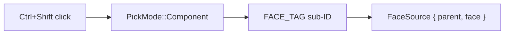
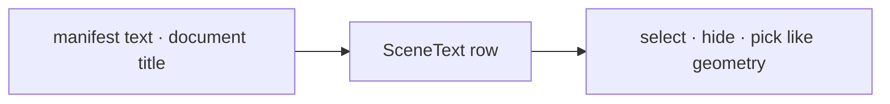
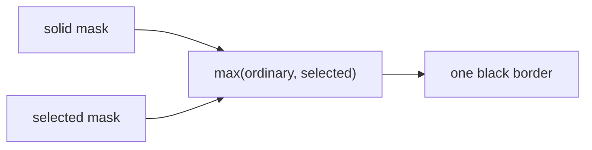
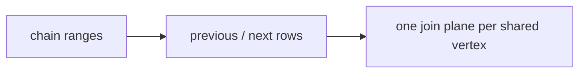

# 17 · Source faces, text objects and one silhouette

## You are building

**A · source faces**

**B · text objects**

**C · one silhouette**

**D · joined strokes**

## Starting point

- Checkpoint 16: objects, edges and controls are selectable; text is an annotation without identity; the selected object's outline is drawn by `selection_outline.rs`.
- Four independent features share this checkpoint. Each part below is complete on its own; the frame order at the end wires them together.
- The supplied tooling for this checkpoint is installed at the end of the lesson: its reference page already uses the text-object field that Part B adds.

## Part A · Select a source face

### Step 1 · Face identities over the existing triangles

- One `FaceSource` per original face; every display triangle of that face stores the same address in `ids`.
- Picking pulls the arena's existing vertices by index: no duplicate mesh, no per-face draw call.
- `FACE_TAG` keeps face addresses apart from edge and control sub-IDs in the same pick channel.

<!-- file: 17 session_viewer/src/engine/gpu/faces.rs type lines=1-28 -->

The bind group at group 3 borrows the arena's buffers and adds the face table and the selected-face uniform:

| Binding | Rust buffer | WGSL |
|---|---|---|
| 0 | arena vertices | `face_vertices: array<f32>` |
| 1 | arena object ids | `face_objects: array<u32>` |
| 2 | arena triangle indices | `face_indices: array<u32>` |
| 3 | `ids` | `source_faces: array<u32>` |
| 4 | `selected` uniform | `selected_face: vec4<u32>` |

<!-- file: 17 session_viewer/src/engine/gpu/faces.rs type lines=29-78 -->

- `append` shifts upload-local face addresses by the scene's running count, so replacement never reuses an address.

<!-- file: 17 session_viewer/src/engine/gpu/faces.rs type lines=79-128 -->

- `source` rejects a sub-ID whose parent row does not match: a stale address cannot select another object's face.

<!-- file: 17 session_viewer/src/engine/gpu/faces.rs type lines=129-166 -->

<!-- file: 17 session_viewer/src/engine/gpu/faces.rs type lines=167-204 -->

- Three pipelines, one vertex entry `vs_face`: IDs into the pick target, the highlight over read-only equal depth, and a coverage mask for part C.

<!-- file: 17 session_viewer/src/engine/gpu/faces.rs type lines=205-243 -->

### Step 2 · The triangle shader learns vertex pulling

- `transform_vertex` is the old `vs_main` body; `vs_face` reaches the same code through storage buffers instead of vertex attributes.
- `fs_id` writes `FACE_TAG | address` as the sub-ID; `fs_face_highlight` discards everything but the selected face.
- `fs_solid_mask` writes plain coverage; part C reads it.

<!-- file: 17 session_viewer/src/shaders/triangle.wgsl type -->

<!-- check: 17 -->

### Step 3 · Producers emit one face address per triangle

- Meshes: sorted source face keys, cached triangulation or the fan the kernel would build; the assertion ties the address stream to the triangle stream.
- BReps: `push_face` records the face index it is tessellating.

<!-- file: 17 session_viewer/src/app/walk/mesh.rs type -->

<!-- file: 17 session_viewer/src/app/walk/brep.rs type -->

### Step 4 · The arena owns a `Faces` lane

- Vertex, id and index buffers gain `STORAGE` usage so `vs_face` can read them.
- `draw_component_ids` replaces the object-ID draw only in component pick mode.

<!-- file: 17 session_viewer/src/engine/gpu/arena.rs type hunks=1,2,4,5,6,7,8,9,10,11 -->

### Step 5 · A third selection mode

- `SelectionMode::Face` carries parent and face, so Escape returns to the parent like edges do.
- `PickMode::Component`: the pick sorter prefers a nearby edge, then a face, then the object.

<!-- file: 17 session_viewer/src/app/selection.rs type -->

<!-- file: 17 session_viewer/src/engine/gpu/pick.rs type -->

- Input tracks Shift; Ctrl+Shift requests a component pick.

<!-- file: 17 session_viewer/src/app/input.rs type hunks=1,2,4,5,6 -->

- State maps the answer back through `Faces::source`, selects the parent, then narrows the highlight to the face.

<!-- file: 17 session_viewer/src/state.rs type hunks=6,7,10,11,12,13 -->

## Part B · Authored text is an object

### Step 6 · A text label can own a row

- `TextObject { row, selected }` on a label means "this text is a scene object"; `None` means a derived annotation such as the selected-object name.

<!-- file: 17 session_viewer/src/engine/text.rs type -->

- Manifest text may face the camera instead of lying in a fixed plane.

<!-- file: 17 session_viewer/src/app/manifest.rs type -->

### Step 7 · Scene registers text rows

- A key (`manifest-text/{index}`, `document-title/{doc}`) finds its previous row on reload, so hidden state survives replacement.
- The row is an ordinary `ObjectRow`; hide, select and pick treat it like geometry.

<!-- file: 17 session_viewer/src/app/scene_text.rs type lines=1-18 -->

<!-- file: 17 session_viewer/src/app/scene_text.rs type lines=19-70 -->

<!-- file: 17 session_viewer/src/app/scene_text.rs type lines=71-117 -->

<!-- file: 17 session_viewer/src/app/scene_text.rs type lines=118-163 -->

<!-- file: 17 session_viewer/src/app/scene.rs type -->

### Step 8 · State's text presentation moves into its own file

- `update_label` submits the visible source texts plus the one derived name; the derived name has no row and cannot steal its parent's click.
- `include_text_bounds` records each text object's shaped world box so fitting and the selection name can use it.

<!-- file: 17 session_viewer/src/state/text.rs type lines=1-33 -->

<!-- file: 17 session_viewer/src/state/text.rs type lines=34-54 -->

<!-- file: 17 session_viewer/src/state/text.rs type lines=55-112 -->

<!-- file: 17 session_viewer/src/state/text.rs type lines=113-147 -->

- The old copies leave `state.rs`; hide and show now refresh labels.

<!-- file: 17 session_viewer/src/state.rs type hunks=1,2,3,4,5,8,9,14,15 -->

<!-- file: 17 session_viewer/src/engine/gpu/objects.rs type -->

### Step 9 · Plates and planes draw IDs

- Camera-facing text: `Plates` gains a depth per rectangle, an object row and an ID pipeline; physical plates draw before glyphs, overlays after.
- Every plate vertex carries `object` and a selection flag; the plate's signed distance defines coverage, the yellow border and the pick footprint.

<!-- file: 17 session_viewer/src/engine/gpu/text_plate.rs type -->

<!-- file: 17 session_viewer/src/shaders/text_plate.wgsl type -->

- Fixed-plane text: the same three attributes, an ID pipeline, and a yellow frame while selected.

<!-- file: 17 session_viewer/src/engine/gpu/text_plane.rs type -->

<!-- file: 17 session_viewer/src/shaders/text_plane.wgsl type -->

- The text lane exposes `draw_ids`; `text_rectangle` now serves nameplates and source labels alike.

<!-- file: 17 session_viewer/src/engine/gpu/text.rs type hunks=1-5 -->

- Remaining label literals in this file gain the new field:

<!-- file: 17 session_viewer/src/engine/gpu/text.rs type hunks=6-14 -->

<!-- file: 17 session_viewer/src/app/inspection.rs type hunks=2 -->

## Part C · One black silhouette

### Step 10 · Two masks, one compositor

- Ordinary outlines describe the union of all visible solids; touching or overlapping objects get no inner seam.
- The selected mask is thicker. The compositor takes `max(ordinary, selected)`, so the overlap is never blended twice, and a selected interior suppresses the ordinary contour.

<!-- file: 17 session_viewer/src/engine/gpu/surface_outline.rs type lines=1-35 -->

Group 0 is the ordinary mask, group 1 the selected mask; the same layout serves both:

| Group · binding | Rust | WGSL |
|---|---|---|
| 0 · 0 | resolved `R8Unorm` coverage | `mask: texture_2d<f32>` |
| 0 · 1 | `uniform` (radius, is_selected) | `radius: vec4<f32>` |
| 1 · 0 / 1 | the selected outline's mask and uniform | `selected_mask`, `selected_radius` |

<!-- file: 17 session_viewer/src/engine/gpu/surface_outline.rs type lines=36-82 -->

- Clearing the last selected row releases the coverage texture at once.

<!-- file: 17 session_viewer/src/engine/gpu/surface_outline.rs type lines=83-106 -->

- `prepare` allocates coverage only while something is outlined; the radius is CSS pixels scaled to physical pixels.

<!-- file: 17 session_viewer/src/engine/gpu/surface_outline.rs type lines=107-187 -->

- The mask pass tests the frame's immutable depth, so hidden surfaces cannot contribute coverage.

<!-- file: 17 session_viewer/src/engine/gpu/surface_outline.rs type lines=188-223 -->

<!-- file: 17 session_viewer/src/engine/gpu/surface_outline.rs type lines=224-254 -->

<!-- file: 17 session_viewer/src/engine/gpu/surface_outline.rs type lines=255-269 -->

Copy the rest of the file:

<!-- file: 17 session_viewer/src/engine/gpu/surface_outline.rs copy lines=270-513 -->

- The shader dilates coverage with a one-pixel smooth edge and returns black with that alpha.

<!-- file: 17 session_viewer/src/shaders/surface_outline.wgsl type -->

### Step 11 · The arena draws the solid mask

<!-- file: 17 session_viewer/src/engine/gpu/arena.rs type hunks=3,12 -->

- `O` toggles silhouettes; `VIEWER_NO_OUTLINES` / `?nooutlines` disable them for captures.

<!-- file: 17 session_viewer/src/engine/gpu/view.rs type -->

<!-- file: 17 session_viewer/src/app/input.rs type hunks=3 -->

<!-- file: 17 session_viewer/src/app/inspection.rs type hunks=1 -->

## Part D · Subdivisions share one join

### Step 12 · Producers mark chains

- A chain is one authored curve or one BRep edge; independent mesh wires never join just because endpoints coincide.

<!-- file: 17 session_viewer/src/app/walk/curves.rs type -->

<!-- file: 17 session_viewer/src/app/walk/brep_edges.rs type -->

### Step 13 · The GPU row gains neighbours

- `StrokeSegment` wraps the source row with `previous` and `next` GPU indices; `joined_rows` links consecutive chain members whose endpoints, instance, color and radius agree, and wraps a closed chain.

<!-- file: 17 session_viewer/src/engine/gpu/segments.rs type hunks=1-6 -->

- Two more pipelines split ordinary from selected strokes; `draw_selected` is skipped when nothing is selected.

<!-- file: 17 session_viewer/src/engine/gpu/segments.rs type hunks=7-13 -->

<!-- file: 17 session_viewer/src/engine/gpu/segments.rs type hunks=14-16 -->

<!-- file: 17 session_viewer/src/engine/gpu/instance.rs type -->

### Step 14 · One join plane per shared vertex

- Both segments at a shared vertex call `join_plane(before, after)` with the same ordered pair, so both compute the same bisector plane.
- The start side keeps pixels on its side of the plane, the end side excludes them: exactly one segment owns each pixel of the shared cap.
- `stroke_vertex(vid, layer)` culls the other layer's strokes, so the selected pass draws only selected ink.

<!-- file: 17 session_viewer/src/shaders/ribbon.wgsl type hunks=1-3 -->

- A selected stroke keeps an opaque yellow core at least `line.thickness` wide; CAD boundary samples never taper with density.

<!-- file: 17 session_viewer/src/shaders/ribbon.wgsl type hunks=4,5 -->

<!-- file: 17 session_viewer/src/shaders/ribbon.wgsl type hunks=6 -->

### Step 14b · Install the supplied tooling

The reference page and native fixtures for this checkpoint use the text-object field from Part B, so they are copied now:

<!-- supplied: 17 -->

## Step 15 · Wire the frame

- The old `selection_outline` lane goes away; two `SurfaceOutline` instances take its place.
- Frame order: face highlight, print geometry, unselected strokes, selected **solid** strokes, the combined black silhouette, then selected **standalone** curves over coincident mesh ink.

<!-- file: 17 session_viewer/src/engine/gpu/selection_outline.rs -->

<!-- file: 17 session_viewer/src/shaders/selection_outline.wgsl -->

<!-- file: 17 session_viewer/src/engine/gpu/mod.rs type -->

<!-- file: 17 session_viewer/src/engine/gpu/render.rs type -->

## Check

<!-- checkpoint: 17 -->

Expected:

- Ctrl+Shift-click inside a mesh, BRep or surface: that source face turns yellow; the status reads `Face N selected`.
- Ctrl+Shift-click on an edge: the edge wins over the face.
- Click a solid and orbit: one continuous black border of uniform width; press **O** twice to hide and restore it.
- Click a manifest text or a document title: it selects like geometry; **H** hides it, **S** shows it; **T** still toggles only the derived selected-object name.
- A dense polyline and the same curve with few segments look the same at their joints: no darker dots, no gaps.

## What changed

<!-- tree: 17 session_viewer/src -->

- Data flow: `FaceSource` rows → `Faces::ids` → `vs_face` → `FACE_TAG` sub-ID → `Faces::source` → `SelectionMode::Face`.
- Data flow: manifest `TextItem` → `SceneText` row → `visible_texts` → plate/plane vertices with `object` → `fs_id`.
- Data flow: `SegRows.*_chains` → `StrokeSegment.previous/next` → `join_plane` → partitioned cap coverage.
- GPU resources: face id buffer + selected-face uniform; two `R8Unorm` coverage masks; strokes are 48-byte rows.

**Production equivalent:** every file in this lesson is the production file at this revision. Lesson 18 changes `faces.rs`, `segments.rs` is final, and `surface_outline.rs` is final.

## Next

[18 · Finite-triangle visibility](18-finite-visibility.md): why a neighbouring triangle's plane can hide a visible seam, and the tile index that fixes it.
