# 17 · Source faces, text objects and one silhouette

## You are building

**A · source faces**

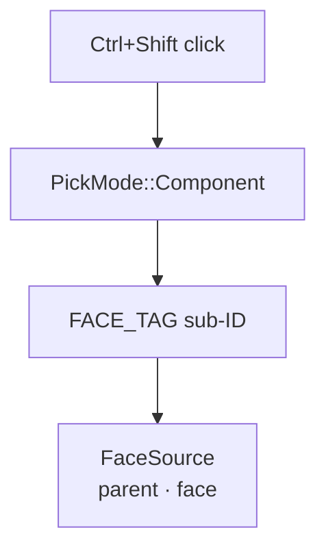

**B · text objects**

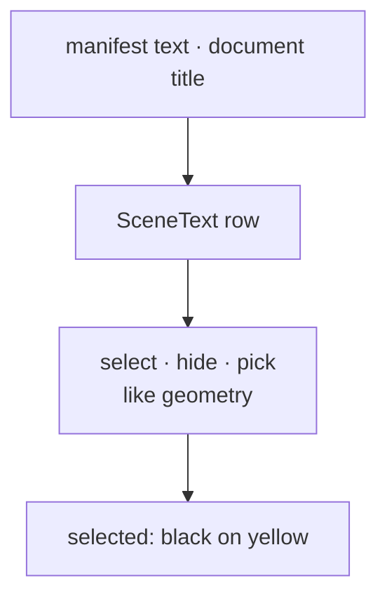

**C · one silhouette**

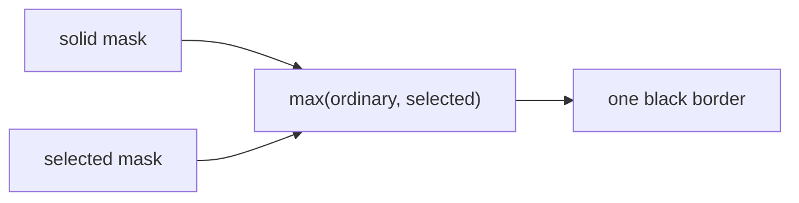

**D · joined strokes**

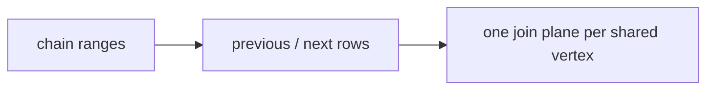

**E · every pixel the same size**

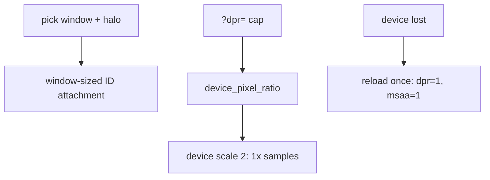

## Starting point

- Checkpoint 16: objects, edges and controls are selectable; text is an annotation without identity; the selected object's outline is drawn by `selection_outline.rs`.
- Five independent parts share this checkpoint. Each part below is complete on its own; the frame order at the end wires them together.
- The supplied tooling for this checkpoint is installed at the end of the lesson: its reference page already uses the text-object field that Part B adds.

## Part A · Select a source face

### Step 1 · Face identities over the existing triangles

- One `FaceSource` per original face; every display triangle of that face stores the same address in `ids`.
- Picking pulls the arena's existing vertices by index: no duplicate mesh, no per-face draw call.
- `FACE_TAG` keeps face addresses apart from edge and control sub-IDs in the same pick channel.

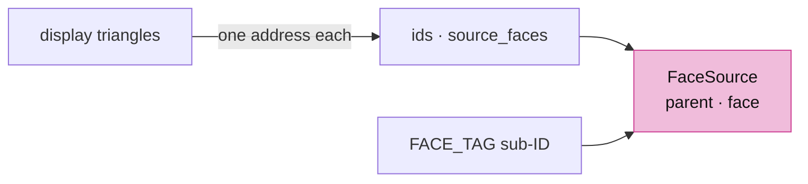

<!-- file: 17 session_viewer/src/engine/gpu/faces.rs type lines=1-28 -->

The bind group at group 3 borrows the arena's buffers and adds the face table and the selected-face uniform:

| Binding | Rust buffer | WGSL |
|---|---|---|
| 0 | arena vertices | `face_vertices: array<f32>` |
| 1 | arena object ids | `face_objects: array<u32>` |
| 2 | arena triangle indices | `face_indices: array<u32>` |
| 3 | `ids` | `source_faces: array<u32>` |
| 4 | `selected` uniform | `selected_face: vec4<u32>` |

<!-- file: 17 session_viewer/src/engine/gpu/faces.rs type lines=29-78 -->

- `append` shifts upload-local face addresses by the scene's running count, so replacement never reuses an address.

<!-- file: 17 session_viewer/src/engine/gpu/faces.rs type lines=79-128 -->

- `source` rejects a sub-ID whose parent row does not match: a stale address cannot select another object's face.

<!-- file: 17 session_viewer/src/engine/gpu/faces.rs type lines=129-166 -->

<!-- file: 17 session_viewer/src/engine/gpu/faces.rs type lines=167-204 -->

- Three pipelines, one vertex entry `vs_face`: IDs into the pick target, the highlight over read-only equal depth, and a coverage mask for part C.

<!-- file: 17 session_viewer/src/engine/gpu/faces.rs type lines=205-243 -->

### Step 2 · The triangle shader learns vertex pulling

- `transform_vertex` is the old `vs_main` body; `vs_face` reaches the same code through storage buffers instead of vertex attributes.
- `fs_id` writes `FACE_TAG | address` as the sub-ID; `fs_face_highlight` discards everything but the selected face.
- `fs_solid_mask` writes plain coverage; part C reads it.
- `LineUniform` lists `origin` and `frame`: the window origin and the canvas size, which every shader copy of the uniform declares in the same order.

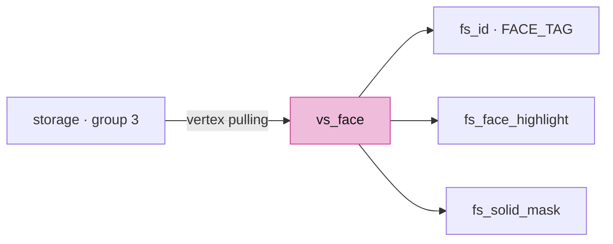

<!-- file: 17 session_viewer/src/shaders/triangle.wgsl type -->

<!-- check: 17 -->

### Step 3 · Producers emit one face address per triangle

- Meshes: sorted source face keys, cached triangulation or the fan the kernel would build; the assertion ties the address stream to the triangle stream.
- BReps: `push_face` records the face index it is tessellating.

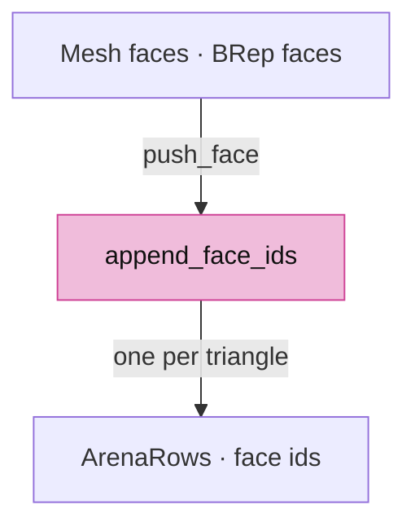

<!-- file: 17 session_viewer/src/app/walk/mesh.rs type -->

<!-- file: 17 session_viewer/src/app/walk/brep.rs type -->

### Step 4 · The arena owns a `Faces` lane

- Vertex, id and index buffers gain `STORAGE` usage so `vs_face` can read them.
- `draw_component_ids` replaces the object-ID draw only in component pick mode.

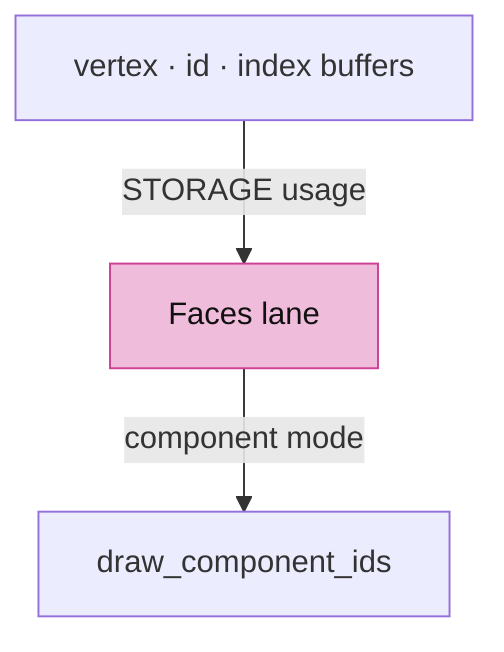

<!-- file: 17 session_viewer/src/engine/gpu/arena.rs type hunks=1,2,4,5,6,7,8,9,10,11 -->

### Step 5 · A third selection mode

- `SelectionMode::Face` carries parent and face, so Escape returns to the parent like edges do.
- `PickMode::Component`: the pick sorter prefers a nearby edge, then a face, then the object.

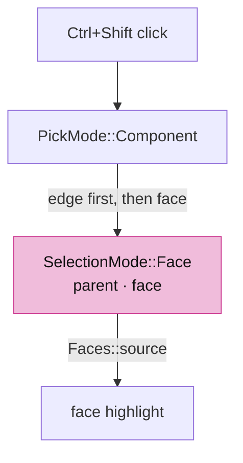

<!-- file: 17 session_viewer/src/app/selection.rs type -->

- The picker renders into an attachment the size of the pick window plus a `PICK_HALO` of three texels, never the canvas: `Window::view` is that rectangle, `view_for` falls back to the whole canvas for a full-frame capture, and `copy_window` reads the window from inside the attachment. The halo exists because the ink visibility test fits planes from neighbouring texels, which must be occlusion samples rather than cleared ones.

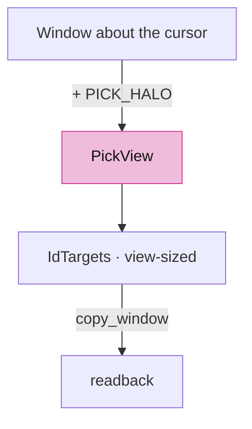

<!-- file: 17 session_viewer/src/engine/gpu/pick.rs type -->

- Input tracks Shift; Ctrl+Shift requests a component pick.

<!-- file: 17 session_viewer/src/app/input.rs type hunks=2,3,8,9,10,11 -->

- State maps the answer back through `Faces::source`, selects the parent, then narrows the highlight to the face.

<!-- file: 17 session_viewer/src/state.rs type hunks=7,8,11,12,15,16 -->

## Part B · Authored text is an object

### Step 6 · A text label can own a row

- `TextObject { row, selected }` on a label means "this text is a scene object"; `None` means a derived annotation such as the selected-object name.
- `ink_color` is black while the object is selected and the authored color otherwise; both text renderers read it, so the authored color is never touched.

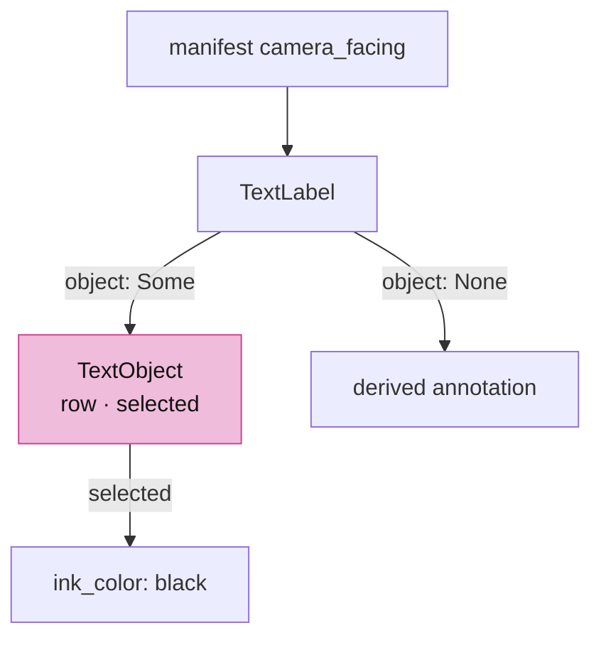

<!-- file: 17 session_viewer/src/engine/text.rs type -->

- Manifest text may face the camera instead of lying in a fixed plane.

<!-- file: 17 session_viewer/src/app/manifest.rs type -->

### Step 7 · Scene registers text rows

- A key (`manifest-text/{index}`, `document-title/{doc}`) finds its previous row on reload, so hidden state survives replacement.
- The row is an ordinary `ObjectRow`; hide, select and pick treat it like geometry.

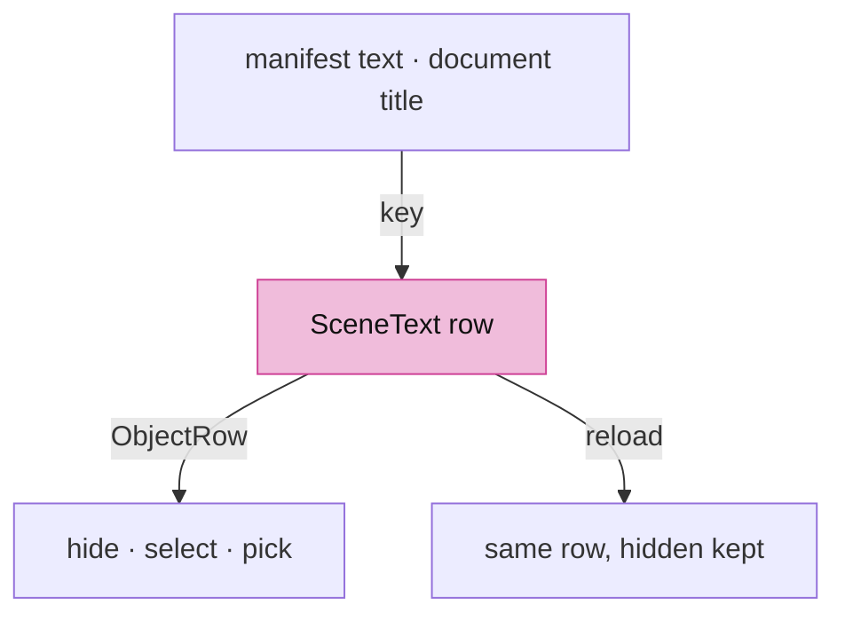

<!-- file: 17 session_viewer/src/app/scene_text.rs type lines=1-17 -->

<!-- file: 17 session_viewer/src/app/scene_text.rs type lines=18-69 -->

<!-- file: 17 session_viewer/src/app/scene_text.rs type lines=70-105 -->

<!-- file: 17 session_viewer/src/app/scene_text.rs type lines=106-142 -->

<!-- file: 17 session_viewer/src/app/scene.rs type -->

### Step 8 · State's companions: text presentation and streamed queries

- `update_label` submits the visible source texts plus the one derived name; the derived name has no row and cannot steal its parent's click.
- `include_text_bounds` records each text object's shaped world box so fitting and the selection name can use it.

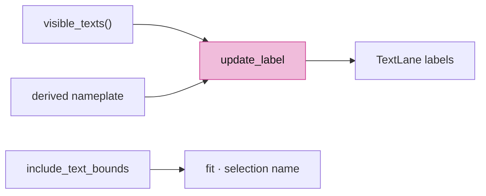

<!-- file: 17 session_viewer/src/state/text.rs type lines=1-33 -->

<!-- file: 17 session_viewer/src/state/text.rs type lines=34-54 -->

<!-- file: 17 session_viewer/src/state/text.rs type lines=55-112 -->

<!-- file: 17 session_viewer/src/state/text.rs type lines=113-144 -->

- The streamed F10 query is `State`'s second companion: `State` owns the query, and this file groups the page, answer and resolve workflow.

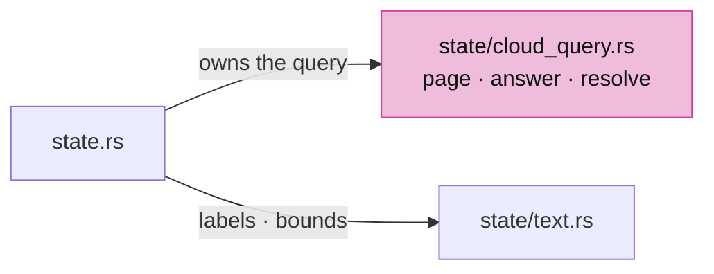

<!-- file: 17 session_viewer/src/state/cloud_query.rs type lines=1-38 -->

<!-- file: 17 session_viewer/src/state/cloud_query.rs type lines=39-101 -->

<!-- file: 17 session_viewer/src/state/cloud_query.rs type lines=102-159 -->

<!-- file: 17 session_viewer/src/state/cloud_query.rs type lines=160-212 -->

- `state.rs` declares both modules and keeps only ownership; hide and show refresh labels.

<!-- file: 17 session_viewer/src/state.rs type hunks=1,3,4,5,6,9,10,17,18 -->

<!-- file: 17 session_viewer/src/engine/gpu/objects.rs type -->

### Step 9 · Plates and planes draw IDs

- Camera-facing text: `Plates` gains a depth per rectangle, an object row and an ID pipeline; physical plates draw before glyphs, overlays after.
- Every plate vertex carries `object` and a selection flag; the plate's signed distance defines coverage, the yellow backing and the pick footprint.
- A selected plate fills the whole rounded backing yellow; every backing reserves a full cap at each end, so rounding never intersects the shaped line.
- `vs_id` maps the same clip-space vertices through the pick pass's window transform, so the ID footprint lands in the window-sized attachment.

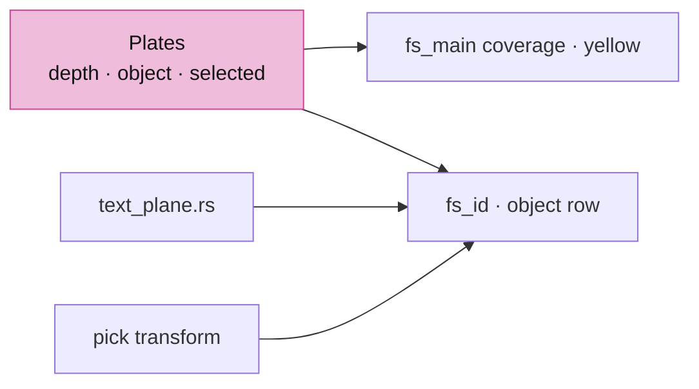

<!-- file: 17 session_viewer/src/engine/gpu/text_plate.rs type -->

<!-- file: 17 session_viewer/src/shaders/text_plate.wgsl type -->

- Fixed-plane text: the same three attributes, an ID pipeline, and the whole rounded backing yellow while selected; the padding matches the selection-name plate.

<!-- file: 17 session_viewer/src/engine/gpu/text_plane.rs type -->

<!-- file: 17 session_viewer/src/shaders/text_plane.wgsl type -->

- The text lane exposes `draw_ids`; `text_rectangle` serves nameplates and source labels alike, reserving a cap radius at each end of a rounded backing, and glyphs take their color from `ink_color`.

<!-- file: 17 session_viewer/src/engine/gpu/text.rs type hunks=1-5 -->

- Remaining label literals in this file gain the new field:

<!-- file: 17 session_viewer/src/engine/gpu/text.rs type hunks=6-17 -->

<!-- file: 17 session_viewer/src/app/inspection.rs type hunks=2 -->

## Part C · One black silhouette

### Step 10 · Two masks, one compositor

- Ordinary outlines describe the union of all visible solids; touching or overlapping objects get no inner seam.
- The selected mask is thicker. The compositor takes `max(ordinary, selected)`, so the overlap is never blended twice, and a selected interior suppresses the ordinary contour.
- Each mask carries a coarse copy: the maximum of every `POOL` × `POOL` block. The compositor reads it first and skips the dilation loop wherever no covered texel is in reach, which is most of the frame.


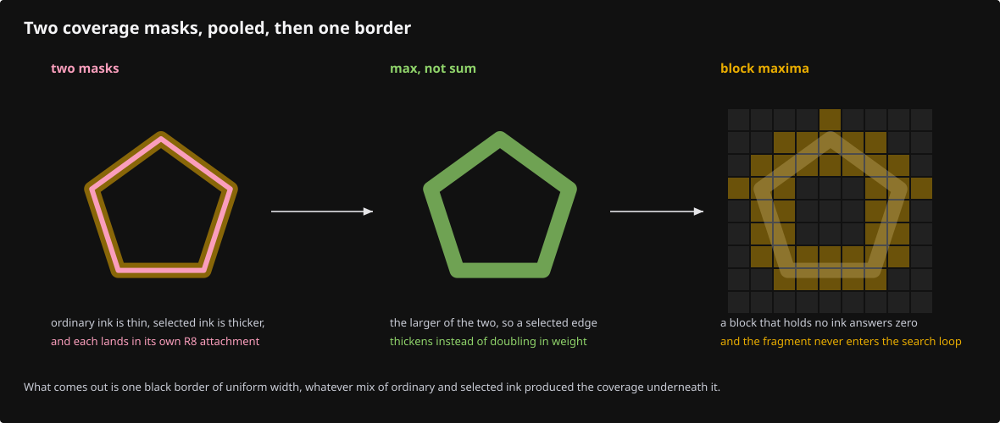

<!-- file: 17 session_viewer/src/engine/gpu/surface_outline.rs type lines=1-33 -->

Group 0 is the ordinary mask, group 1 the selected mask; the same layout serves both, and the pool layout holds one mask for the reduction:

| Group · binding | Rust | WGSL |
|---|---|---|
| 0 · 0 | resolved `R8Unorm` coverage | `mask: texture_2d<f32>` |
| 0 · 1 | `uniform` (radius, is_selected) | `radius: vec4<f32>` |
| 0 · 2 | `coarse`: block maxima of the mask | `coarse: texture_2d<f32>` |
| 1 · 0 / 1 / 2 | the selected outline's mask, uniform and coarse copy | `selected_mask`, `selected_radius`, `selected_coarse` |
| pool · 0 | the resolved mask being reduced | `mask` in `fs_pool` |

<!-- file: 17 session_viewer/src/engine/gpu/surface_outline.rs type lines=34-121 -->

- Clearing the last selected row releases the coverage texture at once.

<!-- file: 17 session_viewer/src/engine/gpu/surface_outline.rs type lines=122-145 -->

- `prepare` allocates coverage only while something is outlined; the radius is CSS pixels scaled to physical pixels (lesson 18 settles on one radius for ordinary and selected solids). The coarse texture is `size / POOL` in each direction and binds beside the resolved mask.

<!-- file: 17 session_viewer/src/engine/gpu/surface_outline.rs type lines=146-250 -->

- The mask pass tests the frame's immutable depth, so hidden surfaces cannot contribute coverage.

<!-- file: 17 session_viewer/src/engine/gpu/surface_outline.rs type lines=251-287 -->

- `encode_pool` runs after the mask pass: one full-screen triangle over the coarse texture, no depth, `fs_pool` as its fragment entry.


<!-- file: 17 session_viewer/src/engine/gpu/surface_outline.rs type lines=288-314 -->

- `draw_combined` composites both silhouettes once; `allocated_bytes` counts the coarse texture with the mask.

<!-- file: 17 session_viewer/src/engine/gpu/surface_outline.rs type lines=315-343 -->

<!-- file: 17 session_viewer/src/engine/gpu/surface_outline.rs type lines=344-376 -->

Copy the rest of the file. Its unit block turns `show_outlines` on explicitly, because silhouettes start off:

<!-- file: 17 session_viewer/src/engine/gpu/surface_outline.rs copy lines=377-624 -->

- The shader dilates coverage with a one-pixel smooth edge and returns black with that alpha. The dilation reads every texel within the radius, up to 27 × 27 per pixel; `near_any_coverage` checks the block under the pixel and its eight neighbours in the coarse texture and returns zero without the loop when all nine are empty. The kernel radius is clamped to 12 on the CPU, so those nine blocks always contain the whole kernel and the answer is the same to the bit.

<!-- file: 17 session_viewer/src/shaders/surface_outline.wgsl type -->

### Step 11 · The arena draws the solid mask

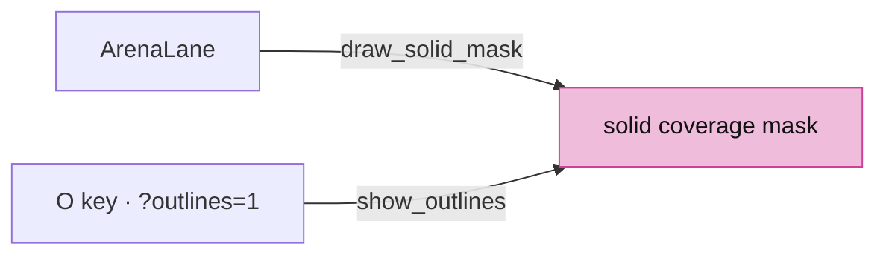

<!-- file: 17 session_viewer/src/engine/gpu/arena.rs type hunks=3,12 -->

- Silhouettes start **off**: the two coverage masks and the compositor are a full-screen pass per frame, which is slow on integrated GPUs. `O` turns them on; `?outlines=1` / `VIEWER_OUTLINES=1` starts with them on.
- The default pen is one CSS pixel; `?thickness=` / `VIEWER_THICKNESS` selects a heavier weight.
- The headlight starts **off** (`D`, `?lit=1` / `VIEWER_LIT=1` turn it on) and so do back faces (`?backface=1` paints them red): a CAD drawing reads better flat, and a wrong normal is easier to see with shading as an explicit switch than as the default.
- `device_pixel_ratio` is the one place the browser's ratio is read: `?dpr=` caps it for people who prefer memory over crispness, never raising it above the browser's and never below 0.5.

<!-- file: 17 session_viewer/src/engine/gpu/view.rs type -->

<!-- file: 17 session_viewer/src/app/input.rs type hunks=4-4 -->

<!-- file: 17 session_viewer/src/app/inspection.rs type hunks=1 -->

## Part D · Subdivisions share one join

### Step 12 · Producers mark chains

- A chain is one authored curve or one BRep edge; independent mesh wires never join just because endpoints coincide.

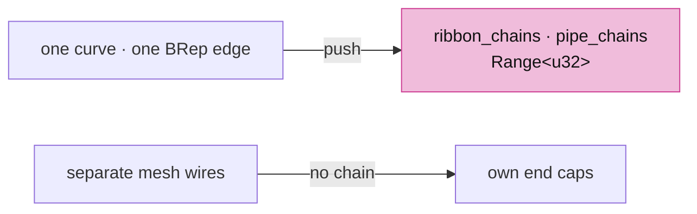

<!-- file: 17 session_viewer/src/app/walk/curves.rs type -->

<!-- file: 17 session_viewer/src/app/walk/brep_edges.rs type -->

### Step 13 · The GPU row gains neighbours

- `StrokeSegment` wraps the source row with `previous` and `next` GPU indices; `joined_rows` links consecutive chain members whose endpoints, instance, color and radius agree, and wraps a closed chain.

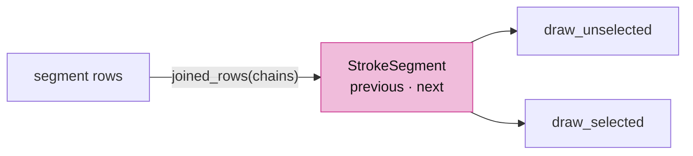

<!-- file: 17 session_viewer/src/engine/gpu/segments.rs type hunks=1-6 -->

- Two more pipelines split ordinary from selected strokes; `draw_selected` is skipped when nothing is selected.

<!-- file: 17 session_viewer/src/engine/gpu/segments.rs type hunks=7-14 -->

<!-- file: 17 session_viewer/src/engine/gpu/segments.rs type hunks=15-17 -->

- The layout test mirrors `StrokeSegment` and pins `origin` and `frame` in every shader copy of `LineUniform`: 80 bytes.

<!-- file: 17 session_viewer/src/engine/gpu/instance.rs type -->

### Step 14 · One join plane per shared vertex

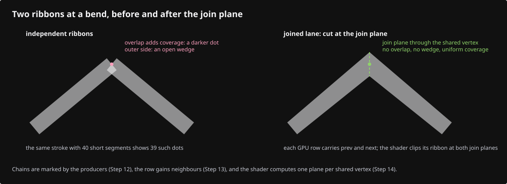

- Both segments at a shared vertex call `join_plane(before, after)` with the same ordered pair, so both compute the same bisector plane.
- The start side keeps pixels on its side of the plane, the end side excludes them: exactly one segment owns each pixel of the shared cap.
- `stroke_vertex(vid, layer)` culls the other layer's strokes, so the selected pass draws only selected ink.


<!-- file: 17 session_viewer/src/shaders/ribbon.wgsl type hunks=1-2 -->

- A selected stroke keeps an opaque yellow core at least `line.thickness` wide; CAD boundary samples never taper with density.

<!-- file: 17 session_viewer/src/shaders/ribbon.wgsl type hunks=3-4 -->

- Three vertex entries share `stroke_vertex`; `coverage` applies both join planes before the capsule distance.

<!-- file: 17 session_viewer/src/shaders/ribbon.wgsl type hunks=5-6 -->

### Step 14b · Install the supplied tooling

The reference page and native fixtures for this checkpoint use the text-object field from Part B, so they are copied now:

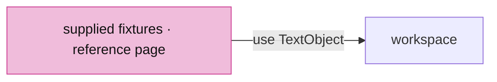

<!-- supplied: 17 -->

## Part E · Every pixel the same size

Per-pixel attachments are where video memory goes. At 4x the colour, depth and metadata targets cost 64 bytes per physical pixel; canvas-sized pick targets would cost another 20 per pixel after the first click. Three rules keep every pixel the same and avoid both: the pick pass draws a window, antialiasing stops at device scale 2, and a lost device reloads once at the smallest settings.

### Step 15 · The pick window's uniforms

- The pick pass sees the scene through the sub-frustum of the window about the cursor. `LineUniform` and `CloudUniform` carry the window `origin` and the canvas `frame`; both are zero and the canvas size in a colour frame.
- Splats project onto the canvas with `frame` and subtract `origin`, so a point's footprint keeps its pixel size inside the window-sized attachment; the grid only lists the new fields.

```mermaid
flowchart TB
    F["frame uniforms"] -- "write_pick(view)" --> P["pick uniforms<br/>mvp' · line' · cloud'"]
    P --> I["id_pass · window-sized attachment"]
    P --> S["splat.wgsl · frame − origin"]
    style P fill:#f0bcdb,stroke:#ce4095,color:#111
```

<!-- file: 17 session_viewer/src/shaders/splat.wgsl type -->

<!-- file: 17 session_viewer/src/shaders/splat_resolve.wgsl type -->

### Step 16 · Device scale and a lost device

- Input and canvas sizing share the capped `device_pixel_ratio`, so a pointer position and a rendered pixel agree at any `?dpr=`.
- `samples_for` returns 1x from two physical pixels per CSS pixel: the pixel density already halves the stair-steps, for a quarter of the attachment memory. `forced` still wins.
- When the browser loses the device because video memory ran out, `recover_from_device_loss` reloads the page once at device scale 1 without antialiasing, keeping every other query; `recovered_notice` keeps the status line saying so on the reloaded page.

```mermaid
flowchart TB
    B["browser ratio"] -- "min(?dpr=)" --> D["device_pixel_ratio"]
    D --> C["canvas size"]
    D --> N["pointer and touch input"]
    D -- "≥ 2" --> M["samples_for: 1x"]
    L["device lost"] -- "once" --> R["reload ?dpr=1&msaa=1&recovered=1"]
    style D fill:#f0bcdb,stroke:#ce4095,color:#111
```

- winit reports cursor and touch positions at the browser's ratio even when `?dpr=` renders the canvas below it. `surface_per_physical` is the cap over the ratio, 1 without a cap, and every pointer and touch position is multiplied by it on arrival, so picks, zooms and drags read against the surface that is actually drawn.
- The input layer sets `State::interacting` while a button or finger drags. Frames during a drag come back to back, so their spacing is the cost of a frame: thirty in a row slower than 40 ms tell `reduce_for_slow_frames` to render at device scale 1 without antialiasing from then on, the same attachments a device loss reloads into, without waiting for the loss. The status line says so.

```mermaid
flowchart TB
    W["winit position · browser ratio"] -- "× surface_per_physical" --> S["surface pixels"]
    S --> P["pick · zoom · drag"]
    I["30 drag frames > 40 ms"] --> R2["reduce_for_slow_frames<br/>scale 1 · MSAA off"]
    style S fill:#f0bcdb,stroke:#ce4095,color:#111
```

<!-- file: 17 session_viewer/src/app/input.rs type hunks=1,5,6,7,12 -->

<!-- file: 17 session_viewer/src/lib.rs type -->

<!-- file: 17 session_viewer/src/engine/gpu/targets.rs type -->

<!-- file: 17 session_viewer/src/app/route.rs type -->

<!-- file: 17 session_viewer/src/app/feedback.rs type -->

- A device-loss failure returns before the error panel; every other failure still reports.

<!-- file: 17 session_viewer/src/state.rs type hunks=2,13,14 -->

## Step 17 · Wire the frame

- The old `selection_outline` lane goes away; two `SurfaceOutline` instances take its place, and `samples_for` receives the pixel scale.
- Frame order: face highlight, print geometry, unselected strokes, selected **solid** strokes, the combined black silhouette, then selected **standalone** curves over coincident mesh ink. Each mask pass is followed by its pool pass.
- `id_pass` computes the window's view, writes the pick uniforms, draws the whole attachment (halo included) and scissors the ink and source passes to the window inside it; authored text draws its IDs in every pick mode.

```mermaid
flowchart TB
    X["selection_outline lane"] -- "deleted" --> Y["two SurfaceOutline"]
    Y --> F["render.rs order<br/>solid strokes · silhouette · curves"]
    W["id_pass · PickView"] --> G["pick uniforms · scissor inside"]
    style Y fill:#f0bcdb,stroke:#ce4095,color:#111
```

<!-- file: 17 session_viewer/src/engine/gpu/selection_outline.rs -->

<!-- file: 17 session_viewer/src/shaders/selection_outline.wgsl -->

<!-- file: 17 session_viewer/src/engine/gpu/mod.rs type -->

<!-- file: 17 session_viewer/src/engine/gpu/render.rs type -->

## Check

<!-- checkpoint: 17 -->

Expected:

- Ctrl+Shift-click inside a mesh, BRep or surface: that source face turns yellow; the status reads `Face N selected`.
- Ctrl+Shift-click on an edge: the edge wins over the face.
- Click a solid, press **O** and orbit: one continuous black border of uniform width; press **O** again to hide it.
- Click a manifest text or a document title: it selects like geometry with black letters on a yellow rounded backing; **H** hides it, **S** shows it; **T** still toggles only the derived selected-object name.
- A dense polyline and the same curve with few segments look the same at their joints: no darker dots, no gaps.
- Source edges and lines draw with a one-pixel pen; `?thickness=1.5` selects a heavier weight.


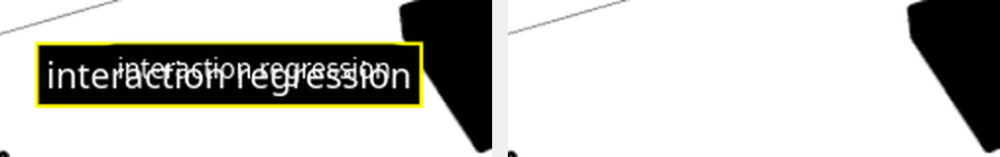

## What changed

<!-- tree: 17 session_viewer/src -->

- Data flow: `FaceSource` rows → `Faces::ids` → `vs_face` → `FACE_TAG` sub-ID → `Faces::source` → `SelectionMode::Face`.
- Data flow: manifest `TextItem` → `SceneText` row → `visible_texts` → plate/plane vertices with `object` → `fs_id`; a selected object draws `ink_color` black on a yellow backing.
- Data flow: `SegRows.*_chains` → `StrokeSegment.previous/next` → `join_plane` → partitioned cap coverage.
- GPU resources: face id buffer + selected-face uniform; two `R8Unorm` coverage masks, each with a `POOL`-reduced coarse copy the compositor consults first; strokes are 48-byte rows.
- `State` keeps its ownership; `state/cloud_query.rs` and `state/text.rs` are its companions.
- Memory: the pick pass renders a window-sized attachment, 4x antialiasing stops at device scale 2, `?dpr=` caps the device scale, and a lost device reloads once at reduced settings.

**Production equivalent:** every file in this lesson sits at the same path in production: `src/engine/gpu/faces.rs`, `src/engine/gpu/segments.rs`, `src/engine/gpu/surface_outline.rs`, `src/app/scene_text.rs`, `src/state/text.rs`, `src/state/cloud_query.rs`.

## Try

- Ctrl + Shift + click on the surface and then on the BRep's top: `Face N selected` names a source face in each; on the BRep the number is a face of the solid, not a triangle.
- Ctrl + Shift + click exactly on a mesh edge: the edge wins, because a nearby eligible edge is preferred over the face behind it.
- Select the BRep and press O, then orbit: the black border is the union of the visible solids. Press O again: the yellow fringe of the strokes now defines the object's outline, and it is not uniform where strokes meet.
- Load a manifest with two `texts` entries and hide one with H: the other stays, and S brings the hidden one back.
- Open `?thickness=6` and look at a corner of the polyline: no darker dot and no notch at the shared vertex, at any pen width.
- On a high-density screen open `?dpr=1`: the canvas renders a quarter of the pixels, clicks still land where the pointer is, and the perf line reports the smaller attachments.

## Next

[18 · Finite-triangle visibility](18-finite-visibility.md): why a neighbouring triangle's plane can hide a visible seam, and the tile index that fixes it.
