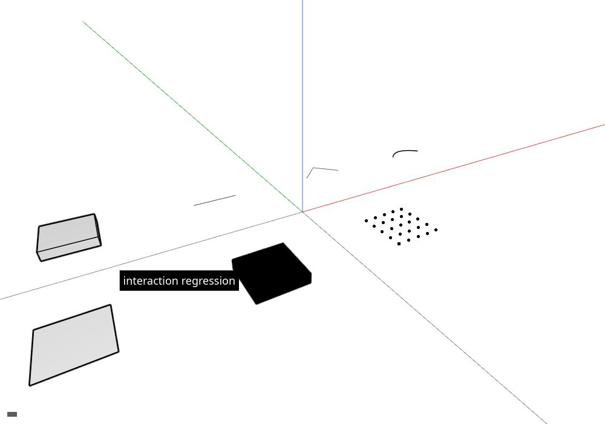

# 17 · Source faces, text objects and one silhouette
<!-- locator: off -->

Source faces and scene text become selectable, and optional outlines surround visible solids.

<!-- step-status: start -->

**Does it compile yet?** `cargo check` passes after steps 1, 2 and 17; steps 3–14, 14b, 15 and 16 fail and build again at step 17.

<!-- step-status: end -->

## Step 1 · src/engine/gpu/faces.rs

Face buffers preserve source face addresses alongside triangles. Several display triangles can name the same source face.
<!-- file: 17 session_viewer/src/engine/gpu/faces.rs type lines=1-27 -->
<!-- file: 17 session_viewer/src/engine/gpu/faces.rs type lines=28-77 -->
<!-- file: 17 session_viewer/src/engine/gpu/faces.rs type lines=78-127 -->
<!-- file: 17 session_viewer/src/engine/gpu/faces.rs type lines=128-170 -->
<!-- file: 17 session_viewer/src/engine/gpu/faces.rs type lines=171-214 -->
<!-- file: 17 session_viewer/src/engine/gpu/faces.rs type lines=215-253 -->
## Step 2 · src/shaders/triangle.wgsl

The mesh shader places vertices and shades visible faces. Its instance row must be the row uploaded with that vertex.
<!-- file: 17 session_viewer/src/shaders/triangle.wgsl type -->
<!-- check: 17 -->
## Step 3 · src/engine/gpu/arena.rs

The arena holds mesh vertices and indices across objects. Add the vertex base to local indices before appending a mesh.
<!-- file: 17 session_viewer/src/engine/gpu/arena.rs type hunks=1,2,4,5,6,7,8,10,11 -->
## Step 4 · src/app/walk/mesh.rs

The mesh walk uploads vertices, indices and source face IDs. Offset file-local indices only once.
<!-- file: 17 session_viewer/src/app/walk/mesh.rs type -->
## Step 5 · src/app/walk/brep.rs

The geometry walk uploads shaded faces and their source boundary edges. Tessellation diagonals must never become CAD edges.
<!-- file: 17 session_viewer/src/app/walk/brep.rs type -->
## Step 6 · src/app/selection.rs

Selection keeps original edge, face and control IDs under their parent object. Display mesh indices are not source IDs.
<!-- file: 17 session_viewer/src/app/selection.rs type -->
## Step 7 · src/engine/gpu/pick.rs

Picking reads an object and subobject ID asynchronously. Reject replies from a superseded request.
<!-- file: 17 session_viewer/src/engine/gpu/pick.rs type -->
## Step 8 · src/app/input.rs

Input routes gestures and keyboard actions to State. A moved pointer is a drag, not a selection click.
<!-- file: 17 session_viewer/src/app/input.rs type hunks=2,3,8,9,10,11 -->
## Step 9 · src/state.rs

State coordinates input, selection and frame requests. Cancel stale asynchronous results when the scene or camera changes.
<!-- file: 17 session_viewer/src/state.rs type hunks=6,7,10,11,14,15,16 -->
## Step 10 · src/engine/text.rs

Text layout retains shaped glyph positions for rendering. Use the same font bytes and size when comparing with browser text.
<!-- file: 17 session_viewer/src/engine/text.rs type -->
## Step 11 · src/app/manifest.rs

The manifest describes scene files and their placements. Report malformed entries before starting geometry downloads.
<!-- file: 17 session_viewer/src/app/manifest.rs type -->
## Step 12 · src/app/scene_text.rs

Scene text assigns labels their own source rows. Hiding and selection must use those rows rather than derived names.
<!-- file: 17 session_viewer/src/app/scene_text.rs type lines=1-12 -->
<!-- file: 17 session_viewer/src/app/scene_text.rs type lines=13-66 -->
<!-- file: 17 session_viewer/src/app/scene_text.rs type lines=67-85 -->
<!-- file: 17 session_viewer/src/app/scene_text.rs type lines=86-146 -->
## Step 13 · src/app/scene.rs

The scene owns source documents and maps their identities to GPU rows. Rebuild that mapping whenever rows are replaced.
<!-- file: 17 session_viewer/src/app/scene.rs type -->
## Step 14 · src/state/text.rs

State updates annotations when selection changes. Clear stale labels when their source object disappears.
<!-- file: 17 session_viewer/src/state/text.rs type lines=1-35 -->
<!-- file: 17 session_viewer/src/state/text.rs type lines=36-59 -->
<!-- file: 17 session_viewer/src/state/text.rs type lines=60-134 -->
<!-- file: 17 session_viewer/src/state/text.rs type lines=135-162 -->
## Step 15 · src/state/cloud_query.rs

State coordinates asynchronous source-point queries. A camera change invalidates any pending hit.
<!-- file: 17 session_viewer/src/state/cloud_query.rs type lines=1-36 -->
<!-- file: 17 session_viewer/src/state/cloud_query.rs type lines=37-101 -->
<!-- file: 17 session_viewer/src/state/cloud_query.rs type lines=102-165 -->
<!-- file: 17 session_viewer/src/state/cloud_query.rs type lines=166-220 -->
## Step 16 · src/state.rs

State coordinates input, selection and frame requests. Cancel stale asynchronous results when the scene or camera changes.
<!-- file: 17 session_viewer/src/state.rs type hunks=1,2,3,4,5,8,9,17,18 -->
## Step 17 · src/engine/gpu/objects.rs

The object table stores GPU rows separately from source identity. Rebase translations before converting to f32 so distant objects stay stable.
<!-- file: 17 session_viewer/src/engine/gpu/objects.rs type -->
## Step 18 · src/engine/gpu/text_plate.rs

Text plates draw a backing around shaped labels. Include glyph overhang when measuring the padding.
<!-- file: 17 session_viewer/src/engine/gpu/text_plate.rs type -->
## Step 19 · src/shaders/text_plate.wgsl

Text plates draw rounded backing shapes behind labels. Keep their screen-space dimensions consistent with the glyph scale.
<!-- file: 17 session_viewer/src/shaders/text_plate.wgsl type -->
## Step 20 · src/engine/gpu/text_plane.rs

Plane text projects labels through their scene placement. Its depth must participate in ordinary scene occlusion.
<!-- file: 17 session_viewer/src/engine/gpu/text_plane.rs type -->
## Step 21 · src/shaders/text_plane.wgsl

Plane labels project shaped glyphs onto their scene plane. Preserve projected depth so solids can hide the label.
<!-- file: 17 session_viewer/src/shaders/text_plane.wgsl type -->
## Step 22 · src/engine/gpu/text.rs

The GPU text owner coordinates glyphs and label backgrounds. Apply the framebuffer scale once so glyphs remain sharp.
<!-- file: 17 session_viewer/src/engine/gpu/text.rs type hunks=1-6 -->
<!-- file: 17 session_viewer/src/engine/gpu/text.rs type hunks=7-18 -->
## Step 23 · src/app/inspection.rs

Inspection reports retained resources and source information. Count shared documents once instead of once per placement.
<!-- file: 17 session_viewer/src/app/inspection.rs type hunks=2-2 -->
## Step 24 · src/engine/gpu/surface_outline.rs

Surface masks add outlines around visible coverage. Reuse masks only while camera, geometry and selection are unchanged.
<!-- file: 17 session_viewer/src/engine/gpu/surface_outline.rs type lines=1-27 -->
<!-- file: 17 session_viewer/src/engine/gpu/surface_outline.rs type lines=28-115 -->
<!-- file: 17 session_viewer/src/engine/gpu/surface_outline.rs type lines=116-140 -->
<!-- file: 17 session_viewer/src/engine/gpu/surface_outline.rs type lines=141-223 -->
<!-- file: 17 session_viewer/src/engine/gpu/surface_outline.rs type lines=224-248 -->
<!-- file: 17 session_viewer/src/engine/gpu/surface_outline.rs type lines=249-285 -->
<!-- file: 17 session_viewer/src/engine/gpu/surface_outline.rs type lines=286-312 -->
<!-- file: 17 session_viewer/src/engine/gpu/surface_outline.rs type lines=313-341 -->
<!-- file: 17 session_viewer/src/engine/gpu/surface_outline.rs type lines=342-373 -->
Download this part from its link to the path shown.
<!-- file: 17 session_viewer/src/engine/gpu/surface_outline.rs copy lines=374-637 -->
## Step 25 · src/shaders/surface_outline.wgsl

The outline shader expands visible coverage into a narrow border. Skip empty coarse blocks before scanning the neighboring pixels.
<!-- file: 17 session_viewer/src/shaders/surface_outline.wgsl type -->
## Step 26 · src/engine/gpu/arena.rs

The arena holds mesh vertices and indices across objects. Add the vertex base to local indices before appending a mesh.
<!-- file: 17 session_viewer/src/engine/gpu/arena.rs type hunks=3,9,12 -->
## Step 27 · src/engine/gpu/view.rs

View settings control display features without changing source geometry. Convert device pixel ratio once at the framebuffer boundary.
<!-- file: 17 session_viewer/src/engine/gpu/view.rs type -->
## Step 28 · src/app/input.rs

Input routes gestures and keyboard actions to State. A moved pointer is a drag, not a selection click.
<!-- file: 17 session_viewer/src/app/input.rs type hunks=4-4 -->
## Step 29 · src/app/inspection.rs

Inspection reports retained resources and source information. Count shared documents once instead of once per placement.
<!-- file: 17 session_viewer/src/app/inspection.rs type hunks=1-1 -->
## Step 30 · src/app/walk/curves.rs

Curve sampling builds connected strokes from source geometry. Keep segment endpoints shared so joints remain continuous.
<!-- file: 17 session_viewer/src/app/walk/curves.rs type -->
## Step 31 · src/app/walk/brep_edges.rs

Boundary chains share samples between adjacent faces. Preserve oriented source edge IDs through the upload.
<!-- file: 17 session_viewer/src/app/walk/brep_edges.rs type -->
## Step 32 · src/engine/gpu/segments.rs

The segment buffers store strokes and the object rows they belong to. Preserve source IDs when expanding or joining segments.
<!-- file: 17 session_viewer/src/engine/gpu/segments.rs type hunks=1-5 -->
<!-- file: 17 session_viewer/src/engine/gpu/segments.rs type hunks=6-13 -->
<!-- file: 17 session_viewer/src/engine/gpu/segments.rs type hunks=14-16 -->
## Step 33 · src/engine/gpu/instance.rs

Each object row carries placement, color and selection flags for later interaction. Rust field offsets must match the shader byte for byte.
<!-- file: 17 session_viewer/src/engine/gpu/instance.rs type -->
## Step 34 · src/shaders/ribbon.wgsl

The stroke shader expands segments into screen-space ribbons. Clip the near plane before dividing by w.
<!-- file: 17 session_viewer/src/shaders/ribbon.wgsl type hunks=1-3 -->
<!-- file: 17 session_viewer/src/shaders/ribbon.wgsl type hunks=4-5 -->
<!-- file: 17 session_viewer/src/shaders/ribbon.wgsl type hunks=6-7 -->
Download each file to the path shown.
<!-- supplied: 17 -->
## Step 35 · src/shaders/splat.wgsl

Point projection writes the nearest visible cloud samples. Keep source IDs attached to the winning samples.
<!-- file: 17 session_viewer/src/shaders/splat.wgsl type -->
## Step 36 · src/shaders/splat_resolve.wgsl

The resolve writes point color and depth into the scene. Background samples must leave geometry untouched.
<!-- file: 17 session_viewer/src/shaders/splat_resolve.wgsl type -->
## Step 37 · src/app/input.rs

Input routes gestures and keyboard actions to State. A moved pointer is a drag, not a selection click.
<!-- file: 17 session_viewer/src/app/input.rs type hunks=1,5,6,7,12 -->
## Step 38 · src/lib.rs

The crate entry point connects the camera, scene and GPU owners. Wire initialization and frame updates together so a new module actually runs.
<!-- file: 17 session_viewer/src/lib.rs type -->
## Step 39 · src/engine/gpu/targets.rs

Targets own the depth and color attachments for a frame. Reversed depth clears to zero and compares nearer values as greater.
<!-- file: 17 session_viewer/src/engine/gpu/targets.rs type -->
## Step 40 · src/app/route.rs

Route helpers read viewer options from the page URL. Missing options must retain usable defaults.
<!-- file: 17 session_viewer/src/app/route.rs type -->
## Step 41 · src/app/feedback.rs

Feedback publishes status and panel information from the same application state. Return keyboard focus after dismissing an input panel.
<!-- file: 17 session_viewer/src/app/feedback.rs type -->
## Step 42 · src/state.rs

State coordinates input, selection and frame requests. Cancel stale asynchronous results when the scene or camera changes.
<!-- file: 17 session_viewer/src/state.rs type hunks=12-13 -->
## Step 43 · src/engine/gpu/selection_outline.rs

Remove this file; its replacement is now part of the rendering modules.
<!-- file: 17 session_viewer/src/engine/gpu/selection_outline.rs -->
## Step 44 · src/shaders/selection_outline.wgsl

Remove this file; its replacement is now part of the rendering modules.
<!-- file: 17 session_viewer/src/shaders/selection_outline.wgsl -->
## Step 45 · src/engine/gpu/mod.rs

The GPU owner connects buffers, pipelines and frame resources. Create resources before building the bind groups that refer to them.
<!-- file: 17 session_viewer/src/engine/gpu/mod.rs type -->
## Step 46 · src/engine/gpu/render.rs

The frame encoder orders face, ink, picking and overlay passes. Later passes must load the attachments written by earlier ones.
<!-- file: 17 session_viewer/src/engine/gpu/render.rs type -->
## Check

<!-- checkpoint: 17 -->

Expected: Source faces and scene text become selectable, and optional outlines surround visible solids; status: **Face N selected**.

If it fails:

- A face click selects an edge: edges intentionally win where both are hit.
- Text stays visible after hiding: its row is missing from the scene visibility path.
- Joints show dark dots: connected segments overlap instead of sharing a join partition.

## What changed

<!-- tree: 17 session_viewer/src -->

Data flow: source files → retained scene state → GPU buffers → visible result. Every file at this point: [source at checkpoint 17](../lessons/17/index.md).

## Next

[18 · Finite-triangle visibility](18-finite-visibility.md): why a neighbouring triangle's plane can hide a visible seam, and the tile index that fixes it.

## Expected viewer result

The full interaction fixture after adding source-face selection, authored text and silhouettes. Use the selection examples above to check each new interaction.

