# 17 · Source faces, text objects and one silhouette

## You are building

**A · source faces**

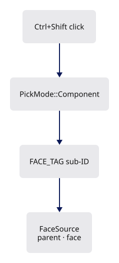

**B · text objects**

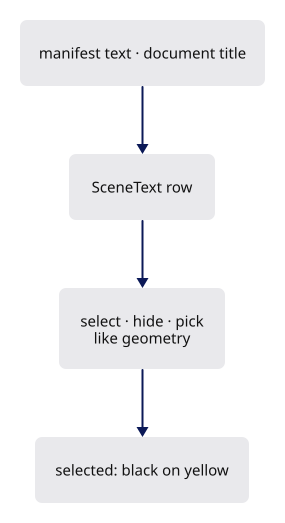

**C · one silhouette**

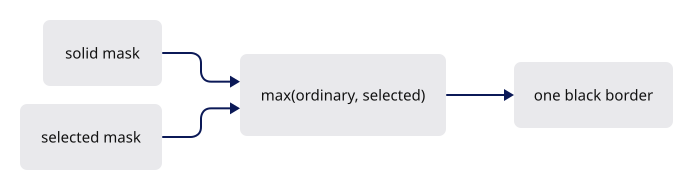

**D · joined strokes**

**E · every pixel the same size**

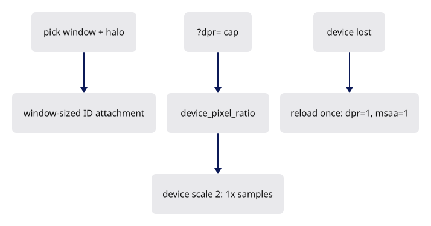

## Starting point

- Checkpoint 16: objects, edges and controls are selectable; text is an annotation without identity; the selected object's outline is drawn by `selection_outline.rs`.
- Five independent parts share this checkpoint; each is complete on its own, and the frame order at the end wires them together.

## Part A · Select a source face

### Step 1 · Face identities over the existing triangles

{ .locator data-strip="illustrations/strip-ccdfd9e2ff.svg" }

- One `FaceSource` per original face; every display triangle of that face stores the same address in `ids`.
- Picking pulls the arena's existing vertices by index: no duplicate mesh, no per-face draw call.
- `FACE_TAG` keeps face addresses apart from edge and control sub-IDs in the same pick channel.

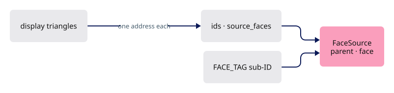

<!-- file: 17 session_viewer/src/engine/gpu/faces.rs type lines=1-28 -->

Group 3 borrows the arena's buffers and adds the face table and the selected-face uniform:

| Binding | Rust buffer | WGSL |
|---|---|---|
| 0 | arena vertices | `face_vertices: array<f32>` |
| 1 | arena object ids | `face_objects: array<u32>` |
| 2 | arena triangle indices | `face_indices: array<u32>` |
| 3 | `ids` | `source_faces: array<u32>` |
| 4 | `selected` uniform | `selected_face: vec4<u32>` |

<!-- file: 17 session_viewer/src/engine/gpu/faces.rs type lines=29-78 -->

- `append` shifts upload-local face addresses by the scene's running count, so replacement never reuses an address.

<!-- file: 17 session_viewer/src/engine/gpu/faces.rs type lines=79-128 -->

- `source` rejects a sub-ID whose parent row does not match: a stale address cannot select another object's face.

<!-- file: 17 session_viewer/src/engine/gpu/faces.rs type lines=129-166 -->

<!-- file: 17 session_viewer/src/engine/gpu/faces.rs type lines=167-204 -->

- Three pipelines, one vertex entry `vs_face`: IDs into the pick target, the highlight over read-only equal depth, and a coverage mask for part C.

<!-- file: 17 session_viewer/src/engine/gpu/faces.rs type lines=205-243 -->

### Step 2 · The triangle shader learns vertex pulling

{ .locator data-strip="illustrations/strip-093d035257.svg" }

- `transform_vertex` is the old `vs_main` body; `vs_face` reaches the same code through storage buffers instead of vertex attributes.
- `fs_id` writes `FACE_TAG | address` as the sub-ID; `fs_face_highlight` discards everything but the selected face.
- `fs_solid_mask` writes plain coverage; part C reads it.
- `LineUniform` lists `origin` and `frame` — window origin, canvas size — in the order every shader copy declares.

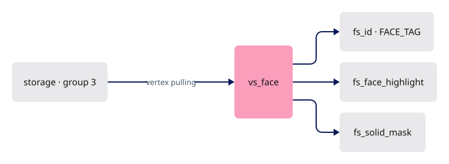

<!-- file: 17 session_viewer/src/shaders/triangle.wgsl type -->

<!-- check: 17 -->

### Step 3 · The arena owns a `Faces` lane

{ .locator data-strip="illustrations/strip-ccdfd9e2ff.svg" }

- Vertex, id and index buffers gain `STORAGE` usage so `vs_face` can read them.
- `draw_component_ids` replaces the object-ID draw only in component pick mode.

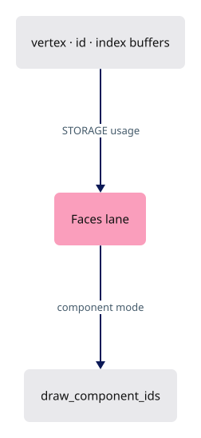

<!-- file: 17 session_viewer/src/engine/gpu/arena.rs type hunks=1,2,4,5,6,7,8,10,11 -->

### Step 4 · Producers emit one face address per triangle

{ .locator data-strip="illustrations/strip-6f8f40e8fe.svg" }

- Meshes: sorted source face keys, cached triangulation or the fan the kernel would build; the assertion ties the address stream to the triangle stream.
- BReps: `push_face` records the face index it is tessellating.

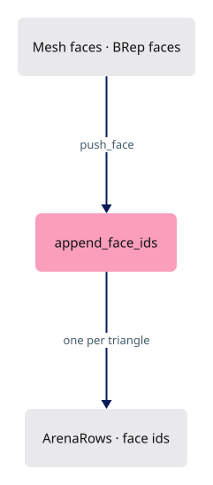

<!-- file: 17 session_viewer/src/app/walk/mesh.rs type -->

<!-- file: 17 session_viewer/src/app/walk/brep.rs type -->

- `push_face` records its source face once per triangle emitted; that address is what makes a face pickable.

### Step 5 · A third selection mode

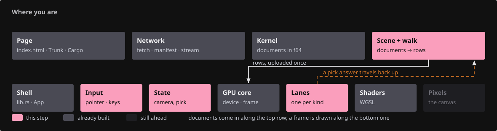{ .locator data-strip="illustrations/strip-0af69e52fd.svg" }

- `SelectionMode::Face` carries parent and face, so Escape returns to the parent like edges do.
- `PickMode::Component`: the pick sorter prefers a nearby edge, then a face.
- No object fallback — a component click that finds neither selects nothing: narrowing to a component is a different intent from selecting the whole object.

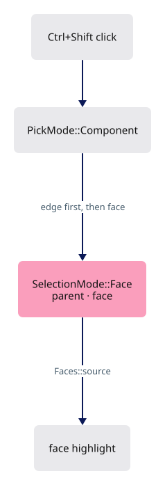

<!-- file: 17 session_viewer/src/app/selection.rs type -->

- The picker renders into the pick window plus a three-texel `PICK_HALO`, never the canvas.
- `view_for` falls back to the whole canvas for a full-frame capture.

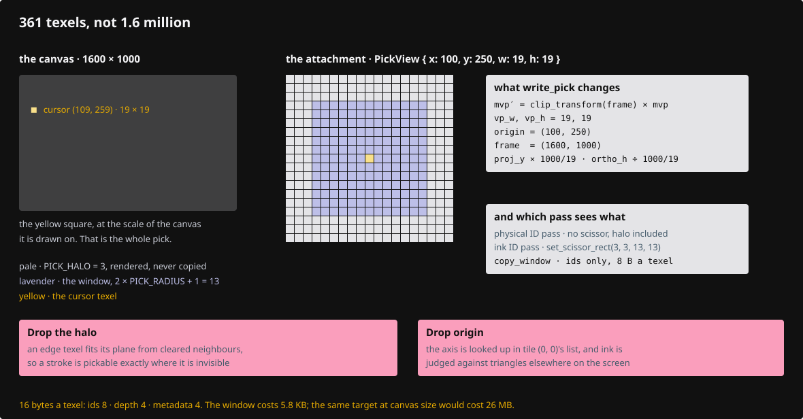

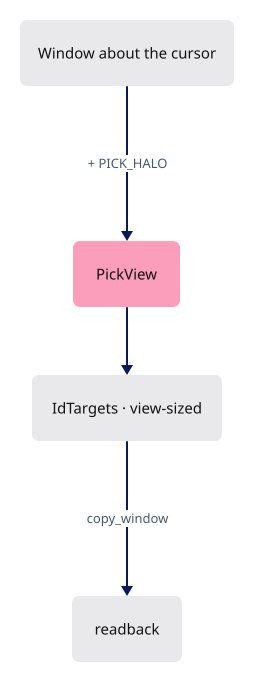

<!-- file: 17 session_viewer/src/engine/gpu/pick.rs type -->

- Input tracks Shift; Ctrl+Shift requests a component pick.

<!-- file: 17 session_viewer/src/app/input.rs type hunks=2,3,8,9,10,11 -->

- State maps the answer back through `Faces::source`, selects the parent, then narrows the highlight to the face.

<!-- file: 17 session_viewer/src/state.rs type hunks=7,8,11,12,15,16 -->

## Part B · Authored text is an object

### Step 6 · A text label can own a row

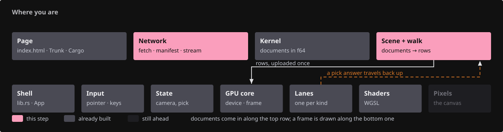{ .locator data-strip="illustrations/strip-9b2d3ea953.svg" }

- `TextObject { row, selected }` marks a label as a scene object; `None` marks a derived annotation such as the selected-object name.
- `ink_color` is black while the object is selected, the authored color otherwise; both text renderers read it, so the authored color is never touched.

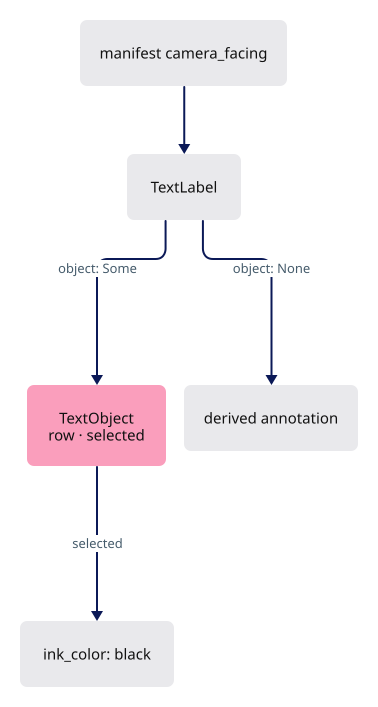

<!-- file: 17 session_viewer/src/engine/text.rs type -->

- Manifest text may face the camera instead of lying in a fixed plane.

<!-- file: 17 session_viewer/src/app/manifest.rs type -->

### Step 7 · Scene registers text rows

{ .locator data-strip="illustrations/strip-6f8f40e8fe.svg" }

- A key (`manifest-text/{index}`, `document-title/{doc}`) finds its previous row on reload, so hidden state survives replacement.
- The row is an ordinary `ObjectRow`; hide, select and pick treat it like geometry.

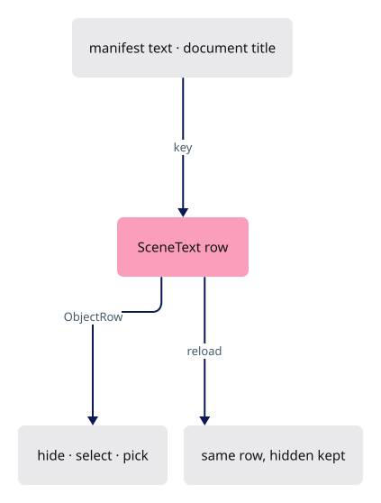

<!-- file: 17 session_viewer/src/app/scene_text.rs type lines=1-15 -->

<!-- file: 17 session_viewer/src/app/scene_text.rs type lines=16-67 -->

<!-- file: 17 session_viewer/src/app/scene_text.rs type lines=68-85 -->

<!-- file: 17 session_viewer/src/app/scene_text.rs type lines=86-142 -->

- Resolving text by row, and building the visible submission with the current selection flags.

<!-- file: 17 session_viewer/src/app/scene.rs type -->

- `Scene` declares the text file as a sibling module: text rows and geometry rows are one kind of thing, sharing one numbering.

### Step 8 · State's companions: text presentation and streamed queries

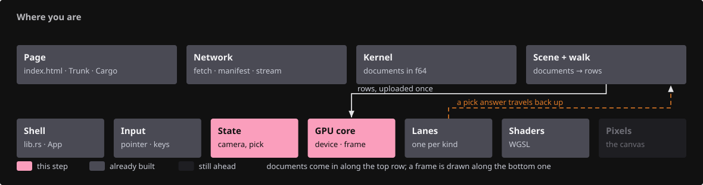{ .locator data-strip="illustrations/strip-2e217df3d4.svg" }

- `update_label` submits the visible source texts plus the one derived name, which has no row and cannot steal its parent's click.

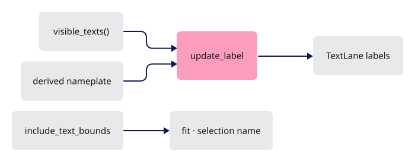

<!-- file: 17 session_viewer/src/state/text.rs type lines=1-33 -->

<!-- file: 17 session_viewer/src/state/text.rs type lines=34-54 -->

<!-- file: 17 session_viewer/src/state/text.rs type lines=55-112 -->

- Fitting includes authored text: a label's shaped extent in its own fixed frame joins the scene's bounds, or `F` would cut the text off.

<!-- file: 17 session_viewer/src/state/text.rs type lines=113-144 -->

- `State`'s second companion is the streamed F10 query: `State` owns it, and this file groups its page, answer and resolve workflow.

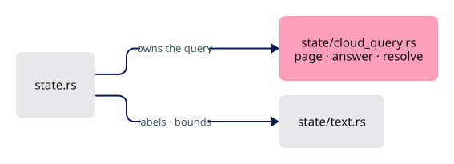

<!-- file: 17 session_viewer/src/state/cloud_query.rs type lines=1-38 -->

<!-- file: 17 session_viewer/src/state/cloud_query.rs type lines=39-101 -->

- The page loop, one page per frame: fetch, test, accumulate, and resolve the winner only once every eligible page has answered.

<!-- file: 17 session_viewer/src/state/cloud_query.rs type lines=102-159 -->

- Each batch is stamped with the camera, scene and parent it was asked against; an older generation's callback is dropped rather than answered.

<!-- file: 17 session_viewer/src/state/cloud_query.rs type lines=160-212 -->

- `state.rs` declares both modules and keeps only ownership; hide and show refresh labels.

<!-- file: 17 session_viewer/src/state.rs type hunks=1,3,4,5,6,9,10,17,18 -->

<!-- file: 17 session_viewer/src/engine/gpu/objects.rs type -->

- The source-face highlight itself belongs to `faces.rs`.

### Step 9 · Plates and planes draw IDs

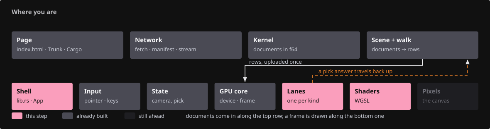{ .locator data-strip="illustrations/strip-97bd00abc7.svg" }

- Camera-facing text: `Plates` gains a depth per rectangle, an object row and an ID pipeline; physical plates draw before glyphs, overlays after.
- Every plate vertex carries `object` and a selection flag; the plate's signed distance defines coverage, the yellow backing and the pick footprint.
- A selected plate fills the whole rounded backing yellow; every backing reserves a full cap at each end, so rounding never intersects the shaped line.
- `vs_id` maps the same clip-space vertices through the pick pass's window transform, so the ID footprint lands in the window-sized attachment.

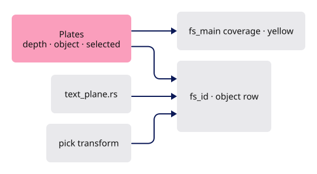

<!-- file: 17 session_viewer/src/engine/gpu/text_plate.rs type -->

<!-- file: 17 session_viewer/src/shaders/text_plate.wgsl type -->

- Fixed-plane text: the same three attributes and ID pipeline; the padding matches the selection-name plate.

<!-- file: 17 session_viewer/src/engine/gpu/text_plane.rs type -->

<!-- file: 17 session_viewer/src/shaders/text_plane.wgsl type -->

- The text lane exposes `draw_ids`, and `text_rectangle` serves nameplates and source labels alike.

<!-- file: 17 session_viewer/src/engine/gpu/text.rs type hunks=1-5 -->

- Remaining label literals in this file gain the new field:

<!-- file: 17 session_viewer/src/engine/gpu/text.rs type hunks=6-17 -->

<!-- file: 17 session_viewer/src/app/inspection.rs type hunks=2 -->

- Each reported label gains its object row, world height and resolved ink colour, so the snapshot says which text is selected, not just what text exists.

## Part C · One black silhouette

### Step 10 · Two masks, one compositor

{ .locator data-strip="illustrations/strip-aff484c5a8.svg" }

- Ordinary outlines describe the union of all visible solids; touching or overlapping objects get no inner seam.
- The selected mask is thicker; the compositor takes `max(ordinary, selected)`, so the overlap never blends twice.
- A selected interior suppresses the ordinary contour.
- Each mask carries a coarse copy, the maximum of every `POOL` × `POOL` block.
- The compositor reads it first and skips the dilation loop wherever no covered texel is in reach — most of the frame.

<!-- file: 17 session_viewer/src/engine/gpu/surface_outline.rs type lines=1-33 -->

Group 0 is the ordinary mask, group 1 the selected; one layout serves both, and the pool layout holds one mask for the reduction:

| Group · binding | Rust | WGSL |
|---|---|---|
| 0 · 0 | resolved `R8Unorm` coverage | `mask: texture_2d<f32>` |
| 0 · 1 | `uniform` (radius, is_selected) | `radius: vec4<f32>` |
| 0 · 2 | `coarse`: block maxima of the mask | `coarse: texture_2d<f32>` |
| 1 · 0 / 1 / 2 | the selected outline's mask, uniform and coarse copy | `selected_mask`, `selected_radius`, `selected_coarse` |
| pool · 0 | the resolved mask being reduced | `mask` in `fs_pool` |

<!-- file: 17 session_viewer/src/engine/gpu/surface_outline.rs type lines=34-121 -->

<!-- file: 17 session_viewer/src/engine/gpu/surface_outline.rs type lines=122-145 -->

- `prepare` allocates coverage only while something is outlined.
- The coarse texture is `size / POOL` in each direction, bound beside the resolved mask.
- Lesson 18 settles on one radius for ordinary and selected solids.

<!-- file: 17 session_viewer/src/engine/gpu/surface_outline.rs type lines=146-226 -->

- The radius is the only per-frame write: CSS pixels scaled to physical and clamped, so the ring keeps its apparent weight at any device scale.
- The textures above are touched only when the size changes.

<!-- file: 17 session_viewer/src/engine/gpu/surface_outline.rs type lines=227-250 -->

- The mask pass tests the frame's immutable depth, so hidden surfaces cannot contribute coverage.

<!-- file: 17 session_viewer/src/engine/gpu/surface_outline.rs type lines=251-287 -->

- `encode_pool` runs after the mask pass: one full-screen triangle over the coarse texture, no depth, `fs_pool` as its fragment entry.

<!-- file: 17 session_viewer/src/engine/gpu/surface_outline.rs type lines=288-314 -->

- `draw_combined` composites both silhouettes once; `allocated_bytes` counts the coarse texture with the mask.

<!-- file: 17 session_viewer/src/engine/gpu/surface_outline.rs type lines=315-343 -->

<!-- file: 17 session_viewer/src/engine/gpu/surface_outline.rs type lines=344-375 -->

Copy the rest of the file. Its unit block turns `show_outlines` on explicitly, because silhouettes start off:

<!-- file: 17 session_viewer/src/engine/gpu/surface_outline.rs copy lines=376-624 -->

- The shader dilates coverage with a one-pixel smooth edge and returns black at that alpha.
- `near_any_coverage` returns zero without entering the loop when the pixel's coarse block and its eight neighbours are all empty.

<!-- file: 17 session_viewer/src/shaders/surface_outline.wgsl type -->

### Step 11 · The arena draws the solid mask

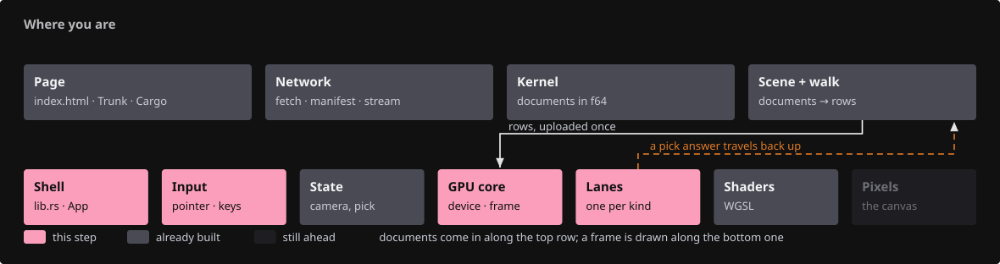{ .locator data-strip="illustrations/strip-fcd274b834.svg" }

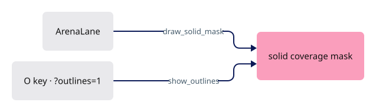

<!-- file: 17 session_viewer/src/engine/gpu/arena.rs type hunks=3,9,12 -->

- Silhouettes start **off**: two coverage masks and a compositor cost a full-screen pass per frame, slow on integrated GPUs.
- `O` turns them on; `?outlines=1` / `VIEWER_OUTLINES=1` starts with them on.
- The default pen is one CSS pixel; `?thickness=` / `VIEWER_THICKNESS` selects a heavier weight.
- The headlight starts **off** (`D`, `?lit=1` / `VIEWER_LIT=1` turn it on), and so do back faces (`?backface=1` paints them red).
- A CAD drawing reads better flat, and a wrong normal shows more clearly when shading is a switch rather than the default.
- `device_pixel_ratio` is the capped ratio the canvas and camera use; `?dpr=` lowers it to trade crispness for memory, never above the browser's and never below 0.5.

<!-- file: 17 session_viewer/src/engine/gpu/view.rs type -->

<!-- file: 17 session_viewer/src/app/input.rs type hunks=4-4 -->

- The module comment at the top of this file is the viewer's nearest thing to a user manual, so the next step brings it up to date.

<!-- file: 17 session_viewer/src/app/inspection.rs type hunks=1 -->

- `?inspect=1` is how every checkpoint in this course is observed without a screenshot.

## Part D · Subdivisions share one join

### Step 12 · Producers mark chains

{ .locator data-strip="illustrations/strip-6f8f40e8fe.svg" }

- A chain is one authored curve or one BRep edge; independent mesh wires never join just because endpoints coincide.

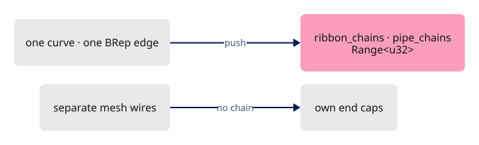

<!-- file: 17 session_viewer/src/app/walk/curves.rs type -->

<!-- file: 17 session_viewer/src/app/walk/brep_edges.rs type -->

- That range tells the join code which segments are neighbours and which merely touch.

### Step 13 · The GPU row gains neighbours

{ .locator data-strip="illustrations/strip-187e4e26b4.svg" }

- `StrokeSegment` wraps the source row with `previous` and `next` GPU indices.
- `joined_rows` links consecutive chain members whose endpoints, instance, color and radius agree, and wraps a closed chain.

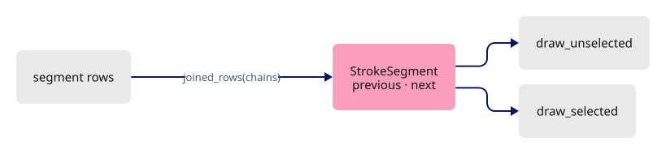

<!-- file: 17 session_viewer/src/engine/gpu/segments.rs type hunks=1-6 -->

- Two more pipelines split ordinary from selected strokes; `draw_selected` is skipped when nothing is selected.

<!-- file: 17 session_viewer/src/engine/gpu/segments.rs type hunks=7-14 -->

<!-- file: 17 session_viewer/src/engine/gpu/segments.rs type hunks=15-17 -->

- The layout test mirrors `StrokeSegment` and pins `origin` and `frame` in every shader copy of `LineUniform`: 80 bytes.

<!-- file: 17 session_viewer/src/engine/gpu/instance.rs type -->

### Step 14 · One join plane per shared vertex

{ .locator data-strip="illustrations/strip-093d035257.svg" }

- Both segments at a shared vertex call `join_plane(before, after)` with the same ordered pair, so both compute the same bisector plane.
- The start side keeps pixels on its side of the plane, the end side excludes them: exactly one segment owns each pixel of the shared cap.
- `stroke_vertex(vid, layer)` culls the other layer's strokes, so the selected pass draws only selected ink.

<!-- file: 17 session_viewer/src/shaders/ribbon.wgsl type hunks=1-2 -->

- A selected stroke keeps an opaque yellow core at least `line.thickness` wide; CAD boundary samples never taper with density.

<!-- file: 17 session_viewer/src/shaders/ribbon.wgsl type hunks=3-4 -->

- Three vertex entries share `stroke_vertex`; `coverage` applies both join planes before the capsule distance.

<!-- file: 17 session_viewer/src/shaders/ribbon.wgsl type hunks=5-6 -->

### Step 14b · Install the supplied tooling

The reference page and native fixtures use the text-object field from Part B, so they are copied now:

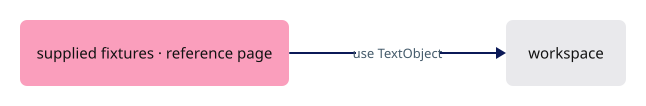

<!-- supplied: 17 -->

## Part E · Every pixel the same size

Three rules keep every pixel the same: the pick pass draws a window, antialiasing stops at device scale 2, and a lost device reloads once at the smallest settings.

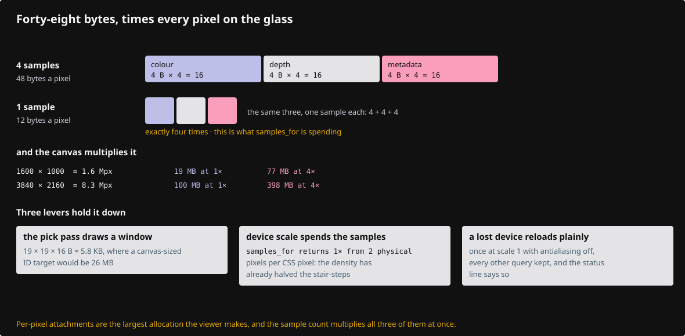

### Step 15 · The pick window's uniforms

{ .locator data-strip="illustrations/strip-093d035257.svg" }

- The pick pass sees the scene through the sub-frustum of the window about the cursor: `LineUniform` and `CloudUniform` carry the window `origin` and the canvas `frame`.
- In a colour frame `origin` is zero and `frame` is the canvas, so the same arithmetic serves both.
- Splats project with `frame` and subtract `origin`, so a point's footprint keeps its pixel size inside the window-sized attachment.
- The grid lists only the new fields.

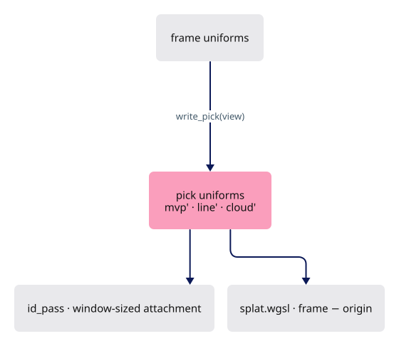

<!-- file: 17 session_viewer/src/shaders/splat.wgsl type -->

<!-- file: 17 session_viewer/src/shaders/splat_resolve.wgsl type -->

- The resolve's `CloudUniform` gains `origin` so its layout still matches the block the point pass writes.
- The offset is applied in `splat.wgsl`, where the footprint is computed.

### Step 16 · Device scale and a lost device

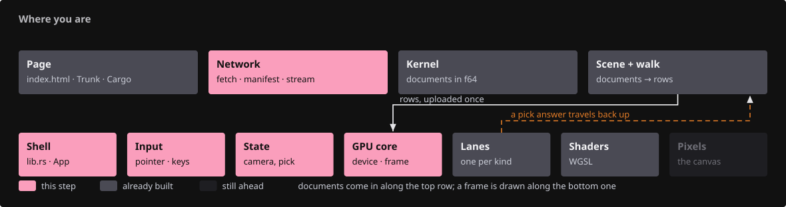{ .locator data-strip="illustrations/strip-f097f329df.svg" }

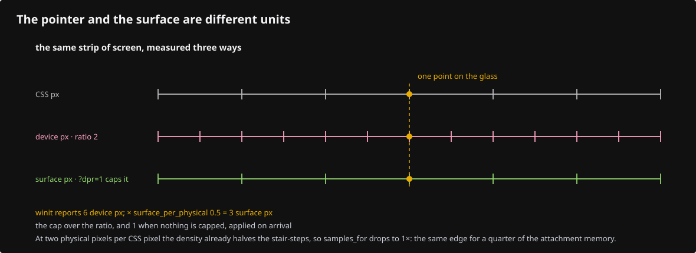

- Input and canvas sizing share the capped `device_pixel_ratio`, so a pointer position and a rendered pixel agree at any `?dpr=`.
- `samples_for` returns 1x from two physical pixels per CSS pixel: density already halves the stair-steps, at a quarter of the attachment memory. `forced` still wins.
- On a lost device — video memory exhausted — `recover_from_device_loss` reloads the page once at device scale 1 without antialiasing, keeping every other query.
- `recovered_notice` keeps the status line saying so on the reloaded page.

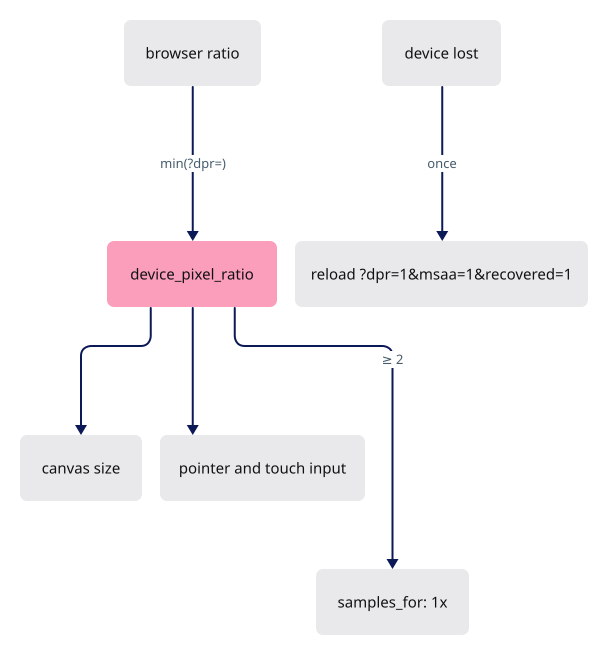

- winit reports cursor and touch positions at the browser's ratio even when `?dpr=` renders the canvas below it.
- `surface_per_physical` is the cap over that ratio, 1 without a cap; every arriving pointer and touch position is multiplied by it, so picks, zooms and drags read against the surface actually drawn.
- The input layer sets `State::interacting` while a button or finger drags.
- Drag frames come back to back, so their spacing is the cost of a frame.
- Thirty in a row slower than 40 ms tell `reduce_for_slow_frames` to render at device scale 1 without antialiasing from then on — the attachments a device loss reloads into, without waiting for the loss. The status line says so.

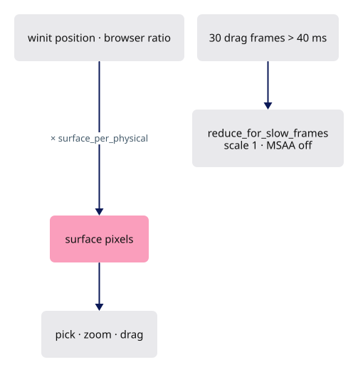

<!-- file: 17 session_viewer/src/app/input.rs type hunks=1,5,6,7,12 -->

<!-- file: 17 session_viewer/src/lib.rs type -->

- One hunk, in `desired_canvas_size`: the `?dpr=` cap that lets someone trade crispness for memory.

<!-- file: 17 session_viewer/src/engine/gpu/targets.rs type -->

- The sample-count policy, not the masks: the coverage masks live in `surface_outline.rs`.

<!-- file: 17 session_viewer/src/app/route.rs type -->

- A lost device is not an error to report but a smaller frame to ask for.

<!-- file: 17 session_viewer/src/app/feedback.rs type -->

- A device-loss failure returns before the error panel; every other failure still reports.

<!-- file: 17 session_viewer/src/state.rs type hunks=2,13,14 -->

<!-- step-status: start -->

**Does it compile yet?** `cargo check` passes after steps 1, 2 and 17; steps 3–14, 14b, 15 and 16 fail and build again at step 17.

<!-- step-status: end -->

## Step 17 · Wire the frame

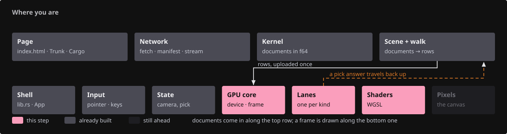{ .locator data-strip="illustrations/strip-61978be411.svg" }

- The old `selection_outline` lane goes away; two `SurfaceOutline` instances take its place, and `samples_for` receives the pixel scale.
- Frame order: face highlight, print geometry, unselected strokes, selected **solid** strokes, the combined black silhouette, then selected **standalone** curves over coincident mesh ink.
- Each mask pass is followed by its pool pass.
- `id_pass` computes the window's view, writes the pick uniforms, draws the whole attachment (halo included) and scissors the ink and source passes to the window inside it.
- Authored text draws its IDs in every pick mode.

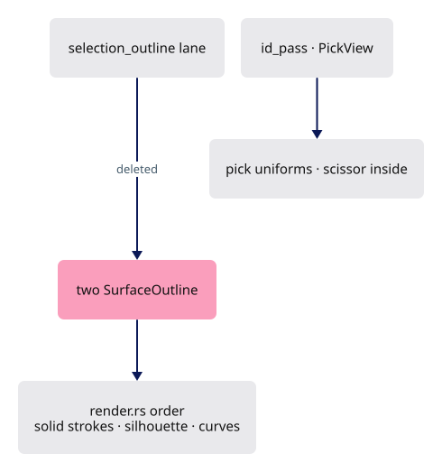

<!-- file: 17 session_viewer/src/engine/gpu/selection_outline.rs -->

<!-- file: 17 session_viewer/src/shaders/selection_outline.wgsl -->

<!-- file: 17 session_viewer/src/engine/gpu/mod.rs type -->

- `Gpu`'s lane list is what the frame walks, so this is where a new lane announces itself.

<!-- file: 17 session_viewer/src/engine/gpu/render.rs type -->

- This is the file to read when something draws on top of something it should not.

## Check

<!-- checkpoint: 17 -->

Expected:

- Ctrl+Shift-click inside a mesh, BRep or surface: that source face turns yellow; the status reads `Face N selected`.
- Ctrl+Shift-click on an edge: the edge wins over the face.
- Click a solid, press **O** and orbit: one continuous black border of uniform width; press **O** again to hide it.
- Click a manifest text or a document title: it selects like geometry, black letters on a yellow rounded backing.
- **H** hides it, **S** shows it; **T** still toggles only the derived selected-object name.
- A dense polyline and the same curve with few segments look the same at their joints: no darker dots, no gaps.
- Source edges and lines draw with a one-pixel pen; `?thickness=1.5` selects a heavier weight.

## What changed

<!-- tree: 17 session_viewer/src -->

- Data flow: `FaceSource` rows → `Faces::ids` → `vs_face` → `FACE_TAG` sub-ID → `Faces::source` → `SelectionMode::Face`.
- Data flow: manifest `TextItem` → `SceneText` row → `visible_texts` → plate/plane vertices with `object` → `fs_id`; a selected object draws `ink_color` black on a yellow backing.
- Data flow: `SegRows.*_chains` → `StrokeSegment.previous/next` → `join_plane` → partitioned cap coverage.
- GPU resources: face id buffer + selected-face uniform; two `R8Unorm` coverage masks, each with a `POOL`-reduced coarse copy the compositor consults first; strokes are 48-byte rows.
- `State` keeps its ownership; `state/cloud_query.rs` and `state/text.rs` are its companions.
- Memory: the pick pass renders a window-sized attachment, 4x antialiasing stops at device scale 2, `?dpr=` caps the device scale, and a lost device reloads once at reduced settings.

**Production equivalent:** every file in this lesson sits at the same path in production: `src/engine/gpu/faces.rs`, `src/engine/gpu/segments.rs`, `src/engine/gpu/surface_outline.rs`, `src/app/scene_text.rs`, `src/state/text.rs`, `src/state/cloud_query.rs`.

## Try

- Ctrl + Shift + click the surface, then the BRep's top: `Face N selected` names a source face in each; on the BRep it is a face of the solid, not a triangle.
- Ctrl + Shift + click exactly on a mesh edge: the edge wins — a nearby eligible edge beats the face behind it.
- Select the BRep, press O and orbit: the black border is the union of the visible solids. Press O again and the strokes' yellow fringe defines the outline instead — not uniform where strokes meet.
- Load a manifest with two `texts` entries and hide one with H: the other stays, and S brings the hidden one back.
- Open `?thickness=6` and look at a corner of the polyline: no darker dot and no notch at the shared vertex, at any pen width.
- On a high-density screen open `?dpr=1`: the canvas renders a quarter of the pixels, clicks still land where the pointer is, and the perf line reports the smaller attachments.

## Questions and answers

**Face picking pulls the arena's existing vertices by index rather than building a per-face mesh. What would the alternative cost?**

*How to work it out.* To pick a face you need the face's triangles. Two ways to have them: store a second copy grouped by face, or index the copy you already uploaded. Price both — a second copy doubles mesh memory and can drift out of sync; one draw call per face is thousands of draws.

*The answer.* Vertex pulling: the face lane adds a table of face addresses and a bind group, and the triangles stay exactly the triangles that were drawn. `transform_vertex` shared between `vs_main` and `vs_face` is what makes the two paths provably identical rather than merely similar.

**Why does the compositor take `max(ordinary, selected)` rather than drawing one mask over the other?**

*How to work it out.* Consider a selected solid touching an unselected one. Both masks cover the contact region. Draw one over the other with alpha and the overlap is darkened twice; the seam appears. Ask for an operator that is idempotent where the two agree.

*The answer.* `max` — the thicker coverage simply wins, overlap included, and a selected interior suppresses the ordinary contour inside it. It is the same reason the mask attachments blend with `Max` rather than alpha: a written zero then acts as a discard.

**Explain how the coarse pooled texture makes the compositor cheaper *without changing a single output pixel*.**

*How to work it out.* The dilation reads every texel within the radius — up to 27 × 27 per pixel. Ask what could let you skip the loop: knowing in advance that there is no coverage anywhere in reach. A maximum over a block answers exactly that for the whole block.

*The answer.* The pool holds the maximum of each `POOL` × `POOL` block. If the block under the pixel and its eight neighbours are all empty, no covered texel can be within the radius, so the answer is zero without looping. The CPU clamps the radius to 12 precisely so those nine blocks always contain the whole kernel — which makes the shortcut exact, not approximate.

**Two ribbons meeting at a bend overlap inside and leave a wedge outside. What makes the join fix work, and what would break it?**

*How to work it out.* At a shared vertex two quads overlap on one side and leave a gap on the other. You want each pixel of the shared region owned by exactly one of them, so you need a dividing surface both agree on — the bisector of the two directions — and opposite sides of it.

*The answer.* Both segments call `join_plane` with the *same ordered pair*, so both compute the same plane; the start side keeps pixels on its side and the end side excludes them. Order the inputs differently at the two ends and the planes differ, so a pixel is owned by neither (a seam) or by both (a double blend).

**The pick attachment is the window *plus a three-texel halo*. Why the halo?**

*How to work it out.* Ask what the ink visibility test reads: the fragment's texel and a neighbour, to fit a plane. Now put a stroke at the very edge of the window — its neighbour texel lies outside the attachment and reads as cleared, which the test treats as "nothing there".

*The answer.* Without the halo, strokes at the window's edge judge themselves against empty depth and appear or vanish wrongly, so a pick near an occluder disagrees with the picture. Three texels is the neighbourhood the fit actually reaches. A small number with a precise reason — the kind worth being able to re-derive.

**What you should be able to do now**

State the frame order and justify one adjacency. Correct order: face highlight, print geometry, unselected strokes, selected solid strokes, the combined black silhouette, then selected standalone curves. A selected *solid's* strokes go under the silhouette because they belong to a body that has an outline, and drawing them over it would put yellow on the very contour that defines the shape. A standalone selected *curve* has no body and no silhouette of its own, so underneath it the outline of whatever it crosses would cut it into pieces.

## Next

[18 · Finite-triangle visibility](18-finite-visibility.md): why a neighbouring triangle's plane can hide a visible seam, and the tile index that fixes it.
