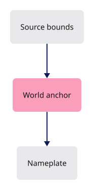
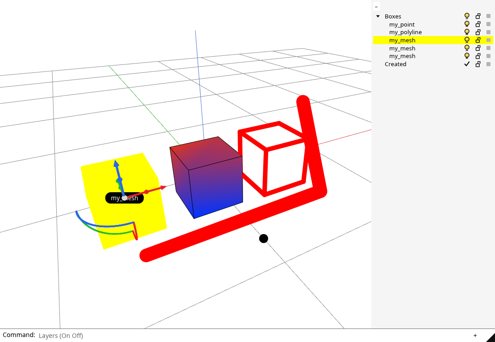

# 17 · Source faces, text objects and one silhouette

**Estimated study time: about 30–60 hours.** Includes reading, typing, tracing, testing and experiments. [How to use this estimate](map.md#time-estimates).

**This section:** Present selected source faces, labels and a consistent silhouette.

**In the whole viewer:** Presentation uses the same source identity as selection while combining several display pieces into one understandable object.

**Follow the data:** Selected source → mapped display rows and bounds → coverage and labels → highlighted object.

**Start with these files:** [`src/state/text.rs`](17-source-presentation.md#code-17-034), [`src/engine/gpu/surface_outline.rs`](17-source-presentation.md#code-17-018).

**Aim to explain:** How can one source object drawn in many pieces still receive one meaningful nameplate?

[Whole-viewer map and course milestones](map.md)

A useful nameplate must follow the original object, even when that object is drawn as many pieces. We find the selected source, obtain its bounds, and place the label relative to those bounds. The text renderer then handles shaping and drawing.



Start from the working result of [step 16](16-accounting.md).

**One buildable step:** type the additions below in `workspace/handwritten`, then build and test. This step adds 2,769 lines across 18 files and may take several sittings. Individual listings are parts of this step, not separate build checkpoints.

<span id="code-17-001"></span>

## `src/lib.rs`

Insert **after line 45** of your current file.

Keep these preceding lines:

```rust
/// Messages the async loader sends to the event loop.
pub enum Msg {
    Ready(Box<State>),                              // GPU is up, here is the state
    File(FileDoc, Option<String>), // one loaded file; a display-only one names its file
```

Keep these following lines:

```rust
    Clear,                         // empty the scene
    Fit,                           // frame the camera on everything
    StreamedCloud(Box<StreamedInit>), // a point cloud starts streaming; register:stream
    CloudChunk(CloudChunk),        // more points arrived; register:stream
```

Type these new lines:

```rust
--8<-- "typing/code/17-001.rs"
```

<span id="code-17-002"></span>

## `src/lib.rs`

Insert **after line 167** of your current file.

Keep these preceding lines:

```rust
            Msg::Clear => state.clear(),
            Msg::Fit => state.fit_loaded(),
            Msg::File(doc, source) => state.append(doc, source),
            Msg::Fonts(faces) => self.use_fonts(faces),   // register:loading
```

Keep these following lines:

```rust
            Msg::StreamedCloud(init) => start_stream(state, init), // register:stream
            Msg::CloudChunk(c) => state.extend_streamed(c.idx, c.rows, c.to), // register:stream
            Msg::CloudQueryBatch(batch) => state.cloud_query_batch(batch), // register:cloud_query
            Msg::CloudQueryResolved(resolved) => state.cloud_query_resolved(resolved), // register:cloud_query
```

Type these new lines:

```rust
--8<-- "typing/code/17-002.rs"
```

<span id="code-17-003"></span>

## `src/lib.rs`

Insert **after line 313** of your current file.

Keep these preceding lines:

```rust
            .map(|face| &*Box::leak(face.into_boxed_slice()))
            .collect();

        if let Ok(faces) = <[&'static [u8]; 3]>::try_from(faces) {
```

Keep these following lines:

```rust
        }
    }
}
```

Type these new lines:

```rust
--8<-- "typing/code/17-003.rs"
```

<span id="code-17-004"></span>

## `examples/mk_selection_overlap.rs`

Create this file. Type the complete listing, including comments and blank lines.

```rust
--8<-- "typing/code/17-004.rs"
```

<span id="code-17-005"></span>

## `examples/mk_stroke_joins.rs`

Create this file. Type the complete listing, including comments and blank lines.

```rust
--8<-- "typing/code/17-005.rs"
```

<span id="code-17-006"></span>

## `src/app/loader.rs`

Insert **after line 198** of your current file.

Keep these preceding lines:

```rust
    for doc in docs {
        post(Msg::File(doc, None));
    }
```

Keep these following lines:

```rust
    post(Msg::Fit);
    super::feedback::status("");
    true
}
```

Type these new lines:

```rust
--8<-- "typing/code/17-006.rs"
```

<span id="code-17-007"></span>

## `src/app/loader.rs`

Insert **after line 471** of your current file.

Keep these preceding lines:

```rust
            }
        }
    }
```

Keep these following lines:

```rust
    post(Msg::Fit);

    if !failed {
        super::feedback::status(&skipped_notice(&skipped, budget));
```

Type these new lines:

```rust
--8<-- "typing/code/17-007.rs"
```

<span id="code-17-008"></span>

## `src/app/scene.rs`

Insert **after line 4** of your current file.

Keep these preceding lines:

```rust
#[path = "scene_release.rs"] // register:release
mod release; // register:release
#[path = "scene_rows.rs"]
pub(crate) mod rows;
```

Keep these following lines:

```rust

use crate::app::walk::bounds::{Baselines, file_extent, mark_sheet, planar_band};
use crate::app::walk::mesh::Lap;
use crate::app::walk::{Walk, WalkCx, is_drawable, walk_geometry};
```

Type these new lines:

```rust
--8<-- "typing/code/17-008.rs"
```

<span id="code-17-009"></span>

## `src/app/scene.rs`

Insert **after line 53** of your current file.

Keep these preceding lines:

```rust

/// Names a row has before its geometry's own: a text's, a sheet entity's, an instance's, a released row's.
// `for<'a>`: each function takes any borrow of the scene and returns a name that lives as long as that borrow.
const NAMERS: &[for<'a> fn(&'a Scene, u32) -> Option<&'a str>] = &[
```

Keep these following lines:

```rust
    Scene::released_object_name, // register:release
];

/// The open documents and their object rows; a row id stays with its object for the object's life.
```

Type these new lines:

```rust
--8<-- "typing/code/17-009.rs"
```

<span id="code-17-010"></span>

## `src/app/scene.rs`

Insert **after line 60** of your current file.

Keep these preceding lines:

```rust

/// The open documents and their object rows; a row id stays with its object for the object's life.
pub struct Scene {
    pub docs: Vec<FileDoc>,                              // loaded files
```

Keep these following lines:

```rust
    pub tables: Upload,                                  // rows walked but not yet uploaded
    pub streamed: Vec<StreamedCloud>,                    // streamed clouds; register:stream
    pub hidden: HashSet<(usize, Rc<str>)>,               // (document, guid) hidden
    pub locked: HashSet<(usize, Rc<str>)>,               // (document, guid) not selectable
```

Type these new lines:

```rust
--8<-- "typing/code/17-010.rs"
```

<span id="code-17-011"></span>

## `src/app/scene.rs`

Insert **after line 127** of your current file.

Keep these preceding lines:

```rust
    /// Empty: no documents, no rows.
    pub fn new() -> Self {
        Self {
            docs: Vec::new(),
```

Keep these following lines:

```rust
            tables: Upload::default(),
            streamed: Vec::new(), // register:stream
            hidden: HashSet::new(),
            locked: HashSet::new(),
```

Type these new lines:

```rust
--8<-- "typing/code/17-011.rs"
```

<span id="code-17-012"></span>

## `src/app/scene.rs`

Insert **after line 188** of your current file.

Keep these preceding lines:

```rust
        self.released.clear(); // register:release
        self.asked.borrow_mut().clear(); // register:release
        self.docs.clear();
        self.doc_state.clear();
```

Keep these following lines:

```rust
        self.text_rows.clear();
        self.hidden.clear();
        self.locked.clear();
        self.colors.clear();
```

Type these new lines:

```rust
--8<-- "typing/code/17-012.rs"
```

<span id="code-17-013"></span>

## `src/app/scene_text.rs`

Create this file. Type the complete listing, including comments and blank lines.

```rust
--8<-- "typing/code/17-013.rs"
```

<span id="code-17-014"></span>

## `src/engine/gpu/faces.rs`

Append **after line 354** of your current file.

Blank lines before: **1**; after: **0**. End with a newline.

```rust
--8<-- "typing/code/17-014.rs"
```

<span id="code-17-015"></span>

## `src/engine/gpu/mod.rs`

Insert **after line 24** of your current file.

Keep these preceding lines:

```rust
pub mod present; // register:present
pub mod render; // register:render
pub mod segments; // register:segments
pub mod splat; // register:splat
```

Keep these following lines:

```rust
pub mod targets; // register:targets
pub mod text; // register:text
pub mod text_outline; // register:text_outline
mod triangle_tiles; // register:triangle_tiles
```

Type these new lines:

```rust
--8<-- "typing/code/17-015.rs"
```

<span id="code-17-016"></span>

## `src/engine/gpu/pass.rs`

Insert **after line 103** of your current file.

Keep these preceding lines:

```rust

// Empty in the first lessons: each pass a later lesson writes adds one line here.
/// The passes in frame order. Adding one means its `Pass` impl in one file and one line here.
pub const PASSES: &[fn(&GpuCtx, Target) -> Box<dyn Pass>] = &[
```

Keep these following lines:

```rust
];

// `pub(super)` = visible to the parent module, `gpu`, and no further.
/// Stands in the list for a pass while its own hook runs.
```

Type these new lines:

```rust
--8<-- "typing/code/17-016.rs"
```

<span id="code-17-017"></span>

## `src/engine/gpu/render.rs`

Insert **after line 101** of your current file.

Keep these preceding lines:

```rust
        let v = &self.view;
        let basic = self.frame.binds(&self.objects.group);
        let b = self.frame.binds(self.objects.ink_group());
        let mut draws = 0;
```

Keep these following lines:

```rust
        draws += self.arena.draw_print(pass, &basic);
        draws += self
            .segments
            .draw_unselected(pass, &b, v.show_mesh_edges, v.show_lines);
```

Type these new lines:

```rust
--8<-- "typing/code/17-017.rs"
```

<span id="code-17-018"></span>

## `src/engine/gpu/surface_outline.rs`

A surface silhouette depends on the current view. It is different from drawing every triangle edge. Coverage, depth and identity information help find meaningful boundaries without exposing the tessellation.

Create this file. Type the complete listing, including comments and blank lines.

```rust
--8<-- "typing/code/17-018.rs"
```

<span id="code-17-019"></span>

## `src/engine/gpu/surface_outline/tests.rs`

Create this file. Type the complete listing, including comments and blank lines.

```rust
--8<-- "typing/code/17-019.rs"
```

<span id="code-17-020"></span>

## `src/shaders/face_coverage.wgsl`

Create this file. Type the complete listing, including comments and blank lines.

```wgsl
--8<-- "typing/code/17-020.wgsl"
```

<span id="code-17-021"></span>

## `src/shaders/surface_outline.wgsl`

Create this file. Type the complete listing, including comments and blank lines.

```wgsl
--8<-- "typing/code/17-021.wgsl"
```

<span id="code-17-022"></span>

## `src/state.rs`

Insert **after line 13** of your current file.

Keep these preceding lines:

```rust
use crate::engine::performance::{heap_mb, now_ms};
// Each `mod` line below carries a `register` tag naming its feature; the course adds the line in that feature's lesson.
mod cloud_query; // register:cloud_query
mod features; // register:features
```

Keep these following lines:

```rust
use features::Features;
use std::sync::Arc;
use winit::window::Window;
```

Type these new lines:

```rust
--8<-- "typing/code/17-022.rs"
```

<span id="code-17-023"></span>

## `src/state.rs`

Insert **after line 109** of your current file.

Keep these preceding lines:

```rust
        let t1 = now_ms();
        // only the new rows go to the GPU
        self.scene.upload_to(&mut self.gpu);
        self.camera.grow_extent(&self.gpu.bounds);
```

Keep these following lines:

```rust
        self.release_display_only(index, first_row, source); // register:release

        // the layer panel lists the new rows
        log::info!(
```

Type these new lines:

```rust
--8<-- "typing/code/17-023.rs"
```

<span id="code-17-024"></span>

## `src/state.rs`

Insert **after line 113** of your current file.

Keep these preceding lines:

```rust
        self.annotate_document(first_row); // register:scene_text
        self.release_display_only(index, first_row, source); // register:release

        // the layer panel lists the new rows
```

Keep these following lines:

```rust
        log::info!(
            "appended: walk {:.0} ms, upload {:.0} ms | {} docs | memory observation {:.0} MiB",
            t1 - t0,
            now_ms() - t1,
```

Type these new lines:

```rust
--8<-- "typing/code/17-024.rs"
```

<span id="code-17-025"></span>

## `src/state.rs`

Insert **after line 150** of your current file.

Keep these preceding lines:

```rust
        }

        self.scene.bounds_stale = false;
        self.gpu.bounds = self.gpu.objects.live_world_bounds();
```

Keep these following lines:

```rust
    }

    /// Fit the camera to everything loaded.
    pub fn fit_all(&mut self) {
```

Type these new lines:

```rust
--8<-- "typing/code/17-025.rs"
```

<span id="code-17-026"></span>

## `src/state.rs`

Insert **after line 273** of your current file.

Keep these preceding lines:

```rust
        }

        self.scene.selected = row;
        self.selection_order = row.into_iter().collect();
```

Keep these following lines:

```rust
        self.touch();
    }

    /// Every selected row.
```

Type these new lines:

```rust
--8<-- "typing/code/17-026.rs"
```

<span id="code-17-027"></span>

## `src/state.rs`

Insert **after line 319** of your current file.

Keep these preceding lines:

```rust
        }
        if selected.len() > 1 {
            self.highlighted = selected;
        }
```

Keep these following lines:

```rust
        self.touch();
    }

    /// Select what a viewport click on `row` reaches: its whole group, when it is in one.
```

Type these new lines:

```rust
--8<-- "typing/code/17-027.rs"
```

<span id="code-17-028"></span>

## `src/state.rs`

Insert **after line 336** of your current file.

Keep these preceding lines:

```rust

    /// T: show or hide the name label on the selection.
    pub fn toggle_selected_names(&mut self) {
        self.show_selected_names = !self.show_selected_names;
```

Keep these following lines:

```rust
        self.touch();
    }

    /// H: hide the selection.
```

Type these new lines:

```rust
--8<-- "typing/code/17-028.rs"
```

<span id="code-17-029"></span>

## `src/state.rs`

Insert **after line 362** of your current file.

Keep these preceding lines:

```rust
        };
        self.select(None);
        self.scene.hidden.insert(guid); // by id, so a new row of it stays hidden
        self.gpu.set_hidden(row, true);
```

Keep these following lines:

```rust
        self.touch();
    }

    /// S: show everything hidden.
```

Type these new lines:

```rust
--8<-- "typing/code/17-029.rs"
```

<span id="code-17-030"></span>

## `src/state.rs`

Insert **after line 373** of your current file.

Keep these preceding lines:

```rust
            self.gpu.set_hidden(row, false);
        }

        self.scene.hidden.clear();
```

Keep these following lines:

```rust
        self.touch();
    }

    /// A pick answer arrived: select what it hit.
```

Type these new lines:

```rust
--8<-- "typing/code/17-030.rs"
```

<span id="code-17-031"></span>

## `src/state.rs`

Insert **after line 404** of your current file.

Keep these preceding lines:

```rust
                    self.status(&format!("Edge {edge} selected"));
                    return;
                }
```

Keep these following lines:

```rust
                return;
            }
            PickMode::Controls { parent, cloud } => {
                if let Some(pick) = pick
```

Type these new lines:

```rust
--8<-- "typing/code/17-031.rs"
```

<span id="code-17-032"></span>

## `src/state.rs`

Insert **after line 780** of your current file.

Keep these preceding lines:

```rust
            .splat
            .set_controls(controls.cloud.then_some(parent));
        self.controls = controls;
        self.upload_controls(); // register:controls
```

Keep these following lines:

```rust
        self.status("Control points: click to select; Esc to leave");
        self.touch();
    }
```

Type these new lines:

```rust
--8<-- "typing/code/17-032.rs"
```

<span id="code-17-033"></span>

## `src/state.rs`

Append **after line 924** of your current file.

Blank lines before: **1**; after: **0**. End with a newline.

```rust
--8<-- "typing/code/17-033.rs"
```

<span id="code-17-034"></span>

## `src/state/text.rs`

Create this file. Type the complete listing, including comments and blank lines.

```rust
--8<-- "typing/code/17-034.rs"
```

<span id="code-17-035"></span>

## `tests/selection-overlap.py`

Create this file. Type the complete listing, including comments and blank lines.

```python
--8<-- "typing/code/17-035.py"
```

<span id="code-17-036"></span>

## `tests/stroke-joins.py`

Create this file. Type the complete listing, including comments and blank lines.

```python
--8<-- "typing/code/17-036.py"
```

## Check the completed chapter

From `session_viewer`, compare everything you have typed:

```sh
npm --prefix ../session_tests run course -- reference-check 17
```

From `workspace/handwritten`:

```sh
cargo build --lib --locked -j4
cargo xtest --lib --locked -j4
```

Run the native nameplate tests. Select and deselect an object in the browser and verify that the label follows the selection.

If a label follows only one triangle, check whether its bounds came from the source object or a tessellated face.



**Before moving on:** explain what changed, check the expected result above, and fix any build or test failure.

<details>
<summary>Check your explanation of the opening question</summary>

Resolve the selected source identity and its bounds first. Place the label for that source object rather than independently labelling each display piece.

</details>

[Next step: 18](18-finite-visibility.md)
