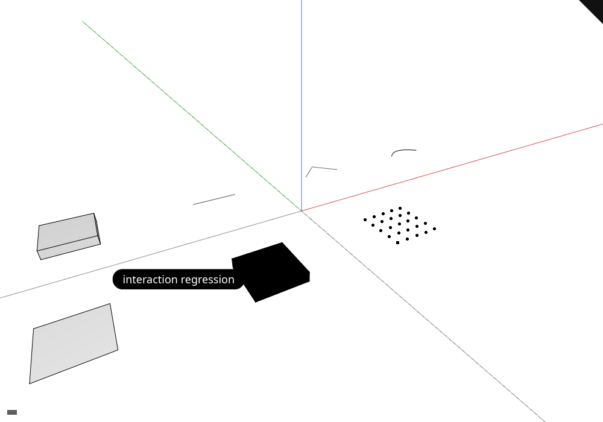

# 18 · Finite-triangle visibility and maintained viewer convergence

Concave boundaries and contact seams stay continuous while genuinely covered edges remain hidden.


Copy each file from the lesson folder to the path shown.

Copy from `lessons/18/` (tooling this checkpoint needs but the course does not teach):

- `lessons/18/examples/mk_triangle_visibility.rs`
- `lessons/18/tests/README.md`
- `lessons/18/tests/depth/_gate.sh`
- `lessons/18/tests/depth/_ink_suite.sh`
- `lessons/18/tests/depth/_orbit_check.py`
- `lessons/18/tests/depth/_probe_matrix.py`
- `lessons/18/tests/depth/_stroke_weight.py`
- `lessons/18/tests/interaction.cjs`
- `lessons/18/tests/nameplate-scene.cjs`
- `lessons/18/tests/selection-overlap.py`
- `lessons/18/tests/streamed-controls.cjs`
- `lessons/18/tests/stroke-joins.py`
- `lessons/18/tests/teapot.cjs`
- `lessons/18/tests/text-quality.cjs`
- `lessons/18/tests/triangle-visibility.py`
- `lessons/18/tests/world-text.cjs`

## Step 1 · src/shaders/physical.wgsl
Physical outputs store depth information beside face color.

`lessons/18/src/shaders/physical.wgsl` · edit · type this

Replaces the 20 lines from `@location(1) gradient: vec2<f32>,` in `struct PhysicalColor` of `lessons/17/src/shaders/physical.wgsl`

```wgsl
--8<-- "lessons/18/src/shaders/physical.wgsl:step-1"
```

## Step 2 · src/shaders/triangle.wgsl
The mesh shader places vertices and shades visible faces.

`lessons/18/src/shaders/triangle.wgsl` · edit · type this

Added after the `@location(7) @interpolate(flat) source_face:…` line in `struct VsOut` of `lessons/17/src/shaders/triangle.wgsl`

```wgsl
--8<-- "lessons/18/src/shaders/triangle.wgsl:step-2a"
```

Added after the `o.source_face = 0xffffffffu;` line in `fn transform_vertex` of `lessons/17/src/shaders/triangle.wgsl`

```wgsl
--8<-- "lessons/18/src/shaders/triangle.wgsl:step-2b"
```

Replaces the 9 lines from `@vertex` of `lessons/17/src/shaders/triangle.wgsl`

```wgsl
--8<-- "lessons/18/src/shaders/triangle.wgsl:step-2c"
```

Replaces the 14 lines from `return vec4<f32>(base * shaded, 1.0);` in `fn shade` of `lessons/17/src/shaders/triangle.wgsl`

```wgsl
--8<-- "lessons/18/src/shaders/triangle.wgsl:step-2d"
```

Replaces the 7 lines from `return PhysicalColor(shade(in, front), physic…` in `fn fs_main` of `lessons/17/src/shaders/triangle.wgsl`

```wgsl
--8<-- "lessons/18/src/shaders/triangle.wgsl:step-2e"
```

Replaces the 3 lines from `return vec4<f32>(1.0);` in `fn fs_solid_mask` of `lessons/17/src/shaders/triangle.wgsl`

```wgsl
--8<-- "lessons/18/src/shaders/triangle.wgsl:step-2f"
```

## Step 3 · src/shaders/background.wgsl
The background fills uncovered pixels.

`lessons/18/src/shaders/background.wgsl` · edit · type this

Replaces the `return PhysicalColor(vec4<f32>(1.0, 1.0, 1.0,…` line in `fn fs_main` of `lessons/17/src/shaders/background.wgsl`

```wgsl
--8<-- "lessons/18/src/shaders/background.wgsl:step-3"
```

## Step 4 · src/shaders/grid.wgsl

The grid generates construction lines from vertex indices.

`lessons/18/src/shaders/grid.wgsl` · edit · type this

Replaces the `return PhysicalColor(vec4<f32>(in.color, 1.0)…` line in `fn fs_main` of `lessons/17/src/shaders/grid.wgsl`

```wgsl
--8<-- "lessons/18/src/shaders/grid.wgsl:step-4"
```

## Step 5 · src/shaders/splat.wgsl

Point projection writes the nearest visible cloud samples.

`lessons/18/src/shaders/splat.wgsl` · edit · type this

Replaces the `return PhysicalId(vec2<u32>(in.instance + 1u,…` line in `fn fs_point_id` of `lessons/17/src/shaders/splat.wgsl`

```wgsl
--8<-- "lessons/18/src/shaders/splat.wgsl:step-5"
```

## Step 6 · src/shaders/splat_resolve.wgsl

The resolve writes point color and depth into the scene.

`lessons/18/src/shaders/splat_resolve.wgsl` · edit · type this

Replaces the `@location(1) gradient: vec2<f32>,` line in `struct FsOut` of `lessons/17/src/shaders/splat_resolve.wgsl`

```wgsl
--8<-- "lessons/18/src/shaders/splat_resolve.wgsl:step-6a"
```

Replaces the `o.gradient = vec2<f32>(0.0);` line in `fn shade` of `lessons/17/src/shaders/splat_resolve.wgsl`

```wgsl
--8<-- "lessons/18/src/shaders/splat_resolve.wgsl:step-6b"
```

## Step 7 · src/shaders/text_outline.wgsl

And for the resolve, the pass that writes the scene's depth for a cloud.

`lessons/18/src/shaders/text_outline.wgsl` · edit · type this

Replaces the `return PhysicalId(vec2<u32>(fragment.object+1…` line in `fn fs_physical_id` of `lessons/17/src/shaders/text_outline.wgsl`

```wgsl
--8<-- "lessons/18/src/shaders/text_outline.wgsl:step-7"
```

## Step 8 · src/shaders/projected_triangle.wgsl

Projected triangle helpers test both edge coverage and interpolated depth.

`lessons/18/src/shaders/projected_triangle.wgsl` · 50 lines · type this, new file

```wgsl
--8<-- "lessons/18/src/shaders/projected_triangle.wgsl"
```

## Step 9 · src/shaders/project_triangles.wgsl

The projection pass clips triangles and records their screen bounds.

`lessons/18/src/shaders/project_triangles.wgsl` · type this, new file, start with these lines

```wgsl
--8<-- "lessons/18/src/shaders/project_triangles.wgsl:step-9a"
```

`lessons/18/src/shaders/project_triangles.wgsl` · type this, append at the end of the file

```wgsl
--8<-- "lessons/18/src/shaders/project_triangles.wgsl:step-9b"
```

## Step 10 · src/shaders/triangle_tiles.wgsl

Tile passes count and store projected triangle references.

`lessons/18/src/shaders/triangle_tiles.wgsl` · 113 lines · type this, new file

```wgsl
--8<-- "lessons/18/src/shaders/triangle_tiles.wgsl"
```

## Step 11 · src/shaders/scan_triangle_tiles.wgsl

A prefix scan assigns each tile its reference range.

`lessons/18/src/shaders/scan_triangle_tiles.wgsl` · 120 lines · type this, new file

```wgsl
--8<-- "lessons/18/src/shaders/scan_triangle_tiles.wgsl"
```

## Step 12 · src/engine/gpu/triangle_tiles.rs

Triangle tiles limit visibility queries to finite projected geometry.

`lessons/18/src/engine/gpu/triangle_tiles.rs` · type this, new file, start with these lines

```rust
--8<-- "lessons/18/src/engine/gpu/triangle_tiles.rs:step-12a"
```

`lessons/18/src/engine/gpu/triangle_tiles.rs` · type this, append at the end of the file

```rust
--8<-- "lessons/18/src/engine/gpu/triangle_tiles.rs:step-12b"
```

`lessons/18/src/engine/gpu/triangle_tiles.rs` · type this, append at the end of the file

```rust
--8<-- "lessons/18/src/engine/gpu/triangle_tiles.rs:step-12c"
```

`lessons/18/src/engine/gpu/triangle_tiles.rs` · type this, append at the end of the file

```rust
--8<-- "lessons/18/src/engine/gpu/triangle_tiles.rs:step-12d"
```

`lessons/18/src/engine/gpu/triangle_tiles.rs` · type this, append at the end of the file

```rust
--8<-- "lessons/18/src/engine/gpu/triangle_tiles.rs:step-12e"
```

`lessons/18/src/engine/gpu/triangle_tiles.rs` · type this, append at the end of the file

```rust
--8<-- "lessons/18/src/engine/gpu/triangle_tiles.rs:step-12f"
```

`lessons/18/src/engine/gpu/triangle_tiles.rs` · type this, append at the end of the file

```rust
--8<-- "lessons/18/src/engine/gpu/triangle_tiles.rs:step-12g"
```

`lessons/18/src/engine/gpu/triangle_tiles.rs` · type this, append at the end of the file

```rust
--8<-- "lessons/18/src/engine/gpu/triangle_tiles.rs:step-12h"
```

`lessons/18/src/engine/gpu/triangle_tiles.rs` · type this, append at the end of the file

```rust
--8<-- "lessons/18/src/engine/gpu/triangle_tiles.rs:step-12i"
```

`lessons/18/src/engine/gpu/triangle_tiles.rs` · type this, append at the end of the file

```rust
--8<-- "lessons/18/src/engine/gpu/triangle_tiles.rs:step-12j"
```

`lessons/18/src/engine/gpu/triangle_tiles.rs` · type this, append at the end of the file

```rust
--8<-- "lessons/18/src/engine/gpu/triangle_tiles.rs:step-12k"
```

`lessons/18/src/engine/gpu/triangle_tiles.rs` · type this, append at the end of the file

```rust
--8<-- "lessons/18/src/engine/gpu/triangle_tiles.rs:step-12l"
```

Copy this part from the lesson folder to the path shown.

`lessons/18/src/engine/gpu/triangle_tiles.rs` · copy the file, append at the end of the file

```rust
--8<-- "lessons/18/src/engine/gpu/triangle_tiles.rs:step-12m"
```

Run `cargo check` in `lessons/18/`.

## Step 13 · src/shaders/ink_visibility.wgsl

The ink test decides which stroke samples are covered by faces.

`lessons/18/src/shaders/ink_visibility.wgsl` · edit · type this

Added after the `};` line of `lessons/17/src/shaders/ink_visibility.wgsl`

```wgsl
--8<-- "lessons/18/src/shaders/ink_visibility.wgsl:step-13a"
```

Added after the `};` line of `lessons/17/src/shaders/ink_visibility.wgsl`

```wgsl
--8<-- "lessons/18/src/shaders/ink_visibility.wgsl:step-13b"
```

Added after the `}` line of `lessons/17/src/shaders/ink_visibility.wgsl`

```wgsl
--8<-- "lessons/18/src/shaders/ink_visibility.wgsl:step-13c"
```

Added after the `}` line of `lessons/17/src/shaders/ink_visibility.wgsl`

```wgsl
--8<-- "lessons/18/src/shaders/ink_visibility.wgsl:step-13d"
```

Added after the `}` line of `lessons/17/src/shaders/ink_visibility.wgsl`

```wgsl
--8<-- "lessons/18/src/shaders/ink_visibility.wgsl:step-13e"
```

Added after the `}` line of `lessons/17/src/shaders/ink_visibility.wgsl`

```wgsl
--8<-- "lessons/18/src/shaders/ink_visibility.wgsl:step-13f"
```

Added after the `}` line of `lessons/17/src/shaders/ink_visibility.wgsl`

```wgsl
--8<-- "lessons/18/src/shaders/ink_visibility.wgsl:step-13g"
```

Added after the `}` line of `lessons/17/src/shaders/ink_visibility.wgsl`

```wgsl
--8<-- "lessons/18/src/shaders/ink_visibility.wgsl:step-13h"
```

Added after the `}` line of `lessons/17/src/shaders/ink_visibility.wgsl`

```wgsl
--8<-- "lessons/18/src/shaders/ink_visibility.wgsl:step-13i"
```

Added after the `}` line of `lessons/17/src/shaders/ink_visibility.wgsl`

```wgsl
--8<-- "lessons/18/src/shaders/ink_visibility.wgsl:step-13j"
```

Added after the `}` line of `lessons/17/src/shaders/ink_visibility.wgsl`

```wgsl
--8<-- "lessons/18/src/shaders/ink_visibility.wgsl:step-13k"
```

`lessons/18/src/shaders/ink_visibility.wgsl` · edit · type this

Replaces `fn ink_visible` in `lessons/17/src/shaders/ink_visibility.wgsl`

```wgsl
--8<-- "lessons/18/src/shaders/ink_visibility.wgsl:step-13l"
```

Added after the `}` line of `lessons/17/src/shaders/ink_visibility.wgsl`

```wgsl
--8<-- "lessons/18/src/shaders/ink_visibility.wgsl:step-13m"
```

## Step 14 · src/engine/gpu/faces.rs

Face buffers preserve source face addresses alongside triangles.

`lessons/18/src/engine/gpu/faces.rs` · edit · type this

Replaces the `use crate::engine::pipelines::{DepthMode, Lay…` line of `lessons/17/src/engine/gpu/faces.rs`

```rust
--8<-- "lessons/18/src/engine/gpu/faces.rs:step-14a"
```

Replaces the 5 lines from `layout: wgpu::BindGroupLayout,` in `struct Faces` of `lessons/17/src/engine/gpu/faces.rs`

```rust
--8<-- "lessons/18/src/engine/gpu/faces.rs:step-14b"
```

Replaces the 11 lines from `let (pick, highlight, mask) = pipelines(ctx,…` in `fn new` of `lessons/17/src/engine/gpu/faces.rs`

```rust
--8<-- "lessons/18/src/engine/gpu/faces.rs:step-14c"
```

Replaces the 2 lines from `(self.pick, self.highlight, self.mask) =` in `fn retarget` of `lessons/17/src/engine/gpu/faces.rs`

```rust
--8<-- "lessons/18/src/engine/gpu/faces.rs:step-14d"
```

Added after the `self.active = face;` line in `fn select` of `lessons/17/src/engine/gpu/faces.rs`

```rust
--8<-- "lessons/18/src/engine/gpu/faces.rs:step-14e"
```

Replaces `fn draw_ids` in `lessons/17/src/engine/gpu/faces.rs`

```rust
--8<-- "lessons/18/src/engine/gpu/faces.rs:step-14f"
```

Replaces the `self.draw(pass, binds, &self.highlight)` line in `fn draw_highlight` of `lessons/17/src/engine/gpu/faces.rs`

```rust
--8<-- "lessons/18/src/engine/gpu/faces.rs:step-14g"
```

Replaces the `self.draw(pass, binds, &self.mask)` line in `fn draw_mask` of `lessons/17/src/engine/gpu/faces.rs`

```rust
--8<-- "lessons/18/src/engine/gpu/faces.rs:step-14h"
```

Replaces the 5 lines from `) -> (` of `lessons/17/src/engine/gpu/faces.rs`

```rust
--8<-- "lessons/18/src/engine/gpu/faces.rs:step-14i"
```

Replaces the `(pick, highlight, mask)` line in `fn pipelines` of `lessons/17/src/engine/gpu/faces.rs`

```rust
--8<-- "lessons/18/src/engine/gpu/faces.rs:step-14j"
```

## Step 15 · src/engine/gpu/arena.rs

The arena holds mesh vertices and indices across objects.

`lessons/18/src/engine/gpu/arena.rs` · edit · type this

Replaces the 4 lines from `}` of `lessons/17/src/engine/gpu/arena.rs`

```rust
--8<-- "lessons/18/src/engine/gpu/arena.rs:step-15a"
```

Added after the `impl ArenaLane {` line of `lessons/17/src/engine/gpu/arena.rs`

```rust
--8<-- "lessons/18/src/engine/gpu/arena.rs:step-15b"
```

Added after the `+ self.source_faces.allocated_bytes()` line in `fn allocated_bytes` of `lessons/17/src/engine/gpu/arena.rs`

```rust
--8<-- "lessons/18/src/engine/gpu/arena.rs:step-15c"
```

Added after the `source_faces,` line in `fn new` of `lessons/17/src/engine/gpu/arena.rs`

```rust
--8<-- "lessons/18/src/engine/gpu/arena.rs:step-15d"
```

Added after the `pub fn append(&mut self, ctx: &GpuCtx, up: &A…` line in `impl ArenaLane` of `lessons/17/src/engine/gpu/arena.rs`

```rust
--8<-- "lessons/18/src/engine/gpu/arena.rs:step-15e"
```

Replaces the `self.draw_run(pass, b, &self.pipes.faces, &se…` line in `fn draw_faces` of `lessons/17/src/engine/gpu/arena.rs`

```rust
--8<-- "lessons/18/src/engine/gpu/arena.rs:step-15f"
```

Replaces the `self.draw_run(pass, b, &self.pipes.id_faces,…` line in `fn draw_face_ids` of `lessons/17/src/engine/gpu/arena.rs`

```rust
--8<-- "lessons/18/src/engine/gpu/arena.rs:step-15g"
```

Added after the `self.draw_run(pass, b, &self.pipes.solid_mask…` line in `fn draw_solid_mask` of `lessons/17/src/engine/gpu/arena.rs`

```rust
--8<-- "lessons/18/src/engine/gpu/arena.rs:step-15h"
```

Added after the `pub fn reset(&mut self, ctx: &GpuCtx) {` line in `impl ArenaLane` of `lessons/17/src/engine/gpu/arena.rs`

```rust
--8<-- "lessons/18/src/engine/gpu/arena.rs:step-15i"
```

Added after the `pub fn release(&mut self, ctx: &GpuCtx) {` line in `impl ArenaLane` of `lessons/17/src/engine/gpu/arena.rs`

```rust
--8<-- "lessons/18/src/engine/gpu/arena.rs:step-15j"
```

Added after the `),` line in `fn build_pipelines` of `lessons/17/src/engine/gpu/arena.rs`

Added after the `),` line in `fn build_pipelines` of `lessons/17/src/engine/gpu/arena.rs`

```rust
--8<-- "lessons/18/src/engine/gpu/arena.rs:step-15l"
```

## Step 16 · src/engine/pipelines/layouts.rs

Bind-group layouts describe the resources shared by the drawing modules.

`lessons/18/src/engine/pipelines/layouts.rs` · edit · type this

Replaces the `entries: &[storage_entry(0), storage_entry(1)],` line in `fn instance_layout` of `lessons/17/src/engine/pipelines/layouts.rs`

```rust
--8<-- "lessons/18/src/engine/pipelines/layouts.rs:step-16a"
```

Added after the `scene_gradient(5, true),` line in `fn ink_instance_layout` of `lessons/17/src/engine/pipelines/layouts.rs`

```rust
--8<-- "lessons/18/src/engine/pipelines/layouts.rs:step-16b"
```

Replaces the 2 lines from `mvp: uniform_layout(device, "mvp.layout", wgp…` in `fn new` of `lessons/17/src/engine/pipelines/layouts.rs`

```rust
--8<-- "lessons/18/src/engine/pipelines/layouts.rs:step-16c"
```

## Step 17 · src/engine/pipelines/mod.rs

Pipeline descriptions keep color, depth and sample-count choices together.

`lessons/18/src/engine/pipelines/mod.rs` · edit · type this

Added after the `pub physical: bool,` line in `struct PipelineDesc` of `lessons/17/src/engine/pipelines/mod.rs`

```rust
--8<-- "lessons/18/src/engine/pipelines/mod.rs:step-17a"
```

Added after the `physical: false,` line in `fn new` of `lessons/17/src/engine/pipelines/mod.rs`

```rust
--8<-- "lessons/18/src/engine/pipelines/mod.rs:step-17b"
```

Added after the `self.physical = true;` line in `fn physical` of `lessons/17/src/engine/pipelines/mod.rs`

```rust
--8<-- "lessons/18/src/engine/pipelines/mod.rs:step-17c"
```

Replaces `fn module` in `lessons/17/src/engine/pipelines/mod.rs`

```rust
--8<-- "lessons/18/src/engine/pipelines/mod.rs:step-17d"
```

Replaces the 4 lines from `if desc.physical {` in `fn build` of `lessons/17/src/engine/pipelines/mod.rs`

```rust
--8<-- "lessons/18/src/engine/pipelines/mod.rs:step-17e"
```

## Step 18 · src/engine/gpu/objects.rs

The object table stores GPU rows separately from source identity.

`lessons/18/src/engine/gpu/objects.rs` · edit · type this

Replaces `struct InstanceTable` in `lessons/17/src/engine/gpu/objects.rs`

```rust
--8<-- "lessons/18/src/engine/gpu/objects.rs:step-18a"
```

Replaces the 44 lines from `pub targets: &'a Targets,` in `struct InkScene` of `lessons/17/src/engine/gpu/objects.rs`

```rust
--8<-- "lessons/18/src/engine/gpu/objects.rs:step-18b"
```

Replaces the 3 lines from `let ink_group = ink_instance_group(ctx, l, [&…` in `fn new` of `lessons/17/src/engine/gpu/objects.rs`

```rust
--8<-- "lessons/18/src/engine/gpu/objects.rs:step-18c"
```

Replaces the 2 lines from `self.ink_group =` in `fn rebind_ink` of `lessons/17/src/engine/gpu/objects.rs`

```rust
--8<-- "lessons/18/src/engine/gpu/objects.rs:step-18d"
```

Replaces the 35 lines from `) -> wgpu::BindGroup {` in `impl InstanceTable` of `lessons/17/src/engine/gpu/objects.rs`

```rust
--8<-- "lessons/18/src/engine/gpu/objects.rs:step-18e"
```

Replaces the 14 lines from `self.last_origin = Some(origin.clone());` in `fn rebuild` of `lessons/17/src/engine/gpu/objects.rs`

```rust
--8<-- "lessons/18/src/engine/gpu/objects.rs:step-18f"
```

Replaces the 3 lines from `model[12] = (t[0] - o[0]) as f32;` in `fn anchored_model` of `lessons/17/src/engine/gpu/objects.rs`

```rust
--8<-- "lessons/18/src/engine/gpu/objects.rs:step-18g"
```

Replaces the 5 lines from `self.buffer.write_at(ctx, row, std::slice::fr…` in `fn set_flag` of `lessons/17/src/engine/gpu/objects.rs`

```rust
--8<-- "lessons/18/src/engine/gpu/objects.rs:step-18h"
```

Replaces the 12 lines from `let mut r = ObjectRow::new(Xform::translation…` in `fn world_box_translates` of `lessons/17/src/engine/gpu/objects.rs`

```rust
--8<-- "lessons/18/src/engine/gpu/objects.rs:step-18i"
```

## Step 19 · src/engine/gpu/targets.rs

Targets own the depth and color attachments for a frame.

`lessons/18/src/engine/gpu/targets.rs` · edit · type this

Replaces the 61 lines from `let depth = texture_view(` in `fn new` of `lessons/17/src/engine/gpu/targets.rs`

```rust
--8<-- "lessons/18/src/engine/gpu/targets.rs:step-19"
```

## Step 20 · src/engine/gpu/pick.rs

Picking reads an object and subobject ID asynchronously.

`lessons/18/src/engine/gpu/pick.rs` · edit · type this

Replaces the `(buffer, pixels * 16)` line in `fn allocated_bytes` of `lessons/17/src/engine/gpu/pick.rs`

```rust
--8<-- "lessons/18/src/engine/gpu/pick.rs:step-20a"
```

Replaces the `format: wgpu::TextureFormat::Rg16Float,` line in `fn begin_pass` of `lessons/17/src/engine/gpu/pick.rs`

```rust
--8<-- "lessons/18/src/engine/gpu/pick.rs:step-20b"
```

## Step 21 · src/engine/gpu/instance.rs

Each object row carries placement, color and selection flags for later interaction.

`lessons/18/src/engine/gpu/instance.rs` · edit · type this

Replaces the 18 lines from `let source = if source.contains("-> InkColor") {` in `fn shader_validation_and_layouts` of `lessons/17/src/engine/gpu/instance.rs`

```rust
--8<-- "lessons/18/src/engine/gpu/instance.rs:step-21a"
```

Added after the `size_of::<StrokeSegment>(),` line in `fn shader_validation_and_layouts` of `lessons/17/src/engine/gpu/instance.rs`

```rust
--8<-- "lessons/18/src/engine/gpu/instance.rs:step-21b"
```

## Step 22 · src/engine/gpu/present.rs

Presentation acquires the frame and submits rendering work.

`lessons/18/src/engine/gpu/present.rs` · edit · type this

Added after the `self.pick.map();` line in `fn present` of `lessons/17/src/engine/gpu/present.rs`

```rust
--8<-- "lessons/18/src/engine/gpu/present.rs:step-22a"
```

Added after the `self.pick.map();` line in `fn pick_frame` of `lessons/17/src/engine/gpu/present.rs`

```rust
--8<-- "lessons/18/src/engine/gpu/present.rs:step-22b"
```

Added after the `self.pick.map();` line in `fn render_offscreen` of `lessons/17/src/engine/gpu/present.rs`

```rust
--8<-- "lessons/18/src/engine/gpu/present.rs:step-22c"
```

## Step 23 · src/engine/gpu/surface_outline.rs

Surface masks add outlines around visible coverage.

`lessons/18/src/engine/gpu/surface_outline.rs` · edit · type this

Added after the `const POOL: u32 = 16;` line of `lessons/17/src/engine/gpu/surface_outline.rs`

```rust
--8<-- "lessons/18/src/engine/gpu/surface_outline.rs:step-23a"
```

Added after the `mask: Option<Mask>,` line in `struct SurfaceOutline` of `lessons/17/src/engine/gpu/surface_outline.rs`

```rust
--8<-- "lessons/18/src/engine/gpu/surface_outline.rs:step-23b"
```

Replaces the `}` line in `fn new` of `lessons/17/src/engine/gpu/surface_outline.rs`

```rust
--8<-- "lessons/18/src/engine/gpu/surface_outline.rs:step-23c"
```

Added after the `self.mask = None;` line in `fn prepare` of `lessons/17/src/engine/gpu/surface_outline.rs`

```rust
--8<-- "lessons/18/src/engine/gpu/surface_outline.rs:step-23d"
```

Replaces the 7 lines from `}` in `fn prepare` of `lessons/17/src/engine/gpu/surface_outline.rs`

```rust
--8<-- "lessons/18/src/engine/gpu/surface_outline.rs:step-23e"
```

Added after the `let mut gpu = pollster::block_on(Gpu::new_hea…` line in `fn selected_cad_edges_do_not_paint_over_the_black_silhouette` of `lessons/17/src/engine/gpu/surface_outline.rs`

```rust
--8<-- "lessons/18/src/engine/gpu/surface_outline.rs:step-23f"
```

Added after the `let mut gpu = pollster::block_on(Gpu::new_hea…` line in `fn touching_and_overlapping_solids_have_one_continuous_outline` of `lessons/17/src/engine/gpu/surface_outline.rs`

```rust
--8<-- "lessons/18/src/engine/gpu/surface_outline.rs:step-23g"
```

Replaces this block of `lessons/17/src/engine/gpu/surface_outline.rs`:

```rust
        let mut gpu = pollster::block_on(Gpu::new_headless(200, 200)).unwrap();
        gpu.view.show_grid = false;
```

```rust
--8<-- "lessons/18/src/engine/gpu/surface_outline.rs:step-23h"
```

## Step 24 · src/engine/gpu/segments.rs

The segment buffers store strokes and the object rows they belong to.

`lessons/18/src/engine/gpu/segments.rs` · edit · type this

Added after the `id_edge: wgpu::RenderPipeline,` line in `struct SegPipelines` of `lessons/17/src/engine/gpu/segments.rs`

```rust
--8<-- "lessons/18/src/engine/gpu/segments.rs:step-24a"
```

Added after the `}` line in `impl SegmentLane` of `lessons/17/src/engine/gpu/segments.rs`

```rust
--8<-- "lessons/18/src/engine/gpu/segments.rs:step-24b"
```

Added after the `.depth(DepthMode::Always);` line in `fn build_pipelines` of `lessons/17/src/engine/gpu/segments.rs`

```rust
--8<-- "lessons/18/src/engine/gpu/segments.rs:step-24c"
```

Added after the `&quad.with("edge.id", "fs_edge_id").scene_sam…` line in `fn build_pipelines` of `lessons/17/src/engine/gpu/segments.rs`

```rust
--8<-- "lessons/18/src/engine/gpu/segments.rs:step-24d"
```

## Step 25 · src/engine/gpu/render.rs

The frame encoder orders face, ink, picking and overlay passes.

`lessons/18/src/engine/gpu/render.rs` · edit · type this

Replaces the 2 lines from `` of `lessons/17/src/engine/gpu/render.rs`

```rust
--8<-- "lessons/18/src/engine/gpu/render.rs:step-25a"
```

Replaces the 50 lines from `self.point_pass(encoder);` in `fn encode_frame` of `lessons/17/src/engine/gpu/render.rs`

```rust
--8<-- "lessons/18/src/engine/gpu/render.rs:step-25b"
```

Added after the `pub(super) fn id_pass(&mut self, encoder: &mu…` line in `impl Gpu` of `lessons/17/src/engine/gpu/render.rs`

```rust
--8<-- "lessons/18/src/engine/gpu/render.rs:step-25c"
```

Replaces the 6 lines from `);` in `fn scene_list` of `lessons/17/src/engine/gpu/render.rs`

```rust
--8<-- "lessons/18/src/engine/gpu/render.rs:step-25d"
```

## Step 26 · src/engine/gpu/mod.rs

The GPU owner connects buffers, pipelines and frame resources.

`lessons/18/src/engine/gpu/mod.rs` · edit · type this

Added after the `pub mod text_outline;` line of `lessons/17/src/engine/gpu/mod.rs`

```rust
--8<-- "lessons/18/src/engine/gpu/mod.rs:step-26a"
```

Added after the `pub solid_outline: surface_outline::SurfaceOu…` line in `struct Gpu` of `lessons/17/src/engine/gpu/mod.rs`

```rust
--8<-- "lessons/18/src/engine/gpu/mod.rs:step-26b"
```

Replaces the 5 lines from `let frame_textures =` in `fn allocated_bytes` of `lessons/17/src/engine/gpu/mod.rs`

```rust
--8<-- "lessons/18/src/engine/gpu/mod.rs:step-26c"
```

Replaces the `let objects = InstanceTable::new(&ctx, &layou…` line in `fn build` of `lessons/17/src/engine/gpu/mod.rs`

```rust
--8<-- "lessons/18/src/engine/gpu/mod.rs:step-26d"
```

Added after the `solid_outline,` line in `fn build` of `lessons/17/src/engine/gpu/mod.rs`

```rust
--8<-- "lessons/18/src/engine/gpu/mod.rs:step-26e"
```

Replaces the 5 lines from `self.objects.rebind_ink(` in `fn set_scene` of `lessons/17/src/engine/gpu/mod.rs`

```rust
--8<-- "lessons/18/src/engine/gpu/mod.rs:step-26f"
```

Replaces the 7 lines from `self.objects.rebind_ink(` in `fn retarget` of `lessons/17/src/engine/gpu/mod.rs`

```rust
--8<-- "lessons/18/src/engine/gpu/mod.rs:step-26g"
```

Replaces the 11 lines from `self.objects.rebind_ink(` in `fn release` of `lessons/17/src/engine/gpu/mod.rs`

```rust
--8<-- "lessons/18/src/engine/gpu/mod.rs:step-26h"
```

## Check

Run `trunk serve` in `lessons/18/` and open <http://127.0.0.1:8770/>.

Expected: Concave boundaries and contact seams stay continuous while genuinely covered edges remain hidden; status: **the status names the selected object**.


If it fails:

- A concave boundary breaks: an infinite plane is used outside its triangle.
- A stale silhouette remains: the cached mask is not invalidated by geometry or camera changes.

## What changed

```text
lessons/18/src/engine/
├── gpu/
│   ├── arena.rs  ~
│   ├── backdrop.rs
│   ├── buffers.rs
│   ├── cloud.rs
│   ├── device.rs
│   ├── faces.rs  ~
│   ├── frame.rs
│   ├── glyphs.rs
│   ├── instance.rs  ~
│   ├── lod.rs
│   ├── mod.rs  ~
│   ├── objects.rs  ~
│   ├── pick.rs  ~
│   ├── present.rs  ~
│   ├── render.rs  ~
│   ├── segments.rs  ~
│   ├── splat.rs
│   ├── surface_outline.rs  ~
│   ├── targets.rs  ~
│   ├── text.rs
│   ├── text_outline.rs
│   ├── text_plane.rs
│   ├── text_plate.rs
│   ├── triangle_tiles.rs  +
│   ├── upload.rs
│   └── view.rs
├── pipelines/
│   ├── layouts.rs  ~
│   └── mod.rs  ~
├── mod.rs
├── performance.rs
└── text.rs
```

`+` new in this lesson · `~` changed in this lesson

Every file at this point: `lessons/18/`.

## Next

[19 · Sheets: batched drawings with lazy metadata](19-sheets.md)

## Expected viewer result

The teapot's rim, foot and lid seams draw cleanly.

[](screenshots/18.png)
