# 18 · Finite-triangle visibility and production convergence

## You are building

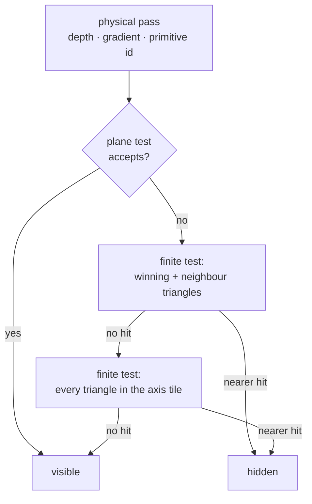

Built once per camera and geometry revision, read by the tile test:

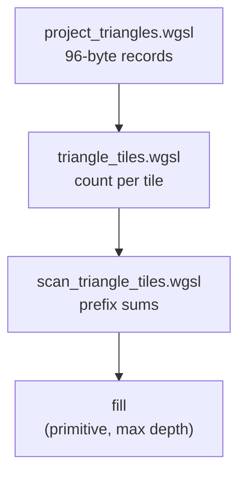

The same revision counter tells the silhouette when its masks are stale:

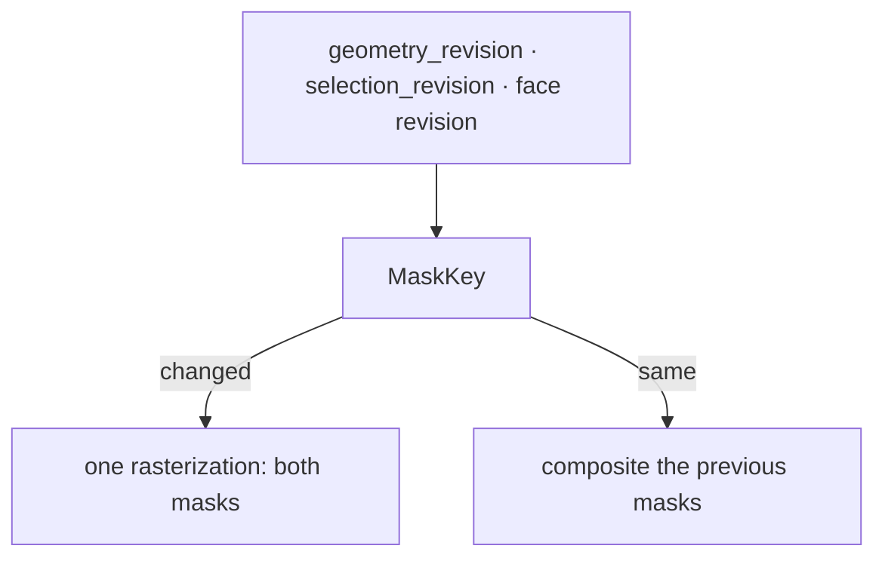

## Starting point

- Checkpoint 17. The ink shader hides a stroke sample when the surface's depth plane, carried to the stroke axis through the stored gradient, lies in front of the axis.
- That plane is infinite. A narrow strip beside a seam has a plane that crosses the seam ray outside the strip, so a seam disappears at teapot concavities and where solids touch.
- This lesson ends at the current production runtime.

<!-- supplied: 18 -->


## Part A · Remember which triangle won

### Step 1 · Metadata carries the primitive

- The physical metadata target grows from two to four half floats: gradient in `xy`, a lossless triangle address in `zw`.
- Each 14-bit half of the address skips exponent zero, so it survives `Rgba16Float` without NaNs or denormals.

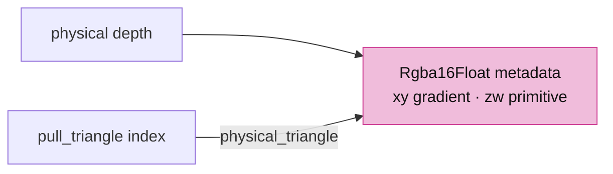

<!-- file: 18 session_viewer/src/shaders/physical.wgsl type -->

- `pull_triangle` numbers every triangle; `vs_triangle` is the plain physical draw, `vs_face` adds the source face on top.
- `fs_masks` writes the solid coverage and the selected coverage to two attachments from one rasterization; the targets blend with MAX, so a written zero acts as a discard.

<!-- file: 18 session_viewer/src/shaders/triangle.wgsl type -->

- Every other physical writer widens its metadata to `vec4` with a zero address, keeping the conservative plane rule.

<!-- file: 18 session_viewer/src/shaders/background.wgsl type -->

<!-- file: 18 session_viewer/src/shaders/grid.wgsl type -->

<!-- file: 18 session_viewer/src/shaders/splat.wgsl type -->

<!-- file: 18 session_viewer/src/shaders/splat_resolve.wgsl type -->

<!-- file: 18 session_viewer/src/shaders/text_outline.wgsl type -->

## Part B · Project each triangle once

### Step 2 · The projected record

`ProjectedTriangle` is six `vec4<f32>`; the Rust mirror test asserts the same offsets and `PROJECTED_BYTES`:

| Offset | Field | Meaning |
|---|---|---|
| 0 | `edge0` | inward edge equation `xyz`; `w` = reference x |
| 16 | `edge1` | edge equation; `w` = reference y |
| 32 | `edge2` | edge equation; `w` = reference depth |
| 48 | `edge3` | fourth edge of a near-clipped quad; `w` = corner count |
| 64 | `gradient` | screen depth gradient `xy`, nearest corner depth `z` |
| 80 | `bounds` | screen min `xy`, max `zw` |

- `projected_triangle_at` returns `(depth, 1)` when the point is inside every edge, else `(0, 0)`.
- `visibility_tile_span` doubles the tile size until the grid has at most `262144` tiles; the CPU `TileLayout` uses the same rule.

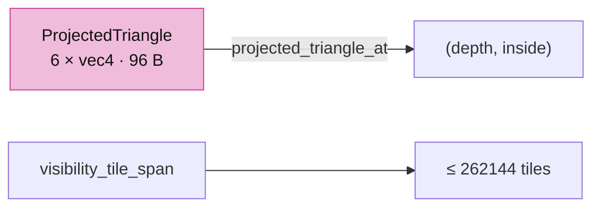

<!-- file: 18 session_viewer/src/shaders/projected_triangle.wgsl type -->

### Step 3 · The projection shader

- One compute invocation per triangle reads the arena's vertex, object and index columns through the same instance and translation rows the draw uses.
- Near-plane clipping happens before the divide, so a triangle crossing the eye becomes a quad or vanishes, never a garbage projection.

| Group · binding | Rust | WGSL |
|---|---|---|
| 0 · 0 | `Layouts::mvp` | `mvp` |
| 1 · 0 | `Layouts::line` | `line` (viewport size) |
| 2 · 0, 1 | `Layouts::instance` | `instances`, `translations` |
| 3 · 0–2 | arena vertices, object ids, indices | `physical_vertices`, `physical_objects`, `physical_indices` |
| 3 · 3 | `TriangleTiles::projected` | `projected` (read_write) |
| 3 · 4 | `live_count` uniform | `live_count` |

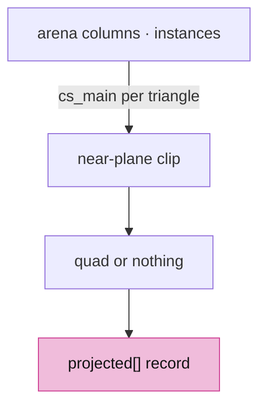

<!-- file: 18 session_viewer/src/shaders/project_triangles.wgsl type lines=1-60 -->

<!-- file: 18 session_viewer/src/shaders/project_triangles.wgsl type lines=61-127 -->

## Part C · A compact screen index

### Step 4 · Count and fill

- One quad per projected triangle covers its tile bounds; `covered_tile` discards tiles the polygon cannot touch.
- `fs_count` counts references per tile. `fs_fill` runs after the scan and writes `(primitive, nearest possible depth)` pairs into the tile's range; a cursor past the count sets the overflow flag instead of writing.

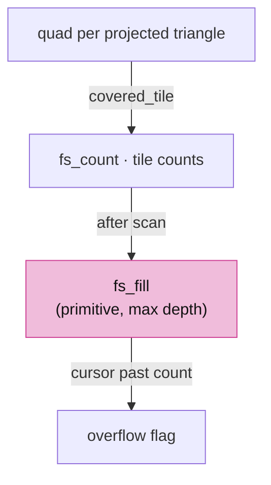

<!-- file: 18 session_viewer/src/shaders/triangle_tiles.wgsl type -->

### Step 5 · Prefix sums instead of a per-tile cap

- Tile records are `count / offset / cursor / overflow`; block records are `sum / prefix`.
- Sums saturate at the buffer capacity, so an oversubscribed pool can never wrap into a plausible offset.

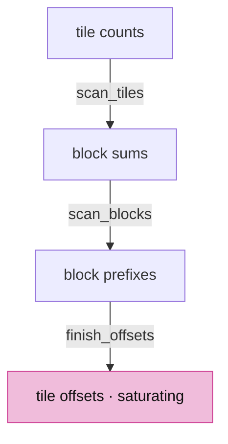

<!-- file: 18 session_viewer/src/shaders/scan_triangle_tiles.wgsl type -->

### Step 6 · The owner

- `TileLayout` mirrors `visibility_tile_span`; the reference pool is sized for the scene, two references per tile plus eight per triangle, and never larger than `REFERENCES_PER_TILE` per tile overall. A dense tile borrows spare space anywhere in the pool.


<!-- file: 18 session_viewer/src/engine/gpu/triangle_tiles.rs type lines=1-73 -->

- `PoolReport` reads the scan's first record back one frame later: the words every list needed. A pool that was too small keeps the conservative rejection for that one frame and is reallocated before the next projection.

<!-- file: 18 session_viewer/src/engine/gpu/triangle_tiles.rs type lines=74-145 -->

- `ProjectionKey` is the cache key: camera matrix plus the object table's geometry revision. Selection is not in it.

<!-- file: 18 session_viewer/src/engine/gpu/triangle_tiles.rs type lines=146-178 -->

<!-- file: 18 session_viewer/src/engine/gpu/triangle_tiles.rs type lines=179-211 -->

- `prepare` resizes storage for the triangle count, the framebuffer and the last report; beyond the device's storage binding limit it releases the tables and reports so the ink shader keeps the plane rule.

<!-- file: 18 session_viewer/src/engine/gpu/triangle_tiles.rs type lines=212-293 -->

- `encode` runs project → clear headers → count → three scan dispatches → fill → copy the report, then records the key.

<!-- file: 18 session_viewer/src/engine/gpu/triangle_tiles.rs type lines=294-400 -->

<!-- file: 18 session_viewer/src/engine/gpu/triangle_tiles.rs type lines=401-432 -->

- Layouts and pipelines: the project pass sees groups 0–2 from compute, the raster pass reads `projected` in the vertex stage and writes records in the fragment stage.

<!-- file: 18 session_viewer/src/engine/gpu/triangle_tiles.rs type lines=433-458 -->

<!-- file: 18 session_viewer/src/engine/gpu/triangle_tiles.rs type lines=459-548 -->

<!-- file: 18 session_viewer/src/engine/gpu/triangle_tiles.rs type lines=549-628 -->

Copy the rest of the file:

<!-- file: 18 session_viewer/src/engine/gpu/triangle_tiles.rs copy lines=629-741 -->

<!-- check: 18 -->

## Part D · The ink query

### Step 7 · Refine the rejection, keep the cheap test

- `ink_visible_plane` is the plane test. When it accepts, nothing else runs.
- When it rejects: test the winning primitive at the axis, then the four sample-matched neighbours. A finite nearer hit confirms occlusion.
- Otherwise walk the axis pixel's tile list: skip references whose nearest possible depth cannot beat the axis, skip triangles whose bounds miss the point, then run the finite test. An overflowing or incomplete list keeps the rejection.
- The projected triangles and their tiles are in canvas pixels; a pick pass draws a window of the canvas into an attachment of its own, so the axis is offset by `line.origin` before the lookup.

The blank lines separate the helpers; type them so the file matches production:

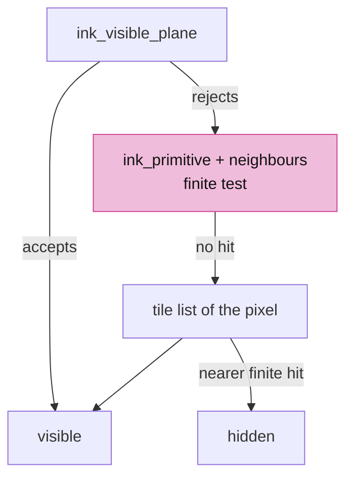

<!-- file: 18 session_viewer/src/shaders/ink_visibility.wgsl type hunks=1-11 -->

<!-- file: 18 session_viewer/src/shaders/ink_visibility.wgsl type hunks=12,13 -->

## Part E · Rust owners and wiring

### Step 8 · Faces draws the physical pass

- The physical and object-ID triangle pipelines move into `Faces`, so the primitive numbers written by the color pass are the same numbers the projection shader uses.
- `revision` counts highlight changes, and `draw_masks` writes the highlighted face into both coverage masks of the combined pass: the silhouette's cache key reads the counter, and its one rasterization draws the face through this entry.


<!-- file: 18 session_viewer/src/engine/gpu/faces.rs type -->

- The arena owns the `TriangleTiles`; `prepare_visibility` encodes them over the arena's exact buffers, and every append, reset or release invalidates them. `draw_masks` is the arena's side of the one-pass mask rasterization.

<!-- file: 18 session_viewer/src/engine/gpu/arena.rs type -->

### Step 9 · Bindings 6 and 7

- The ink instance group gains the projected table and the tile buffer; the mvp, line and instance layouts become visible to compute.

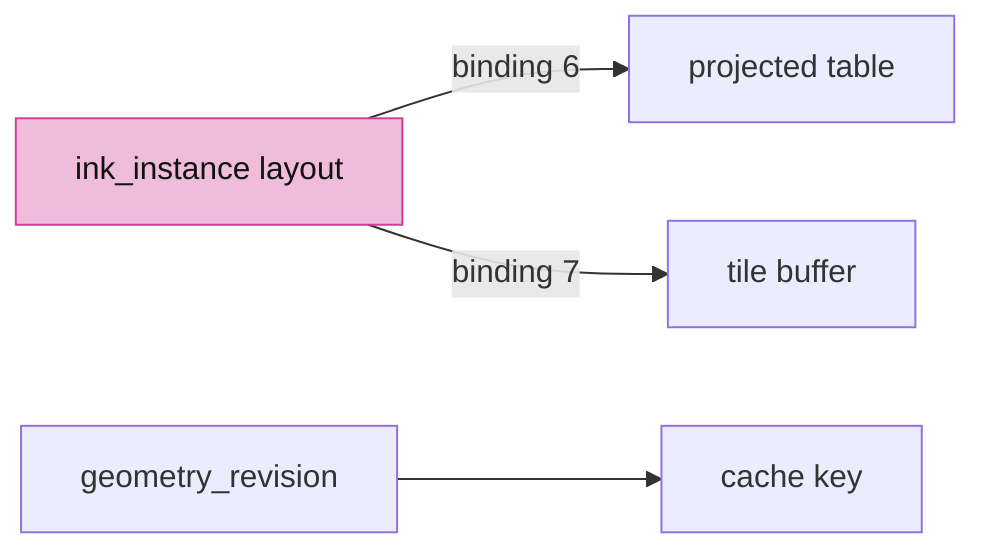

<!-- file: 18 session_viewer/src/engine/pipelines/layouts.rs type -->

- The ink module concatenates `projected_triangle.wgsl` after `ink_visibility.wgsl`; a desc marked `masks` targets two `R8Unorm` coverage attachments blended with MAX; the metadata attachment is `Rgba16Float`.

<!-- file: 18 session_viewer/src/engine/pipelines/mod.rs type -->

- `geometry_revision` counts placement, rebase and hidden-state changes; selection flags do not bump it.

<!-- file: 18 session_viewer/src/engine/gpu/objects.rs type -->

- Metadata textures and the pick copy widen to four channels; the readback row is 20 bytes per texel.

<!-- file: 18 session_viewer/src/engine/gpu/targets.rs type -->

<!-- file: 18 session_viewer/src/engine/gpu/pick.rs type -->

<!-- file: 18 session_viewer/src/engine/gpu/instance.rs type -->

### Step 10 · The tile pass runs before ink

- `triangle_tile_pass` prepares storage, rebinds the ink group when a buffer was replaced, then encodes; both the color frame and an ID-only frame call it.
- After every submit the picker maps its copy and the tiles map their report.

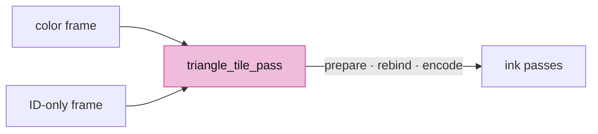

<!-- file: 18 session_viewer/src/engine/gpu/present.rs type -->

### Step 11 · Masks rasterized once, reused while the view stands still

- `MaskKey` is what a coverage mask depends on: the camera matrix, the geometry revision, the selection revision, the highlighted face's revision, the size and the sample count. While none of them changes, the mask passes are skipped and the previous masks are composited again: a still view costs no rasterization.
- When the key changes and both outlines are on, `begin_masks` opens one pass with both attachments, and the faces are rasterized once for both masks; a single outline keeps its own pass.
- `selection_revision` counts selection flag changes, so a selection change rebuilds the masks without touching the tile index.

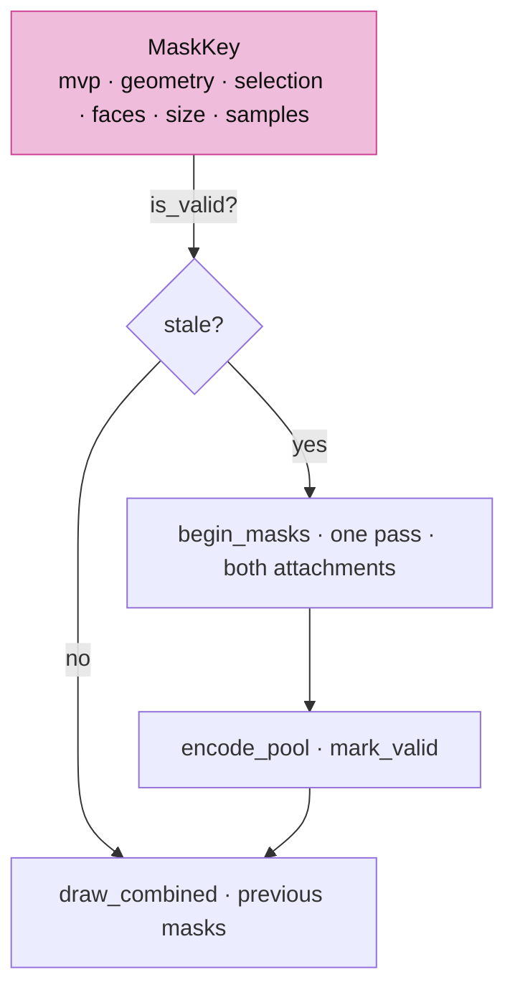

<!-- file: 18 session_viewer/src/engine/gpu/surface_outline.rs type -->

<!-- file: 18 session_viewer/src/engine/gpu/render.rs type -->

- The `Gpu` accounts for the wider targets and the tile pool, binds the tiles into every ink scene, and bumps `selection_revision` in `set_selected`.

<!-- file: 18 session_viewer/src/engine/gpu/mod.rs type -->

### Step 12 · Pointer positions on a capped surface

- `?dpr=` renders the canvas below the browser's ratio, but winit still reports cursor and touch positions at the browser's ratio. `surface_per_physical` is that cap over the ratio, 1 without a cap, and the input handler scales every position by it before a drag, a zoom or a pick reads it.

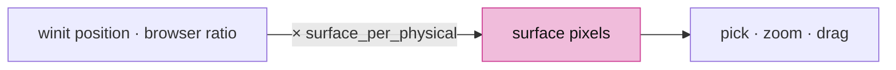

<!-- file: 18 session_viewer/src/engine/gpu/view.rs type -->

<!-- file: 18 session_viewer/src/app/input.rs type -->

<!-- check: 18 -->

## Check

<!-- checkpoint: 18 -->

Expected:

- With the supplied teapot fixture (`assets/pb/view_mixed_teapot.pb`) or the local scene loaded: the concave foot boundary stays continuous while orbiting; edges where two solids touch stay visible.
- A genuinely covered edge stays hidden; a visible seam does not break up as a neighbouring face moves over its stroke fringe.
- Press **O**, select a solid and hold the camera still: the perf line shows the mask passes only on the frame after a change; orbit and they run again.

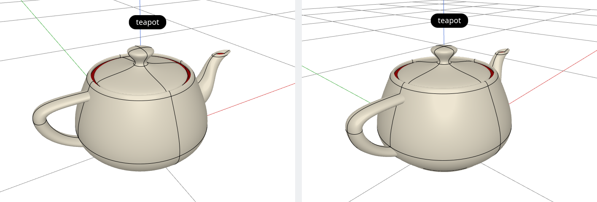

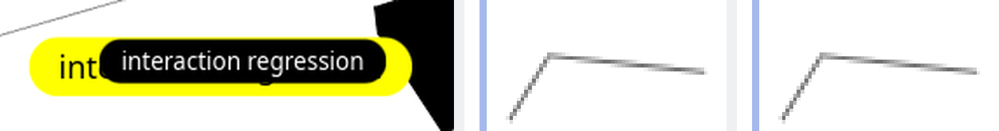

Optional lint gates:

```sh
cargo fmt --package session_viewer -- --check
cargo clippy --locked --target wasm32-unknown-unknown --lib -- -D warnings
```

## The result, served

The same source you just finished is what the repository publishes:

- **Served viewer**: <https://petrasvestartas.github.io/session/> — the GitHub Pages build of `session_viewer`; its documentation corner opens this course at <https://petrasvestartas.github.io/session/docs/>.
- **Source code**: <https://github.com/petrasvestartas/session/tree/main/session_viewer> — the folder this course reconstructs, byte for byte at checkpoint 18.
- **Locally**: `trunk serve` in `session_viewer` serves the viewer at <http://localhost:8770/> and the course at <http://localhost:8770/docs/>; the black corner at the top right links the two.

## Verify you reached production

Record the checkpoint and compare every runtime file against the frozen production inventory:

```sh
python3 "$COURSE_REPO/docs/reconstruction/replay.py" --output "$COURSE_WORK" --through 18 --adopt
python3 "$COURSE_REPO/docs/reconstruction/converge.py" --workspace "$COURSE_WORK"
```

Expected:

- `converge.py` reports every runtime file identical to production; the only listed differences are the documented packaging ones (the local input manifest and imported-document font artifacts).

## What changed

<!-- tree: 18 session_viewer/src/engine -->

- Data flow: arena columns → `project_triangles.wgsl` → `projected` → `fs_count` → scan → `fs_fill` → `triangle_tiles` → `ink_visible`.
- Metadata: `Rgba16Float` with gradient in `xy` and the packed primitive in `zw`; the ID pass owns matching single-sample targets.
- Cache: rebuilt on camera, hide/show, placement, rebase or geometry replacement; reused across selection and color changes.
- Silhouette: `MaskKey` reuses both coverage masks while the view stands still; a change rasterizes the faces once for both.
- Memory: the visibility pool is sized for the scene and grows from the scan's report.

**Production equivalent:** this checkpoint is the current production runtime.

## Try

- Orbit the teapot slowly around its foot and watch the bottom boundary: it stays continuous where the body's planes cross the stroke axis, which is exactly where the plane test alone would break it into dashes.
- Set `?thickness=3` and repeat: the finite test is on the stroke axis, so a wider fringe changes the look, not the visibility decision.
- Overflow a tile on purpose by loading a dense mesh and lowering the tile size in `triangle_tiles.rs`: overflowing lists keep the conservative rejection, and hidden edges never leak through.
- Open `?outlines=1`, select the BRep and click another object: the masks are rebuilt because `selection_revision` moved, while the tile index, keyed on geometry only, is reused.

## Next

[Architecture reference](../ARCHITECTURE.md): the finished module graph, frame lifecycle and Rust ↔ WGSL interfaces.
