# 18 · Finite-triangle visibility and production convergence

## You are building

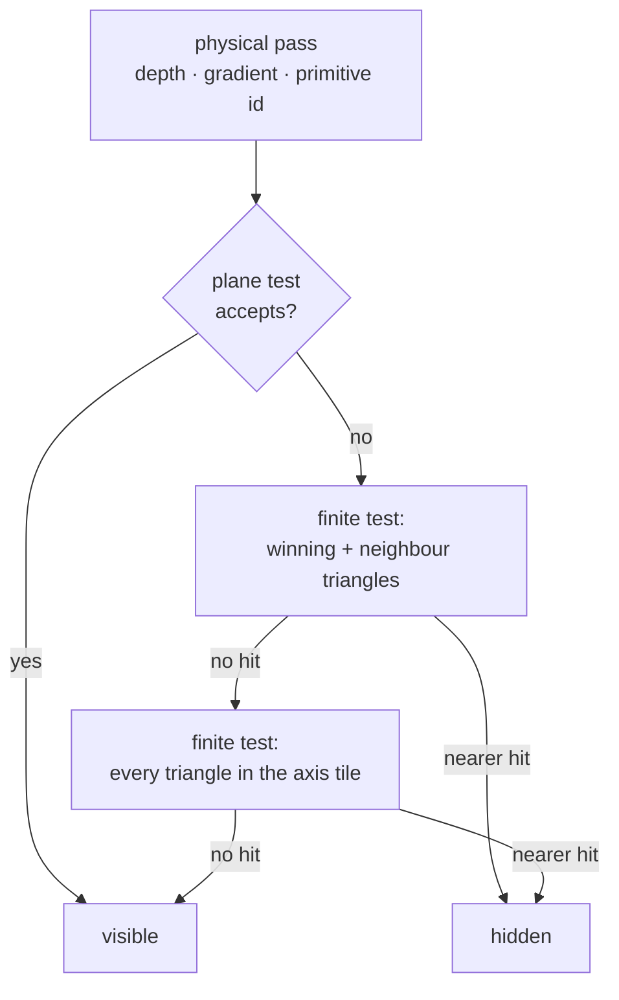

Built once per camera and geometry revision, read by the tile test:

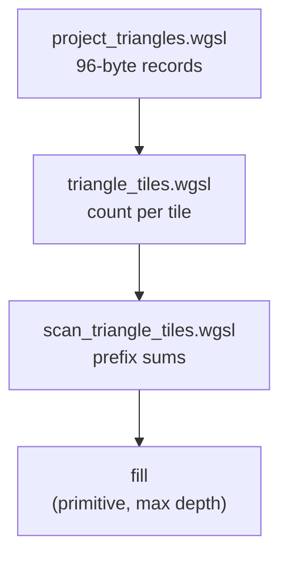

The same revision counter tells the silhouette when its masks are stale:

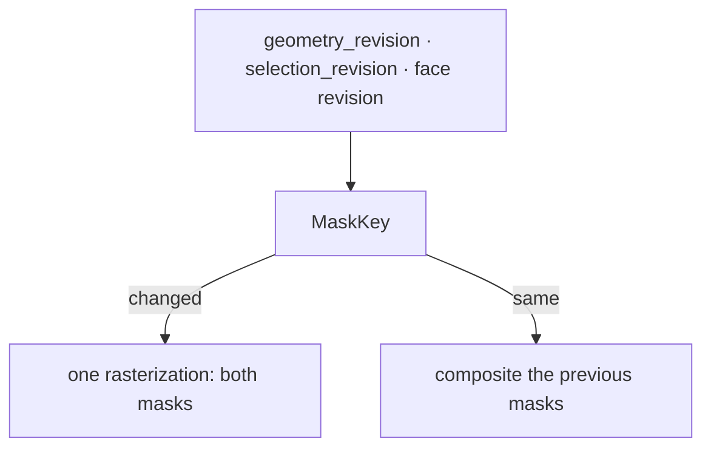

## Starting point

- Checkpoint 17. The ink shader hides a stroke sample when the surface's depth plane, carried to the stroke axis through the stored gradient, lies in front of the axis.
- That plane is infinite. A narrow strip beside a seam has a plane that crosses the seam ray outside the strip, so a seam disappears at teapot concavities and where solids touch.
- This lesson finishes the renderer. Two lessons still change production: 19 adds drawing sheets and 20 gives the kernel its history, and lesson 20 is where the reconstruction is compared against production.

<!-- supplied: 18 -->


<!-- step-status: start -->

**Does it compile yet?** `cargo check` passes after steps 1–7 and 11, and fails after 8–10: a file is written across several steps, and a check can only pass once its last piece is in. Concretely, steps 8–10 build again at step 11. This is measured at the end of every step rather than guessed. And where a check passes while your new files are not yet named by a `mod` line, it is telling you only that you have not broken the previous checkpoint — the checkpoint build at the end of the lesson is the real test.

<!-- step-status: end -->

## Part A · Remember which triangle won

### Step 1 · Metadata carries the primitive

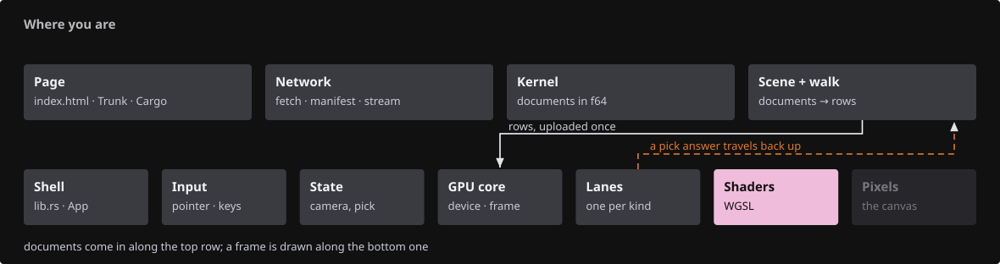{ .locator data-strip="illustrations/strip-6785d37980.svg" }

- The physical metadata target grows from two to four half floats: gradient in `xy`, a lossless triangle address in `zw`.
- Each 14-bit half of the address skips exponent zero, so it survives `Rgba16Float` without NaNs or denormals.

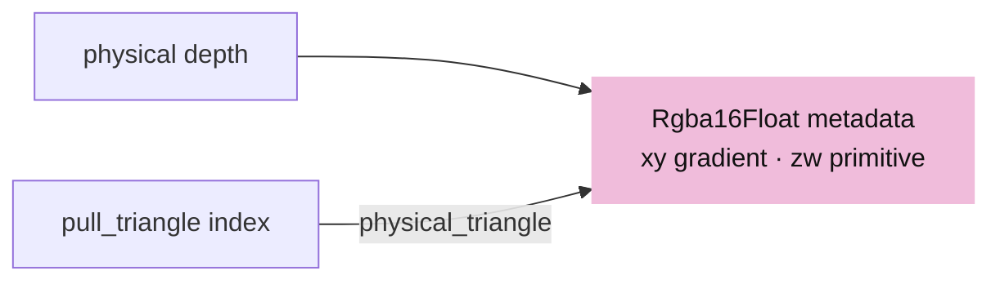

<span class="zone-mark" data-strip="illustrations/strip-6785d37980.svg" data-zone="Shaders"></span>

<!-- file: 18 session_viewer/src/shaders/physical.wgsl type -->

- `pull_triangle` numbers every triangle; `vs_triangle` is the plain physical draw, `vs_face` adds the source face on top.
- `fs_masks` writes the solid coverage and the selected coverage to two attachments from one rasterization; the targets blend with MAX, so a written zero acts as a discard.
- X-ray (`P`, `line.opacity` zero): `transform_vertex` marks a closed multi-face solid `xray`, and every fragment entry `discard`s its fragments, so the solid writes no colour, no depth and no coverage, and the ink behind it (back edges, far vertices) is judged against what remains. A single face (`FLAG_SINGLE`, a sheet, print fill) has no inside to show and keeps its shading. Discarding, not blending: a translucent face would still write depth and hide everything behind it.

<span class="zone-mark" data-strip="illustrations/strip-6785d37980.svg" data-zone="Shaders"></span>

<!-- file: 18 session_viewer/src/shaders/triangle.wgsl type -->

- Every other physical writer widens its metadata to `vec4` with a zero address, keeping the conservative plane rule.

<span class="zone-mark" data-strip="illustrations/strip-6785d37980.svg" data-zone="Shaders"></span>

<!-- file: 18 session_viewer/src/shaders/background.wgsl type -->

<span class="zone-mark" data-strip="illustrations/strip-6785d37980.svg" data-zone="Shaders"></span>

<!-- file: 18 session_viewer/src/shaders/grid.wgsl type -->

- The backdrop shaders widen their metadata output to four halves with a zero triangle address: they are not surfaces a tile list can describe.

<span class="zone-mark" data-strip="illustrations/strip-6785d37980.svg" data-zone="Shaders"></span>

<!-- file: 18 session_viewer/src/shaders/splat.wgsl type -->

- Same widening for points, same reason: a splat has no triangle to name.

<span class="zone-mark" data-strip="illustrations/strip-6785d37980.svg" data-zone="Shaders"></span>

<!-- file: 18 session_viewer/src/shaders/splat_resolve.wgsl type -->

- And for the resolve, which is the pass that actually writes the scene's depth for a cloud.

<span class="zone-mark" data-strip="illustrations/strip-6785d37980.svg" data-zone="Shaders"></span>

<!-- file: 18 session_viewer/src/shaders/text_outline.wgsl type -->

- And imported lettering, the last of the four. None of them can name a triangle, so all four write a zero address.

## Part B · Project each triangle once

### Step 2 · The projected record

{ .locator data-strip="illustrations/strip-6785d37980.svg" }

`ProjectedTriangle` is six `vec4<f32>`; the Rust mirror test asserts the same offsets and `PROJECTED_BYTES`:

| Offset | Field | Meaning |
|---|---|---|
| 0 | `edge0` | inward edge equation `xyz`; `w` = reference x |
| 16 | `edge1` | edge equation; `w` = reference y |
| 32 | `edge2` | edge equation; `w` = reference depth |
| 48 | `edge3` | fourth edge of a near-clipped quad; `w` = corner count |
| 64 | `gradient` | screen depth gradient `xy`, nearest corner depth `z` |
| 80 | `bounds` | screen min `xy`, max `zw` |

- `projected_triangle_at` returns `(depth, 1)` when the point is inside every edge, else `(0, 0)`.
- `visibility_tile_span` doubles the tile size until the grid has at most `262144` tiles; the CPU `TileLayout` uses the same rule.

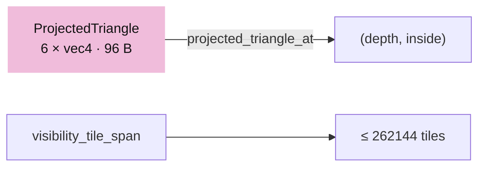

<span class="zone-mark" data-strip="illustrations/strip-6785d37980.svg" data-zone="Shaders"></span>

<!-- file: 18 session_viewer/src/shaders/projected_triangle.wgsl type -->

### Step 3 · The projection shader

{ .locator data-strip="illustrations/strip-6785d37980.svg" }

- One compute invocation per triangle reads the arena's vertex, object and index columns through the same instance and translation rows the draw uses.
- Near-plane clipping happens before the divide, so a triangle crossing the eye becomes a quad or vanishes, never a garbage projection.

| Group · binding | Rust | WGSL |
|---|---|---|
| 0 · 0 | `Layouts::mvp` | `mvp` |
| 1 · 0 | `Layouts::line` | `line` (viewport size) |
| 2 · 0, 1 | `Layouts::instance` | `instances`, `translations` |
| 3 · 0–2 | arena vertices, object ids, indices | `physical_vertices`, `physical_objects`, `physical_indices` |
| 3 · 3 | `TriangleTiles::projected` | `projected` (read_write) |
| 3 · 4 | `live_count` uniform | `live_count` |

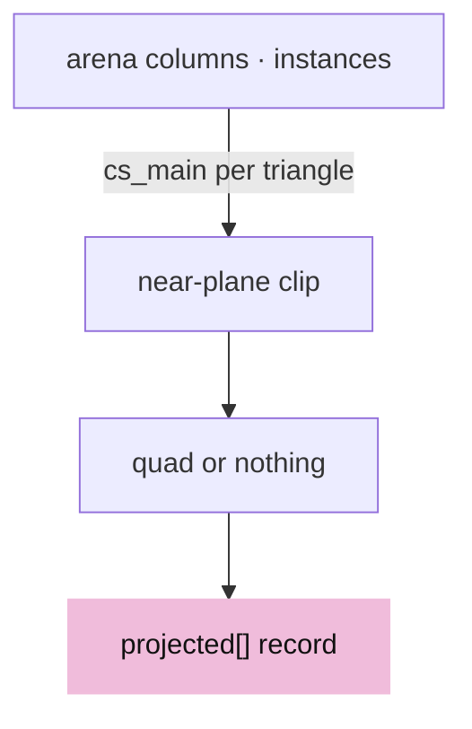

<span class="zone-mark" data-strip="illustrations/strip-6785d37980.svg" data-zone="Shaders"></span>

<!-- file: 18 session_viewer/src/shaders/project_triangles.wgsl type lines=1-60 -->

<span class="zone-mark" data-strip="illustrations/strip-6785d37980.svg" data-zone="Shaders"></span>

<!-- file: 18 session_viewer/src/shaders/project_triangles.wgsl type lines=61-127 -->

- The projection itself, used by the one compute pass that fills the record buffer. The arithmetic the binning passes and the ink query share is the smaller `projected_triangle.wgsl`, appended to both.

## Part C · A compact screen index

### Step 4 · Count and fill

{ .locator data-strip="illustrations/strip-6785d37980.svg" }

- One quad per projected triangle covers its tile bounds; `covered_tile` discards tiles the polygon cannot touch.
- `fs_count` counts references per tile. `fs_fill` runs after the scan and writes `(primitive, nearest possible depth)` pairs into the tile's range; a cursor past the count sets the overflow flag instead of writing.


<span class="zone-mark" data-strip="illustrations/strip-6785d37980.svg" data-zone="Shaders"></span>

<!-- file: 18 session_viewer/src/shaders/triangle_tiles.wgsl type -->

### Step 5 · Prefix sums instead of a per-tile cap

{ .locator data-strip="illustrations/strip-6785d37980.svg" }

- Tile records are `count / offset / cursor / overflow`; block records are `sum / prefix`.
- Sums saturate at the buffer capacity, so an oversubscribed pool can never wrap into a plausible offset.

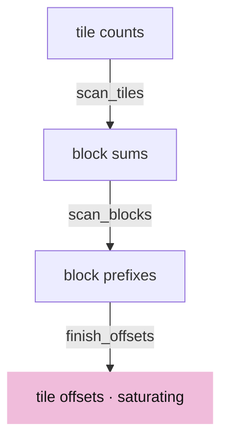

<span class="zone-mark" data-strip="illustrations/strip-6785d37980.svg" data-zone="Shaders"></span>

<!-- file: 18 session_viewer/src/shaders/scan_triangle_tiles.wgsl type -->

### Step 6 · The owner

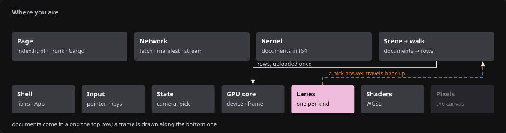{ .locator data-strip="illustrations/strip-57ee15e1f9.svg" }

- `TileLayout` mirrors `visibility_tile_span`; the reference pool is sized for the scene, two references per tile plus eight per triangle, and never larger than `REFERENCES_PER_TILE` per tile overall. A dense tile borrows spare space anywhere in the pool.

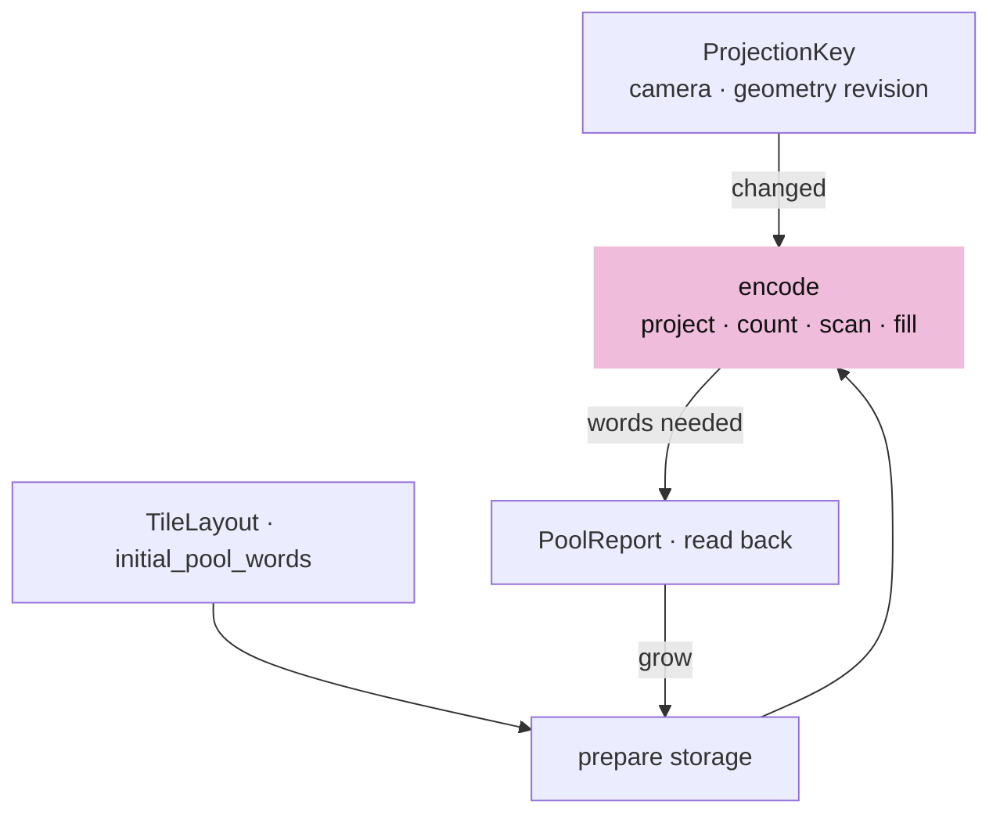

<span class="zone-mark" data-strip="illustrations/strip-57ee15e1f9.svg" data-zone="Lanes"></span>

<!-- file: 18 session_viewer/src/engine/gpu/triangle_tiles.rs type lines=1-57 -->

- The pool is one flat array of reference words shared by every tile, not a fixed quota each. A dense tile borrows space a sparse one never used, which is what keeps the allocation proportional to the scene rather than to the grid.

<span class="zone-mark" data-strip="illustrations/strip-57ee15e1f9.svg" data-zone="Lanes"></span>

<!-- file: 18 session_viewer/src/engine/gpu/triangle_tiles.rs type lines=58-79 -->

- `PoolReport` reads the scan's first record back one frame later: the words every list needed. A pool that was too small keeps the conservative rejection for that one frame and is reallocated before the next projection.

<span class="zone-mark" data-strip="illustrations/strip-57ee15e1f9.svg" data-zone="Lanes"></span>

<!-- file: 18 session_viewer/src/engine/gpu/triangle_tiles.rs type lines=80-151 -->

- `ProjectionKey` is the cache key: camera matrix plus the object table's geometry revision. Selection is not in it.

<span class="zone-mark" data-strip="illustrations/strip-57ee15e1f9.svg" data-zone="Lanes"></span>

<!-- file: 18 session_viewer/src/engine/gpu/triangle_tiles.rs type lines=152-184 -->

<span class="zone-mark" data-strip="illustrations/strip-57ee15e1f9.svg" data-zone="Lanes"></span>

<!-- file: 18 session_viewer/src/engine/gpu/triangle_tiles.rs type lines=185-217 -->

- `prepare` resizes storage for the triangle count, the framebuffer and the last report; beyond the device's storage binding limit it releases the tables and reports so the ink shader keeps the plane rule.

<span class="zone-mark" data-strip="illustrations/strip-57ee15e1f9.svg" data-zone="Lanes"></span>

<!-- file: 18 session_viewer/src/engine/gpu/triangle_tiles.rs type lines=218-299 -->

- `encode` runs project → clear headers → count → three scan dispatches → fill → copy the report, then records the key.

<span class="zone-mark" data-strip="illustrations/strip-57ee15e1f9.svg" data-zone="Lanes"></span>

<!-- file: 18 session_viewer/src/engine/gpu/triangle_tiles.rs type lines=300-370 -->

- Coverage is rasterized twice: once to count how many references each tile needs, and again, after the scan has turned those counts into offsets, to write them. Counting first is what removes the per-tile cap.

<span class="zone-mark" data-strip="illustrations/strip-57ee15e1f9.svg" data-zone="Lanes"></span>

<!-- file: 18 session_viewer/src/engine/gpu/triangle_tiles.rs type lines=371-406 -->

<span class="zone-mark" data-strip="illustrations/strip-57ee15e1f9.svg" data-zone="Lanes"></span>

<!-- file: 18 session_viewer/src/engine/gpu/triangle_tiles.rs type lines=407-438 -->

- Layouts and pipelines: the project pass sees groups 0–2 from compute, the raster pass reads `projected` in the vertex stage and writes records in the fragment stage.

<span class="zone-mark" data-strip="illustrations/strip-57ee15e1f9.svg" data-zone="Lanes"></span>

<!-- file: 18 session_viewer/src/engine/gpu/triangle_tiles.rs type lines=439-464 -->

<span class="zone-mark" data-strip="illustrations/strip-57ee15e1f9.svg" data-zone="Lanes"></span>

<!-- file: 18 session_viewer/src/engine/gpu/triangle_tiles.rs type lines=465-572 -->

- Every preparation shader is compiled with the same projected-record and tile-grid arithmetic the ink shader uses, so the CPU, the raster passes and the ink query can never disagree about which tile a pixel is in.

<span class="zone-mark" data-strip="illustrations/strip-57ee15e1f9.svg" data-zone="Lanes"></span>

<!-- file: 18 session_viewer/src/engine/gpu/triangle_tiles.rs type lines=573-580 -->

Copy the rest of the file:

<span class="zone-mark" data-strip="illustrations/strip-57ee15e1f9.svg" data-zone="Lanes"></span>

<!-- file: 18 session_viewer/src/engine/gpu/triangle_tiles.rs copy lines=581-703 -->

<!-- check: 18 -->


## Part D · The ink query

### Step 7 · Refine the rejection, keep the cheap test

{ .locator data-strip="illustrations/strip-6785d37980.svg" }

- `ink_visible_plane` is the plane test. When it accepts, nothing else runs.
- When it rejects: test the winning primitive at the axis, then the four sample-matched neighbours. A finite nearer hit confirms occlusion.
- Otherwise walk the axis pixel's tile list: skip references whose nearest possible depth cannot beat the axis, skip triangles whose bounds miss the point, then run the finite test. An overflowing or incomplete list keeps the rejection.
- The projected triangles and their tiles are in canvas pixels; a pick pass draws a window of the canvas into an attachment of its own, so the axis is offset by `line.origin` before the lookup.

The blank lines separate the helpers; type them so the file matches production:


<span class="zone-mark" data-strip="illustrations/strip-6785d37980.svg" data-zone="Shaders"></span>

<!-- file: 18 session_viewer/src/shaders/ink_visibility.wgsl type hunks=1-11 -->

<span class="zone-mark" data-strip="illustrations/strip-6785d37980.svg" data-zone="Shaders"></span>

<!-- file: 18 session_viewer/src/shaders/ink_visibility.wgsl type hunks=12,13 -->

- The escalation itself: when the plane test rejects, walk the axis pixel's tile list and look for a finite hit. An incomplete list keeps the rejection.

## Part E · Rust owners and wiring

### Step 8 · Faces draws the physical pass

{ .locator data-strip="illustrations/strip-57ee15e1f9.svg" }

- The physical and object-ID triangle pipelines move into `Faces`, so the primitive numbers written by the color pass are the same numbers the projection shader uses.
- `revision` counts highlight changes, and `draw_masks` writes the highlighted face into both coverage masks of the combined pass: the silhouette's cache key reads the counter, and its one rasterization draws the face through this entry.

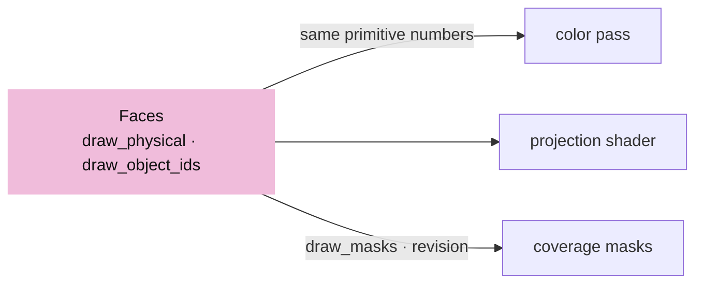

<span class="zone-mark" data-strip="illustrations/strip-57ee15e1f9.svg" data-zone="Lanes"></span>

<!-- file: 18 session_viewer/src/engine/gpu/faces.rs type -->

- The arena owns the `TriangleTiles`; `prepare_visibility` encodes them over the arena's exact buffers, and every append, reset or release invalidates them. `draw_masks` is the arena's side of the one-pass mask rasterization.

<span class="zone-mark" data-strip="illustrations/strip-57ee15e1f9.svg" data-zone="Lanes"></span>

<!-- file: 18 session_viewer/src/engine/gpu/arena.rs type -->

### Step 9 · Bindings 6 and 7

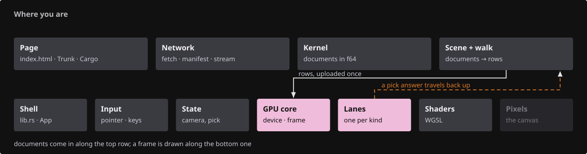{ .locator data-strip="illustrations/strip-1bf2a655a8.svg" }

- The ink instance group gains the projected table and the tile buffer; the mvp, line and instance layouts become visible to compute.

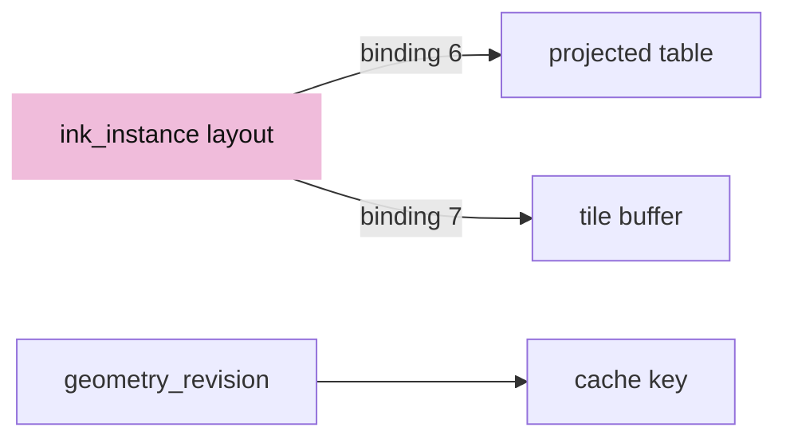

<span class="zone-mark" data-strip="illustrations/strip-b139852359.svg" data-zone="GPU core"></span>

<!-- file: 18 session_viewer/src/engine/pipelines/layouts.rs type -->

- The ink module concatenates `projected_triangle.wgsl` after `ink_visibility.wgsl`; a desc marked `masks` targets two `R8Unorm` coverage attachments blended with MAX; the metadata attachment is `Rgba16Float`.

<span class="zone-mark" data-strip="illustrations/strip-b139852359.svg" data-zone="GPU core"></span>

<!-- file: 18 session_viewer/src/engine/pipelines/mod.rs type -->

- `geometry_revision` counts placement, rebase and hidden-state changes; selection flags do not bump it.

<span class="zone-mark" data-strip="illustrations/strip-b139852359.svg" data-zone="GPU core"></span>

<!-- file: 18 session_viewer/src/engine/gpu/objects.rs type -->

- Metadata textures and the pick copy widen to four channels; the readback row is 20 bytes per texel.

<span class="zone-mark" data-strip="illustrations/strip-b139852359.svg" data-zone="GPU core"></span>

<!-- file: 18 session_viewer/src/engine/gpu/targets.rs type -->

<span class="zone-mark" data-strip="illustrations/strip-57ee15e1f9.svg" data-zone="Lanes"></span>

<!-- file: 18 session_viewer/src/engine/gpu/pick.rs type -->

- The pick target follows the metadata: twenty bytes a texel instead of sixteen, `Rgba16Float` instead of `Rg16Float`. The tile lists themselves reach the ID pass through group 2, so nothing else here changes.

<span class="zone-mark" data-strip="illustrations/strip-b139852359.svg" data-zone="GPU core"></span>

<!-- file: 18 session_viewer/src/engine/gpu/instance.rs type -->

- A second mirror test: `ProjectedTriangle` is 96 bytes with asserted offsets, another Rust struct with a WGSL twin that must not drift.

### Step 10 · The tile pass runs before ink

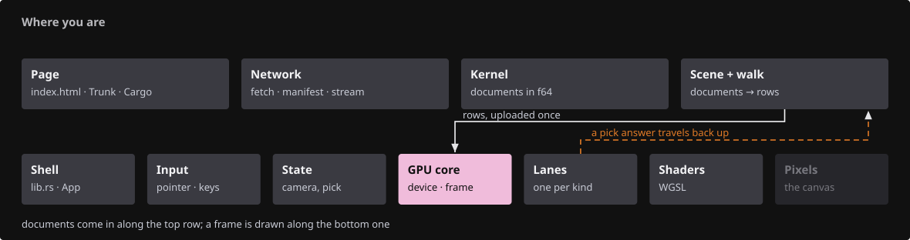{ .locator data-strip="illustrations/strip-b139852359.svg" }

- `triangle_tile_pass` prepares storage, rebinds the ink group when a buffer was replaced, then encodes; both the color frame and an ID-only frame call it.
- After every submit the picker maps its copy and the tiles map their report.

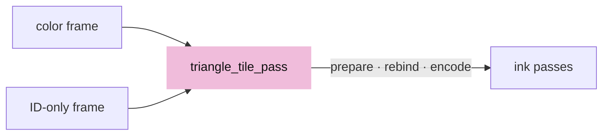

<span class="zone-mark" data-strip="illustrations/strip-b139852359.svg" data-zone="GPU core"></span>

<!-- file: 18 session_viewer/src/engine/gpu/present.rs type -->

### Step 11 · Masks rasterized once, reused while the view stands still

{ .locator data-strip="illustrations/strip-1bf2a655a8.svg" }

- `MaskKey` is what a coverage mask depends on: the camera matrix, the geometry revision, the selection revision, the highlighted face's revision, the size, the sample count, and — because edges are part of the coverage — the edge toggle and the pen width. While none of them changes, the mask passes are skipped and the previous masks are composited again: a still view costs no rasterization.
- When the key changes and both outlines are on, `begin_masks` opens one pass with both attachments, and the faces are rasterized once for both masks; a single outline keeps its own pass.
- `selection_revision` counts selection flag changes, so a selection change rebuilds the masks without touching the tile index.

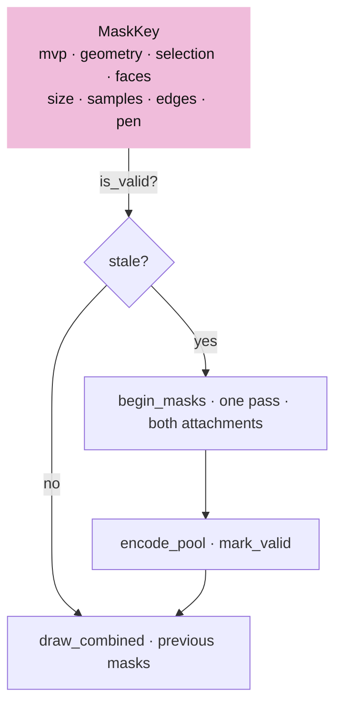

- One `css_radius` for ordinary and selected solids: a heavier ring on the selection read as a different object, and the yellow strokes already say which one is selected.

<span class="zone-mark" data-strip="illustrations/strip-57ee15e1f9.svg" data-zone="Lanes"></span>

<!-- file: 18 session_viewer/src/engine/gpu/surface_outline.rs type -->

- Edges join the silhouette. Four more segment pipelines rasterize every solid edge into the coverage masks (`fs_mask`, `fs_masks`, `ColorWrite::Max`), so the black outline hugs a cube's edges as tightly as its faces, at one thickness whether the object is selected or not.

<span class="zone-mark" data-strip="illustrations/strip-57ee15e1f9.svg" data-zone="Lanes"></span>

<!-- file: 18 session_viewer/src/engine/gpu/segments.rs type -->

<span class="zone-mark" data-strip="illustrations/strip-b139852359.svg" data-zone="GPU core"></span>

<!-- file: 18 session_viewer/src/engine/gpu/render.rs type -->

- No silhouettes in x-ray (`faces` requires `opacity > 0.0`): the ring would sit on top of the very edges and vertices `P` is there to show.

- The `Gpu` accounts for the wider targets and the tile pool, binds the tiles into every ink scene, and bumps `selection_revision` in `set_selected`.

<span class="zone-mark" data-strip="illustrations/strip-b139852359.svg" data-zone="GPU core"></span>

<!-- file: 18 session_viewer/src/engine/gpu/mod.rs type -->

## Check

<!-- checkpoint: 18 -->

Expected:

- With the supplied teapot fixture (`assets/pb/view_mixed_teapot.pb`) or the local scene loaded: the concave foot boundary stays continuous while orbiting; edges where two solids touch stay visible.
- A genuinely covered edge stays hidden; a visible seam does not break up as a neighbouring face moves over its stroke fringe.
- Press **O**, select a solid and hold the camera still: the perf line shows the mask passes only on the frame after a change; orbit and they run again.


Optional lint gates:

```sh
cargo fmt --package session_viewer -- --check
cargo clippy --locked --target wasm32-unknown-unknown --lib -- -D warnings
```

## The result, served

The same source you just finished is what the repository publishes:

- **Served viewer**: <https://petrasvestartas.github.io/session/> — the GitHub Pages build of `session_viewer`; its documentation corner opens this course at <https://petrasvestartas.github.io/session/docs/>.
- **Source code**: <https://github.com/petrasvestartas/session/tree/main/session_viewer> — the folder this course reconstructs, byte for byte at checkpoint 18.
- **Locally**: `trunk serve` in `session_viewer` serves the viewer at <http://localhost:8770/> and the course at <http://localhost:8770/docs/>; the black corner at the top right links the two.

## What changed

<!-- tree: 18 session_viewer/src/engine -->

- Data flow: arena columns → `project_triangles.wgsl` → `projected` → `fs_count` → scan → `fs_fill` → `triangle_tiles` → `ink_visible`.
- Metadata: `Rgba16Float` with gradient in `xy` and the packed primitive in `zw`; the ID pass owns matching single-sample targets.
- Cache: rebuilt on camera, hide/show, placement, rebase or geometry replacement; reused across selection and color changes.
- Silhouette: `MaskKey` reuses both coverage masks while the view stands still; a change rasterizes the faces once for both.
- Memory: the visibility pool is sized for the scene and grows from the scan's report.

**Production equivalent:** this checkpoint is the current production runtime.

## Try

- Orbit the teapot slowly around its foot and watch the bottom boundary: it stays continuous where the body's planes cross the stroke axis, which is exactly where the plane test alone would break it into dashes.
- Set `?thickness=3` and repeat: the finite test is on the stroke axis, so a wider fringe changes the look, not the visibility decision.
- Overflow a tile on purpose by loading a dense mesh and lowering the tile size in `triangle_tiles.rs`: overflowing lists keep the conservative rejection, and hidden edges never leak through.
- Open `?outlines=1`, select the BRep and click another object: the masks are rebuilt because `selection_revision` moved, while the tile index, keyed on geometry only, is reused.

## Questions and answers

The last renderer lesson. These questions are the ones an interviewer would ask about this codebase.

**The plane test is kept, and the tile walk only runs when the plane test rejects. Why is that ordering the whole design?**

*How to work it out.* Price the two tests: the plane test is one `textureLoad` plus a dot product; the tile walk is a list traversal with a bounds test per entry. Then ask how often each is needed — the plane test is right everywhere except at concavities and where solids touch. Finally, check the *direction* of the cheap test's error: it extends a finite triangle's plane, so it can only over-occlude.

*The answer.* Because the cheap test can only wrongly *hide*, never wrongly *show*, escalating on rejection can only restore ink — so running it first is free correctness, not a gamble. The expensive machinery then costs nothing on the overwhelming majority of fragments.

**An overflowing or incomplete tile list keeps the rejection rather than accepting. Why is that the safe direction?**

*How to work it out.* The list is the evidence for "nothing finite occludes this axis". Ask what an incomplete list proves: nothing. Then compare the two errors — ink wrongly hidden (a seam missing at one contact) against ink wrongly shown (lines drawn through solids).

*The answer.* With no evidence you fall back to the conservative answer. Drawing through solids is the worse error and the more confusing one, and `PoolReport` makes the degradation last exactly one frame before the pool is resized.

**`ProjectionKey` is the camera matrix plus the geometry revision. Why is selection deliberately not in it?**

*How to work it out.* Ask what the projection contains: each triangle's screen position and depth. Then ask what selecting an object changes: a flag in a row, affecting colour. No triangle moves.

*The answer.* The tiles are still valid, so rebuilding them on every click would be pure waste during the most interactive thing a user does. The silhouette masks *are* keyed on selection, because their content genuinely changes. One revision counter per thing that can go stale, and each consumer keys on the ones that affect it.

**X-ray discards fragments instead of blending them. Give two reasons.**

*How to work it out.* Ask what a blended face still does: it writes depth. Then ask what `P` is for: seeing the edges and vertices *behind* the face. Then check the mask pass, which rasterizes the same faces.

*The answer.* A translucent face would still occlude everything behind it through the depth buffer, so transparency is not absence. And a discarding face writes no coverage either, which is what stops the silhouette from ringing a solid you asked to see through. `FLAG_SINGLE` marks shapes with no inside to reveal — a geometric fact the producer knows and the shader cannot work out for itself.

**Sums saturate at the buffer capacity instead of wrapping. What is the failure this prevents?**

*How to work it out.* Follow a wrapped prefix sum: it becomes a small number, which is a valid-looking offset into the pool. The fill pass then writes this tile's references into some other tile's range.

*The answer.* Not a crash — wrong visibility somewhere else on screen, far from the dense geometry that caused it. Saturation turns a silent corruption into the overflow flag, which the ink query already handles.

**What you should be able to do now**

You have built the whole renderer: name one frame's passes in order, with what each reads and writes, and which two are skipped when not needed. Correct: project triangles and build tiles (skipped when the key still matches), the point prelude (skipped when there are no points), the face pass with backdrop, the coverage-mask passes and their pool reductions, the silhouette composite, the ink pass, the text pass, and the ID pass on demand. Then take the [capstone](capstone.md): the section plane touches every one of them.

## Next

[19 · Sheets](19-sheets.md): drawings as one segment batch with lazy metadata.
