# 18 · Finite-triangle visibility and production convergence

## You are building

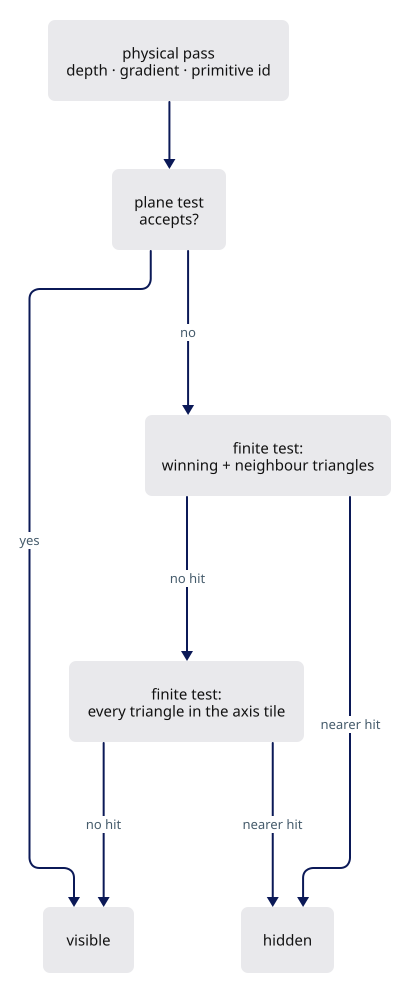

Built once per camera and geometry revision, read by the tile test:

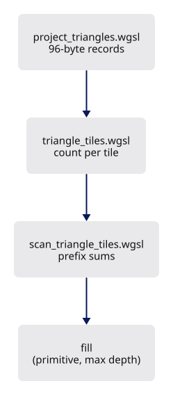

The same revision counter tells the silhouette when its masks are stale:

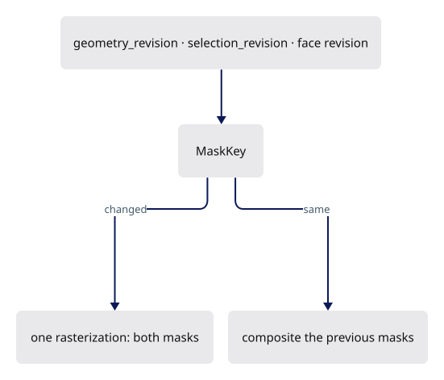

## Starting point

- Checkpoint 17. The ink shader hides a stroke sample when the surface's depth plane, carried to the stroke axis through the stored gradient, lies in front of the axis.
- That plane is infinite. A narrow strip beside a seam has a plane that crosses the seam ray outside the strip, so a seam disappears at teapot concavities and where solids touch.
- This lesson finishes the renderer. Two lessons still change production: 19 adds drawing sheets, 20 gives the kernel its history and compares the reconstruction against production.

<!-- supplied: 18 -->


<!-- step-status: start -->

**Does it compile yet?** `cargo check` passes after steps 1–7 and 11; steps 8–10 fail and build again at step 11.

<!-- step-status: end -->

## Part A · Remember which triangle won

### Step 1 · Metadata carries the primitive

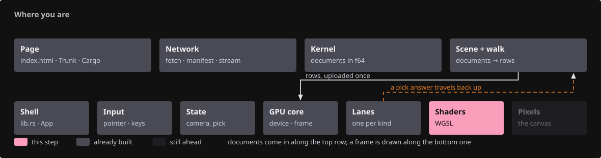{ .locator data-strip="illustrations/strip-093d035257.svg" }

- The physical metadata target grows from two to four half floats: gradient in `xy`, a lossless triangle address in `zw`.
- Each 14-bit half of the address skips exponent zero, so it survives `Rgba16Float` without NaNs or denormals.

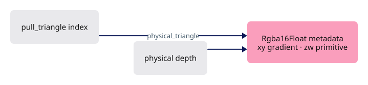

<span class="zone-mark" data-strip="illustrations/strip-093d035257.svg" data-zone="Shaders"></span>

<!-- file: 18 session_viewer/src/shaders/physical.wgsl type -->

- `pull_triangle` numbers every triangle; `vs_triangle` is the plain physical draw, `vs_face` adds the source face on top.
- `fs_masks` writes solid and selected coverage to two attachments from one rasterization; the targets blend with MAX, so a written zero acts as a discard.
- X-ray (`P`, `line.opacity` zero): `transform_vertex` marks `xray` every solid that is not a print, a sheet or a single face, and every fragment entry `discard`s its fragments.
- The solid then writes no colour, no depth and no coverage, and the ink behind it is judged against what remains.
- A single face (`FLAG_SINGLE`, a sheet, print fill) has no inside to show and keeps its shading.

<span class="zone-mark" data-strip="illustrations/strip-093d035257.svg" data-zone="Shaders"></span>

<!-- file: 18 session_viewer/src/shaders/triangle.wgsl type -->

- Every other physical writer widens its metadata to `vec4` with a zero address, keeping the conservative plane rule.

<span class="zone-mark" data-strip="illustrations/strip-093d035257.svg" data-zone="Shaders"></span>

<!-- file: 18 session_viewer/src/shaders/background.wgsl type -->

<span class="zone-mark" data-strip="illustrations/strip-093d035257.svg" data-zone="Shaders"></span>

<!-- file: 18 session_viewer/src/shaders/grid.wgsl type -->

- The backdrop shaders widen to four halves with a zero triangle address: they are not surfaces a tile list can describe.

<span class="zone-mark" data-strip="illustrations/strip-093d035257.svg" data-zone="Shaders"></span>

<!-- file: 18 session_viewer/src/shaders/splat.wgsl type -->

- Same widening for points, same reason: a splat has no triangle to name.

<span class="zone-mark" data-strip="illustrations/strip-093d035257.svg" data-zone="Shaders"></span>

<!-- file: 18 session_viewer/src/shaders/splat_resolve.wgsl type -->

- And for the resolve, the pass that writes the scene's depth for a cloud.

<span class="zone-mark" data-strip="illustrations/strip-093d035257.svg" data-zone="Shaders"></span>

<!-- file: 18 session_viewer/src/shaders/text_outline.wgsl type -->

- And imported lettering, the last of the four.

## Part B · Project each triangle once

### Step 2 · The projected record

{ .locator data-strip="illustrations/strip-093d035257.svg" }

`ProjectedTriangle` is six `vec4<f32>`; the Rust mirror test asserts the same offsets and `PROJECTED_BYTES`:

| Offset | Field | Meaning |
|---|---|---|
| 0 | `edge0` | inward edge equation `xyz`; `w` = reference x |
| 16 | `edge1` | edge equation; `w` = reference y |
| 32 | `edge2` | edge equation; `w` = reference depth |
| 48 | `edge3` | fourth edge of a near-clipped quad; `w` = corner count |
| 64 | `gradient` | screen depth gradient `xy`, nearest corner depth `z` |
| 80 | `bounds` | screen min `xy`, max `zw` |

- `projected_triangle_at` returns `(depth, 1)` when the point is inside every edge, else `(0, 0)`.
- `visibility_tile_span` doubles the tile size until the grid has at most `262144` tiles; the CPU `TileLayout` uses the same rule.

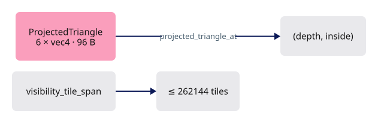

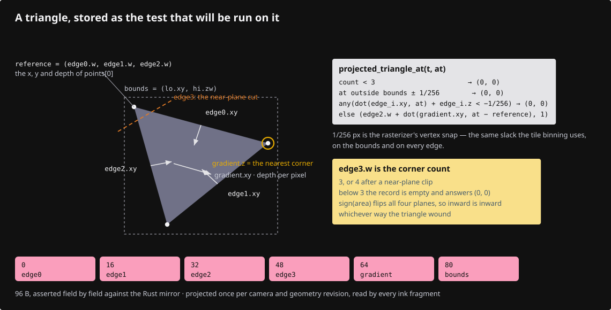

<span class="zone-mark" data-strip="illustrations/strip-093d035257.svg" data-zone="Shaders"></span>

<!-- file: 18 session_viewer/src/shaders/projected_triangle.wgsl type -->

### Step 3 · The projection shader

{ .locator data-strip="illustrations/strip-093d035257.svg" }

- One compute invocation per triangle reads the arena's vertex, object and index columns through the same instance and translation rows the draw uses.
- Near-plane clipping happens before the divide, so a triangle crossing the eye becomes a quad or vanishes, never a garbage projection.

| Group · binding | Rust | WGSL |
|---|---|---|
| 0 · 0 | `Layouts::mvp` | `mvp` |
| 1 · 0 | `Layouts::line` | `line` (viewport size) |
| 2 · 0, 1 | `Layouts::instance` | `instances`, `translations` |
| 3 · 0–2 | arena vertices, object ids, indices | `physical_vertices`, `physical_objects`, `physical_indices` |
| 3 · 3 | `TriangleTiles::projected` | `projected` (read_write) |
| 3 · 4 | `live_count` uniform | `live_count` |

![Diagram: arena columns · instances · near-plane clip · quad or nothing · projected[] record](illustrations/18-06.svg)

<span class="zone-mark" data-strip="illustrations/strip-093d035257.svg" data-zone="Shaders"></span>

<!-- file: 18 session_viewer/src/shaders/project_triangles.wgsl type lines=1-60 -->

<span class="zone-mark" data-strip="illustrations/strip-093d035257.svg" data-zone="Shaders"></span>

<!-- file: 18 session_viewer/src/shaders/project_triangles.wgsl type lines=61-127 -->

- The projection itself, used by the one compute pass that fills the record buffer.
- The binning passes and the ink query share the smaller `projected_triangle.wgsl`, appended to both.

## Part C · A compact screen index

### Step 4 · Count and fill

{ .locator data-strip="illustrations/strip-093d035257.svg" }

- One quad per projected triangle covers its tile bounds; `covered_tile` discards tiles the polygon cannot touch.
- `fs_count` counts references per tile.
- `fs_fill` runs after the scan and writes `(primitive, nearest possible depth)` pairs into the tile's range; a cursor past the count sets the overflow flag instead of writing.

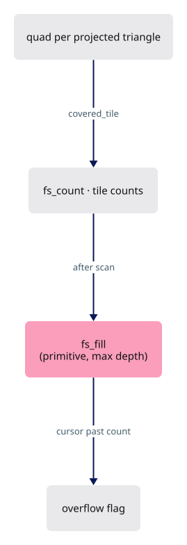

<span class="zone-mark" data-strip="illustrations/strip-093d035257.svg" data-zone="Shaders"></span>

<!-- file: 18 session_viewer/src/shaders/triangle_tiles.wgsl type -->

### Step 5 · Prefix sums instead of a per-tile cap

{ .locator data-strip="illustrations/strip-093d035257.svg" }

- Tile records are `count / offset / cursor / overflow`; block records are `sum / prefix`.
- Sums saturate at the buffer capacity, so an oversubscribed pool can never wrap into a plausible offset.

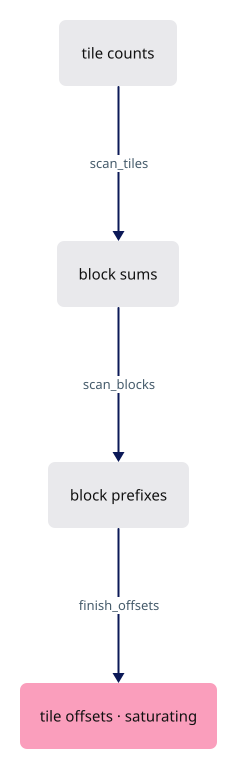

<span class="zone-mark" data-strip="illustrations/strip-093d035257.svg" data-zone="Shaders"></span>

<!-- file: 18 session_viewer/src/shaders/scan_triangle_tiles.wgsl type -->

### Step 6 · The owner

{ .locator data-strip="illustrations/strip-ccdfd9e2ff.svg" }

- `TileLayout` mirrors `visibility_tile_span`.
- The reference pool is sized for the scene: two references per tile plus eight per triangle, capped at `REFERENCES_PER_TILE` per tile.

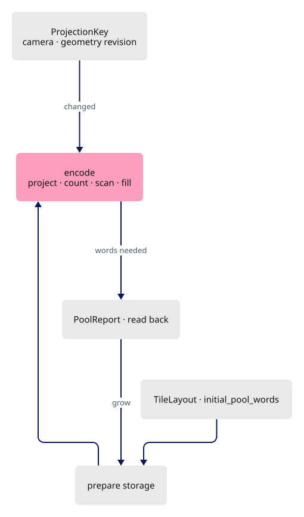

<span class="zone-mark" data-strip="illustrations/strip-ccdfd9e2ff.svg" data-zone="Lanes"></span>

<!-- file: 18 session_viewer/src/engine/gpu/triangle_tiles.rs type lines=1-57 -->

- The pool is one flat array, not a quota per tile: a dense tile borrows space a sparse one never used, so the allocation follows the scene rather than the grid.


<span class="zone-mark" data-strip="illustrations/strip-ccdfd9e2ff.svg" data-zone="Lanes"></span>

<!-- file: 18 session_viewer/src/engine/gpu/triangle_tiles.rs type lines=58-79 -->

- `PoolReport` reads the scan's first record back one frame later: an absolute word index into
  the tile buffer, header words included, so it is above capacity exactly when the lists did not
  fit. The prefix sums stop at the buffer's word count instead of wrapping, which puts a
  saturated report far above capacity - a floor, not a measurement. There is nothing to size
  against then, so the pool doubles and the next report says whether that was enough.

<span class="zone-mark" data-strip="illustrations/strip-ccdfd9e2ff.svg" data-zone="Lanes"></span>

<!-- file: 18 session_viewer/src/engine/gpu/triangle_tiles.rs type lines=80-179 -->

- `ProjectionKey` is the cache key: camera matrix plus the object table's geometry revision. Selection is not in it.

<span class="zone-mark" data-strip="illustrations/strip-ccdfd9e2ff.svg" data-zone="Lanes"></span>

<!-- file: 18 session_viewer/src/engine/gpu/triangle_tiles.rs type lines=180-212 -->

<span class="zone-mark" data-strip="illustrations/strip-ccdfd9e2ff.svg" data-zone="Lanes"></span>

<!-- file: 18 session_viewer/src/engine/gpu/triangle_tiles.rs type lines=213-245 -->

- `prepare` resizes storage for the triangle count, the framebuffer and the last report.
- Beyond the device's storage binding limit it releases the tables and reports, so the ink shader keeps the plane rule.

<span class="zone-mark" data-strip="illustrations/strip-ccdfd9e2ff.svg" data-zone="Lanes"></span>

<!-- file: 18 session_viewer/src/engine/gpu/triangle_tiles.rs type lines=246-323 -->

- `encode` runs project → clear headers → count → three scan dispatches → fill → copy the report, then records the key.

<span class="zone-mark" data-strip="illustrations/strip-ccdfd9e2ff.svg" data-zone="Lanes"></span>

<!-- file: 18 session_viewer/src/engine/gpu/triangle_tiles.rs type lines=324-394 -->

- Counting first removes the per-tile cap.

<span class="zone-mark" data-strip="illustrations/strip-ccdfd9e2ff.svg" data-zone="Lanes"></span>

<!-- file: 18 session_viewer/src/engine/gpu/triangle_tiles.rs type lines=395-430 -->

<span class="zone-mark" data-strip="illustrations/strip-ccdfd9e2ff.svg" data-zone="Lanes"></span>

<!-- file: 18 session_viewer/src/engine/gpu/triangle_tiles.rs type lines=431-462 -->

- Layouts and pipelines: the project pass sees groups 0–2 from compute, the raster pass reads `projected` in the vertex stage and writes records in the fragment stage.

<span class="zone-mark" data-strip="illustrations/strip-ccdfd9e2ff.svg" data-zone="Lanes"></span>

<!-- file: 18 session_viewer/src/engine/gpu/triangle_tiles.rs type lines=463-488 -->

<span class="zone-mark" data-strip="illustrations/strip-ccdfd9e2ff.svg" data-zone="Lanes"></span>

<!-- file: 18 session_viewer/src/engine/gpu/triangle_tiles.rs type lines=489-596 -->

- Every preparation shader compiles the same projected-record and tile-grid arithmetic the ink shader uses, so the CPU, the raster passes and the ink query cannot disagree about which tile a pixel is in.

<span class="zone-mark" data-strip="illustrations/strip-ccdfd9e2ff.svg" data-zone="Lanes"></span>

<!-- file: 18 session_viewer/src/engine/gpu/triangle_tiles.rs type lines=597-604 -->

Copy the rest of the file:

<span class="zone-mark" data-strip="illustrations/strip-ccdfd9e2ff.svg" data-zone="Lanes"></span>

<!-- file: 18 session_viewer/src/engine/gpu/triangle_tiles.rs copy lines=605-786 -->

<!-- check: 18 -->


## Part D · The ink query

### Step 7 · Refine the rejection, keep the cheap test

{ .locator data-strip="illustrations/strip-093d035257.svg" }

- `ink_visible_plane` is the plane test. When it accepts, nothing else runs.
- When it rejects: test the winning primitive at the axis, then the four sample-matched neighbours. A finite nearer hit confirms occlusion.
- Otherwise walk the axis pixel's tile list: skip references whose nearest possible depth cannot beat the axis, skip triangles whose bounds miss the point, then run the finite test.
- An overflowing or incomplete list keeps the rejection.
- Projected triangles and their tiles are in canvas pixels, while a pick pass draws into its own window-sized attachment, so the axis is offset by `line.origin` before the lookup.

The blank lines separate the helpers; type them so the file matches production:

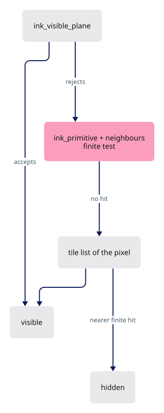

<span class="zone-mark" data-strip="illustrations/strip-093d035257.svg" data-zone="Shaders"></span>

<!-- file: 18 session_viewer/src/shaders/ink_visibility.wgsl type hunks=1-11 -->

<span class="zone-mark" data-strip="illustrations/strip-093d035257.svg" data-zone="Shaders"></span>

<!-- file: 18 session_viewer/src/shaders/ink_visibility.wgsl type hunks=12,13 -->


## Part E · Rust owners and wiring

### Step 8 · Faces draws the physical pass

{ .locator data-strip="illustrations/strip-ccdfd9e2ff.svg" }

- The physical and object-ID triangle pipelines move into `Faces`, so the color pass writes the primitive numbers the projection shader uses.
- `revision` counts highlight changes; the silhouette's cache key reads it.
- `draw_masks` writes the highlighted face into both coverage masks, so the one rasterization draws it through this entry.

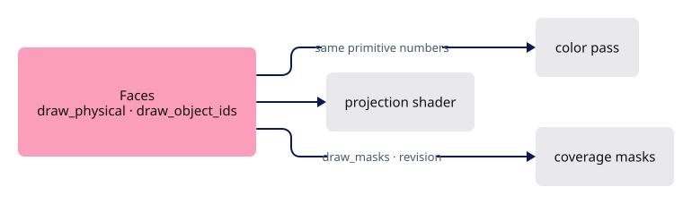

<span class="zone-mark" data-strip="illustrations/strip-ccdfd9e2ff.svg" data-zone="Lanes"></span>

<!-- file: 18 session_viewer/src/engine/gpu/faces.rs type -->

- The arena owns the `TriangleTiles`: `prepare_visibility` encodes them over the arena's exact buffers, and every append, reset or release invalidates them.
- `draw_masks` is the arena's side of the one-pass mask rasterization.

<span class="zone-mark" data-strip="illustrations/strip-ccdfd9e2ff.svg" data-zone="Lanes"></span>

<!-- file: 18 session_viewer/src/engine/gpu/arena.rs type -->

### Step 9 · Bindings 6 and 7

{ .locator data-strip="illustrations/strip-187e4e26b4.svg" }

- The ink instance group gains the projected table and the tile buffer; the mvp, line and instance layouts become visible to compute.

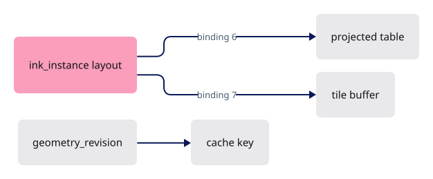

<span class="zone-mark" data-strip="illustrations/strip-68dea8ec67.svg" data-zone="GPU core"></span>

<!-- file: 18 session_viewer/src/engine/pipelines/layouts.rs type -->

- The ink module concatenates `projected_triangle.wgsl` after `ink_visibility.wgsl`.
- A desc marked `masks` targets two `R8Unorm` coverage attachments blended with MAX; the metadata attachment is `Rgba16Float`.

<span class="zone-mark" data-strip="illustrations/strip-68dea8ec67.svg" data-zone="GPU core"></span>

<!-- file: 18 session_viewer/src/engine/pipelines/mod.rs type -->

- `geometry_revision` counts placement, rebase and hidden-state changes; selection flags do not bump it.

<span class="zone-mark" data-strip="illustrations/strip-68dea8ec67.svg" data-zone="GPU core"></span>

<!-- file: 18 session_viewer/src/engine/gpu/objects.rs type -->

- Metadata textures and the pick copy widen to four channels; the ID targets now cost 20 bytes a texel instead of 16.

<span class="zone-mark" data-strip="illustrations/strip-68dea8ec67.svg" data-zone="GPU core"></span>

<!-- file: 18 session_viewer/src/engine/gpu/targets.rs type -->

<span class="zone-mark" data-strip="illustrations/strip-ccdfd9e2ff.svg" data-zone="Lanes"></span>

<!-- file: 18 session_viewer/src/engine/gpu/pick.rs type -->

- The pick target follows the metadata: `Rgba16Float` instead of `Rg16Float`.
- The tile lists reach the ID pass through group 2, so nothing else here changes.

<span class="zone-mark" data-strip="illustrations/strip-68dea8ec67.svg" data-zone="GPU core"></span>

<!-- file: 18 session_viewer/src/engine/gpu/instance.rs type -->

- A second mirror test: `ProjectedTriangle` is 96 bytes with asserted offsets — a WGSL struct with no Rust twin, so the offsets are pinned against a written list and `PROJECTED_BYTES` instead of against a `#[repr(C)]` layout.

### Step 10 · The tile pass runs before ink

{ .locator data-strip="illustrations/strip-68dea8ec67.svg" }

- `triangle_tile_pass` prepares storage, rebinds the ink group when a buffer was replaced, then encodes; both the color frame and an ID-only frame call it.
- After every submit the picker maps its copy and the tiles map their report.

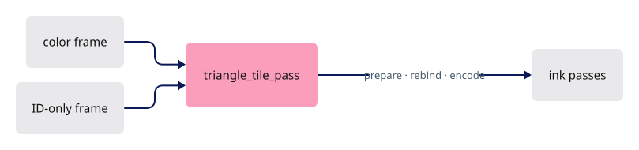

<span class="zone-mark" data-strip="illustrations/strip-68dea8ec67.svg" data-zone="GPU core"></span>

<!-- file: 18 session_viewer/src/engine/gpu/present.rs type -->

### Step 11 · Masks rasterized once, reused while the view stands still

{ .locator data-strip="illustrations/strip-187e4e26b4.svg" }

- `MaskKey` is what a coverage mask depends on: camera matrix, geometry revision, selection revision, the highlighted face's revision, size, sample count, and — because edges are part of the coverage — the edge toggle and the pen width.
- While none of them changes, the mask passes are skipped and the previous masks composited again.
- When the key changes and both outlines are on, `begin_masks` opens one pass with both attachments and rasterizes the faces once for both masks.
- A single outline keeps its own pass.
- `selection_revision` counts selection flag changes, so a selection change rebuilds the masks without touching the tile index.

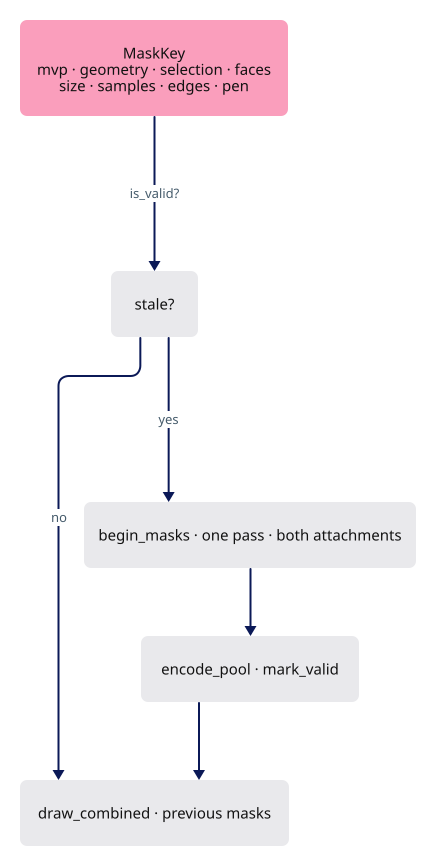

- One `css_radius` for ordinary and selected solids: a heavier ring on the selection read as a different object, and the yellow strokes already say which one is selected.

<span class="zone-mark" data-strip="illustrations/strip-ccdfd9e2ff.svg" data-zone="Lanes"></span>

<!-- file: 18 session_viewer/src/engine/gpu/surface_outline.rs type -->

- Edges join the silhouette: four more segment pipelines rasterize every solid edge into the coverage masks (`fs_mask`, `fs_masks`, `ColorWrite::Max`).
- The black outline then hugs a cube's edges as tightly as its faces.

<span class="zone-mark" data-strip="illustrations/strip-ccdfd9e2ff.svg" data-zone="Lanes"></span>

<!-- file: 18 session_viewer/src/engine/gpu/segments.rs type -->

<span class="zone-mark" data-strip="illustrations/strip-68dea8ec67.svg" data-zone="GPU core"></span>

<!-- file: 18 session_viewer/src/engine/gpu/render.rs type -->

- No silhouettes in x-ray (`faces` requires `opacity > 0.0`): the ring would sit on top of the very edges and vertices `P` is there to show.

- The `Gpu` accounts for the wider targets and the tile pool, binds the tiles into every ink scene, and bumps `selection_revision` in `set_selected`.

<span class="zone-mark" data-strip="illustrations/strip-68dea8ec67.svg" data-zone="GPU core"></span>

<!-- file: 18 session_viewer/src/engine/gpu/mod.rs type -->

## Check

<!-- checkpoint: 18 -->

Expected:

- No manifest names the teapot: to use it, add `  - file: pb/view_mixed_teapot.pb` as a second entry under `items:` in `session_viewer/assets/view_local.yaml` before `trunk serve`. With the teapot or the local scene loaded: the concave foot boundary stays continuous while orbiting; edges where two solids touch stay visible.
- A genuinely covered edge stays hidden; a visible seam does not break up as a neighbouring face moves over its stroke fringe.
- Press **O**, select a solid and hold the camera still: the encode time on the `?perf=1` line settles, because the masks are reused; orbit and it rises again while they are rebuilt.


Optional lint gates:

```sh
cargo fmt --package session_viewer -- --check
cargo clippy --locked --target wasm32-unknown-unknown --lib -- -D warnings
```

## The result, served

The same source you just finished is what the repository publishes:

- **Served viewer**: <https://petrasvestartas.github.io/session/> — the GitHub Pages build of `session_viewer`; its documentation corner opens this course at <https://petrasvestartas.github.io/session/docs/>.
- **Source code**: <https://github.com/petrasvestartas/session/tree/main/session_viewer> — the folder this course reconstructs; lesson 20 ends by proving the reconstruction equals it byte for byte.
- **Locally**: `trunk serve` in `session_viewer` serves the viewer at <http://localhost:8770/> and the course at <http://localhost:8770/docs/>; the black corner at the top right links the two.

## What changed

<!-- tree: 18 session_viewer/src/engine -->

- Data flow: arena columns → `project_triangles.wgsl` → `projected` → `fs_count` → scan → `fs_fill` → `triangle_tiles` → `ink_visible`.
- Metadata: `Rgba16Float` with gradient in `xy` and the packed primitive in `zw`; the ID pass owns matching single-sample targets.
- Cache: rebuilt on camera, hide/show, placement, rebase or geometry replacement; reused across selection and color changes.
- Silhouette: `MaskKey` reuses both coverage masks while the view stands still; a change rasterizes the faces once for both.
- Memory: the visibility pool is sized for the scene and grows from the scan's report.

**Production equivalent:** every file in this lesson sits at the same path in production; lesson 19 then changes `src/engine/gpu/segments.rs`, `src/app/`, `src/lib.rs` and `src/state.rs`, and lesson 20 the kernel.

## Try

- Orbit the teapot slowly around its foot: the bottom boundary stays continuous where the body's planes cross the stroke axis — exactly where the plane test alone would break it into dashes.
- Set `?thickness=3` and repeat: the finite test is on the stroke axis, so a wider fringe changes the look, not the visibility decision.
- Overflow a tile: load a dense mesh and lower `REFERENCES_PER_TILE` in `triangle_tiles.rs`, the ceiling the pool may never pass. The tile span is not the knob for this: it has a twin in `projected_triangle.wgsl` and may only change in both at once. Overflowing lists keep the conservative rejection, and hidden edges never leak through.
- Open `?outlines=1`, select the BRep and click another object: the masks are rebuilt because `selection_revision` moved, while the tile index, keyed on geometry only, is reused.

## Questions and answers


**The plane test is kept, and the tile walk only runs when the plane test rejects. Why is that ordering the whole design?**

*How to work it out.* Price them: the plane test is one `textureLoad` plus a dot product; the tile walk is a list traversal with a bounds test per entry. The plane test is right everywhere except at concavities and where solids touch. Then check the *direction* of its error: it extends a finite triangle's plane, so it can only over-occlude.

*The answer.* Because the cheap test can only wrongly *hide*, never wrongly *show*, escalating on rejection can only restore ink — so running it first is free correctness, not a gamble. The expensive machinery then costs nothing on almost every fragment.

**An overflowing or incomplete tile list keeps the rejection rather than accepting. Why is that the safe direction?**

*How to work it out.* The list is the evidence for "nothing finite occludes this axis". Ask what an incomplete list proves: nothing. Then compare the two errors — ink wrongly hidden (a seam missing at one contact) against ink wrongly shown (lines drawn through solids).

*The answer.* With no evidence you fall back to the conservative answer. Drawing through solids is the worse and more confusing error, and `PoolReport` is the way out of the degradation: a report that reaches capacity doubles the pool, and the next report says whether that was enough, until the lists fit or the pool stands at the ceiling it may never pass.

**`ProjectionKey` is the camera matrix plus the geometry revision. Why is selection deliberately not in it?**

*How to work it out.* Ask what the projection contains: each triangle's screen position and depth. Then ask what selecting an object changes: a flag in a row, affecting colour. No triangle moves.

*The answer.* The tiles are still valid, so rebuilding them on every click is pure waste during the most interactive thing a user does. The silhouette masks *are* keyed on selection: their content genuinely changes. One revision counter per thing that can go stale, and each consumer keys on the ones that affect it.

**X-ray discards fragments instead of blending them. Give two reasons.**

*How to work it out.* Ask what a blended face still does: it writes depth. Then ask what `P` is for: seeing the edges and vertices *behind* the face. Then check the mask pass, which rasterizes the same faces.

*The answer.* A translucent face would still occlude everything behind it through the depth buffer, so transparency is not absence. And a discarding face writes no coverage either, which stops the silhouette ringing a solid you asked to see through. `FLAG_SINGLE` marks shapes with no inside to reveal — a geometric fact the producer knows and the shader cannot work out for itself.

**Sums saturate at the buffer capacity instead of wrapping. What is the failure this prevents?**

*How to work it out.* Follow a wrapped prefix sum: it becomes a small number, a valid-looking offset into the pool. The fill pass then writes this tile's references into some other tile's range.

*The answer.* Not a crash — wrong visibility somewhere else on screen, far from the dense geometry that caused it. Saturation turns a silent corruption into the overflow flag, which the ink query already handles.

**What you should be able to do now**

You have built the whole renderer: name one frame's passes in order, with what each reads and writes, and which two are skipped when not needed. Correct: project triangles and build tiles (skipped when the key still matches), the point prelude (skipped when there are no points), the face pass with backdrop, the coverage-mask passes and their pool reductions, the ink pass — which carries the silhouette composite and the text — and the ID pass on demand. Then take the [capstone](capstone.md): the section plane touches every one of them.

## Next

[19 · Sheets](19-sheets.md): drawings as one segment batch with lazy metadata.
