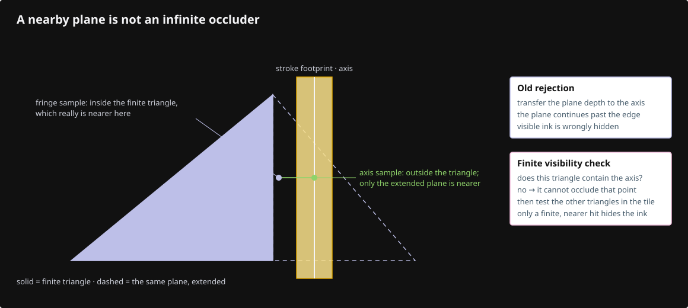

# 18 · Finite-triangle visibility

**Estimated study time: about 15–25 hours.** Includes reading, typing, tracing, testing and experiments. [How to use this estimate](map.md#time-estimates).

**This section:** Build screen-tile lists for precise triangle visibility tests.

**In the whole viewer:** This refines the surface-to-ink relationship when an infinite face plane would hide an edge outside the actual triangle.

**Follow the data:** Projected triangles → tile counts → prefix offsets → packed lists → finite visibility test.

**Start with these files:** [`src/engine/gpu/triangle_tiles.rs`](18-finite-visibility.md#code-18-014).

**Aim to explain:** What goes wrong if a triangle’s infinite plane is treated as the triangle itself?

[Whole-viewer map and course milestones](map.md)

We divide the screen into tiles so an edge tests only nearby triangles. Each tile has a count of triangles. A prefix sum turns those counts into starting offsets in one packed list. This is a small arithmetic operation with a large effect on the amount of visibility work.



Start from the working result of [step 17](17-source-presentation.md).

**One buildable step:** type the additions below in `workspace/handwritten`, then build and test. This step adds 833 lines across 9 files and may take several sittings. Individual listings are parts of this step, not separate build checkpoints.

<span id="code-18-001"></span>

## `examples/mk_triangle_visibility.rs`

Create this file. Type the complete listing, including comments and blank lines.

```rust
--8<-- "typing/code/18-001.rs"
```

<span id="code-18-002"></span>

## `src/engine/gpu/arena.rs`

Append **after line 656** of your current file.

Blank lines before: **1**; after: **0**. End with a newline.

```rust
--8<-- "typing/code/18-002.rs"
```

<span id="code-18-003"></span>

## `src/engine/gpu/instance.rs`

Append **after line 172** of your current file.

Blank lines before: **1**; after: **0**. End with a newline.

```rust
--8<-- "typing/code/18-003.rs"
```

<span id="code-18-004"></span>

## `src/engine/gpu/pass.rs`

Insert **after line 12** of your current file.

Keep these preceding lines:

```rust
pub struct Frame<'a> {
    pub view: &'a wgpu::TextureView, // the canvas
    pub clear: wgpu::Color,          // background color
    pub tier: u8,                    // drag tier; 0 is full quality
```

Keep these following lines:

```rust
}

// A pass is one optional stage of the frame, such as clipping or ambient occlusion, that owns its GPU state.
// `Lane + Any`: every pass is also a lane, and `Any` lets `pass::<T>()` find it by its type.
```

Type these new lines:

```rust
--8<-- "typing/code/18-004.rs"
```

<span id="code-18-005"></span>

## `src/engine/gpu/present.rs`

Insert **after line 58** of your current file.

Keep these preceding lines:

```rust
        // submit: the GPU starts on the recorded commands while the CPU moves on
        self.ctx.queue.submit([encoder.finish()]);
        // start reading back any pick copied this frame
        self.pick.map(); // register:shell
```

Keep these following lines:

```rust
        output.present();

        // startup marks; the GPU-side one also times the pipelines the first frames compiled
        let mut geometry = false;
```

Type these new lines:

```rust
--8<-- "typing/code/18-005.rs"
```

<span id="code-18-006"></span>

## `src/engine/gpu/present.rs`

Insert **after line 137** of your current file.

Keep these preceding lines:

```rust
        );

        self.ctx.queue.submit([encoder.finish()]);
        self.pick.map(); // register:shell
```

Keep these following lines:

```rust
        log::info!("headless frame: {draws} draws, {objects} objects, {w}x{h}");

        let slice = readback.slice(..);
        // wait for the copy to land on the CPU
```

Type these new lines:

```rust
--8<-- "typing/code/18-006.rs"
```

<span id="code-18-007"></span>

## `src/engine/gpu/present.rs`

Insert **after line 195** of your current file.

Keep these preceding lines:

```rust
        self.point_pass(&mut encoder);
        self.id_pass(&mut encoder, Some(at));
        self.ctx.queue.submit([encoder.finish()]);
        self.pick.map();
```

Keep these following lines:

```rust
    }

    /// Draw one frame and return (object, sub) per pixel; native only.
    #[cfg(not(target_arch = "wasm32"))]
```

Type these new lines:

```rust
--8<-- "typing/code/18-007.rs"
```

<span id="code-18-008"></span>

## `src/engine/gpu/render.rs`

Insert **after line 20** of your current file.

Keep these preceding lines:

```rust
            0
        } else {
            self.performance.drag_tier()
        };
```

Keep these following lines:

```rust
        self.point_pass(encoder); // register:clouds

        let frame = Frame {
            view,
```

Type these new lines:

```rust
--8<-- "typing/code/18-008.rs"
```

<span id="code-18-009"></span>

## `src/engine/gpu/render.rs`

Insert **after line 27** of your current file.

Keep these preceding lines:

```rust
        let frame = Frame {
            view,
            clear,
            tier,
```

Keep these following lines:

```rust
        };
        // pass 1: background, section caps, faces and clouds write depth
        let mut draws = self.face_passes(encoder, &frame);
        // pass 2: ambient occlusion and the outline masks, each pass in turn
```

Type these new lines:

```rust
--8<-- "typing/code/18-009.rs"
```

<span id="code-18-010"></span>

## `src/engine/gpu/render.rs`

Insert **after line 194** of your current file.

Keep these preceding lines:

```rust

    /// Draw object ids around the cursor for a pick, then copy them out.
    pub(super) fn id_pass(&mut self, encoder: &mut wgpu::CommandEncoder, at: Option<(u32, u32)>) {
        // stroke ids test against current lists; faces, discs and text need no tables
```

Keep these following lines:

```rust
        let size = (self.config.width, self.config.height);
        let mode = self.pick.mode;
        // draw only the window around the cursor, plus its halo
        let window = at.map(|position| self.pick.window(position, size));
```

Type these new lines:

```rust
--8<-- "typing/code/18-010.rs"
```

<span id="code-18-011"></span>

## `src/engine/gpu/render.rs`

Append **after line 330** of your current file.

Blank lines before: **1**; after: **0**. End with a newline.

```rust
--8<-- "typing/code/18-011.rs"
```

<span id="code-18-012"></span>

## `src/engine/gpu/surface_outline.rs`

Insert **after line 80** of your current file.

Keep these preceding lines:

```rust
    pub faces: u64,       // face selection change count
    pub size: (u32, u32), // canvas size, px
    pub samples: u32,     // MSAA samples
    pub edges: bool,      // edges shown
```

Keep these following lines:

```rust
    pub pen: u32,         // pen width bits
}

/// Which surfaces the outline goes around.
```

Type these new lines:

```rust
--8<-- "typing/code/18-012.rs"
```

<span id="code-18-013"></span>

## `src/engine/gpu/surface_outline.rs`

Insert **after line 954** of your current file.

Keep these preceding lines:

```rust
            faces: g.arena.source_faces.revision(),
            size,
            samples: g.targets.samples,
            edges: g.view.show_mesh_edges && f.tier < 2,
```

Keep these following lines:

```rust
            pen: g.view.thickness_px.to_bits(),
        };
        let stale =
            (solid && !self.solid.is_valid(&key)) || (selected && !self.selection.is_valid(&key));
```

Type these new lines:

```rust
--8<-- "typing/code/18-013.rs"
```

<span id="code-18-014"></span>

## `src/engine/gpu/triangle_tiles.rs`

Append **after line 709** of your current file.

Blank lines before: **1**; after: **0**. End with a newline.

```rust
--8<-- "typing/code/18-014.rs"
```

<span id="code-18-015"></span>

## `tests/triangle-visibility.py`

Create this file. Type the complete listing, including comments and blank lines.

```python
--8<-- "typing/code/18-015.py"
```

## Check the completed chapter

From `session_viewer`, compare everything you have typed:

```sh
npm --prefix ../session_tests run course -- reference-check 18
```

From `workspace/handwritten`:

```sh
cargo build --lib --locked -j4
cargo xtest --lib --locked -j4
```

Run the native finite-visibility tests. Follow the offsets from counting through list filling to the visibility lookup.

If one tile reads another’s triangles, check the prefix offsets and total list capacity. A zero-count tile still needs a valid offset.

**Before moving on:** explain what changed, check the expected result above, and fix any build or test failure.

<details>
<summary>Check your explanation of the opening question</summary>

The plane extends beyond the triangle’s footprint and can incorrectly occlude ink there. The finite test checks the actual nearby triangles.

</details>

[Next step: 18a](18a-instancing.md)
