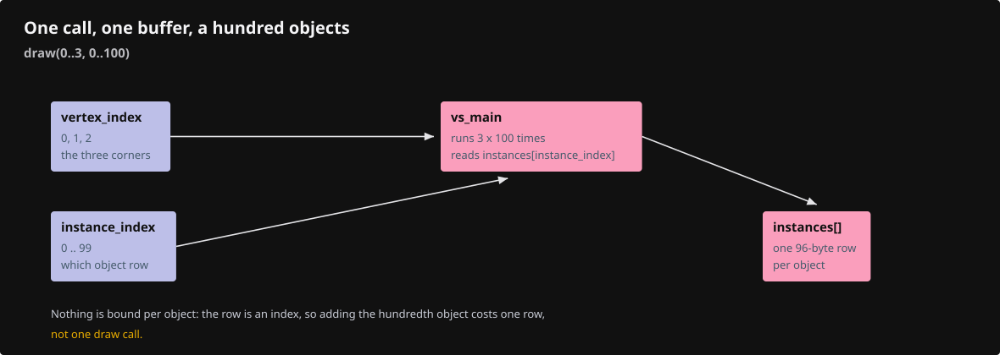

# 18a · Instancing

**Estimated study time: about 3–6 hours.** Includes reading, typing, tracing, testing and experiments. [How to use this estimate](map.md#time-estimates).

**This section:** Prepare shared geometry for drawing at multiple placements.

**In the whole viewer:** Instancing reuses shape storage while object rows keep the placements and identities separate.

**Follow the data:** Shared shape → instance placements → frame preparation → repeated geometry on screen.

**Start with these files:** [`src/engine/gpu/instanced.rs`](18a-instancing.md#code-18a-001).

**Aim to explain:** What can two identical chairs share, and what must remain separate?

[Whole-viewer map and course milestones](map.md)

Imagine a hundred identical chairs. Their shape can be stored once, with a different placement for each chair. The instancing pass prepares that shared geometry for the frame. The pass interface lets it join rendering without teaching the main loop about every instance detail.



Start from the working result of [step 18](18-finite-visibility.md).

**One buildable step:** type the additions below in `workspace/handwritten`, then build and test. This step adds 182 lines across 4 files and may take several sittings. Individual listings are parts of this step, not separate build checkpoints.

<span id="code-18a-001"></span>

## `src/engine/gpu/instanced.rs`

An instance refers to shared geometry and adds its own placement and identity. This avoids uploading the same vertices for every copy. Selection still needs to distinguish placements, even when their geometry is identical.

Create this file. Type the complete listing, including comments and blank lines.

```rust
--8<-- "typing/code/18a-001.rs"
```

<span id="code-18a-002"></span>

## `src/engine/gpu/mod.rs`

Insert **after line 12** of your current file.

Keep these preceding lines:

```rust
pub mod frame; // register:frame
pub mod glyphs; // register:glyphs
pub mod hull; // register:hull
pub mod instance; // register:instance
```

Keep these following lines:

```rust
pub mod lod; // register:lod
pub mod objects;
pub mod slots; // register:slots
```

Type these new lines:

```rust
--8<-- "typing/code/18a-002.rs"
```

<span id="code-18a-003"></span>

## `src/engine/gpu/pass.rs`

Insert **after line 104** of your current file.

Keep these preceding lines:

```rust

// Empty in the first lessons: each pass a later lesson writes adds one line here.
/// The passes in frame order. Adding one means its `Pass` impl in one file and one line here.
pub const PASSES: &[fn(&GpuCtx, Target) -> Box<dyn Pass>] = &[
```

Keep these following lines:

```rust
    super::surface_outline::pass, // register:outline
];

// `pub(super)` = visible to the parent module, `gpu`, and no further.
```

Type these new lines:

```rust
--8<-- "typing/code/18a-003.rs"
```

<span id="code-18a-004"></span>

## `tests/instancing.cjs`

Create this file. Type the complete listing, including comments and blank lines.

```javascript
--8<-- "typing/code/18a-004.cjs"
```

## Check the completed chapter

From `session_viewer`, compare everything you have typed:

```sh
npm --prefix ../session_tests run course -- reference-check 18a
```

From `workspace/handwritten`:

```sh
cargo build --lib --locked -j4
cargo xtest --lib --locked -j4
```

Run the native instancing tests. Compare the shared definition with the list of placements, then locate this pass in the pass registry.

If moving one instance moves every copy, check whether the edit changed the definition or the selected placement.

**Before moving on:** explain what changed, check the expected result above, and fix any build or test failure.

<details>
<summary>Check your explanation of the opening question</summary>

They can share the same shape data. Their placement and source identity must remain separate so each chair can be moved or selected independently.

</details>

[Next step: 18b](18b-clipping.md)
