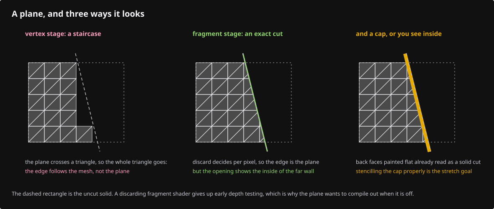

# 18b · Clipping planes and section caps

**Estimated study time: about 30–55 hours.** Includes reading, typing, tracing, testing and experiments. [How to use this estimate](map.md#time-estimates).

**This section:** Apply clipping planes and draw the cut surfaces of eligible solids.

**In the whole viewer:** Clipping is a renderer pass driven by scene-space planes, using geometry and depth information from the existing drawing paths.

**Follow the data:** Source plane → world-space cutting plane → kept surfaces and cap pass → section view.

**Start with these files:** [`src/app/clipping.rs`](18b-clipping.md#code-18b-001), [`src/engine/gpu/clip.rs`](18b-clipping.md#code-18b-004).

**Aim to explain:** Why does changing a clipping plane not mean that we have permanently split the source model?

[Whole-viewer map and course milestones](map.md)

A clipping plane separates kept space from removed space. Its normal sets the direction, and its offset sets the position. When a source plane is transformed, we derive the world plane from its transformed axes. A flattened rectangle cannot define a reliable cutting plane.



Start from the working result of [step 18a](18a-instancing.md).

**One buildable step:** type the additions below in `workspace/handwritten`, then build and test. This step adds 2,336 lines across 13 files and may take several sittings. Individual listings are parts of this step, not separate build checkpoints.

<span id="code-18b-001"></span>

## `src/app/clipping.rs`

Create this file. Type the complete listing, including comments and blank lines.

```rust
--8<-- "typing/code/18b-001.rs"
```

<span id="code-18b-002"></span>

## `src/app/inspection.rs`

Insert **after line 76** of your current file.

Keep these preceding lines:

```rust
            .iter()
            .map(|r| state.gpu.objects.anchored_model(*r))
            .collect::<Vec<_>>()
    );
```

Keep these following lines:

```rust
    snapshot["ssao"] = serde_json::json!(state.gpu.view.ssao);
    snapshot["locked_count"] = serde_json::json!(state.scene.locked.len());
    snapshot["color_count"] = serde_json::json!(state.scene.colors.len());
    snapshot["edge_color_count"] = serde_json::json!(state.scene.edge_colors.len());
```

Type these new lines:

```rust
--8<-- "typing/code/18b-002.rs"
```

<span id="code-18b-003"></span>

## `src/app/mod.rs`

Insert **after line 2** of your current file.

Keep these preceding lines:

```rust
// `pub mod x;` makes src/app/x.rs part of the crate; each lesson adds the one line of the module it teaches.
// `#[cfg(target_arch = "wasm32")]` above a line compiles that module for the browser only.
```

Keep these following lines:

```rust
pub mod cloud_query; // register:cloud_query
#[cfg(any(target_arch = "wasm32", test))] // register:decode
pub mod decode; // register:decode
pub mod feedback; // register:feedback
```

Type these new lines:

```rust
--8<-- "typing/code/18b-003.rs"
```

<span id="code-18b-004"></span>

## `src/engine/gpu/clip.rs`

A clipping plane divides space using a signed plane equation. Keeping one side removes pixels or triangles on the other side. Section caps fill the exposed cut and require additional geometry or passes; discarding pixels alone does not make a cap.

Create this file. Type the complete listing, including comments and blank lines.

```rust
--8<-- "typing/code/18b-004.rs"
```

<span id="code-18b-005"></span>

## `src/engine/gpu/clip/pipelines.rs`

Create this file. Type the complete listing, including comments and blank lines.

```rust
--8<-- "typing/code/18b-005.rs"
```

<span id="code-18b-006"></span>

## `src/engine/gpu/clip/tests.rs`

Create this file. Type the complete listing, including comments and blank lines.

```rust
--8<-- "typing/code/18b-006.rs"
```

<span id="code-18b-007"></span>

## `src/engine/gpu/mod.rs`

Insert **after line 5** of your current file.

Keep these preceding lines:

```rust
// A line tagged `register:<name>` is a registration: each later lesson adds its own line to lists like this one.
pub mod arena; // register:arena
pub mod backdrop; // register:backdrop
pub mod buffers; // register:buffers
```

Keep these following lines:

```rust
pub mod cloud; // register:cloud
pub mod device; // register:device
pub mod faces; // register:faces
pub mod frame; // register:frame
```

Type these new lines:

```rust
--8<-- "typing/code/18b-007.rs"
```

<span id="code-18b-008"></span>

## `src/engine/gpu/pass.rs`

Insert **after line 105** of your current file.

Keep these preceding lines:

```rust
// Empty in the first lessons: each pass a later lesson writes adds one line here.
/// The passes in frame order. Adding one means its `Pass` impl in one file and one line here.
pub const PASSES: &[fn(&GpuCtx, Target) -> Box<dyn Pass>] = &[
    super::instanced::pass,       // register:instanced
```

Keep these following lines:

```rust
    super::surface_outline::pass, // register:outline
];

// `pub(super)` = visible to the parent module, `gpu`, and no further.
```

Type these new lines:

```rust
--8<-- "typing/code/18b-008.rs"
```

<span id="code-18b-009"></span>

## `src/shaders/cap.wgsl`

Create this file. Type the complete listing, including comments and blank lines.

```wgsl
--8<-- "typing/code/18b-009.wgsl"
```

<span id="code-18b-010"></span>

## `src/state.rs`

Insert **after line 11** of your current file.

Keep these preceding lines:

```rust
use crate::engine::gpu::{CylinderSegment, GlyphPoint};
use crate::engine::gpu::{FrameInput, Gpu, Pick};
use crate::engine::performance::{heap_mb, now_ms};
// Each `mod` line below carries a `register` tag naming its feature; the course adds the line in that feature's lesson.
```

Keep these following lines:

```rust
mod cloud_query; // register:cloud_query
mod features; // register:features
mod text; // register:text
use features::Features;
```

Type these new lines:

```rust
--8<-- "typing/code/18b-010.rs"
```

<span id="code-18b-011"></span>

## `src/state/clipping.rs`

Create this file. Type the complete listing, including comments and blank lines.

```rust
--8<-- "typing/code/18b-011.rs"
```

<span id="code-18b-012"></span>

## `src/state/features.rs`

Insert **after line 9** of your current file.

Keep these preceding lines:

```rust
pub(crate) struct Features {
    pub(super) cloud_query: Option<crate::app::cloud_query::Query>, // a point-cloud pick in flight; register:cloud_query
    #[cfg(target_arch = "wasm32")] // register:cloud_query
    pub(super) query_generation: u64, // counts cloud queries, old answers dropped; register:cloud_query
```

Keep these following lines:

```rust
}

// Each list starts empty; a later lesson adds one line per hook.
// `fn(&mut State)` is a function pointer; a method such as `State::purge_idle` is one, with `self` as its first argument.
```

Type these new lines:

```rust
--8<-- "typing/code/18b-012.rs"
```

<span id="code-18b-013"></span>

## `src/state/features.rs`

Insert **after line 16** of your current file.

Keep these preceding lines:

```rust
// Each list starts empty; a later lesson adds one line per hook.
// `fn(&mut State)` is a function pointer; a method such as `State::purge_idle` is one, with `self` as its first argument.
/// Feature work on every frame, before the pick answers are applied.
pub(super) const BEFORE_PICKS: &[fn(&mut State)] = &[
```

Keep these following lines:

```rust
];

/// Feature work on every frame, once the pick answers are applied.
pub(super) const AFTER_PICKS: &[fn(&mut State)] = &[
```

Type these new lines:

```rust
--8<-- "typing/code/18b-013.rs"
```

<span id="code-18b-014"></span>

## `tests/clipping-mixed.cjs`

Create this file. Type the complete listing, including comments and blank lines.

```javascript
--8<-- "typing/code/18b-014.cjs"
```

## Check the completed chapter

From `session_viewer`, compare everything you have typed:

```sh
npm --prefix ../session_tests run course -- reference-check 18b
```

From `workspace/handwritten`:

```sh
cargo build --lib --locked -j4
cargo xtest --lib --locked -j4
```

Run the native clipping tests. Find the test that constructs a plane and check the expected signed side of a point. Interactive creation commands arrive in lesson 23; the GPU clipping tests you typed already exercise visible cuts and picking.

If a cut flips after a mirrored placement, check the transformed axes and cross product. Translating a normal as though it were a point is another common error.

**Before moving on:** explain what changed, check the expected result above, and fix any build or test failure.

<details>
<summary>Check your explanation of the opening question</summary>

Clipping changes what is presented. A permanent geometry split is a separate source-editing transaction that creates new model geometry.

</details>

[Next step: 19](19-sheets.md)
