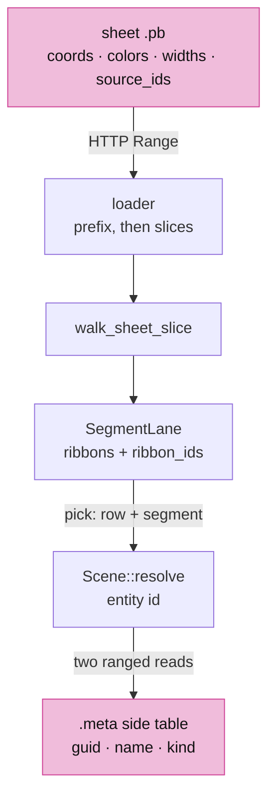
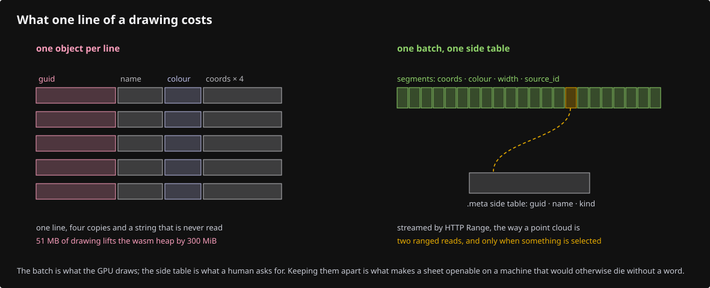
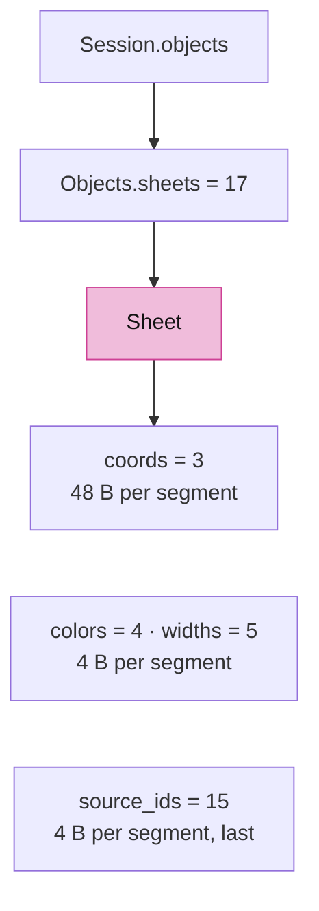
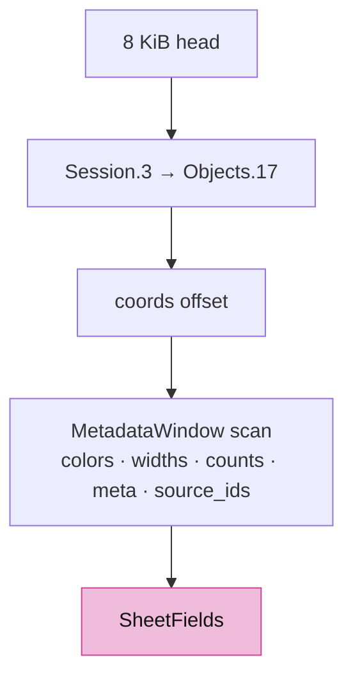
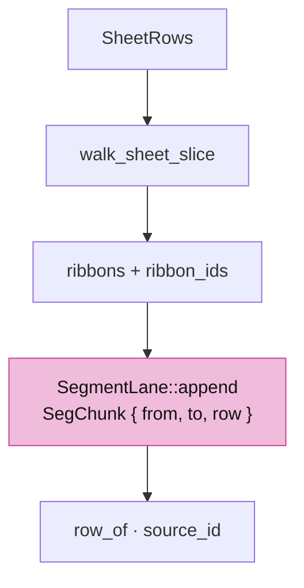
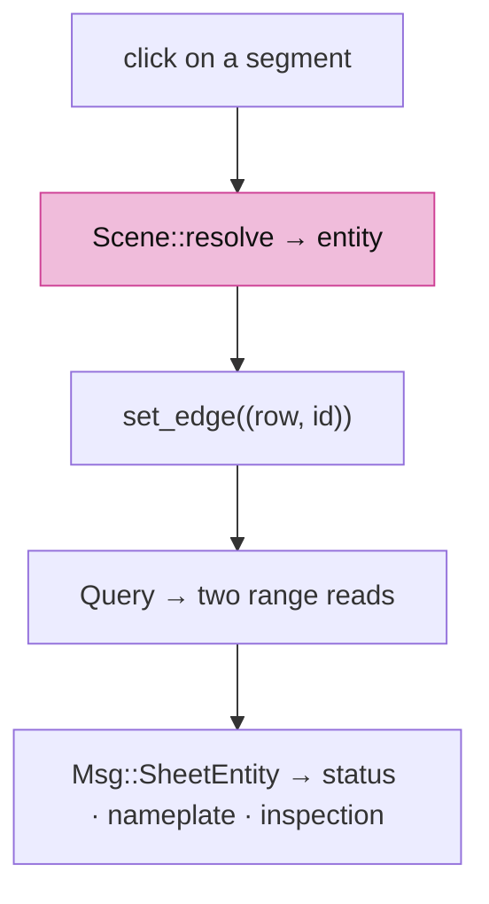

# 19 · Sheets: batched drawings with lazy metadata

## You are building

A drawing sheet is tens of thousands of lines that share one pen. Loaded as objects, each line costs a GUID string, a name, a colour and four copies of itself between the bytes and the GPU; a 51 MB sheet lifts the wasm heap by 300 MiB and an old machine dies without a word. This lesson publishes a sheet as one segment batch whose every segment carries a small source id, streams it by byte range like a point cloud, and fetches an entity's GUID, name and kind from a side table only when the entity is selected.

## Starting point

Checkpoint 18. A whole-file sheet decodes into the kernel, one object per line; streamed point clouds already locate their arrays by scanning protobuf tags and read any slice by range.

<!-- step-status: start -->

**Does it compile yet?** `cargo check` passes after steps 1–3 and 9, and fails after 4–8: a file is written across several steps, and a check can only pass once its last piece is in. Concretely, steps 4–8 build again at step 9. This is measured at the end of every step rather than guessed. And where a check passes while your new files are not yet named by a `mod` line, it is telling you only that you have not broken the previous checkpoint — the checkpoint build at the end of the lesson is the real test.

<!-- step-status: end -->

## Part A · The format

### Step 1 · A message that can be sliced

- `Sheet` mirrors `PointCloud`: the big arrays are packed fixed-width fields, so a slice of segments `[from, to)` is one HTTP Range per array. `coords` holds six doubles per segment, `colors` one RGBA8, `widths` one float in mm, `source_ids` one entity id, and `source_ids` is field 15, the last field, so a reader knows the message ends with it.
- `Objects.sheets` is field 17, the highest in `Objects`; a sheet file is a `Session` whose `Objects` holds exactly one `Sheet` and nothing else.
- The side table is not protobuf: `SHM1`, a record count, then one `(offset, length)` pair per entity and the JSON blobs. Entity id is the record index, so reading an entity costs one 16-byte read and one blob read.

<!-- file: 19 session_proto/sheet.proto copy -->

<!-- file: 19 session_proto/objects.proto copy -->

### Step 2 · The kernel tolerates the field

- The generated Rust module gains the message; the kernel's own `Objects` serializer names the new field and never reads it. A kernel that loads a sheet file sees an empty session, which is why the viewer never hands a sheet to the kernel.

<!-- file: 19 session_rust/src/proto/session_proto.rs copy -->

<!-- file: 19 session_rust/src/objects.rs copy -->

### Step 3 · The publisher

- `mk_sheet` is supplied: it loads a kernel session, walks every line, polyline and NURBS curve in world placement, samples curves with the viewer's own chord rule, and writes the sheet with its side table. A 51 MB sheet of 90 000 lines becomes a 5.5 MB batch and a 15 MB table that is never downloaded whole.

<!-- supplied: 19 -->

## Part B · Reading by range

### Step 4 · Locate every array

- `descend_message` now accepts either container: `Objects.pointclouds` at 8 or `Objects.sheets` at 17, and still requires the wanted field to close the message.
- `sheet_fields` reads the first 8 KiB, walks to `coords`, then scans the later fields through the `MetadataWindow` and records the absolute offset and length of every array plus `segment_count`, `entity_count` and the side table's name. A count that disagrees with the array lengths refuses the file.
- `fetch_sheet_slice` is four revision-checked range reads for one slice, returned as `SheetRows`.

<!-- file: 19 session_viewer/src/app/stream.rs type -->

### Step 5 · Prefix, then slices

- `sheet_prefix` sits beside `stream_prefix` and is tried right after it: a sheet is always streamed, never decoded whole. The prefix is up to 500 000 segments; `spawn_sheet_rest` continues in 500 000-segment slices under the same generation discipline as clouds and its own page-wide budget of 3 000 000 segments (`?segments=`).
- `Msg::Sheet` carries the first slice with the fields; `Msg::SheetChunk` each later one.

<!-- file: 19 session_viewer/src/app/loader.rs type -->

<!-- file: 19 session_viewer/src/lib.rs type -->

## Part C · One batch on the GPU

### Step 6 · Segments with source ids

- `walk_sheet_slice` turns a slice into ribbon segments: one `CylinderSegment` per segment, the sheet's single object row as instance, the pen from the width with 0 as the hairline, no chains, and the segment's source id beside it.
- `SegRows.ribbon_ids` travels with the ribbons; `SegmentLane::append` uploads real ids where it used to upload `u32::MAX`, and records a `SegChunk` per upload so `row_of` and `source_id` map a picked global ribbon row back to its sheet and entity. The shader already compares `source_edges` against the edge selection for both tables, so a selected entity highlights every one of its segments with no shader change.

<!-- file: 19 session_viewer/src/app/walk/sheet.rs type lines=1-65 -->

<!-- file: 19 session_viewer/src/app/walk/sheet.rs copy lines=66-109 -->

<!-- file: 19 session_viewer/src/app/walk/mod.rs type -->

<!-- file: 19 session_viewer/src/engine/gpu/segments.rs type -->

### Step 7 · One row per sheet

- `add_sheet` pushes one object row with `FLAG_SHEET` and an empty display-only document, the shape a streamed cloud uses; `extend_sheet` appends later slices. `Scene::resolve` gains a sibling of the cloud branch: a pick whose sub-id has the ribbon bit and whose row is a sheet resolves to `Picked { entity }`.

<!-- file: 19 session_viewer/src/app/scene.rs type -->

## Part D · Metadata when asked

### Step 8 · Two ranged reads

- `sheet_query` transcribes the cloud's source query: the table head is read once per sheet and cached with its ETag, then an entity costs the 16-byte record at `8 + 16 · id` and its blob, both refused if the table's revision moved. `EntityMeta` parses the JSON's guid, name, kind, width and colour; blobs over 64 KiB are refused. Dropping a `Query` cancels its callback.

<!-- file: 19 session_viewer/src/app/sheet_query.rs type lines=1-58 -->

- The side table's whole design is one line of arithmetic: record `id` sits at `8 + 16 · id`, and `record_at(count)` is where the blobs begin. That is what makes one entity cost two small reads instead of a scan.

<!-- file: 19 session_viewer/src/app/sheet_query.rs type lines=59-101 -->

<!-- file: 19 session_viewer/src/app/sheet_query.rs type lines=102-129 -->

<!-- file: 19 session_viewer/src/app/sheet_query.rs copy lines=130-244 -->

<!-- file: 19 session_viewer/src/app/mod.rs type -->

### Step 9 · Selection and the status line

- An entity pick reuses the edge selection: `set_edge((row, id))` highlights the entity's segments, the status line says "Selected entity {id}, fetching…", and `Msg::SheetEntity` replaces it with the name and kind once the reads land. The resolved entity is cached on the `SheetBatch`, so the nameplate shows its name instead of the file's. A new selection or `Clear` drops a pending query.

<!-- file: 19 session_viewer/src/state.rs type -->

<!-- file: 19 session_viewer/src/state/sheet_query.rs type -->

<!-- file: 19 session_viewer/src/app/inspection.rs type -->

<!-- check: 19 -->

## Check

<!-- checkpoint: 19 -->

Open <http://localhost:8780/?scene=view_sheets&inspect=1>. Two sheets stream in; the console reports each as "N of N segments on screen, M entities". Click a line: the status reads "Selected entity … fetching…" and within a second names the entity; `data-viewer-inspection` carries `sheet_entity` with its guid, name and kind. The wasm heap stays near 20 MiB where the same sheets as objects took 340 MiB.

## What changed

<!-- tree: 19 session_viewer/src -->

- A sheet is one object row and one draw, with a source id per segment instead of an object per line.
- Segments arrive in ranged slices under a segment budget; metadata arrives per entity, on selection, in two small reads.
- The kernel format gains `Sheet` and `Objects.sheets`; the kernel itself ignores them.

## Try

- Publish a sheet of your own: `cargo run --example mk_sheet --target x86_64-unknown-linux-gnu -- in.pb out.pb`, upload the `.pb` and `.meta` side by side, and name the `.pb` in a manifest.
- Add `&segments=200000` and watch the second sheet stop at the budget; the status line names the sheet that stayed out.
- Select an entity, then open the network panel: exactly two range requests against the `.meta` file, 16 bytes and the blob.

## Questions and answers

**The same drawing costs 340 MiB as objects and 20 MiB as a sheet. Where did the memory actually go?**

*How to work it out.* Count per line, not per drawing. As an object each line carries a GUID string, a name, a colour, a kernel object, an entry in the lookup, a tree node, a graph node — and then a copy of itself at each stage between the decoded protobuf and the GPU. Multiply by 90 000 and compare with the geometry: six doubles per line.

*The answer.* Into per-item overhead, not geometry. When a format is 90 000 of something, the per-item cost *is* the cost — which is why a sheet is one object row with a small source id per segment, and why the same file drops from 51 MB to 5.5 MB plus a side table nobody downloads whole.

**Metadata is fetched per entity, on selection, in two small reads. Why is the side table not protobuf?**

*How to work it out.* Ask how you find record number 4 000 in each format. Protobuf is a stream of tag-length-value: you must walk from the start. Now design the minimum format that supports random access: a count, then fixed-size offset/length pairs, then the blobs.

*The answer.* `SHM1` makes the entity id an index — one 16-byte read at `8 + 16 · id`, then the blob. Choosing the format from the access pattern is the lesson, not the format itself; protobuf is the right choice for the geometry arrays in the same system.

**A selected entity highlights all its segments with no shader change. How?**

*How to work it out.* Ask what the ribbon shader already does with selection: it compares each segment's `source_edges` value against the edge selection. Then ask what a sheet puts in that slot.

*The answer.* The entity id. The feature was free because an earlier lesson put "which source thing is this segment part of" in a general slot rather than an edge-specific one. That is what a good abstraction pays out — later, and without being asked.

**`descend_message` requires the wanted field to close the message. Why insist on that?**

*How to work it out.* You are locating arrays by scanning tags without decoding the payload. Ask how you know an array's length is the real one: only if the message it sits in is accounted for to its end. A prefix of a protobuf message is itself a parseable protobuf message.

*The answer.* Requiring the field to close the message proves the reader found the real end rather than a prefix that happened to parse — so a slice boundary can be trusted. A range read that guesses the end returns truncated data, and truncated geometry looks like geometry.

**What you should be able to do now**

List what genuinely had to be new for sheets, then judge whether sharing code with clouds would help. New: the `Sheet` message and its field numbers, the `SHM1` side table, `walk_sheet_slice`, the `FLAG_SHEET` row and the resolve branch. Reused unchanged: generations, budgets, ranged reads, the metadata window, query cancellation, the segment lane. A defensible judgement either way — a shared "streamed batch" abstraction would remove real duplication in the paging loop, but clouds and sheets differ in what a slice *becomes* (splat records against ribbon segments) and in what a pick means, so the abstraction would end up with a branch at every interesting point. Make your call and be able to say why.

## Next

[20 · The document](20-history.md): undo, redo and save in the kernel.
